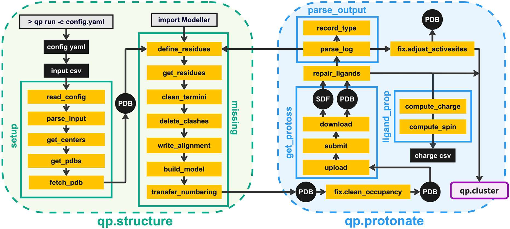
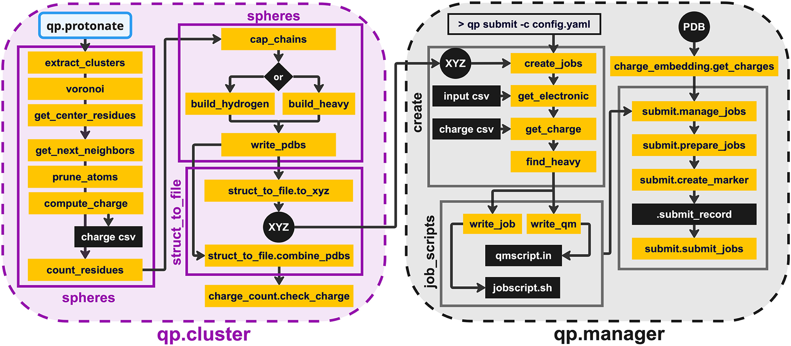
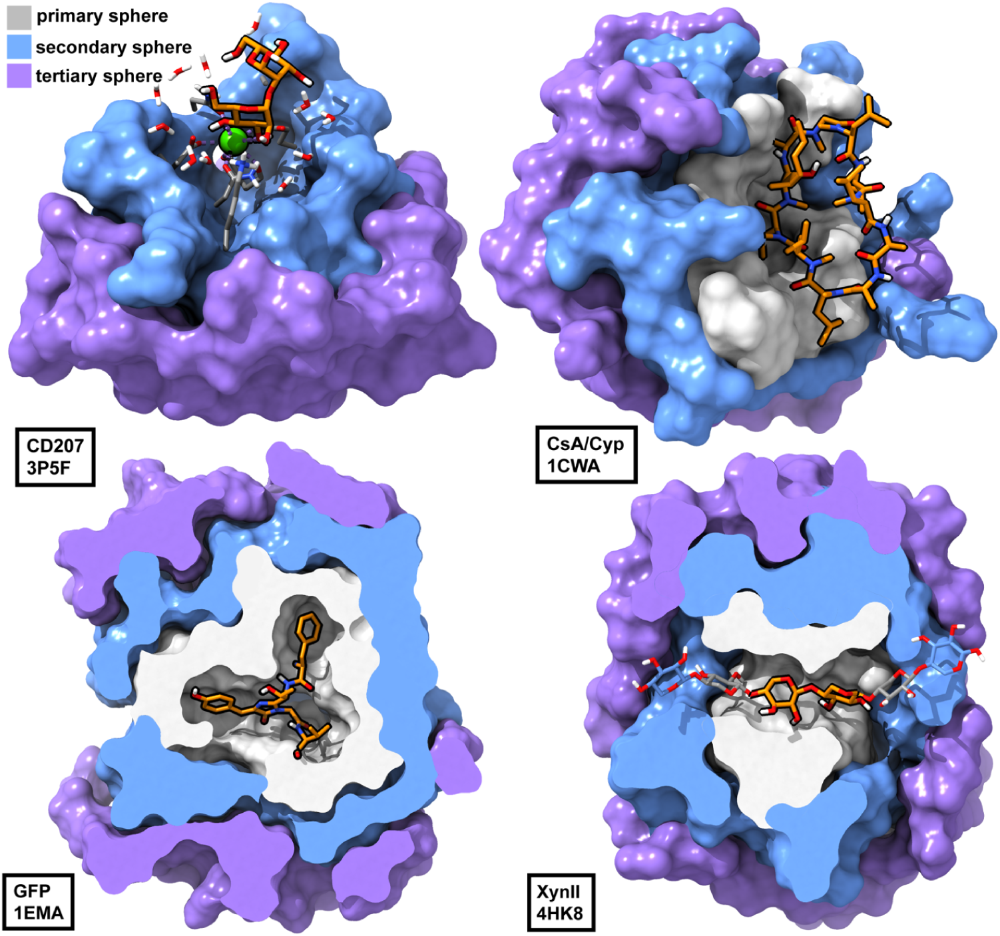
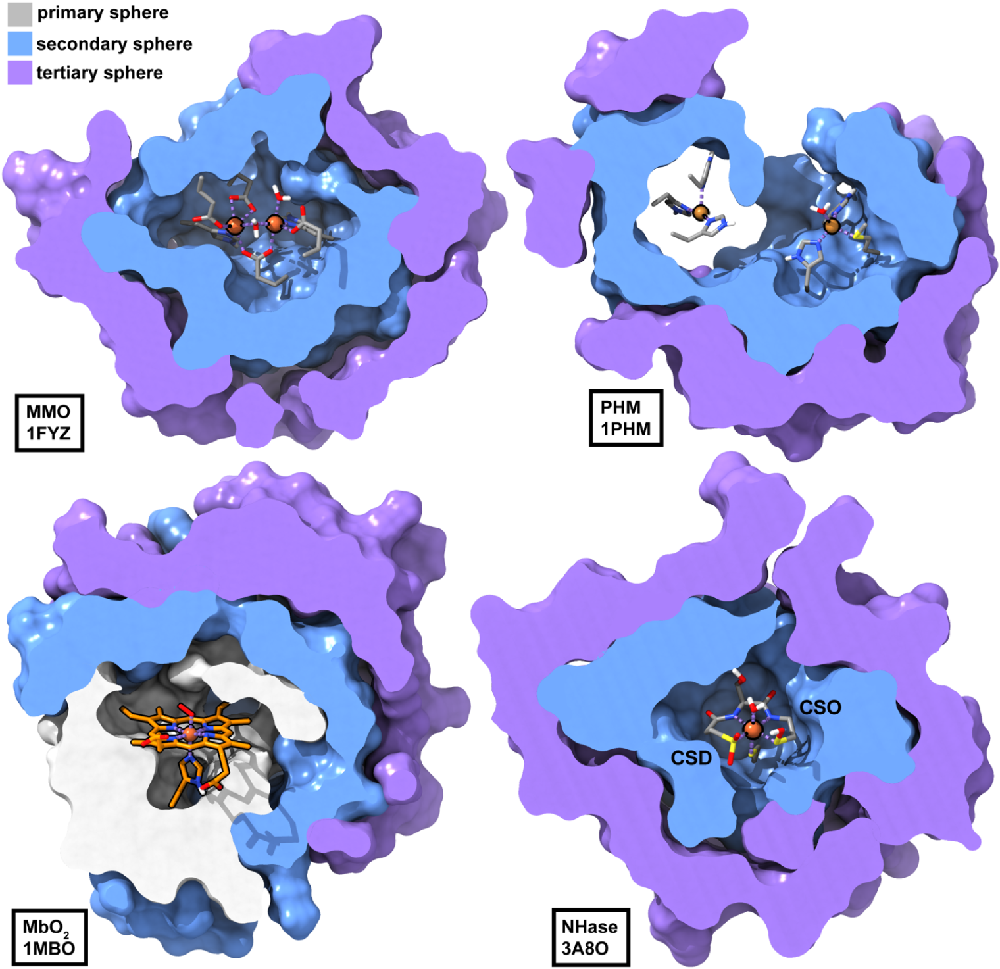

# QuantumPDB技术附录

## QuantumPDB完整模块架构

### 1. qp.structure：结构修复与标准化

功能：从本地或PDB服务器获取结构文件，执行初始结构修复

**图3：qp.structure和qp.protonate子包的架构概述**。绿色和蓝色分别表示qp.structure和qp.protonate模块，橙色框表示函数，黑色圆圈表示结构文件输入输出，黑色方框表示其他非结构文件。

**关键特性**：
- **缺失残基建模**：`get_residues`函数识别缺失残基和重原子，基于序列信息重建
- **结构补全**：用Modeller补全缺失残基、loop和重原子；氢原子添加主要由后续`qp.protonate`中的Protoss完成
- **非标准残基处理**：保留HETATM记录中的辅因子、配体等

对于金属酶，工作流采用**启发式修正策略**：重新定向组氨酸咪唑环、为Protoss不识别的非标准残基补氢，并去质子化金属配位残基。

### 2. qp.protonate：质子化状态分配

功能：用Protoss添加氢原子、枚举互变异构体并优化氢键网络，同时处理原子占有率和构象冲突

**核心算法**：
- **Protoss反馈循环**：调用Protoss添加氢原子并分配质子化状态；若Protoss因空间冲突删除残基，QuantumPDB会回到Modeller步骤删除冲突残基、重建并重新提交。
- **部分占有率处理**：`clean_occupancy`不会做坐标加权平均，而是根据中心残基优先、标准氨基酸优先、占有率更高和解析原子更多等规则，选择一套自洽构象。
- **金属中心特殊处理**：`adjust_activesites`会重定向可能误配的组氨酸咪唑环、为Protoss不识别的非标准残基补氢，并去质子化金属配位残基；可变氧化态和自旋态仍需用户输入。

**输入要求**：用户需提供可变金属的**氧化态和体系自旋多重度**，因为这些电子性质无法仅从结构数据唯一确定。

### 3. qp.cluster：基于Voronoi的簇构建

**Dummy原子正则化的作用**：

在配体结合口袋、蛋白-蛋白界面或溶剂暴露表面等**低密度区域**，Voronoi细胞几何形状会因某些方向缺乏邻近原子而变得**高度各向异性和拉长**，导致后续簇模型边界不规则。`fill_dummy`通过在蛋白周围3D网格上均匀放置dummy原子，提高镶嵌分辨率，确保形成致密、各向同性、几何规则的Voronoi细胞。

### 4. qp.manager：QM计算管理

功能：为TeraChem和ORCA创建输入文件、提交计算并监控作业状态；如果用户已有自己的调度接口，也可以关闭内置作业创建或提交步骤

**图5：qp.cluster和qp.manager子包的架构概述**。紫色和灰色分别表示qp.cluster和qp.manager模块，橙色框表示函数，黑色圆圈表示结构文件输入输出，黑色方框表示其他非结构文件。

**支持的软件包**：
- GPU加速：TeraChem
- CPU计算：ORCA
- 作业调度：SLURM和SGE；其他量子化学程序可通过绕过内置`qp.manager`或扩展模板接入

**计算设置**：
- **用户可配置项**：方法、基组、介电常数等由YAML和模板写入QM输入文件。
- **本文大规模算例**：使用GPU加速的ωPBEh-D3(BJ)/LACVP*单点能计算，而不是B3LYP-D3/def2-SVP。
- **嵌入方案**：可生成MM点电荷文件，默认从ff14SB兼容字典或用户JSON读取电荷；非标准残基、糖和辅因子若不在字典中会被排除并给出警告。
- **点电荷范围**：默认保留QM簇质心20.0 Å内的MM残基电荷，并移除距离QM原子0.5 Å内的MM原子以避免重复计数。

### 5. qp.analysis：电子性质分析

功能：从QM输出中提取和计算电子性质

**关键分析**：
- **部分电荷**：Hirshfeld、Mulliken、CM5等Multiwfn支持的电荷方案
- **偶极矩**：底物在酶环境和孤立状态下的偶极矩对比
- **电荷转移**：酶-底物复合物中的电荷流动
- **比较分析**：酶环境 vs 隐式水溶剂对底物电子结构的影响

## 灵活的中心定义策略

QuantumPDB支持**三种中心选择模式**，适应不同化学场景：

1. **高度特异性**：`[残基名]_[链ID][残基编号]`格式，指定精确的残基实例，例如`SIN_A200`
2. **通用类型**：仅基于残基类型（如FE、CU），适用于**多实例扫描**
3. **HETATM记录**：限于非标准残基（底物、辅因子），避免为每个氨基酸生成簇

**复杂场景处理**：

- **多金属中心**：`merge_cutoff_distance`参数将多个金属原子合并为单一中心
- **多残基配体**：可将整个寡糖、多肽药物定义为簇中心
- **翻译后修饰**：GFP发色团（Ser65-Tyr66-Gly67三聚体）可整体定义为中心

**图7：QuantumPDB生成的多残基中心系统QM簇模型**。（左上）C型凝集素Langerin（CD207，PDB ID: 3P5F），钙离子和结合的甘露寡糖合并为中心；（右上）环孢素A结合的亲环蛋白（PDB ID: 1CWA），整个11残基环肽定义为中心；（左下）绿色荧光蛋白（GFP，PDB ID: 1EMA），由Ser65-Tyr66-Gly67形成的翻译后修饰发色团CRO定义为中心；（右下）木聚糖酶XynII（PDB ID: 4HK8），多糖底物中两个中心木糖单元定义为中心，使模型聚焦在待切割糖苷键附近。

## 金属酶的自动处理

金属酶是QM建模的**难点和重点**。QuantumPDB针对常见金属酶类型内置**启发式修正规则**（图6）：

- **双核金属中心**：甲烷单加氧酶（MMO，PDB ID: 1FYZ）的两个铁原子可通过`merge_cutoff_distance`合并为单一中心
- **长程双铜中心**：肽基甘氨酸α-羟化单加氧酶（PHM，PDB ID: 1PHM）的两个远距离铜原子可合并
- **血红素复合物**：氧合肌红蛋白（PDB ID: 1MBO）的**铁-卟啉-O₂**和远端组氨酸可合并为中心。
- **腈水合酶**：NHase（PDB ID: 3A8O）的铁中心由主链酰胺、非标准CSO/CSD残基等配位，`adjust_activesites`会自动处理3.0 Å内金属配位主链氮的去质子化。

**图6：QuantumPDB生成的代表性金属酶QM簇模型**。（左上）甲烷单加氧酶（MMO，PDB ID: 1FYZ）的双铁中心通过合并两个铁原子定义；（右上）肽基甘氨酸α-羟化单加氧酶（PHM，PDB ID: 1PHM）的长程双铜中心通过合并两个铜原子定义；（左下）氧合肌红蛋白（PDB ID: 1MBO）的铁、卟啉和结合的O₂分子定义为中心；（右下）腈水合酶（NHase，PDB ID: 3A8O）的铁中心及其主链酰胺和非标准CSO/CSD配位环境。第一、第二、第三球层分别为灰色、浅蓝色和紫色；中心原子外描黑框，配位键用紫色虚线表示。

## 技术挑战与解决方案

### 挑战1：部分占有率处理

晶体结构中常有**alternate conformation**（AltLoc），即同一残基有多个构象选项，各带有占有率。

**QuantumPDB策略**：
- **单一构象选择**：在质子化之前必须选定一套自洽坐标，而不是保留多构象或做占有率加权平均。
- **优先级规则**：优先保留用户指定的中心活性位点残基，其次是标准氨基酸和其他残基类型；同一优先级下选择平均占有率更高、解析原子更多的构象。
- **冲突处理**：对有alternate conformation的残基建立队列，逐个检查与邻近残基的重叠，并保留优先级更高的一方。

### 挑战2：金属中心电子结构推断

金属的**氧化态和自旋态**无法仅从结构确定。

**QuantumPDB策略**：
- **用户输入**：要求用户在CSV中提供可变金属的氧化态和体系自旋多重度。
- **自动处理范围**：`ligand_prop`可处理简单离子和NO、O₂等预定义自由基物种，但不自动判定可变金属的氧化态和自旋态。
- **结构启发式修正**：对金属配位组氨酸、半胱氨酸、酪氨酸、非标准CSO/CSD残基和主链酰胺执行几何与质子化修正。

### 挑战3：簇边界加帽

切断的共价键需用氢原子或保护基封闭，避免**悬空键**。

**QuantumPDB策略**：
- **肽键切断**：用氢原子（N-H）或N-甲基乙酰胺/乙酰基封闭
- **C-N键**：`build_hydrogen`（氢帽）或`build_heavy`（NME/ACE帽）
- **金属-配体键**：通常保留在簇内，不切断

## 数据集详细构建流程

为验证QuantumPDB的**通用性和鲁棒性**，作者构建了一个高质量的holo-酶数据集：

**数据集构建流程**：

1. **PDB检索**：2024年8月6日通过PDB REST API检索7个主要EC类别，得到101,633个蛋白结构。
2. **UniProt注释**：成功识别100,300个结构对应的蛋白及底物注释。
3. **结构质量过滤**：排除疑似apo结构，仅保留X-ray结构、分辨率小于3.0 Å、带DOI，并去除原子数异常大的体系，得到57,580个候选结构。
4. **Rhea/ChEBI底物核对**：用ChEBI标识符和Rhea反应参与者确认晶体结构中配体是否为原生反应底物。
5. **最终数据集**：**989个holo-enzyme**，覆盖6个主要EC类别（translocases，EC 7除外）。

**DFT计算规模**：
- **1,673个多球层QM簇模型**（来自842个酶）
- **计算设置**：ωPBEh-D3(BJ)/LACVP* DFT单点能计算，QM区包含第一和第二相互作用球层，并加入MM点电荷嵌入。
- **对照体系**：底物单独置于介电常数$\varepsilon = 80$的隐式水溶剂中。
- **分析性质**：Multiwfn实空间部分电荷、底物片段偶极矩和酶-底物电荷转移量。
