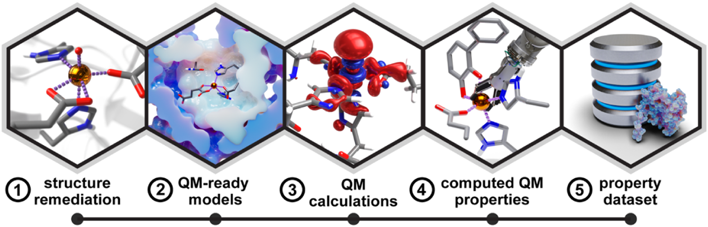
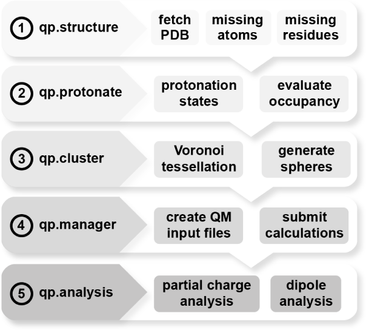
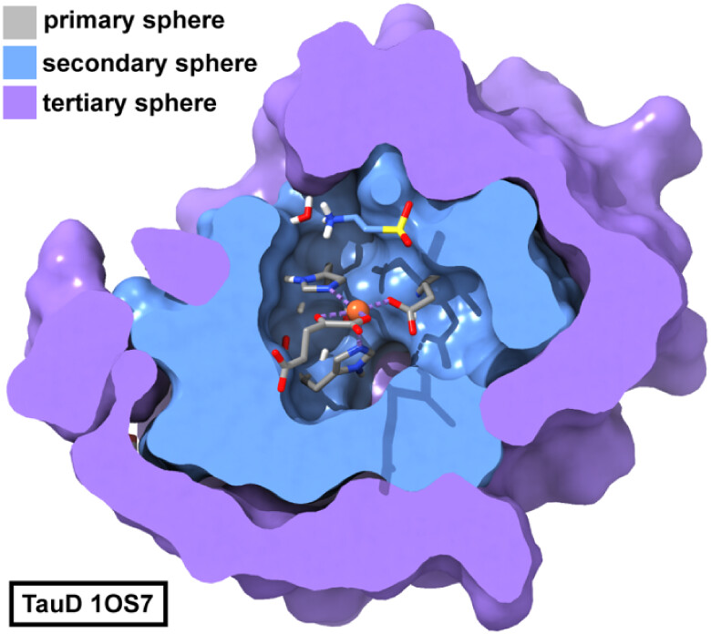
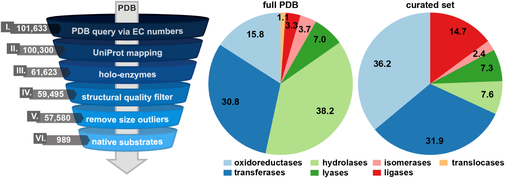
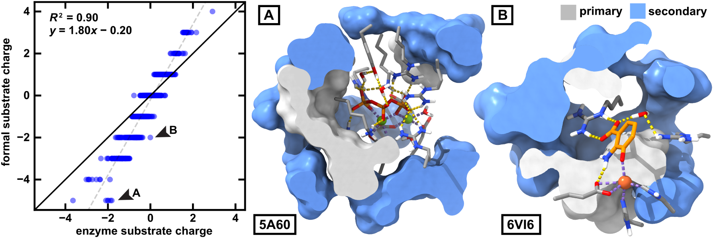
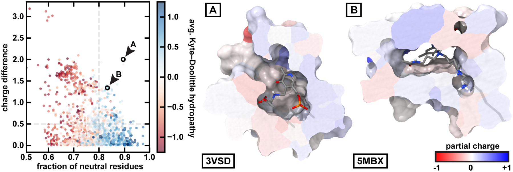

# QuantumPDB：从蛋白质结构到量子化学模型的高通量自动化之路

## 本文信息

- 标题：QuantumPDB：从蛋白质结构到量子化学模型的高通量自动化工作流
- 作者：David W. Kastner、Weiliang Luo、Wilson Ho、Clorice R. Reinhardt、Allison Keys、Heather J. Kulik
- 期刊：Journal of Chemical Information and Modeling
- 发表时间：2026年5月5日
- DOI：https://doi.org/10.1021/acs.jcim.5c03064
- 单位：美国麻省理工学院化学工程系、化学系、生物工程系和计算与系统生物学项目，Kulik实验室
- 引用格式：Kastner D W, Luo W, Ho W, Reinhardt C R, Keys A, Kulik H J. QuantumPDB: A Workflow for High-Throughput Quantum Cluster Model Generation from Protein Structures. *J. Chem. Inf. Model.* 2026, 66: 6011−6026. https://doi.org/10.1021/acs.jcim.5c03064
- 代码与数据：QuantumPDB包开源可用（GitHub：https://github.com/davidkastner/quantumPDB）；复现数据见Supporting Information和Zenodo仓库

## 摘要

> 酶的计算建模能提供催化过程的分子层面信息，但从实验结构出发准备量子力学（QM）计算，是高通量研究的**主要瓶颈**。现有自动化工具虽然能加速这一过程，却可能难以泛化到不同活性位点的化学组成和几何结构。本文提出**QuantumPDB**，这是一个Python包，可从原始蛋白质结构直接自动生成围绕活性中心的分层配位/相互作用球层，用于构建QM簇模型。该工作流整合了结构清理、质子化状态分配和QM计算设置，并使用由**Voronoi镶嵌得到的接触式相互作用球层**构建化学上有意义的模型，从而表征复杂活性位点几何。本文从PDB策展了989个holo-enzyme数据集，并对其中842个酶生成的1,673个酶簇模型进行QM计算。计算性质分析表明，DFT模拟中的酶环境会**一致地将底物电荷调向中性，并降低底物偶极矩**；即使活性位点主要由中性残基组成，这一现象也普遍存在。

**图1：酶学高通量QM研究的自动化工作流步骤**：1）结构准备，2）QM就绪结构模型生成，3）QM计算执行，4）提取计算的QM性质，5）编译QM性质数据集。

### 核心结论、创新点

- **自动化进展**：QuantumPDB实现了从PDB结构到QM簇模型的**高度自动化流程**，显著降低手工准备的瓶颈
- 基于Voronoi镶嵌的接触式球层划分，克服了距离截断法的**球形假设局限**，更合理地描述非球形活性位点
- **Dummy原子正则化**：在低密度区域填充网格dummy原子，防止Voronoi分割的各向异性，确保边界规则
- **灵活中心定义**：支持单原子、多残基复合体、特定残基组合等多种中心选择模式
- **大规模验证**：从989个holo-enzyme中，对842个酶的**1,673个簇模型**进行DFT计算，揭示酶环境对底物性质的调制效应
- **开源设计**：内置支持TeraChem和ORCA作业生成与提交，工作流也可绕过内置提交模块接入用户自己的计算调度方式
- **通用平台**：兼容QM/QM′、ONIOM等多种多尺度方法，为数据驱动的蛋白研究提供**稳健平台**

## 背景：从结构到量子模型的挑战

酶的电子结构特性涉及极化、电荷转移、局部电场和构象动力学，需要量子力学方法才能准确描述。但从晶体结构到QM计算的准备过程并不容易：

- **结构缺陷**：常有未解析区域、晶体学假象、非蛋白组分（辅因子、配体、核酸、糖、离子、水）
- **氢原子缺失**：X-ray晶体学通常不提供氢原子位置
- **金属酶复杂性**：金属中心的氧化态、自旋态和配位几何对电子环境敏感
- **手工准备瓶颈**：传统流程依赖专家经验，难以规模化

现有自动化工具能加速此过程，但难以适应不同活性位点的化学和几何多样性。

## 研究内容

### QuantumPDB的五模块工作流

QuantumPDB采用**模块化设计**，五个子包依次处理结构到计算的全流程：

**图2：QuantumPDB包的分层工作流**。五个顺序模块及其主要功能。（1）qp.structure：获取PDB文件并建模缺失原子和残基；（2）qp.protonate：分配质子化状态并评估原子占有率；（3）qp.cluster：使用Voronoi镶嵌生成相互作用球层；（4）qp.manager：创建QM输入文件并提交计算；（5）qp.analysis：对QM输出执行部分电荷和偶极矩分析。

#### 核心创新：Voronoi镶嵌驱动的簇构建

这是QuantumPDB的**核心创新**。传统方法使用球形距离截断定义簇边界，比如“只保留距离中心5 Å以内的所有残基”，但这假设活性位点近似球形，而实际上很多活性位点像裂缝、峡谷一样并不规则。QuantumPDB采用**Voronoi镶嵌**建立原子接触网络，克服了这一**球形假设局限**。

##### Voronoi镶嵌原理

想象将整个空间切割成许多个小区域，每个区域都属于距离某个原子最近的所有点。这些区域叫做Voronoi细胞。两个相邻细胞之间的公共边界叫做ridge。**关键洞察是：如果两个原子共享边界，说明它们在空间上直接接触**。

> **Voronoi镶嵌**：将空间划分为Voronoi细胞，每个细胞包含距离某原子最近的所有点。相邻细胞的共享边界（ridges）定义了原子间的**直接接触**。

##### Dummy原子正则化

在配体结合口袋、蛋白-蛋白界面等**低密度区域**（原子比较稀疏的地方），Voronoi细胞会变得很长很细，很不规则。这会导致后续的簇划分也变得不规则。

QuantumPDB的解决方案：在蛋白周围3D网格上放置dummy原子（虚拟原子），提高镶嵌分辨率，让Voronoi细胞变得致密、规则。

##### 基于接触的球层构建

QuantumPDB不是按距离，而是按“谁和谁有直接接触”来分层：

1. **计算Voronoi镶嵌**：使用SciPy库计算所有原子的Voronoi细胞
2. **构建接触网络**：从共享边界的细胞识别直接接触的原子对，建立原子级邻接表
3. **基于接触划分球层**：第一球层包含与中心直接接触的原子，第二球层包含与第一球层直接接触的原子，以此类推
4. **迭代扩展**：通过Voronoi接触网络构建连续、非重叠的球层

##### 完整簇构建流程

1. **中心定位**：用户通过`center_residues`参数指定活性位点中心
2. **Voronoi分割**：`voronoi`函数计算所有原子的Voronoi镶嵌，构建原子级邻接表
3. **Dummy原子填充**：`fill_dummy`在蛋白周围3D网格上放置dummy原子，正则化低密度区域的Voronoi细胞，防止边界各向异性
4. **球层迭代**：`get_next_neighbors`基于Voronoi接触网络构建连续、非重叠的球层
5. **簇修剪**：若指定`max_atom_count`，`prune_atoms`系统移除最远残基直到原子数低于阈值
6. **边界加帽**：`cap_chains`用氢原子或N-甲基乙酰胺（NME）/乙酰基（ACE）封闭切断的肽键

**图4：TauD（PDB ID: 1OS7）的接触式簇模型**，由qp.cluster子包生成。第一球层用棍状模型显示（灰色），第二球层和第三球层分别用蓝色和紫色表面表示。

**Voronoi镶嵌的优势**：

- **几何自适应**：基于实际原子接触网络，自然适应非球形活性位点
- **化学意义明确**：球层定义基于**直接相互作用**，而非任意距离
- **可正则化**：dummy原子填充确保低密度区域的鲁棒性
- **跨链适用**：算法适用于多肽链，寡聚酶界面处的残基可正确纳入

### 大规模验证：989个酶的DFT计算

为验证QuantumPDB的**通用性和鲁棒性**，作者构建了一个高质量的holo-酶数据集（图8）：

**图8：holo-酶数据集的自动策展工作流**。（左）漏斗图展示了对PDB结构应用的顺序过滤流程，罗马数字（I−VI）表示每个阶段，左侧显示每步的PDB结构数量；（中）饼图显示从PDB初步提取的所有酶的EC分类组成，与（右）筛选反应参与者后的最终酶集合的EC分布对比。

**holo-enzyme数据集构建流程**

| 步骤 | 数据来源/过滤标准 | 结果 |
| --- | --- | --- |
| 1 | 2024年8月6日通过PDB REST API检索7个主要EC类别 | 101,633个蛋白结构 |
| 2 | UniProt注释匹配 | 保留100,300个可识别蛋白及其底物注释的结构 |
| 3 | 排除apo结构、仅含缓冲液/离子/金属/常见辅因子的HETATM条目 | 61,623个配体结合结构 |
| 4 | 仅保留X-ray结构、分辨率小于3.0 Å、带DOI，并排除异常大体系 | 57,580个高质量候选结构 |
| 5 | 用ChEBI和Rhea核对晶体结构配体是否为反应参与者 | **989个holo-enzyme**，覆盖除EC 7外的6个主要EC类别 |

**DFT计算规模**

| 项目 | 数值/设置 |
| --- | --- |
| QM簇模型总数 | **1,673个**多球层模型（来自**842个酶**） |
| DFT方法 | GPU加速的`ωPBEh-D3(BJ)/LACVP*`单点能计算 |
| 嵌入方案 | 第一、第二相互作用球层作为QM区，外围加入MM点电荷嵌入 |
| 对照环境 | 底物单独置于隐式水溶剂，介电常数$\varepsilon = 80$ |
| 分析性质 | **Multiwfn**计算实空间部分电荷，qp.analysis计算底物片段偶极矩 |

### 核心发现：酶环境的调制效应

**DFT计算的主要发现**

| 观察现象 | 定量结果 | 物理意义 |
| --- | --- | --- |
| 电荷被削弱 | **381/1,673个模型**（23.1%）中底物电荷与形式电荷偏差小于0.1 e，但**大多数偏差更大**；整体趋势是电荷被削弱，更接近中性 | 酶环境通过极化和电荷转移改变底物电子结构 |
| 偶极矩减小 | 酶环境中底物偶极矩比隐式溶剂中**一致降低** | 酶通过具体残基排布调节电荷分布，不是简单均匀介质 |
| 普遍存在 | 主要由中性残基组成的活性位点也显示电荷转移 | 累积静电势来自三维空间排布，不只是少数带电残基 |

**图9：酶与底物之间的电荷转移**。
- （左）底物在隐式溶剂中的电荷与在酶活性位点中的电荷奇偶图；黑色实线表示完全一致，灰色虚线表示最佳拟合线。（中）例A为PDB ID: 5A60活性位点，展示从底物发生的电荷转移；（右）例B为PDB ID: 6VI6活性位点，同样展示从底物发生的电荷转移。
- 在例A和例B中，第一相互作用球层显示为灰色表面，关键相互作用残基显示为棍状模型，第二球层显示为蓝色表面。
- 氢键为黄色虚线，配位键为紫色虚线。原子颜色编码：蛋白碳为灰色，底物碳为橙色，氮为蓝色，氧为红色，硫为黄色，磷为橙色，铁为深橙色，镁为绿色，氢为白色。

**图10：活性位点组成与底物电荷转移的关系**。
- （左）所有球层的底物电荷差与FNR（中性残基分数）的散点图。点颜色表示活性位点残基的平均Kyte-Doolittle疏水性，蓝色更疏水，红色更亲水。灰色虚线标记FNR = 0.8和电荷差 = 0.5作为通用截止值。两个例子圈出并标记：A（PDB ID: 3VSD）和B（PDB ID: 5MBX）。
- （中）3VSD和（右）5MBX的活性位点，底物显示为棍状模型，蛋白表面按每个残基的Hirshfeld部分电荷之和着色，颜色尺度为-1红色、0白色、+1蓝色。
- 原子颜色编码：碳为灰色，氮为蓝色，氧为红色，硫为黄色，磷为橙色，铁为深橙色，镁为绿色，氢为白色。

> 这组结果有意思：**中性和疏水并不等于没有电子效应**。3VSD和5MBX这类体系中，活性位点表面整体以中性残基为主，只有少量局部区域带有明显Hirshfeld电荷，但底物仍发生可观的电子密度重分布。**起作用的不只是某几个带电残基，而是活性位点三维排布形成的累积静电势**。

偶极矩分析给出了另一个独立维度。**底物在酶环境中的偶极矩比在隐式溶剂中一致降低**，但这一变化与电荷差没有明显相关性（Pearson $r = 0.02$）。**不同酶环境可能分别调节底物的净电荷转移和电荷空间分布**，二者并不等同。

---

## 关键结论与批判性总结

### 潜在影响

QuantumPDB通过自动化QM簇模型构建，为大规模蛋白质研究提供了稳健平台。对989个酶的DFT计算揭示了酶环境对底物电子结构的调制效应，为理解酶催化机理提供了定量视角。

### 主要局限

- **金属电子态仍需用户指定**：金属氧化态和自旋态无法由结构唯一决定，需要用户在CSV中提供
- **结构准备有适用边界**：Modeller不能补全底物或非标准辅因子中的缺失原子，Protoss识别不了的非标准残基需要启发式修正
- **静态结构限制**：基于晶体结构单点分析，不一定处于真正的机制构象
- **溶剂与反应坐标简化**：计算为单点能性质分析，不是完整反应路径；原始PDB中的水会被纳入球层，但工作流不会自动补水

### 未来方向

- **集成MD模拟**：结合分子动力学采样或多构象筛选，考虑构象柔性
- **机器学习增强**：利用ML模型预测金属中心电子结构，减少用户输入
- **显式水与反应路径**：在关键体系中加入显式水、构象采样和反应路径计算

### 批判性总结

QuantumPDB成功解决了从PDB结构到QM计算的关键瓶颈。Voronoi镶嵌驱动的簇构建和dummy原子正则化是对传统球形截断法的改进，特别适合处理复杂、非球形的活性位点。大规模DFT计算验证了酶环境对底物电荷和偶极矩的调制效应，为理解酶催化的静电调控机制提供了定量支持。随着与MD模拟、机器学习和显式溶剂模型的结合，QuantumPDB有望成为数据驱动酶学研究的核心平台。

---

**更详细的技术细节、方法说明和完整结果分析请参阅附录文档**。
