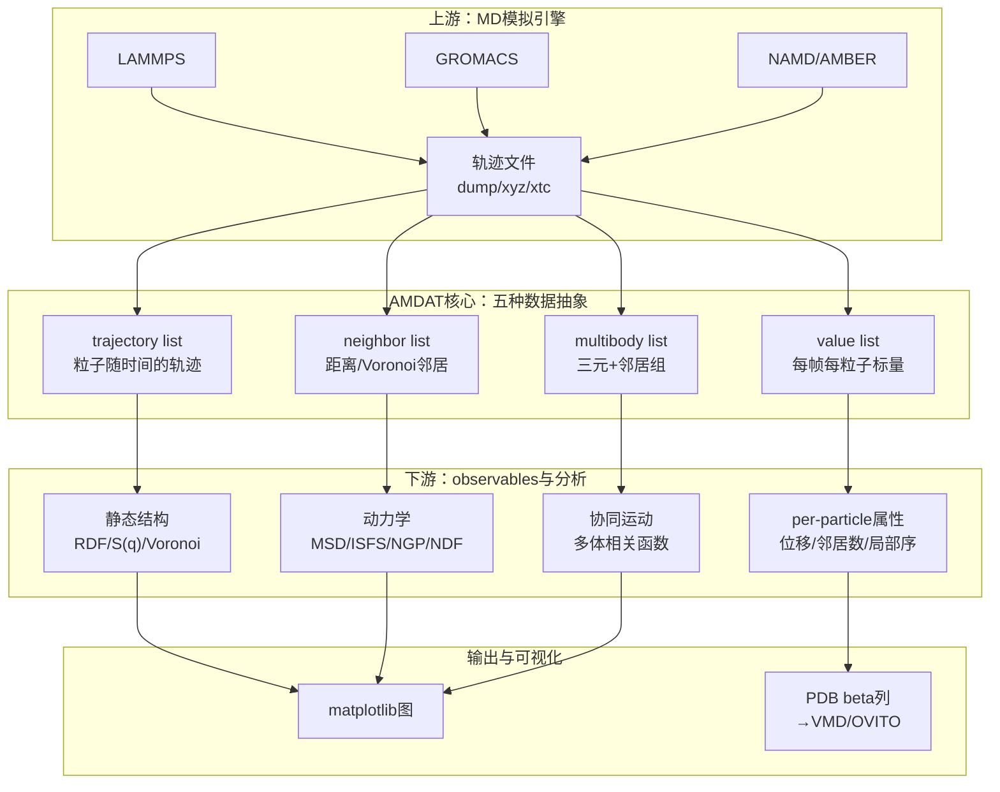
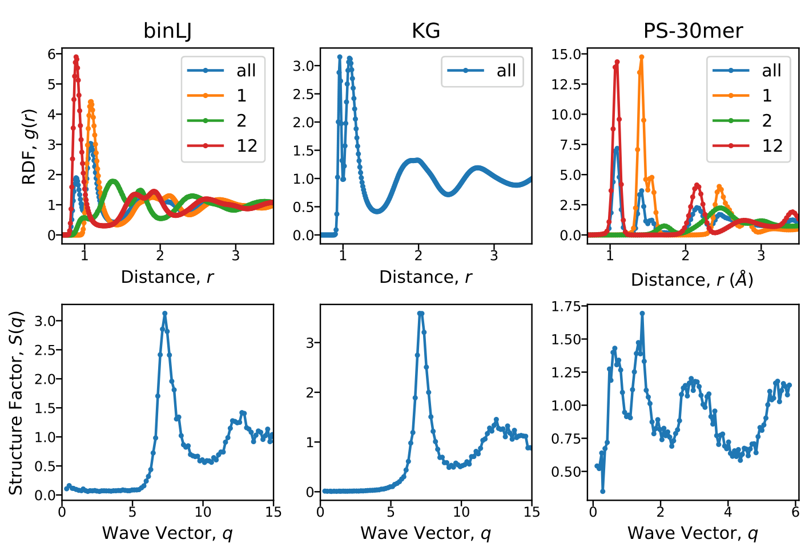
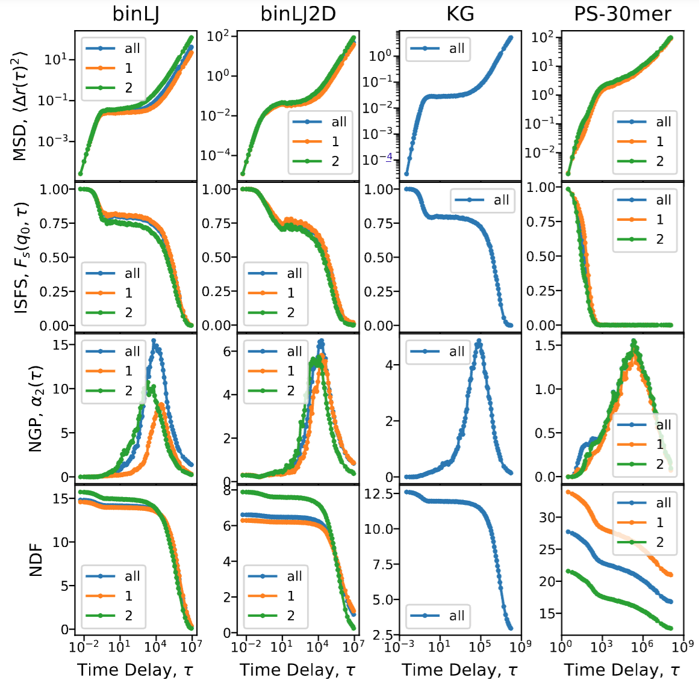
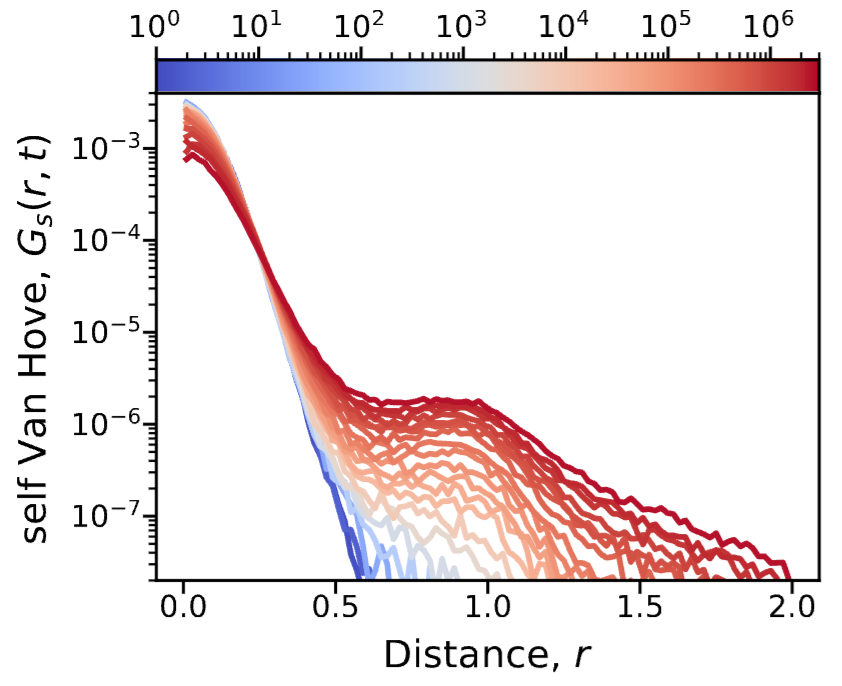
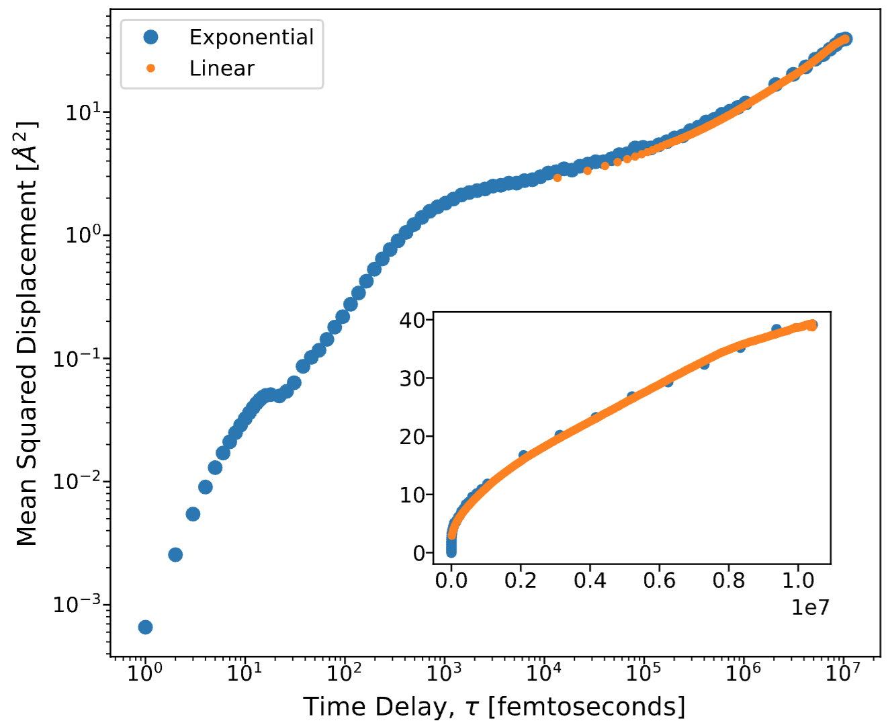
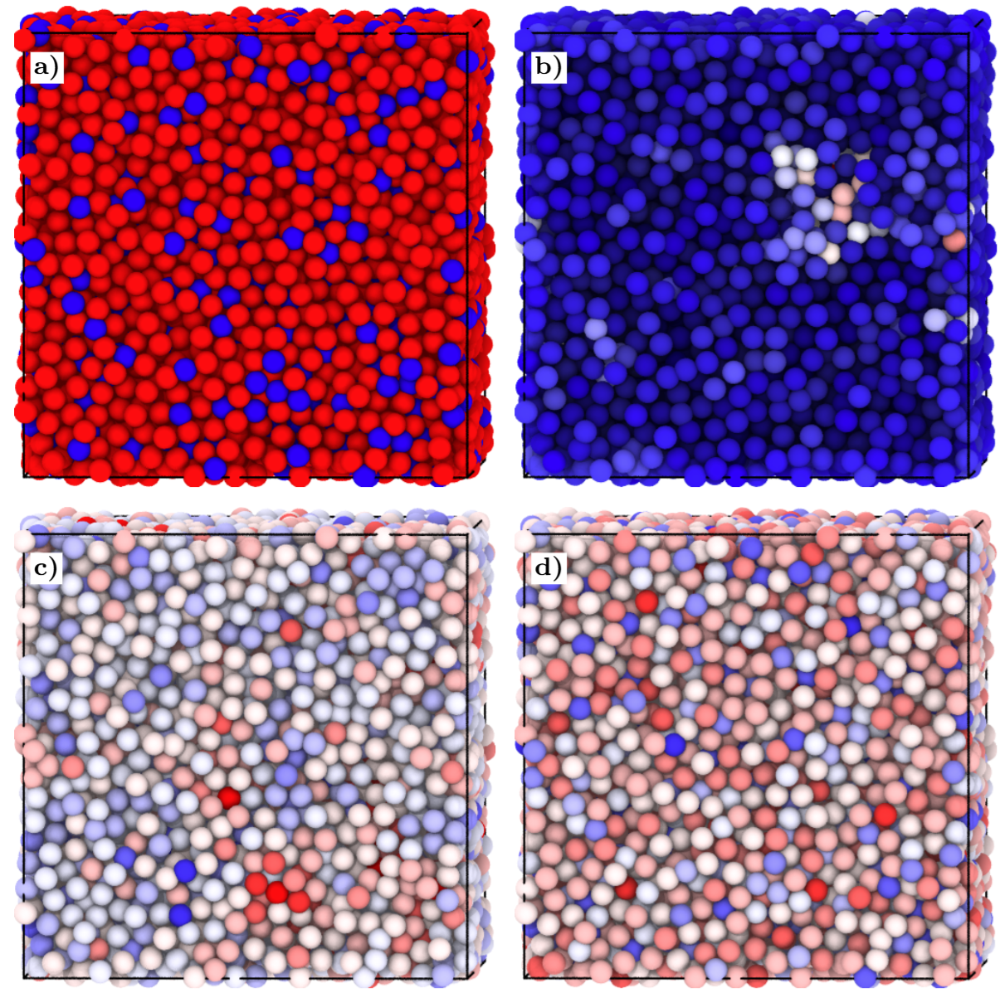
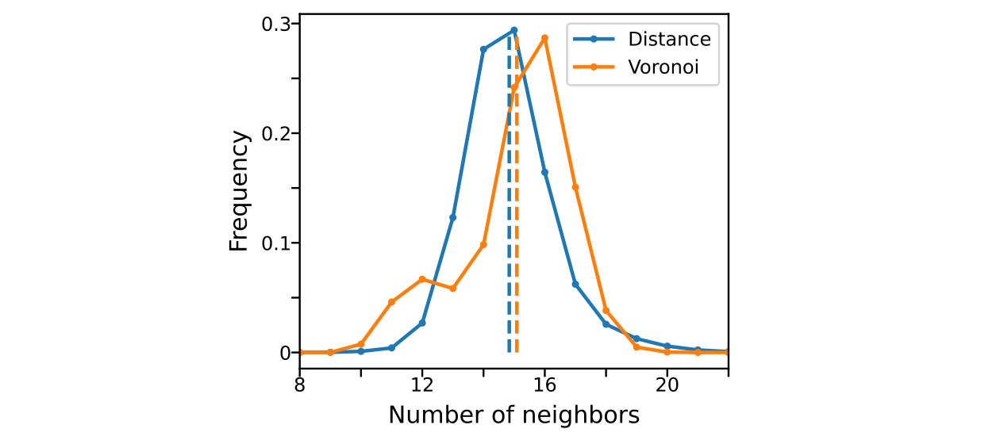

# AMDAT 面向过冷液体与玻璃态体系的长时标MD分析工具

## 本文信息
- **标题**：AMDAT: An Open-Source Molecular Dynamics Analysis Toolkit for Supercooled Liquids, Glass-Forming Materials, and Complex Fluids
- **作者**：Pierre Kawak, William F. Drayer, David S. Simmons
- **发表时间**：2026年2月5日（arXiv预印本）
- **DOI**：https://doi.org/10.48550/arXiv.2602.05865
- **单位**：南佛罗里达大学化学、生物与材料工程系（美国）；宾夕法尼亚大学材料科学与工程系（美国）
- **引用格式**：Kawak, P., Drayer, W. F., & Simmons, D. S. (2026). AMDAT: An Open-Source Molecular Dynamics Analysis Toolkit for Supercooled Liquids, Glass-Forming Materials, and Complex Fluids. *arXiv:2602.05865*. https://doi.org/10.48550/arXiv.2602.05865
- **代码仓库**：https://github.com/dssimmons-codes/AMDAT
- **开发者文档**：https://dssimmons-codes.github.io/AMDAT

## 摘要
> AMDAT（Amorphous Molecular Dynamics Analysis Toolkit）是一个**开源C++工具包**，用于对分子动力学（MD）轨迹进行后处理，重点支持**非晶态、玻璃态与聚合物材料以及复杂流体（包括过冷液体）的高性能静态与动态分析**。本文介绍AMDAT的两条核心设计，**内存中的轨迹处理**与**指数时间采样**如何使长时标分析变得高效，并展示其在几类常用物理量上的代表性工作流，包括**径向分布函数**（**RDF**）、**结构因子**、**中间散射函数**（**ISFS**）以及**邻居相关函数**。

### 核心结论
- **聚焦非晶态体系**：AMDAT专为过冷液体、聚合物、玻璃态和复杂流体的结构与动力学分析设计，**避开了通用分析包在长时相关函数与多组分体系上的短板**
- **内存加载 + 指数时间采样**：整条轨迹一次性读入内存，**短时密集采样、长时指数变粗**，可在不显著增加文件体积的前提下覆盖**多个数量级**的时间窗口
- **模块化数据抽象**：以`trajectory list`、`trajectory bin list`、`neighbor list`、`multibody list`、`value list`五种核心对象为基石，可自由组合、过滤、构造新分析，无需修改内核代码
- **覆盖面广的observables**：RDF、S(q)、ISFS、自Van Hove函数、邻居去相关函数、非高斯参数等一应俱全，**长期作为Simmons组的内部工具支撑多项聚合物与过冷液体研究**
- **格式与脚本友好**：原生支持LAMMPS dump/xyz，对GROMACS xtc支持有限；输入脚本支持循环、条件、变量赋值，方便批处理和复用

## 背景

过去30年分子动力学模拟方法学已相当成熟，**GROMACS、LAMMPS、NAMD、AMBER、HOOMD-blue、OpenMM**等主流引擎在速度、可扩展性、力场支持上持续完善。但分析端是另一回事。通用工具（如MDAnalysis、OVITO）覆盖面广却偏通用，专门为非晶态、玻璃态、复杂流体设计的分析包仍然稀缺。这类体系的弛豫时间极长，传统线性采样的轨迹在长延迟处几乎没有可用帧对，而短延迟处又严重过采样；RDF/S(q)等结构量看似成熟，但**邻居判定标准、Voronoi vs 距离截断的差异、长时自相关函数的统计**这些细节往往需要研究者自己写脚本。

AMDAT正是Simmons组在长期研究过冷液体和聚合物玻璃化的过程中逐步搭建起来的工具集，**已在多个已发表研究中应用**（如参考文献21、22、23的纳米复合材料体系）。本文首次系统介绍了它的设计哲学、核心抽象、输入脚本和典型用例，并将其在四个代表体系上展示：**3D/2D二元Lennard-Jones液体**、**Kremer–Grest**（KG）粗粒化聚合物链、**30mer聚苯乙烯熔体**（PS-30mer）。

> AMDAT在工具谱系中的位置是**MD引擎的下游分析端**。LAMMPS/GROMACS跑出来的轨迹，经过它转译成物理学家能读懂的图与数。在过冷液体、玻璃化转变、聚合物慢弛豫这些动辄跨越十余个数量级的领域，一个能"指数地看时间"的分析包几乎是刚需。

### 关键科学问题

- **长时标采样的统计瓶颈**：在玻璃态体系中，结构弛豫时间$\tau_\alpha$可达微秒甚至秒级，线性采样会让长延迟处几乎无帧可用；如何在不爆盘的前提下让MSD、ISFS等长时相关函数获得稳定的统计？
- **缺乏结构判据的非晶态局部环境量化**：非晶态结构没有明确定义的"活性位点"，**局部邻居环境的拓扑与动力学**却直接决定玻璃化行为，如何在统一框架下系统追踪这些"动态邻居"？
- **多组分体系中的species分辨分析**：二元甚至三元非晶态体系的快慢组分、动态不均匀性、空间关联长度都需要**按物种切片**的观察能力，通用工具的多组分支持往往不够顺手
- **可复现的分析管线**：玻璃态模拟的数据量极大（GB-TB级），**用脚本描述完整分析流程**是确保可复现性的前提

### 创新点

- **指数时间采样**（Exponential time sampling）：默认按指数方式采样帧，短时密、长时疏，**覆盖时间窗口比线性方案多两个数量级以上**，却只需同等帧数。这是AMDAT相对通用工具最大的方法学优势
- **以"列表"为核心的模块化数据抽象**：四种基本列表对象（trajectory / neighbor / multibody / value）**可叠加、可过滤、可重用**，让新分析能在不修改核心代码的前提下"装配"出来
- **全面的per-particle可观测通道**：每个原子的位移、邻居数、邻居去相关率、位移分布等都可输出为PDB/xyz等格式的per-atom列，**直接接入VMD、OVITO等可视化工具**
- **多年沉淀的observables库**：RDF、S(q)、ISFS、NGP、NDF、Van Hove、邻居去相关等**已在多项已发表研究中验证**（如参考文献21、22、23的聚合物纳米复合材料），对非晶态研究者几乎是"开箱即用"

---

## 研究内容

### 一、设计哲学与软件架构

AMDAT采用**内存中处理 + 面向对象 + 脚本化**的设计路线。运行时将整条轨迹读入内存以避免反复IO，核心C++类层级覆盖粒子（`particle`）、分子（`molecule`）、体系（`system`）与轨迹（`trajectory`），分析逻辑与数据存储解耦，便于扩展。

五种核心数据对象是AMDAT抽象的精华：

- **`trajectory list`**：一组粒子随时间的轨迹，可静态（固定粒子集）或动态（成员随时间变化的邻居集）
- **`trajectory bin list`**：按空间坐标分箱的trajectory list变体，**支持空间分辨的界面、梯度、局部动力学分析**
- **`neighbor list`**：基于距离截断或Voronoi剖分构建的邻居集合（`value list`的特化子类）
- **`multibody list`**：三元及以上的高阶邻居集合，用于分析协同运动
- **`value list`**：每个粒子/分子在每帧的标量值，可来自轨迹文件、邻居计算或前序分析

> 输入脚本的一个简化示例（KG聚合物链体系）：声明`<system>`含A、B两类原子、`<composition>`定义链结构、`<time scheme>`设为`exponential`、然后调用`read_trajectory`加载dump文件，**随后的`compute_rdf`、`compute_isfs`等调用就自动按物种、按时间窗统计**。完整示例可在AMDAT仓库的`tutorials/`目录找到。

> 设计的核心思想：**这五种对象像乐高积木，分析程序就是把它们堆起来的过程**。例如"按物种1的邻居去相关率"可以这样组装：先从trajectory list选species 1 → 计算邻居形成neighbor list → 沿时间窗算邻居数变化 → 输出value list。**每一步的中间产物都可重用、可视化、可继续叠加新分析**。

输入脚本格式包含四个块：`<system>`声明体系参数、`<composition>`声明分子构成、`<selection>`块构造数据对象、`<analysis>`块定义可观测量的计算并输出。`<time scheme>`行支持`snapshot`、`linear`、`exponential`三种采样模式，对玻璃态研究来说**指数采样几乎是必备**。

### 二、代表性体系与静态observables

AMDAT在四个基准体系上演示了完整工作流：**3D二元Lennard-Jones**（binLJ）、**2D二元Lennard-Jones**（binLJ2D）、**Kremer–Grest聚合物链**（KG，$T^* = 0.3854$、弛豫时间$\sim 10^{6.88}\,\tau_\text{LJ}$、400条链每条20个珠子，NPT系综）、**30mer聚苯乙烯熔体**（PS-30mer，OPLS力场、13978个原子、T = 483 K）。

**图1：三个体系的静态结构表征**。上行为径向分布函数$RDF(r)$，下行为静态结构因子$S(q)$。binLJ（左）和PS-30mer（右）的RDF按"全粒子/物种1/物种2/物种1-2对"分开绘制，**颜色：蓝=all、橙=1、绿=2、红=12**。KG（中）只显示全粒子RDF，因为它是单组分系统。S(q)三体系均按全粒子计算，**展示RDF与S(q)在不同波数/距离尺度上的互补信息**。

RDF细节反映了各体系局部结构的不同：binLJ的1-1对RDF首峰尖锐，KG的RDF呈现典型的玻璃态分裂第二峰，PS-30mer的RDF则因链内/链间混合而峰位更宽。**S(q)从倒空间给出长程序信息**，对非晶态的"中程有序"非常敏感。

### 三、动态observables：动力学多尺度

**图2：四体系（binLJ、binLJ2D、KG、PS-30mer）从上到下的四种动力学可观测**。**MSD**（均方位移）刻画扩散和亚扩散行为，binLJ2D的MSD在所有时间尺度上保持低斜率，**呈现典型的二维玻璃动力学**；PS-30mer在长延迟处出现Rouse-like或 reptation斜率。**ISFS**（self中间散射函数，$F_s(q, \tau)$）在对应近邻距离的波数$q^*$处计算，binLJ和PS-30mer能清晰看到$\alpha$-弛豫平台，KG在长延迟处尚未完全弛豫。**NGP**（非高斯参数$\alpha_2(\tau)$）的峰值位置标识**动态不均匀性最强的时间尺度**，binLJ2D的峰值最高，说明二维体系动态异质性最显著。**NDF**（邻居去相关函数）追踪局部环境在时间上的"换边"速度，**短时平台反映笼蔽效应**，长时衰减反映$\alpha$-弛豫。**颜色：蓝=all、橙=1、绿=2**，按物种切片。

> 一个核心观察：**KG在MSD和ISFS里都呈现亚扩散行为（log-log斜率 < 1）**，NDF衰减也慢。三张图互相印证这是典型的过冷液体"笼蔽态"，是玻璃化转变前夜的标志。

### 四、自Van Hove函数与跳跃扩散

除MSD和ISFS外，**自Van Hove相关函数**$G_s(r, \tau)$是另一种描述粒子扩散路径的常用工具。它统计在延迟$\tau$后粒子从初始位置移动距离$r$的概率分布，**与MSD的"均方根位移"视角互为补充**：MSD给出平均距离，Van Hove给出整个分布形状，**对识别跳跃扩散、协同运动等非高斯特征特别敏感**。

**图3：KG体系的自Van Hove相关函数**$G_s(r, \tau)$。图中以**等时曲线**形式展示，横轴为距离$r$，纵轴为概率密度，**颜色从蓝到红表示延迟时间$\tau$的增大**（$\tau$范围从$10^2$到$10^6$）。**短延迟（蓝）的曲线在$r \approx 0$附近最尖锐**，粒子还没怎么动；**长延迟（红）的曲线出现明显的次峰**（约在$r \approx 0.5$到$1.0$处），反映**笼蔽解除后粒子跳到邻近笼子的过程**。这是过冷液体区别于简单液体的关键指纹。普通液体的Van Hove函数始终是高斯形，过冷液体则呈现**"主峰+次峰"的双峰特征**。

> Van Hove函数与MSD的关系：**MSD是$G_s(r, \tau)$的二阶矩**，但二阶矩对双峰分布不敏感。**双峰特征恰恰揭示了"短时笼内振动 + 长时笼间跳跃"的两段式扩散**，这是玻璃化研究最关心的微观图像。

### 五、指数时间采样的优势

AMDAT默认采用指数时间采样，**短时帧密集、长时帧稀疏**，每个时间块内固定起始帧数、所有延迟的统计质量相当。**这比线性采样用同等帧数能多覆盖两个数量级的时间范围**，且长延迟处的统计误差不会因帧对数衰减而爆炸。

**图7：PS-100mer同一模拟分别用线性（橙）和指数（蓝）采样得到的MSD**。**主图是双对数坐标**，覆盖约七个数量级的时间窗口；**插图是线性坐标**，聚焦中长延迟。指数采样在**短延迟（$\tau < 100$ fs）能解析笼蔽平台的精细结构**，这段对应粒子被"困"在局部邻居环境中、主要做振动运动的区域；线性采样在这段出现明显欠采样。在$\tau \sim 10^3 - 10^5$ fs的扩散区，**两者结果完全重合**，印证指数采样不引入系统偏差，只重分配采样密度。在长延迟末端（$\tau \to 10^7$ fs）指数采样仍有可用的少数帧，线性采样在此处已无帧对可用。

> 简单地说：**线性方案是"每个时间点采一样多"，指数方案是"对数坐标上每个时间点采一样多"**。对玻璃态这种弛豫时间跨越数个数量级的体系，**后者才是真正贴合物理需求的采样**。

### 六、Per-particle可视化与邻居分析

AMDAT能把每个粒子的位移、邻居数、Voronoi邻居数等作为pdb的beta列导出，**直接用VMD或OVITO着色显示**，对识别动态不均匀性、空间异质性、协同运动区域非常有帮助。

**图4：3D二元Lennard-Jones（binLJ）同一快照按四种per-particle属性着色**。
- **（a）原子类型**：红=物种1、蓝=物种2，两种粒子在空间上**基本均匀混合**
- **（b）1211.42$\tau_{LJ}$时间内的位移**：颜色从白（几乎没动）到深蓝（位移大），**亮点（深蓝）是"快粒子"，对应动态不均匀性最显著的局部区域**
- **（c）距离截断（1.4$\sigma_{LJ}$）邻居数**：**冷色=邻居少，暖色=邻居多**，直观展示**笼的紧密度分布**
- **（d）Voronoi剖分邻居数**：与（c）整体相似但局部细节不同，**对拓扑缺陷更敏感**

> 直观读图：把（b）和（c/d）对照着看，**"快粒子"往往出现在"邻居数少"的区域**，这与玻璃化转变理论预测的"软区/硬区"分区一致，AMDAT让你**直接在快照上看到这一图像**。

**图5：2D二元Lennard-Jones（binLJ2D）同一快照按五种per-particle属性着色**。
- **（a）原子类型**：红/蓝粒子在二维平面上的混合模式
- **（b）位移**（1211.42$\tau_{LJ}$时间内的位移）：冷蓝=静止，**暖色=移动的粒子**，清晰显示**移动粒子成簇聚集的"动力学流"**
- **（c）2D（xy平面）六角序参量**（6-fold hexatic order parameter）：**突出具有六角对称性的局部晶态区域**，这正是2D过冷液体中**"六角晶态镶嵌在无序基质中"**这一经典图像的实验可视化
- **（d）距离截断（1.4$\sigma_{LJ}$）邻居数**：**冷色=邻居少，暖色=邻居多**
- **（e）Voronoi剖分邻居数**：与（d）整体相似但局部细节不同，**对拓扑缺陷更敏感**

> 2D体系为什么特别有用：**六角对称性在2D里特别容易识别**（c轴不存在），所以binLJ2D往往是研究"晶态-非晶态共存"和"局部晶态成核"的首选体系，AMDAT的per-particle分析让你**逐个粒子追踪局部结构演化**。

**图6：binLJ体系用两种邻居定义得到的邻居数直方图**。**蓝线=距离截断（1.4$\sigma_{LJ}$）**，**橙线=Voronoi剖分**。两条曲线的**均值（虚线）非常接近**（约14-15个邻居），但**分布形状明显不同**。Voronoi分布在右侧（高配位数）有更长尾，Distance分布在左侧（低配位数）有更明显的峰。**这告诉研究者：选哪种邻居定义会显著影响局部结构分析的结果**，尤其在比较MD结果与实验（如EXAFS给出的"配位数"概念）时，**两种定义的差异不能忽视**。

> Voronoi剖分把每个粒子周围的空间按"距谁最近"切成多面体，**邻居数等价于多面体的面数**。这种方法的好处是不依赖任意截断距离，**对长程序和短程序都没有偏好**，非常适合非晶态这种没有明确截断长度的体系。

### 七、典型应用场景

AMDAT已经支撑的研究场景覆盖了**非晶态物理和软物质化学**的多个核心问题：

- **玻璃化转变与过冷液体动力学**：MSD、ISFS、NGP三件套是描述体系从液态向玻璃态转变的标准武器，**指数采样让这些observables在$\tau \to \tau_\alpha$附近仍然有足够统计**
- **动态不均匀性（DH）研究**：NGP峰值、4-point相关函数、协同运动区域识别都依赖**对大量粒子的局域动力学进行切片**——AMDAT的`multibody list`和`value list`抽象正是为这类分析设计
- **聚合物的链动力学**：Rouse/reptation模型预测的MSD标度律、链内/链间RDF的物种分辨、链段取向相关——这些是PS-30mer演示案例的延伸应用
- **非晶态结构的拓扑表征**：Voronoi剖分 + 邻居分布直方图（Figure 6）是识别**局部结构差异**（如不同邻居判定标准给出的配位数分布偏差）的有效途径
- **per-particle属性的高通量计算**：把每个粒子的位移、邻居数等批量导出为pdb的beta列，**可在VMD中一键可视化整个体系的空间分布**

### 八、与同类工具的对比

| 工具 | 主要设计目标 | 时间采样 | 邻居定义 | 强项 |
| --- | --- | --- | --- | --- |
| **AMDAT** | 过冷液体/玻璃态/聚合物 | **指数采样**（默认） | 距离截断、Voronoi | 长时相关函数、动态不均匀性 |
| **MDAnalysis** | 通用生物分子 | 用户自定义 | 距离截断 | Python生态、可视化、分析配方 |
| **OVITO** | 通用可视化/分析 | 用户自定义 | 距离截断、Voronoi | 渲染、3D可视化、Python脚本 |
| **Freud** | 局部结构/相关函数 | 用户自定义 | 距离、Voronoi、固体角 | 高性能结构分析、并行 |
| **LAMMPS**（自带） | MD引擎 + in-situ分析 | 用户自定义 | 距离截断 | 边跑边算、节省IO |

> **简而言之**：MDAnalysis + OVITO是"通用瑞士军刀"，Freud专注**结构分析**的高性能实现，**AMDAT则在"长时标动力学"这个细分赛道上做到了极致**。**指数采样+模块化抽象**是它区别于通用工具的核心标签。

### 九、上手指引

对想尝试AMDAT的读者，建议如下三步：

- **克隆仓库**：`git clone https://github.com/dssimmons-codes/AMDAT.git`，**参照`README.md`安装依赖**（C++编译器、CMake）
- **跑通tutorial**：仓库`tutorials/`目录提供了从加载轨迹到计算RDF/S(q)/MSD的完整脚本，**建议先按KG或binLJ的案例复现一遍**
- **读开发者文档**：[dssimmons-codes.github.io/AMDAT](https://dssimmons-codes.github.io/AMDAT/) 提供了关键类与接口说明，**扩展新分析时参照"analysis"目录下的类定义模式即可**

---

## 关键结论与批判性总结

- **定位清晰的工具**：AMDAT面向过冷液体、玻璃态、聚合物和复杂流体的**下游分析**，与LAMMPS/GROMACS这类MD引擎的定位并不重叠。研究蛋白质配体结合或生物膜通道时，MDAnalysis + PyMOL的组合可能更顺手；跟踪玻璃化转变、过冷液体的动态不均匀性、聚合物的慢弛豫，**AMDAT是值得认真考虑的工具**。
- **方法学亮点是指数采样**：在不增加存储开销的前提下让长时相关函数（MSD、ISFS等）的统计窗口大幅扩展，**这是面向玻璃态研究的关键设计**。线性采样的方案在长延迟处几乎无帧可用，指数采样则解决了这一痛点。
- **模块化抽象利于扩展**：四种核心列表对象让"按物种分层"、"按时段切片"、"按邻居环境聚类"等操作都能在不修改核心代码的前提下完成，**对需要定制分析的研究者非常友好**。
- **局限与注意事项**：AMDAT**不原生读入键/角/二面体**，因此化学键合网络分析（如蛋白质二级结构、键长分布）不是它的强项；目前**GROMACS xtc支持有限**（主要是格式层面），LAMMPS dump是更顺手的入口；输入文件需要写脚本配置，**对纯命令行用户有学习成本**。
- **生态衔接**：与MDAnalysis、Pandas等Python生态的衔接不是AMDAT的重点，**可视化主要靠VMD/OVITO接受per-atom列**完成。期待未来能看到与MDAnalysis的更深度集成，进一步扩大用户群。
- **应用前景**：随着GPU加速MD和长时间模拟（特别是机器学习势能驱动的μs-ms轨迹）的普及，**指数采样、模块化分析的AMDAT设计思路会被更多工具借鉴**，它代表了"分析端必须配合模拟端的能力提升"这一共识的成熟实践。

> 引用提示：Simmons组已用AMDAT支撑了多项过冷液体、聚合物玻璃化与纳米复合材料研究（如参考文献21、22、23），**该工具在这些领域已有充分的实战检验**，对玻璃态研究者来说是值得信赖的分析底座。
