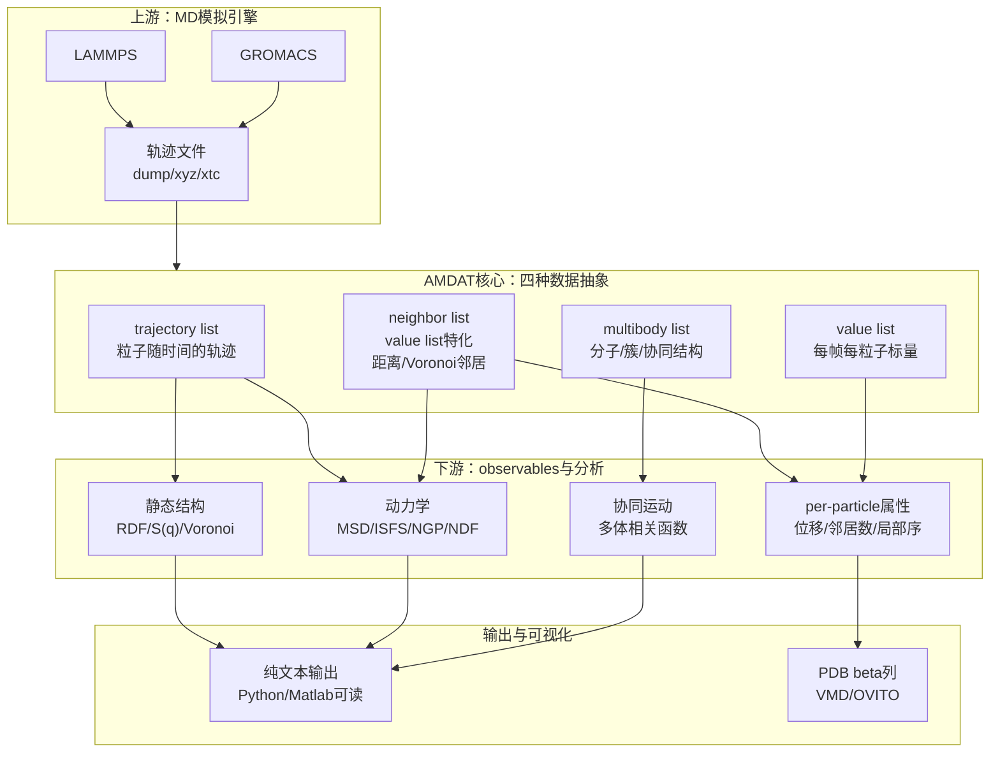

# AMDAT——面向过冷液体与玻璃态体系的长时标MD分析工具

## 本文信息

- **标题**：AMDAT: An Open-Source Molecular Dynamics Analysis Toolkit for Supercooled Liquids, Glass-Forming Materials, and Complex Fluids
- **作者**：Pierre Kawak, William F. Drayer, David S. Simmons
- **发表时间**：2026年2月5日（arXiv预印本）
- **DOI**：https://doi.org/10.48550/arXiv.2602.05865
- **单位**：南佛罗里达大学化学、生物与材料工程系（美国）；宾夕法尼亚大学材料科学与工程系（美国）
- **引用格式**：Kawak, P., Drayer, W. F., & Simmons, D. S. (2026). AMDAT: An Open-Source Molecular Dynamics Analysis Toolkit for Supercooled Liquids, Glass-Forming Materials, and Complex Fluids. *arXiv:2602.05865*. https://doi.org/10.48550/arXiv.2602.05865

对想尝试AMDAT的读者，建议如下三步：

- **克隆仓库**：`git clone https://github.com/dssimmons-codes/AMDAT.git`，参照`README.md`安装依赖（C++编译器、CMake）
- **跑通tutorial**：仓库`tutorials/`目录提供了从加载轨迹到计算RDF、$S(q)$和MSD的完整脚本，**建议先按KG或binLJ的案例复现一遍**
- **读开发者文档**：[dssimmons-codes.github.io/AMDAT](https://dssimmons-codes.github.io/AMDAT/) 提供了关键类与接口说明，扩展新分析时参照`analysis`目录下的类定义模式即可

## 摘要

> AMDAT（Amorphous Molecular Dynamics Analysis Toolkit）是一个**开源C++工具包**，用于对分子动力学（MD）轨迹进行后处理，重点支持**非晶态、玻璃态与聚合物材料以及复杂流体的高性能静态与动态分析**，其中包括过冷液体。本文介绍AMDAT的两个核心设计思路：**内存中的轨迹处理**与**指数时间采样**。这两点主要服务于长时标相关函数分析，并以**径向分布函数**（RDF）、**结构因子**、**中间散射函数**（ISFS）及**邻居相关函数**为例展示其典型工作流。

### 核心结论

- **聚焦非晶态体系**：AMDAT专为过冷液体、聚合物、玻璃态和复杂流体的结构与动力学分析设计，**填补了通用分析包在长时相关函数与多组分体系上的空白**
- **内存加载 + 指数时间采样**：整条轨迹一次性读入内存，**短时密集采样、长时指数变粗**，可在不显著增加文件体积的前提下覆盖**多个数量级**的时间窗口
- **模块化数据抽象**：以`trajectory list`、`neighbor list`、`multibody list`、`value list`四种核心对象为基石，可自由组合、过滤、构造新分析，无需修改内核代码
- **可观测物理量齐全**：RDF、$S(q)$、ISFS、自Van Hove函数、邻居去相关函数、非高斯参数等一应俱全，**这套代码在Simmons组维护超过15年，并支撑了数十篇相关论文**
- **格式与脚本友好**：原生支持LAMMPS dump/xyz，对GROMACS xtc支持有限；输入脚本支持循环、条件、变量赋值，方便批处理和复用

## 背景

过去30年分子动力学模拟方法学已相当成熟，**GROMACS、LAMMPS、NAMD、AMBER、HOOMD-blue、OpenMM**等主流引擎在速度、可扩展性、力场支持上持续完善。但分析端是另一回事。通用工具（如MDAnalysis、OVITO）覆盖面广，专门为非晶态、玻璃态、复杂流体设计的分析包仍然不多。这类体系的弛豫时间很长，线性采样的轨迹在长延迟处可用帧对很少，短延迟处又会重复计算大量相近帧对；RDF、$S(q)$等结构量看似成熟，但**邻居判定标准、Voronoi与距离截断的差异、长时自相关函数的统计**这些细节，很多时候仍然需要研究者自己写脚本。

AMDAT是Simmons组在长期研究过冷液体和聚合物玻璃化的过程中逐步搭建起来的工具集，**已在多个已发表研究中应用**。这篇预印本系统介绍了它的设计思路、核心抽象、输入脚本和典型用例。文章使用的代表体系共有六个：**3D/2D二元Lennard-Jones液体**、**Kremer–Grest**（KG）粗粒化聚合物链、**纳米粒子填充交联KG弹性体**（PNC）、**30mer和100mer聚苯乙烯熔体**（PS-30mer/PS-100mer）。本文主线只展开与图1到图7直接相关的体系。

> AMDAT干的是**MD引擎跑完之后的轨迹分析**。LAMMPS或GROMACS输出轨迹后，AMDAT负责计算RDF、MSD、ISFS、邻居去相关等量。对过冷液体、玻璃化转变和聚合物慢弛豫来说，时间尺度常常跨很多数量级，**能按指数时间间隔读帧和分析，是它最实用的设计之一**。

### 关键科学问题

- **长时标采样的统计瓶颈**：在玻璃态体系中，结构弛豫时间$\tau_\alpha$可达微秒甚至秒级，线性采样会让长延迟处几乎无帧可用；如何在存储开销可控的前提下让MSD、ISFS等长时相关函数获得稳定的统计？
- **非晶态局部环境难以量化**：非晶态结构没有晶体那样清楚的晶胞和配位壳层，**局部邻居环境的拓扑与动力学**却直接关系到玻璃化行为，如何在统一框架下系统追踪这些“动态邻居”？
- **多组分体系中的物种分辨分析**：二元甚至三元非晶态体系的快慢组分、动态不均匀性、空间关联长度都需要**按物种切片**的观察能力，通用工具的多组分支持往往不够顺手
- **可复现的分析管线**：玻璃态模拟的数据量可能达到GB至TB级，**用脚本描述完整分析流程**是确保可复现性的前提

### 创新点

- **指数时间采样**（Exponential time sampling）：默认按指数方式采样帧，短时密、长时疏；在PS-100mer示例中，同样771帧的指数轨迹覆盖的对数时间跨度超过线性轨迹的两倍。这是AMDAT相对通用工具最有辨识度的方法学优势
- **以列表为核心的模块化数据抽象**：四种基本列表对象（trajectory / neighbor / multibody / value）**可叠加、可过滤、可重用**，让新分析能在不修改核心代码的前提下装配出来
- **全面的per-particle可观测通道**：每个原子的位移、邻居数、邻居去相关率、位移分布等都可输出为PDB/xyz等格式的per-atom列，**直接接入VMD、OVITO等可视化工具**
- **多年沉淀的观测物理量**：RDF、$S(q)$、ISFS、NGP、NDF、Van Hove、邻居去相关等**在Simmons组的多篇论文中验证过**（如参考文献21、22、23的聚合物纳米复合材料），对非晶态研究者来说基本开箱即用

---

## 研究内容

### 一、设计哲学与软件架构

AMDAT采用**内存中处理 + 面向对象 + 脚本化**的设计路线。运行时将整条轨迹读入内存以避免反复I/O，典型内存占用约为轨迹文件大小的2至3倍。核心C++类层级覆盖体系（`System`）、轨迹（`Trajectory`）、原子轨迹（`Atom Trajectory`）与分子对象，分析逻辑与数据存储解耦，便于扩展。

AMDAT的整套分析逻辑就建立在这四种数据对象之上：

- `trajectory list`：一组粒子随时间的轨迹，可静态（固定粒子集）或动态（成员随时间变化），是AMDAT的**核心数据对象**
- `neighbor list`：基于距离截断或Voronoi剖分构建的邻居集合，是`value list`的特化子类
- `multibody list`：把粒子组织成分子、官能团、粒子簇或动态相关结构，用于分析回转半径、取向相关、重取向动力学和string-like cooperative motion
- `value list`：每个粒子/分子在每帧的标量值，可来自轨迹文件、邻居计算或前序分析，支持阈值筛选、百分位选择、导出可视化

输入脚本的基本结构是：先声明`<system_type>`、轨迹格式、文件名和`<time_scheme>`，再用`<composition>`描述物种、类型和分子组成，后面接选择与分析命令。典型命令包括`create_list`、`rdf`、`msd`、`gyration_radius`等。**这种脚本更接近LAMMPS输入文件，而不是Python交互式分析**。

> AMDAT的思路可以理解为**先把粒子整理成列表，再把列表交给不同分析命令**。比如要看物种1的邻居壳层是否稳定，可以先创建物种1的trajectory list，再构建neighbor list，最后计算neighbor decorrelation function。**中间对象能继续传给后续分析，这是它比一次性脚本更方便的地方**。

### 二、代表性体系与静态结构量

AMDAT在多个基准体系上演示工作流。图1到图3主要使用**3D二元Lennard-Jones**（binLJ）、**2D二元Lennard-Jones**（binLJ2D）、**Kremer–Grest聚合物链**（KG，$T^* = 0.3854$、弛豫时间约为$10^{6.88}\,\tau_\text{LJ}$、400条链、每条20个珠子，NPT系综）和**30mer聚苯乙烯熔体**（PS-30mer，OPLS力场、13978个原子，$T = 483\,\mathrm{K}$）。后面的指数采样示例使用PS-100mer，PNC体系则用于展示空间分辨和纳米复合材料场景。

> **3D/2D二元Lennard-Jones**（binLJ/binLJ2D）是经典玻璃化研究基准体系，**两种粒子类型**（$N_1=6400$、$N_2=1600$）通过12-6 LJ势相互作用。物种1的$\epsilon$和$\sigma$均为1，物种2分别为0.50和0.88，交叉相互作用为$\epsilon_{12}=1.5$、$\sigma_{12}=0.8$，数密度约为1.17。binLJ是三维体系，binLJ2D则把相同组成和相互作用方案放到二维限制中，用来测试AMDAT处理**降维体系**的能力。

> **Kremer–Grest模型**（1990年J. Chem. Phys.论文提出）是广泛使用的粗粒化珠-簧聚合物模型，用**FENE键**（有限延展非线性弹性势）连接相邻珠子，**WCA势**（Weeks-Chandler-Andersen纯排斥势）处理非键相互作用。这个模型捕捉聚合物动力学本质特征（Rouse运动、reptation、缠结）同时计算开销可控，是聚合物玻璃化研究的标准基准体系。

**图1：三个体系的静态结构表征**。上行为径向分布函数$g(r)$，下行为静态结构因子$S(q)$。binLJ（左）和PS-30mer（右）的RDF按“全粒子/物种1/物种2/物种1-2对”分开绘制，**颜色为蓝橙绿红四组曲线**；PS-30mer中的物种分解对应碳、氢等原子类型。KG（中）只显示全粒子RDF，因为它是单组分粗粒化系统。$S(q)$三体系均按全粒子计算，**展示实空间与倒空间信息的互补**。

RDF细节反映了各体系局部结构的不同：binLJ的1-1对RDF首峰尖锐，KG的RDF呈现典型的玻璃态分裂第二峰，PS-30mer的RDF则因链内/链间混合而峰位更宽。$S(q)$从倒空间给出**中程结构信息**，适合与实空间RDF一起判断非晶体系的局部有序程度。

### 三、动态物理量：多尺度动力学

**图2：四个体系的动力学性质总览**。

- **MSD**（均方位移）刻画扩散和亚扩散行为。图2中binLJ2D的MSD整体增长更慢，说明二维限制会显著改变弛豫行为；PS-30mer则展示了原子级聚合物体系中更宽的慢动力学时间窗口。
- **ISFS**（self中间散射函数，$F_s(q, \tau)$）在对应近邻距离的波数$q^*$处计算，binLJ和PS-30mer能清晰看到$\alpha$-弛豫平台，KG在长延迟处尚未完全弛豫。
- **NGP**（Non-Gaussian Parameter，非高斯参数，$\alpha_2(\tau)$）：量化**位移分布偏离高斯形的程度**。如果扩散接近简单布朗运动，$\alpha_2$接近0；在过冷液体中，一部分粒子被局部笼困住，另一部分粒子已经发生较大位移，位移分布就会变宽并偏离高斯形。$\alpha_2$的峰值通常对应**动态不均匀性最强的时间尺度**。
- **NDF**（Neighbor Decorrelation Function，邻居去相关函数）：追踪**局部邻居壳层在时间上的持久性**。图中的NDF是保留下来的邻居数随时间延迟的变化；数值越高，说明初始邻居壳层保留得越久。它主要用于观察**笼蔽效应、邻居交换和协同重排**。**颜色：蓝=all、橙=1、绿=2**，按物种切片。

> **NGP与NDF的物理区别**：NGP看**位移分布**的形状是否偏离高斯，关注“粒子跑了多远”；NDF看**邻居环境**是否还保留，关注“周围是谁变了”。两者从不同角度刻画过冷液体的**动态不均匀性**。如果MSD增长慢、ISFS衰减慢、NDF也保持较高数值，通常意味着粒子仍被局部邻居笼困住，结构重排尚未充分发生。

### 四、自Van Hove函数与跳跃扩散

除MSD和ISFS外，**自Van Hove相关函数**$G_s(r, \tau)$是另一种描述粒子扩散路径的常用工具。它统计在延迟$\tau$后粒子从初始位置移动距离$r$的概率分布，**与MSD的均方位移视角互为补充**：MSD给出平均距离，Van Hove给出整个分布形状，**对识别跳跃扩散、协同运动等非高斯特征特别敏感**。

> 简单回顾一下：$G_s(r, \tau)$就是“一个粒子过了时间$\tau$之后跑了多远”的概率分布。它和**中间散射函数**$F_s(q, \tau)$是一对傅里叶变换：一个看实空间位移，一个看倒空间密度衰减。Van Hove函数比MSD更灵敏，因为**MSD只看二阶矩，分布形状的信息会被平均掉**。

**图3：KG体系的自Van Hove相关函数**。图中以**等时曲线**形式展示，横轴为距离$r$，纵轴为概率密度，颜色从蓝到红表示延迟时间$\tau$增大（色标覆盖$10^0$到$10^6$的时间范围）。短延迟曲线集中在$r \approx 0$附近，说明粒子主要在局部笼内振动；长延迟曲线向较大$r$展开，说明有粒子逐渐离开原来的局部环境。这里不必硬解释成严格的双峰跳跃模型，更稳妥的读法是：**Van Hove函数保留了位移分布形状，能看出MSD平均值掩盖掉的非高斯扩散特征**。

> Van Hove函数与MSD的关系：MSD是$G_s(r, \tau)$的二阶矩。二阶矩很有用，但它会把“多数粒子小幅振动”和“少数粒子大位移”混成一个平均数。对玻璃化体系来说，**分布形状本身往往比平均值更有信息量**。

### 五、指数时间采样的优势

AMDAT默认采用指数时间采样，**短时帧密集、长时帧稀疏**，每个时间块内固定起始帧数，使不同延迟时间上的统计质量更均衡。PS-100mer示例中，线性轨迹和指数轨迹都使用771帧，但指数方案覆盖的对数时间跨度超过线性方案的两倍；长延迟处也不至于只剩极少数帧对。

> **线性时间采样**（Linear spacing）：在**线性时间坐标**上等间隔dump帧（例子中约每13529 ps一帧）。对时间延迟$\Delta t$，可用的帧对数是$S(\Delta t)=T-\Delta t/\Delta \tau$，其中$T$是总帧数，$\Delta \tau$是采样间隔。问题是**可用帧对数会随延迟时间线性衰减**。文中示例里，若想用单条线性轨迹覆盖$10^{-3}$到$10^5$ ps这8个数量级，就需要$10^8$帧，文件体积基本不可接受。
>
> **指数时间采样**（Exponential spacing）：**每个对数时间块内保留固定数量的起始帧，块内延迟按指数递增**。它的目的是让跨多个数量级的相关函数都有可用帧对。对玻璃态和聚合物慢弛豫来说，**这比均匀dump更贴合问题本身**。

**图7：线性与指数采样得到的MSD对比**。主图是双对数坐标，插图是线性坐标。两条曲线在重叠时间区间内基本一致，说明指数采样没有改变MSD本身；差别在于，**指数采样同时保留了更短延迟和更长延迟的信息**。线性方案把771帧均匀铺开，短时区分辨率不足，长时区也很快缺少可用帧对；指数方案把帧数重新分配到对数时间上，更适合分析慢弛豫。

> 简单地说：**线性方案适合时间尺度不太宽的问题，指数方案适合跨很多数量级的慢弛豫问题**。AMDAT把这种采样方式直接写进分析工作流里，省去了同时保存多条不同输出频率轨迹的麻烦。

### 六、Per-particle可视化与邻居分析

AMDAT能把每个粒子的位移、邻居数、Voronoi邻居数等作为PDB的beta列或其他per-atom字段导出，**直接用VMD或OVITO着色显示**，对识别动态不均匀性、空间异质性和协同运动区域很有帮助。

**图4：三维二元Lennard-Jones快照的粒子属性着色**。

- （a）**原子类型**：红=物种1、蓝=物种2，两种粒子在空间上**基本均匀混合**
- （b）**指定时间内的位移**：时间间隔为1211.42$\tau_\text{LJ}$，颜色从白（几乎没动）到深蓝（位移大），**深蓝区域对应移动更明显的粒子**
- （c）**距离截断邻居数**：截断距离为1.4$\sigma_\text{LJ}$，**冷色=邻居少，暖色=邻居多**，直观展示**笼的紧密度分布**
- （d）**Voronoi剖分邻居数**：与（c）整体相似但局部细节不同，**对拓扑缺陷更敏感**

> 直观读图：图4真正展示的是**AMDAT可以把动力学量和局部结构量写回同一帧坐标**。这样读者不用只看全体系平均曲线，也能在空间上看到哪些区域更活跃、哪些区域配位更高或更低。

**图5：二维二元Lennard-Jones快照的粒子属性着色**。

- （a）**原子类型**：红/蓝粒子在二维平面上的混合模式
- （b）**位移**：时间间隔为1211.42$\tau_\text{LJ}$，冷蓝=位移较小，暖色=位移较大，显示移动性在空间上并不均匀
- （c）**六角序参量**：2D xy平面中的6-fold hexatic order parameter，**突出具有六角对称性的局部区域**，这是二维体系中常用的局部结构判据
- （d）**距离截断邻居数**：截断距离为1.4$\sigma_\text{LJ}$，**冷色=邻居少，暖色=邻居多**
- （e）**Voronoi剖分邻居数**：与（d）整体相似但局部细节不同，**对拓扑缺陷更敏感**

> 2D体系为什么适合做展示：**六角对称性在二维里特别容易定义**，所以binLJ2D很适合演示“局部结构量如何写回到粒子上”。这并不等于体系已经发生晶化，而是说明AMDAT可以把局部序参量、位移和邻居数放在同一套可视化流程里比较。

**图6：两种邻居定义得到的邻居数直方图**。蓝线代表距离截断，截断距离为1.4$\sigma_\text{LJ}$；橙线代表Voronoi剖分。两条曲线的均值（虚线）接近，但**分布形状明显不同**。Voronoi分布在右侧（高配位数）有更长尾，Distance分布在左侧（低配位数）有更明显的峰。这里的重点是：**选哪种邻居定义会改变局部结构分析的结论**，尤其在比较不同模拟或实验配位数时，不能只报一个“平均邻居数”。

> Voronoi剖分把每个粒子周围的空间按“距谁最近”切成多面体，**邻居数等价于多面体的面数**。它的好处是不需要人为指定截断半径；缺点是对热涨落和远处小面也可能敏感。因此在非晶态体系里，**距离截断和Voronoi剖分最好一起看**。

后面几张图就略了，详见原文。

## 关键结论与批判性总结

- **定位明确**：AMDAT面向过冷液体、玻璃态、聚合物和复杂流体的**下游轨迹分析**。
- **指数采样是最实用的特色**：在不保存多条不同输出频率轨迹的前提下，长时相关函数（MSD、ISFS等）的可分析时间窗更宽，**缓解了线性采样在长延迟处可用帧对过少的问题**。
- **模块化设计方便扩展**：四种核心列表对象让“按物种分层”、“按时段切片”、“按邻居环境聚类”等操作都能在不改核心代码的前提下完成，**对有定制分析需求的研究者很友好**。
- **局限与注意事项**：目前**GROMACS xtc支持有限**，LAMMPS dump和xyz格式更顺手；输入文件需要写脚本配置，**有一定学习成本**。
- **生态衔接**：AMDAT输出纯文本或可视化友好的modified trajectory文件，**后处理主要交给Python、Matlab、VMD或OVITO**。作者计划的改进包括更完整的开发者文档、可导入的Python接口以及多线程分析支持。
- **批判性看法**：AMDAT的优势很清楚，但也很窄。它适合玻璃态、聚合物和复杂流体的长时标统计；如果研究问题主要是蛋白质口袋、自由能面或反应路径，通用Python分析生态通常更方便。

### 典型应用场景

AMDAT已经支撑的研究场景覆盖了**非晶态物理和软物质化学**的多个核心问题：

- **玻璃化转变与过冷液体动力学**：MSD、ISFS、NGP是描述体系从液态向玻璃态转变的**常用三件套**，指数采样让这几个量在接近$\tau_\alpha$时仍然有足够的统计量
- **动态不均匀性研究**（DH）：NGP峰值、4-point相关函数、协同运动区域识别都依赖**对大量粒子的局域动力学进行切片**——AMDAT的`multibody list`和`value list`抽象正是为这类分析设计
- **聚合物的链动力学**：Rouse/reptation模型预测的MSD标度律、链内/链间RDF的物种分辨、链段取向相关——这些是PS-30mer演示案例的延伸应用
- **非晶态结构的拓扑表征**：Voronoi剖分 + 邻居分布直方图（图6）是识别**局部结构差异**（如不同邻居判定标准给出的配位数分布偏差）的有效途径
- **per-particle属性的高通量计算**；把每个粒子的位移、邻居数等批量导出为PDB的beta列，**可在VMD中快速查看整个体系的空间分布**

### 与同类工具的对比

| 工具 | 主要设计目标 | 时间采样 | 邻居定义 | 强项 |
| --- | --- | --- | --- | --- |
| **AMDAT** | 过冷液体/玻璃态/聚合物 | **指数采样**（默认） | 距离截断、Voronoi | 长时相关函数、动态不均匀性 |
| **Freud** | 局部结构/相关函数 | 用户自定义 | 距离、Voronoi、固体角 | 高性能结构分析、并行 |
| **LAMMPS**（自带） | MD引擎 + in-situ分析 | 用户自定义 | 距离截断 | 边跑边算、节省IO |

> **简单说**：MDAnalysis和OVITO覆盖面更广，Freud偏向高性能结构分析，**AMDAT的特色在长时标动力学分析**。指数采样和模块化抽象，是它区别于通用工具的核心。
