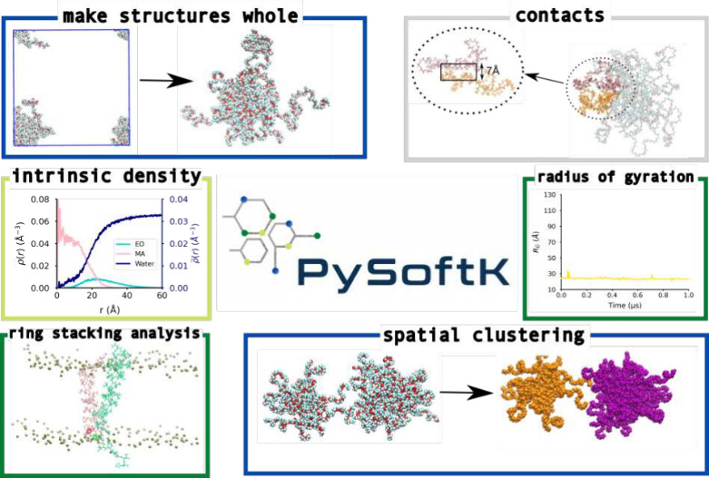
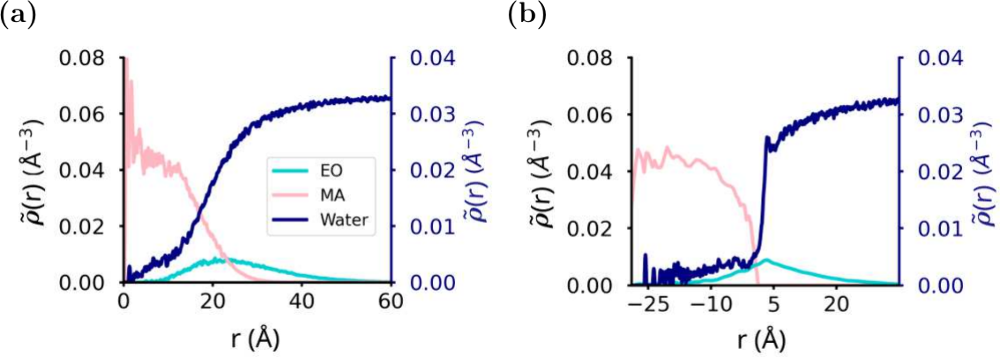
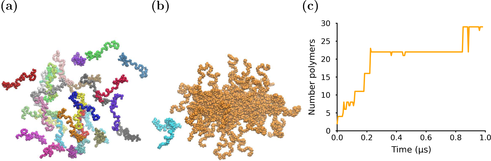
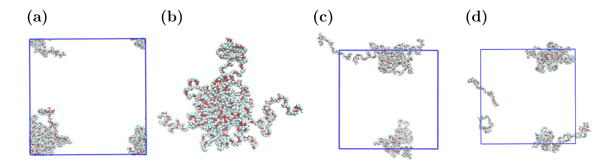
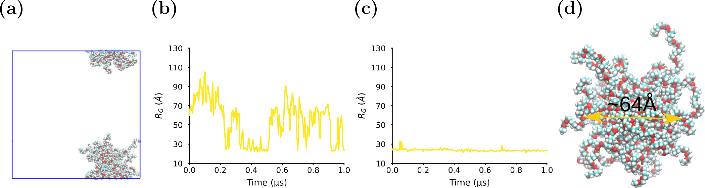

# PySoftK v1.0：软物质自组装的自动化分析工具集

## 本文信息

- **标题**：Automated Analysis of Soft Matter Interfaces, Interactions, and Self-Assembly with PySoftK
- **作者**：Raquel López-Ríos de Castro, Alejandro Santana-Bonilla, Robert M. Ziolek, Christian D. Lorenz
- **发表期刊**：*Journal of Chemical Information and Modeling*
- **发表时间**：2025年2月10日
- **DOI**：https://doi.org/10.1021/acs.jcim.4c01849
- **单位**：英国伦敦国王学院（King's College London）物理系
- **引用格式**：López-Ríos de Castro, R.; Santana-Bonilla, A.; Ziolek, R. M.; Lorenz, C. D. (2025). Automated Analysis of Soft Matter Interfaces, Interactions, and Self-Assembly with PySoftK. *J. Chem. Inf. Model.*, 65(6), 1679-1684. https://doi.org/10.1021/acs.jcim.4c01849
- **代码仓库**：https://github.com/alejandrosantanabonilla/pysoftk

## 摘要

> 分子动力学（MD）模拟已成为研究软物质和生物大分子的核心工具，但其**高维数据**难以直接揭示底层分子机制。软物质模拟的内在复杂性要求应用专门、往往精细的算法才能提取有意义的分子层面理解。**PySoftK v1.0**为此提供了**自动化分析工具集**，涵盖界面表征、分子相互作用（含环-环堆叠）和自组装追踪，并附带**大尺寸聚集体的PBC解包**等辅助函数。所有算法在化学上完全无关，可应用于任何纳米粒子或界面体系。配套的测试套件和教程笔记本确保了分析的**可重复性**与易用性。

**摘要图：PySoftK的核心分析功能**——包含make structures whole、contacts、intrinsic density、radius of gyration、ring stacking analysis、spatial clustering六大模块的概览。

### 核心结论

- PySoftK v1.0提供了**化学无关的独立分析模块**，可应用于任何软物质或生物大分子体系
- 重点解决三个常被忽视的难题：**跨越大尺寸的PBC处理**、**复杂界面的本征表征**、**自组装动力学的快速追踪**
- 首次实现当纳米粒子跨越大半盒尺寸时仍能正确重构的工具`make_micelle_whole`
- 算法兼容MDAnalysis，借助其拓扑与轨迹管理能力，输出格式与MDAnalysis完全兼容
- 开源、配套教程笔记本与测试套件，有望成为软物质模拟分析**标准化**的重要平台

## 背景

软物质涵盖**化妆品、制药、水处理**等众多材料科学应用。**自组装**作为软物质的核心现象，构成了从胶束、囊泡到纳米粒子等结构的基础。理解分子结构、构象动力学和分子间相互作用的相互关系，是建立**可推广的结构-性质关系**以支持软物质材料理性设计的关键。

MD模拟虽然能在原子层面研究这些过程，却产生了**海量高维数据**。解读这些数据往往需要专门的分析工具，导致**定量结果难以复现**。社区虽然在简化输入文件创建方面已有很多工具（PySoftK早期版本、Polymer Structure Predictor、Radonpy、MoSDeF等），但**分析软物质性质的综合包尚未见报道**。

PySoftK v1.0正是为填补这一空白而设计——在统一的计算框架内，**建模与分析可在现代软件开发标准下无缝衔接**，缓解数据溯源和可重复性问题。

## 关键科学问题

- 如何**自动化**分析软物质模拟中的界面结构与分子相互作用？
- 如何准确处理**自组装形成的纳米粒子**（常常大于半盒长度），克服PBC解包难题？
- 如何在化学无关的框架下，**系统追踪**自组装动力学过程？
- 如何量化驱动自组装的**分子间相互作用**（如环-环堆叠、溶剂化）？

## 创新点

- **大尺寸聚集体PBC解包**：首次实现当纳米粒子跨越大半盒尺寸时仍能正确重构的工具`make_micelle_whole`，弥补MDAnalysis v2.5和GROMACS 2023的不足
- **本征密度方法（ICSI）**：针对非球形或粗糙界面的纳米粒子，提供`intrinsic_density`工具，避免球面假设带来的误判
- **环-环堆叠分析**：专门为大型软物质体系设计的RSA算法，三阶段筛选识别跨分子的π-π相互作用
- **空间聚类协议（SCP）**：基于图论快速追踪自组装过程中分子聚类变化，输出Pandas DataFrame便于后续分析

---

## 研究内容

### 一、方法学设计

PySoftK的所有分析功能**完全建立在MDAnalysis之上**，由MDAnalysis负责拓扑与轨迹管理，PySoftK专注于上层分析算法。这一设计带来两个直接好处：

- **格式兼容性**：自动支持MDAnalysis能读取的所有格式（GROMACS、NAMD、AMBER、CHARMM等），用户无需关心底层IO
- **生态兼容性**：分析输出可与MDAnalysis Universe、AtomGroup等对象无缝衔接，直接接入既有工作流

整套工具采用**化学无关设计**——虽然最初关注聚合物，但分析模块可应用于**任何软物质或生物大分子体系**，包括**两亲性肽自组装、药物-蛋白共轭物、纳米药物载体**等。配套的**测试套件**覆盖核心算法，**教程笔记本**（GitHub提供）则手把手演示典型用例，确保可重复性。GitHub仓库还附带**短轨迹样例数据**，用户可复现论文中所有图表。

### 二、界面分析

PySoftK提供两套界面分析工具：球面密度（适用于近球形粒子）和本征密度（适用于非球形/粗糙界面）。

**图1：球面密度与本征密度计算对比**——对$\ce{PEO–PMA}$双嵌段聚合物形成的球形胶束分别用两种方法计算密度。

- **图1a（球面密度）**：横轴为到聚集体质心的距离$r$，纵轴为密度$\tilde{\rho}(r)$。青色为$\ce{EO}$，粉色为$\ce{MA}$，深蓝为水
- **图1b（本征密度）**：横轴为到**核-壳界面**的距离，$r=0$即界面位置（负值表示核区）。相比球面密度，本征密度能更清晰地揭示**水在界面的精细结构**——在$r \approx 5$ Å处的水密度小峰指示**弱疏水界面**

核主要由$\ce{MA}$组成，$\ce{EO}$形成电晕，水有部分渗入。**本征密度法的核心优势**在于：它通过ICSI（Intrinsic Core–Shell Interface）算法将胶束分子按"属于核还是壳"自动分类，然后以核-壳界面为基准计算密度分布，避免了球面假设带来的误判。值得说明的是，**ICSI的归一化因子无法解析求解**，因此PySoftK采用**蒙特卡洛积分**计算——这是少数几个对计算资源有明确要求的地方。

### 三、分子尺度相互作用

这一部分包含**环-环堆叠、溶剂化分析、接触计数**三个工具，都是基于**原子对距离的简单判定**，配合用户定义的截断距离即可工作。

**环-环堆叠分析（RSA）**：用于识别**共轭聚合物、蛋白质**等体系中的π-π相互作用。采用**三阶段筛选**策略：

- **阶段1**：自动检测所有属于芳香环的原子
- **阶段2**：以环中心几何距离<10 Å为判据，筛选处于接触距离内的环对
- **阶段3**：对通过前两阶段的环对，进一步要求两环间任意原子距离<4 Å、且两环平面法向夹角<20°，才被判定为有效堆叠

**溶剂化分析（solvation）**：通过**用户自定义的距离截断**判定**第一溶剂化壳**内的溶剂分子数，进而量化两亲性软物质中**疏水/亲水相互作用**。当以水为溶剂时，SI建议**只选水中的氧原子**以加速计算；输出的`solvation_number`为列表，每项对应一帧中所有选中单体的平均配位数。

**接触计数（contacts）**：通过测量所选原子间的距离判定接触关系，是最通用的相互作用量化工具。

值得一提的是，RSA算法不仅适用于软物质体系，论文SI还将其应用于**TREM2-DAP12蛋白复合物**中的π-π相互作用分析，展示了其在生物大分子场景下的迁移性。

#### 工具能力速览

| 工具类 | 代表函数 | 核心功能 | 适用场景 |
| --- | --- | --- | --- |
| 界面分析 | `spherical_density`、`intrinsic_density` | 沿球面/界面计算密度 | 胶束、纳米粒子、核-壳结构 |
| 接触/相互作用 | `contacts`、`solvation` | 原子对距离判定 | 任意两分子相互作用量化 |
| 环-环堆叠 | `ring_stacking_analysis` | 三阶段π-π筛选 | 共轭聚合物、蛋白-配体 |
| 自组装追踪 | SCP | 图论聚类+时序输出 | 胶束化、囊泡形成动力学 |
| PBC解包 | `make_micelle_whole` | 聚集体质心参考的重构 | 大于半盒尺寸的纳米粒子 |
| 辅助函数 | `radius_of_gyration`、`eccentricity` | 结构参数计算 | 形状表征 |

### 四、自组装追踪：空间聚类协议（SCP）

**图2：自组装过程追踪**——以$\ce{PEO–PMA}$双嵌段聚合物为例演示SCP算法。

- **图2a**：模拟开始时，**30个聚合物分子随机分散**（每种颜色代表不同分子），水未显示
- **图2b**：模拟后形成**一个大的橙色胶束**和**一个小的青色胶束**
- **图2c**：**最大聚集体中聚合物数量随时间的变化曲线**——在1 μs内通过阶跃式聚集形成最终结构，每个平台期对应一次聚并事件

SCP算法用图论表示聚集体：每个分子是节点，距离小于截断的两分子间有边，连通子图即为一个聚类。算法**快速到能分析整个轨迹的自组装动力学**，输出Pandas DataFrame，列包括分子残基ID和对应时刻的聚类大小，便于二次分析。在该示例中，曲线清晰呈现**两个明显的平台期**——分别对应1 μs内的两次聚并事件。SI的Figure S4还演示了SCP在**MARTINI2粗粒化模拟**中的应用：分析**16个APP跨膜肽在POPC脂双层**中的聚集情况——蓝色簇含2个肽，粉色簇含6个，橙色簇含8个，展示了**化学无关性**在生物大分子场景的迁移。

### 五、大尺寸聚集体的PBC解包

当自组装形成的纳米粒子**跨越模拟盒的半盒长度**时，传统工具（如`gmx trjconv -pbc mol`）都无法正确处理——这是软物质模拟中非常常见但被忽视的问题。

**图3：用PySoftK解包跨越PBC的聚合物纳米粒子**——（a）原始构象中聚合物胶束跨越盒子边界。

- **图3a**：**跨越PBC的聚合物纳米粒子**——可以看到分子被分割到盒子两端
- **图3b**：PySoftK的`make_micelle_whole`成功重构——所有分子被正确地放回同一侧
- **图3c**：**MDAnalysis的解包结果**——明显失败，分子仍被错误分割
- **图3d**：**GROMACS 2023的解包结果**——同样失败

这一对比清晰展示了PySoftK在处理大尺寸软物质聚集体时的**显著优势**。`make_micelle_whole`的工作原理是：先识别属于同一聚集体（自组装形成的纳米粒子）的所有分子，再以**聚集体质心**为参考，将被PBC分割到盒子另一侧的分子整体平移回正确位置。

### 六、解包错误的连锁影响：$R_g$计算

**图4：解包错误对回转半径计算的影响**——以$\ce{PEO–PMA}$纳米粒子为例。

- **图4a**：**跨越PBC的纳米粒子**初始构象
- **图4b**：用MDAnalysis解包后，`radius_of_gyration()`算出的$R_g$随时间剧烈震荡，**数值完全不可信**
- **图4c**：用PySoftK的`make_micelle_whole`解包后，$R_g$曲线平滑稳定在约**20 Å**，与重构胶束的直径**64 Å**（图4d标注）相吻合
- **图4d**：**重构后胶束的实空间快照**，标注直径为64 Å作为参照

> 这说明**简单分析任务也会因错误的PBC处理而失败**（如$R_g$计算），`make_micelle_whole`是软物质模拟**可靠分析的必要前提**。这一现象提醒我们：**PBC处理不是模拟结束后的可选后处理，而是分析链路的强制前置环节**。

### 七、辅助函数

除核心分析模块外，PySoftK还提供**回转半径（$R_g$）与偏心率（eccentricity）**等结构参数的计算工具，便于自组装结构的**形状表征**。所有分析输出**与MDAnalysis完全兼容**（PySoftK本身就基于MDAnalysis管理拓扑与轨迹），可无缝接入既有工作流。

---

## 关键结论

PySoftK v1.0为软物质模拟分析提供了**完整的独立模块**，重点解决三个常被忽视的难题：跨越大尺寸的PBC处理、复杂界面的本征表征、自组装动力学的快速追踪。算法**化学无关**——虽然最初关注聚合物，但分析模块可应用于**任何软物质或生物大分子体系**。

PySoftK v1.0的**核心优势**在于正确处理**PBC下大于半盒尺寸的分子聚集体**——这在软物质自组装模拟中极为常见，却是MDAnalysis v2.5和GROMACS 2023等主流工具的盲区。论文明确指出："**其他软件工具并未针对这种大尺寸分子聚集体进行设计**"。

PySoftK v1.0的开源特性、配套测试套件与教程笔记本，使其有望成为促进软物质模拟分析**标准化**的重要平台，有助于不同模拟之间的准确比较，支持**理性in silico材料设计**。同时，PySoftK v1.0已将**所有分析工具整合为可独立调用的独立模块**，未来扩展（如液晶、凝胶等体系）有清晰的接口基础。

### 局限性

- 部分算法（如`intrinsic_density`中的归一化因子）需通过**蒙特卡洛积分**计算，对计算资源有一定要求
- 工具主要在**聚合物/胶束体系**验证，对**其他软物质形态**（如液晶、凝胶）的迁移性有待考察
- 论文中所有案例所用的$\ce{PEO–PMA}$双嵌段聚合物轨迹来源于团队已发表的其他工作，PySoftK本身**不提供通用的力场或结构生成器**，仅专注于分析侧
- 全文只展示了`make_micelle_whole`对$\ce{PEO–PMA}$**胶束**的重构效果，**多分散聚集体**、**非对称形状**聚集体（棒状、囊泡）的适用性需进一步测试
- PySoftK v1.0仅支持**Linux与macOS**系统，且需要**Python 3.7+**，Windows用户需通过WSL等方式间接使用

### 配套资源

- **GitHub仓库**：https://github.com/alejandrosantanabonilla/pysoftk，提供完整源码、测试套件、教程笔记本与可复现轨迹
- **SI文档**（`ci4c01849_si_001.pdf`）：详细描述graph theory在自组装分析中的应用、PySoftK开发过程、各分析工具的详细说明与扩展示例
- **依赖**：MDAnalysis v2.5（轨迹/拓扑管理）、NumPy（数值计算）、Pandas（结果输出）、Networkx（图论分析）
- **架构**：`pysoftk.pol_analysis`是v1.0新增的模块，与早期PySoftK版本组合，工具分两大类——**聚集体性质**（密度、$R_g$、eccentricity、PBC解包）与**分子尺度相互作用**（环-环堆叠、solvation、contacts）
- **支持系统**：Linux、macOS（Python 3.7+），距离计算通过`concurrent.futures`或`MDAnalysis.lib.distances`并行化

对于涉及**自组装、纳米材料、药物载体、两亲性生物大分子**等体系的MD研究者，PySoftK v1.0提供了一个**轻量但专业**的分析层，建议作为标准工作流的一部分。
