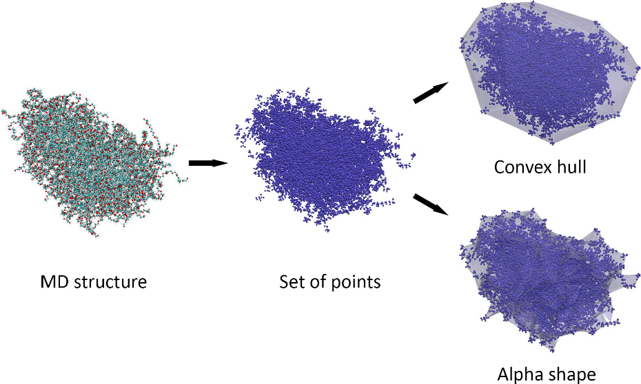
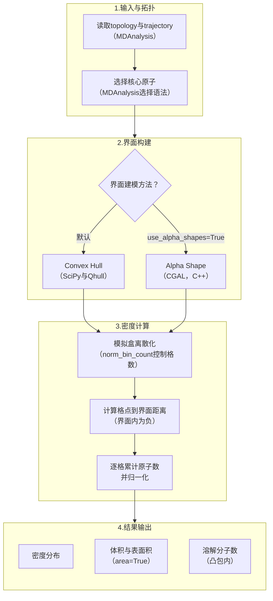
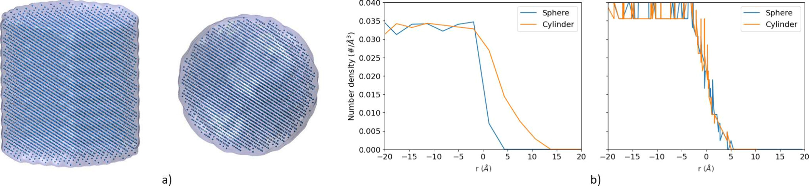
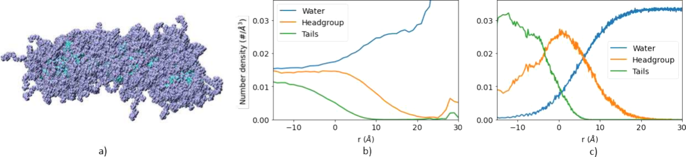
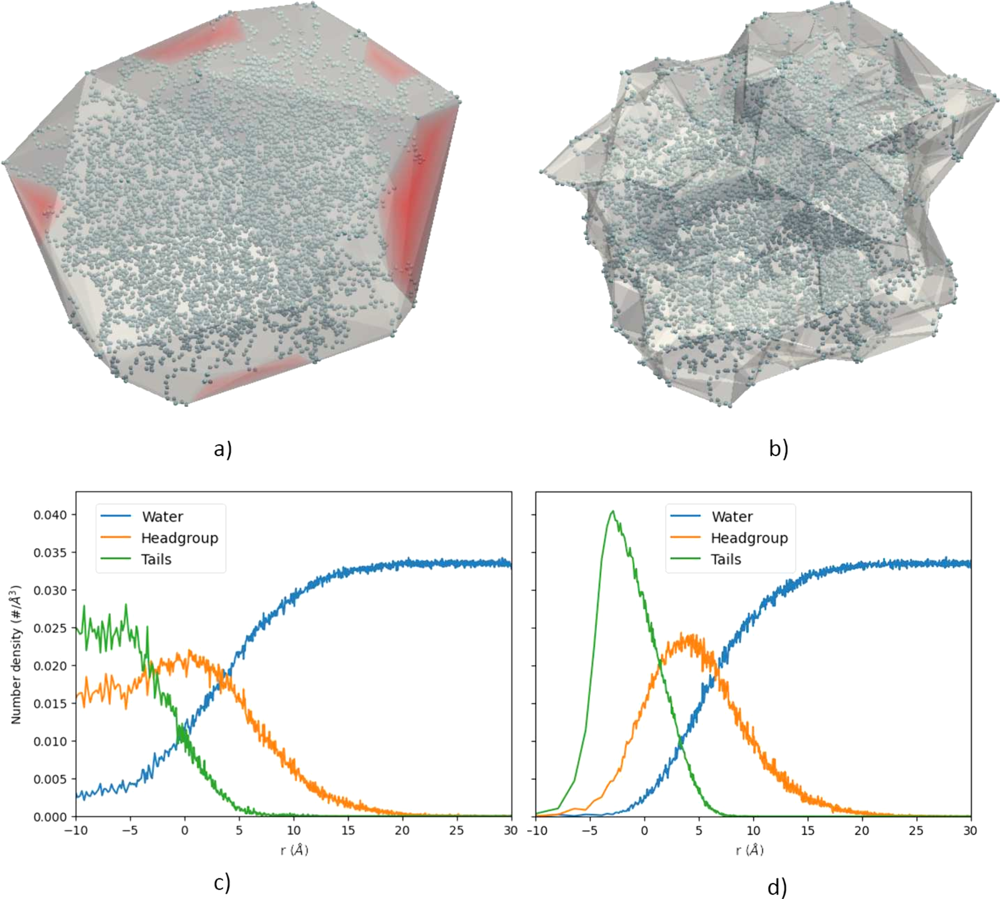
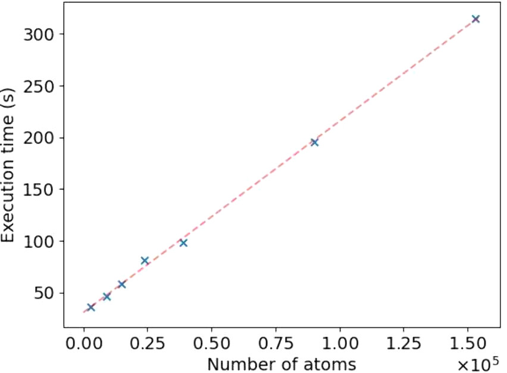

# PUCHIK工具包——非球形纳米粒子界面、密度与体积的自动化分析

## 本文信息

- **标题**：PUCHIK：用于分析非球形纳米粒子分子动力学模拟的Python工具包
- **作者**：Hrachya Ishkhanyan，Alejandro Santana-Bonilla，Christian D. Lorenz
- **发表期刊**：*Journal of Chemical Information and Modeling*
- **发表时间**：2025年2月10日（第65卷，1694-1701页）
- **DOI**：https://doi.org/10.1021/acs.jcim.4c02128
- **单位**：英国伦敦国王学院（King's College London）物理系与工程系；亚美尼亚国家科学院信息学与自动化学研究所
- **引用格式**：Ishkhanyan, H.; Santana-Bonilla, A.; Lorenz, C. D. (2025). PUCHIK: A Python Package To Analyze Molecular Dynamics Simulations of Aspherical Nanoparticles. *J. Chem. Inf. Model.*, 65, 1694-1701. https://doi.org/10.1021/acs.jcim.4c02128
- **代码与数据**：PUCHIK软件包与本文模拟输入文件：https://github.com/hrachishkhanyan/PUCHIK/tree/alpha_shapes；补充信息见ACS页面：https://doi.org/10.1021/acs.jcim.4c02128

## 摘要

> 准确描述纳米粒子的界面对于理解其内部结构、界面性质乃至最终功能至关重要。虽然当前计算方法对球形和准球形纳米粒子提供了合理的描述，但针对胶囊状和棒状体系等**非球形结构**的有效模型仍然存在需求。本工作引入了**Python Utility for Characterizing Heterogeneous Interfaces and Kinetics**（PUCHIK），这是一种为描述**球形和非球形纳米粒子**而开发的新算法。通过准确描述纳米粒子界面的位置，该算法允许计算各种重要物理量（例如不同原子/分子类型相对于界面的密度、纳米粒子体积、纳米粒子内溶解分子数等）。PUCHIK基于**SciPy、MDAnalysis和Cython**构建，提供了经过优化的Python实现，执行时间与粒子数呈线性关系。PUCHIK能够可靠地表征纳米粒子界面，为纳米科学和纳米技术中的**in silico材料设计**提供了强大工具。



**摘要图：PUCHIK的核心工作流程**——从MD结构到原子点集、再到Convex hull和Alpha shape两种界面建模方法的完整流程。Convex hull形成凸形包络，Alpha shape则生成贴合粒子实际形貌的凹形界面。

### 核心结论

- PUCHIK提供了面向**非球形纳米粒子**（胶囊状、棒状等）的界面表征流程，弥补了传统径向分析对球形或准球形结构依赖过强的局限
- 采用**alpha shape**和**convex hull**两种方法定义界面，通过Cython优化后实现与粒子数呈**线性关系**的计算复杂度
- 在TX100胶束和吲哚美辛共溶剂体系的对比测试中，**PUCHIK成功避免了nanoCISC算法的水密度虚高问题**，得到的密度分布更符合核-壳物理模型
- 密度计算默认开启**多进程并行**，可结合Cython将单帧计算时间从0.40秒降至0.12秒（约3.3倍加速）
- 软件包开源、脚本化程度高，密度计算通常只需少量代码即可完成，适合作为纳米粒子界面分析的**可复用工具**

## 背景

纳米粒子的**界面表征**是理解其结构-性质关系的核心。传统的密度分析方法（如以质心为基准的径向密度分布）对球形粒子效果良好，但对**非球形粒子**（如胶囊状、棒状、不对称胶束）会产生严重误判。现有工具如**nanoCISC**虽能处理部分复杂形貌，但在计算密度时可能出现**水密度虚高**、**组分密度分布不合理**等问题。PUCHIK通过**计算几何方法**（alpha shape和convex hull）精确定义纳米粒子的核心-壳界面，进而计算相对于界面的密度分布和体积。

### 配套资源

- **算法依赖**：SciPy（ConvexHull，即Qhull库的Python封装）、MDAnalysis（轨迹/拓扑管理）、Cython（性能优化）、CGAL（用C++实现alpha shapes）
- **计算复杂度**：$O(mN)$，其中$m$为凸包顶点数，$N$为粒子数，实测执行时间与$N$呈线性关系
- **优化策略**：支持Python单进程（SP）、多进程（MP）以及Cython加速，MP模式可将单帧计算时间从0.40秒降至0.13秒
- **适用体系**：固体、空心、介孔材料，以及表面活性剂胶束、药物纳米载体等软物质体系

对于涉及**非球形纳米粒子、表面活性剂自组装、药物纳米载体**等体系的MD研究者，PUCHIK的价值不在于替代所有结构分析，而在于把“先定义真实界面，再沿界面法向统计密度”这一步做成了**可复用的程序接口**。这类工具能减少不同课题组重复编写临时脚本时产生的误差，也让球形、椭球形、胶囊状和弯曲聚集体的结果更容易放在同一套坐标系下比较。

## 创新点

- **alpha shape界面定义**：将alpha shape作为convex hull之外的可选界面模型，能够描述凹陷、弯曲或不规则结构，避免convex hull把空腔和弯曲间隙一起包进去；alpha shape可由CGAL自动选参，$\alpha\to\infty$ 时自动退化为convex hull
- **线性时间复杂度**：通过Cython优化和多进程并行，实现与粒子数呈线性关系的执行时间，显著优于传统方法
- **非球形体系适用性**：专门针对胶囊状、棒状等非球形纳米粒子设计，突破了球形假设的局限
- **模块化设计**：包结构分为`core`（`Interface`类）与`utilities`（`ClusterSearch`等辅助工具）两个子包，功能相互独立、便于扩展

> **化学无关设计**：PUCHIK并不依赖特定表面活性剂或药物分子，而是把纳米粒子抽象成一组原子点云和由点云生成的界面。因此，只要能明确选出构成核心结构的原子，**同一套界面统计思想就可以迁移到其他纳米粒子体系**。

---

## 研究内容

### 一、方法学设计

PUCHIK的命名来自亚美尼亚语的“气球”，寓意其能适应各种形状的纳米粒子。整个包建立在以下组件之上：**SciPy**（`ConvexHull`类构建凸包界面）、**CGAL**（在C++层面实现alpha shapes）、**MDAnalysis**（读取轨迹和拓扑）、**Cython**（优化计算密集型部分）。PUCHIK的密度计算分为**四个步骤**：构建界面（convex hull或alpha shape）→ 将模拟盒离散化为等大立方格子 → 计算每个格点中心到界面的距离（界面内为负值）→ 在各格子内累加密度并归一化。这里的关键不是重新发明密度统计，而是把坐标原点从质心改成了**真实纳米粒子界面**。



PUCHIK的实际使用方式是先用拓扑文件和轨迹文件创建`Interface`对象，再用MDAnalysis选择语法指定构成纳米粒子核心的原子，最后调用`calculate_density`计算相对界面的密度。这类密度计算通常**少量代码即可完成**，但接口名称应以软件包实际方法为准：

```python
from puchik.core import Interface
interface = Interface(topology_path, trajectory_path)
interface.select_structure("selection for nanoparticle core")
density = interface.calculate_density("selection for density target")
```

整套工具采用**化学无关设计**——虽然示例主要来自表面活性剂体系，算法可应用于可以定义核心点云的纳米粒子体系。`core`子包提供核心类`Interface`及其方法（`calculate_density`、`calculate_volume`、`calculate_volume(area=True)`分别对应**密度、体积、表面积**）；`utilities`子包提供`ClusterSearch.find_clusters`（聚类识别）、`make_whole`（跨PBC聚集体完整化）、`center_in_memory`/`center_to_file`（聚集体居中）等预处理工具。整套工具结合后，PUCHIK成为**从原始轨迹到界面性质**的完整分析流水线。

### 二、界面定义：Convex Hull vs Alpha Shape

PUCHIK提供两种界面定义方法：**convex hull**（凸包）和**alpha shape**（α形状）。Convex hull是包含所有点的最小凸集，计算更快，适合多数没有明显凹陷的核心结构；alpha shape则像用一个半径由α控制的探针在点云之间“掏空”空隙，可以生成更凹、更贴合弯曲结构的界面。alpha作为自由参数，若用户不指定，CGAL会**自动选择合适的α值**；同时$\alpha\to\infty$时alpha shape会退化为convex hull，便于两个方法之间的统一对比。



**图1：标准几何体测试**——用圆柱和球形验证PUCHIK的密度计算准确性。

- **图1a**：测试结构——左为圆柱（半径和半高均为2.9 nm），右为球形（半径2.9 nm）
- **图1b**：标准方法（左，以质心为基准）与PUCHIK算法（右，以convex hull界面为基准）的密度对比。横轴为到质心或界面的距离$r$，负值代表位于核心内部

PUCHIK计算的密度与理论值（$0.0375\,\mathrm{Å^{-3}}$）吻合良好。更重要的是，以质心为基准的做法在球形体系中还能给出合理结果，但在圆柱体系中会把长轴方向仍有粒子、短轴方向已经出界的空间混在同一半径上统计，导致界面外仍出现非零密度。PUCHIK改用界面距离后，**球形和圆柱的密度曲线可以回到同一个物理基准上**。

### 三、非球形胶束案例分析：TX100体系

本文以**Triton X-100表面活性剂胶束**（TX100）为例，对比PUCHIK与现有工具nanoCISC在非球形体系中的表现。该胶束来自TX100与吲哚美辛共溶体系，形状明显拉长，由6750个重原子组成，尺寸约110 Å × 84 Å × 74 Å。



**图2：TX100胶束的密度计算对比**——展示PUCHIK在真实非球形体系中的优势。

- **图2a**：拉长的TX100胶束的快照
- **图2b**：nanoCISC算法计算的水（蓝色）、Triton X-100头基（橙色）和疏水尾（绿色）密度分布——水密度高于体相水的期望平均值（约$0.033\,\mathrm{Å^{-3}}$），并暗示疏水核心内部存在大量水分子；头基和尾基在核心内进入平台区，且头基密度高于疏水尾密度，不符合稳定核-壳模型
- **图2c**：PUCHIK算法计算的密度分布——PEO密度在$r=0$附近达到峰值后逐渐降为0，符合以界面为参照时对亲水壳层厚度的预期

nanoCISC的主要问题在于两点：**水密度虚高**（计算得到的水密度高于体相水密度约$0.033\,\mathrm{Å^{-3}}$）和**结构不合理**（头基密度在核心内高于尾基密度，不符合典型核-壳胶束的分布）。相比之下，PUCHIK通过准确界定界面，得到的结果更接近球形TX100胶束的核-壳图像，也能直接估算**非球形纳米粒子的核心或壳层厚度**。

### 四、Alpha Shape的优势：处理凹形界面

对于具有凹陷或复杂形貌的纳米粒子，convex hull会过度包裹，导致密度计算出现偏差。Alpha shape方法通过调节α参数，能够生成更贴合实际形貌的凹形界面。典型场景包括**弯曲胶束、水填充空腔、脂质体或介孔结构**：这些体系的内部空隙在物理上不应被简单算作纳米粒子核心体积。



**图3：Convex Hull vs Alpha Shape对比**——同一表面活性剂纳米粒子的两种界面建模方法。

- **图3a**：Convex hull建模——红色区域虽属于凸包，但几乎不含粒子原子，被水分子填充
- **图3b**：Alpha shape建模——形成凹形界面，更贴合纳米粒子的整体形状
- **图3c**：使用convex hull计算的密度（水为蓝色、头基为橙色、疏水尾为绿色）——水密度在核内显著偏高
- **图3d**：使用alpha shape计算的密度（颜色同c）——水密度明显降低，更符合物理现实

Alpha shape通常**包裹更小的体积**（剔除凸包中的空区），但因界面原子数不变，**单位体积内的密度反而更高**。这意味着基于alpha shape计算得到的密度分布更贴近真实物理情况，尤其适合研究**界面附近水分子分布、内部空腔可及性和纳米粒子壳层厚度**。代价也很清楚：alpha shape比convex hull更耗时，因此这里存在**精度与性能之间的取舍**。

### 五、计算性能：线性时间复杂度

PUCHIK通过Cython优化和多进程并行，实现了与粒子数呈线性关系的执行时间。性能测试使用含约168,989个原子的体系（其中约51,000个水分子、约1,100个界面原子），结果显示：



**图4：执行时间与粒子数的线性关系**——展示PUCHIK的可扩展性。

**表1：不同优化技术的单帧执行时间对比**

| 优化技术 | 执行时间（秒/帧） | 加速比（基于单进程Python） |
| --- | --- | --- |
| Python SP（单进程） | 0.40 | 1.0× |
| Python + Cython SP | 0.37 | 1.1× |
| Python MP（多进程） | 0.13 | 3.1× |
| Python + Cython MP | 0.12 | 3.3× |

注：加速比基于表1的执行时间计算（0.40/0.40=1.0、0.40/0.37≈1.1、0.40/0.13≈3.1、0.40/0.12≈3.3）。

多进程模式带来**约3倍加速**，Cython额外贡献约6%（Cython SP）和约11%（Cython MP）的提升，使PUCHIK能够高效处理大规模体系。线性时间复杂度保证了算法在**大体系、长轨迹**分析中的可扩展性。密度计算默认在所有CPU核上并行（可通过`mp=False`关闭或`cpu_count`控制核数），同时`start`、`skip`和`end`参数可用于选择轨迹区间，`norm_bin_count`可控制密度归一化所需的空间分箱数量。对于需要批量分析多帧轨迹的用户，真正需要调的通常不是算法本身，而是**分箱尺度、CPU核数和轨迹抽样间隔**。

---

## 关键结论

- PUCHIK为非球形纳米粒子的界面表征提供了**准确且高效**的解决方案。通过alpha shape和convex hull两种方法，PUCHIK能够界定界面，进而计算相对界面的密度分布和体积。在TX100胶束测试中，PUCHIK避免了nanoCISC的水密度虚高问题；在alpha shape对比中，降低了convex hull带来的过度包裹误差。
- PUCHIK的核心优势在于**线性时间复杂度**和**物理上合理的结果**。多进程模式带来**约3倍加速**，Cython再叠加约6%至11%的提升，使其能够高效处理大规模体系，**大体系、长轨迹**分析的可扩展性得以保证。
- 本文把PUCHIK定位为支持in silico材料设计的界面分析工具。更具体地说，它解决的是一个很基础、但在非球形体系中很容易出错的问题：**到底应该相对于哪一个界面来统计密度、体积和内部溶解分子数**。

### 局限性

- Alpha shape的α参数可由CGAL自动选择，但**不同α值对应不同的界面细节尺度**，用户仍需要根据体系物理图像判断convex hull和alpha shape哪个更合适
- 本文主要用表面活性剂胶束及相关软物质体系验证工具效果，对**金属纳米粒子、无机介孔材料**等硬物质体系的迁移性仍需要更多案例检验
- PUCHIK目前不支持命令行执行，必须在Python解释器中运行，对不熟悉Python脚本工作流的用户有一定门槛
- Alpha shape相比convex hull有更高计算成本，**精细界面并不总是免费午餐**；在长轨迹中是否值得开启，需要结合形貌复杂度与分析目标决定
