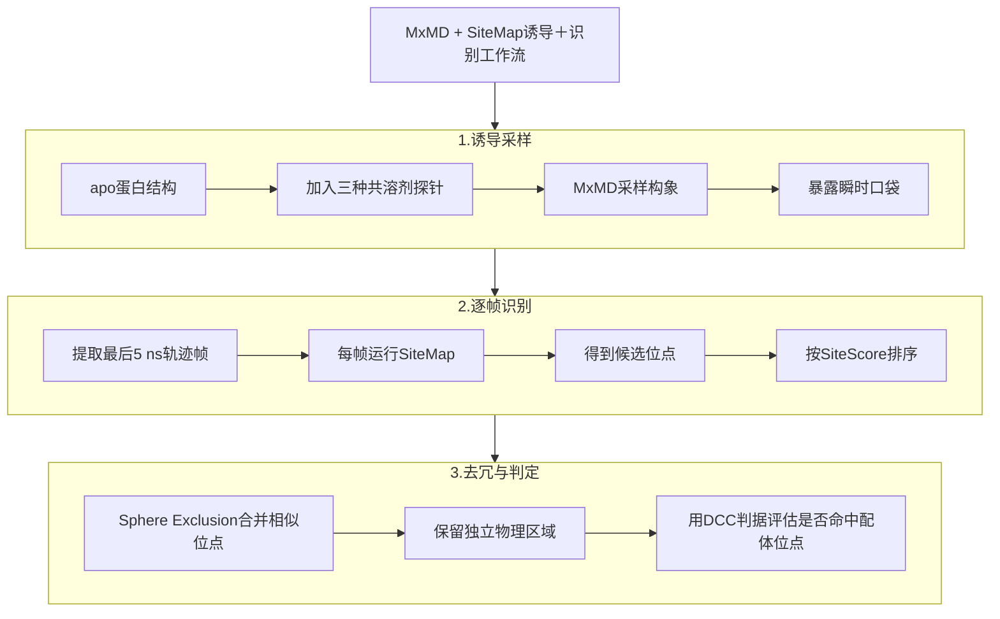

# 混合溶剂MD和物理打分联手挖出蛋白的隐藏结合口袋

## 本文信息

- **标题**：Identifying Cryptic Binding Sites with Mixed Solvent MD Simulation and SiteMap
- **作者**：Da Shi, Dmitry Lupyan, Steven Jerome, Robert Abel, Yuqi Zhang
- **发表期刊**：Journal of Chemical Information and Modeling
- **发表时间**：2026年7月24日
- **单位**：Schrödinger Inc.（美国加利福尼亚州圣地亚哥、马萨诸塞州剑桥、纽约州纽约）
- **DOI**：https://doi.org/10.1021/acs.jcim.6c01288
- **引用格式**：Shi, D., Lupyan, D., Jerome, S., Abel, R., & Zhang, Y. (2026). Identifying Cryptic Binding Sites with Mixed Solvent MD Simulation and SiteMap. *Journal of Chemical Information and Modeling*. https://doi.org/10.1021/acs.jcim.6c01288
- **代码与数据**：Schrödinger Suite 2025-3（商业软件）：https://www.schrodinger.com/downloads/releases；
  - MxMD + SiteMap工作流的结果文件：https://drive.google.com/drive/folders/1eTCUM-u5QcoS0Mv6Cx_sS8PS0P4IWRha

## 摘要

> 在基于结构的药物发现中，识别蛋白上的隐藏结合位点仍然是一个挑战，因为这些位点在apo结构（未结合研究配体的结构）中通常看不出来。本研究开发并验证了一套将**混合溶剂分子动力学**（MxMD）模拟与SiteMap相结合的**诱导＋识别工作流**。该方法利用MxMD采样蛋白构象以暴露隐藏口袋，再由SiteMap有效地识别和排序这些口袋。在一个包含**65个隐藏结合位点**的具有挑战性的数据集上，所开发的工作流在**78.5%的案例中能在top-5预测中识别出隐藏结合位点**。这些结果表明，所提出的MxMD + SiteMap工作流为早期药物发现提供了一个稳健且有价值的工具，能够通过有效诱导和识别隐藏结合位点来探索更广泛的成药靶标。

### 核心结论

- **互补识别**：SiteMap单独在65个案例中的top-5命中率为66.2%，原始MxMD为67.7%；两者结合后升至**78.5**%，top-10命中率为**95.4**%。构象采样与逐帧位点评分提供了互补信息。
- **KRAS全识别**：在KRAS这个经典难靶标上识别了三个已知位点，包括最难的**Switch I/II双隐式口袋**；静态SiteMap、原始MxMD和P2Rank都未识别该口袋。
- **采样长度权衡**：在22个位点子集上，把用于分析的轨迹窗口从最后5 ns延长到最后50 ns并未提高整体排名，因为更多帧引入了更多高分候选位点，**采样成功和假阳性之间需要平衡**。

## 背景

蛋白构象会随环境和配体结合而变化。有些结合位点只有在特定构象中才会显现，称为**隐藏结合位点**（cryptic binding site）。它们可用于解释已知配体的作用机制，也可能为虚拟筛选和别构调控提供候选区域。隐藏位点常由实验筛选和结构解析发现：

- **高通量筛选**（HTS）：从大规模化合物库中寻找能调节蛋白功能的分子，再以结构实验定位结合位点
- **片段筛选**：用小分子片段探测蛋白表面潜在结合区域
- **溶液NMR**：用化学位移扰动捕捉配体与蛋白的弱相互作用

这些方法通常成本较高、周期较长；片段筛选本身可以发现新的结合物，但仍受实验通量和可测性限制。在没有先导配体线索时，用计算方法预先提出隐藏位点候选具有实际价值。计算方法主要有三类：

- **物理方法**：以分子动力学（MD）模拟为代表，通过采样蛋白构象把瞬时出现的口袋暴露出来，再用打分函数把它们识别出来。**这条路的核心问题在于采样是否充分、打分是否准确**
- **机器学习方法**：以P2Rank、CryptoSite为代表，能直接从蛋白结构或序列预测隐藏口袋，**速度快、成本低，但受限于训练集的覆盖范围**——隐藏位点和别构位点本身在训练集里就少而多样
- **共折叠模型**：需要候选配体作为输入，**文中评测显示它们更偏向正构位点**，对别构配体的姿势预测更具挑战

本文把MxMD用于生成蛋白构象系综，再由SiteMap逐帧评价口袋。研究在65个隐藏位点上比较单独方法与组合工作流，并以KRAS为案例。要解决的问题是：输入蛋白构象，输出口袋位置。

## 研究内容

### 核心方法：MxMD + SiteMap诱导＋识别工作流

工作流包括“诱导”和“识别”两步。

#### 整体思路：MxMD + SiteMap两阶段工作流

- **诱导：MxMD采样构象系综。** 输入一个apo蛋白结构，加入乙腈、异丙醇、嘧啶三种共溶剂探针跑MD模拟。每种探针进行10条重复模拟，从末5 ns提取构象；三种共溶剂合计约3000帧。**只要某一帧的隐藏口袋短暂打开，后续就有机会捕捉到它**。
- **识别：SiteMap逐帧打分。** 对约3000帧分别做全表面扫描，先得到约15000个候选口袋；再按SiteScore由高到低去重。若两个位点周围的残基集合足够相似（Tanimoto相似度$>0.4$，即两集合的交集相对并集较大），就只保留分数较高者，最终留下10至170个独立候选口袋。
- **评估：DCC判据事后判定。** DCC（distance to closest atom，距最近原子的距离）以**预测位点中心到任一配体原子的最短距离**衡量位置是否重合；该距离小于4 Å即记为命中。它不参与候选位点生成，**只用于评估已知holo（配体结合态）位点排在第几名**。

> 原来的MxMD工作流只按探针占用来定热点，短暂开放、但探针未充分积累的口袋容易漏掉。本文改为让SiteMap在所有采样帧上评价口袋形状与理化环境，弥补单纯占用信号的不足。具体平衡流程、探针占用图和长轨迹对照放在文末附录。

### SiteScore的表征

#### SiteScore为什么能有效区分口袋

**图1：SiteMap对liganded site（有配体结合的位点）和non-liganded site（无配体结合的位点）的输出指标分布**

| 子图 | 指标 | liganded sites（蓝色） | non-liganded sites（橙色） |
| --- | --- | --- | --- |
| 左上 | SiteScore | 中位约 **1.03** | 中位约 0.75 |
| 右上 | Dscore | 整体较高 | 整体较低 |
| 左下 | volume（$\mathrm{Å}^3$） | 中位约 **320** | 中位约 120 |
| 右下 | balance（亲疏水特征的平衡程度） | 略高 | 略低 |

> **SiteScore可理解为“这个凹陷像不像能容纳小分子、并与之形成有利相互作用的口袋”的综合分数**。配体位点的中位数为1.03，因此作者建议前瞻应用先用1.0筛选；这是经验阈值，不是硬界线。Dscore也是位点的类药性评分，balance则反映亲水与疏水特征是否协调。

**图2：SiteScore区间对应的配体结合亲和力（$pK_i$）分布**

- **横轴**：SiteScore区间；**纵轴**：Ligand Affinity（$pK_i$，即$K_i$的负对数，数值越大表示结合越紧），**图中散点**：离群点（钻石标记）表示高亲和力或低亲和力的特例
- 每个区间对应的配体**亲和力中位数随SiteScore升高而升高**，1.0+区间的中位数约7，显著高于0-0.6区间的5左右

> 这两张图共同说明：**SiteScore不仅能区分是不是位点，还与配体的实际结合强度有一定相关性**。这给后续用SiteScore排序位点提供了物理依据：**分数高的位点看起来更像口袋，平均倾向结合更强亲和力的配体**，但不能简单等同于“高分位点一定能结合高亲和力配体”。

### SiteMap在PDBbind v2020上的细分性能

在把SiteMap接进工作流之前，研究先确认它在常规已知位点上的表现。用PDBbind v2020数据集（19,443个蛋白-配体复合物和2,846个蛋白-蛋白复合物）测试：先移除原有配体，再让SiteMap盲找口袋；“top-5识别率”指真实配体位置是否落在它分数最高的前5个候选中。结果按配体模态分：

| 配体模态 | 总PDB数 | 含配体位点的PDB数 | Top-5识别率 |
| --- | --- | --- | --- |
| 小分子 | 17,098 | 14,658 | 85.7% |
| 大环 | 669 | 522 | 78.0% |
| 肽 | 2008 | 1241 | 61.8% |
| 蛋白 | 2357 | 718 | 30.5% |

配体模态的分类标准是：小分子（少于6个Cα原子且无大环）、大环（含超过8个原子的环）、肽（6到30个Cα原子）、蛋白（超过30个Cα原子）。配体越大，识别率越低——默认SiteMap配置针对小分子位点优化。开启“Detect shallow binding modes”选项后，肽配体识别率从61.8%升到**70.9**%，蛋白配体从30.5%升到**54.1**%，说明**SiteMap对浅埋或扁平位点的捕捉能力可以通过配置改善**。

## 主要结果

### apo vs holo结构的SiteMap指标对比

对65个隐藏位点，作者先用site-evaluation模式（已知配体位置）对apo和holo结构都跑了SiteMap：

| 结构 | 含配体位点的PDB数 | 平均SiteScore | SiteScore标准差 | 平均体积（$\mathrm{Å}^{3}$） | 体积标准差 |
| --- | --- | --- | --- | --- | --- |
| apo | 51 | 0.93 | 0.16 | 260 | 149 |
| holo | 65 | 1.07 | 0.12 | 322 | 175 |

在已知配体位置的评估中，apo结构有51个位点被SiteMap识别到，但**平均SiteScore低0.14、体积小约20%**。这与许多apo口袋尚未完全打开相符，也解释了静态SiteMap在隐藏位点数据集上的识别受限。

### 在65个隐藏位点数据集上的benchmark

作者从Schrödinger内部集合和CryptoSite、CryptoBench、PocketMiner、CrypToth等多个先前研究数据集中收集了**65个隐藏结合位点**，每个位点配有一个apo PDB结构、一个holo PDB结构和一个对应配体，按蛋白类型分布如下：

| 蛋白类别 | 数量 | 示例 |
| --- | --- | --- |
| 激酶（kinases） | 8 | - |
| 核激素受体（nuclear hormone receptors） | 3 | - |
| 非激酶酶（nonkinase enzymes） | 35 | 各类酶 |
| 其他蛋白（包括转运蛋白、驱动蛋白等） | 19 | transporters, kinesins |
| **合计** | **65** | - |

筛选标准：所有holo结构分辨率优于3 Å、**free R不超过0.3**，并经肉眼检查确认配体存在、无晶体接触造成的假口袋。free R是晶体结构精修的交叉验证误差，数值较低通常表示模型与实验衍射数据更一致。

**图3：SiteMap识别位点的两个结构示例**

- **（A）有配体结合的位点**：绿色点（SiteMap位点）紧密聚集在橙色holo配体所在的口袋，说明SiteMap命中了真实结合位点
- **（B）无配体结合的位点**：绿色点散布在蛋白表面、不与任何holo配体重合，是SiteMap报出的假阳性位点
- 灰色cartoon为apo蛋白结构，橙色sticks为对齐后的holo配体。图（A）展示命中配体位点的情形，图（B）展示未命中配体位点的情形；二者的差别来自预测位点是否与holo配体位置重合

### MxMD + SiteMap工作流大幅领先单方法

下表对比几种方法在65个隐藏位点上的表现。top-5和top-10表示真实位点是否进入前5或前10个候选；平均配体-位点重叠度越高，预测区域与holo配体覆盖得越接近。

| 方法 | Top-5命中率 | Top-10命中率 | 平均配体-位点重叠 |
| --- | --- | --- | --- |
| SiteMap | 66.2% | 67.7% | 0.37 |
| MxMD | 67.7% | 70.8% | 0.46 |
| **MxMD + SiteMap** | **78.5**% | **95.4**% | 0.40 |
| P2Rank | 66.2% | 66.2% | 0.40 |
| Boltz-1（共折叠） | 84.6%（top-1） | - | 0.88 |

组合工作流的top-5命中率比SiteMap高**12.3个百分点**，top-10命中率高**27.7个百分点**。其余3个未进入top-10的案例在SI中作了如下分析：

- **3KFL**：SiteScore 0.9，MxMD可能未采到足够接近配体结合态的口袋构象；排名第3的工作流位点也在配体附近，只是稍更暴露
- **3P53**：SiteScore 1.0，原因类似；排名第1的工作流位点也在配体附近，可能是DCC判据（4 Å阈值）的假阴性
- **1FXX/3HL8**：SiteScore 0.96，是SSB蛋白与其相互作用酶之间的**蛋白-蛋白相互作用**（PPI）位点；默认SiteMap未针对PPI优化，开启适用于PPI的浅位点检测后**排名升至9**

> **MxMD解决“口袋有没有短暂打开”，SiteMap解决“打开的凹陷像不像可结合的小分子位点”**。两者串联，便能找回只在少数轨迹帧出现、因探针占用不足而未被原始MxMD列为热点的口袋。

3UGK（酵母氨酸脱氢酶）中，静态apo结构上的SiteMap未命中配体位点；MxMD热点则与holo配体重叠。该例说明共溶剂MD可以采到静态结构没有呈现的口袋构象。

**图4：3UGK上MxMD hotspot与SiteMap位点的对比**

- **（A）MxMD hotspot命中**：绿色surface为MxMD识别的hotspot，与橙色holo配体重叠，说明探针占用信号确实能覆盖到这个隐藏口袋
- **（B）SiteMap位点未重合**：直接在apo结构上跑SiteMap，绿色点未落在holo配体处，单帧打分漏掉了这个口袋
- 灰色cartoon为apo蛋白结构，橙色sticks为对齐后的holo配体。

3QXW（VHH抗体）给出另一种情形：SiteMap和原始MxMD都未命中，但MxMD轨迹中存在更开放的一帧构象，SiteMap在该帧识别到位点。

**图5：3QXW上三种方法的位点识别对比**

- **（A）SiteMap单独**：在apo结构上未命中真实口袋；**（B）MxMD单独**：绿色surface（hotspot）未覆盖目标口袋
- **（C）MxMD + SiteMap**：在MxMD采样帧上运行SiteMap后，绿色点与真实口袋重合
- **（D）apo与holo构象**：灰色cartoon为apo结构，蓝色ribbon为对齐后的holo结构，橙色sticks为holo配体——两个状态在口袋区域构象差异明显，配体口袋在apo状态基本关闭

### 与机器学习方法的对比

P2Rank和Boltz-1采用不同的机器学习思路，因此比较时需要区分它们的输入和输出：

- **P2Rank v2.5**：该随机森林模型先将溶剂可及表面离散为点，用局部理化和几何描述符为每个点打分，再把高分点聚类为口袋。它在每个apo结构上平均输出3个位点，top-5命中率为66.2%，扩大到top-10后不变，对3QXW也未命中。
- **Boltz-1**：该深度学习共折叠模型以蛋白序列和候选配体为输入，直接输出一个蛋白-配体复合物构象，而不是候选口袋列表。它在本数据集的top-1命中率为84.6%（55个结构），平均配体-位点重叠为0.88；但这项测试中**只有1MPU（holo：8EA5）不在训练数据覆盖范围内**，性能不能代表未知隐藏位点的前瞻表现。

Boltz-1需要已知结合配体作为输入，而隐藏位点发现往往正缺少这种线索。文中引用的评测还指出，共折叠模型更倾向预测正构位点，且与训练结构相似度较低时姿势预测性能会下降。

> **Boltz-1回答的是“给定候选配体，它会结合在哪里”；MxMD + SiteMap回答的是“蛋白表面哪些区域可能形成结合位点”**。两种任务的输入不同，表中的数值不能直接比较。

### KRAS案例：识别三个测试位点

KRAS是RAS/MAPK通路中的GTP酶，参与调节细胞增殖、分化和存活；约**19%的癌症患者携带KRAS突变**。其活性在GTP结合态与GDP结合态之间切换，Switch I（残基约30-38）和Switch II（残基约60-76）是控制该切换的柔性区域。与本文相关的位点包括：

- **长期被认为不可成药**，因为除了GTP/GDP正构位点外没有明显的深口袋，**成药难度大**
  - **Switch II口袋**：突变选择性的共价抑制剂打这个口袋，**是近几年别构抑制剂的代表性方向**
  - **Switch I/II口袋**：非共价别构配体结合此口袋，是KRAS上**最难的识别目标**
- 这些口袋在apo结构中基本缺失或轮廓不清，因此单帧结构方法容易漏检

作者用KRAS apo结构（PDB: 7C40）作为输入，比较所有方法在三个位点上的识别情况：

| 方法 | GTP/GDP位点 | Switch II位点（7RPZ） | Switch I/II位点（6GJ8） |
| --- | --- | --- | --- |
| SiteMap | 1 | 2 | 未找到 |
| MxMD | 4 | 1 | 未找到 |
| **MxMD + SiteMap** | 4 | 1 | **6** |
| P2Rank | 1 | 2 | 未找到 |
| Boltz-1（共折叠） | 1 | 1 | 1 |

SiteMap、MxMD和P2Rank识别到GTP/GDP和Switch II位点，但未识别Switch I/II位点。Boltz-1识别全部三个位点的条件是输入对应的holo配体。MxMD + SiteMap不需要已知结合配体，也在第6名找回Switch I/II位点。

关于采样长度、Vanilla MD对照、低排序案例和完整MxMD平衡协议，详见附录：[MxMD与SiteMap识别隐藏口袋的技术细节与补充分析](2026-07-26-induce-and-identify-appendix.md)。

**图6：KRAS上MxMD + SiteMap识别的正构与别构结合位点**

- **灰色cartoon**：KRAS apo蛋白的MxMD帧结构
- **橙色sticks**：对齐后的holo配体
- **绿色点**：MxMD + SiteMap工作流识别的SiteMap位点
- **覆盖的三个位点**：GTP/GDP正构位点、Switch II位点和Switch I/II位点，后两者是经典别构位点

## 关键结论与批判性总结

### 主要影响

- **方法定位**：组合工作流将构象采样与口袋排序分开处理。对3QXW，只有组合后才命中；对KRAS的Switch I/II位点，组合工作流在不输入已知结合配体的前提下给出第6名。
- **实际使用条件**：该流程已纳入Schrödinger Suite 2025-3，MxMD与SiteMap均为商业软件模块。研究公开了结果文件，但从头运行流程仍需要相应的软件与计算资源。
- **适用范围**：SiteMap在PDBbind小分子案例中的top-5识别率为85.7%，但在肽和蛋白配体案例中明显下降。组合流程的优势来自对构象系综逐帧评分，不代表静态SiteMap本身解决了隐藏位点的采样问题。

### 局限性

- **采样局限**：工作流受MD采样能力限制。如果apo到holo需要大幅构象变化，MxMD的高探针浓度模拟可能导致长轨迹中蛋白结构不稳定，**采样可能无法覆盖接近配体结合态的构象**。3KFL和3P53可能受此影响；1FXX则主要是默认SiteMap不适配蛋白-蛋白相互作用的浅位点。
- **采样长度与假阳性**：在22个位点子集上，将分析窗口扩展到最后50 ns没有改善整体排名。更多轨迹帧产生了更多高SiteScore候选位点，假阳性随之增加。
- **配体模态敏感性**：SiteMap默认配置针对小分子位点优化。蛋白-蛋白相互作用（PPI）位点（1FXX/3HL8）以及肽、蛋白配体位点需要启用浅位点检测设置，组合工作流本身不会消除这一限制。
- **共折叠模型的比较边界**：Boltz-1的84.6% top-1结果来自与训练数据高度重叠的集合，且需要提供候选配体。因此，该结果不能用于估计其在未知隐藏位点发现任务中的表现。

### 未来方向

- **对接ML共折叠系综**：作者指出，本文工作流**不局限于MxMD采样**，未来可以结合能生成构象系综的ML共折叠方法——把采样交给ML，打分仍然用基于物理的SiteMap。

> 小编锐评：嗯，跟我的思路挺像……终极之路还是做好力场采好样
