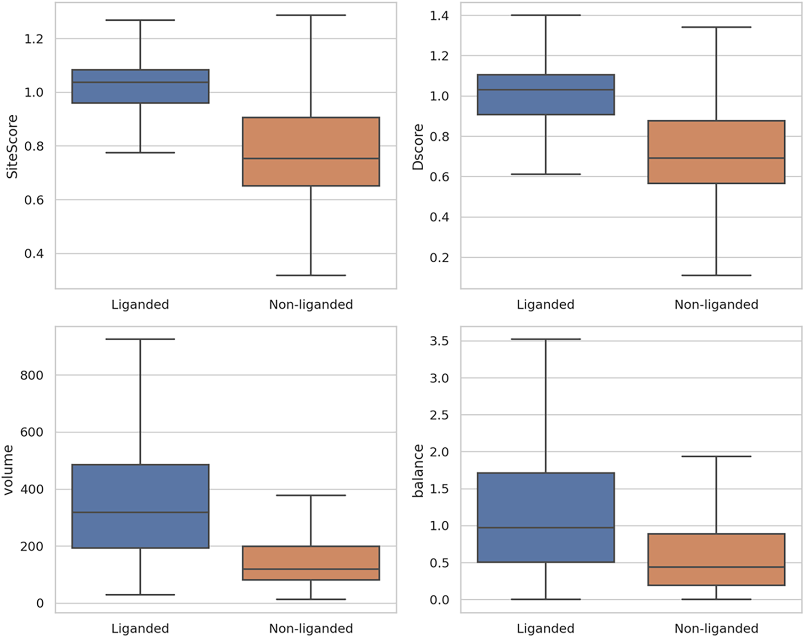
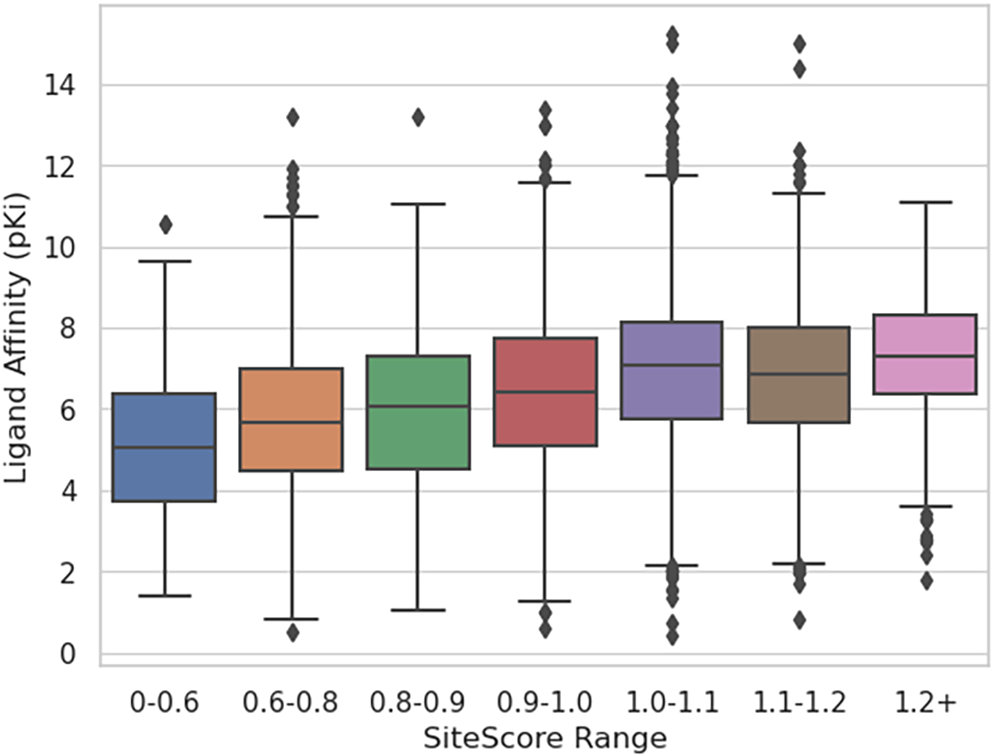
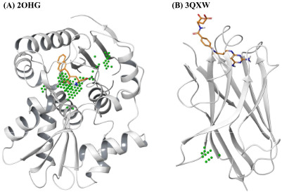
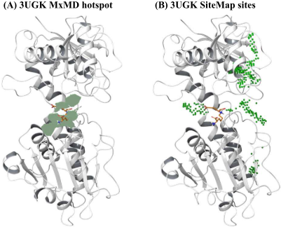
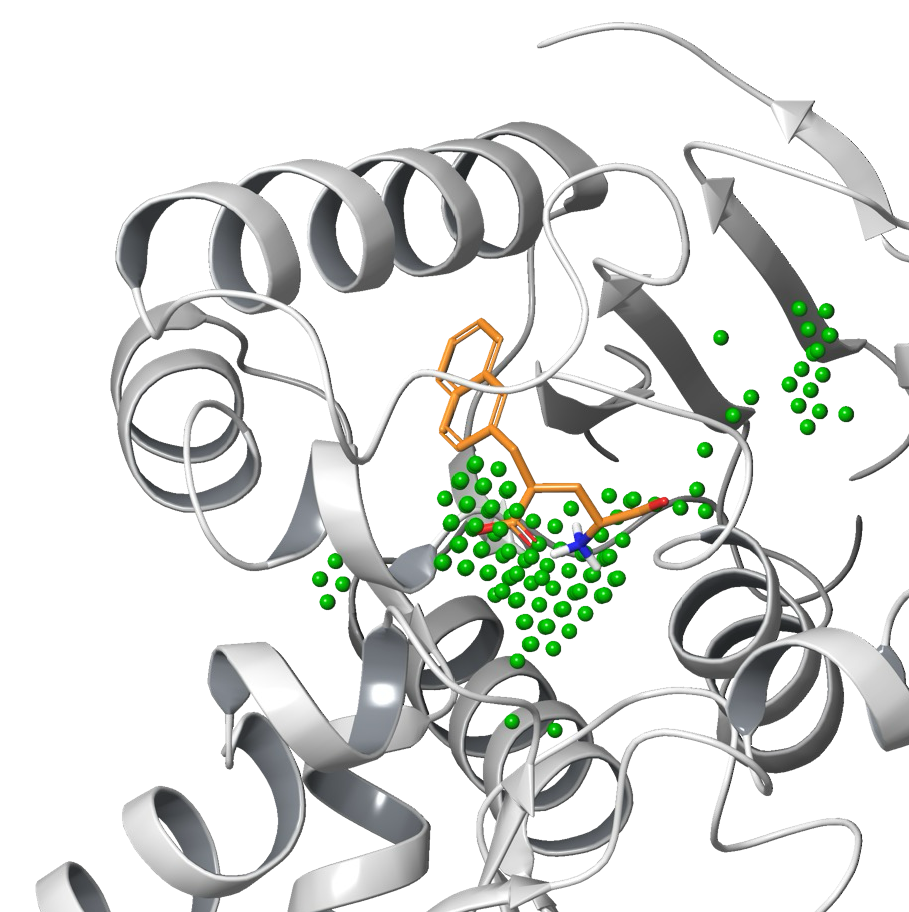
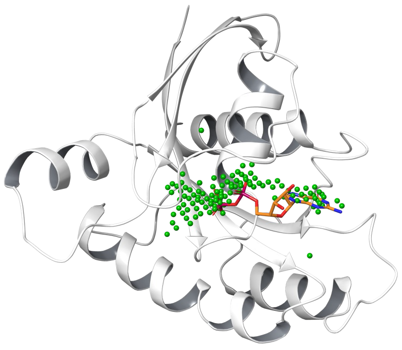

# 诱导＋识别：用MxMD和SiteMap找出那些藏起来的隐藏口袋

## 本文信息

- **标题**：Identifying Cryptic Binding Sites with Mixed Solvent MD Simulation and SiteMap
- **作者**：Da Shi, Dmitry Lupyan, Steven Jerome, Robert Abel, Yuqi Zhang
- **发表期刊**：Journal of Chemical Information and Modeling
- **发表时间**：2026年
- **单位**：Schrödinger Inc.（美国加利福尼亚州圣地亚哥、马萨诸塞州剑桥、纽约州纽约）
- **DOI**：https://doi.org/10.1021/acs.jcim.6c01288
- **引用格式**：Shi, D., Lupyan, D., Jerome, S., Abel, R., & Zhang, Y. (2026). Identifying Cryptic Binding Sites with Mixed Solvent MD Simulation and SiteMap. *Journal of Chemical Information and Modeling*. https://doi.org/10.1021/acs.jcim.6c01288
- **代码与数据**：Schrödinger Suite 2025-3（商业软件）：https://www.schrodinger.com/downloads/releases；
  - MxMD + SiteMap工作流的结果文件：https://drive.google.com/drive/folders/1eTCUM-u5QcoS0Mv6Cx_sS8PS0P4IWRha

## 摘要

> 在基于结构的药物发现中，识别蛋白上的隐藏结合位点仍然是一个挑战，因为这些位点在apo结构中通常看不出来。本研究开发并验证了一套将**混合溶剂分子动力学**（MxMD）模拟与SiteMap相结合的**诱导＋识别工作流**。该方法利用MxMD采样蛋白构象以暴露隐藏口袋，再由SiteMap有效地识别和排序这些口袋。在一个包含**65个隐藏结合位点**的具有挑战性的数据集上，所开发的工作流在**78.5%的案例中能在top-5预测中识别出隐藏结合位点**。这些结果表明，所提出的MxMD + SiteMap工作流为早期药物发现提供了一个稳健且有价值的工具，能够通过有效诱导和识别隐藏结合位点来探索更广泛的成药靶标。

### 核心结论

- **效率提升显著**：MxMD + SiteMap工作流将隐藏口袋的top-5命中率从SiteMap单独使用的66.2%和MxMD单独使用的67.7%提升至**78.5**%，top-10命中率提升至**95.4**%。
- **聚焦难隐式口袋**：对SiteMap单独无法识别（约30%案例）和MxMD单独由于探针占有率低而漏掉的隐藏位点特别有效，二者结合能显著提升识别能力。
- **KRAS全识别**：在KRAS这个经典难靶标上成功识别了所有三个已知口袋，包括最难识别的**Switch I/II双隐式口袋**，而SiteMap、MxMD和P2Rank均未识别。
- **采样长度权衡**：把MxMD生产段从15 ns延长到50 ns反而降低了整体性能，因为更多帧引入了更多高分非配体位点，**采样成功和假阳性之间需要平衡**。

## 背景

蛋白的构象是动态的——很多配体结合位点只有在配体诱导下才会形成对应的构象，这些位点被称为**隐藏结合位点**（cryptic binding site）。它们对新药研发价值很高：既能解释已知结合剂的机制，也为虚拟筛选和别构调控打开了新的可能性。但传统上，隐藏位点主要靠**碎晶筛选、片段筛选溶液NMR**这些实验手段偶然发现，而这些方法既贵又费时，通常还得先有已知结合物才能做。在没有已知结合物的情况下，用计算方法预先把隐藏位点挖出来，就成了结构药物发现早期的硬需求。计算方法主要分两条路：

- 一条是**物理方法**，以分子动力学（MD）模拟为代表，通过采样蛋白构象把瞬时出现的口袋暴露出来，再用打分函数把它们识别出来。这条路的核心问题在于采样是否充分、打分是否准确。
- 另一条是**机器学习方法**，以P2Rank、CryptoSite、Boltz-1为代表，能直接从蛋白结构或序列预测隐藏口袋，速度快、成本低，但受限于训练集的覆盖范围——而隐藏位点和别构位点本身在训练集里就少而多样。
- 共折叠（cofolding）模型在最近的评测中还表现出偏向正构位点（orthosteric site）的问题，对别构口袋不太友好。

> 这两条路各有优劣，于是很自然地想到：**能不能用一种物理方法的采样配一种好的打分函数，把两边的短板各补一半**，这正是本文的核心思路。

本文就是这种思路的一个具体落地：作者选了Schrödinger自家的MxMD做采样，再配SiteMap做打分，用65个隐藏位点的挑战性数据集做benchmark，最后还在KRAS这种公认的难靶上做了案例验证。

### 关键科学问题

- **隐藏口袋在apo结构里根本不存在，怎么把它找出来**：这是结构药物发现中长期悬而未决的硬问题。SiteMap、MxMD等单方法受限于采样或打分的局限，对需要大幅构象重排的隐藏口袋无能为力。
- **采样充分性与打分准确性的协同**：MxMD的探针占用率信号太弱，会漏掉很多低占据但真实的口袋；SiteMap在单帧上打分很准，但不能反映动力学信息。如何把两者的优势组合起来？
- **工作流的泛化性**：能不能在KRAS这种不可成药靶标上也跑得通，找到那些只有在配体诱导下才会形成的别构口袋？这一点直接决定了它能否走出benchmark、走进实际药物发现项目。

### 创新点

- **方法创新**：把MxMD的构象采样和SiteMap的位点打分**解耦再串联**——MxMD负责诱导瞬时口袋出现，SiteMap负责在所有采样帧上识别和排序位点。这条诱导＋识别流水线解决了原MxMD工作流仅依赖探针占用率、容易漏掉低占据率隐藏位点的短板。
- **基准创新**：构建了65个隐藏结合位点的**挑战性数据集**，涵盖8种激酶、3种核激素受体、35种非激酶酶和19种其他蛋白，包括各种配体模态（小分子、大环、肽、蛋白），用于系统性benchmark。
- **SiteMap现代化验证**：用PDBbind v2020数据集（19,443个蛋白-配体复合物）验证SiteMap在现代结构上的性能，确认**SiteScore阈值1.0**仍然是区分结合位点和非结合位点的有效指标。
- **采样长度系统评估**：探究了MxMD模拟长度对性能的影响，发现延长到50 ns反而降低了性能——这一发现对MxMD的协议设计有指导意义。

## 研究内容

### 核心方法：MxMD + SiteMap诱导＋识别工作流

整个工作流可以拆成“诱导”和“识别”两步。

#### “诱导”阶段：用MxMD采样apo蛋白构象

MxMD的核心思想是把**小分子探针**（Schrödinger默认三种：乙腈、异丙醇、嘧啶）混入水溶剂中跑MD。这三种探针的化学性质互补：乙腈极性强、含氮腈基，是典型氢键受体探针；异丙醇带羟基，兼有氢键给体和疏水异丙基；嘧啶是芳香杂环，能探测芳香和π-π相互作用的口袋。探针分子会自发探索蛋白表面的各个角落，频繁结合到能量有利的位点——这些位点很可能就是潜在的结合口袋。Schrödinger官方协议包含两个溶剂化步骤和七个动力学步骤：

1. 在蛋白外加一层7 Å厚度的共溶剂层（乙腈、异丙醇、嘧啶三种）
2. 再加水至**共溶剂与水的体积比为5%**——也就是共溶剂体积占整个体系体积的5%，其余是水和蛋白
3. 24 ps布朗动力学（NVT, 10 K，全原子约束）
4. 24 ps（重原子约束）
5. 12 ps MD（NVT, 10 K，重原子约束）
6. 12 ps（NPT, 10 K）
7. 24 ps（NPT, 300 K，重原子约束）
8. 15 ns生产（NPT, 300 K，无约束）
9. 5 ns生产（NPT, 300 K，无约束，用于数据采集）

每种探针跑10条重复轨迹，共30条。对每条轨迹的最后5 ns，按**每10帧**采样一次，约得到1000帧结构。

MxMD内部对采样结果的处理：

- 把每条轨迹的探针原子坐标按0.5 Å网格分箱，得到原始占用计数
- 把计数转换成Z-score，用单连接层次聚类（3 Å截距）把高占用网格点合并成spot
- **两个及以上不同探针的spot有重叠时定义为hotspot**，用所有spot的Z-score加和作为**MxMD score**对hotspot排序
- 这一步是原MxMD工作流的位点识别方式，平均每个apo结构能识别约15个hotspot

但这套纯靠占用率的识别对低占据率的隐藏口袋天然不友好，本文工作流要解决的就是这个问题。

#### "识别"阶段：用SiteMap对所有帧打分排序

MxMD的探针占用率只是口袋开放过的信号，很多隐藏口袋可能根本没等到探针占领就关上了——这就是原MxMD工作流漏掉大量位点的原因。所以作者把MxMD的采样结果直接交给SiteMap做"识别"，看下一句图1就能直观看到为什么要换工具。

SiteMap是Schrödinger的一个基于物理的位点打分工具，沿着蛋白表面做网格扫描，对每个候选位点计算**SiteScore**——综合考虑位点的体积、溶剂暴露度、疏水性、亲水性等物理特征。它有两种运行模式，本文的逻辑和分工很清晰：

- **site-evaluation模式**：需要把"配体大概在这里"告诉SiteMap，以holo配体位置为中心、6 Å半径的盒子限定扫描区域。这个模式只用于**基准评估**（表3那种apo vs holo对比），**不进工作流**
- **site-detection模式**：不预设任何配体位置，对蛋白表面**全范围扫描**，找遍所有潜在位点。这才是工作流真正用的模式

> SiteMap对liganded site（有配体结合的位点）和non-liganded site（无配体结合的位点）的输出指标分布。

| 子图 | 指标 | liganded sites（蓝色） | non-liganded sites（橙色） |
| --- | --- | --- | --- |
| 左上 | SiteScore | 中位约 **1.03** | 中位约 0.75 |
| 右上 | Dscore | 整体较高 | 整体较低 |
| 左下 | volume（$\mathrm{Å}^3$） | 中位约 **320** | 中位约 120 |
| 右下 | balance（亲疏水平衡） | 略高 | 略低 |

配体位点的SiteScore中位数1.03明显高于非配体位点的0.75——这就是后文"1.0阈值"的物理来源。

工作流的具体流程如下，每一步都和前一步的结果对应：

1. **提取MxMD帧**：MxMD跑完后，把每个共溶剂的MD轨迹从最后5 ns按**步长10**（每隔10帧取一帧）采样，每种共溶剂约得到1000帧，三种共溶剂总共约**3000帧**蛋白结构
2. **逐帧跑SiteMap**：把全部3000帧都丢给SiteMap用**site-detection模式**打分，每帧平均报出约5个位点，总共得到约**15,000个候选位点**——这15,000就是从3,000个瞬时构象里"识别"出来的候选口袋
3. **用Sphere Exclusion合并去冗**：把所有15,000个位点按SiteScore从高到低排序，**从最高分开始遍历**，选中一个就把它放进最终列表，再把所有"残基组成高度相似"（Tanimoto相似度>0.4）的其他位点标记掉、跳过。这步保证最终列表里每个位点对应蛋白上一个独立的物理区域，不会被同一口袋在不同帧里反复刷出
4. **按SiteScore排序出最终列表**：去冗后剩10到170个位点（取决于蛋白大小），按SiteScore从高到低输出，就是后面表4里的"top-5命中率"——看holo配体是不是排进了前5

配体-位点对应关系不是工作流做的事，而是评估用的判据。**DCC判据**（距离位点中心到配体任意原子<4 Å视为"配体占据"）用于事后判断工作流命中的位点是不是真口袋，4 Å阈值沿用自P2Rank文章。位点周围的蛋白残基定义为距位点中心3.5 Å以内；肽和蛋白配体的位点-配体重叠只统计距受体3 Å以内的配体原子。

> 这一步把物理信号（SiteScore）和位置信号（DCC）分离开，让SiteMap专注于评估位点是否具有配体结合的物理条件，而不需要直接对应到已知配体上。

**图1：SiteMap对liganded site（有配体结合的位点）和non-liganded site（无配体结合的位点）的输出指标分布**

| 子图 | 指标 | liganded sites（蓝色） | non-liganded sites（橙色） |
| --- | --- | --- | --- |
| 左上 | SiteScore | 中位约 **1.03** | 中位约 0.75 |
| 右上 | Dscore | 整体较高 | 整体较低 |
| 左下 | volume（$\mathrm{Å}^3$） | 中位约 **320** | 中位约 120 |
| 右下 | balance（亲疏水平衡） | 略高 | 略低 |

> SiteScore的1.0阈值就是从这张图的配体/非配体位点中位数差异推出来的——配体位点整体高于1.0、非配体位点整体低于1.0，过滤非位点的效果很干净。这也是把SiteMap接进MxMD工作流的物理基础。

**图2：SiteScore区间对应的配体结合亲和力（pKi）分布**

- **横轴**：SiteScore区间；**纵轴**：Ligand Affinity（pKi）
- **图例**：每个区间对应的配体亲和力中位数随SiteScore升高而升高，1.0+区间的中位数约**7**，显著高于0-0.6区间的**5**左右
- **图中散点**：离群点（钻石标记）表示高亲和力或低亲和力的特例

这张图进一步说明SiteScore不仅能区分是不是位点，还与配体的**实际结合强度**呈正相关——SiteScore越高，配体平均结合得越紧。这给后续用SiteScore排序位点提供了物理依据：分数高的位点不仅看起来像口袋，还真的能结合高亲和力配体。

### 主要结果

#### SiteMap在PDBbind v2020上的细分性能

为了给SiteMap接进工作流提供物理基础，作者先用PDBbind v2020数据集（19,443个蛋白-配体复合物 + 2,846个蛋白-蛋白复合物）做了细分benchmark。结果按配体模态分：

| 配体模态 | 总PDB数 | 含配体位点的PDB数 | Top-5识别率 |
| --- | --- | --- | --- |
| 小分子 | 17,098 | 14,658 | 85.7% |
| 大环 | 669 | 522 | 78.0% |
| 肽 | 2008 | 1241 | 61.8% |
| 蛋白 | 2357 | 718 | 30.5% |

配体越大，识别率越低——默认SiteMap配置针对小分子位点优化。开启“Detect shallow binding modes”选项后，肽配体识别率从61.8%升到**70.9**%，蛋白配体从30.5%升到**54.1**%，说明**SiteMap对浅埋或扁平位点的捕捉能力可以通过配置改善**。

配体模态的分类标准是：小分子（少于6个Cα原子且无大环）、大环（含超过8个原子的环）、肽（6到30个Cα原子）、蛋白（超过30个Cα原子）。

#### apo vs holo结构的SiteMap指标对比

对65个隐藏位点，作者先用site-evaluation模式（已知配体位置）对apo和holo结构都跑了SiteMap：

| 结构 | 含配体位点的PDB数 | 平均SiteScore | SiteScore标准差 | 平均体积（ų） | 体积标准差 |
| --- | --- | --- | --- | --- | --- |
| apo | 51 | 0.93 | 0.16 | 260 | 149 |
| holo | 65 | 1.07 | 0.12 | 322 | 175 |

apo结构虽然有51个能识别到“看起来像位点”的区域，但**SiteScore平均低了0.14、体积也小约20%**——apo结构的位点构象本身就是次优的，这是SiteMap在隐藏位点上命中率仅66.2%的根本原因：很多位点在apo状态下根本没有完全打开。

#### 在65个隐藏位点数据集上的benchmark

作者从内部集合和CryptoSite、CryptoBench、PocketMiner、CrypToth等多个公开来源中收集了**65个隐藏结合位点**，构成挑战性测试集。其中8种激酶、3种核激素受体、35种非激酶酶和19种其他蛋白（包括转运蛋白和驱动蛋白）。数据集的几个关键约束：

- **结构质量筛选**：所有holo结构分辨率都优于3 Å、free R不超过0.3，且经过肉眼检查确认配体存在且没有晶体接触干扰
- **apo与holo构象差异**：位点残基RMSD中位数为3.2 Å，平均3.49 ± 1.79 Å——**确认数据集里apo和holo之间存在大幅构象差异**
- **apo结构的立体冲突**：所有apo结构对齐到holo配体后都存在明显的立体冲突，中位数有6个残基与配体发生clash——这从另一个角度说明数据集里apo口袋确实需要重新打开才能容纳配体

**图3：SiteMap识别位点的两个结构示例**

- **（A）有配体结合的位点**：绿色点（SiteMap位点）紧密聚集在橙色holo配体所在的口袋，说明SiteMap命中了真实结合位点
- **（B）无配体结合的位点**：绿色点散布在蛋白表面、不与任何holo配体重合，是SiteMap报出的假阳性位点
- 灰色cartoon为apo蛋白结构，橙色sticks为对齐蛋白后的holo配体。SiteScore阈值1.0要过滤掉的就是（B）这类散点

#### MxMD + SiteMap工作流大幅领先单方法

下表对比了几种方法在65个隐藏位点上的top-5命中率、top-10命中率和平均配体-位点重叠度（DCC判据4 Å阈值定义）：

| 方法 | Top-5命中率 | Top-10命中率 | 平均配体-位点重叠 |
| --- | --- | --- | --- |
| SiteMap | 66.2% | 67.7% | 0.37 |
| MxMD | 67.7% | 70.8% | 0.46 |
| **MxMD + SiteMap** | **78.5**% | **95.4**% | 0.40 |
| P2Rank | 66.2% | 66.2% | 0.40 |
| Boltz-1（共折叠） | 84.6%（top-1） | - | 0.88 |

工作流在top-5命中率上**比SiteMap单独使用提升了12.3个百分点**，top-10命中率上**提升了27.7个百分点**。剩下3个连top-10都没命中的案例（PDB: 3KFL, 3P53, 1FXX/3HL8）作者都做了调查：前两个是MxMD采样没恢复到holo-like构象、SiteScore自然就低（0.9-1.0）；第三个是**PPI位点**，默认SiteMap没针对PPI优化，换成PPI模式的SiteMap后排名第9——这3个案例都不是方法本身的问题，而是采样或配置选择的限制。

> 这条流水线之所以有效，是因为它把两个能力互补的工具合到一起了：**MxMD负责探索构象空间，让隐藏口袋有机会被撬开**；**SiteMap负责对每一帧结构给出客观的物理打分**，避免单一探针占用率信号的局限。

3UGK（酵母氨酸脱氢酶）这个例子说明了**MxMD的采样能力为什么重要**：它的口袋在apo状态是关闭的，SiteMap的单帧打分看不到，但MxMD的探针在MD过程中把口袋撬开了——在MxMD诱导出的瞬时构象上，SiteMap能识别出与holo配体重合的位点。

**图4：3UGK上MxMD hotspot与SiteMap位点的对比**

- **（A）MxMD hotspot命中**：绿色surface为MxMD识别的hotspot，与橙色holo配体重叠，说明探针占用信号确实能覆盖到这个隐藏口袋
- **（B）SiteMap位点未重合**：直接在apo结构上跑SiteMap，绿色点未落在holo配体处，单帧打分漏掉了这个口袋
- 灰色cartoon为apo蛋白结构，橙色sticks为对齐后的holo配体。这组对比正是MxMD采样对识别隐藏口袋不可或缺的直接证据

3QXW（VHH抗体）则用一组对比展示了本文最核心的诱导＋识别思想：**SiteMap和MxMD单独都找不到位点，但MxMD采样出某一帧口袋开放的构象后，SiteMap就能识别出来**。

**图5：3QXW上三种方法的位点识别对比**

- **（A）SiteMap单独**：在apo结构上几乎没有绿色点落在真实口袋，失败
- **（B）MxMD单独**：绿色surface（hotspot）没有覆盖到目标口袋，失败
- **（C）MxMD + SiteMap**：在MxMD采样帧上跑SiteMap，绿色点密集命中真实口袋，成功
- **（D）apo与holo构象**：灰色cartoon为apo结构，蓝色ribbon为对齐后的holo结构，橙色sticks为holo配体——两个状态在口袋区域构象差异明显，配体口袋在apo状态基本关闭

#### 与机器学习方法的对比

P2Rank和Boltz-1是最近比较受关注的两个机器学习方法，作者把它们也纳入了对比。

**P2Rank v2.5**是个基于随机森林的监督分类器：把溶剂可及表面离散成点、用物理化学和几何描述符编码、用已知蛋白-配体复合物训练一个随机森林打分，最后把高分点聚成排序口袋。P2Rank在每个apo结构上平均识别3个位点，**top-5命中率66.2%，但top-10命中率依然是66.2%——也就是说扩大搜索范围并没有帮助**，对3QXW也失败了。

**Boltz-1**是个深度学习共折叠模型，从序列和候选配体出发预测蛋白-配体共折叠结构，**隐式把配体放到最可能的口袋里**。它在top-1命中率上达到**84.6**%（55个结构），平均配体-位点重叠0.88。但作者明确指出：
- **(1)** Boltz-1需要已知结合物作为输入才能用，但隐藏口袋场景下我们往往没有已知结合物；
- **(2)** Boltz-1训练截止日期是2021-09-30、分辨率上限9 Å，**本数据集65个系统里只有1MPU（holo: 8EA5）一个不在训练集里**，top-1性能可能被数据集重叠大幅夸大；
- **(3)** 共折叠模型偏向正构位点，对别构口袋不友好。> 所以Boltz-1的数字虽漂亮，但**前提条件差异太大**，和本文工作流不是直接对等的关系。

**图6：KRAS上MxMD + SiteMap识别的正构与别构结合位点**

- **灰色cartoon**：KRAS apo蛋白的MxMD帧结构
- **橙色sticks**：对齐后的holo配体
- **绿色点**：MxMD + SiteMap工作流识别的SiteMap位点
- **覆盖的三个位点**：GTP/GDP正构位点、Switch II位点和Switch I/II位点，后两者是经典别构位点

#### KRAS案例：识别出所有三个已知口袋

KRAS是著名的GTP酶，在RAS/MAPK通路里控制细胞增殖与分化，约**19**%的癌症患者携带KRAS突变。它的活性受两个柔性区域——**Switch I**（残基约30-38）和**Switch II**（残基约60-76）——控制。KRAS的成药性挑战和近期进展可以分四点看：

- **长期被认为不可成药**：因为除了GTP/GDP正构位点外没有明显的深口袋
- **Switch II口袋**：突变选择性的共价抑制剂打这个口袋，是近几年别构抑制剂的代表性方向
- **Switch I/II口袋**：非共价别构配体结合此口袋，是KRAS上最难的识别目标
- **apo结构形态**：这些口袋在apo结构里基本不存在或形状差，是检测方法的试金石——传统基于单帧apo结构的方法天然漏掉

作者用KRAS apo结构（PDB: 7C40）作为输入，比较所有方法在三个位点上的识别情况：

| 方法 | GTP/GDP位点 | Switch II位点（7RPZ） | Switch I/II位点（6GJ8） |
| --- | --- | --- | --- |
| SiteMap | 1 | 2 | 未找到 |
| MxMD | 4 | 1 | 未找到 |
| **MxMD + SiteMap** | 4 | 1 | **6** |
| P2Rank | 1 | 2 | 未找到 |
| Boltz-1（共折叠） | 1 | 1 | 1 |

SiteMap、MxMD和P2Rank能识别前两个位点但都识别不出Switch I/II。Boltz-1能识别所有三个，但**前提是输入对应的holo配体**。**本文的MxMD + SiteMap工作流不需要已知配体就能恢复所有三个位点，包括那个最难的Switch I/II口袋**——这是诱导＋识别思想在难靶标上的胜利。

#### 工作流的进一步验证：采样长度、探针必要性、低排序案例

作者在SI里做了三组对照实验进一步剖析工作流的行为边界。

**采样长度权衡**：把MxMD生产段从默认的15 ns延长到**50 ns**（在22个位点子集上测试），其余流程不变。结果是**整体表现反而下降**——长轨迹产生更多高分位点（平均SiteScore从1.15升到1.21），false positive率同步上升。3KFL这个原本排名64的案例延长后升到12，但整体平均排名变差。**采样成功和false positive之间需要平衡**——15 ns + 5 ns采集的默认协议在采样效率和false positive之间已经是个相对好的平衡点。

**Vanilla MD对比**：把探针去掉、只用水跑了vanilla MD，所有其他设置完全相同（10条重复、同样的模拟流程）。整体表现与MxMD可比，但细分看：把65个位点按“是否被SiteMap单独从apo结构识别”分成44个“easy”位点和21个“hard”位点，vanilla MD在easy位点上略好（更多构象变化），在hard位点上略差（没有探针诱导，纯热运动难以撬开深埋的隐藏口袋）。**MxMD的探针对真正难隐式位点的诱导是不可或缺的**。

**低排序案例细节**：3个top-10未命中的案例（3KFL、3P53、1FXX/3HL8）逐个查过，每个案例的SiteScore、holo对比、排名和失败原因如下表：

| PDB | 工作流SiteScore | holo结构SiteScore | 排名 | 失败原因 |
| --- | --- | --- | --- | --- |
| 3KFL | 0.9 | 1.08 | 64 | MxMD采样未恢复holo-like构象；排名第3的工作流位点也在配体附近，只是稍更暴露 |
| 3P53 | 1.0 | 1.07 | 36 | 同上；排名第1的工作流位点也在配体附近 |
| 1FXX/3HL8 | 0.96 | - | 55（默认）/ **9**（PPI模式） | SSB蛋白与SSB相互作用酶之间的**PPI位点**，默认SiteMap未针对PPI优化；换PPI模式后SiteScore升至1.03 |

> 这些失败案例说明**工作流的瓶颈在采样覆盖（MxMD）和位点类型（SiteMap）两端**，不是方法本身的根本缺陷。

#### 与CrypToth和CryptoSite的对比

**CrypToth**（Koseki等，*J. Chem. Inf. Model.* 2025）把拓扑数据分析与混合溶剂MD结合，使用6种探针（苯酚、二甲醚、苯、甲基咪唑、乙二醇、乙腈）。原文报告的9个系统都包含在本文数据集中，逐系统排名对比如下表（数字越低越好）：

| 系统 | MxMD + SiteMap | CrypToth最佳探针 |
| --- | --- | --- |
| 1FVR | 3 | 1（甲基咪唑） |
| 1FXX | 55/9\* | 1（苯酚） |
| 1NEP | 1 | 1（苯酚/苯/甲基咪唑） |
| 2AM9 | 7 | 2（苯酚） |
| 2W9T | 1 | 1（苯酚/甲基咪唑/乙二醇） |
| 3NX1 | 1 | 1（所有探针） |
| 3P53 | 36 | 1（所有探针） |
| 3QXW | 1 | 1（苯酚/乙二醇/乙腈） |
| 1JWP | 1 | 未找到（任何探针） |

\* 排名55是默认SiteMap，9是PPI模式。

关键观察分三个系统看：

- **1JWP**：CrypToth所有探针都失败，MxMD + SiteMap排名1——本工作流在此系统上有绝对优势
- **1FXX**：默认SiteMap排名55（默认配置不识别PPI），换PPI模式后排名9与CrypToth可比——说明PPI模式对接后才公平对比
- **3P53**：CrypToth所有探针都top-1-3，但MxMD + SiteMap排名36，是采样未恢复holo-like构象的失败案例——CrypToth在此系统上更敏感

整体而言两种方法**性能可比**，CrypToth在某些系统上更敏感，MxMD + SiteMap在另一些系统上更稳。

**CryptoSite**（Cimermancic等，*J. Mol. Biol.* 2016）结合MD模拟和机器学习，预测残基是否会参与隐藏口袋形成——预测端点不同（残基级 vs 口袋级），head-to-head比较困难。本文数据集里12个系统来自CryptoSite训练集（10个）和测试集（2个）：CryptoSite在训练集上报告96%成功率、测试集88%成功率；本文工作流在这12个系统上**11个（91.7%）在top-10内识别到、10个（83.3%）在top-4内**——**与CryptoSite可比**。

## 关键结论与批判性总结

### 主要影响

- **学术影响**：把MxMD和SiteMap嫁接成一条统一的“诱导＋识别”工作流，给隐藏位点检测提供了一种新的工程范式——**采样归采样、打分归打分**，让两者各自的优势在统一框架里复用。KRAS案例特别能说明问题：传统方法和机器学习方法都漏掉的Switch I/II口袋，在工作流里被自然识别。
- **实用价值**：作为Schrödinger Suite 2025-3的官方功能发布，配合自家MxMD和SiteMap，开箱即用。结果文件也公开在Google Drive上，benchmark和重现都方便。**对工业界的早期药物发现项目来说，这意味着可以更早地把隐藏口袋纳入虚拟筛选**。
- **方法学启示**：SiteMap在PDBbind v2020上仍然给出**85.7**%的小分子位点top-5命中率，SiteScore 1.0阈值仍然有效——这说明**基于物理的打分函数在结构数据爆炸的今天仍有生命力**，并未被机器学习模型完全取代。

### 局限性

- **采样局限**：工作流受MD采样能力的根本限制。如果apo到holo需要大幅构象变化，MxMD的高探针浓度模拟可能在长轨迹中降解蛋白，采样可能根本不覆盖到holo-like构象，剩余3个失败案例（3KFL、3P53、1FXX）就属于这种情况。
- **假阳性和采样长度的权衡**：SI里专门做了延长MxMD到50 ns的实验，结论是**延长反而整体性能下降**——更多帧带来更多高分位点，false positive率上升。**采样成功和false positive之间需要平衡**，这是这条工作流内在的trade-off。
- **配体模态敏感性**：SiteMap默认配置针对小分子位点优化，对**PPI位点**（1FXX/3HL8）和肽/蛋白配体位点表现一般，需要切换到PPI模式才能识别。这种模态依赖是SiteMap本身的局限，本文工作流无法绕过。
- **共折叠方法的混淆**：Boltz-1的84.6% top-1性能对本工作流“构成优势”，但作者强调该数字**因数据集和训练集高度重叠而可能被严重夸大**，本文无法在真实前瞻场景下直接验证共折叠方法的性能。

### 未来方向

- **对接ML系综采样**：作者明确指出，本文的MxMD + SiteMap工作流**不局限于MxMD采样**，理论上可以接任何能提供构象系综的采样器——ML系综采样（Boltz系列、扩散模型）、增强采样（metadynamics、replica exchange）、实验系综（多构象NMR或cryo-EM）都可以接进来，用SiteMap做统一打分。这给本文工作流提供了一条**向ML时代迁移的路径**：采样部分由ML承担，打分部分仍然交给基于物理的可解释工具。
- **针对PPI位点的改进**：SiteMap的PPI模式已经在1FXX案例中证明有效，未来可以系统性地把工作流扩展到蛋白-蛋白界面隐藏位点的检测，拓宽适用靶标空间。
- **采样协议优化**：当前MxMD的协议基于Ghanakota等人在2014-2018年间的设置，是否能用现代力场（如DESRES、OPLS4）和增强采样方法进一步提升构象覆盖，是值得探索的方向。每个apo结构最终识别10-170个位点（取决于蛋白大小和构象复杂度），**排名后前几位大多是可信的候选位点**——这给早期药物发现提供了一个相对宽松的top-10搜索空间。

> 小编锐评：嗯，跟我的思路挺像……终极之路还是做好力场采好样