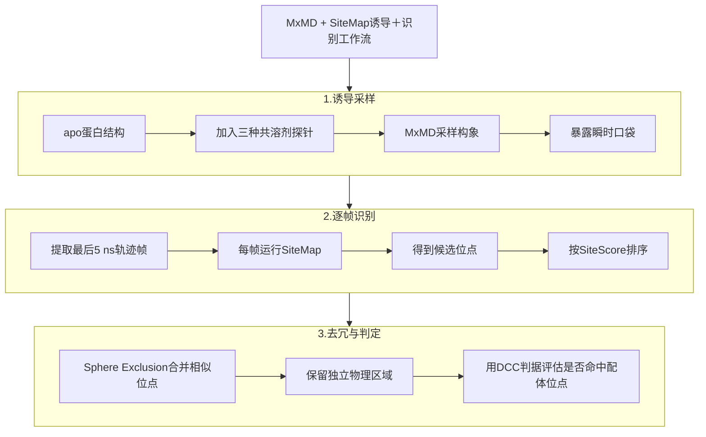

# 混合溶剂MD和物理打分联手挖出蛋白的隐藏结合口袋

## 本文信息

- **标题**：Identifying Cryptic Binding Sites with Mixed Solvent MD Simulation and SiteMap
- **作者**：Da Shi, Dmitry Lupyan, Steven Jerome, Robert Abel, Yuqi Zhang
- **发表期刊**：Journal of Chemical Information and Modeling
- **发表时间**：2026年7月24日
- **单位**：Schrödinger Inc.（美国加利福尼亚州圣地亚哥、马萨诸塞州剑桥、纽约州纽约）
- **DOI**：https://doi.org/10.1021/acs.jcim.6c01288
- **引用格式**：Shi, D., Lupyan, D., Jerome, S., Abel, R., & Zhang, Y. (2026). Identifying Cryptic Binding Sites with Mixed Solvent MD Simulation and SiteMap. *Journal of Chemical Information and Modeling*. https://doi.org/10.1021/acs.jcim.6c01288
- **代码与数据**：Schrödinger Suite 2025-3（商业软件）：https://www.schrodinger.com/downloads/releases；
  - MxMD + SiteMap工作流的结果文件：https://drive.google.com/drive/folders/1eTCUM-u5QcoS0Mv6Cx_sS8PS0P4IWRha

## 摘要

> 在基于结构的药物发现中，识别蛋白上的隐藏结合位点仍然是一个挑战，因为这些位点在apo结构中通常看不出来。本研究开发并验证了一套将**混合溶剂分子动力学**（MxMD）模拟与SiteMap相结合的**诱导＋识别工作流**。该方法利用MxMD采样蛋白构象以暴露隐藏口袋，再由SiteMap有效地识别和排序这些口袋。在一个包含**65个隐藏结合位点**的具有挑战性的数据集上，所开发的工作流在**78.5%的案例中能在top-5预测中识别出隐藏结合位点**。这些结果表明，所提出的MxMD + SiteMap工作流为早期药物发现提供了一个稳健且有价值的工具，能够通过有效诱导和识别隐藏结合位点来探索更广泛的成药靶标。

### 核心结论

- **效率提升显著**：MxMD + SiteMap工作流将隐藏口袋的top-5命中率从SiteMap单独使用的66.2%和MxMD单独使用的67.7%提升至**78.5**%，top-10命中率提升至**95.4**%。
- **聚焦难隐式口袋**：对SiteMap单独无法识别（约30%案例）和MxMD单独由于探针占有率低而漏掉的隐藏位点特别有效，二者结合能显著提升识别能力。
- **KRAS全识别**：在KRAS这个经典难靶标上识别了三个已知位点，包括最难的**Switch I/II双隐式口袋**；静态SiteMap、原始MxMD和P2Rank都未识别该口袋。
- **采样长度权衡**：在22个位点子集上，把用于分析的轨迹窗口从最后5 ns延长到最后50 ns并未提高整体排名，因为更多帧引入了更多高分候选位点，**采样成功和假阳性之间需要平衡**。

## 背景

蛋白的构象是动态的——很多配体结合位点只有在配体诱导下才会形成对应的构象，这些位点被称为**隐藏结合位点**（cryptic binding site）。它们对新药研发价值很高：既能解释已知结合剂的机制，也为虚拟筛选和别构调控打开新的可能性。

隐藏位点常由实验筛选和结构解析发现：

- **高通量筛选**（HTS）：从大规模化合物库中寻找能调节蛋白功能的分子，再以结构实验定位结合位点
- **片段筛选**：用小分子片段探测蛋白表面潜在结合区域
- **溶液NMR**：用化学位移扰动捕捉配体与蛋白的弱相互作用

这些方法通常成本较高、周期较长；片段筛选本身可以发现新的结合物，但仍受实验通量和可测性限制。在没有先导配体线索时，用计算方法预先提出隐藏位点候选具有实际价值。计算方法主要有三类：

- **物理方法**：以分子动力学（MD）模拟为代表，通过采样蛋白构象把瞬时出现的口袋暴露出来，再用打分函数把它们识别出来。**这条路的核心问题在于采样是否充分、打分是否准确**
- **机器学习方法**：以P2Rank、CryptoSite、Boltz-1为代表，能直接从蛋白结构或序列预测隐藏口袋，**速度快、成本低，但受限于训练集的覆盖范围**——隐藏位点和别构位点本身在训练集里就少而多样
- **共折叠模型**：需要候选配体作为输入，**文中评测显示它们更偏向正构位点**，对别构配体的姿势预测更具挑战

> 这三条路各有优劣，于是很自然地想到：**能不能用一种物理方法的采样配一种好的打分函数，把两边的短板各补一半**，这正是本文的核心思路。

本文就是这种思路的一个具体落地：作者选了Schrödinger自家的MxMD做采样，再配SiteMap做打分，用65个隐藏位点的挑战性数据集做benchmark，最后还在KRAS这种公认的难靶上做了案例验证。

## 研究内容

### 核心方法：MxMD + SiteMap诱导＋识别工作流

整个工作流可以拆成“诱导”和“识别”两步。

这张图把本文的主线压缩成了一句话：**MxMD负责把隐藏口袋“撬开”，SiteMap负责把打开后的口袋“挑出来”**。后面的方法细节和结果，基本都在围绕这条链条展开。

#### 整体思路：MxMD + SiteMap两阶段工作流

- **诱导：MxMD采样构象系综。** 输入一个apo蛋白结构，加入乙腈、异丙醇、嘧啶三种共溶剂探针跑MD模拟。**每种探针跑10条重复轨迹，最后采集5 ns数据、按步长10提取**，每种共溶剂约1000帧，三种合计约3000帧蛋白结构——这3000帧包含了MxMD把隐藏口袋“撬开”的瞬时构象。
- **识别：SiteMap逐帧打分。** 把3000帧全部用SiteMap的site-detection模式做全表面扫描，每帧平均报出5个候选口袋，**合计约15000个**。然后用Sphere Exclusion去重——按SiteScore从高到低遍历，选中一个就跳过周围残基组成相似（Tanimoto相似度>0.4）的其他位点——**最终得到10到170个独立口袋**，按SiteScore排序。
- **评估：DCC判据事后判定。** 用**配体中心到口袋中心<4 Å**作为“命中”标准，判定排序靠前的口袋是不是真口袋——这个判据不参与工作流本身，只是用来评估结果。

原来的MxMD工作流只用探针密度来定口袋，信号太弱容易漏掉短暂打开的口袋。本文的改动是把SiteMap这一层加进来了——让SiteMap在所有帧上打分，用物理打分替代纯靠探针密度的判断，解决了MxMD单用的短板。

#### SiteScore为什么能有效区分口袋

**图1：SiteMap对liganded site（有配体结合的位点）和non-liganded site（无配体结合的位点）的输出指标分布**

| 子图 | 指标 | liganded sites（蓝色） | non-liganded sites（橙色） |
| --- | --- | --- | --- |
| 左上 | SiteScore | 中位约 **1.03** | 中位约 0.75 |
| 右上 | Dscore | 整体较高 | 整体较低 |
| 左下 | volume（$\mathrm{Å}^3$） | 中位约 **320** | 中位约 120 |
| 右下 | balance（亲疏水平衡） | 略高 | 略低 |

> **配体位点的SiteScore中位数为1.03，所以作者建议用1.0作为前瞻应用的cutoff**——配体位点整体高于1.0，这是一个经验阈值，并非图中两分布完全分开后推导出的硬界线。这也是把SiteMap接进MxMD工作流的物理基础。

**图2：SiteScore区间对应的配体结合亲和力（pKi）分布**

- **横轴**：SiteScore区间；**纵轴**：Ligand Affinity（pKi），**图中散点**：离群点（钻石标记）表示高亲和力或低亲和力的特例
- 每个区间对应的配体**亲和力中位数随SiteScore升高而升高**，1.0+区间的中位数约7，显著高于0-0.6区间的5左右

> 这两张图共同说明：**SiteScore不仅能区分是不是位点，还与配体的实际结合强度有一定相关性**。这给后续用SiteScore排序位点提供了物理依据：**分数高的位点看起来更像口袋，平均倾向结合更强亲和力的配体**，但不能简单等同于“高分位点一定能结合高亲和力配体”。

## 主要结果

### SiteMap在PDBbind v2020上的细分性能

在把SiteMap接进工作流之前，作者先确认了它本身的打分能力——如果SiteMap在常规位点上都不准，那接到MxMD后面也白搭。用PDBbind v2020数据集（19,443个蛋白-配体复合物 + 2,846个蛋白-蛋白复合物，所有配体从复合物中移除后跑site-detection模式）做benchmark。结果按配体模态分：

| 配体模态 | 总PDB数 | 含配体位点的PDB数 | Top-5识别率 |
| --- | --- | --- | --- |
| 小分子 | 17,098 | 14,658 | 85.7% |
| 大环 | 669 | 522 | 78.0% |
| 肽 | 2008 | 1241 | 61.8% |
| 蛋白 | 2357 | 718 | 30.5% |

配体越大，识别率越低——默认SiteMap配置针对小分子位点优化。开启“Detect shallow binding modes”选项后，肽配体识别率从61.8%升到**70.9**%，蛋白配体从30.5%升到**54.1**%，说明**SiteMap对浅埋或扁平位点的捕捉能力可以通过配置改善**。

配体模态的分类标准是：小分子（少于6个Cα原子且无大环）、大环（含超过8个原子的环）、肽（6到30个Cα原子）、蛋白（超过30个Cα原子）。

### apo vs holo结构的SiteMap指标对比

对65个隐藏位点，作者先用site-evaluation模式（已知配体位置）对apo和holo结构都跑了SiteMap：

| 结构 | 含配体位点的PDB数 | 平均SiteScore | SiteScore标准差 | 平均体积（ų） | 体积标准差 |
| --- | --- | --- | --- | --- | --- |
| apo | 51 | 0.93 | 0.16 | 260 | 149 |
| holo | 65 | 1.07 | 0.12 | 322 | 175 |

apo结构虽然有51个能识别到“看起来像位点”的区域，但**SiteScore平均低了0.14、体积也小约20%**——apo结构的位点构象本身就是次优的，这可以解释SiteMap在隐藏位点上命中率只有66.2%的一部分原因：很多位点在apo状态下没有完全打开，但SiteMap本身的打分局限也是因素之一。

### 在65个隐藏位点数据集上的benchmark

作者从内部集合和CryptoSite、CryptoBench、PocketMiner、CrypToth等多个公开来源中收集了**65个隐藏结合位点**，构成挑战性测试集。其中8种激酶、3种核激素受体、35种非激酶酶和19种其他蛋白（包括转运蛋白和驱动蛋白）。数据集的几个关键约束：

- **结构质量筛选**：所有holo结构分辨率都优于3 Å、**free R不超过0.3**，且经过肉眼检查确认配体存在且没有晶体接触干扰
- **apo与holo构象差异**：位点残基RMSD中位数为3.2 Å，平均3.49 ± 1.79 Å——**确认数据集里apo和holo之间存在大幅构象差异**
- **apo结构的立体冲突**：所有apo结构对齐到holo配体后都存在明显的立体冲突，中位数有**6个残基与配体发生clash**——这从另一个角度说明数据集里apo口袋确实需要重新打开才能容纳配体

**图3：SiteMap识别位点的两个结构示例**

- **（A）有配体结合的位点**：绿色点（SiteMap位点）紧密聚集在橙色holo配体所在的口袋，说明SiteMap命中了真实结合位点
- **（B）无配体结合的位点**：绿色点散布在蛋白表面、不与任何holo配体重合，是SiteMap报出的假阳性位点
- 灰色cartoon为apo蛋白结构，橙色sticks为对齐蛋白后的holo配体。配体位点（A）整体SiteScore高于1.0，非配体位点（B）整体低于1.0，1.0作为经验阈值区分二者

### MxMD + SiteMap工作流大幅领先单方法

下表对比了几种方法在65个隐藏位点上的top-5命中率、top-10命中率和平均配体-位点重叠度（DCC判据4 Å阈值定义）：

| 方法 | Top-5命中率 | Top-10命中率 | 平均配体-位点重叠 |
| --- | --- | --- | --- |
| SiteMap | 66.2% | 67.7% | 0.37 |
| MxMD | 67.7% | 70.8% | 0.46 |
| **MxMD + SiteMap** | **78.5**% | **95.4**% | 0.40 |
| P2Rank | 66.2% | 66.2% | 0.40 |
| Boltz-1（共折叠） | 84.6%（top-1） | - | 0.88 |

工作流在top-5命中率上**比SiteMap单独使用提升了12.3个百分点**，top-10命中率上**提升了27.7个百分点**。剩下3个连top-10都没命中的案例作者都做了调查：

- **3KFL**：SiteScore 0.9，MxMD采样未恢复holo-like构象；排名第3的工作流位点也在配体附近，只是稍更暴露
- **3P53**：SiteScore 1.0，原因类似；排名第1的工作流位点也在配体附近，可能是DCC判据（4 Å阈值）的假阴性
- **1FXX/3HL8**：SiteScore 0.96，是SSB蛋白与SSB相互作用酶之间的**PPI位点**，默认SiteMap没针对PPI优化，换成PPI模式后排名升至**9**

> 这条流水线之所以有效，是因为它把两个能力互补的工具合到一起了：**MxMD负责探索构象空间，让隐藏口袋有机会被撬开**；**SiteMap负责对每一帧结构给出客观的物理打分**，避免单一探针占用率信号的局限。

具体到单个蛋白上，这个逻辑是怎么体现的？作者用两个典型例子做了拆解：

3UGK（酵母氨酸脱氢酶）这个例子说明了**MxMD的采样能力为什么重要**：它的口袋在apo状态是关闭的，SiteMap的单帧打分看不到，但MxMD的探针在MD过程中把口袋撬开了——在MxMD诱导出的瞬时构象上，SiteMap能识别出与holo配体重合的位点。

**图4：3UGK上MxMD hotspot与SiteMap位点的对比**

- **（A）MxMD hotspot命中**：绿色surface为MxMD识别的hotspot，与橙色holo配体重叠，说明探针占用信号确实能覆盖到这个隐藏口袋
- **（B）SiteMap位点未重合**：直接在apo结构上跑SiteMap，绿色点未落在holo配体处，单帧打分漏掉了这个口袋
- 灰色cartoon为apo蛋白结构，橙色sticks为对齐后的holo配体。这组对比直接说明了为什么需要MxMD采样来辅助SiteMap识别隐藏口袋

3UGK展示的是“MxMD撬开了、SiteMap能识别”的情况，但还有一个更极端的情况——**MxMD和SiteMap各自单独都找不到，合在一起才有效**。3QXW（VHH抗体）正是这样的例子，它用一组对比展示了本文最核心的诱导＋识别思想：**SiteMap和MxMD单独都找不到位点，但MxMD采样出某一帧口袋开放的构象后，SiteMap就能识别出来**。

**图5：3QXW上三种方法的位点识别对比**

- **（A）SiteMap单独**：在apo结构上几乎没有绿色点落在真实口袋，失败
- **（B）MxMD单独**：绿色surface（hotspot）没有覆盖到目标口袋，失败
- **（C）MxMD + SiteMap**：在MxMD采样帧上跑SiteMap，绿色点密集命中真实口袋，成功
- **（D）apo与holo构象**：灰色cartoon为apo结构，蓝色ribbon为对齐后的holo结构，橙色sticks为holo配体——两个状态在口袋区域构象差异明显，配体口袋在apo状态基本关闭

### 与机器学习方法的对比

P2Rank和Boltz-1是最近比较受关注的两个机器学习方法，作者把它们也纳入了对比：

- **P2Rank v2.5**：基于随机森林的监督分类器——把溶剂可及表面离散成点、用物理化学和几何描述符编码、用已知蛋白-配体复合物训练一个随机森林打分，最后把高分点聚成排序口袋。P2Rank在每个apo结构上平均识别3个位点，**top-5命中率66.2%，但top-10命中率依然是66.2%——也就是说扩大搜索范围并没有帮助**，对3QXW也失败了。
- **Boltz-1**：深度学习共折叠模型，从序列和候选配体出发预测蛋白-配体共折叠结构，**隐式把配体放到最可能的口袋里**。它在top-1命中率上达到**84.6**%（55个结构），平均配体-位点重叠0.88。但作者明确指出三点问题：第一，Boltz-1需要已知结合物作为输入才能用，而隐藏口袋场景下往往没有已知结合物；第二，Boltz-1训练截止日期是2021-09-30、分辨率上限9 Å，本数据集65个系统里**只有1MPU（holo: 8EA5）一个不在训练集里**，top-1性能可能被数据集重叠大幅夸大；第三，共折叠模型偏向正构位点，对别构口袋不友好。

> Boltz-1的数字虽漂亮，但**前提条件差异太大**——需要已知配体做输入，且数据集与训练集高度重叠，和本文工作流不是直接对等的关系。

**图6：KRAS上MxMD + SiteMap识别的正构与别构结合位点**

- **灰色cartoon**：KRAS apo蛋白的MxMD帧结构
- **橙色sticks**：对齐后的holo配体
- **绿色点**：MxMD + SiteMap工作流识别的SiteMap位点
- **覆盖的三个位点**：GTP/GDP正构位点、Switch II位点和Switch I/II位点，后两者是经典别构位点

### KRAS案例：识别出所有三个已知口袋

KRAS是著名的GTP酶，在RAS/MAPK通路里控制细胞增殖与分化，约**19**%的癌症患者携带KRAS突变。它的活性受两个柔性区域——**Switch I**（残基约30-38）和**Switch II**（残基约60-76）——控制。KRAS的成药难度和近年进展可以从四个方面看：

- **长期被认为不可成药**：因为除了GTP/GDP正构位点外没有明显的深口袋，**成药难度大**
- **Switch II口袋**：突变选择性的共价抑制剂打这个口袋，**是近几年别构抑制剂的代表性方向**
- **Switch I/II口袋**：非共价别构配体结合此口袋，是KRAS上**最难的识别目标**
- **apo结构形态**：这些口袋在apo结构里基本不存在或形状差，是检测方法的试金石——传统基于单帧apo结构的方法天然漏掉

作者用KRAS apo结构（PDB: 7C40）作为输入，比较所有方法在三个位点上的识别情况：

| 方法 | GTP/GDP位点 | Switch II位点（7RPZ） | Switch I/II位点（6GJ8） |
| --- | --- | --- | --- |
| SiteMap | 1 | 2 | 未找到 |
| MxMD | 4 | 1 | 未找到 |
| **MxMD + SiteMap** | 4 | 1 | **6** |
| P2Rank | 1 | 2 | 未找到 |
| Boltz-1（共折叠） | 1 | 1 | 1 |

SiteMap、MxMD和P2Rank能识别前两个位点但都识别不出Switch I/II。Boltz-1能识别所有三个，但**前提是输入对应的holo配体**。**本文的MxMD + SiteMap工作流不需要已知配体就能恢复所有三个位点，包括那个最难的Switch I/II口袋**——这是诱导＋识别思想在难靶标上的胜利。

关于采样长度、Vanilla MD对照和低排序案例的详细分析，详见附录：[MxMD + SiteMap识别隐藏口袋——附录](2026-07-26-induce-and-identify-appendix.md)。

## 关键结论与批判性总结

### 主要影响

- **学术影响**：把MxMD和SiteMap嫁接成一条统一的“诱导＋识别”工作流，给隐藏位点检测提供了一种新的工程范式——**采样归采样、打分归打分**，让两者各自的优势在统一框架里复用。KRAS案例特别能说明问题：传统单帧方法和P2Rank都漏掉的Switch I/II口袋，在工作流里被自然识别；Boltz-1虽然也识别了但需要已知配体作为输入。
- **实用价值**：作为Schrödinger Suite 2025-3的官方功能发布，配合自家MxMD和SiteMap，开箱即用。结果文件也公开在Google Drive上，benchmark和重现都方便。**对工业界的早期药物发现项目来说，这意味着可以更早地把隐藏口袋纳入虚拟筛选**。
- **方法学启示**：SiteMap在PDBbind v2020上仍然给出**85.7**%的小分子位点top-5命中率，SiteScore 1.0阈值仍然有效——这说明**基于物理的打分函数在结构数据爆炸的今天仍有生命力**，并未被机器学习模型完全取代。

### 局限性

- **采样局限**：工作流受MD采样能力的根本限制。如果apo到holo需要大幅构象变化，MxMD的高探针浓度模拟可能导致长轨迹中蛋白结构不稳定，**采样根本无法覆盖到holo-like构象**，3KFL和3P53属于这种情况。1FXX则主要是默认SiteMap不适配PPI浅位点，是配置问题而非采样问题。
- **假阳性和采样长度的权衡**：SI里专门做了延长MxMD到50 ns的实验，结论是**延长反而整体性能下降**——更多帧带来更多高分位点，false positive率上升。**采样成功和false positive之间需要平衡**，这是这条工作流内在的trade-off。
- **配体模态敏感性**：SiteMap默认配置针对小分子位点优化，对**PPI位点**（1FXX/3HL8）和肽/蛋白配体位点表现一般，**需要切换到PPI模式才能识别**。这种模态依赖是SiteMap本身的局限，本文工作流无法绕过。
- **共折叠方法的混淆**：Boltz-1的84.6% top-1性能对本工作流“构成优势”，但作者强调该数字**因数据集和训练集高度重叠而可能被严重夸大**，本文无法在真实前瞻场景下直接验证共折叠方法的性能。

### 未来方向

- **对接ML共折叠系综**：作者指出，本文工作流**不局限于MxMD采样**，未来可以结合能生成构象系综的ML共折叠方法——把采样交给ML，打分仍然用基于物理的SiteMap。
- **针对PPI位点的改进**：SiteMap的PPI模式已经在1FXX案例中证明有效，**未来可以系统性地把工作流扩展到蛋白-蛋白界面隐藏位点的检测**，拓宽适用靶标空间。

> 小编锐评：嗯，跟我的思路挺像……终极之路还是做好力场采好样
