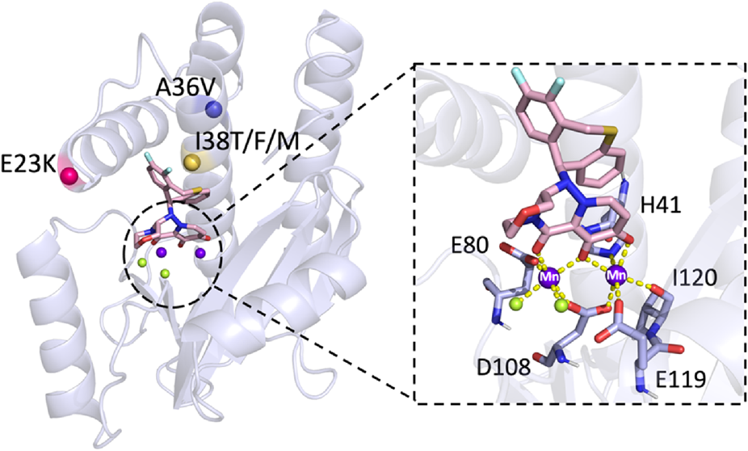
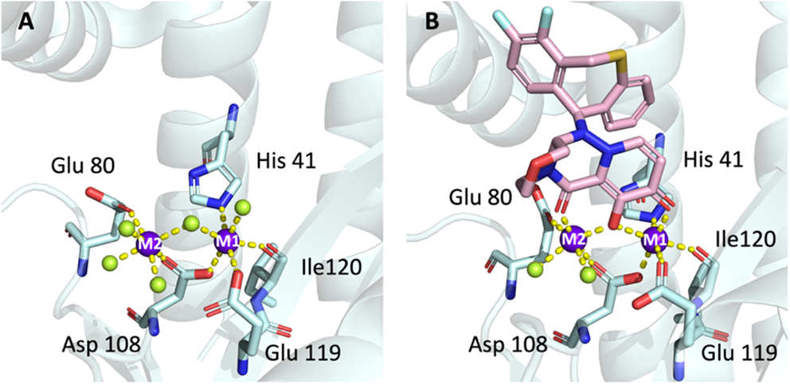
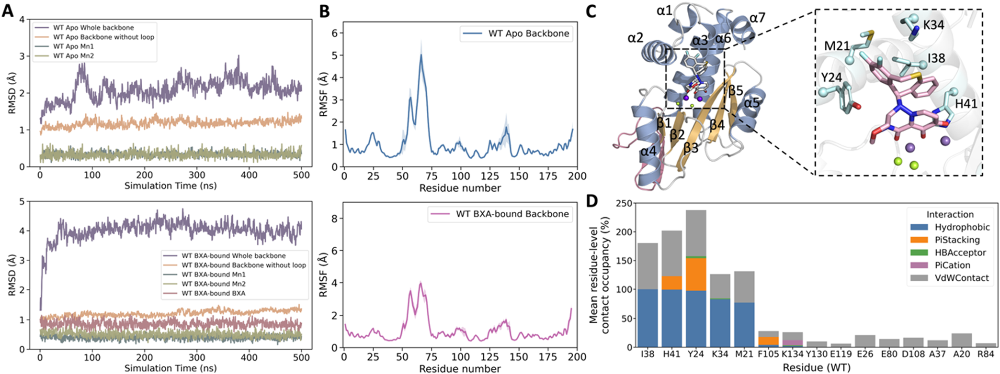
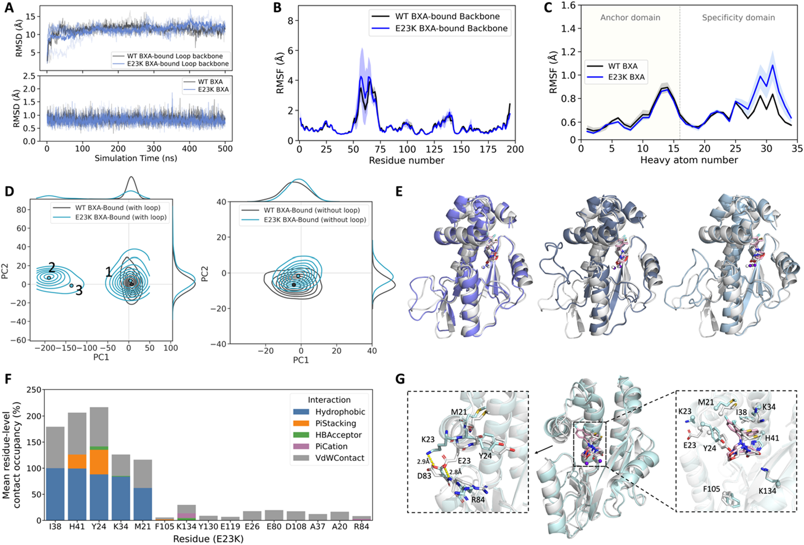

# PA核酸内切酶双金属中心的参数化挑战：流感Baloxavir耐药突变如何改写蛋白动力学

## 本文信息

- **标题**：PA核酸内切酶双金属中心的参数化揭示临床相关突变的动力学特征
- **作者**：Luxuan Wang、Pengfei Li、Terra Sztain
- **发表期刊**：Journal of Chemical Theory and Computation（JCTC）
- **发表时间**：2026年
- **DOI**：https://doi.org/10.1021/acs.jctc.6c01092
- **单位**：University of Michigan（密歇根大学），USA；Loyola University Chicago（芝加哥洛约拉大学），USA
- **引用格式**：Wang, L., Li, P., & Sztain, T. (2026). Parameterization of the PA Endonuclease Bimetallic Center Reveals the Dynamics of Clinically Relevant Mutations. *J. Chem. Theory Comput.* Advance Article. https://doi.org/10.1021/acs.jctc.6c01092
- **代码与数据**：https://github.com/SztainLab/PAN_parameters；Amber官方网址：https://ambermd.org/

**摘要图：PA核酸内切酶（PAN）双金属中心与耐药突变位点全景**。
左侧为PAN整体结构，标出临床耐药突变位点E23K、A36V、I38T/F/M的空间分布（彩色球，各自靠近活性中心但位于不同二级结构上）；右侧虚线框放大双金属活性中心，粉色棒状为BXA，两个Mn²⁺离子（紫色球标M）由Glu80、His41、Asp108、Ile120、Glu119配位，绿色球为水分子。

## 摘要

> 甲型流感病毒（IAV）通过季节性流行和大流行持续造成全球健康和经济负担，凸显了持续开发抗病毒药物的迫切需求。Baloxavir marboxil（BXM）作为最新加入的抗流感药物，靶向高度保守的PA N端核酸内切酶结构域（PAN），阻断病毒转录起始所必需的cap-snatching过程。然而，耐药突变的快速出现显著降低了BXM的敏感性，损害其临床疗效。通过计算建模理解耐药机制一直受到PAN活性位点双金属催化中心的复杂电子性质阻碍，给精确参数化带来挑战。本研究系统地基准测试了分子动力学（MD）模拟中三种金属参数化策略（非键、键合、杂化模型），对野生型PAN的apo和药物结合态进行了模拟。可靠的参数化方案使我们对五种临床相关突变（I38T/F/M、A36V和E23K）进行MD模拟，揭示了每种突变如何重塑构象景观以调控药物结合模式。本研究为金属酶中复杂位点的建模提供了路径，并为PAN的结构脆弱性提供了机制基础，可指导下一代抑制剂基于结构的优化。

### 核心结论

- **三类参数化策略各有适用边界**：非键模型足以稳定apo态双金属中心，但难以维持BXA结合态的复杂螯合网络；键合模型是唯一能可靠保持BXA结合态配位几何的策略
- **I38T/F/M通过破坏疏水锚网络削弱BXA结合**：三种突变均围绕Ile38介导的二氟二氢二苯并噻庚英疏水锚网络，以不同机制（消失/动态交换/侧链柔性）削弱BXA稳定
- **A36V主要作用于apo态**：局部α-螺旋解旋促进更开放口袋构象的采样，扰动预结合组织，但不直接破坏结合态构象
- **E23K通过静电重布线削弱BXA特异性域**：α2螺旋的Glu23→Lys23替换彻底改变Arg84周围静电网络，间接减弱Met21、Tyr24和Phe105等远端相互作用
- **方法学贡献**：为复杂金属酶的MD建模提供了经过系统验证的参数化框架，对未来相关研究有直接参考价值

## 背景

### 流感病毒与Baloxavir耐药的临床挑战

甲型流感病毒（IAV）作为主要呼吸道病原体，每年导致约300万至500万严重病例和多达65万例呼吸道死亡，是全球持续性的健康威胁。抗原漂移（antigenic drift）——表面糖蛋白血凝素（HA）和神经氨酸酶（NA）的渐进性突变——使病毒逃逸既有免疫，引发反复感染。虽然年度疫苗接种是当前最有效的预防策略，但面对快速变异和疫情暴发，抗病毒药物成为最即时的应对手段。

然而抗病毒治疗面临严峻耐药挑战：

- **M2阻断剂**已因广泛耐药性和中枢神经系统副作用基本失效
- **神经氨酸酶抑制剂（NAIs）**虽持续改进，但仍遭遇零星耐药株
- **Baloxavir marboxil（BXM）**作为新型cap依赖性核酸内切酶抑制剂（ceni），单剂即可实现与奥司他韦相当的症状缓解并显著降低病毒载量，但其耐药突变已迅速出现

临床监测显示**PA亚基第38位氨基酸替换**（I38T/F/L/M/N/S/V）是BXM耐药的关键决定因素，其中**I38T最为严重**，可使病毒复制 $\mathrm{EC50}$ 升高约11至124倍。其他位点（E23K/G、A36V、A37T、E199G）也有报道，但出现频率较低，仅带来温和的敏感性降低。

### PA N端核酸内切酶结构域（PAN）的催化机制

PAN位于病毒RNA依赖性RNA聚合酶（RdRp，由PA、PB1、PB2组成的异源三聚体）内，通过独特的**cap-snatching机制**启动转录：PB2结合宿主pre-mRNA的5′ m7G帽，**金属离子依赖的PAN**在下游约10至13个核苷酸处切割，产生用于PB1介导mRNA合成的加帽引物。BXM的活性形式baloxavir acid（BXA）通过靶向PAN，从源头阻断引物生成。

PAN双金属活性中心包含**两个Mn²⁺离子**（生理条件下也可由Mg²⁺替代），由来自Glu80、Asp108、His41、Ile120、Glu119等残基的氧/氮原子配位，形成八面体配位几何。在apo态下，两个水分子和一个桥联氢氧根离子参与配位；BXA结合时，其三齿螯合结构取代桥联氢氧根和两个配位水分子，但**保持整体八面体框架**。

**图1：apo态与BXA结合态下PAN双金属活性中心的配位几何**。左图A为apo态活性位点（PDB ID：8T5Z），两个Mn²⁺离子（标记M1、M2，紫色球）由Glu80、Asp108、His41、Ile120、Glu119配位，绿色球为参与配位的水分子/氢氧根，黄色虚线表示配位键。右图B为BXA结合态活性位点（PDB ID：7K0W），BXA（粉色棒状结构）以三齿螯合方式取代桥联氢氧根和配位水，直接协调两个金属离子。对比两图可见BXA结合如何改变第一配位层。

### 双金属中心MD参数化的核心难题

尽管PAN具有清晰的催化机制和大量可用晶体结构，但通过MD模拟理解耐药机制仍面临**参数化挑战**：

| 挑战 | 物理根源 | 后果 |
|------|---------|------|
| 二价金属的强极化效应 | 经典的点电荷+`12-6` LJ模型无法准确描述电荷转移与诱导偶极 | BXA结合态配位几何失稳 |
| 多配位原子的几何约束 | 非键模型不施加角度约束，易出现配体解离 | 模拟时间内活性位点拓扑变化 |
| BXA的复杂螯合模式 | 三齿螯合+金属-π相互作用，水衍生参数无法直接迁移 | 配位水被替换，关键相互作用丢失 |

历史上，金属酶MD参数化形成了**三类主流策略**：

1. **非键模型**（如`12-6`、`12-6-4`）：保留全部静电+范德华相互作用，几何上灵活但易出现配体解离
2. **键合模型**（bonded）：通过谐振势施加金属-配体键和角度，固定配位几何但损失动力学灵活性
3. **杂化模型**（hybrid）：仅对部分相互作用施加键合约束，其余保留非键特性

**核心问题**是：在apo态（柔性配位水交换）和BXA结合态（刚性三齿螯合）的不同物理需求下，哪种策略能同时保证结构稳定性和物理合理性？已有研究在单一态上分别验证各类模型，但**跨态的系统基准测试和耐药突变的应用级验证仍属空白**。

### 关键科学问题

PAN双金属中心的参数化不是一个“挑一个最好”的问题，而是要回答以下三个相互关联的问题：

- **不同参数化策略在apo态和BXA结合态上是否同样可靠**？apo态由可交换的水分子主导配位，对几何约束需求低；BXA结合态由刚性螯合主导，对几何约束需求高。如果某一策略在两种态上的表现差异巨大，那么“最佳策略”取决于模拟目标，而非通用最优。
- **如何评估参数化策略的“可靠性”**？仅看蛋白骨架RMSD不够，因为活性位点可能在RMSD良好的情况下已悄然失真。本文采用**配位数、RDF第一峰积分、接触频率**等多维度指标，建立了物理一致性的量化评估框架。
- **可靠的参数化方案能否支撑耐药机制的机理解读**？如果模拟无法保持活性位点完整性，对突变效应的解读就失去物理基础。本文以I38T/F/M、A36V、E23K五种临床相关突变为测试案例，验证参数化方案在**机理解读层面**的实用性。

### 创新点

- **系统化的双金属中心参数化基准测试**：在apo态和BXA结合态两个不同物理需求下，对非键（`12-6`、`12-6-4`）、键合、杂化四类策略进行统一基准测试，建立可迁移的评估框架
- **杂化模型的针对性应用**：针对BXA结合态开发了专门保留BXA和配位水RESP电荷、移除金属-配位水谐振约束的杂化方案，在几何稳定性和动力学灵活性之间取得平衡
- **基于稳定基准的耐药机制全景图**：利用500 ns × 3副本的高质量模拟，揭示I38突变的三种差异化疏水破坏机制、A36V的apo态口袋开放效应、E23K的远端静电重布线，为下一代ceni设计提供具体靶点
- **开源可复现资源**：参数、输入结构、模拟脚本全部在GitHub公开，降低其他金属酶研究的复用门槛

## 方法设计：金属参数化策略与模拟协议

### 整体工作流

本文采用“基准测试→应用”的二阶段策略：

1. **WT PAN基准测试**：在apo和BXA结合态下，分别测试`12-6`非键、`12-6-4`非键、键合、杂化四类参数化方案，评估500 ns模拟中的结构稳定性、配位几何保持、配体动力学等
2. **突变体应用**：基于基准测试结果，对I38T/F/M、A36V、E23K五种突变体分别在apo和BXA结合态进行3副本500 ns MD模拟（共30条轨迹），通过构象采样和相互作用分析揭示耐药机制

### 系统构建

所有系统基于A/California/04/2009（H1N1）毒株的PAN序列，使用Modeller 10.6重建缺失的51-72号柔性loop（基于PDB 4LN7、4M4Q、9DOJ模板）。缺失loop结构对参数化基准测试影响很大，因为它是apo态骨架RMSD的主要波动源——文章通过“排除loop”和“包含loop”两种RMSD计算方式分别报告。

### 四类金属参数化方案

#### `12-6`非键模型

将金属-配体相互作用完全交给经典非键项：`12-6` LJ描述范德华，库仑描述静电。Mn²⁺参数采用针对Amber TIP3P水模型优化的`12-6` normal usage（compromised）参数集。这是**最简单**的方案，物理上假设金属-配体相互作用不涉及显著的电荷转移或诱导偶极。

#### `12-6-4`非键模型

在`12-6` LJ基础上引入 $C_4/r^4$ 项，描述离子-诱导偶极相互作用。Mn²⁺与水、咪唑氮、羧基氧的 $C_4$ 项来自Li/Merz组和Jafari组等专门针对TIP3P开发的工作。Mn²⁺与OH⁻的 $C_4$ 项基于 $\log K = 3.452$ 的伞形采样拟合。这一方案在物理上比`12-6`更准确，特别是对二价金属的强极化效应。

#### 键合模型

对金属-配位原子施加完整的谐振势（键、角、二面角），通过MCPB.py工作流构建：Seminario方法从QM频率计算获得键和角力常数，RESP拟合从大模型获得部分电荷。为避免两个配位水对同一Mn²⁺产生的1-4相互作用问题，**保留谐振约束而非固定键合**，以维持配位距离在平衡位置附近的同时允许几何柔性。

#### 杂化模型

仅对金属-配位氨基酸施加键合约束，**配位水仍保持完全非键**且可与溶剂水交换。这一策略源于一个关键观察：BXA结合态需要保持金属-氨基酸的几何，配位水则可灵活交换。文章对Mn²⁺和配位氨基酸采用RESP拟合（基于大模型ESP），而BXA和水的部分电荷固定为非键模型值，并移除金属-配位水的谐振约束。

### MD模拟协议

所有系统在Amber ff14SB力场下进行：

- **溶剂化**：等距TIP3P水盒，溶质到盒子边缘最小距离13 Å
- **中和**：添加Na⁺，再加入0.15 M NaCl模拟生理离子强度
- **能量最小化**：50,000循环，约束从50降到 $0\,\mathrm{kcal\cdot mol^{-1}\cdot \mathring{A}^{-2}}$
- **加热**：0→310 K，350 ps NVT，约束从20降到 $0\,\mathrm{kcal\cdot mol^{-1}\cdot \mathring{A}^{-2}}$
- **平衡**：1 ns NPT
- **生产**：500 ns NPT，每系统3独立副本
- **长程静电**：PME，截断10 Å
- **温度耦合**：Langevin thermostat，碰撞频率 $1.0\,\mathrm{ps^{-1}}$
- **键约束**：SHAKE

### 分析方法

通过cpptraj模块分析：

- **配位几何**：径向分布函数（RDF，0.01 Å分辨率）积分第一峰获得配位数，以第一极小值作为配位边界
- **结构波动**：backbone RMSD、residue-level RMSF
- **构象采样**：主成分分析（PCA）+ KDE等高线，mean-shift聚类识别代表构象
- **相互作用**：通过ProLIF编码为指纹图谱，统计hydrophobic、π-stacking、HBA/HBD、π-cation、VdWContact等相互作用occupancy
- **口袋体积**：POVME 3.0

## 研究结果

### 结果一：基准测试——非键模型足以稳定apo态

`12-6`非键模型在apo PAN上表现优异：

- 蛋白骨架RMSD（排除loop）约1.0 Å高度稳定，两个Mn²⁺的RMSD基本保持在0.5 Å以下
- M1和M2均维持理想六配位几何（contact frequency接近100%）
- 99.61%（M1）和100%（M2）的模拟时间内保持完整六配位
- 移除晶体水后，溶剂水分子在前几纳秒内自发重新配位，恢复完整配位环境

**图2：apo PAN在12-6非键模型下500 ns模拟的稳定性与双金属配位几何**。
- (A) 全蛋白骨架、排除loop骨架、loop骨架、两个Mn²⁺的RMSD。所有轨迹先按排除loop区域对齐
- (B) 每个Mn²⁺的RDF，使用三组潜在配位原子计算：所有系统原子、水和OH⁻氧原子、蛋白原子
- (C) 双金属中心的代表性配位结构，平均配位距离以Å标注。桥联OH⁻（Mn²⁺之间）以红色氧和白色氢显示，Mn²⁺以紫色球显示，配位水以柠檬色显示

`12-6-4`非键模型表现类似但有微妙差异：

- 整体结构稳定，两个Mn²⁺保持六配位几何约99.9%时间
- 与`12-6`不同，**M2的三个配位水之一（W4）在整个500 ns中持续与溶剂水交换**，SI显示该位点被159个溶剂水分子动态占据，虽然每个替换水的occupancy很低，但累计接触频率接近1，这是因为`12-6-4`的 $C_4/r^4$ 项调节金属-水相互作用，增加了配位壳的动力学柔性

两个非键模型都证明：**静电和范德华相互作用足以稳定apo态双金属中心**，且`12-6-4`参数在物理上更准确地反映了配位水的可交换性。

### 结果二：基准测试——非键模型在BXA结合态失效

当BXA结合后，`12-6`非键模型在最初几纳秒内即出现配位几何失真：

- BXA逐渐偏离Mn²⁺，关键金属-配体相互作用丢失
- 配位原子被溶剂水或邻近残基替换
- 每个Mn²⁺仍大体维持六配位几何，但**配位对象已完全改变**

**图3：BXA结合PAN活性位点不同金属建模策略的表现**。
- (A, B) `12-6`和`12-6-4`非键模型分别在100 ns和30 ns的快照。两个策略均无法维持原生BXA结合配位几何。原生配位水以柠檬色显示，新配位水以麦色显示
- (C) 键合模型的代表性结构，平均配位距离以Å标注
- (D) 键合模型下BXA结合系统的RMSD，包括蛋白骨架、排除loop骨架、loop骨架、BXA、两个Mn²⁺
- (E) 键合模型的平均RDF和配位数，显示第一壳配位与预期BXA结合金属环境一致
- (F) 杂化模型在6 ns的快照，显示未能维持原生配位几何

键合模型是唯一能可靠保持BXA结合态配位几何的策略，平均配位距离与晶体结构一致。**杂化模型在BXA结合态下也失败了**：虽然它尝试保留几何约束的同时允许配位水交换，但在BXA存在时，配位水被完全替换为溶剂水，配位几何失真。

### 结果三：参数化策略的最终选择

基于基准测试结果，文章采用**混合策略**：

| 模拟态 | 选用策略 | 理由 |
|--------|---------|------|
| apo PAN | `12-6`非键 | 静电+范德华足以稳定，配位水可自然交换 |
| BXA结合PAN | 键合模型（保留谐振约束） | 唯一能可靠维持BXA螯合网络 |

**关键认识**：非键模型的失败根源在于**水衍生参数无法迁移到复杂配体**，因为它缺乏对二价金属特定极化效应的准确处理。`12-6-4`虽然通过 $C_4/r^4$ 项改善了金属-水相互作用，但面对BXA的三齿螯合仍然力不从心。键合模型通过显式约束弥补了这一缺陷，但损失了配位水交换的动力学信息——这是为维持BXA结合态完整性所必须接受的折衷。

### 结果四：WT PAN基线动力学与BXA结合模式

基于稳健的参数化方案，WT PAN模拟建立了后续突变体比较的基线。

**apo和BXA结合态均显示高度稳定的核心结构**：

- 排除loop后骨架RMSD约1.0 Å
- 51-72 loop是构象柔性的主要来源（与晶体学缺失一致）
- 两个Mn²⁺保持稳定八面体配位
- BXA在结合态下保持“蝴蝶状”构象，oxazino-pyrimidinone和difluorinated aromatic wings分别锚定于金属域和特异性域

**图4：WT PAN在apo和BXA结合态下的动力学与相互作用网络**。
- (A) WT PAN apo（上）和BXA结合（下）系统的loop backbone RMSD和重原子BXA RMSD
- (B) apo（上）和BXA结合（下）WT系统的残基级RMSF
- (C) BXA结合态WT系统中的相互作用网络。His41和Tyr24通过近乎连续的疏水接触参与BXA wing，Lys34和Met21保持频繁接触（occupancy 82.5%和77.6%）。Tyr24是主要的π-stacking残基（56.5%），His41和Phe105是更瞬时的π相互作用
- (D) 残基级BXA相互作用occupancy，横轴按残基编号排列

**关键相互作用网络**：His41和Tyr24是BXA wing的近连续疏水接触者；Lys34（82.5%）和Met21（77.6%）保持频繁接触；Tyr24作为主要的π-stacking残基（56.5%）。

### 结果五：I38T/F/M三种突变差异化削弱BXA疏水锚

Ile38是BXA的主要疏水锚，其替换是最常见的耐药相关变化。三种突变通过**不同物理机制**实现耐药：

**I38T（小极性替换）**：完全丧失Ile38介导的疏水相互作用。Thr38较小的极性侧链无法填充分子体积，导致：

- 邻近Lys34疏水接触从82.5%降至72.3%
- BXA的difluorinated aromatic ring向Thr38方向更深移动
- BXA与Met21的接触增加（77.6%→94.8%），作为补偿
- α5螺旋轻微上移，heteroaromatic ring接近Lys134，π-stacking与Phe105几乎完全消失

**I38F（更大芳香侧链）**：保留总疏水接触量但转为动态交换模式。Phe38的苯环侧链体积较大，无法紧凑地填充V形difluorodihydrodibenzothiepine wing：

- Phe38采用略偏移的位置
- BXA的specificity domain benzene环内移和下移，difluorinated aromatic端向上倾斜
- 与WT的Ile38相比，Phe38侧链RMSF增加约0.4 Å，**反复构象重定向**
- DCCM分析显示Phe38-BXA耦合从0.38（WT）降至0.26（I38F），协调运动减弱

**I38M（线性柔性侧链）**：类似I38F但柔性更高。Met38的线性脂肪链旋转自由度大，不能提供WT Ile38的稳定几何约束：

- 侧链RMSF相对WT增加近1 Å
- Met38侧链弯曲旋转通过不同原子维持与BXA的疏水接触，但无法施加稳定几何约束
- DCCM显示Met38-BXA交叉相关降至约0.16（vs WT的0.38）

**共同点**：三种突变都削弱了Ile38-BXA锚网络的“持久锁定”特征，将其转化为更动态、可交换的接触模式，导致BXA疏水wing在口袋内采样多个局部微构象，整体RMSF升高。**值得注意的是**，SI中的apo态对比显示I38T/F/M与WT的骨架RMSD和RMSF基本一致（Figure S4），说明这些突变的效应是药物结合态特有的，而非一般性的结构去稳定——耐药机制的核心在于改变结合界面而非蛋白整体折叠。

**图5：I38变体中BXA结合动力学和相互作用谱总结**。
- (A) WT与I38T、F、M变体的BXA RMSD曲线，实线为三个独立副本的平均
- (B) 非氢BXA原子的原子级RMSF对比，anchor domain以浅黄色高亮区分specificity domain
- (C) I38变体轨迹中残基级BXA相互作用occupancy
- (D) I38变体代表性BXA结合结构与WT（灰色）叠加

### 结果六：A36V通过apo态口袋开放削弱预结合

A36V不与BXA直接相互作用，但其影响在apo态更为显著。**模拟揭示A36V的核心效应是局部α-螺旋解旋促进apo态口袋开放**：

- 排除loop的骨架RMSD与WT相当
- 全骨架PCA显示A36V的构象分布**更宽广**，跨越两个basin
- 代表性结构显示口袋体积从WT的594 ų扩大至682、849、620 ų
- basin 2对应α2螺旋上移，进一步扩大口袋边界
- SI的Figure S7按副本分别着色显示聚类归属，三个副本均能采样到这两个basin，说明多盆地采样具有统计可靠性而非单次模拟的偶然

在BXA结合态，A36V的影响明显减弱：

- BXA保持稳定结合构象，RMSD/RMSF与WT相当
- 仅观察到局部接触重排：Tyr24 π-stacking从56.5%降至46.3%，Lys134 H-bond和π-cation接触略升至13%
- 这些变化反映α2 C-末端和α5螺旋的位移，而非显著配体不稳定

这一结果与实验观察一致：A36V显著降低apo PAN稳定性（熔解温度比WT低近10 °C），但BXA结合的A36V产生WT-like热位移，且其晶体结构未显示BXA结合构象变化。**A36V的耐药机制源于apo态不稳定和预结合构象采样改变，而非结合态的不利特性**。

**图6：A36V PAN的apo态模拟揭示局部去稳定和改变的构象**。
- (A) WT和A36V apo系统的loop-excluded骨架RMSD
- (B) WT和A36V apo系统的残基级RMSF
- (C) 全骨架和loop-excluded PCA投影的KDE等高线。点表示各系统在对应PCA空间中距离mean-shift聚类中心最近的代表帧
- (D-G) loop-excluded PCA空间中mean-shift聚类的代表结构，对应口袋体积以浅蓝色显示并标注ų。WT为D，A36V的cluster 1、2、3分别为E、F、G。暖粉色高亮α-螺旋occupancy降低的区域，stick显示导致口袋差异的残基

### 结果七：E23K通过α2静电重布线削弱BXA specificity wing

E23K也位于α2螺旋上，不与BXA直接相互作用。其在apo态与WT基本类似，**主要动力学改变出现在BXA结合态**：

**loop动力学改变**：

- 排除loop时，骨架RMSD与WT相当——结构核心稳定
- 包含loop时，RMSD和RMSF显示loop区域出现大幅副本间波动
- 全骨架PCA下E23K分离为3个聚类，而loop-excluded PCA仅显示单一主导basin
- cluster 1（66.6%）与WT basin重叠；cluster 2（27.0%）仅在第一个MD副本采样；cluster 3（6.5%）在第一和第三副本采样

**配体局部不稳定**：整体BXA RMSD与WT相似，但原子级RMSF显示BXA的fluorinated aromatic ring（specificity wing）局部稳定性降低。

**接触频率减弱**（图7F）：

- Met21疏水接触：77.6%（WT）→ 62.0%（E23K）
- Tyr24疏水接触：97.5%（WT）→ 88.1%（E23K）
- Tyr24 π-stacking：56.5%（WT）→ 47.2%
- Phe105与anchor domain的heteroaromatic ring的π-stacking：从13.9%降至几乎不可检测

**机制起源在于α2静电网络重布线**：WT中Glu23通过氢键（73.8%）和阴离子相互作用（57.9%）与Arg84形成持续网络。Lys23替换Glu23后，**这一原生相互作用被完全消除**，取而代之的是Lys23与Asp83之间的阳离子和氢键相互作用（77.0%和64.2%）。这种局部静电重布线通过α2螺旋传播，**间接削弱了BXA specificity wing在Met21、Tyr24、Phe105等远端位点的稳定性**。

**图7：E23K BXA结合系统中loop动力学和BXA结合相互作用总结**。
- (A) BXA结合WT和E23K系统的loop backbone和非氢BXA RMSD
- (B) WT和E23K BXA结合系统的残基级RMSF
- (C) BXA结合WT和E23K系统中非氢BXA原子的原子级RMSF
- (D) 全骨架和loop-excluded骨架PCA投影的KDE等高线
- (E) BXA结合E23K系统全骨架PCA中识别的三个loop相关聚类的代表结构（cluster 1、2、3顺序），与WT代表结构（灰色）叠加
- (F) BXA结合E23K轨迹中残基级BXA相互作用occupancy
- (G) WT和E23K的代表结构

## 关键结论与批判性总结

### 优势

- **金属参数化的系统基准测试填补了方法学空白**：apo态和BXA结合态两种物理需求下的四类方案对比，为其他金属酶研究提供了可迁移的评估框架。`12-6`非键模型用于apo态、键合模型用于BXA结合态的“分工”决策有清晰的数据支撑
- **500 ns × 3副本的高质量模拟**：足够的采样时间和多副本策略使构象分析（PCA、mean-shift聚类）具有统计可靠性，而非单次模拟的偶然结果
- **耐药机制的物理一致性**：所有结论均基于具体的结构-动力学-相互作用occupancy变化链，没有仅靠RMSD或单一指标做断言
- **开源资源完备**：参数、脚本、输入结构全部公开在GitHub，便于其他研究复用和扩展

### 局限性与未来方向

1. **杂化模型的失败值得进一步反思**：杂化方案在BXA结合态也失效，提示部分键合策略难以兼顾几何稳定性和动力学灵活性。未来的杂化设计可能需要更精细的分区——例如区分金属-氨基酸vs金属-水的RESP拟合策略
2. **键合模型无法捕捉自发配位重排**：谐振约束虽然能保持几何稳定，但抑制了apo态常见的配位水交换。这对BXA结合态影响小，但限制了模型对催化循环中间体的适用性
3. **单独的PAN模型缺乏RdRp全酶环境**：文章明确指出E23K的loop动力学变化在isolated PAN背景下观察到，但其与PB1/PB2的相互作用模式（影响复制）需要全RdRp模型才能完整解读
4. **BXA以外的底物未涉及**：本文专注于BXA耐药，但cap-snatching的天然底物（m7G cap-containing pre-mRNA）才是生理底物。底物结合动力学和耐药效应的关系仍有探索空间
5. **力场精度限制**：ff14SB + 金属专属参数的组合虽经基准测试，但`12-6-4`对金属-水的 $C_4$ 项开发时间相对较新，长期稳定性证据仍在积累

> **核心洞见**：PAN的耐药机制不是单一突变破坏单一相互作用，而是**通过不同的物理路径汇聚到BXA稳定性的降低**——I38突变破坏局部疏水锚网络的“持久锁定”特征；A36V通过apo态口袋开放改变预结合组织；E23K通过静电重布线远端削弱specificity wing。这种**机制多样性**意味着针对单一机制的下一代ceni设计可能不足以覆盖所有耐药突变，需要针对不同物理路径设计差异化干预策略。

## 附录：补充材料

- **方法学补充**：`12-6-4`非键模型在apo态的详细表现、键合模型和杂化模型在apo态的结果、I38T/F/M的apo态动力学对比（Figure S4）、Mn²⁺ RMSF分布（Figure S6）等见SI（PDF，10个附图）
- **动力学动画**：I38F和I38M BXA结合系统中残基38侧链动态（Movie S1, S2）
- **完整参数和模拟脚本**：https://github.com/SztainLab/PAN_parameters

## 参考文献

完整参考文献（71条）见原文PDF第13-15页，主要包括：

- Hayden et al. (2018). *N. Engl. J. Med.* Baloxavir Marboxil for Uncomplicated Influenza in Adults and Adolescents.
- Omoto et al. (2018). *Sci. Rep.* Characterization of influenza virus variants induced by treatment with the endonuclease inhibitor baloxavir marboxil.
- Kohlbrand et al. (2024). *Biochemistry.* Structural Studies of Inhibitors with Clinically Relevant Influenza Endonuclease Variants.
- Yoshino et al. (2019). *Sci. Rep.* Molecular Dynamics Simulation reveals the mechanism by which the Influenza Cap-dependent Endonuclease acquires resistance against Baloxavir marboxil.
- Li & Merz (2016). *J. Chem. Inf. Model.* MCPB.py: A Python Based Metal Center Parameter Builder.
- Maier et al. (2015). *J. Chem. Theory Comput.* ff14SB: Improving the Accuracy of Protein Side Chain and Backbone Parameters from ff99SB.
- Wagner et al. (2017). *J. Chem. Theory Comput.* POVME 3.0: Software for Mapping Binding Pocket Flexibility.
- Bouysset & Fiorucci (2021). *J. Cheminf.* ProLIF: a library to encode molecular interactions as fingerprints.