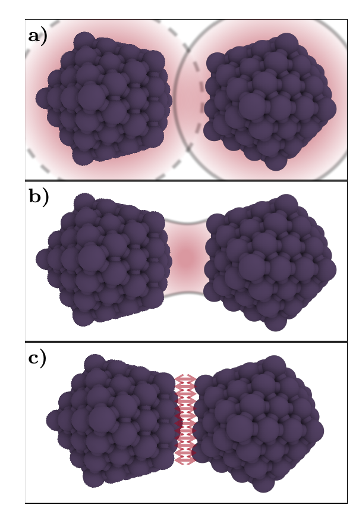
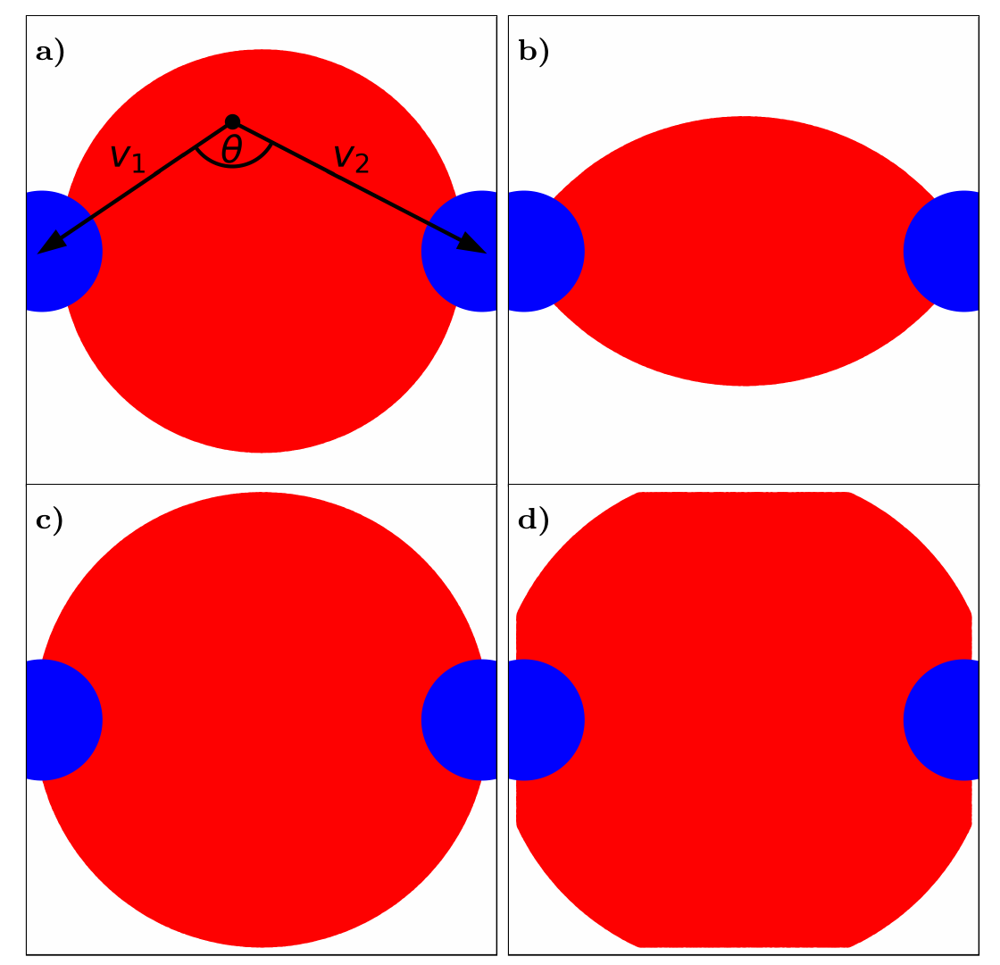
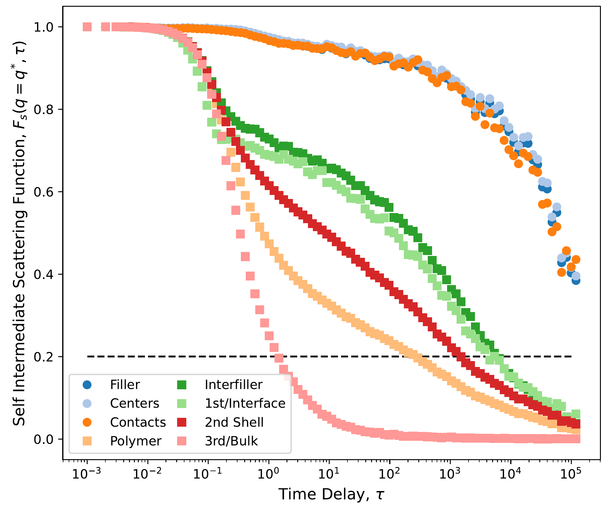
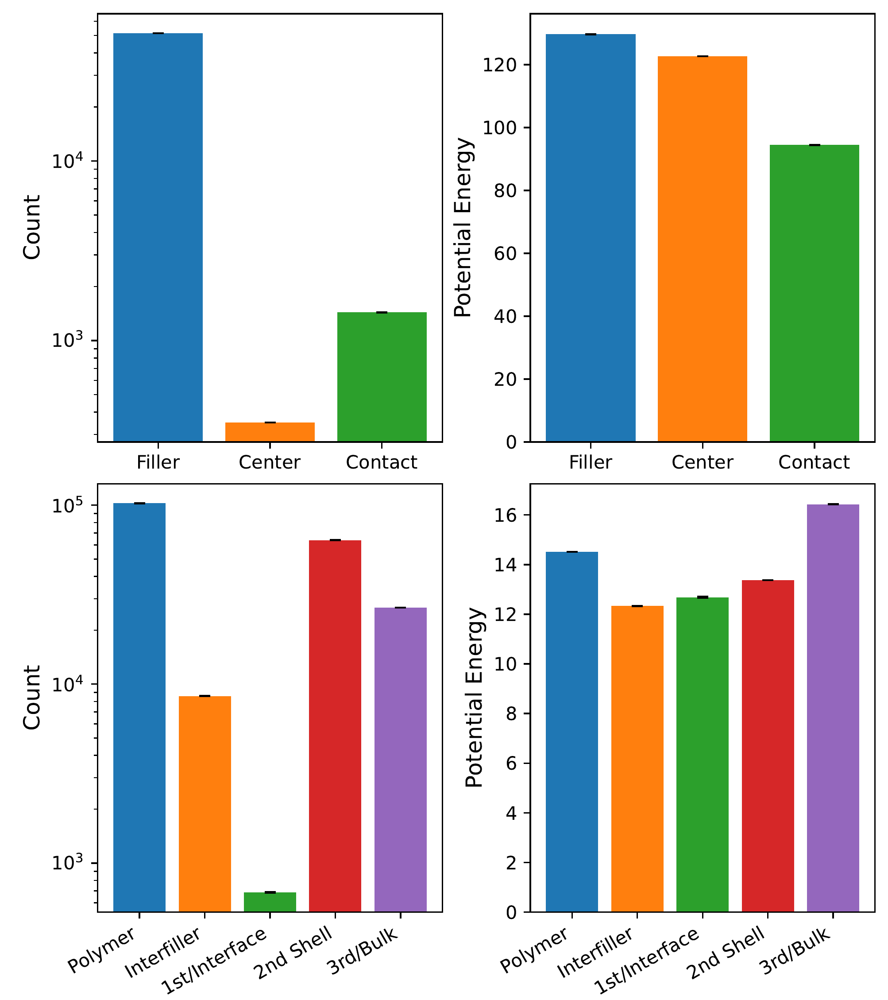

# AMDAT——用于聚合物纳米复合材料空间分辨MD轨迹分析的工具

## 本文信息
- **来源**：AMDAT论文（arXiv:2602.05865）第5-6节“Advanced Workflows”章节
- **体系**：聚合物纳米复合材料（PNC）——端交联KG聚合物网络 + 碳黑类填充分散物
- **关键方法**：`trajectory bin list`（空间分箱）、`create bin list with options distance`、`find between`、ISFS（self-intermediate scattering function）
- **代码仓库**：https://github.com/dssimmons-codes/AMDAT
- **开发者文档**：https://dssimmons-codes.github.io/AMDAT/

> 前置文章：**[AMDAT：面向过冷液体与玻璃态体系的长时标MD分析工具](https://mendelevium.github.io/Molecular%20Dynamics/Modeling%20&%20Tools/2026-06-06-amdat-amorphous-md-analysis.html)** 介绍了AMDAT的基础功能（RDF、MSD、ISFS、Van Hove、per-particle分析）。本文是其**进阶篇**，重点展示AMDAT怎么做**空间分辨分析**——对多组分、非均匀体系（如PNC、表面、界面）来说，这是绕不开的分析需求。

## 背景

聚合物纳米复合材料（PNC）是**高度非均匀的体系**：填充分散物（如碳黑、二氧化硅）周围的聚合物链动力学明显慢于体相聚合物，形成厚厚的界面层（interphase）。这种**空间分辨的动力学差异**直接决定了材料的宏观机械性能。

但分析这类体系有个难题：**如何自动识别并隔离这些空间区域**？手动定义“距表面5 Å以内的原子”既不准确也不可扩展。AMDAT通过`trajectory bin list`和动态判定命令（如`find between`）提供了一套**基于几何关系和动力学特征自动分区**的框架。

### PNC体系细节

AMDAT演示用的PNC体系（端交联KG网络 + 碳黑类簇）：
- **聚合物**：5000条KG链，每条20个珠子，2500个交联珠子，**约95%链端参与交联**
- **填充分散物**：50个团簇，每个团簇是**7个二十面体粒子**（每个粒子147个KG珠子：中心珠子 + 三层壳层珠子）
- **模拟细节**：LAMMPS模拟，指数时间采样（I=1, K=103, b=1.2, Δτ=0.001 ps）

> 为什么要用指数时间采样？PNC的弛豫时间跨越多个数量级，线性采样在长延迟处几乎无帧可用。指数采样在短延迟（笼蔽平台区）密集采样、长延迟（扩散区）稀疏采样，**每个时间块内固定起始帧数**，统计质量更均匀。

## 研究内容

### 一、空间分辨的五种分区策略

AMDAT能用**几何关系**自动识别五种空间区域，无需手动指定距离阈值。



**图8：AMDAT的五种空间分区策略示意图**。**（a）Interface（界面）**：通过`create bin list with options distance`围绕填充分散物定义多层球形壳层，**第一层壳层**紧邻填充分散物表面，**第二层壳层**向外延伸。**（b）Intermolecular regions（分子间区域）**：用`find_between`命令识别**位于两个不同填充分散物团簇之间的聚合物**（interfiller），这是手动选取难以捕捉的动态定义区域。**（c）Molecular contact（分子接触）**：识别**与填充分散物表面直接接触的聚合物珠子**（contacting filler），用于研究“紧束缚”层对填充分散物-聚合物相互作用的影响。



**图9：find_between命令的工作原理示意图**。红色区域表示满足“到聚合物原子的距离 < 到填充分散物原子的距离"条件的空间区域。这个几何条件**自动识别两个填充分散物团簇之间的聚合物**（interfiller），无需手动指定距离阈值或区域边界。图中蓝色球体代表填充分散物粒子，红色高亮区域就是`find_between`动态识别出的区域。

> 关键一点：**这五种分区都是"动态定义"的**——每一帧都基于实时几何关系重新计算，而非预设固定距离阈值。比如"interfiller"区域的存在与否取决于两个填充分散物团簇的相对位置，AMDAT逐帧自动更新。

### 二、分区域的ISFS分析

一旦空间区域被识别并隔离，AMDAT就能对**每个区域分别计算可观测量**。最经典的应用是**自中间散射函数（ISFS）**——它量化"给定波数的密度涨落衰减有多快"，是弛豫时间尺度的直接指标。



**图10：PNC五个区域的ISFS曲线**$F_s(q^*, \tau)$。横轴为延迟时间$\tau$（对数坐标），纵轴为ISFS值。**六条曲线**（从上到下弛豫由慢到快）：**filler（填充分散物）**几乎不弛豫（刚性粒子）；**centers（填充分散物几何中心）**和**contacting filler（与聚合物直接接触的填充分散物表面）**弛豫极慢；**interphase shells（界面壳层）**和**bulk polymer（体相聚合物）**弛豫较快但存在明显平台；**interfiller（填充分散物之间的聚合物）**弛豫最快。

> 一眼就能看出来：**interphase shells的ISFS明显滞后于bulk polymer**——界面层动力学慢于体相，这在MD模拟里看得很清楚。**filler和centers几乎不动**，说明它们是刚性粒子。**contacting filler的ISFS比filler本体还慢**，说明”紧束缚”层的聚合物反而把部分填充分散物”锁住”了。

### 三、AMDAT脚本的五个模块

实现图10的分析需要五个AMDAT算法模块（Algorithms 7-11），可以看到AMDAT是**怎么一步步把分析拼起来的**：

#### Algorithm 7：体系与组成声明

```
system_np
custom
./exp.traj
exponential 1 103 1.2 0 0 0.001
polymer 1 xlinkr 1 filler 50
1 2 3 4 5 6 7 8 9
```

- `system_np`：NPT系综，与LAMMPS的`fix npt`对应
- `custom`：自定义dump格式
- `exponential 1 103 1.2 0 0 0.001`：指数时间采样（**必须与LAMMPS输出方式匹配**）
- `polymer 1 xlinkr 1 filler 50`：1种聚合物（含交联珠子xlinkr）、1种填充分散物（50个团簇）
- 数字行定义聚合物中9种原子类型的数量

#### Algorithm 8：创建各区域列表

```
create_list polymer
create_list filler
create_list centers coms centroid filler
create_trajectory_bin_list interphase_shells distance trajectory polymer 15 filler
create_trajectory_bin_list interfiller find_between polymer polymer filler
create_trajectory_bin_list contacting_filler find_between polymer polymer filler
```

- **`create_trajectory_bin_list ... distance`**：按距离填充分散物的远近创建多层壳层（`interphase_shells`），15个单位距离
- **`create_trajectory_bin_list ... find_between`**：动态识别"位于两个填充分散物之间的聚合物"（`interfiller`）和"直接接触填充分散物的聚合物"（`contacting_filler`）

#### Algorithm 9：计算ISFS

```
isfs ./isfs.dat list polymer 25 25 0 0 1
isfs ./isfs_filler.dat list filler 25 25 0 0 1
isfs ./isfs_centers.dat list centers 25 25 0 0 1
isfs ./isfs_shells.dat list interphase_shells 25 25 0 0 1
isfs ./isfs_interfiller.dat list interfiller 25 25 0 0 1
isfs ./isfs_contacting.dat list contacting_filler 25 25 0 0 1
```

- `isfs <output> <list> <q_low> <q_high> <first_block> <full_block>`：对每个list分别计算ISFS
- `q_low = q_high = 25`：单一波数$q^* = 25$（约近邻距离对应的倒空间距离）
- `first_block = 0`：每个block只用第一帧做配对（跨block分析时设为1）

> **为什么要分block计算？** 指数时间采样轨迹被分成多个block，每个block内帧对独立。`first_block=0`意味着"只用每个block的第一帧与其他block配对"，而`full_block=1`意味着"用block间所有可能的帧对"。后者统计更强但计算成本高。

#### Algorithm 10：输出per-atom属性（用于可视化）

```
write_list_trajectory interphase_shells ./interphase_shells.traj type xyz
write_list_trajectory interfiller ./interfiller.traj type xyz
write_list_trajectory contacting_filler ./contacting_filler.traj type xyz
```

- 输出xyz轨迹文件，**每个原子带上其所属区域的标签**
- 可直接导入OVITO/VMD着色显示（不同区域用不同颜色）

#### Algorithm 11：per-atom属性的统计分析

```
value_statistics pertime ./isfs_filler.dat list filler 0 1 ./isfs_filler_stats.dat
value_statistics pertime ./isfs_shells.dat list interphase_shells 0 1 ./isfs_shells_stats.dat
```

- 对每个list（每个区域）计算per-atom属性的**时间序列统计**（均值、标准差、计数）
- 输出可用于进一步分析或绘图



**图11：PNC各区域的平均势能**。柱状图显示五个区域（filler、centers、contacting filler、interphase shells、bulk polymer）的平均势能及其误差棒。**filler（填充分散物）**的势能最低（最负），表明填充分散物-聚合物相互作用较强；**contacting filler（与聚合物接触的填充分散物表面）**势能介于filler和interphase shells之间；**bulk polymer（体相聚合物）**势能最高（接近零），表明聚合物-聚合物相互作用较弱。这与图10的ISFS结果一致——接触填充分散物的聚合物区域动力学更慢，能量更低。

### 四、OVITO可视化：将分析结果"看见"

AMDAT计算的per-atom属性（ISFS值、区域标签、位移等）可以**导出为xyz或pdb文件的某一列**（如xyz的type列、pdb的beta列），然后在OVITO或VMD中**按该列着色**，实现空间分布的可视化。


**图12：PNC体系的OVITO渲染图**。**（a）全体系**：绿色=聚合物珠子，天蓝色=交联珠子，不同深浅灰色=50个填充分散物团簇。**（b）仅显示填充分散物**：浅灰色=填充分散物珠子，**红色高亮=与聚合物直接接触的填充分散物珠子**（contacting filler）。**（c）interfiller区域**：浅绿色=位于两个不同填充分散物团簇之间的聚合物珠子（interfiller），用`find_between`动态识别。**（d）界面壳层**：黄色=第一、二壳层聚合物，用`create bin list with options distance`按距离填充分散物的远近分类。

> 看图12b就能发现：**填充分散物表面的红色"接触层"分布不均匀**——某些团簇表面有大量接触，某些几乎没有。**填充分散物-聚合物相互作用在空间上高度不均匀**，这对理解PNC的机械强度很重要。

### 五、关键技术细节

#### `create bin list with options distance`

这是AMDAT空间分辨分析的**核心命令**。它创建一个按距离指定对象分箱的trajectory list：

```bash
create_trajectory_bin_list interphase_shells distance trajectory polymer 15 filler
```

- `polymer`：要分箱的原子列表
- `15`：分箱距离单位（LJ单位）
- `filler`：参考对象（计算每个polymer原子到最近filler原子的距离）

工作原理：对每个polymer原子，计算其到**最近filler原子**的距离，然后按距离分箱（0-15 → 第一壳层，15-30 → 第二壳层，等等）。这比"定义一个球形区域"更灵活，因为填充分散物团簇**不是完美的球体**，分箱结果会自动适配其几何形状。

#### `find_between`的动态判定

`find_between`命令识别**位于两个对象之间的空间区域**：

```bash
create_trajectory_bin_list interfiller find_between polymer polymer filler
create_trajectory_bin_list contacting_filler find_between polymer polymer filler
```

- `find_between polymer polymer filler`：识别"polymer列表中、到最近polymer原子的距离 < 到最近filler原子的距离"的原子（即interfiller）
- **关键区别**：`interfiller`是"两个填充分散物团簇之间的聚合物"（聚合物被两个团簇"夹在中间"），而`contacting_filler`是"与填充分散物直接接触的聚合物"（聚合物紧贴填充分散物表面）。这个区分是**基于实时几何关系动态计算的**，无需预设阈值。

#### ISFS参数解读

AMDAT的`isfs`命令格式：

```bash
isfs <output> <list> <q_low> <q_high> <first_block> <full_block>
```

- `<q_low> <q_high>`：波数范围。设为**同一值**（如`25 25`）时，计算**单一波数$q^*$**的ISFS
- `<first_block>`：0表示"每个block只用第一帧做跨block配对"，**减少计算量但统计性略弱**
- `<full_block>`：1表示"用block间所有可能帧对做配对"，**统计性更强但计算成本高**

> **为什么$q^*$（近邻距离对应的倒空间波数）很重要？** ISFS在$q^*$处计算能**最敏感地探测局部密度涨落的衰减**——这正是弛豫时间的直接度量。如果选太小的$q$（长波长）会平均掉太多空间细节；选太大的$q$（短波长）噪声太大。$q^*$通常对应体系的第一峰位置（~2π/近邻距离）。

### 六、典型应用场景

AMDAT的空间分辨分析能力适用于：

- **聚合物纳米复合材料**：研究填充分散物-聚合物界面的厚度、动力学梯度、机械应力传递
- **表面与界面**：分析真空-固体界面、电解质-电极界面、表面吸附层的结构
- **生物膜**：识别脂双层不同区域（头部、尾部、疏水核心）的动力学异质性
- **嵌段共聚物**：分离不同相区域的动力学，研究微相分离路径
- **非均匀介质**：任何具有空间梯度、多组分、局部缺陷的体系

### 七、与手动方法的对比

| 方法 | 优势 | 劣势 | 适用场景 |
| --- | --- | --- | --- |
| **手动定义球形区域** | 简单直观 | 不适用于非球形填充分散物、无法处理多个填充分散物团簇、边界定义主观 | 单个球形填充分散物 |
| **AMDAT动态分区** | 自动适配几何形状、支持多个填充分散物、可重用 | 需要编写脚本、对复杂体系计算成本较高 | 多个非球形团簇、复杂几何界面 |
| **OVITO手动选取** | 可视化交互、灵活 | 无法批量处理、结果不可复现、难以量化 | 探索性分析、小规模数据集 |

> 这些方法可以组合着用：先用`create bin list with options distance`定义界面层，再用`find_between`识别interfiller区域，然后分别算ISFS，最后输出xyz文件扔进OVITO看。**整个流程都在脚本里跑完**，结果完全可复现。

## 关键结论

- **空间分辨是AMDAT最有特色的功能**：`trajectory bin list`和`find_between`等命令让研究者能**基于几何关系自动定义空间区域**，不用手动指定阈值
- **动态定义 vs 静态阈值**：手动定义"距表面5 Å以内的原子"既不准确也不可扩展；AMDAT的动态定义基于**实时计算的距离关系和几何拓扑**，能自适应填充分散物团簇的非球形和空间分布变化
- **ISFS分区域计算很有说服力**：图10里**界面层的ISFS明显滞后于体相聚合物**，填充分散物和中心几乎不弛豫，给"PNC界面层动力学慢于体相"这个实验观察提供了**模拟层面的定量支撑**
- **分析和可视化衔接顺畅**：AMDAT算出的区域标签、ISFS值、per-atom位移等都能导出为xyz/pdb文件的某一列，**直接扔到OVITO/VMD里按该列着色**
- **脚本化保证可复现**：分区→分析→可视化整个流程都在脚本里跑完，**换个人、换条轨迹，用同一个脚本就能得到一样的结果**，对PNC这种复杂体系特别重要

> 实用提示：如果你研究的体系有**多个组分的非均匀分布**（如填充分散物、表面涂层、电解质界面），AMDAT的空间分辨分析能力**很难找到替代品**。手动定义区域既不准确也不可复现，而AMDAT的脚本化分析能让你**批量处理数百帧轨迹、自动输出每个区域的统计数据和可视化文件**。
