# PEMD——固体聚合物电解质高通量模拟与分析框架

## 本文信息
- 标题：PEMD: a high-throughput simulation and analysis framework for solid polymer electrolytes
- 作者：Shendong Tan, Bochun Liang, Dexin Lu, Chaoyuan Ji, Wenke Ji, Zihui Li, Tingzheng Hou
- 发表期刊：Digital Discovery, 2026, 5, 193-202
- 发表时间：2025年12月12日
- 单位：清华大学深圳国际研究生院（深圳）；清华大学材料学院（北京）；香港城市大学（香港）
- 引用格式：Tan, S., Liang, B., Lu, D., Ji, C., Ji, W., Li, Z., & Hou, T. (2026). PEMD: a high-throughput simulation and analysis framework for solid polymer electrolytes. *Digital Discovery*, 5, 193–202. https://doi.org/10.1039/d5dd00454c
- 代码仓库：https://github.com/HouGroup/PEMD

## 摘要
> PEMD（Polymer Electrolyte Modeling and Discovery）是一个**开源Python框架**，用于固体聚合物电解质（SPE）的高通量模拟与分析。PEMD集成了**聚合物构建、OPLS-AA力场参数化、多尺度模拟和性质分析**的全流程自动化，覆盖离子电导率、输运机制和电化学稳定性窗口（ESW）的全面分析套件。PEMD在656种均聚物构建中达到100%成功率，其自动化MD工作流复现了18个报告体系的实验离子电导率（Spearman相关系数表明高度一致性，MAE = 0.684）。特别是对于PEO/LiTFSI电解质，PEMD用默认设置就捕捉到了**离子电导率对盐浓度的非单调依赖性**。该工作流进一步扩展至**高通量计算200种聚合物电解质的离子电导率**。此外，对15种代表性聚合物电解质的自动氧化窗口筛选**复现了实验氧化电势的排名**（排名与实验高度一致，MAE = 0.473 V）。通过标准化协议和可追溯工作流，PEMD为固体聚合物电解质的高通量筛选和数据驱动设计提供了可靠平台。

- **全流程自动化**：集成聚合物构建、力场参数化、MD模拟、性质分析，详见后续章节
- **聚合物建模能力**：656种均聚物100%成功，支持均聚物、交替、无规、嵌段共聚物，链长度无限制
- **OPLS-AA参数化**：先短链生成参数再SMARTS匹配，RESP/RESP2多构象平均
- **输运与稳定性预测**：离子电导率、输运数、溶剂化结构分布、电化学稳定性窗口
- **开源实现**：Python框架，标准化建模、参数化、GROMACS模拟和后处理

## 背景

固体聚合物电解质（SPEs）因其**低成本、高安全性、制造兼容性**优势，被认为是下一代固态锂电池技术的有前景候选。然而，**室温离子电导率低和电化学稳定性差**是其两大瓶颈。SPE的输运机制本质上是**跨尺度耦合**的：局部$\ce{Li^+}$溶剂化、配位和离子对现象决定介观结构并约束聚合物链段运动，这种耦合导致离子输运差和浓度梯度，进而引起电极极化。

实验表征受限于分辨率、时间尺度和组成复杂性，理论计算方法（MD和QM）能提供原子尺度的关键性质。虽然现有模拟引擎（GROMACS、LAMMPS、Gaussian）和专业工具（PSP、mBuild、PySoftK、RadonPy）已很成熟，但**它们大多局限于结构建模或数据驱动聚合物信息学**，**缺乏端到端的电解质专用分析平台**。研究者需要手动拼接工具链，这严重损害了可复现性、可扩展性和计算效率。

> **往期相关推送**：[AMDAT - 自动化MD轨迹分析工具](https://mp.weixin.qq.com/s/j5wLRgYC0CLn0tYfTmLAMg)；
>
> [PySoftK - 软物质自组装界面与相互作用分析](https://mp.weixin.qq.com/s/h0cDcIBafHHlpN8zdueUbA)

表1：代表性聚合物建模工具能力对比（改编自SI Table S1）

| 工具 | 建模对象 | 核心功能 | 下游接口 |
| --- | --- | --- | --- |
| PSP | 有限/无限聚合物，晶体与无定形 | SMILES驱动的层级建模；自动GAFF2/OPLS-AA分配；输出LAMMPS-ready文件 | LAMMPS、PySIMM、PACKMOL |
| mBuild | 线性/支化聚合物，表面/界面 | 组件式层级构造（显式Ports）；Foyer+GMSO力场分配与拓扑管理 | Cassandra、LAMMPS、GROMACS |
| PySoftK | 线性/支化/环形聚合物；交替/无规/嵌段共聚物 | SMILES链构建；软物质聚集体生成与分析的高通量工作流 | ORCA、PySCF |
| RadonPy | 均聚物；交替/无规/嵌段共聚物；无定形 | 全自动MD流水线；15种热物理/输运性质计算 | LAMMPS、Psi4 |
| **PEMD**（本文） | 均聚/交替/无规/嵌段共聚物 | **端到端电解质专用流水线**：建模+OPLS-AA参数化（含RESP2）+MD+电导率/输运数/ESW/溶剂化结构分析 | GROMACS（MD）、Gaussian 16（DFT） |

从上表可以看出，PSP、mBuild 偏重结构生成，PySoftK 偏重软物质聚集体，RadonPy 偏重热物理性质——**没有工具能覆盖「聚合物建模+OPLS-AA力场自动分配+MD+电解质专用性质分析」的完整链路**。PEMD 正是为填补这一空白而设计。

> 核心定位：PEMD把**聚合物建模、OPLS-AA参数化、GROMACS模拟和电解质专用后处理**接成一条可复用的流程。它的价值在于减少这几步之间的手工转换，而不是替代每一种聚合物或电化学模型。

---

## 研究内容

### 一、PEMD框架总览

PEMD是一个**集成化、模块化的Python框架**，专为固体聚合物电解质的高通量计算设计。其工作流分为四个关键阶段（Fig. 1）：

1. **聚合物构建**（Construction）：自动化生成聚合物3D结构
2. **力场参数化**（Parameterization）：自动生成OPLS-AA力场参数
3. **模拟**（Simulation）：自动设置和运行MD模拟
4. **性质分析**（Analysis）：计算离子电导率、输运数、溶剂化结构、ESW等

> **设计理念**：PEMD把建模、参数化、模拟和分析拆成独立模块。论文明确说明框架可用于不同步骤的组合；但具体可替换范围仍取决于输入格式、参数文件和GROMACS工作流的兼容性。

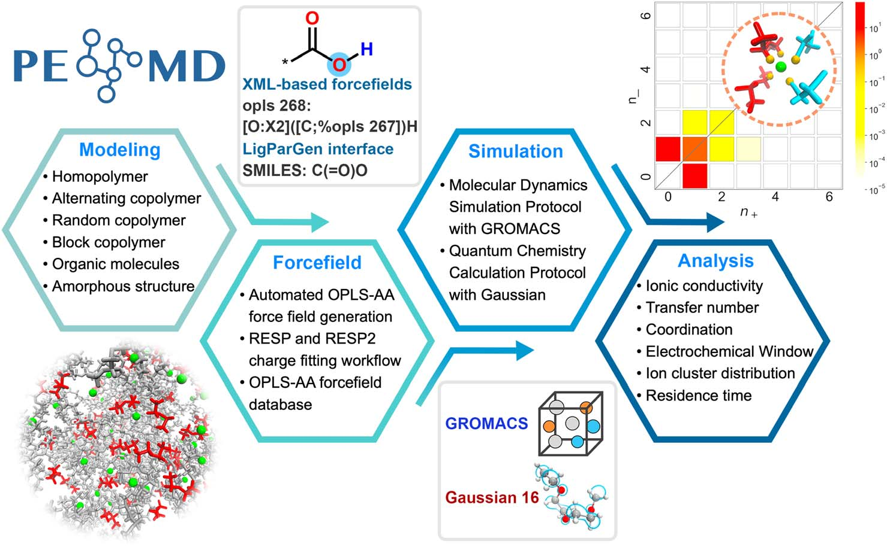

**图1：PEMD工作流总览**。四大阶段（构建、参数化、模拟、分析）通过**标准化接口**无缝连接。输入是**单体结构和计算参数**，输出是**电解质性质数据**（离子电导率、输运数、ESW等）。每个阶段内部都有**自动化算法**（如聚合物链生长算法、SMARTS模式匹配、多级构象搜索），**虚线框**表示可选的高级功能（如多尺度模拟、ESW计算）。

### 二、聚合物模型构建：move-align连接算法

可靠的聚合物结构建模是可信模拟的前提。PEMD的聚合物构建算法（Fig. 2）实现了**任意长度聚合物链的自动化生成**。

#### 2.1 连接过程：move-align操作

核心是**move-align连接算子**（Fig. 2b）。其几何操作流程如下：

1. **计算链延伸方向$v_{chain}$**：计算链尾原子到所有邻居原子的向量，取归一化后的平均方向作为延伸向量（避开邻居、减少位阻）。代码默认还会把$v_{chain}$与全局生长轴按70:30加权混合
2. **放置虚拟连接位点**：沿链延伸向量方向，在规定键长$r_0=1.5$ Å处放置虚拟连接位点
3. **平移单体**：将待连接的单体平移，使其头原子与虚拟位点重合。其中头原子指单体上待接到链上的那一端，尾原子是已接好链的另一端
4. **确定单体延伸方向$v_{unit}$**：算法同上，对头原子计算局部平均方向
5. **先完成反平行对齐**：对单体做刚体旋转，使$v_{unit}$与$v_{chain}$反平行（也就是方向一致，对得上）。采用**轴-角旋转算法**（Rodrigues公式），旋转轴由两向量叉积决定，旋转角由$\arccos(v_{unit} \cdot v_{chain})$计算得到
6. **再施加二面角扰动**：围绕$v_{unit}$额外旋转40°，用于减轻近距离原子接触。这个操作不会改变$v_{unit}$与$v_{chain}$已经建立的反平行关系
7. **结构缺陷检测与优化**：每步连接后检查**位阻冲突或构象缺陷**，如有则进行**局部几何优化**以释放应力

> 这里的“反平行”只是一对用于连接的**局部延伸向量**互为反向，并不表示整条无定形聚合物链会形成反平行有序堆积。40°是沿单体延伸轴的扭转自由度，用于换一个侧基方位、避免原子重叠。论文和SI没有说明这个40°是否可由用户配置或经过系统寻优；公开的示例API也没有暴露这一参数，因此**不能仅凭论文断言它是硬编码常数**。

#### 2.2 多种聚合物架构支持

PEMD支持**均聚物、交替共聚物、无规共聚物、嵌段共聚物**（图2c）。这种多样性对研究**链段化学结构与离子输运的关系**至关重要——例如，PEO的EO链段与$\ce{Li+}$的溶剂化、配位能力强，是经典SPE基体。

- **PEO：聚环氧乙烷（Polyethylene Oxide）**：最早研究和应用最广泛的固态聚合物电解质基体材料，其醚氧段与$\ce{Li+}$的溶剂化配位能力强，是本文基准体系的核心代表
- **SPE基体**：固体聚合物电解质（Solid Polymer Electrolyte）由聚合物基体和锂盐（如LiTFSI）组成。聚合物基体（如PEO）提供机械支撑和离子传输环境，锂盐溶解在聚合物链段间实现$\ce{Li+}$传导。
- **PEO/LiTFSI经典体系**：LiTFSI是双(三氟甲磺酰)亚胺锂（Lithium bis(trifluoromethanesulfonyl)imide），阴离子$\ce{TFSI^-}$为大体积柔性离子，能降低晶格能并提高解离度；与PEO醚氧链段配合，成为聚合物电解质文献中最经典的对比基准体系。

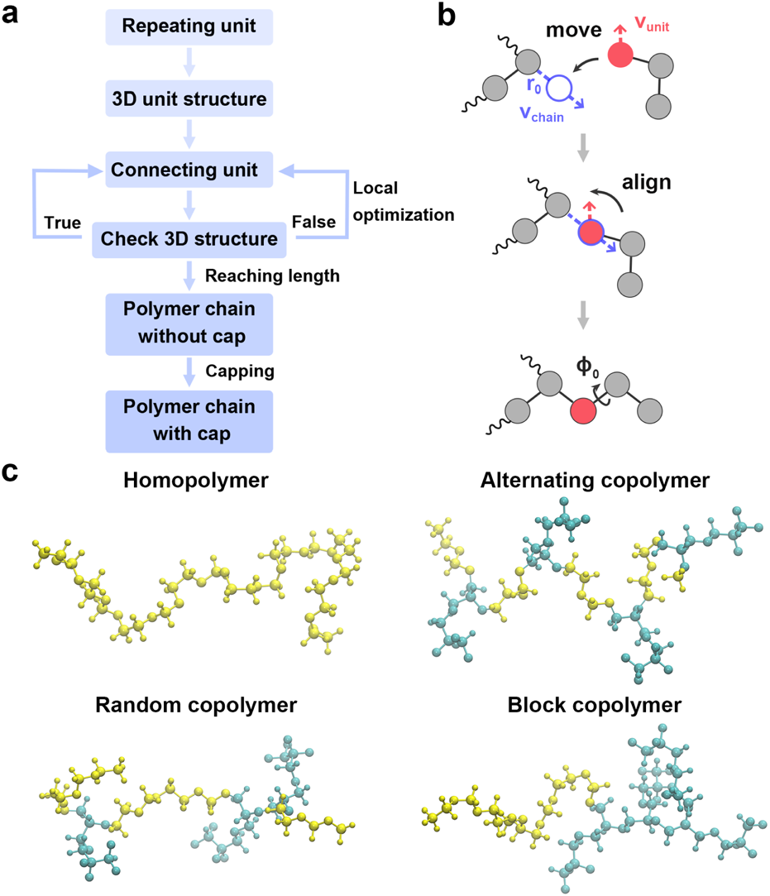

- **图2：PEMD聚合物构建机制**。（a） 聚合物结构生成算法流程图。
- （b） move-align连接算子的几何操作：链延伸向量（灰色箭头）、虚拟连接位点（绿色）、单体平移（蓝色箭头）、单体延伸向量（红色箭头）。先用刚体旋转使两条延伸向量反平行，再沿单体延伸轴作40°二面角旋转（紫色箭头）。
- （c） 四种代表聚合物架构：**均聚物**（单一重复单元）、**交替共聚物**（ABABAB...）、**无规共聚物**（随机序列）、**嵌段共聚物**（先一段A单元、再一段B单元的两段链）

论文图示将避开近接触的附加扭转写为40°。随附源码的当前实现则在每次连接重试时，绕链延伸方向增加固定的$0.10~\mathrm{rad}$旋转，即约5.7°，然后进行MMFF局部优化和几何冲突检查。**论文与当前代码在这一数值上并不一致**；实际复现时应以所用版本的实现和输出结构为准，而不能把40°视为通用、可调的默认参数。

> **建模能力提升**：传统工具（如PSP）对**长链聚合物**的支持有限，PEMD的move-align算法**对链长度无本质限制**，且656种均聚物构建成功率达到100%。这为**高通量筛选长链聚合物电解质**奠定了基础。

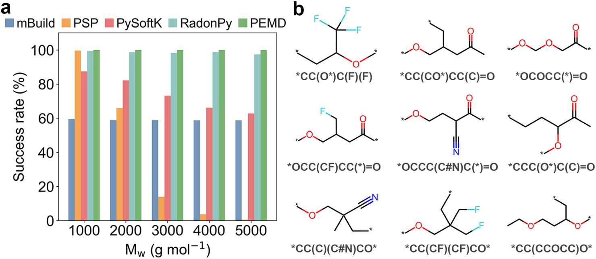

**图8：链生成成功率对比**。成功：没有出现位阻冲突或几何缺陷

- （a）在656个均聚物上对mBuild、PSP、PySoftK、RadonPy、PEMD的端基封端链生成基准测试，$M_w$从1000到5000 g/mol。PEMD（绿色）在所有测试分子量下都生成成功，**成功率为100**%且无明显分子量依赖；mBuild虽无明显分子量依赖，但整体成功率始终低于60%；PSP和PySoftK的成功率随$M_w$升高呈现急剧下降（PSP在$M_w \ge 3000$时尤为显著）；RadonPy在$M_w=3000$处出现明显拐点。该基准的样本分布和官能团多样性见SI图S1。
- （b） 基准测试集中的代表性单体单元（带SMILES）：包括氟化酯类、酯类、醚类、腈类、碳酸酯类等多种官能团，\*标记连接位点。这展示了PEMD对**复杂官能团聚合物**的广泛适应性。

### 三、OPLS-AA力场参数化：两阶段策略

OPLS-AA力场是聚合物MD模拟的基石，但其参数化过程繁琐且依赖专家经验。PEMD采用**两阶段参数化策略**（Fig. 3）实现全自动化。

#### 3.1 SMARTS模式匹配

这一步的目标是把短链片段中已经带参数的原子，可靠地对应到长链上同类的化学位点。它确实涉及原子类型分配，但**SMARTS不是一套预制的OPLS原子类型数据库，也不是SMIRKS反应规则**。

**用户究竟要输入什么**：调用OPLS-AA参数化入口时，用户只需给出一个**重复单元的SMILES**（如`*COC*`表示PEO重复单元）、短链的聚合度（默认三聚体）和左右封端的SMILES，PEMD自己用move-align算法拼出短链并保存为PDB。整个长链的mol对象由用户在更上层的工作流里先建好再传入。

- **短链先交给LigParGen**：PEMD用上一步传入的SMILES和聚合度（默认三聚体）自动构造聚合度较低的短链，并调用LigParGen生成该短链的OPLS-AA GROMACS参数。短链`itp`文件中已经包含原子类型、部分电荷（默认**CM1A-LBCC电荷模型**，即1.24 Å键长校正的CM1A电荷）、Lennard-Jones参数以及键、角、二面角项。LigParGen通常限制在约200个原子以内，因而无法直接为真实MD所需的长链产生参数。**RESP电荷并非强制**——用户不提供RESP拟合结果时，长链就直接沿用LigParGen给出的CM1A-LBCC电荷；只有主动传入RESP拟合结果，PEMD才会把它替换到长链上去。
- **已有条目可以直接调用**：若用户把`ff_source`设为`database`，源码会从PEMD内置数据目录复制已有组分的`pdb`和`itp`文件，而不再运行LigParGen。目前内置了`FEC`、`DEC`、`DME`、`TTE`等常见分子组分，对应实测过的PEO衍生物电解质。因此，动态生成与内置条目是两条并行路径。
- **XMLGenerator现场生成识别规则**：源码读取短链`itp`后，为每个原子构造SMARTS描述符。当前规则只编码中心原子的元素和连接度，以及直接相邻原子的元素和连接度，例如`[O;X2]([C;X4])([C;X4])`。相同描述符被合并为临时类型名，如`opls_1`；这些名称并非现成OPLS编号。
- **Foyer把结构规则用在长链上**：Foyer读取这个由短链`itp`转换得到的XML，在长链拓扑中查找符合每条SMARTS规则的位点，并将相应的短链非键合和键合参数写为GROMACS可用的拓扑文件。**SMARTS的首要作用是跨越原子序号，识别长链中应继承哪一套短链参数的原子位点**。

> 可以把这套机制理解为“先给短链做一次OPLS-AA参数化，再用局部结构指纹把参数复制到长链”。因此PEMD并没有绕开现成的OPLS工具，反而把LigParGen作为短链参数的来源；Foyer解决的是**短链参数如何不依赖原子编号地延展到长链**。

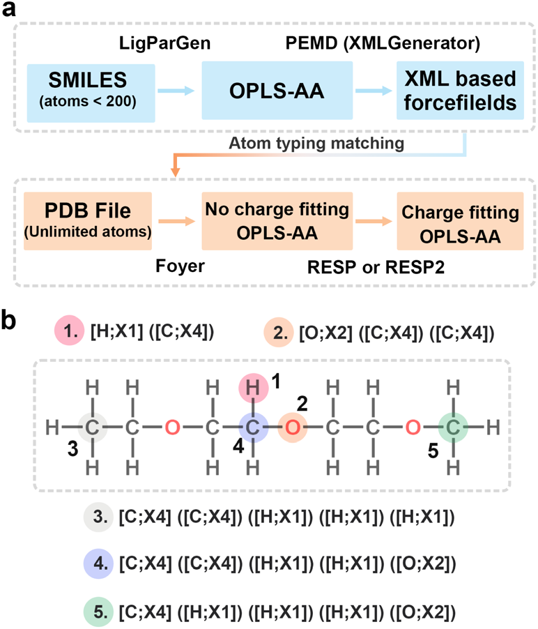

**图3：OPLS-AA力场参数化流程**。

- （a） 两阶段参数化策略：第一阶段为短链片段的初始OPLS-AA参数生成与XML映射，第二阶段用SMARTS模式匹配把XML定义延展到更长的聚合物链。
- （b） SMARTS模式匹配算法在PEO寡聚物（聚合度=3）上的应用，通过**环境感知匹配**自动识别1~5：醚氧（红色）、醚碳（绿色）等原子类型。

当前实现也有边界：识别规则只看到第一配位层，没有显式区分键级、芳香性或更远的取代环境。**局部第一配位层相同、但更大化学环境不同的位点可能被视为同一类型**。本文用聚合度为3的PEO寡聚物演示该流程，却没有给出覆盖所有聚合物化学空间的原子类型正确率；对复杂共聚物和芳香或共轭体系，仍应检查生成的XML与`itp`文件。

#### 3.2 RESP拟合、多级构象搜索与端基处理

第二阶段通过**RESP拟合**（restrained electrostatic potential）优化电荷参数，并通过多级构象搜索（图4）采样分子构象空间。

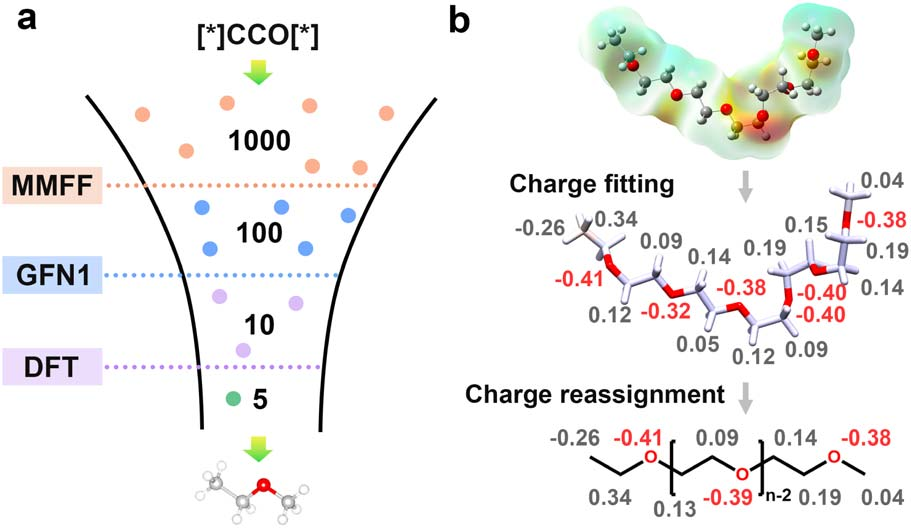

**图4：多级构象搜索工作流**。

- **漏斗型构象搜索**（图4a）：从单体的SMILES和指定聚合度出发，先用RDKit生成1000个初始3D构象，经MMFF**力场**预筛按能量与多样性挑出100个候选，再用半经验方法GFN1-xTB进一步压缩到10个，最后用用户指定的泛函与基组做**密度泛函理论**（DFT）几何优化，收敛到5个能量极小值。整条流水线既覆盖寡聚物也覆盖小分子，作者以PEO寡聚物作为示例。
- **多构象RESP/RESP2拟合**（图4b）：在DFT优化出的低能构象上分别算静电势（ESP），用Multiwfn按RESP或RESP2形式逐构象拟合原子电荷，再对每个原子的电荷在构象集合上取平均。**RESP2在RESP基础上用双阶段拟合**（PEMD默认两端约束强度0.5），对末端原子做较强的谐振约束、链内原子用较弱约束，相当于让末端电荷与构象保持稳定、链内电荷随构象平均的强度按距离调制。
- **端基保持的链扩展**：把拟合用的寡聚物拆成两端封端（caps）和中间重复单元。用户可指定**两侧各保留多少个末端重复单元用其显式拟合电荷**，剩余链段则取核心重复单元的平均电荷作平移不变的内部电荷，最后把整条链的原子电荷重新归一化到目标净电荷。论文明确指出这种“端基保留、内部平移”的映射是聚合物基于寡聚物ESP拟合的标准做法。

PEMD把构象搜索、ESP计算和RESP/RESP2拟合串成一条命令，分工上和3.1一致——**短链是参数的真实来源，长链只继承已经拟合好的电荷与类型**。但论文报告的100%成功率仅针对656种均聚物的**链构建基准**，并没有给出所有化学空间中力场参数化的独立成功率。两者不能混为一谈。

#### 技术实现与软件架构

| 环节       | PEMD的具体实现                                               | 论文明确使用的外部组件              |
| ---------- | ------------------------------------------------------------ | ----------------------------------- |
| 聚合物构建 | 根据带连接位点的SMILES生成均聚物或不同共聚物序列，完成链增长和端基封端 | RDKit、PACKMOL                      |
| 力场与电荷 | LigParGen先生成短链OPLS-AA参数，XMLGenerator将其改写为局部SMARTS识别规则，再由Foyer映射到长链；用多构象平均得到RESP或RESP2电荷 | LigParGen、Foyer、Multiwfn、DFT程序 |
| 采样       | 最小化、退火、NPT平衡和生产期MD，并由模板化参数控制轨迹输出  | GROMACS                             |
| 后处理     | 从轨迹计算扩散、电导率、Onsager输运数、配位基元、团簇和停留时间 | MDAnalysis及PEMD分析脚本            |

用户入口集中在PEMD的核心model类（见SI图S1），对应均聚物与共聚物两类调用：传入工作目录、带`*`连接位点的SMILES、链长、共聚模式或嵌段大小即可构造链结构。**论文只展示Python调用接口**，没有命令行工具入口。

使用前置依赖

- **PEMD自带的依赖**：`rdkit==2024.3.6`、`MDAnalysis>=2.2.0`、`matplotlib`（见`setup.py`）。
- **conda环境提供**：`xtb`、`packmol`、`openbabel`、`py3dmol`、`gmso`、`ase`等（见`environment.yml`）。
- **必须自带**：`GROMACS`、`Multiwfn`、`LigParGen`、**`Gaussian 16`**——这些都是shell命令或外部程序，“available in your runtime environment if you plan to execute the full workflows”，**PEMD没有自动化安装脚本**。
  - **DFT引擎仅Gaussian 16**：代码里硬编码了Gaussian 16对应的可执行文件名，PEMD对DFT引擎没有插拔接口，**不支持ORCA/Psi4/Q-Chem/NWChem**，要换得改源码。
  - **LigParGen**是Jorgensen组的本地命令行工具，PEMD通过subprocess shell调用它，输入SMILES或mol文件，输出GROMACS的itp和csv。需自行安装（`pip install ligpargen`）。
  - **力场仅OPLS-AA**：没有GAFF/OpenFF/Charmm/Amber/traPPE等其他力场的入口；要换力场需要重写底层XMLGenerator和Foyer规则。

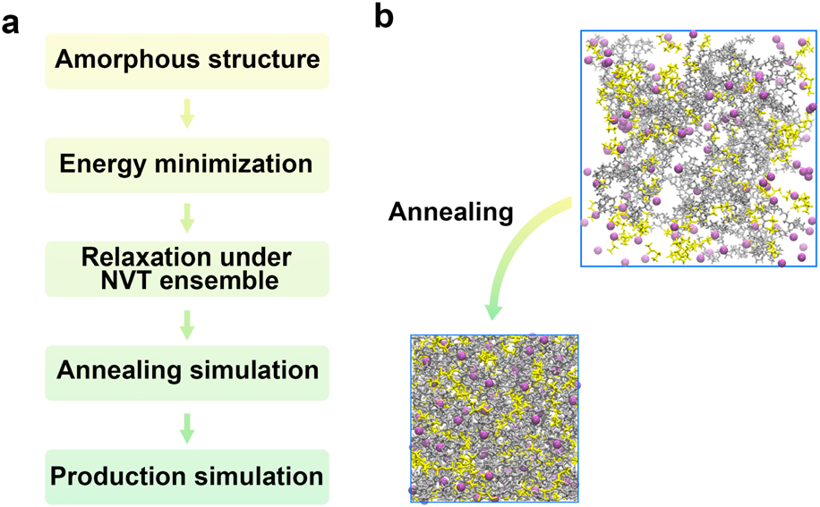

**图5：MD模拟协议与退火前后的无定形结构**。

- （a） PEMD的MD协议：初始**无定形电解质→最陡下降最小化→200 ps NVT弛豫→约14 ns 升降温退火→5 ns NPT弛豫→生产MD 200 ns（默认）或400 ns**。需要注意实际代码里调用的是NPT退火，而论文正文与SI都没有交代为何退火选NPT。这套流程在PEMD里是**软件内置的固定流水线**——用户无需手动拼GROMACS的mdp。
- （b） PEO/LiTFSI从PACKMOL初始堆积到退火后无定形结构的对比，展示退火缓解局部缠结和不合理接触的作用。

### 四、高通量性质分析：电导率、输运数与ESW

PEMD把高通量分析拆成三大模块（图7），本章按顺序分别讨论：离子电导率（4.1）、配位与团簇（4.2）、电化学稳定性窗口（4.3）。

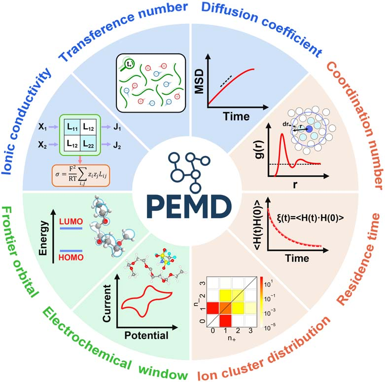

**图7：PEMD后处理分析框架**。PEMD的三大分析模块：**输运性质**（蓝色）——输运数、离子电导率、扩散系数；**输运机制**（橙色）——配位数、停留时间、离子团簇分布；**电化学稳定性**（绿色）——HOMO/LUMO前线轨道、电化学窗口。每个模块都通过**自动化算法**处理MD轨迹，输出**可视化结果**（均方位移MSD曲线、径向分布函数RDF图、相关函数衰减曲线、统计矩阵热图等）。

#### 4.1 离子电导率预测

PEMD的自动化MD工作流复现了**18个报告体系的实验离子电导率**（Spearman $r=0.819$，MAE=0.684），并进一步用于**200种聚合物电解质**的离子电导率计算（图9b）。

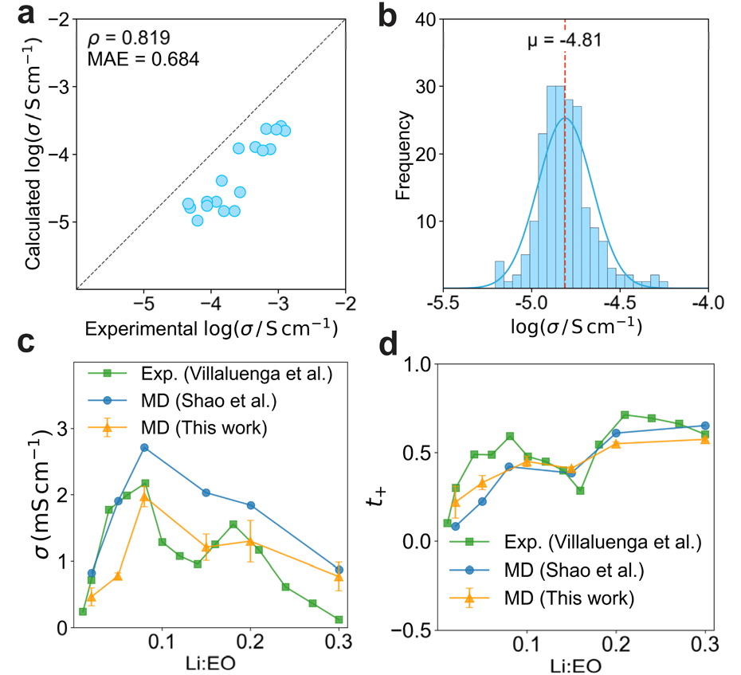

**图9：离子电导率预测与实验对比**。

- （a）18个聚合物电解质体系的计算与实验离子电导率对比。虚线为理想一致线；Spearman相关系数$r=0.819$，在$\log_{10}(\mathrm{S\,cm^{-1}})$尺度上MAE为0.684
- （b）200种聚合物电解质的离子电导率频率分布，叠加正态拟合。平均$\mu=-4.81$，呈**单峰分布**；线性尺度约$1.5 \times 10^{-5}~\mathrm{S\,cm^{-1}}$
- （c）PEO/LiTFSI的离子电导率随Li:EO摩尔比变化。PEMD计算、既有MD与实验均显示非单调趋势，**峰值位于Li:EO约0.10至0.12**
- （d）对应的阳离子输运数$t_+$随Li:EO变化。图中比较了PEMD、既有MD和实验结果；它支持PEMD能再现浓度依赖的总体趋势，但不宜据此概括为对所有盐浓度都“优于”既有MD

**玻璃化转变温度$T_g$的独立验证**：PEMD沿用GroPoB协议自动计算$T_g$（SI图S16），与实验电导率做相关性分析，Spearman $r=-0.962$，$R^2=0.949$——意味着**链段运动能力越强，$T_g$越低，离子电导率越高**这一物理趋势在PEMD工作流里能可靠复现。这条线索与图9a的18体系相关性一起，构成两路独立的“工作流可信度”证据。

#### 4.2 输运数与溶剂化结构分析

PEMD自动计算**输运数和溶剂化结构分布**。**阳离子输运数**$t_+$指电场下阳离子电流占总离子电流的份额，即$t_+ = i_+ / (i_+ + i_-)$，其大小取决于阳、阴离子之间的相关运动（correlation motion），因此**不能直接用单粒子自扩散比代替输运数**——后者只是Nernst-Einstein近似$t_+^{\mathrm{NE}} = D_+ / (D_+ + D_-)$，在浓电解质中可能严重偏离真实$t_+$。溶剂化结构分布则统计每个$\ce{Li+}$周围不同配位组分出现的频率。

- **配位基元分布**：PEMD按$m=(n_{polymer},n_{anion},n_{solvent})$记录每个$\ce{Li+}$的第一配位壳层组成，再汇总为溶剂化结构分布。

**输运性质的计算口径**：自扩散系数由Einstein关系得到，离子电导率由Green-Kubo关系计算，阳离子输运数则来自Onsager输运矩阵$L_{ij}$。这一处理保留了阳、阴离子之间的相关运动，因此不同于把自扩散系数直接代入Nernst-Einstein近似。

**溶剂化结构分析**：PEMD提供**多个维度的溶剂化结构表征**：

- **配位基元分布**：以RDF第一极小值作为$\ce{Li+}$-供体接触截断，统计聚合物、阴离子与溶剂的配位数组合。
- **离子团簇与停留时间**：这些分析在SI图S10至S13中给出，用来补充离子缔合和局部配位的动力学信息。

> **物理意义**：输运数、离子团簇和溶剂化基元需要联用。高$t_+$可能与较弱的阴离子相关运动有关，但是否属于链段辅助跳跃或其他机制，需要结合停留时间、MSD（均方位移）和配位交换等轨迹证据判断。

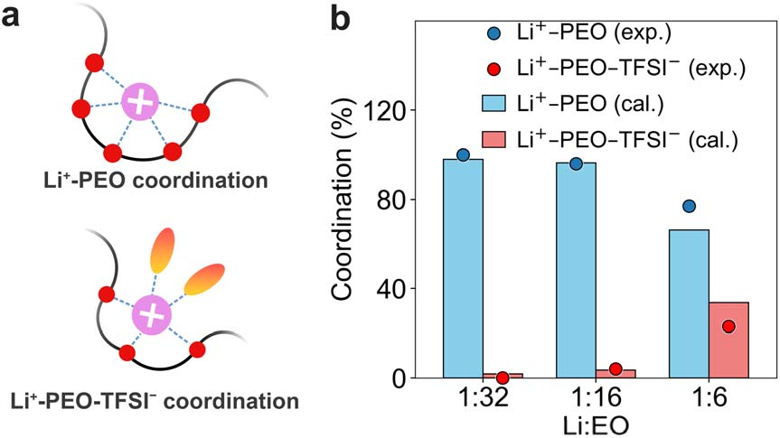

**图10：锂离子溶剂化结构分析**。

- （a）PEO电解质中$\ce{Li+}$的第一壳层配位模式示意图：上图为$\ce{Li+}$-PEO配位，图示中$\ce{Li+}$与5个醚氧原子配位；下图为$\ce{Li+}$-PEO-$\ce{TFSI-}$配位，$\ce{Li+}$同时与PEO链段和$\ce{TFSI-}$阴离子配位。
- （b）三个Li:EO浓度（1:32、1:16、1:6）下$\ce{Li+}$-PEO与$\ce{Li+}$-PEO-$\ce{TFSI-}$配位比例的计算值与实验值对比。
  - 实验值由TFSI−拉曼谱带拟合得到，对应“已解离-已缔合”的离子分布。
  - 盐浓度从Li:EO$=1:32$升至$1:6$时，$\ce{Li+}$-PEO比例单调上升，含$\ce{TFSI-}$的聚集配位比例被压制；计算与拉曼实验在整个浓度范围内一致。

**这套工作流并不限于醚基体系**：论文在聚乙烯碳酸酯PEC/LiTFSI上重复了同一套S17分析。结果显示，低盐浓度下PEC/LiTFSI中$\ce{Li^+}$-PEC-TFSI−比例明显高于PEO/LiTFSI，意味着**碳酸酯主链对$\ce{Li^+}$的配位环境更弱，使TFSI−更易进入第一壳层**。这与PEO的强醚氧配位形成对照，同时验证了同一后处理流程在非醚基主链上的可移植性。

#### 4.3 电化学稳定性窗口（ESW）评估

PEMD集成了**自动化ESW计算工作流**（Fig. 6），通过**量子化学计算**（DFT）评估聚合物的氧化倾向。**电化学稳定性窗口**（Electrochemical Stability Window, ESW）是聚合物电解质在不发生氧化-还原分解的电压区间，由氧化极限$E_{ox}$和还原极限$E_{red}$共同界定。

流程上PEMD做了两件事：**(i)** 从MD轨迹里抽出聚合物-阴离子配位簇并封端——MD部分只负责采样结构；**(ii)** 在DFT层面算中性态与氧化态的自由能差，再换算为相对$\ce{Li/Li+}$的电压

$$
E_{ox}~\bigl(\mathrm{V~vs.~Li/Li^+}\bigr) = \dfrac{G(M) - G(M^+)}{F} - 1.46~\mathrm{V}
$$

对应ESW后处理模块，输入是DFT给出的中性态、氧化态、还原态三个自由能（带单位hartree/eV/kcal/mol均可），由上述公式转换成$E_{ox}$、$E_{red}$和窗口宽度ESW。$F$是法拉第常数，$1.46~\mathrm{V}$是$\ce{Li/Li+}$参比的电位修正。与正极界面发生不可逆氧化分解会腐蚀正极、缩短寿命，所以$E_{ox}$在实际应用中比$E_{red}$更受关注。**ESW计算的实际流程**：

1. **提取聚合物-阴离子复合物**：从MD轨迹找出阴离子相对于聚合物H原子的第一配位壳层；与该H共价相连、距离最近的重原子作为链锚点，从锚点沿主链两侧截取指定长度的连续链段。
2. **构建并封端簇模型**：提取出的链段与配位阴离子组成聚合物-阴离子簇，并按聚合物构建模块相同的规则封端。SI表明，PEO体系中三重复单元的聚合物-阴离子簇已使氧化电势趋于收敛。
3. **计算氧化电势**：用低层级DFT预筛候选构型，指定体相介电常数后进行DFT单点能计算，利用中性态与氧化态的绝热离子化自由能差换算为相对$\ce{Li}/\ce{Li+}$的$E_{ox}$。
4. **区分定性与定量筛选**：HOMO/LUMO只提供快速、定性的稳定性窗口估计；文中用于与实验氧化起始电势比较的$E_{ox}$，在B3LYP-D3(BJ)/def2-TZVP水平计算。

> **物理洞察**：不同聚合物的**氧化机理不同**。PPO的C-C键处出现**空穴定位**（spin density map显示），键被削弱并拉长；PEO、PDOL、PTHF的氧化是**阴离子介导的氢提取**——阴离子（如TFSI）从聚合物提取质子。这解释了**不同聚合物的稳定性差异**。

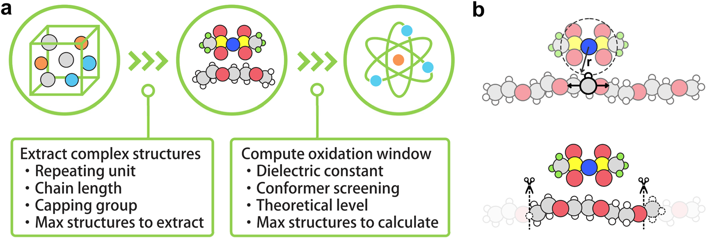

**图6：氧化窗口自动化计算框架**。

- （a）ESW计算工作流：从MD轨迹提取聚合物-阴离子簇，指定重复单元数、链长和封端基团，设置介电常数后做DFT预筛与单点能计算，并由绝热离子化自由能计算$E_{ox}$。
- （b）以PEO/LiTFSI为例的复合物提取：从阴离子与PEO链H原子的第一配位壳层定位链锚点，再沿主链两侧截取连续片段，加入配位阴离子并封端，作为后续DFT输入。

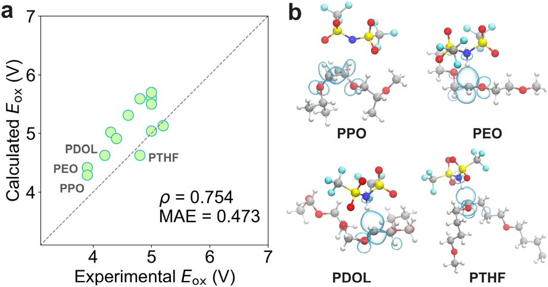

**图11：氧化电势与实验对比**。

- （a） 15种聚合物电解质的计算与实验氧化电势（$E_{ox}$，V）在B3LYP-D3(BJ)/def2-TZVP理论级别的相关性。**Spearman ρ=0.754**，**MAE=0.473 V**。虚线=y=x。标出的代表聚合物包括PPO、PEO、PDOL、PTHF等。
- （b） 不同聚合物的**自旋密度图**（spin density map）：PPO显示C-C键处的空穴定位（键被削弱并拉长）；PEO、PDOL、PTHF显示阴离子介导的氢提取位点（HOMO轨道定位）。这直观展示了**不同聚合物的氧化机理差异**。

## 关键结论与批判性总结

- **适用边界明确**：PEMD最适合需要同时完成聚合物链构建、OPLS-AA参数化、GROMACS采样和离子输运后处理的SPE筛选任务。它提供的是标准化工作流，并不意味着所有聚合物、电极界面或反应过程都可由同一套默认参数可靠描述。
- **验证覆盖两个层次**：18个体系的电导率与实验呈Spearman相关系数$r=0.819$，15个体系的氧化电势排序呈相关系数$r=0.754$。这支持其用于趋势筛选；绝对误差仍分别达到0.684 log单位和0.473 V，不能把排序一致性等同于定量预测完全准确。
- **PEO/LiTFSI是关键回归测试**：电导率峰值位于Li:EO约0.10至0.12，输运数也随浓度改变。这个结果说明默认MD协议能够再现该经典体系的主要浓度趋势，但不能单凭一个体系推出对所有聚合物盐组合都同样可靠。
- **ESW模型仍有近似**：HOMO/LUMO筛选是定性工具；更严格的$E_{ox}$虽考虑聚合物-阴离子簇和构象抽样，却仍以小簇、介电环境和绝热自由能近似真实电极界面的氧化过程。
- **建模机制本身有三处需要使用者警惕**：**(i)** move-align中避开近接触的附加扭转，论文写40°、代码当前实现是约5.7°，数值不一致意味着按论文参数复现会得到与代码不完全相同的链构象；**(ii)** SMARTS识别规则只看第一配位层、没有编码键级和远端取代环境，对含芳香环、共轭或远程电子效应的体系，相同描述符的不同位点可能被错并为同一类型；**(iii)** 无规共聚物的序列由随机抽样生成而非按概率分布聚合，跑出的输运性质对单条链的随机种子可能敏感，多链平均与方差需要单独报告。
- **下一步的验证重点**：复杂嵌段共聚物的相分离形貌、离子在电极界面的反应以及力场电荷缩放对不同化学空间的迁移性，仍需要与实验或更高层级模拟逐一验证。
