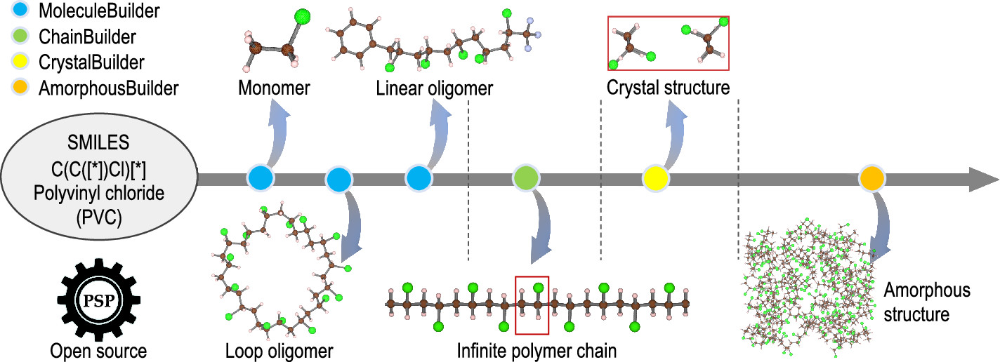
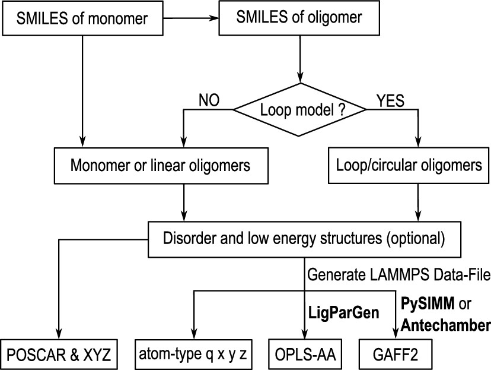
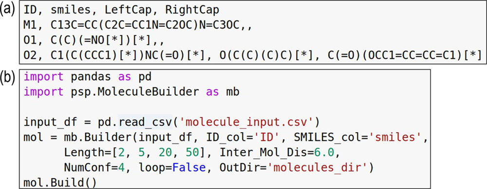
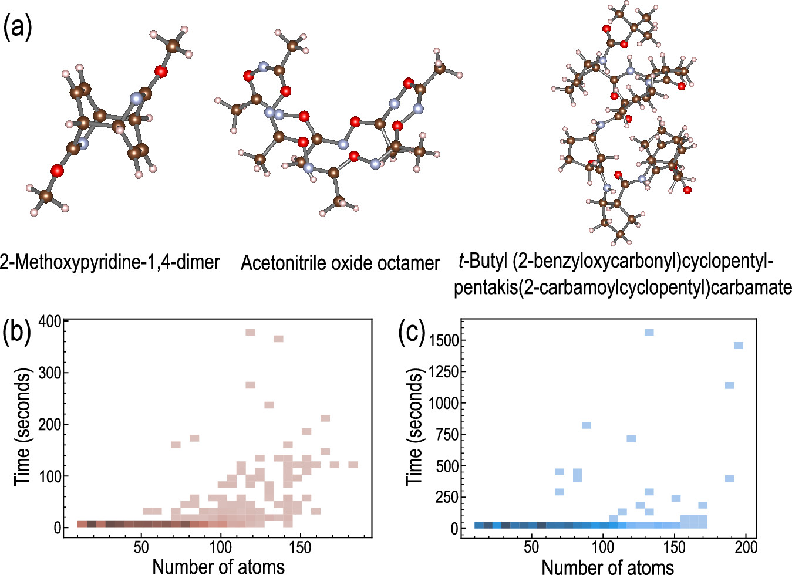
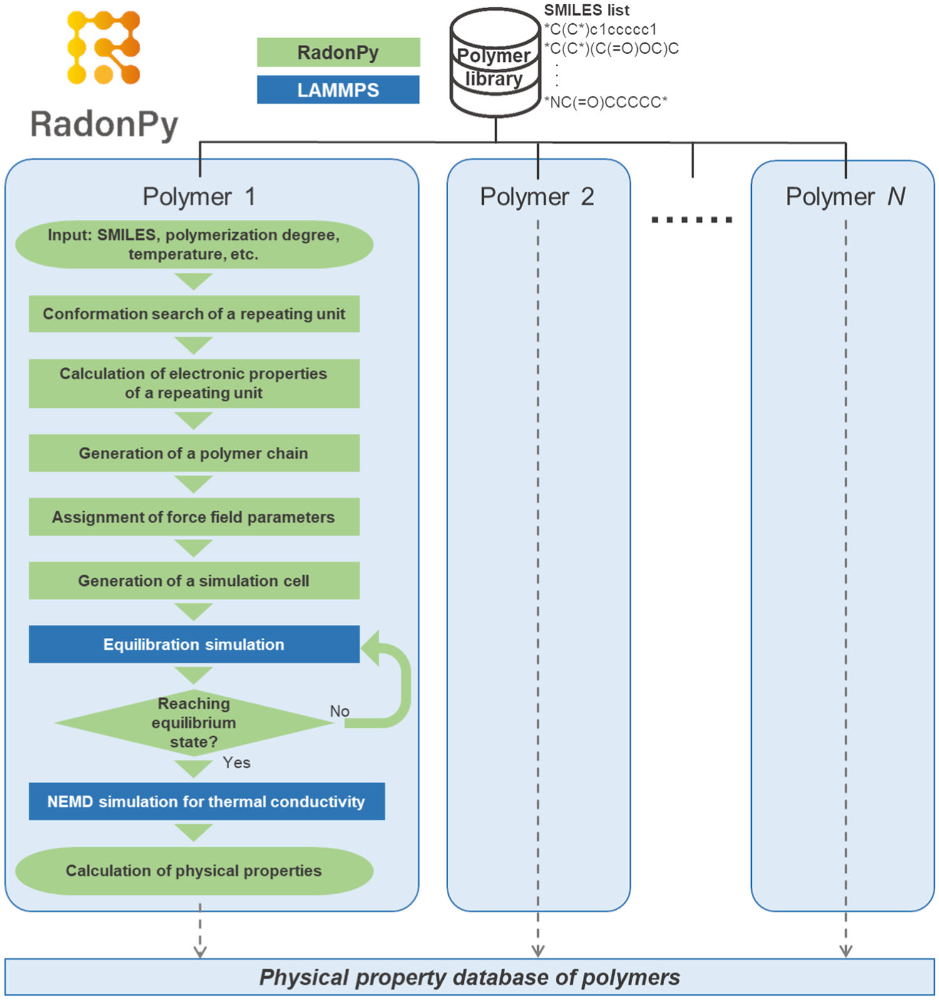
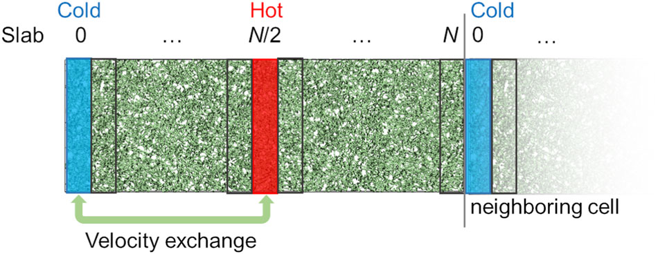
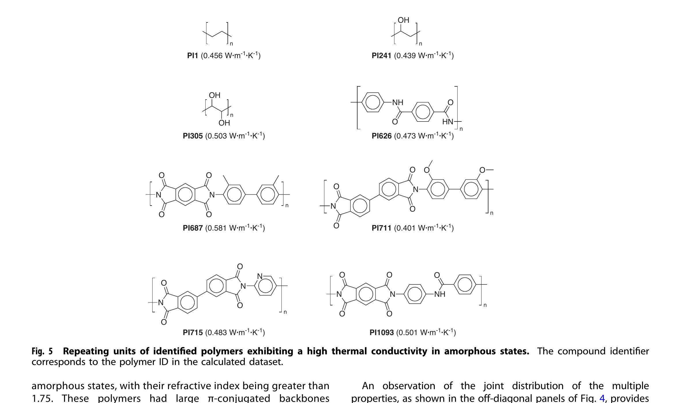

# PSP与RadonPy对比——两种聚合物高通量建模工具的异同

## 本文信息

### PSP（Polymer Structure Predictor）

- **标题**：Polymer Structure Predictor (PSP): A Python Toolkit for Predicting Atomic-Level Structural Models for a Range of Polymer Geometries
- **作者**：Harikrishna Sahu, Kuan-Hsuan Shen, Joseph H. Montoya, Huan Tran, Rampi Ramprasad
- **发表期刊**：Journal of Chemical Theory and Computation
- **发表时间**：2022年3月4日
- **单位**：Georgia Institute of Technology（美国）
- **引用格式**：Sahu, H., Shen, K.-H., Montoya, J. H., Tran, H., & Ramprasad, R. (2022). Polymer Structure Predictor (PSP): A Python Toolkit for Predicting Atomic-Level Structural Models for a Range of Polymer Geometries. *J. Chem. Theory Comput.*, 18(4), 2737–2748. https://doi.org/10.1021/acs.jctc.2c00022
- **代码与数据**：https://github.com/RamprasadGroup/PSP（MIT许可证）

### PSP摘要

> 聚合物的三维原子级模型是基于物理的模拟研究的起点，因此**自动生成合理的初始结构模型**的能力备受关注。本文开发了**polymer structure predictor**（PSP），一个Python工具包，以聚合物重复单元的SMILES字符串为主要输入，生成从**寡聚物到无限链、晶体再到无定形模型**的层级化聚合物结构。该工具包允许用户调整多个参数来管理模型质量、规模和计算成本的平衡。输出的结构和配套的力场（GAFF2/OPLS-AA）参数文件可直接用于下游的第一性原理计算和分子动力学模拟。PSP包还包含Colab Notebook，用户可通过多个示例来构建、可视化并下载自己的模型。作为**同类首创的工具包**，PSP将促进聚合物性质预测和设计领域的自动化。

### RadonPy

- **标题**：RadonPy: automated physical property calculation using all-atom classical molecular dynamics simulations for polymer informatics
- **作者**：Yoshihiro Hayashi, Junichiro Shiomi, Junko Morikawa, Ryo Yoshida
- **发表期刊**：npj Computational Materials
- **发表时间**：2022年10月19日
- **单位**：The Institute of Statistical Mathematics（ISM）、The University of Tokyo（日本）
- **引用格式**：Hayashi, Y., Shiomi, J., Morikawa, J., & Yoshida, R. (2022). RadonPy: automated physical property calculation using all-atom classical molecular dynamics simulations for polymer informatics. *npj Computational Materials*, 8, 222. https://doi.org/10.1038/s41524-022-00906-4
- **代码与数据**：https://github.com/RadonPy/RadonPy（BSD-3许可证）

### RadonPy摘要

> 数据驱动的**材料科学研究**（materials research）的兴起，增加了对**系统性设计的材料性质数据库**的需求。然而，聚合物数据库的构建远远落后于其他材料体系。本文提出**RadonPy**，一个能够自动化全原子经典分子动力学（MD）模拟全流程的开源库，适用于广泛的聚合物材料。在本文中，对**1000多种无定形聚合物**计算了**15种不同性质**，并系统地将MD计算结果与实验数据对比以验证计算条件；MD计算性质中的偏差和方差通过**机器学习技术**得到了成功校正。在高通量数据生产期间，识别出了8种**热导率极高**（$>0.4\,\mathrm{W\cdot m^{-1}\cdot K^{-1}}$）的无定形聚合物并探讨了其内在机制。类似于无机晶体计算性质数据库的出现推动材料信息学进步的过程，RadonPy数据库的构建将促进聚合物信息学的发展。

### 核心结论

- **PSP和RadonPy定位差异显著**：PSP是**结构模型生成器**（输出模型+力场文件），RadonPy除了建模还是**全自动性质计算流水线**（输出性质数值）
- **PSP用户可单独调用每个模块**：MoleculeBuilder生成寡聚物、ChainBuilder构建无限链、CrystalBuilder预测晶体、AmorphousBuilder填充无定形，每个步骤的参数（如SA1/SA2/SA3模拟退火策略、最小原子间距、盒子尺寸）都可独立配置
- **RadonPy内置21步压缩/解压平衡协议和自动平衡判定**：温度在300K和600K之间切换，压力最高达50000 atm，每5ns检查能量/密度/回旋半径的RSD是否低于阈值（能量$<1$\%、密度$<2$\%、回旋半径$<3$\%），最长等待50ns
- **两者都不直接输出GROMACS的itp格式**（vs PEMD原生支持），力场选择也有所不同
- **PSP不支持共聚物**（仅均聚物），**RadonPy完整支持均聚物+交替/无规/嵌段共聚物+支化聚合物**

## 背景

**材料信息学（Materials Informatics）**在过去十年中取得了迅速发展。以Materials Project（约14万个无机化合物）、AFLOW（约300万个）、OQMD（约100万个）为代表的无机材料数据库，以及QM9（约13.4万个有机小分子）数据库，已经为机器学习驱动的材料设计提供了充足的数据基础。

然而，**聚合物数据库的构建远远落后于其他材料体系**。PoLyInfo是目前最大的聚合物性质数据库，包含18000多种聚合物的约100种性质，但大多数聚合物只有单一性质被记录，数据极度稀疏；Polymer Genome则主要基于第一性原理计算，只覆盖晶体态和单链态的少量电子和光学性质。造成这一差距的原因有三：数据生产成本高、聚合物结构与加工工艺的多样性难以统一数据格式、以及学术和产业界之间因竞争顾虑而不愿共享数据。

与此同时，基于物理的模拟方法在聚合物科学与工程中越来越重要，涵盖了从原子尺度的电子结构计算到介观尺度的粗粒化MD模拟。**所有这些方法的共同前置条件都是一个合理的原子级聚合物结构模型**。这一步恰恰是聚合物模拟中最棘手的瓶颈：聚合物大多是无定形态，现成的结构模型几乎不存在；即使对聚乙烯（PE）和聚氯乙烯（PVC）这类简单的线性聚合物，预测其晶体结构和链级构象也比硬材料困难得多。

在实践中，聚合物模型需要**大量的人工干预和专家经验来手工构建**。一个典型的建模流程包括：用RDKit或Open Babel等化学信息学软件从原子连接性信息构建重复单元结构，再用Materials Studio等工具随机复制重复单元来生成有限聚合物链（寡聚物），然后随机将这些链放置在模拟盒子中以复现目标密度，最后还需要一套体系专属的力场参数文件。

现有工具如CHARMM-GUI的聚合物构建模块虽然能生成有限链和熔体模型，但其能力被限定在特定的单体、封端基团和溶剂集合上，**无法覆盖广泛的化学空间**。除此之外，这些大模型也无法用于高精度的第一性原理电子结构计算，后者需要更小、更精确的原子模型。**目前不存在一个能够接受重复单元SMILES并生成适用于多种计算目标和方案的、用户可控大小规模的聚合物模型的实际工具**。

之前介绍的[PEMD——固体聚合物电解质高通量模拟与分析框架](/molecular%20dynamics/modeling%20&%20tools/polymer/2026-07-12-pemd-spe.html)（2026年）介于两者之间：它是一条端到端流水线，但性质计算针对的是**电解质输运和电化学稳定性**这一特定科学问题，力场只用OPLS-AA、MD引擎只用GROMACS。

## PSP：层级结构模型生成器

PSP的设计哲学是**从SMILES出发**，按层级构建越来越复杂的聚合物模型。代码包由四个模块组成：MoleculeBuilder、ChainBuilder、CrystalBuilder、AmorphousBuilder。



**图1：PSP工作流概览**。从聚合物SMILES出发，MoleculeBuilder和ChainBuilder构建寡聚物和聚合物链，CrystalBuilder和AmorphousBuilder分别构建晶体和无定形模型候选。**红色矩形和盒子是周期性重复的晶胞**；SMILES中的星号（`[*]`）标记连接原子，相邻重复单元通过该位置共价结合。

### MoleculeBuilder：有限链（寡聚物）

MoleculeBuilder是PSP的基础模块，负责从SMILES字符串生成目标聚合度的寡聚物模型。工作流程如下：

1. **SMILES扩展**：从重复单元SMILES出发，用`[*]`标注两个连接位点，自动连接生成目标聚合度的线性SMILES。支持`Loop=True`生成环形聚合物链，`IrrStruc=True`生成含不规则化学环境（如分支、手性中心）的结构
2. **初始结构生成**：利用RDKit的ETKDG算法生成三维构象，然后用UFF（Universal Force Field）做几何优化，消除明显的原子重叠和不合理的键角
3. **构象搜索**（可选）：如果RDKit生成的结构缺少链内非键相互作用（如氢键、π-π堆积），PSP可以启动一轮短的NVT动力学模拟（15ps，GAFF2力场），然后重新优化，得到多个能量较低的构象供用户选择。默认`GAFF2_atom_typing='pysimm'`，通过PySIMM调用Antechamber分配原子类型
4. **输出格式**：支持XYZ、PDB、LAMMPS data等格式，用户可根据下游需求选择



**流程图1：MoleculeBuilder模块的工作流程**。从带`[*]`连接位点的SMILES出发，通过连接重复单元生成目标聚合度寡聚物的线性SMILES，再由RDKit ETKDG生成3D构象并用UFF优化。环形链模型将两端连接位点直接相连，否则替换为封端基团。



**图2：MoleculeBuilder的输入文件示例**。（a）CSV文件（molecule_input.csv）定义重复单元、左封端和右封端单元的SMILES字符串；（b）构建线性寡聚物的Python脚本示例。

输入通过CSV文件传入，包含重复单元SMILES、左封端SMILES、右封端SMILES三列，聚合度列表在脚本中另行指定。用户可以指定$\ce{OH}$、$\ce{CH3}$、$\ce{NH2}$等不同封端基团，模拟不同化学环境下的聚合物末端基团。

### 性能测试

PSP在1000个不同聚合物SMILES上测试了二聚体模型生成能力。结果显示，单核处理器成功率为**97.2**%，多核处理器成功率为**98.5**%。多核处理器的计算中，93.5%的模型在**15秒内完成**构建，包括大于150个原子的寡聚物。



**图3：PSP生成的分子结构及性能测试**。（a）三种代表性分子的几何结构，碳、氢、氮、氧分别以棕色、浅棕色、青色和红色显示。（b，c）使用单核和多核处理器从1000个SMILES字符串生成二聚体模型的性能测试。单核成功率为97.2%，多核成功率为98.5%，93.5%的模型在15秒内完成。

### ChainBuilder：无限链

PSP的核心卖点之一——构建**周期性无限链**模型，用于后续的晶体结构预测或第一性原理计算。无限链的构建比寡聚物复杂得多，因为需要同时满足几何合理性和周期性边界条件。

**模拟退火算法**：ChainBuilder的核心是一个多目标优化问题。目标函数包含三项：

$$
E = E_{\text{UFF}} + E_{\text{UFF}}(1 - \alpha/180) + E_{\text{connectivity}}
$$

- $E_{\text{UFF}}$：UFF力场能量，确保键长、键角在合理范围内
- **端基反平行项**（$\alpha$接近180°为最优）：强制链两端的连接矢量近似反平行，这是周期性边界条件下形成无限链的几何要求
- $E_{\text{connectivity}}$：连接正确性罚项，确保相邻重复单元之间的化学连接正确

模拟退火过程通过旋转单体内部的可旋转键来探索构象空间。代码参数`Steps=20`（共20个退火周期），`Substeps=10`（每周期10次扭转角随机尝试）。**接受概率**从$p_1=0.3$衰减至$p_{50}=0.001$，对应**初始温度**$t_1=-1/\ln(0.3)$，**最终温度**$t_{50}=-1/\ln(0.001)$，**指数冷却**：$t_{i+1}=t_i \times (t_{50}/t_1)^{1/(n-1)}$。每个周期内，随机选择可旋转键和扭转角作为新构象，若新能量更低则直接接受，否则以概率$p=\exp(-\Delta E/(\Delta E_{\text{avg}} \times t))$接受，其中$\Delta E_{\text{avg}}$是迄今为止接受解的平均能量变化。**早停判据**：连续3个周期的能量完全相同时提前终止。

PSP还提供`Method='Dimer'`选项，用二聚体替代单体作为构建单元，增加骨架柔性。参数`IntraChainCorr=1`控制链内相互作用权重，`Inter_Chain_Dis=12` Å为链间最小间距阈值。`Tol_ChainCorr=50`是链构象容忍度阈值，超过该值的候选构象会被丢弃。

**扭转角采样表**：模拟退火中每步随机选取的扭转角来自代码预设的两张角度表（`MonomerAng`和`DimerAng`），控制每次旋转的角度范围。`low`表（9个值）：`[0, 45, -45, 60, -60, 90, 120, -120, 180]`度；`medium`表（15个值）：`[0, 30, -30, 45, -45, 60, -60, 90, 120, -120, 135, -135, 150, -150, 180]`度。默认`MonomerAng='medium'`、`DimerAng='low'`，即用更密集的角度表搜索单体构象，用更稀疏的表搜索二聚体。

**关键限制**：对于骨架中有双键的聚合物（如聚乙炔），ChainBuilder无法生成寡聚物（因为氢原子不能饱和连接位点的价态）。用户需要改写SMILES，让连接位点用单键连接。

### CrystalBuilder：晶体结构预测

CrystalBuilder是PSP独有的能力（RadonPy和PEMD都不做晶体预测），采用**刚体采样**方式生成候选晶体结构。代码中`create_crystal_vasp()`函数实现：

1. **链拷贝生成**：从ChainBuilder输出的无限链中提取两个链拷贝（`first_poly`和`second_poly`），分别代表晶胞中两套链
2. **z轴平移**：`tl()`函数沿z轴方向平移链（`dis`参数），控制链间距
3. **XY平面旋转和平移**：`Center_XY_r()`函数将链中心置于XY平面，并施加角度`theta`旋转，同时按半径`r_cricle`偏移
4. **原子间距约束**：`MinAtomicDis`参数（默认2 Å）确保无原子重叠
5. **能量评估**：用UFF力场评估每个候选结构的能量，筛选能量较低的构型
6. **输出**：生成VASP POSCAR格式文件（`readvasp()`函数可读取验证），含晶胞基矢量和原子坐标，可直接用于DFT计算

CrystalBuilder是PSP独有的能力，RadonPy和PEMD都不做晶体预测。生成的晶体结构可用于研究聚合物的结晶行为、多晶型现象，或作为第一性原理计算的初始结构。

### AmorphousBuilder：无定形结构填充

> **无定形（amorphous）**：缺乏长程有序原子排列的固态，链段呈随机缠绕，与晶体（crystalline）相对。大多数常见聚合物（如橡胶、塑料薄膜）在室温下都以无定形态为主。

无定形结构的构建采用**PACKMOL包**（Packing Algorithm for Non-entangled Molecular Models）进行分子填充。具体流程：

1. **盒子定义**：用户指定模拟盒子的尺寸和目标密度
2. **链拷贝生成**：从MoleculeBuilder或ChainBuilder输出中提取指定数量的寡聚链
3. **随机填充**：PACKMOL将这些链作为刚体随机放置于盒子中，通过优化算法确保所有链都在盒子内部且原子间距不低于用户设定的最小值（默认2Å），**避免链间重叠和非物理接触**
4. **力场参数化**：用户选择OPLS-AA（经LigParGen）或GAFF2（经PySIMM/Antechamber）参数化，**GAFF2路径支持任意分子大小，OPLS-AA受200原子上限限制**

**力场参数化的关键差异**：
- **OPLS-AA路径**：通过LigParGen Web Server生成，基于CM1A电荷模型。但LigParGen有**单个分子上限200个原子**的硬限制，对于分子量较大的聚合物链，需要先用短链生成参数再通过电荷匹配扩展
- **GAFF2路径**：通过PySIMM调用AmberTools的Antechamber进行参数化，原子电荷来自AM1-BCC方法。这条路径对分子大小没有硬限制，但需要本地安装AmberTools，**适合大分子或长链体系**

**输出格式**：支持LAMMPS data、XYZ、PDB等多种格式，用户可根据后续MD模拟需求选择。

## RadonPy：全自动物理性质计算流水线

RadonPy的设计哲学是**从SMILES一步到性质**。用户提供重复单元的SMILES、聚合度、链数和温度，剩下的全部自动化。



**图1：RadonPy自动化MD计算工作流流程图**。RadonPy能够自动化每个过程以执行全原子经典分子动力学模拟。多个聚合物在超级计算机的许多计算节点上独立并行计算。

### 自动化工作流总览

#### 分子建模

1. **构象搜索**：RDKit ETKDG v2算法生成1000个初始构象 → MMFF94力场预筛选 → 基于RMSD的聚类分析选出最优4个构象 → **DFT优化**（`ωB97M-D3BJ/6-31G(d,p)`泛函）确定全局能量最低构象。DFT优化在Psi4中完成，单核约需数分钟到数十分钟，取决于分子大小
2. **电子性质计算**：五种原子电荷方法可选——RESP（Restrained Electrostatic Potential，最精确但最慢）、ESP（Electrostatic Potential，较快）、Mulliken（最快但精度最低）、Löwdin、Gasteiger。还可以计算HOMO/LUMO能级、偶极矩、极化率等电子性质。RESP电荷在Psi4中通过`HF/6-31G*`计算ESP然后拟合得到，单链约需10-30分钟。实操注意：含 `*` linker 位点的单体需先替换为 H 再传入 Psi4（RDKit 的 dummy 原子不被 Psi4 接受），否则报 `MoleculeFormatError`
3. **聚合物链生成**：采用**自避随机游走算法**（Self-Avoiding Random Walk, SARW）构建聚合物链。算法从一个重复单元出发，逐步添加新的重复单元，每次添加时随机选择扭转角（-180°到+180°），同时检查新原子与已有原子之间的距离是否满足最小间距约束。
   - 代码中`random_walk_polymerization`函数的关键参数：`dist_min=0.7` Å（链生长阶段的最小原子间距，填充阶段另有 `amorphous_cell` 的 `threshold=2.0`），`retry=100`（添加重复单元时最大重试次数），`rollback=5`（连续失败时回退步数）。
   - 链长以约1000个原子为目标（约10条链/盒子，总计约10000原子）。**立构控制**是RadonPy的特色功能：聚合物主链上的手性中心可以朝同侧（**等规isotactic**）、交替朝侧（**间规syndiotactic**）或随机朝侧（**无规atactic**），**三种立构导致截然不同的结晶性和性能——等规和间规易结晶，无规则保持透明柔韧**，通过`tacticity`参数即可指定。默认`tacticity='atactic'`，`atac_ratio=0.5`（无规立构中两种构型的比例）
   - **固定随机种子（`--seed`）**确保可复现性：同一单体、同一聚合度、同一seed下，生成的R/S手性序列完全一致，适合需要可重复研究结果的场景。**RadonPy按单体位置而非单体化学结构赋值手性**，因此不同单体的SMILES输入只要聚合度相同，传同样seed也会得到完全相同的立体化学排列——seed控制的是伪随机序列，与单体的化学结构无关

#### 模拟与分析

1. **填充分子**：10条链随机放置于模拟盒子中，初始密度极低，然后通过填充模拟逐步压缩到目标密度。代码中`amorphous_cell`函数参数：`density=0.1` g/cm<sup>3</sup>（初始密度），`threshold=2.0` Å（原子间距阈值，低于该值则重试），`retry=20`（最大重试次数），`dec_rate=0.8`（重试时密度衰减率，每次失败将初始密度乘以0.8再试），`check_bond_ring_intersection=False`（是否检查键-环交叉，默认关闭以提升速度）

   > **核心逻辑是用极低密度起步避免链间碰撞，再逐步加压至目标密度**

2. **21步压缩/解压平衡协议**：这是RadonPy的核心平衡策略，来自Larsen等（2020）的工作。协议包含21个交替的NVT和NpT模拟步骤，总时长约30ns：

   - 温度在300K和600K之间来回切换
   - 压力最高达50000 atm（约50 GPa），然后逐步释放到常压
   - 高温高压步骤帮助体系越过局部能量极小值，快速松弛不合理的构象
   - 最后在300K、1 atm下做NpT模拟，获得最终的平衡态

3. **自动平衡判定**：每5ns检查三个关键指标的相对标准偏差（RSD）——总能量、密度、回旋半径。如果三个指标都低于阈值（能量<1%、密度<2$\%、回旋半径<3%），判定为平衡；否则继续模拟，最长等待50ns，**自动判断避免了人工判断平衡的主观性**

4. **NEMD计算热导率**：采用Müller-Plathe反向非平衡分子动力学（Non-Equilibrium Molecular Dynamics，NEMD）方法，在模拟盒子中间设置热流交换面，通过交换最热和最冷原子的动能来产生温度梯度，**由温度梯度经傅里叶定律反推热导率**，热扩散率也同时输出

   

   **图9：反向非平衡分子动力学（Reverse NEMD）模拟盒示意图**。红色和蓝色平板分别代表模拟盒中最热和最冷的区域，温度沿热流方向逐渐梯度变化。

5. **性质提取与存储**：论文版本计算15种平衡态性质，热导率和热扩散率通过NEMD计算；代码版本支持更多性质，**性质值存入CSV，轨迹存为LAMMPS dump格式，最终状态存为Python pickle文件，便于后续机器学习分析**

RadonPy论文版本计算的15种性质包括：
- 密度、**回旋半径**（$R_g$）、**定压热容**（$C_p$）、**定容热容**（$C_v$）
- **等温/绝热压缩率**、**等温/绝热体模量**、**体膨胀系数**、**线膨胀系数**
- **自扩散系数**、折射率、**静态介电常数**、**向列序参数**
- **热导率和热扩散率**（通过NEMD计算）



**图5：识别出的高导热性无定形聚合物的重复单元结构**。化合物标识符对应计算数据集中的聚合物ID。论文通过重复计算（标准差$SD<0.05\,\mathrm{W\cdot m^{-1}\cdot K^{-1}}$）验证了热导率计算的可靠性，并对聚乙烯（PI1）和聚乙烯醇（PI241）等聚合物与PoLyInfo数据库的实验值进行了对比。

**代码架构与PoLyInfo分类**：RadonPy代码包内置了PoLyInfo数据库的21个聚合物主链类别（PHYC碳氢链、PSTR杂原子链、PVNL含腈链、PACR含酯链等），用于自动识别重复单元类型并匹配力场参数。

代码还提供了11种细胞生成函数（`amorphous_cell`无定形、`nematic_cell`向列相、`crystal_cell`晶体、`polymerize_cell`一步到位等），支持不同相态的模拟盒子构建。`polymerize_cell`是最简化的接口，输入重复单元SMILES即可直接生成完整的模拟盒子，跳过中间步骤。此外还支持`mol_from_amino_residues`函数处理氨基酸残基序列，以及`calc_n_from_num_atoms`和`calc_n_from_mol_weight`根据目标原子数或分子量反推聚合度。

### 力场与参数化

RadonPy当前版本支持多种力场（代码包`radonpy/ff/`目录下可验证），覆盖了从快速筛选到高精度计算的不同需求：

- **GAFF/GAFF2/GAFF2_mod**（标准有机聚合物）：GAFF2是默认选择，对大多数有机分子参数化效果好；**GAFF2_mod是GAFF2的含氟修正版，使用Träg和Zahn修正参数解决标准GAFF2在PVDF、PTFE等含氟聚合物上的高密度偏差问题**，缺少的键角参数按GAFF2类似规则**经验估计**（不是留空报错）
- **Dreiding/Dreiding_UT**（通用力场）：Dreiding参数覆盖面广但精度较低，Dreiding_UT重新拟合了LJ参数以适配RESP电荷模型，**在RESP电荷体系下比标准Dreiding更准确**
- **Amber（ff19SB）/GLYCAM_06j**（生物大分子）：ff19SB适用于蛋白质和多肽，GLYCAM_06j适用于多糖类聚合物，两者都可与TIP3P/TIP4P/TIP5P水模型配合使用，**用于需要显式溶剂的生物聚合物模拟**

**电荷计算的精度梯度**：RadonPy在精度和自动化之间提供了多种精度档位的选择。从最快到最精确依次为：
- **Gasteiger**：经验方法，毫秒级完成
- **Mulliken**：量子力学方法，基组敏感
- **Löwdin**：比Mulliken更稳定的量子力学方法
- **ESP静电势方法**：基于静电势拟合，较快
- **DFT-level RESP拟合**：Psi4计算，最精确但单链需10-30分钟

论文中约6%聚合物因DFT不收敛而失败，说明高精度方法在自动化流水线中的脆弱性。

**含氟聚合物的特殊处理**：标准GAFF2在含氟聚合物（如PVDF、PTFE）的密度预测上存在系统性偏差（偏高5-10%）。RadonPy通过GAFF2_mod模块使用Träg和Zahn的修正参数解决了这个问题，密度预测精度显著提升。

### 共聚物与支化支持

RadonPy是三个工具中对共聚物支持最完整的。代码包（`radonpy/core/poly.py`）原生实现了四种共聚物构建模式：

- **交替共聚物**（`copolymerize_mols`）：严格按ABAB序列连接两种重复单元，生成完全交替的共聚物链。适用于研究交替共聚物的序列-性质关系
- **无规共聚物**（`random_copolymerize_mols`）：按用户指定的摩尔比例随机排列两种重复单元。支持指定组成比（如A:B=70:30），生成统计意义上的无规序列
- **嵌段共聚物**（`block_copolymerize_mols`）：生成指定嵌段长度的嵌段共聚物，如A-block-B-block-A。可以控制每个嵌段的聚合度
- **支化聚合物**：支持星形、梳形等支化拓扑结构的自避随机游走构建

这些功能在2022年论文发表时已在后续版本中实现，README已明确列出。相比之下，PSP明确表示仅适用于**均聚物**（homopolymer），无法处理共聚物序列。如果需要研究共聚物的序列-性质关系，RadonPy目前是唯一选择。

## 功能对比总表

| 维度 | PSP | RadonPy | PEMD（参考） |
| --- | --- | --- | --- |
| 核心定位 | 层级结构模型生成 | 全自动性质计算流水线 | 电解质专用高通量框架 |
| 输入格式 | 重复单元SMILES（`[*]`标注两个连接位点） | 重复单元SMILES（`*`标注连接位点） | 单体SMILES（`*`连接位点）+JSON配置 |
| 结构输出格式 | XYZ/PDB/POSCAR/LAMMPS data | LAMMPS dump文件、pickle | GROMACS拓扑（itp/gro） |
| **晶体结构预测** | **支持**（CrystalBuilder刚体采样，输出VASP POSCAR） | **不支持** | **不支持** |
| **立构控制** | **不支持** | **支持**（等规/间规/无规） | 支持 |
| **支化聚合物** | **不支持** | **支持**（星形/梳形） | 支持 |
| 线性交替共聚物 | **不支持**（可写为超重复单元，但序列不可控） | **支持**（原生模块，随机游走算法实现） | 支持（均聚/交替/无规/嵌段） |
| 生成任意链长 | **支持**（聚合度参数，寡聚物长度任意） | **支持**（以约1000原子/链为目标，可配置聚合度） | 支持（无长度限制） |
| 带电单体（+1/-1） | **未明确说明**（官方无专门说明） | **支持**（RESP/ESP自动处理质子化带电状态） | 极强（内置Psi4/Multiwfn一键RESP/RESP2） |
| **平衡协议** | **无**（用户自行处理） | **21步压缩/解压**（300K↔600K，最高50000 atm） + 自动平衡判定 | 自动平衡（密度/体积/Rg多指标） |
| **性质计算** | **无**（只生成结构） | **15种平衡态性质** + 热导率/热扩散率（NEMD） | 离子电导率/输运数/ESW/溶剂化结构 |
| 支持的力场 | **GAFF2 + OPLS-AA**（二选一） | **GAFF、GAFF2、GAFF2_mod、Dreiding、Dreiding_UT、Amber（ff19SB）、GLYCAM_06j** + 水模型（TIP3P/TIP4P/TIP5P） | OPLS-AA（RESP/RESP2可选） |
| 电荷来源 | CM1A（OPLS-AA）/ Antechamber（GAFF2） | **DFT RESP、ESP、Mulliken、Löwdin、Gasteiger** | CM1A-LBCC / 多构象RESP/RESP2 |
| **构象搜索** | RDKit ETKDG + UFF | RDKit ETKDG + MMFF94 + **DFT优化**（ωB97M-D3BJ/6-31G(d,p)） | RDKit + UFF |
| 原生GROMACS itp | **不支持**（LAMMPS格式为主） | **不支持**（LAMMPS格式） | **原生支持** |
| MD引擎 | LAMMPS（PySIMM包装） | LAMMPS（直接调用） | GROMACS |
| DFT引擎 | 无（结构优化用UFF/RDKit） | Psi4（DFT构象优化+RESP电荷） | Gaussian 16 |
| **安装依赖** | PySIMM+LAMMPS+AmberTools+PACKMOL+LigParGen | 中等（Psi4+RESP+DFTD3，注意 RESP 包名冲突和 MPI ABI 兼容性） | 中等（GROMACS+Gaussian 16） |
| **计算资源** | 最低（笔记本几分钟完成百条寡聚物） | 最高（Fugaku超算7500+节点，单链数小时到数天） | 中等（服务器1-3天） |
| 运行模式 | 本地/Colab | **超算/集群**（多节点并行） | 本地/集群 |
| Python版本 | 2.7/3.x（老旧） | 3.9-3.13 | 3.x |
| 许可证 | MIT | BSD-3 | MIT |

### 关键选型差异

表中的功能规格已经给出了清晰的对照。实际选型时，需要关注的是**场景适配度**——表格里体现不出来的因素：

> **选型原则**：晶体结构或VASP输入 → PSP；标准无定形态高通量性质 + 有超算资源 → RadonPy；电解质研究 + GROMACS生态 → PEMD。三者都不完全满足时，通常需要组合使用。

### 实操感受：安装与上手难度

**PSP的安装依赖链最长**。根据README，需要安装PySIMM、LAMMPS、AmberTools（含ANTECHAMBER）、PACKMOL、LigParGen（含BOSS可执行文件），还有RDKit和Open Babel。具体依赖包括：
- **PySIMM**：Python接口的LAMMPS包装器，需要先安装LAMMPS
- **AmberTools**：包含Antechamber（GAFF2参数化）和 Parmchk（力场参数检查），通过conda安装`ambertools`
- **PACKMOL**：分子填充算法，需要从源码编译
- **LigParGen**：OPLS-AA参数生成器，需要下载BOSS可执行文件并配置`$BOSSdir`环境变量

RDKit和Open Babel可以通过conda安装，但PySIMM和LigParGen的配置比较繁琐。论文提供了一个**Colab Notebook**作为快速体验方式，这对新手比较友好，避免了本地安装的依赖地狱。实际使用中，PSP更适合在Linux服务器上部署，Windows用户可能需要WSL或Docker环境。

**RadonPy的安装相对简单**。根据README，主要依赖Psi4（DFT引擎）和LAMMPS（MD引擎），两者都有conda包。安装命令清晰：
```bash
conda create -n radonpy python=3.11
conda install -c conda-forge rdkit psi4 mdtraj psutil scipy pandas matplotlib
conda install -c psi4 resp
pip install radonpy-pypi dftd3
```
`dftd3-python` 在 conda-forge 上无 py312 构建，`resp` 不在 conda-forge 上（需用 `-c psi4` 安装），Python 3.12+ 可参考：`conda install -c psi4 resp && pip install dftd3`。`lammps` 的 conda 和 pip 版本 MPI ABI 可能不兼容，注意检查 `libmpi.so` 版本。Python 版本要求 3.9 到 3.13。RadonPy 已提供 PyPI 包（`pip install radonpy-pypi`），最小化安装只需一行命令。但 RadonPy 主要为**超算环境设计**，论文用 Fugaku 超算跑了 1000+ 聚合物，单机跑同样规模不现实。

### 计算资源需求

- **PSP工具**：主要在本地或Colab运行，计算需求取决于力场选择。OPLS-AA参数化需要调用LigParGen Web Server（单次请求上限200原子），GAFF2参数化需要本地Antechamber。生成100个寡聚物模型在普通笔记本上几分钟到十几分钟即可完成
- **RadonPy**：设计为超算/集群环境，论文用Fugaku超算（7500+节点）跑了1070种聚合物。单条聚合物链的完整流水线（DFT+MD+性质计算）在单核上需要数小时到数天，多节点并行是高通量场景的必需条件
- **PEMD**：本地和集群均可。单个聚合物电解质的完整模拟（建模+平衡+生产）在普通服务器上约需1-3天，取决于链长和平衡时间

### 文档与社区支持

- **PSP工具**：文档主要在README和论文中，代码注释较详细。GitHub Issues区有一定活跃度，开发者会回复问题。论文提供了Colab Notebook作为快速体验入口
- **RadonPy**：README包含详细的安装和使用说明，代码结构清晰。但作为日本团队的项目，社区讨论主要在日语环境中，英文文档相对较少。论文补充材料包含详细的“Getting started with RadonPy”指南
- **PEMD**：作为较新的工具（2026年），文档还在完善中。但核心依赖GROMACS有庞大的用户社区，遇到MD相关问题时容易找到帮助

---

## 关键结论与批判性总结

- **PSP和RadonPy代表了聚合物模拟自动化的两种互补路径**。PSP是自底向上的结构生成器，用户在每个阶段都有控制权；RadonPy是自顶向下的流水线，优先保证标准化和吞吐量。选择取决于研究需求是探索性建模还是批量筛选
- **两者的共同短板是GROMACS生态支持不足**。在LAMMPS占主流的美国课题组和GROMACS占主流的中国/欧洲课题组之间，存在工具链偏好差异。PSP和RadonPy默认输出LAMMPS格式，而PEMD选择支持GROMACS。对于国内大多数MD用户来说，转换一步是绕不开的
- **共聚物支持的差距在拉大**。RadonPy当前版本已原生支持交替/无规/嵌段共聚物和支化聚合物（代码包可验证），而PSP仍局限于均聚物，论文2022年版本明确说only applicable to homopolymers。对于需要交替共聚物（如AB交替的离子聚合物）的研究场景，RadonPy目前更合适
- **带电单体处理需要谨慎验证**。RadonPy的RESP/ESP方法能自动处理质子化带电状态，但论文数据和示例主要针对中性聚合物。PSP没有专门说明永久带电聚合物的支持情况。对于带电聚合物电解质研究，PEMD的强电荷拟合支持（RESP/RESP2+缩放）更可靠
- **全自动流水线的最后一公里问题**：RadonPy能在1000+聚合物上自动化跑完MD，但论文验证显示膨胀系数等性质的实验-计算相关性很低（$R^2$约0.2）。高通量生成的数据量不等于数据质量，需要用实验数据或迁移学习来校准
- **工具选择应基于具体科学问题而非偏好**。如果研究聚合物结晶行为，PSP的CrystalBuilder是唯一选择；如果需要高通量筛选热物理性质，RadonPy的标准化流程更高效；如果研究电解质离子输运，PEMD的专业化支持更可靠

### 未来展望

- **GROMACS原生支持是必然趋势**。随着GROMACS在国内课题组的普及，PSP和RadonPy都需要考虑添加GROMACS itp输出支持，或者开发转换工具链
- **力场自适应和机器学习力场的整合**。当前通用力场在特定化学空间（如含氟聚合物）的偏差需要专门修正，未来可能通过机器学习力场或自适应参数化来解决
- **共聚物序列-性质关系的高通量研究**。RadonPy的共聚物支持为这类研究提供了可能，但需要验证不同序列分布对预测精度的影响
- **云端和容器化部署**。PSP的Colab Notebook和RadonPy的PyPI包都代表了降低安装门槛的趋势，未来可能有更多工具提供Docker镜像或云端计算服务
- **多尺度模拟的自动化衔接**。从DFT到粗粒化再到全原子的多尺度模拟流程，目前还需要手动衔接，未来可能实现更自动化的尺度跃迁