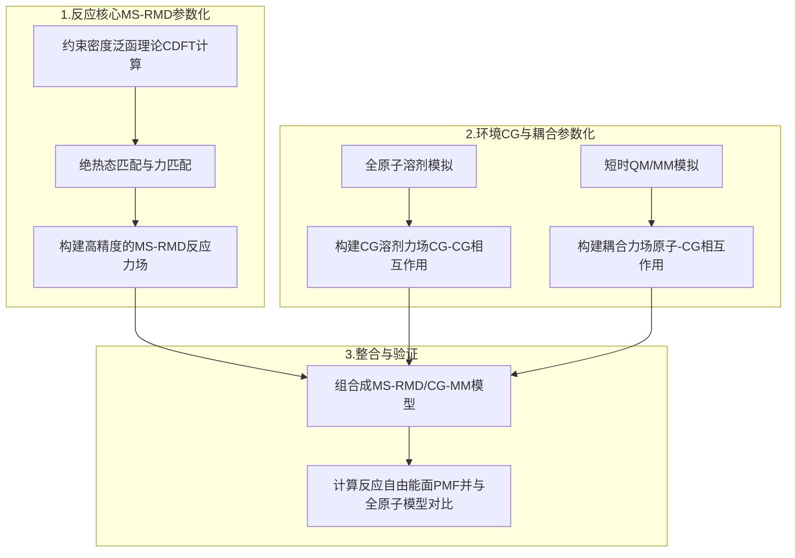

# 千倍加速化学反应模拟：当"量子级"反应力场遇见"极简风"粗粒化溶剂

## 本文信息

- **标题**: 将全原子反应分子动力学系统性地嵌入到粗粒化环境中
- **作者**: Kuntal Ghosh, Da Teng, and Gregory A. Voth
- **发表时间**: 2025年8月19日
- **单位**: 芝加哥大学化学系、芝加哥理论化学中心等（美国），马里兰大学物理科学与技术研究所（美国）
- **源代码**: [https://github.com/kuntalg97/MSRMD-CGMM](https://github.com/kuntalg97/MSRMD-CGMM)

-----

## 摘要

> 量子力学/分子力学（QM/MM）模拟被广泛用于研究复杂环境中的化学反应。在该方法中，反应中心通常用精确的量子化学计算处理，而周围的非反应环境则用经典的分子力学处理。然而，即便MM部分使用了经典力场，QM/MM模拟对于大型复杂系统而言计算成本依然极其高昂。本文中，我们提出了一种速度快得多的替代方法，称为**多尺度反应分子动力学/粗粒化分子力学（MS-RMD/CG-MM）**。MS-RMD本身是一种强大的全原子反应MD模型，它通过**约束密度泛函理论（constrained DFT）**计算系统地进行参数化，已被证明能有效模拟质子转移等反应。在这项工作中，我们将这个全原子反应模型嵌入到一个粗粒化（CG）环境中，其中CG力场是利用**多尺度粗粒化（MS-CG）**方法推导的。我们以有机$\ce{S_{N}2}$反应在粗粒化极性溶剂（丙酮）中的模拟为例，成功应用了该方案。

-----

## 背景

在计算化学领域，精确模拟溶液或生物环境中的化学反应是一项核心挑战。其根本困难在于反应过程中的电子重排和键的断裂/形成，必须用**量子力学（QM）**来描述。然而，QM计算的成本随电子数急剧增加，使得对包含溶剂、蛋白质等成千上万个原子的完整体系进行全QM模拟几乎是不可能的。为了解决这一矛盾，John Pople, Martin Karplus和Michael Levitt（2013年诺贝尔化学奖）等人开创了**量子力学/分子力学（QM/MM）**方法。它将体系划分为两部分：核心的反应区域用精确的QM处理，广阔的非反应环境则用计算成本低廉的经典分子力学（MM）力场描述。

尽管QM/MM是当前的黄金标准，但QM部分的计算仍然是其效率瓶颈，通常将模拟的时间尺度限制在皮秒到纳秒级别，无法触及许多重要的生物化学过程（如酶催化循环、蛋白质折叠等）所需的微秒甚至更长的时间尺度。为此，Arieh Warshel（同为2013年诺奖得主）等人开创了**经验价键（EVB）理论，其思想在Voth课题组中发展为多尺度反应分子动力学（MS-RMD）**。该方法用一个经QM数据预先校准的**反应力场**取代了耗时的实时QM计算。这使得模拟速度提升了几个数量级，但当MM环境本身规模巨大时，其计算量依然可观。

与此同时，**粗粒化（Coarse-Graining, CG）技术为加速MM模拟提供了另一条道路。它通过将多个原子“打包”成一个CG珠子，极大地减少了系统的自由度，从而大幅提升计算效率。一个自然且极具吸引力的想法是：能否将MS-RMD这一“反应加速器”与CG这一“环境加速器”结合，构建一种极限速度的反应模拟方法？即将一个全原子分辨率的反应核心**嵌入到一个**粗粒化分辨率的环境**中。这正是本研究致力于解决的前沿问题。

## 关键科学问题

本研究旨在解决的核心科学问题是：**我们能否构建一个系统性的、自下而上（bottom-up）的理论框架，将一个基于量子化学数据参数化的全原子反应力场（MS-RMD），无缝嵌入到一个计算高效的粗粒化（CG）环境中，并确保这种混合分辨率模型能够准确地再现化学反应的自由能景观（特别是反应能垒）？**

这个问题的核心难点在于处理“原子-粗粒”这两个不同分辨率世界之间的“接缝”。如何基于物理化学原理，精确地描述全原子反应区域与粗粒化环境珠子之间的相互作用，特别是长程静电作用，是该方法成败的关键。

## 创新点

- **提出了全新的MS-RMD/CG-MM混合分辨率方法**，首次将基于物理的、高精度的MS-RMD反应模型与MS-CG粗粒化环境系统地结合起来，为模拟复杂环境中的化学反应开辟了新途径。
- **构建了一套严谨的"自下而上"参数化流程**，通过约束DFT、力匹配、势能匹配等一系列理论方法，系统地解决了原子-粗粒混合分辨率下，特别是静电相互作用的耦合难题。
- **实现了精度与效率的统一**：在$\ce{S_{N}2}$反应测试体系中，该方法成功复现了全原子参考体系的自由能面，同时获得了相对于全原子反应模拟**近2倍**、相对于传统QM/MM模拟**超过1000倍**的巨大计算加速。
- **方法具有通用性**：本文提出的框架具有很好的通用性，原则上任何预先参数化好的MS-RMD模型都可以与一个预先参数化好的CG模型进行耦合，应用前景广阔。

---

## Q&A

**Q1: 为什么这个方法被称为"系统性嵌入"？它的"系统性"体现在哪里？**

**A1:** "系统性"是这个方法的精髓，体现在整个模型构建遵循严谨的多尺度理论框架，而非经验拼凑：

1.**理论一致性**：从量子力学→经典反应力场→粗粒化环境，每一层级的简化都基于明确的物理原理

2.**参数化的层次性**：

   - **反应核心**：MS-RMD参数通过拟合高精度CDFT计算得到，保证量子精度
   - **环境模型**：CG参数通过MS-CG力匹配从全原子模拟推导，保证热力学一致性
   - **耦合项**：原子-CG相互作用通过势能匹配确保静电/范德华效应的准确再现

3.**统计力学基础**：整个流程基于配分函数的多体展开和有效势理论，具有严格的数学基础

**Q2: 这个方法最大的挑战是什么？为什么静电作用特别难处理？**

**A2:** 最大挑战是处理**动态电荷分布**下的长程静电耦合：

1.**电荷转移的动态性**：$\ce{S_{N}2}$反应过程中，电子密度从进攻离子向离去离子转移，电荷分布持续变化

2.**CG模型的局限性**：为追求计算效率，CG珠子通常使用固定点电荷，难以响应反应物的电荷变化

3.**长程相互作用**：静电作用的$1/r$衰减特性使其具有长程性质，需要精确处理远程溶剂分子的贡献

4.**极化效应**：溶剂的介电响应需要通过有效电荷分布来模拟，这要求CG参数能捕捉复杂的多体极化

**解决方案**：通过"势能匹配"，优化CG珠子电荷分布，使其产生的静电势场最大程度逼近QM/MM参考。

**Q3: MS-RMD力场基于量子化学数据，CG力场基于全原子力场，两种不同来源的力场如何"无缝对接"？**

**A3:** 这个"无缝对接"的关键在于**全原子经典力场（AA-MM）作为统一的桥梁**：

1.**三层次参数化体系**：

   - **QM → MS-RMD**：用高精度量子化学数据校准反应力场
   - **AA-MM → CG-MM**：用全原子模拟数据校准粗粒化环境
   - **耦合项参数化**：利用QM/MM框架下的AA-MM数据校准原子-CG相互作用

2.**共同参考标准**：全原子力场扮演"共同语言"的角色，确保不同层级间的物理一致性

3.**热力学等价性**：通过配分函数匹配，保证各层级模型在统计平均意义下等价

**Q4: 该方法为何被称为"物理指导的机器学习"？**

**A4:** 这体现了现代计算化学中"白盒"与"黑盒"的平衡：

1.**物理约束的函数形式**：模型采用Morse势、高斯耦合、Lennard-Jones等具有明确物理意义的函数，而非任意神经网络

2.**量子化学数据驱动**：CDFT提供高保真的物理参考数据，确保模型学习到的是真实的物理规律

3.**优化算法的机器学习性质**：使用变分优化、最小二乘拟合等现代优化技术求解模型参数

4.**可解释性**：每个参数都有明确的物理意义，避免了纯数据驱动方法的"黑箱"问题

这种方法将物理洞察与计算效率完美结合，代表了理论化学发展的重要方向。

---

## 研究内容

### 核心理论与方法论：多尺度模型的构建之道

作者提出了一套分步、系统的流程来构建和验证MS-RMD/CG-MM模型。整个过程可以概括为对“反应核心”、“粗粒化环境”以及两者间的“耦合作用”分别进行参数化，最终组合成一个统一的模型。

**图1：MS-RMD/CG-MM方案的实施流程图：(a) CDFT计算，(b) 通过绝热态和力匹配将试验性MS-RMD力场与CDFT数据进行拟合，(c) 对溶剂进行多尺度粗粒化（MS-CG）参数化，(d) 增强采样模拟。**

#### 1\. 反应核心的“经典”描述：多尺度反应力场（MS-RMD）

MS-RMD是基于**经验价键（EVB）理论**发展而来的一种反应力场。其核心物理化学原理是，任何一个化学反应的真实基态势能面（即**绝热态势能面**），虽然本身很复杂，但可以近似看作是几个简单的、理想化的化学状态（**绝热态**）的线性组合。

**物理化学背景**：本研究主要探讨了两种典型的$\ce{S_{N}2}$反应：

1.**对称反应**：$\ce{Cl^- + CH_3Cl → ClCH_3 + Cl^-}$（进攻基团与离去基团相同）

2.**非对称反应**：$\ce{Br^- + CH_3Cl → BrCH_3 + Cl^-}$（进攻基团与离去基团不同）

从分子轨道理论角度，$\ce{S_{N}2}$反应的机理涉及：
- **亲核进攻**：电子富集的卤素阴离子沿C-X键轴的背面进攻甲基碳原子
- **过渡态**：形成一个三中心-四电子的五配位过渡态，此时C原子呈三角双锥构型
- **构型翻转**：发生Walden翻转，产物的立体构型与反应物相反
- **电荷转移**：反应过程中电子密度从进攻的阴离子转移到离去的阴离子

**热力学与动力学特征**：
- 反应活化能主要来自于过渡态中C-X键的部分断裂和形成
- 溶剂极化效应显著影响反应能垒，极性溶剂如丙酮能稳定离子型反应物和过渡态
- 离去基团的离去能力（$\ce{Br^- > Cl^-}$）决定了反应的热力学驱动力

例如，对于一个 A → B 的反应，绝热态就是纯粹的"反应物A"状态和纯粹的"产物B"状态。这两个绝热态的势能可以用经典的、非反应性的力场函数（如**Morse势**）来描述，计算速度非常快。

**Morse势的物理意义**：与简谐势$U(r) = \frac{1}{2}k(r-r_0)^2$不同，Morse势$U(r) = D_0(1 - e^{-\alpha(r-r_0)})^2$更真实地描述了化学键的行为：
- 当$r \to \infty$时，$U(r) \to D_0$（键离解能）
- 势能曲线的不对称性更好地反映了键的拉伸和压缩特性
- 参数$\alpha$控制势井的宽度，与键的刚性相关

MS-RMD通过构建一个反应哈密顿量矩阵来耦合这些绝热态：
$$H^{\text{RMD}} = \begin{pmatrix} h_{11} & h_{12} \\ h_{21} & h_{22} \end{pmatrix}$$

#### 公式的通俗解释

这是一个2x2的矩阵，描述了一个双态反应体系。

  * **对角项 $h_{11}$ 和 $h_{22}$**：分别代表纯反应物态和纯产物态的势能面。它们是用经过修改的经典力场函数计算的，例如用**Morse势** $U(r) = D_0(1 - e^{-\alpha(r-r_0)})^2$ 来描述即将断裂或形成的化学键，这比传统的简谐势更真实。
  * **非对角项 $h_{12}$**：这是耦合项，描述了两个绝热态之间相互“转化”的可能性。它的大小决定了反应能垒的高度。本文中采用了一个高斯函数形式 $V_{12} = V_0 e^{-\gamma |q|^2}$ 来描述。

通过求解该矩阵的最低本征值 $E(R)$，就可以在任意原子构型 $R$ 下得到体系的基态能量。随后，根据**Hellmann-Feynman定理**，通过对能量求导 $F(R) = -\nabla E(R)$，即可获得原子受力，用于分子动力学模拟。

#### 2\. 参数化的“量子教师”：约束密度泛函理论（CDFT）

MS-RMD模型的准确性完全取决于其参数（如Morse势参数、$h_{12}$参数等）是否能精确反映真实的量子化学行为。因此，需要一个高精度的"量子教师"来指导参数化。本文采用**约束密度泛函理论（CDFT）**作为这位教师。

**CDFT的基本原理**：与常规DFT最小化体系总能量不同，CDFT在求解电子结构时额外施加了一个**电荷约束条件**：

$$
E[\rho] = E_{DFT}[\rho] + \lambda(N_{constraint} - N_{target})
$$

其中$N_{constraint}$是某个分子片段上的实际电荷，$N_{target}$是我们希望强制的目标电荷值，$\lambda$是拉格朗日乘子。

**CDFT在$\ce{S_{N}2}$反应中的应用原理**：

CDFT通过电荷约束可以人为地创造出"纯粹"的绝热态，这对于理解反应机理具有重要意义：

- **反应物态（$\psi_1$）**：强制电子完全定域在进攻的卤素阴离子上（如$\ce{Cl^-}$），此时目标分子的C-X键完全形成，系统表现为离散的反应物状态
- **产物态（$\psi_2$）**：强制电子完全定域在离去的卤素阴离子上（如$\ce{Br^-}$），此时新的C-Y键完全形成，系统表现为离散的产物状态
- **过渡态分析**：在相同几何构型下，通过不同的电荷约束，**可以分别计算这两种极限电子分布下的能量**

**CDFT的理论优势**：
1.**避免电子密度模糊性**：传统DFT在过渡态附近往往产生电荷分布不明确的"杂化"电子态，CDFT通过约束条件强制获得物理意义清晰的纯态

2.**提供准确的绝热态参数**：为经典反应力场提供了高精度的、物理意义明确的量子化学参考数据

3.**分离电子与核运动**：符合Born-Oppenheimer近似的基本思想，为多态系统提供清晰的能量本征态

#### 3\. 环境的“极简”艺术：多尺度粗粒化（MS-CG）

为了加速环境部分的模拟，本文采用了Voth课题组发展的**多尺度粗粒化（MS-CG）方法，也称为力匹配（Force-Matching）**。

**MS-CG的理论基础**：其核心物理化学原理根植于统计力学的多体问题。一个理想的CG模型应该能够再现全原子系统的**配分函数**和**平均力**。

**实际溶剂体系：丙酮的粗粒化**：
丙酮分子（$\ce{CH_3COCH_3}$）被映射为三个CG珠子：
1.**氧珠子（O）**：代表羰基氧原子，承载分子的极性特征

2.**两个甲基珠子（CG）**：每个包含一个甲基和半个羰基碳原子

**力匹配的物理意义**：
- **力的投影**：将全原子轨迹中每个原子受到的瞬时力按照映射关系投影到CG珠子上
- **有效势构建**：通过变分优化，拟合样条函数形式的CG-CG相互作用势
- **热力学一致性**：确保CG模型能正确再现径向分布函数、结构因子等关键热力学性质

**统计力学原理**：根据多体PMF理论，CG有效势为：

$$
U_{CG}(\mathbf{R}) = -k_B T \ln \rho_{CG}(\mathbf{R})
$$

其中$\rho_{CG}(\mathbf{R})$是CG构型的平衡概率分布。

#### 4\. 跨越能垒的“登山杖”：增强采样

化学反应通常需要跨越一个很高的能垒（过渡态），在常规MD模拟中是极小概率事件，难以充分采样。为了解决这个问题，本文采用**伞形采样（Umbrella Sampling）**这一增强采样技术。

**反应坐标的选择**：对于$\ce{S_{N}2}$反应，选择了一个简洁而物理意义明确的反应坐标：

$$
\xi = |r_{C-A}| - |r_{C-B}|
$$

其中$r_{C-A}$是碳原子到进攻基团的距离，$r_{C-B}$是碳原子到离去基团的距离。这个坐标能够很好地描述从反应物（$\xi < 0$）经过过渡态（$\xi \approx 0$）到产物（$\xi > 0$）的完整反应路径。

**伞形采样的物理原理**：
- **偏置势施加**：在反应坐标的不同位置施加谐振子形式的偏置势：$V_{bias}(\xi) = \frac{1}{2}k(\xi - \xi_0)^2$
- **局部采样增强**：每个偏置势就像一个"能量雨伞"，将体系约束在反应路径的小窗口内
- **过渡态采样**：即使是高能垒的过渡态区域也能被充分探索

**WHAM重构自由能面**：采样完成后，通过加权直方图分析方法（WHAM）将带偏置的采样结果重新组合：

$$
PMF(\xi) = -k_B T \ln P_{unbiased}(\xi)
$$

最终重建出完整、无偏的**平均力势（Potential of Mean Force, PMF）**，即反应的自由能曲线。

### 结果与分析

#### 1\. 从量子化学到反应力场：CDFT指导的参数化

**图2：对称$\ce{S_{N}2}$反应：(A) 来自CDFT计算的绝热态系数。(B) 沿反应坐标的CDFT基态能量（哈密顿量的最低本征值）。**

**图3：非对称$\ce{S_{N}2}$反应：(A) 来自CDFT计算的绝热态系数。(B) 沿反应坐标的CDFT基态能量。**

CDFT计算清晰地描绘了从反应物到产物的过程中，体系如何从一个绝热态（如系数$c_1 \approx 1, c_2 \approx 0$）平滑地过渡到另一个绝热态（$c_1 \approx 0, c_2 \approx 1$），并给出了相应的气相能量变化。这些高精度的量子化学数据是后续参数化的“金标准”。随后，通过本文提出的绝热态匹配和力匹配方法，研究人员成功拟合出了能够精确复现CDFT数据的MS-RMD力场参数（见下表）。

**表1：对称$\ce{S_{N}2}$反应的MS-RMD参数**
| 参数 | 值 |
| :--- | :--- |
| $V_{11}$ | 0.0 |
| $\gamma$ | $7.93 \times 10^{-6}$ |
| $D_0$ (C-Cl, 非键) | 2.62 kcal/mol |
| $\alpha$ (C-Cl, 非键) | 0.00049 Å⁻¹ |
| $r_0$ (C-Cl, 非键) | 1.77 Å |
| $D_0$ (C-Cl, 键合) | 103.04 kcal/mol |
| $\alpha$ (C-Cl, 键合) | 1.60 Å⁻¹ |
| $r_0$ (C-Cl, 键合) | 1.79 Å |
| $r_{cut}$ (Morse, 全局) | 2.36 Å |

**表2：非对称$\ce{S_{N}2}$反应的MS-RMD参数**

| 参数 | 值 |
| :--- | :--- |
| $V_{11}$ | 8.5 kcal/mol |
| $\gamma$ | 0.0063 |
| $D_0$ (C-Br, 非键) | 12.90 kcal/mol |
| $\alpha$ (C-Br, 非键) | 0.0013 Å⁻¹ |
| $r_0$ (C-Br, 非键) | 0.0035 Å |
| $D_0$ (C-Br, 键合) | 106.12 kcal/mol |
| $\alpha$ (C-Br, 键合) | 1.49 Å⁻¹ |
| $r_0$ (C-Br, 键合) | 1.94 Å |
| $r_{cut}$ (Morse, 全局) | 4.73 Å |

**表3：三位点CG丙酮模型的电荷和LJ参数**

| 参数 | O (羰基氧) | CG (甲基+半个羰基碳) |
| :--- | :--- | :--- |
| charge | -0.38250 e | 0.19125 e |
| $\sigma$ | 2.96 Å | 3.542 Å |
| $\epsilon$ | 0.21 kcal/mol | 0.414 kcal/mol |

#### 2\. 核心成果：混合分辨率模型对反应自由能面的精准复现

参数化完成后，研究人员进行了最终的验证：计算SN2反应的平均力势（PMF），这直接反映了溶剂环境中反应的真实自由能变化，其能垒高度决定了反应速率。

**图4：(A) 对称$\ce{S_{N}2}$反应和(B) 非对称$\ce{S_{N}2}$反应的MS-RMD/AA-MM和MS-RMD/CG-MM PMF曲线。所有情况均使用丙酮作为溶剂。**

如图4所示，结果非常理想：

  * **高度一致**：对于对称和非对称两种$\ce{S_{N}2}$反应，**MS-RMD/CG-MM模型（红线）计算得到的PMF曲线与更昂贵的全原子参考模型MS-RMD/AA-MM（蓝线）的结果都惊人地吻合**。
  * **精准预测能垒**：两个模型不仅准确地预测了反应物、产物和过渡态的相对自由能，尤其重要的是，它们对决定反应速率的**活化自由能（PMF曲线的峰值）的预测也几乎完全一致**。例如，在对称反应中，CG模型的能垒仅比全原子模型低约0.8 kcal/mol，而在非对称反应中，两者几乎完全匹配。
  * **物理图像正确**：模型正确地捕捉到了$\ce{S_{N}2}$反应的核心特征，如过渡态的能量最高点，以及非对称反应中由于$\ce{Br-}$和$\ce{Cl-}$离去基团能力不同导致的能量不对称性。

这些结果充分证明，本文提出的系统性参数化方案是成功的，它构建的CG模型和耦合项能够精确地再现全原子环境对化学反应的热力学影响。

#### 3\. 性能优势：计算效率的量化评估

在保证精度的前提下，新方法的速度有多快？

**图5：(A) 对称$\ce{S_{N}2}$反应和(B) 非对称$\ce{S_{N}2}$反应中，MS-RMD/AA-MM和MS-RMD/CG-MM PMF的统计收敛性。**

**图6：MS-RMD/AA-MM和MS-RMD/CG-MM的计算扩展性能，通过模拟时间随CPU核心数的变化来评估。**

**表4：MS-RMD/CG-MM相对于MS-RMD/AA-MM和QM/MM的加速比**

| 方法 | 每纳秒模拟所需壁钟时间(分钟) | 加速比 |
| :--- | :--- | :--- |
| QM/MM | 63000 | 1 |
| MS-RMD/AA-MM | 103 | 614 |
| **MS-RMD/CG-MM** | **61** | **1040** |

性能评估结果令人振奋：

  * **收敛速度翻倍**：如图5所示，要达到相似的PMF收敛精度（RMSD \< 0.3 kcal/mol），**MS-RMD/CG-MM模型（约35分钟）所需的时间几乎是全原子模型（约65分钟）的一半**。
  * **千倍于QM/MM**：如表4所示，与传统的QM/MM方法相比，MS-RMD/CG-MM的速度**快了超过1000倍**，而比其全原子版本MS-RMD/AA-MM也快了将近**2倍**。这一巨大的性能提升使得模拟更长时间尺度、更大体系的化学反应成为可能。

---

## 关键结论与批判性总结

### 核心结论

1.**方法学突破**：成功开发了MS-RMD/CG-MM混合分辨率方法，首次实现了基于量子化学数据的全原子反应力场与统计力学导出的粗粒化环境的系统性结合。

2.**理论框架完善**：建立了从约束DFT→反应力场→粗粒化环境的完整参数化流程，解决了跨分辨率模拟中的静电耦合难题。

3.**精度验证成功**：在$\ce{S_{N}2}$反应体系中，该方法精确再现了全原子模型的反应自由能面，包括关键的活化能垒和反应路径。

4.**效率显著提升**：相对于全原子反应模拟提速2倍，相对于QM/MM模拟提速超过1000倍，为长时间尺度反应动力学研究开辟了新途径。

### 科学意义与潜在应用

**理论意义**：
- 建立了多尺度反应模拟的系统性理论框架
- 为混合分辨率方法的发展提供了重要范例
- 推进了"物理指导的机器学习"在分子模拟中的应用

**应用前景**：
- **酶催化研究**：可模拟酶活性位点的量子效应与蛋白质环境的长程作用
- **界面反应**：适用于电池、催化剂表面等复杂界面的反应过程
- **材料科学**：可研究聚合反应、交联过程等涉及化学键变化的材料形成机制

### 方法局限性

1.**函数形式约束**：MS-RMD仍依赖预定义的物理函数（Morse势等），限制了对复杂反应机理的描述能力

2.**动力学性质**：MS-CG方法主要保证热力学一致性，可能无法精确再现动力学性质如扩散系数

3.**体系复杂度**：目前仅在相对简单的小分子反应中得到验证，向生物大分子系统的扩展仍需探索

4.**溶剂局限性**：测试主要在丙酮等简单溶剂中进行，水等复杂溶剂的多体效应处理仍是挑战

### 未来发展方向

1.**方法学改进**：
   - 整合神经网络等更灵活的机器学习模型
   - 发展多时间步算法以进一步提升效率
   - 建立自适应参数化策略以提高通用性

2.**应用拓展**：
   - 扩展至水溶液等复杂溶剂体系
   - 应用于蛋白质-药物相互作用研究
   - 探索在固液界面反应中的应用

3.**理论深化**：
   - 发展更精确的多体效应处理方法
   - 建立动力学性质的系统性修正理论
   - 探索量子效应在粗粒化层次的处理方案

这项工作为理论化学和计算生物学的发展提供了重要的方法学基础，标志着多尺度模拟技术向实用化迈出的关键一步。