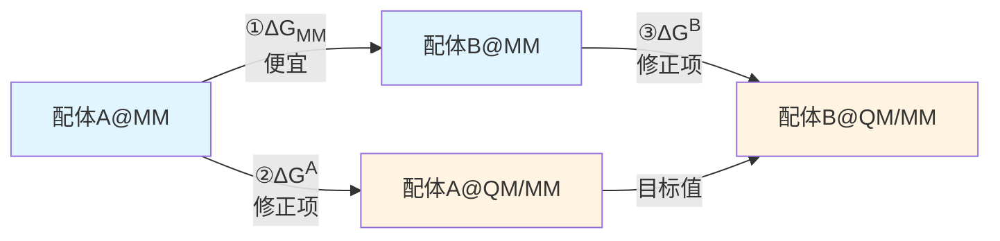
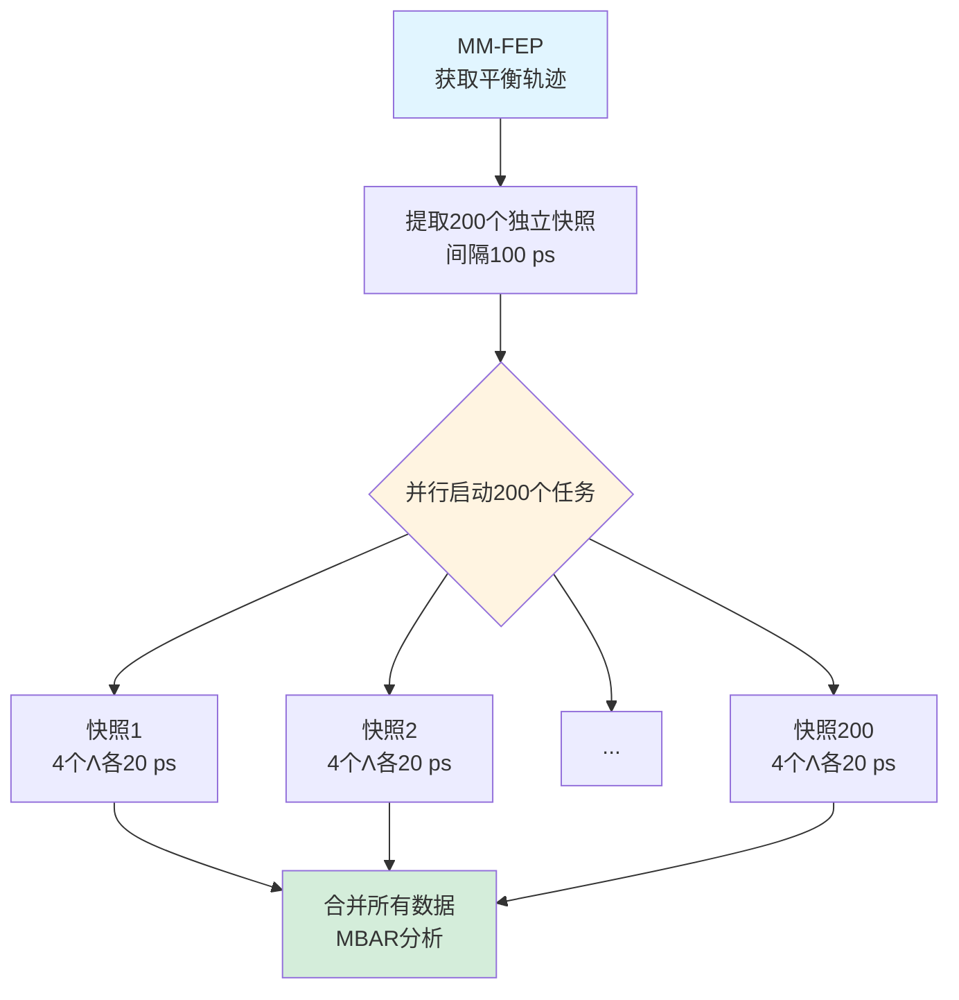
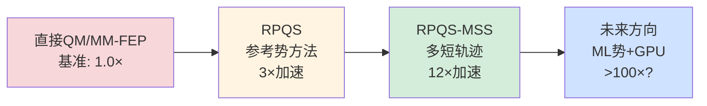
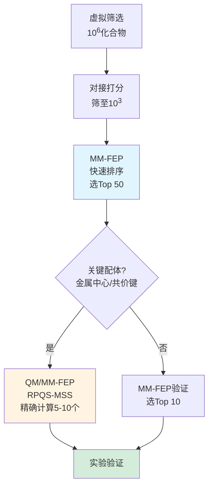

# 从3倍到12倍加速：QM/MM自由能计算的方法学突破之路

## 引言：量子精度与计算成本的博弈

配体结合自由能是药物设计的核心物理量，但**精确计算极具挑战性**。分子力场（MM）虽快，但对金属中心、共价键、电荷转移等复杂化学环境描述不准；量子力学（QM）虽准，但计算成本是MM的千倍以上，难以用于自由能微扰（FEP）所需的长时间采样。

**如何在保证QM精度的同时，将计算成本降至可接受范围？**

瑞典隆德大学Ulf Ryde课题组在2017-2018年间发表的四篇系列工作，系统性地解决了这一难题：

1. **Olsson & Ryde (2017)**：建立参考势方法，将成本降至直接QM/MM-FEP的**1/3**
2. **Caldararu et al. (2018)**：SAMPL6盲测验证，**首次战胜传统MM力场**
3. **Steinmann et al. (2018)**：多轨迹短时模拟优化，再次实现**4倍加速**
4. **Wang et al. (2018)**：非平衡方法探索，发现**平衡方法更优**

**最终成果**：总加速比约**12倍**（相对直接QM/MM-FEP），精度达到**MAD 2-3 kJ/mol**（接近实验误差），为计算辅助药物设计提供了新工具。

---

## 核心文献列表

1. **Olsson, M. A., & Ryde, U. (2017).** Comparison of QM/MM Methods to Obtain Ligand-Binding Free Energies. *J. Chem. Theory Comput.*, 13(5), 2245-2253. https://doi.org/10.1021/acs.jctc.6b01217

2. **Caldararu, O., Olsson, M. A., Riplinger, C., Neese, F., & Ryde, U. (2018).** Binding Free Energies in the SAMPL6 Octa-Acid Host–Guest Challenge Calculated with MM and QM Methods. *J. Comput.-Aided Mol. Des.*, 32(10), 1027-1046. https://doi.org/10.1007/s10822-018-0158-2

3. **Steinmann, C., Olsson, M. A., & Ryde, U. (2018).** Relative Ligand-Binding Free Energies Calculated from Multiple Short QM/MM MD Simulations. *J. Chem. Theory Comput.*, 14(7), 3228-3237. https://doi.org/10.1021/acs.jctc.8b00081

4. **Wang, J., Miao, Y., & Ryde, U. (2018).** Predicting Relative Binding Affinity Using Nonequilibrium QM/MM Simulations. *J. Phys. Chem. B*, 122(44), 9695-9702. https://doi.org/10.1021/acs.jpcb.8b07814

---

## 故事线：从理论到实践的四步曲

### 第一步：建立方法（Olsson & Ryde 2017）

#### 核心问题

传统的直接QM/MM-FEP需要在QM/MM哈密顿量下运行数纳秒的分子动力学模拟，**即使使用半经验方法（PM6-DH+），计算成本仍是MM的1000倍**。能否找到更高效的策略？

#### 创新方案：参考势方法（Reference-Potential Approach）

**热力学循环的巧妙设计**：

**关键思想**：

$$
\Delta\Delta G_{\mathrm{QM/MM}} = \Delta G_{\mathrm{MM}} + \Delta G^B - \Delta G^A
$$

- **①号路径**：标准MM-FEP，已有成熟工具，计算快
- **②③号路径**：MM→QM/MM的垂直能量修正，仅需在MM快照上计算QM/MM单点能

**效率提升的秘密**：
- **无需运行完整QM/MM MD**：从MM轨迹提取快照，计算QM/MM能量即可
- **使用中间态Λ平滑过渡**：4个Λ值（0, 0.25, 0.75, 1）足够收敛
- **2个Λ不够**：会导致系统性误差（MAD从3.1升至5.2 kJ/mol）

#### 主要结果

**测试体系**：八酸-配体主客体系统（SAMPL4），9种环状羧酸

| 方法 | MAD (kJ/mol) | R² | 相对计算成本 | λ/Λ值数量 |
|------|--------------|-----|--------------|----------|
| 直接QM/MM-FEP | 3.1 | 0.93 | 1.0 | 18 |
| 参考势（4 Λ） | 3.1 | 0.93 | **0.33** | 4 |

**核心结论**：**参考势方法使用4个Λ值时，精度与直接法相当，但成本仅为1/3**。

---

### 第二步：盲测验证（Caldararu et al. 2018）

#### 核心问题

方法在SAMPL4上表现良好，但**能否在盲测环境下（实验值未知）保持预测能力**？QM/MM-FEP相比传统MM-FEP有多大优势？

#### 测试场景：SAMPL6挑战赛

**两种主体**：
- **OAH**（八酸原型）：8个羧酸，带-8电荷
- **OAM**（甲基化八酸）：4个羧酸+4个甲酯，带-4电荷

**五种方法对决**：
1. MM-FEP（GAFF力场）
2. QM/MM-FEP（PM6-DH+，参考势方法）
3. SQM/COSMO-RS（半经验+溶剂化模型）
4. DFT/COSMO-RS（TPSS-D3+溶剂化）
5. DFT直接法（无溶剂化）

#### 主要结果

**OAH体系（关键战场）**：

| 方法 | MAD (kJ/mol) | R² | SAMPL6排名 |
|------|--------------|-----|----------|
| **QM/MM-FEP** | **2.4** | **0.93** | **第1名** |
| SQM/COSMO-RS | 3.0 | 0.85 | 前5名 |
| MM-FEP | 6.9 | 0.46 | 中下游 |
| DFT/COSMO-RS | 7.8 | 0.52 | 中下游 |

**图：各方法的计算值 vs 实验值散点图（略）**

**关键发现**：

1. **QM/MM-FEP首次战胜MM-FEP**：MAD从6.9降至2.4 kJ/mol，改善65%
2. **芳香卤代配体受益最大**：如3-氯苯甲酸，MM误差+10 kJ/mol → QM/MM误差-0.5 kJ/mol
3. **原因**：GAFF严重低估芳香-芳香的π-π堆积能（色散不足~10 kJ/mol）
4. **DFT意外失败**：TPSS-D3反而不如半经验PM6-DH+，可能因COSMO-RS参数不匹配

**OAM体系（更具挑战）**：

所有方法精度下降1.5-5 kJ/mol，QM/MM-FEP仍最优（MAD = 5.2 kJ/mol），可能因甲酯化增加构象自由度。

#### 核心结论

**在盲测环境下，QM/MM-FEP表现最优，证明了方法的实际预测能力，而非后拟合**。

---

### 第三步：效率优化（Steinmann et al. 2018）

#### 核心问题

虽然参考势方法比直接QM/MM-FEP快3倍，但**QM/MM单点能计算仍是主要瓶颈**。能否进一步加速？

#### 创新方案：RPQS-MSS（多条短轨迹）

**传统RPQS**：运行4条长QM/MM MD（每条800 ps，共3.2 ns）

**RPQS-MSS**：运行200条短QM/MM MD（每条20 ps，共4 ns等效）

**关键洞察**：
- MM轨迹已充分采样构象空间
- QM/MM修正仅需"局部平衡"，无需全局采样
- 多条短轨迹**高度并行化**，墙时间短

**流程对比**：

#### 主要结果

**收敛时间因配体而异**：

| 配体类型 | 收敛时间 | 原因 |
|---------|---------|------|
| 脂肪配体（chp, hep） | **1-5 ps** | 范德华快速平衡 |
| 芳香配体（bz, meBz） | **5-15 ps** | π-π堆积需5 ps平衡期 |
| 问题配体（mClBz） | **~50 ps** | Cl位置优化需跨越能量势垒 |

**效率对比**：

| 方法 | QM/MM总时间 | 墙时间（200核） | 相对RPQS |
|------|------------|----------------|---------|
| RPQS | 3.2 ns | ~400 h | 1.0× |
| RPQS-MSS | 4 ns等效 | **~2 h** | **4.0×** |

**精度验证**：相对RPQS的MAD仅0.3 kJ/mol，在统计误差范围内等价。

#### 核心结论

**RPQS-MSS将计算成本再降至1/4，总加速比达12倍（相对直接QM/MM-FEP）**。

---

### 第四步：方法探索（Wang et al. 2018）

#### 核心问题

非平衡方法（Jarzynski等式）理论上能从快速切换中提取平衡自由能，**是否能进一步加速**？

#### 方法：RPQS-NE（非平衡切换）

**Jarzynski等式**：

$$
\Delta G = -k_B T \ln \left\langle \exp\left(-\frac{W}{k_B T}\right) \right\rangle
$$

- **快速切换**：Λ: 0→1，20 ps线性变化
- **记录功**：$W = \int (\partial H_\Lambda / \partial \Lambda) \, \mathrm{d}\Lambda$
- **指数平均**：多次独立切换的功分布

#### 主要结果

**令人意外的发现**：

| 配体 | RPQS-MSS所需样本 | RPQS-NE所需样本 | 效率对比 |
|------|-----------------|----------------|---------|
| chp（简单） | 200快照×20 ps | 36轨迹×20 ps | **NE快2.8倍** |
| bz（中等） | 200×20 ps | 100×20 ps | 相当 |
| mClBz（复杂） | 200×20 ps | 324×20 ps | **NE慢3.2倍** |

**问题根源：功分布长尾**

- 芳香卤代配体的功分布偏度>2.5
- 少数"幸运"低功轨迹主导Jarzynski平均（权重>90%）
- 需大量采样才能捕获这些稀有事件

**精度验证**：相对RPQS的MAD = 0.4 kJ/mol，精度等价，但**平均效率慢1.5倍**。

#### 核心结论

**对于QM/MM-FEP（小能量扰动），平衡方法（RPQS-MSS）优于非平衡方法（RPQS-NE）**。非平衡方法更适合大能量差体系（如蛋白质折叠）。

---

## 方法学价值总结

### 精度表现

**相对实验值的统计指标**（SAMPL6 OAH体系）：

| 指标 | QM/MM-FEP | MM-FEP |
|------|-----------|--------|
| MAD | 2.4 kJ/mol | 6.9 kJ/mol |
| R² | 0.93 | 0.46 |
| Kendall τ | 0.86 | 0.50 |

**达到化学精度**（~1 kcal/mol = 4.2 kJ/mol），接近实验误差。

### 效率提升

**方法演化路径**：

**墙时间对比**（200核集群）：

| 方法 | 每配体对墙时间 | 适用场景 |
|------|---------------|---------|
| 直接QM/MM-FEP | ~25天 | ❌ 不实用 |
| RPQS | ~17天 | △ 少量配体 |
| RPQS-MSS | **~2天** | ✅ 先导优化（10-50个） |
| MM-FEP | ~1天 | ✅ 大规模筛选（100+） |

### 适用范围

**推荐使用QM/MM-FEP的场景**：

✅ **金属蛋白**：锌指蛋白、血红素蛋白
✅ **共价抑制剂**：共价键形成
✅ **芳香相互作用主导**：π-π堆积、卤键
✅ **MM力场系统性失败**：如SAMPL6的OAH体系

⚠️ **谨慎使用的场景**：

- 大配体（>30原子）：QM区增大，成本上升
- 构象高度柔性：需延长QM/MM采样时间
- 简单疏水相互作用：MM-FEP已足够

---

## 技术路线图

### 推荐工作流程

**混合策略**（平衡精度与成本）：

### 关键参数推荐

**RPQS-MSS最佳实践**：

| 参数 | 推荐值 | 备注 |
|------|--------|------|
| Λ值数量 | 4 | 0, 0.25, 0.75, 1 |
| MM快照数 | 200 | 间隔100 ps |
| 每快照QM/MM长度 | 20 ps | 包括5 ps平衡 |
| QM方法 | PM6-DH+ | 性价比最优 |
| QM区 | 配体 | ~15-30原子 |
| 自由能估计器 | MBAR/BAR | 比EXP稳健 |

---

## 化学洞察

### QM修正的物理意义

**芳香卤代配体为何需要QM？**

以3-氯苯甲酸（mClBz）为例：

| 相互作用 | MM能量 (kJ/mol) | QM/MM能量 (kJ/mol) | 差异 |
|---------|----------------|-------------------|------|
| π-π堆积 | -62.4 | -72.8 | **-10.4** |
| Cl静电 | -85.3 | -87.1 | -1.8 |
| **总修正** | - | - | **-12.2** |

**原因**：
- **GAFF色散参数不足**：低估芳香-芳香吸引~10 kJ/mol
- **AM1-BCC对Cl电荷偏低**：Cl从-0.08校正至-0.15

**结果**：MM-FEP预测结合过弱，QM/MM修正后与实验吻合。

### DFT为何不如PM6？

**TPSS-D3/COSMO-RS的失败教训**：

- **几何过优化**：DFT优化的氢键比PM6短0.1 Å，导致COSMO表面积偏小
- **溶剂化能过负**：COSMO-RS参数训练于BP86，不匹配TPSS
- **系统性偏差**：所有配体ΔG高估~10 kJ/mol

**教训**：**高级QM方法不保证更好预测，参数一致性和充分采样同样重要**。

---

## 未来展望

### 技术改进方向

1. **机器学习加速**：用神经网络势（如ANI-2x）替代PM6 → 再加速10-100倍
2. **自适应QM区**：根据配体-蛋白接触面动态调整QM区大小
3. **增强采样集成**：对慢自由度用metadynamics预生成起始构象
4. **GPU移植**：QM/MM计算移至GPU → 单核加速10倍

### 应用扩展

- **蛋白-配体**：扩展到药物设计相关靶点（如激酶、GPCR）
- **绝对结合自由能**：计算ΔG而非ΔΔG，需额外约束势和标准态校正
- **其他主客体**：柱芳烃、葫芦脲、环糊精

### 开放问题

- OAM体系精度下降的根本原因？
- 如何自动识别"慢配体"（如mClBz）？
- 电子嵌入 vs 机械嵌入的系统性对比？

---

## 总结

Ryde课题组的系列工作展示了**如何通过巧妙的方法学设计，将QM精度引入自由能计算而不付出过高代价**：

1. **参考势方法**：热力学循环分离QM/MM修正 → 3倍加速
2. **SAMPL6验证**：盲测首次战胜MM-FEP → 证明实用价值
3. **RPQS-MSS优化**：多条短轨迹并行 → 再4倍加速，总计12倍
4. **RPQS-NE探索**：非平衡方法不适合小扰动 → 明确方法边界

**最终成果**：在**可承受的计算成本**（~2天/配体对）下，实现**化学精度**（MAD ~2 kJ/mol），为计算辅助药物设计提供了可靠工具。

**核心理念**：不是用更强大的计算机暴力求解，而是**用更聪明的算法减少不必要的计算**。

---

## 参考文献

### 核心论文

1. Olsson, M. A., & Ryde, U. (2017). *J. Chem. Theory Comput.*, 13(5), 2245-2253.
2. Caldararu, O., et al. (2018). *J. Comput.-Aided Mol. Des.*, 32(10), 1027-1046.
3. Steinmann, C., et al. (2018). *J. Chem. Theory Comput.*, 14(7), 3228-3237.
4. Wang, J., et al. (2018). *J. Phys. Chem. B*, 122(44), 9695-9702.

### 方法学基础

- Heimdal, J., & Ryde, U. (2012). *Phys. Chem. Chem. Phys.*, 14, 12592-12604. (RPQS原理)
- Shirts, M. R., & Chodera, J. D. (2008). *J. Chem. Phys.*, 129, 124105. (MBAR)
- Jarzynski, C. (1997). *Phys. Rev. Lett.*, 78, 2690. (非平衡等式)

### SAMPL挑战赛

- SAMPL官网：https://samplchallenges.github.io/
- Muddana, H. S., et al. (2018). *J. Comput.-Aided Mol. Des.*, 32, 937-963. (SAMPL6综述)
