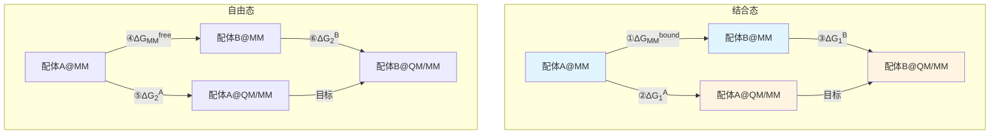
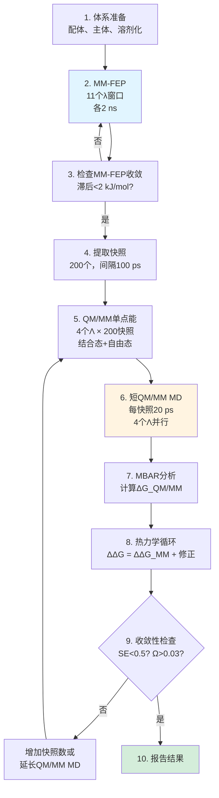

# QM/MM自由能微扰深度技术解析：从热力学循环到收敛性标准

## 引言

本文深入剖析Ryde课题组QM/MM-FEP方法的**技术原理和模拟细节**，为实际应用提供完整的技术指导。内容涵盖：

- **热力学循环**：如何巧妙地将QM修正从FEP中分离
- **中间态理论**：为什么4个Λ值是最优选择
- **收敛性标准**：如何判断计算是否可信
- **并行化策略**：如何最大化计算资源利用率
- **实践建议**：从体系准备到结果分析的完整流程

---

## 一、理论基础：参考势方法的热力学循环

### 1.1 为什么需要参考势方法？

**直接QM/MM-FEP的困境**：

$$
\Delta G_{A \to B}^{\mathrm{QM/MM}} = \int_0^1 \left\langle \frac{\partial H_\lambda}{\partial \lambda} \right\rangle_\lambda \mathrm{d}\lambda
$$

其中 $H_\lambda = (1-\lambda)H_A^{\mathrm{QM/MM}} + \lambda H_B^{\mathrm{QM/MM}}$

**问题**：
- 需要在每个λ窗口运行QM/MM MD（通常18个窗口）
- QM/MM和纯MM的势能面差异大，相空间重叠不足
- 即使用半经验方法，成本也极其高昂

### 1.2 参考势方法的核心思想

**热力学循环构建**：



**热力学等式**：

$$
\Delta\Delta G_{\mathrm{QM/MM}} = (\Delta G_{\mathrm{MM}}^{\mathrm{bound}} - \Delta G_{\mathrm{MM}}^{\mathrm{free}}) + (\Delta G_1^B - \Delta G_1^A) - (\Delta G_2^B - \Delta G_2^A)
$$

简化为：

$$
\Delta\Delta G_{\mathrm{QM/MM}} = \Delta\Delta G_{\mathrm{MM}} + \Delta\Delta G_1 - \Delta\Delta G_2
$$

**优势**：
- **①和④**：标准MM-FEP，已有成熟工具（如GROMACS、AMBER）
- **②③⑤⑥**：仅需计算MM→QM/MM的垂直能量修正

### 1.3 垂直能量修正：RPQS方法

**目标**：计算$\Delta G_1^A$（配体A结合态的MM→QM/MM修正）

**指数平均公式**：

$$
\Delta G_1^A = -k_B T \ln \left\langle \exp\left(-\frac{E_{\mathrm{QM/MM}} - E_{\mathrm{MM}}}{k_B T}\right) \right\rangle_{\mathrm{MM}}
$$

**关键特点**：
- 平均在**MM轨迹**上进行
- 仅需在MM快照上计算QM/MM单点能
- 无需运行完整QM/MM MD

**实践问题**：直接使用指数平均（EXP）会严重偏差，需引入中间态。

---

## 二、中间态理论：Λ坐标的设计

### 2.1 为什么需要中间态？

**指数平均的问题**：

$$
\langle \exp(-\Delta E / k_B T) \rangle \gg \exp(-\langle \Delta E \rangle / k_B T)
$$

当$\Delta E$分布较宽时，**少数高能构象会被过度加权**，导致：
- 收敛极慢（需10⁴+样本）
- 对长尾敏感
- 有限样本系统性高估$\Delta G$

**解决方案**：引入中间态，将大跃变分解为小步骤。

### 2.2 中间态哈密顿量

定义混合势能：

$$
E_\Lambda = (1-\Lambda) E_{\mathrm{MM}} + \Lambda E_{\mathrm{QM/MM}}
$$

其中$\Lambda \in [0, 1]$：
- $\Lambda = 0$：纯MM
- $\Lambda = 1$：纯QM/MM
- $0 < \Lambda < 1$：线性插值

**自由能路径积分**：

$$
\Delta G_1^A = \sum_{i=0}^{N_\Lambda - 1} \Delta G_{\Lambda_i \to \Lambda_{i+1}}
$$

每个小步用更稳健的估计器（如BAR或MBAR）。

### 2.3 Λ值选择的定量分析

**测试方案**（Olsson & Ryde 2017）：

| 设置 | Λ值 | 估计器 | MAD (kJ/mol) | 相对成本 |
|------|-----|--------|-------------|---------|
| EXP-2 | 0, 1 | EXP | 5.2 | 0.11 |
| BAR-4 | 0, 0.25, 0.75, 1 | BAR | **3.1** | 0.14 |
| MBAR-11 | 0, 0.1, ..., 1 | MBAR | 3.0 | 0.22 |

**关键发现**：
- **2 Λ系统性低估亲和力**：误差+2 kJ/mol
- **4 Λ已收敛**：与11 Λ精度相当
- **边际收益递减**：从4到11 Λ仅改善0.1 kJ/mol

**物理解释**：

**图：能量分布的演化（略）**

- **Λ = 0 vs Λ = 1**：分布重叠度低（Ω ~0.01）
- **Λ = 0 vs Λ = 0.25**：分布重叠度中等（Ω ~0.15）
- **相邻Λ**：4个Λ确保相邻窗口Ω > 0.03

### 2.4 BAR和MBAR估计器

**Bennett接受比（BAR）**：

$$
\Delta G_{i \to i+1} = k_B T \ln \frac{\left\langle f(U_{i+1} - U_i - C) \right\rangle_i}{\left\langle f(U_i - U_{i+1} + C) \right\rangle_{i+1}} + C
$$

其中$f(x) = 1/(1 + \exp(x / k_B T))$，$C$通过自洽迭代求解。

**多态BAR（MBAR）**：

$$
\Delta G_i = -k_B T \ln \sum_{j=1}^{N_{\mathrm{states}}} \sum_{n=1}^{N_j} \frac{\exp(-U_i(\mathbf{r}_{jn}) / k_B T)}{\sum_k N_k \exp(f_k - U_k(\mathbf{r}_{jn}) / k_B T)}
$$

**优势**：
- **BAR**：最优利用前向和后向采样，方差最小
- **MBAR**：全局优化，可同时处理多个Λ态
- **比EXP稳健**：对长尾不敏感

---

## 三、QM/MM体系设置

### 3.1 QM区选择原则

**一般规则**：
- **必须包含**：发生化学变化的原子（如配体）
- **可选包含**：与QM区有强相互作用的残基（如金属配位残基）
- **避免切割**：不要在共轭体系中间切断

**本研究选择**：仅配体作为QM区（~15原子）

**优势**：
- 计算成本可控
- 配体是结合自由能变化的核心
- MM轨迹已充分采样主体和溶剂

**局限**：
- 忽略QM-MM界面的极化效应
- 若配体直接与金属配位，可能需扩大QM区

### 3.2 QM方法选择

**PM6-DH+半经验方法**：

$$
E_{\mathrm{PM6-DH+}} = E_{\mathrm{PM6}} + E_{\mathrm{disp}}^{\mathrm{DH}} + E_{\mathrm{H-bond}}^{\mathrm{DH+}}
$$

**优势**：
- **速度**：单点能~1秒（复合物~7000原子）
- **色散校正**：DH项准确描述π-π堆积
- **氢键校正**：DH+项改善氢键几何
- **参数覆盖**：H, C, N, O, S, P, 卤素

**局限**：
- 金属中心不可靠（d轨道参数化差）
- 过渡态、激发态不适用
- 对强电荷转移体系精度下降

**DFT替代**：
- **TPSS-D3**：精度更高，但慢~100倍
- **ωB97X-D**：长程校正，适合电荷转移
- **实践**：用PM6筛选，DFT验证关键配体

### 3.3 MM力场和边界处理

**力场选择**：
- **配体和主体**：GAFF（通用AMBER力场）
- **溶剂**：TIP3P水模型
- **电荷**：RESP（从HF/6-31G*拟合）

**边界处理：机械嵌入**

$$
E_{\mathrm{total}} = E_{\mathrm{QM}}(\text{配体}) + E_{\mathrm{MM}}(\text{主体+水}) + E_{\mathrm{vdW}}^{\mathrm{QM-MM}}
$$

- QM区感受MM的静电势（作为外部点电荷）
- QM-MM相互作用仅包含范德华项（LJ势）
- **不包含极化**：MM电荷固定，不响应QM电子云变化

**电子嵌入替代**：

$$
E_{\mathrm{total}} = E_{\mathrm{QM+MM\_charges}}(\text{配体}) + E_{\mathrm{MM}}(\text{主体+水}) + E_{\mathrm{vdW}}^{\mathrm{QM-MM}}
$$

- QM哈密顿量包含MM电荷的静电项
- 更准确但慢~20%
- 适用于QM-MM界面有强极性相互作用的情况

---

## 四、收敛性标准：如何判断计算可信

### 4.1 标准误差（Standard Error）

**定义**：

$$
\mathrm{SE}(\Delta G) = \sqrt{\frac{\sigma^2}{N_{\mathrm{eff}}}}
$$

其中$N_{\mathrm{eff}}$是有效独立样本数（通过自相关时间校正）。

**判断标准**：SE < 0.5 kJ/mol

**局限**：仅反映统计不确定性，**不能检测系统性误差**（如采样不足、力场偏差）。

### 4.2 相空间重叠度量

#### 4.2.1 Overlap Coefficient (Ω)

$$
\Omega_{i,i+1} = \int \sqrt{p_i(E) \cdot p_{i+1}(E)} \, \mathrm{d}E
$$

**物理意义**：两个状态的能量分布重叠程度
- **Ω = 1**：完全重叠（理想）
- **Ω = 0**：无重叠（FEP失效）

**推荐阈值**：**Ω > 0.03**

**实践计算**：

```python
import numpy as np

def calculate_overlap(E_i, E_ip1, bins=50):
    """计算相邻λ窗口的重叠系数"""
    hist_i, edges = np.histogram(E_i, bins=bins, density=True)
    hist_ip1, _ = np.histogram(E_ip1, bins=edges, density=True)

    # Bhattacharyya系数
    omega = np.sum(np.sqrt(hist_i * hist_ip1)) * (edges[1] - edges[0])
    return omega
```

#### 4.2.2 Maximum Weight (wmax)

$$
w_{\max} = \max_i \left( w_i / \sum_j w_j \right)
$$

其中$w_i = \exp(-(U_{i+1} - U_i) / k_B T)$是样本权重。

**物理意义**：检测是否有单个样本主导FEP估计
- **wmax < 0.5**：权重分布均匀（良好）
- **wmax > 0.8**：一个样本贡献>80%（危险）

**推荐阈值**：**wmax < 0.5**

#### 4.2.3 综合判断

**收敛性检查清单**：

| 指标 | 阈值 | 状态 |
|------|------|------|
| SE | < 0.5 kJ/mol | ✅ |
| Ω | > 0.03 | ✅ |
| wmax | < 0.5 | ✅ |
| 滞后（hysteresis） | < 2 kJ/mol | ✅ |

**仅满足SE不够**：必须同时检查重叠度量。

### 4.3 块平均（Block Averaging）

**目的**：检测长程相关性，验证采样充分性

**方法**：
1. 将N个快照分成K组（如K=5）
2. 分别计算每组的$\Delta G$
3. 计算组间标准差$\sigma_{\mathrm{block}}$

**判断**：若$\sigma_{\mathrm{block}} < 1.0$ kJ/mol，则采样充分。

**Python实现**：

```python
def block_averaging(snapshots, n_blocks=5):
    """块平均测试"""
    block_size = len(snapshots) // n_blocks
    dG_blocks = []

    for i in range(n_blocks):
        block = snapshots[i*block_size : (i+1)*block_size]
        dG_block = calculate_free_energy(block)  # 用户定义
        dG_blocks.append(dG_block)

    std_block = np.std(dG_blocks)
    return std_block
```

---

## 五、RPQS-MSS：多轨迹短时模拟的技术细节

### 5.1 方法原理

**传统RPQS**：运行4条长QM/MM MD（800 ps × 4Λ）

**RPQS-MSS**：运行800条短QM/MM MD（20 ps × 200快照 × 4Λ）

**关键洞察**：
- MM轨迹已充分采样，提供"全局"构象分布
- QM/MM MD仅需"局部"平衡（相对给定MM构象）
- 多条短轨迹高度并行化

### 5.2 快照选择策略

**间隔选择**：

$$
\Delta t_{\mathrm{snapshot}} \geq 3 \tau_{\mathrm{corr}}
$$

其中$\tau_{\mathrm{corr}}$是QM/MM能量差的自相关时间。

**实践值**：
- **本研究**：Δt = 100 ps，τ_corr ≈ 20-30 ps
- **验证**：自相关函数$C(100 \, \mathrm{ps}) < 0.05$（基本独立）

**均匀 vs 加权采样**：
- **均匀采样**（本研究）：简单，假设MM已充分采样
- **加权采样**：可根据MM能量分布重点采样，但增加复杂度

### 5.3 QM/MM MD长度优化

**收敛时间与配体类型**：

| 配体类型 | 平衡期 | 采样期 | 总长度 |
|---------|--------|--------|--------|
| 脂肪刚性 | 1 ps | 5 ps | **5 ps** |
| 芳香刚性 | 5 ps | 10 ps | **15 ps** |
| 芳香柔性 | 5 ps | 15 ps | **20 ps** |
| 问题配体 | 10 ps | 40 ps | **50 ps** |

**为什么芳香配体需要平衡期？**

**图：苯甲酸QM/MM MD前10 ps的结构演化（略）**

- **0-2 ps**：π-π距离从3.8 Å缩短至3.5 Å（PM6-DH+色散更强）
- **2-5 ps**：芳香环旋转优化堆积角度
- **5-10 ps**：氢键网络微调
- **>10 ps**：结构稳定

**保守推荐**：**20 ps**（5 ps平衡 + 15 ps采样）适用于大多数配体。

### 5.4 并行化实现

**Slurm作业脚本示例**：

```bash
#!/bin/bash
#SBATCH --array=1-200
#SBATCH --ntasks=4
#SBATCH --time=2:00:00

# 快照索引
SNAP_ID=$SLURM_ARRAY_TASK_ID

# 4个Λ值并行
for LAMBDA in 0.00 0.25 0.75 1.00; do
    mpirun -np 1 qmmm_md \
        --snapshot snapshot_${SNAP_ID}.pdb \
        --lambda $LAMBDA \
        --time 20 \
        --output traj_${SNAP_ID}_${LAMBDA}.dcd &
done

wait  # 等待所有Λ完成
```

**资源分配**：
- **200个数组任务**：对应200个快照
- **每任务4核**：同时运行4个Λ
- **总核心需求**：200 × 4 = 800核
- **墙时间**：~2小时（相比传统RPQS的~400小时）

---

## 六、实践工作流程

### 6.1 完整流程图



### 6.2 关键参数总结

**MM-FEP阶段**：

| 参数 | 推荐值 | 备注 |
|------|--------|------|
| λ窗口数 | 11 | 0, 0.1, ..., 1 |
| 每窗口长度 | 2-4 ns | 确保收敛 |
| 自由能估计器 | MBAR | 优于TI或BAR |
| 软核势 | 是 | 若有原子消失 |

**QM/MM阶段**：

| 参数 | 推荐值 | 备注 |
|------|--------|------|
| Λ值 | 4 | 0, 0.25, 0.75, 1 |
| 快照数 | 200 | 可测试100-400 |
| 快照间隔 | 100 ps | 确保独立 |
| QM/MM MD长度 | 20 ps | 包括5 ps平衡 |
| QM方法 | PM6-DH+ | 性价比最优 |
| 边界 | 机械嵌入 | 电子嵌入更准确但慢 |

### 6.3 常见错误及解决

**错误1：SE很小但结果与实验差距大**

- **原因**：系统性误差（力场偏差、采样不足）
- **解决**：
  - 检查重叠度量（Ω, wmax）
  - 延长MM-FEP时间
  - 块平均测试

**错误2：不同Λ值的ΔG差异>2 kJ/mol**

- **原因**：Λ值太少或QM/MM MD太短
- **解决**：
  - 增加到6个Λ值（0, 0.2, 0.4, 0.6, 0.8, 1）
  - 延长QM/MM MD至50 ps

**错误3：某些快照的QM/MM能量异常高**

- **原因**：MM构象在QM势能面上不合理（如原子重叠）
- **解决**：
  - 检查QM区与MM区的LJ参数匹配
  - 筛选快照，排除明显不合理的构象

---

## 七、高级话题

### 7.1 自适应Λ值选择

**目标**：根据能量分布自动调整Λ值密度

**算法**：
1. 初始用粗Λ网格（如4个值）
2. 计算相邻Λ的重叠度Ω
3. 若Ω < 0.03，在该区间插入新Λ值
4. 重复至所有相邻Λ的Ω > 0.03

**伪代码**：

```python
def adaptive_lambda_selection(Lambda_initial, E_func, threshold=0.03):
    Lambda = Lambda_initial
    while True:
        overlaps = [calculate_overlap(E_func(L[i]), E_func(L[i+1]))
                    for i in range(len(Lambda)-1)]
        if all(o > threshold for o in overlaps):
            break
        # 在最小重叠处插入新Λ
        min_idx = np.argmin(overlaps)
        new_L = (Lambda[min_idx] + Lambda[min_idx+1]) / 2
        Lambda.insert(min_idx+1, new_L)
    return Lambda
```

### 7.2 温度加速采样（REUS）

**Replica Exchange Umbrella Sampling (REUS)**：

- 在不同Λ值运行并行副本
- 定期尝试交换相邻Λ的构象
- 加速Λ空间的遍历

**优势**：
- 克服能量势垒
- 改善慢自由度（如mClBz的Cl翻转）

**劣势**：
- 实现复杂
- 需要精心调整交换频率

### 7.3 机器学习加速

**神经网络势（NNP）替代PM6**：

- 训练：用DFT数据训练ANI-2x或SchNet
- 推理：单点能从1秒降至0.01秒（100倍加速）
- 精度：接近DFT，远超PM6

**挑战**：
- 需要覆盖主客体系统的训练数据
- 外推风险（若配体结构差异大）

**前景**：有望实现**1000倍总加速**（相对直接QM/MM-FEP）。

---

## 八、Q&A

### Q1：如何判断我的体系需要QM/MM还是MM-FEP就够了？

**A1**：运行诊断性测试：
1. 先用MM-FEP计算2-3个代表性配体对
2. 与实验对比，若MAD < 4 kJ/mol且无系统性偏差 → MM足够
3. 若MAD > 6 kJ/mol或有系统性偏差（如所有芳香配体都偏弱）→ 考虑QM/MM
4. 对1-2个配体用QM/MM验证，若改善显著 → 全面采用

### Q2：200个快照是怎么确定的？能否用更少？

**A2**：通过收敛性测试确定：
- **测试**：用50, 100, 200, 400快照分别计算
- **标准**：若200 vs 400的ΔG差异<0.2 kJ/mol → 200够用
- **经验规律**：
  - 简单体系（如脂肪配体）：50-100快照
  - 中等复杂（如芳香配体）：150-200快照
  - 复杂体系（如金属蛋白）：300-500快照

### Q3：如何处理带净电荷的配体？

**A3**：需要注意周期性边界条件的影响：
- **问题**：PME长程静电会引入配体-配体远程相互作用
- **解决**：
  - 使用大盒子（配体间距>3 nm）
  - 应用偶极修正（如Rocklin修正）
  - 对高电荷体系（|q| > 2），考虑中和离子的影响
- **本研究**：配体带-1，主体带-8，盒子大且离子强度高，周期性效应<0.5 kJ/mol

### Q4：PM6-DH+对含金属的配体可靠吗？

**A4**：**不可靠**，半经验方法对金属的d轨道参数化较差。
- **替代方案**：
  - 使用DFT（如B3LYP-D3, TPSS-D3）
  - 成本增加~100倍，但对金属中心必要
  - 或仅金属配位壳层用QM，外围用MM（QM/QM/MM三层）

### Q5：如何从GROMACS的MM-FEP轨迹提取快照？

**A5**：使用gmx trjconv工具：

```bash
# 提取每100 ps一个快照
gmx trjconv -f traj.xtc -s topol.tpr -o snapshots.pdb \
            -skip 100 -sep

# 生成snapshot_0.pdb, snapshot_1.pdb, ...
```

注意事项：
- 只从平衡后的轨迹提取（丢弃前20%）
- 选择lambda=0的窗口（纯MM状态）
- 确保PBC处理正确（蛋白完整，水包围）

---

## 九、总结与展望

### 核心技术要点回顾

1. **热力学循环**：分离QM修正，利用MM-FEP的成熟工具
2. **4个Λ值**：平衡精度与成本，确保相空间重叠
3. **BAR/MBAR估计器**：稳健的自由能计算，优于EXP
4. **收敛性三要素**：SE < 0.5, Ω > 0.03, wmax < 0.5
5. **RPQS-MSS并行化**：200快照×20 ps，高效利用HPC资源

### 方法学未来

- **ML势替代半经验QM**：100倍加速，DFT精度
- **自适应采样**：根据初步结果动态调整参数
- **GPU移植**：QM/MM计算移至GPU，10倍单核加速
- **云计算友好**：短任务适合spot instances，降低成本

### 从技术到应用

本文提供的技术细节旨在帮助研究者：
- **理解原理**：不仅知其然，更知其所以然
- **避坑指南**：少走弯路，提高成功率
- **定制优化**：根据具体体系调整参数

**QM/MM-FEP不再是"黑魔法"，而是有章可循的工程化方法**。

---

## 参考文献

### 核心方法学

- Olsson & Ryde (2017). *J. Chem. Theory Comput.*, 13, 2245-2253. (4 Λ优化)
- Steinmann et al. (2018). *J. Chem. Theory Comput.*, 14, 3228-3237. (RPQS-MSS)
- Heimdal & Ryde (2012). *Phys. Chem. Chem. Phys.*, 14, 12592-12604. (RPQS原理)

### 自由能估计器

- Bennett (1976). *J. Comput. Phys.*, 22, 245-268. (BAR原始论文)
- Shirts & Chodera (2008). *J. Chem. Phys.*, 129, 124105. (MBAR)

### 收敛性分析

- Klimovich et al. (2015). *J. Comput.-Aided Mol. Des.*, 29, 397-411. (FEP最佳实践)
- Shirts (2013). *J. Chem. Phys.*, 138, 084103. (重叠度量)

### QM/MM基础

- Senn & Thiel (2009). *Angew. Chem. Int. Ed.*, 48, 1198-1229. (QM/MM综述)
- Korth et al. (2010). *J. Chem. Theory Comput.*, 6, 3808-3816. (PM6-DH+)

### 工具软件

- GROMACS: https://www.gromacs.org/ (MM-FEP)
- MOPAC: http://openmopac.net/ (PM6-DH+)
- pymbar: https://github.com/choderalab/pymbar (MBAR分析)
