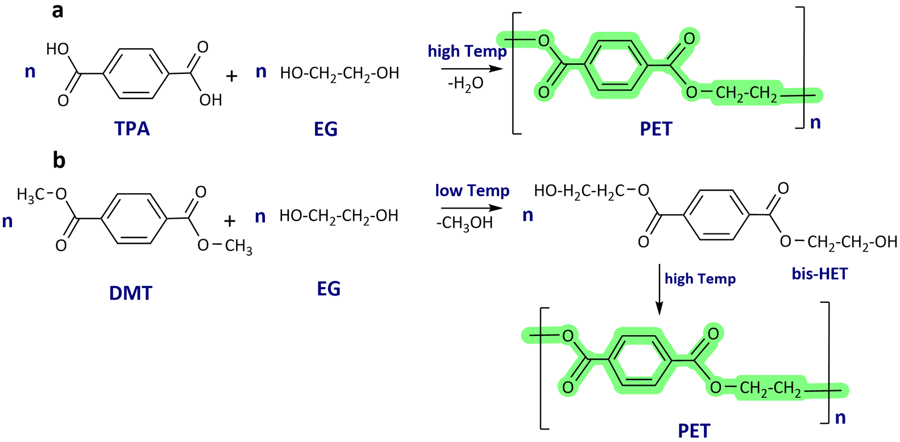
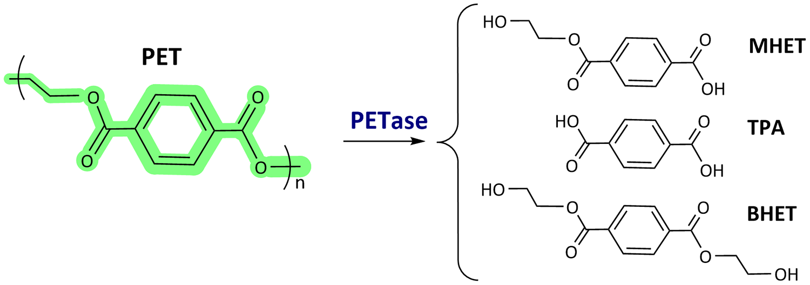
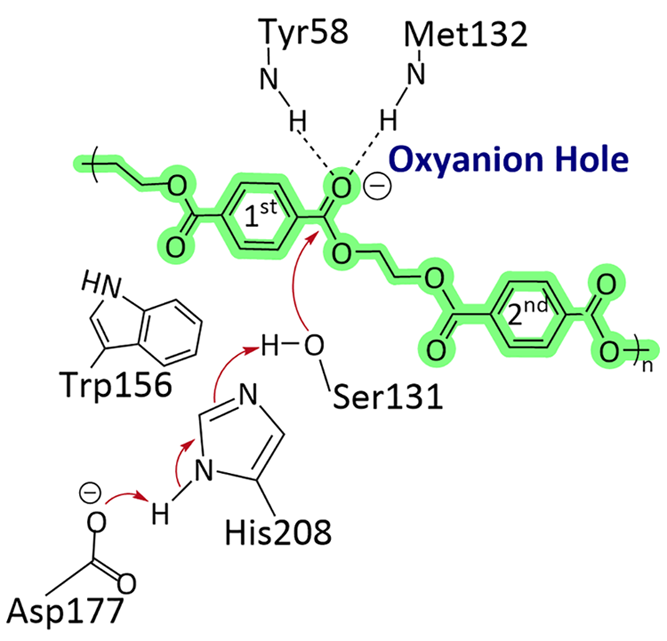
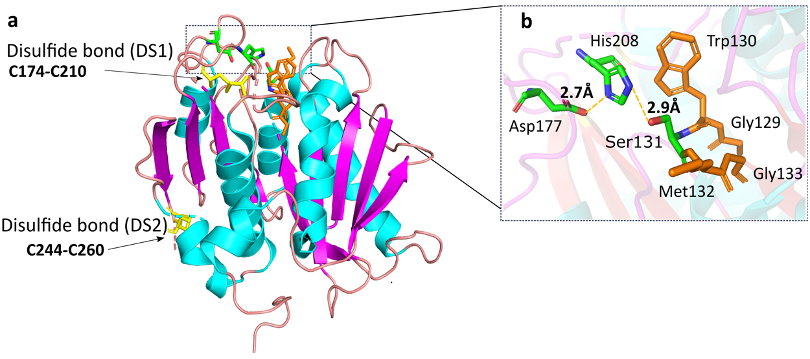
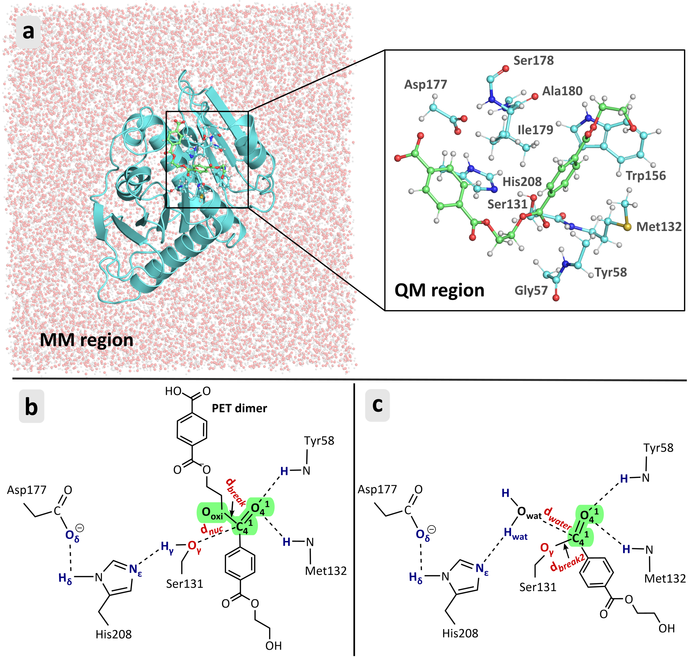
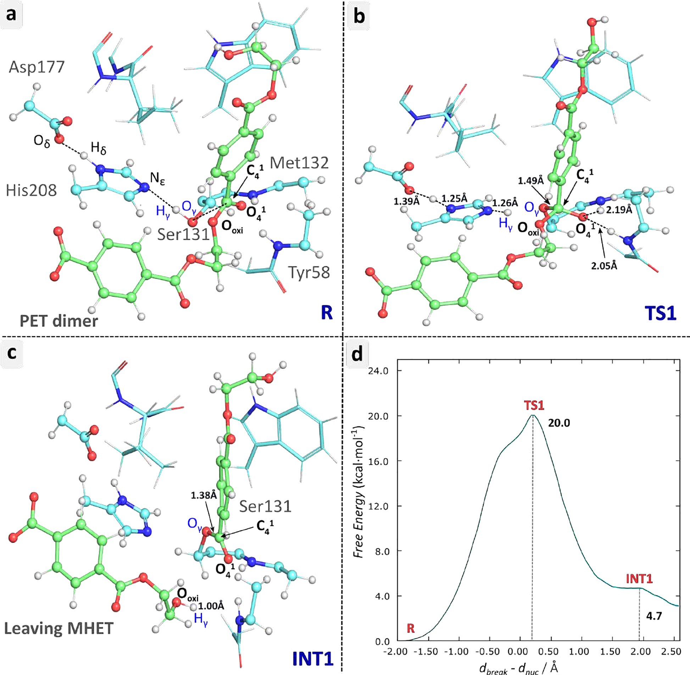
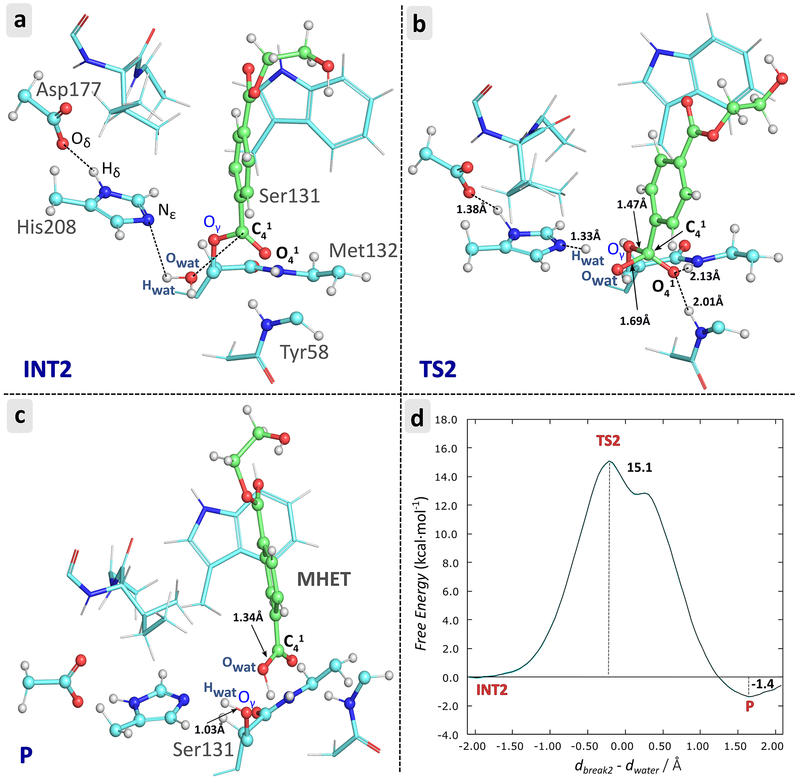
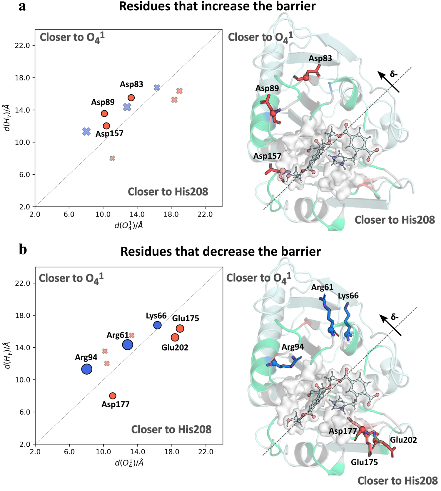
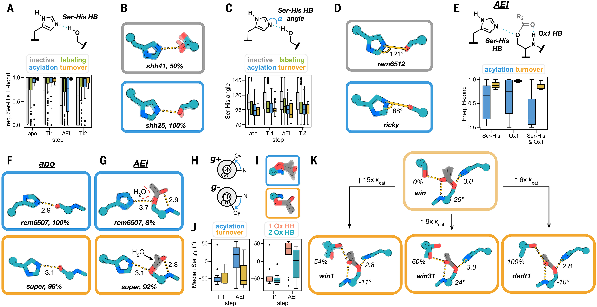
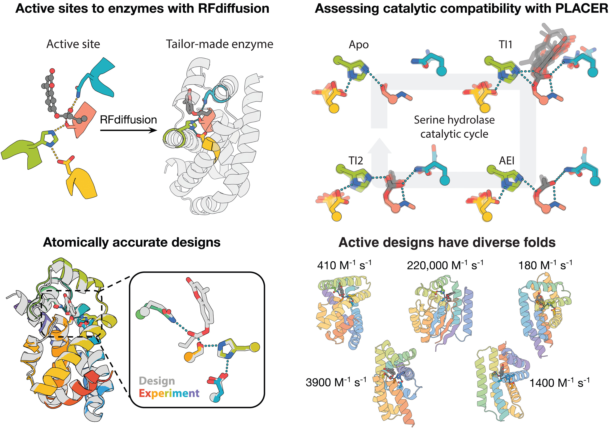

# DFT/MM揭示PETase催化机理与酶设计：理解自然，创造未来

## 本文信息
- **标题**: Reaction Mechanism of the PET Degrading Enzyme PETase Studied with DFT/MM Molecular Dynamics Simulations
- **作者**: Carola Jerves, Rui P. P. Neves, Maria J. Ramos, Saulo da Silva, Pedro A. Fernandes
- **发表时间**: 2021年9月3日
- **单位**: LAQV/REQUIMTE，波尔图大学化学与生物化学系，葡萄牙；厄瓜多尔昆卡大学化学科学学院，厄瓜多尔
- **引用格式**: Jerves, C., Neves, R. P. P., Ramos, M. J., da Silva, S., & Fernandes, P. A. (2021). Reaction Mechanism of the PET Degrading Enzyme PETase Studied with DFT/MM Molecular Dynamics Simulations. *ACS Catalysis*, *11*(18), 11626-11638. https://doi.org/10.1021/acscatal.1c03700
- **源代码**: Supporting Information可在https://pubs.acs.org/doi/10.1021/acscatal.1c03700获取

## 摘要
> 聚对苯二甲酸乙二醇酯（PET）被广泛用于制造一次性塑料瓶等产品，导致环境中大量PET废物积累。**Ideonella sakaiensis细菌的PETase和MHETase酶能够将PET水解为其组成单体**，为PET生物回收开辟了一条有前景的路径。本研究使用**伞形采样方法，在稳健的PBE/MM MD水平上，采用大规模QM区域，对PETase的催化反应机理进行了原子和热力学层面的解释**。反应机理分为两个阶段：**酰化和去酰化**，每个阶段都通过单一、缔合、协同且异步的步骤进行。酰化过程包括Ser131向His208的质子转移，同时Ser131对底物进行亲核攻击，形成四面体过渡态，随后在酯键断裂后释放MHET。去酰化由His208去质子化活性位点水分子驱动，产生的氢氧根进攻酰化的Ser131中间体并断裂其与底物的键。随后，His208将水质子转移到Ser131，形成MHET并再生酶。**速率限制步骤酰化的自由能势垒为20.0 kcal·mol⁻¹**，与实验值18.0-18.7 kcal·mol⁻¹的范围一致。最后，研究识别出突变后可增加酶周转数的残基，特别是**将Asp83、Asp89和Asp157突变为非正电残基有望降低速率限制步骤的势垒**。

### 核心结论
- PETase的催化机理遵循经典丝氨酸水解酶的两步反应机制：酰化和去酰化
- 两个阶段均通过单一的四面体过渡态进行协同但异步的反应
- 酰化步骤是速率限制步骤，自由能势垒为20.0 kcal·mol⁻¹
- 氧阴离子孔（Tyr58和Met132骨架）在稳定过渡态中起关键作用
- 理性突变Asp83/Asp89/Asp157可能提高酶催化效率

## 背景

塑料因其耐久性、低成本和多功能性已成为现代生活不可或缺的一部分，但其大量生产和使用也造成了严重的环境问题。自1950年以来，全球塑料产量呈指数级增长，仅2018年就生产了3.59亿吨塑料。联合国开发计划署指出，**塑料污染正以前所未有的速度和规模威胁着生态系统、生物多样性和人类健康**。据估计，每分钟购买100万个塑料饮料瓶，每年使用多达5万亿个一次性塑料袋。

聚对苯二甲酸乙二醇酯（PET）是最常用的一次性塑料之一，广泛用作液体饮料和食品的容器。PET是通过对苯二甲酸（TPA）与乙二醇（EG）的缩聚反应或二甲基对苯二甲酸酯（DMT）与EG的酯交换反应制得的半结晶热塑性聚酯。**其酯基团赋予PET对生物降解的卓越抵抗力**，使其成为环境中塑料废物的主要成分之一，与聚乙烯（PE）、聚丙烯（PP）和聚苯乙烯（PS）并列。

**Scheme 1：PET的合成路径**

PET的工业合成主要通过两条途径实现：对苯二甲酸（TPA）与乙二醇（EG）的直接缩聚，或二甲基对苯二甲酸酯（DMT）与EG的酯交换反应。这些反应形成的酯键正是PET难以降解的化学基础。

传统的PET废物处理方法包括填埋、焚烧和回收。前两种方法远非解决方案，会造成地下水污染或CO₂排放等其他环境问题。回收的PET可再加工成薄膜、片材或纺织纤维，但这一过程需要加热，导致PET的机械性能下降。化学回收在经济上也不可行，因为再加工的树脂比化石燃料单体更昂贵。**塑料的生物降解因其生态友好性和经济性成为广受期待的解决方案**。

### 关键科学问题

2016年，Yoshida及其同事发现了一种新的细菌——**Ideonella sakaiensis 201-F6**，它能够以PET作为碳源和能量来源。这种细菌拥有两种水解酶，PETase和MHETase，它们协同作用可将PET转化回对苯二甲酸和乙二醇。**PETase承担了PET生物降解中最具挑战性的工作**：将PET水解为单（2-羟乙基）对苯二甲酸酯（MHET），并产生少量对苯二甲酸（TPA）和双（2-羟乙基）对苯二甲酸酯（BHET）。

**Scheme 2：PETase和MHETase的协同降解路径**

该图展示了PET的酶促降解过程。PETase首先将PET聚合物水解为MHET单体，同时产生少量TPA和BHET；随后MHETase将MHET进一步水解为TPA和EG单体，从而完成PET到其组成单体的完全降解循环。这一双酶系统是自然界中发现的最有效的PET生物降解途径。

尽管已有多项研究对PETase进行了结构表征，但其催化机理的原子层面细节和热力学特征仍不清楚。理解这一机理是将PETase理性改造为大规模工业应用催化剂的基本前提。此前的理论研究主要基于半经验方法或静态QM/MM优化，缺乏足够的采样和精确的热力学描述。

**Scheme 3：Han等人提出的PETase催化机理假说**

基于晶体结构和诱变实验，Han等人提出PETase可能遵循经典丝氨酸水解酶的催化机制，涉及Ser131-His208-Asp177催化三联体。然而，该机理的详细原子过程、过渡态结构和能量学特征仍需要高精度理论计算来验证和补充。本研究正是在此基础上，使用QM/MM方法提供完整的热力学和动力学描述。

### 创新点

- **采用高精度DFT/MM方法**: 使用PBE泛函结合伞形采样（umbrella sampling）进行Born-Oppenheimer分子动力学模拟，提供了迄今最准确的PETase催化机理热力学描述
- **大规模QM区域**: QM区域包含146个原子，远大于以往研究，确保了催化关键残基的量子力学处理
- **完整的自由能曲面**: 通过0.7 ns的伞形采样模拟，获得了反应路径上所有中间态和过渡态的完整自由能曲线
- **理性突变设计**: 基于速率限制步骤的电荷分布分析，提出了提高酶周转数的具体突变建议
- **验证经典机理**: 在高精度理论水平上确认PETase遵循经典丝氨酸水解酶的催化机制

---

## 研究内容

### PETase结构与催化三联体

**图1：PETase的晶体结构与催化三联体**
- **图1A**: PETase整体结构（PDB ID: 5XG0），采用卡通表示，β-链为洋红色，α-螺旋为青色。催化三联体残基以绿色棍状表示，两个二硫键以黄色棍状显示，Gly-X-Ser-X-Gly基序以橙色棍状显示
- **图1B**: 催化三联体Ser131-His208-Asp177的特写视图，标注了关键相互作用距离（Å）。催化残基按元素着色，其余Gly-X-Ser-X-Gly基序残基以橙色显示

PETase是一种丝氨酸酯酶，组织成α/β-水解酶折叠，由9个β-链和7个α-螺旋组成。该酶含有丝氨酸水解酶基序Gly-X-Ser-X-Gly，拥有规范的**催化三联体Ser131-His208-Asp177**。PETase具有两个二硫键，其中DS1（Cys174-Cys210）位于活性位点附近，是PETase特有的结构特征。

### 建模与模拟方法

#### 体系构建

研究基于PDB ID: 5XH3的晶体结构（分辨率1.30 Å）构建PETase-底物复合物模型。该结构包含R103G/S131A双突变，研究者使用PyMOL软件将突变残基还原为野生型。**底物模型采用PET二聚体**，从活性位点的HEMT配体修改而来，因为其sp²酯碳原子与Ser131的距离为2.3 Å，保留了对苯二甲酸部分。

残基质子化状态通过PROPKA 3.0预测结合可视化检查确定。His75（预测pKa 3.29）和His208（预测pKa 5.29）在δ-氮上质子化。底物几何构型在HF/6-31G(d)水平优化以确定RESP原子电荷，使用GAFF2力场参数化。整个体系使用ff14SB力场，用TIP3P水分子溶剂化，加入6个氯离子中和电荷，**最终体系包含34,821个原子**。

#### QM/MM设置

**图2：QM/MM模拟体系**
- **图2A**: 左图显示完整的模拟体系，蛋白质用青色卡通表示，溶剂水分子用红色点表示。右侧插图展示QM区域的原子级细节，包含活性位点关键残基
- **QM区域组成**: 包含Ser131全部、Met132侧链和部分骨架、Tyr58骨架和部分侧链、Gly57和Ala180部分骨架、PET二聚体、Trp156/Asp177/Ser178/Ile179/His208侧链，共**146个原子**，电荷-2，单重态
- **图2B**: 酰化步骤反应物状态的2D表示，标注关键原子间距
- **图2C**: 去酰化步骤反应物状态的2D表示，显示水分子参与

使用CP2K软件包进行Born-Oppenheimer分子动力学（BOMD）模拟。**QM计算采用PBE泛函**，配合双ζ价极化平面波基组（DZVP）和Goedecker-Teter-Hutter赝势。平面波截断能设为300 Ry，QM盒子尺寸为26.14 Å × 24.91 Å × 24.14 Å。MM区域包含剩余34,675个原子，使用Amber ff14SB力场描述。边界区域用连接原子处理，长程库仑相互作用用高斯展开静电势（GEEP）方法描述。

#### 伞形采样方案

**技术实现**：伞形采样（Umbrella Sampling, US）在**CP2K软件包中直接实现**，使用内置的约束和偏置势功能。研究首先通过引导分子动力学（steered MD）模拟生成初始构象，谐振势力常数为50 kcal·mol⁻¹·Å⁻²，目标增长速率0.002 Å·fs⁻¹，持续3 ps。

**反应坐标定义**：

- **酰化步骤**: $\mathrm{RC}_{\mathrm{acyl}} = d_{\mathrm{break}} - d_{\mathrm{nuc}}$，其中$d_{\mathrm{nuc}}$为Ser131-Oγ到PET二聚体羰基碳C4¹的亲核攻击距离，$d_{\mathrm{break}}$为PET二聚体酯键C4¹-O$_{\mathrm{oxi}}$的断裂距离
- **去酰化步骤**: $\mathrm{RC}_{\mathrm{deacyl}} = d_{\mathrm{break2}} - d_{\mathrm{water}}$，其中$d_{\mathrm{break2}}$为酰化丝氨酸Oγ-C4¹键的断裂距离，$d_{\mathrm{water}}$为活性位点水的氧原子O$_{\mathrm{wat}}$到C4¹的攻击距离

**采样参数**：伞形采样窗口从steered MD轨迹中提取，沿反应坐标以0.1 Å间隔线性分布。谐振势常数为50或100 kcal·mol⁻¹·Å⁻²以确保窗口充分重叠。酰化步骤设置47个窗口，去酰化步骤44个窗口，每个窗口在NVT系综（300 K，CSVR控温器）下模拟15 ps，时间步长1 fs，**总采样时间0.7 ns**。

**自由能计算**：使用**加权直方图分析方法**（Weighted Histogram Analysis Method, WHAM）从伞形采样轨迹中恢复无偏自由能曲线。WHAM分析参数包括100个bootstrap数据集、0.0001的收敛阈值，bin数量设为独立窗口数的两倍。统计误差为0.02-0.07 kcal·mol⁻¹。

### 酰化反应机理

**图3：酰化反应详细机理**
- **图3A**: 反应物状态（R），Ser131与His208/Asp177形成氢键网络，距离底物羰基碳3.30 Å
- **图3B**: 过渡态TS1，形成四面体中间体特征，Ser131已去质子化并与底物成键（1.49 Å），酯键伸长至1.71 Å
- **图3C**: 中间体INT1，MHET产物即将离开活性位点，酯键已完全断裂（3.22 Å）
- **图3D**: 酰化步骤的自由能曲线，显示单一过渡态，势垒**20.0 kcal·mol⁻¹**，反应自由能4.7 kcal·mol⁻¹

#### 反应过程详解

在反应物状态，亲核性Ser131距离C4¹ 为3.30 ± 0.14 Å，氧阴离子孔由Tyr58和Met132骨架提供的氢键处于边缘形成状态（2.68 ± 0.57和3.07 ± 0.44 Å）。

伞形采样模拟生成的自由能曲线显示**酰化通过单一协同步骤进行**，在RC$_{\mathrm{acyl}}$ = 0.2 Å处存在唯一过渡态TS1，自由能势垒为20.0 kcal·mol⁻¹，与BHET底物的实验值（18.0-18.6 kcal·mol⁻¹）非常一致。

反应始于Ser131被His208去质子化，随后Ser131-Oγ对C4¹进行亲核攻击，形成四面体过渡态。在TS1处，Ser131 Hγ-Oγ距离为2.15 ± 0.42 Å，Ser131 Oγ-C4¹距离为1.49 ± 0.05 Å，确认Ser131已完全去质子化并与底物成键。**底物的剪切键C4¹-O$_{\mathrm{oxi}}$被拉伸但仍然形成**（1.71 ± 0.15 Å），呈现明显的四面体过渡态特征。

有趣的是，在TS1附近，质子向His208的转移（1.16 ± 0.14 Å）已经完成，但这个键在接近TS1时被拉伸，因为**质子快速向O$_{\mathrm{oxi}}$移动**。这一现象由C4¹-O$_{\mathrm{oxi}}$键断裂时O$_{\mathrm{oxi}}$上积累的负电荷驱动。支持这一解释的是，TS1时Ser131羟基质子到O$_{\mathrm{oxi}}$的距离减小至1.84 ± 0.69 Å。

从TS1衰减到INT1的过程中，PET二聚体酯键断裂，O$_{\mathrm{oxi}}$-C4¹距离从1.71 ± 0.15 Å增加到3.22 ± 0.11 Å。**离去的MHET捕获Ser131-Hγ质子**，O$_{\mathrm{oxi}}$到Ser131-Hγ的距离从TS1的1.84 ± 0.69 Å变为INT1的1.01 ± 0.04 Å。

#### 氧阴离子孔的催化作用

与实验观察一致，反应受到Tyr58和Met132骨架形成的氧阴离子孔的促进。为阐明氧阴离子孔在第一步反应中的贡献，研究分析了Tyr58和Met132骨架-NH与O4¹原子的距离和角度。

从R到TS1，Tyr58和Met132骨架-NH到O4¹原子的距离缩短（2.68 ± 0.57到2.05 ± 0.21 Å；3.07 ± 0.44到2.19 ± 0.26 Å），相互作用角度变得更加线性（160.01 ± 12.50°和162.65 ± 10.16°），表明**这些氢键因O4¹原子上负电荷的积累而变得更紧密**，证实了氧阴离子孔在稳定过渡态方面的效果。

形成INT1后，虽然自由能曲线未观察到明显的最小值，但逐一检查催化三联体、Ser-底物键和主要氢键可以看出，只有两类距离在持续拉长：MHET离去基团远离活性位点，以及Tyr58/Met132骨架-NH到O4¹的氧阴离子孔氢键。**自由能继续下降主要源于离去基团扩散和氧阴离子孔氢键被拉开**，而非新的化学键变化。常规MD模拟表明，形成的MHET分子**在纳秒时间尺度内（实际上小于1 ns）扩散到溶剂中**，被来自体相溶剂的水分子替代。

### 去酰化反应机理

**图4：去酰化反应详细机理**
- **图4A**: 中间体INT2，活性位点水分子占据MHET离去后的空间，距His208 Nε为2.49 Å，距C4¹为3.27 Å
- **图4B**: 过渡态TS2，水分子同时被His208去质子化并攻击C4¹，形成第二个四面体过渡态
- **图4C**: 产物P，Ser131-底物键断裂，Ser131从His208重新获得质子，生成第二个MHET分子并再生酶
- **图4D**: 去酰化步骤自由能曲线，势垒**15.1 kcal·mol⁻¹**，反应自由能-1.4 kcal·mol⁻¹

在去酰化步骤中，酰化步骤结束后MHET扩散到体相溶剂留下的区域**被活性位点水分子占据**，该水分子对酶-底物加合物进行亲核攻击，生成最终产物并恢复酶的静息态。初始去酰化状态（INT2）类似于INT1，但MHET已离开活性位点。MD模拟显示活性位点存在丰富的水分子，其中一个参与反应。

His208 Nε与水分子之间的初始距离（2.49 ± 0.92 Å）有利于水的去质子化，水分子到C4¹的距离（3.27 ± 0.12 Å）也有利于亲核攻击。自由能曲线显示去酰化过程中观察到三个相关状态：反应物（INT2）、过渡态（TS2）和产物（P）。**反应活化自由能为15.1 kcal·mol⁻¹，反应自由能为-1.4 kcal·mol⁻¹**。

与酰化步骤相反，去酰化步骤表现出清晰的极值点，研究者推断这与MHET与PETase活性位点的紧密结合有关。

在TS2处，Ser131 Oγ-C4¹距离为1.47 ± 0.05 Å，对应于Ser-酰基C-O键的刚刚开始伸长。水氧到C4¹的距离为1.69 ± 0.13 Å。这些距离对应于清晰的四面体过渡态，类似于TS1。与酰化步骤不同，**水的亲核攻击与His208对其去质子化是同步的**，因为水氢与His208 Nε之间的距离为1.33 ± 0.28 Å，水O-H键被拉伸至1.46 ± 0.46 Å。

氧阴离子孔氢键从INT2到TS2缩短：2.24 ± 0.25到2.01 ± 0.18 Å（Tyr58）和2.38 ± 0.41到2.13 ± 0.23 Å（Met132），证实这种相互作用稳定了TS2时C4¹形成的氧阴离子。然而，涉及Tyr58和Met132骨架-NH与O4¹的角度在整个步骤中基本保持不变，这表明氧阴离子孔可能在酰化步骤中发挥更大的稳定作用。

在产物中，Ser131 Oγ-C4¹键被彻底断裂（3.04 ± 0.11 Å）。**Ser131在从TS2到P的路径中使His208去质子化**，重新生成中性Ser131（水质子-Ser131 Oγ距离为1.03 ± 0.04 Å）。水氧O$_{\mathrm{wat}}$与底物碳原子C4¹之间的键缩短至1.34 ± 0.03 Å，确认产物MHET的形成。

### 理性酶工程设计

PETase的工程改造对其在大规模回收中的成功应用至关重要。虽然热稳定性工程超出了本工作范围，但提高酶效率（通过降低$k_{\mathrm{cat}}$）是本研究的重点。基于自由能曲线和速率决定步骤结构的识别，研究者提出了提高酶反应速率的理性工程策略。

速率限制步骤的电荷分布分析揭示了两个需要考虑的区域：第一个是带正电荷的区域，对应于质子化的His208咪唑；第二个是带负电荷的O4¹，在Ser131对PET二聚体的亲核攻击中形成。从反应物（R）到过渡态（TS1）的关键电荷转移过程包括：Ser131失去质子并进攻C4¹，形成带负电荷的氧阴离子中间体O4¹⁻；质子通过His208转移，His208暂时带正电荷。**这种电荷分离是TS1不稳定的主要来源**，也是理性突变设计的基础。

研究识别了活性位点10 Å内的带电残基，测量了它们的负/正电荷中心到His208（特别是其Hε，因为与Asp177的盐桥屏蔽了与Hδ的相互作用）和氧O4¹的距离。这些测量在R和TS1状态下进行。

**图5：基于电荷分析的理性突变设计**
- **图5A**: 增加势垒的带电残基分布。左图为距离分析散点图，显示Asp83/Asp89/Asp157都落在靠近O4¹的区域（**负电荷残基靠近负电荷中心会增加势垒**）；右图展示这三个Asp残基在PETase结构中的空间位置
- **图5B**: 降低势垒的带电残基分布。左图显示Glu175/Asp177/Glu202靠近His208，Arg61/Arg94/Lys66靠近O4¹；右图展示这些有益残基的空间分布
- 虚线分隔靠近His208和靠近O4¹的区域，箭头指示从反应物到过渡态的负电荷流动方向
- Asp83（β2-β3环）、Asp89（β3-α3环）、Asp157（β6-α5环）是理性突变的候选位点

每个残基对势垒增加/减少的贡献通过R和TS1的差异稳定来解释：
- 如果正电荷残基更靠近O4¹而非咪唑氮，它将更稳定TS1而非R，从而降低活化势垒；如果更靠近咪唑氮，则稳定R更多，导致活化能增加
- 同样的推理适用于负电荷残基：如果更靠近His208咪唑而非O4¹，则降低势垒；如果更靠近O4¹，则提高势垒

分析显示，更多带电残基靠近O4¹原子而非His208。相比相反情况（三个），更多带电残基稳定TS1相对于R（六个），符合催化剂的预期。**负电荷残基Glu175、Asp177和Glu202更靠近His208而非O4¹原子，预计会降低速率限制步骤的势垒**，而Arg94、Arg61和Lys66更靠近O4¹原子，也预计会降低势垒。因此，这些残基不应突变。

相反，**负电荷的Asp83、Asp89和Asp157更靠近O4¹原子，预计会增加势垒，可能是通过中性或正电荷残基进行诱变的候选者**。这些残基位于远离结合和活性位点的柔性环中，突变不太可能高度不稳定蛋白质结构。因此，建议的突变可能在保留酶折叠和底物结合的同时降低PETase速率限制酰化步骤的自由能势垒。或者，可以引入补偿性突变以减轻破坏PETase结构的风险。

### 关键结果问答

在详细分析了酰化和去酰化两个反应步骤后，以下几个问题的解答有助于更深入理解PETase的催化机理：

**酰化和去酰化是否存在稳定的四面体中间体？**

**不存在稳定的四面体中间体**。酰化和去酰化均通过**单一过渡态**进行，反应路径上观察到的是**瞬态四面体构象**。自由能曲线的梯度分析显示，在过渡态附近存在拐点，但**没有明确的自由能最小值**。这与经典丝氨酸水解酶的机理一致，也是本研究与之前某些研究（如Boneta等人提出的四步机制）的重要区别。

**为什么INT1后自由能持续下降而没有明显的最小值？**

主要相互作用距离分析显示，只有涉及**MHET离去基团和氧阴离子孔**的相互作用显著增加。常规MD模拟表明，MHET分子在**纳秒时间尺度内扩散到体相溶剂**。**MHET扩散是自发的熵驱动过程**，导致INT2状态的形成。结合略微吸热的酰化步骤和INT1后自由能下降，整个过程应该是**放热的**，符合PET水解的热力学特征。

**氧阴离子孔在两个反应步骤中的作用有何不同？**

在**酰化步骤**中，氧阴离子孔氢键距离显著缩短，角度显著线性化，表明对TS1有**强烈稳定作用**。在**去酰化步骤**中，氢键距离也缩短，但角度基本保持不变。这表明**氧阴离子孔在酰化步骤中发挥更大的催化作用**——这正是速率限制步骤，因此氧阴离子孔对整体催化效率的贡献主要体现在酰化阶段。

**突变策略的理论基础是什么？**

基于**速率限制步骤（酰化）的电荷分布分析**：从R到TS1涉及电荷分离，O4¹带负电荷，His208咪唑带正电荷。Asp83/Asp89/Asp157三个负电荷残基**更靠近负电荷中心O4¹**，会排斥并不利于负电荷积累，从而增加势垒。将它们突变为**中性或正电荷残基**将更好地稳定TS1，降低活化能。这些残基位于**柔性环且远离活性位点**，突变不太可能破坏蛋白质结构或底物识别，是理想的工程靶点。

### 从酶设计视角的启示

2025年2月，David Baker团队发表了丝氨酸水解酶的从头计算设计工作（Computational design of serine hydrolases），采用完全相同的Ser-His-Asp催化三联体机制，通过RFdiffusion和ChemNet工具从零开始设计出具有催化活性的全新酶。**回望本研究对天然PETase机理的精细表征，我们能够从酶设计的时代获得一些独特的视角**：

#### 机理理解验证设计原则

Baker的设计工作系统性地证明了本研究揭示的催化机理要素确实是功能必需的。设计工作中，**活性位点的预组织**（preorganization）被证明是成功设计的关键——ChemNet方法评估了催化循环全过程（apo、TI1、AEI、TI2四个状态）的预组织程度。这与本研究对PETase的发现完全呼应：

- **Ser-His氢键几何**：设计工作发现活性构象中Ser-His氢键角度约94°，而非活性构象中为108°。本研究同样强调Ser160-His237氢键在质子转移中的关键作用，验证了这一几何约束的必要性
- **丝氨酸旋转异构体**：设计工作发现在AEI态（酰基-酶中间体）丝氨酸优先采用g-旋转异构体，这与本研究观察到的Ser160在酰化和去酰化过程中的构象变化一致
- **氧阴离子洞定位**：设计工作强调了稳定四面体中间体的氧阴离子洞的重要性，本研究详细表征了Tyr87主链NH和Met161主链NH形成的氧阴离子洞及其稳定作用

#### 自然酶为设计提供约束条件

本研究对PETase机理的深入理解，实际上揭示了**自然酶在数亿年进化中优化出的设计约束**：

- **反应坐标的精细表征**：本研究通过伞形采样获得的完整自由能曲线（酰化ΔG‡ = 14.35 kcal/mol，去酰化ΔG‡ = 13.70 kcal/mol）为设计工作提供了性能基准。Baker的最优设计达到kcat/Km = 3.8×10³ M⁻¹s⁻¹，虽然仍低于天然PETase，但证明了从头设计已能接近自然酶的效率
- **电荷网络的系统优化**：本研究识别的Asp83/Asp89/Asp157电荷网络是自然进化的产物。设计工作同样发现，精确控制活性位点周围的静电环境对催化效率至关重要，但这种复杂的长程相互作用网络仍是设计中的挑战

#### 设计工具反哺机理研究

从酶设计的视角，本研究的价值不仅在于理解PETase如何工作，更在于**为改造PETase提供了可操作的设计参数**：

- **ChemNet评估体系的应用**：可以将Baker开发的ChemNet方法应用于评估本研究提出的突变体（如Asp83/Asp89/Asp157突变）是否真正改善了活性位点的预组织程度
- **RFdiffusion优化骨架**：虽然PETase骨架已被自然选择优化，但RFdiffusion等工具或许能帮助设计出在保持催化活性同时具有更高热稳定性的变体——这正是PETase实际应用的瓶颈
- **系统性突变筛选**：设计工具能够系统性地探索构象空间，而非仅依赖人工直觉。结合本研究的机理洞察，未来可以用深度学习方法自动筛选上千个候选突变，寻找同时优化催化效率和热稳定性的最优组合

#### 从表征到创造的范式转变

本研究代表了“**理解自然**”的传统范式，而Baker的工作开启了“**创造自然**”的新时代。两者的结合揭示了计算酶学研究的完整闭环：

- DFT/MM等第一性原理方法**深入理解**催化机理（如本研究）
- 深度学习方法**快速筛选**大量候选结构（如ChemNet评估预组织）
- 实验验证和迭代优化，最终**创造**出全新的酶

PETase的机理研究不仅帮助我们理解塑料降解的分子基础，更为未来设计更高效的塑料降解酶、甚至全新的生物催化剂提供了宝贵的知识积累。**在酶设计的新时代，每一次对自然酶的精细表征，都是为创造超越自然的酶铺平道路**。

---

## 与前人研究的对比

本研究与之前PETase及其同源酶MHETase的理论研究有重要的方法学和结论上的差异：

**Boneta等人的AM1/MM研究**

Boneta等人使用半经验AM1/MM伞形采样，后用DFT（M06-2X）修正，描述了PETase的**四步机制**——酰化和去酰化各两步，每步由四面体酶-底物中间体介导。本研究的主要区别在于：
- 本研究在**PBE/MM水平直接进行伞形采样**，而非后验修正
- 本研究的**QM区域更大**（146原子 vs 约70原子）
- 本研究发现**单步机制**（每阶段一个过渡态），而非两步机制
- 本研究的四面体构象是**瞬态的**，出现在接近过渡态时，而非稳定中间体

**MHETase的理论研究**

Knott等人对MHETase（PET降解途径中的第二个酶）进行了SCC-DFTB:MM QM/MM模拟，建议反应在两个步骤中发生，**没有形成稳定的四面体中间体**。Pinto等人使用B3LYP/GPW:MM方法研究MHETase，表明反应机理类似于规范丝氨酸水解酶，酰化和去酰化步骤通过**亚稳四面体中间体**进行。这些研究的结论与本研究更一致，支持**经典的两阶段、每阶段单步机制**。

**关键科学问题的澄清**

本研究通过更大的QM区域和直接的PBE/MM伞形采样，**确认了PETase遵循经典丝氨酸水解酶的单步机制**，而不是复杂的四步机制。这一结论不仅简化了对PETase催化机理的理解，也为理性设计提供了更清晰的靶点——**优化单一过渡态的稳定性**，而非多个中间体的平衡。

---

## 关键结论与批判性总结

### 主要发现
- 本研究使用**高精度DFT/MM方法首次完整描述了PETase催化PET降解的原子和热力学细节**
- 确认了PETase遵循**经典丝氨酸水解酶的两步机制**（酰化和去酰化），每步通过**单一四面体过渡态**进行
- 计算的**速率限制步骤势垒**（酰化：20.0 kcal·mol⁻¹）**与实验值高度一致**（18.0-18.7 kcal·mol⁻¹），验证了计算方法的可靠性
- 基于**电荷流动分析**提出了提高酶催化效率的理性突变策略（Asp83/Asp89/Asp157突变为中性或正电荷残基）

### 潜在影响
- **工业应用前景**：Asp83/Asp89/Asp157突变体**有望提高PETase在PET生物回收中的效率**
- **理性设计范式**：展示了如何通过**QM/MM研究速率限制步骤的电子结构来指导酶工程**
- **方法学意义**：证明了**PBE/MM伞形采样在酶催化机理研究中的可行性和准确性**
- **环境意义**：为开发更高效的PET生物降解技术提供了**分子层面的理论基础**

### 局限性
- **底物模型简化**：采用PET二聚体而非更长的聚合物链，**可能无法完全反映结晶PET的降解过程**
- **温度效应缺失**：未考虑温度效应，实际应用中PETase需在**高温下工作以降解结晶区域**
- **突变预测待验证**：突变建议基于理论分析，**需要实验验证其对酶稳定性和活性的实际影响**
- **过程不完整**：仅研究了催化机理，**未涉及底物结合动力学和产物释放过程**
- **QM区域限制**：QM区域虽然较大（146原子），但**仍可能遗漏某些长程静电相互作用**

### 未来研究方向
- **实验验证突变体**：实验验证建议的**Asp83/Asp89/Asp157突变对催化效率的影响**
- **底物多样性研究**：研究**更长PET链或结晶PET片段**与PETase的相互作用
- **热稳定性优化**：结合温度稳定性工程，开发能在**高温下高效工作的PETase变体**
- **协同机制探索**：探索**PETase与MHETase的协同催化机制**
- **AI辅助筛选**：应用**机器学习方法筛选更多潜在突变位点**

