# X射线晶体学与QM/MM模拟联手：揭示嘧啶从头合成关键酶OPRTase的催化反应机制

## 本文信息

- **标题**：Elucidating the Catalytic Reaction Mechanism of Orotate Phosphoribosyltransferase by Means of X-ray Crystallography and Computational Simulations
- **作者**：Maite Roca, Sergio Navas-Yuste, Kirill Zinovjev, Miguel López-Estepa, Sara Gómez, Francisco J. Fernández, M. Cristina Vega, Iñaki Tuñón
- **发表时间**：2020年1月2日
- **单位**：Universitat Jaume I (西班牙), Center for Biological Research CIB-CSIC (西班牙), University of Bristol (英国), Universitat de València (西班牙)
- **期刊**：ACS Catalysis, 2020, 10, 1871-1885
- **引用格式**：Roca, M., Navas-Yuste, S., Zinovjev, K., López-Estepa, M., Gómez, S., Fernández, F. J., Vega, M. C., & Tuñón, I. (2020). Elucidating the Catalytic Reaction Mechanism of Orotate Phosphoribosyltransferase by Means of X-ray Crystallography and Computational Simulations. *ACS Catalysis*, *10*(3), 1871-1885. https://doi.org/10.1021/acscatal.9b05294

## 摘要

> 乳清酸磷酸核糖转移酶（OPRTase）在$\ce{Mg^{2+}}$离子存在下催化核糖供体α-D-5-磷酸核糖-1-焦磷酸（PRPP）与乳清酸（OA）反应，生成焦磷酸和嘧啶核苷酸乳清苷-5′-单磷酸（OMP），后者是**嘧啶核苷酸从头生物合成的关键前体**。
>
> 本研究测定了多个大肠杆菌OPRTase二聚体的高分辨率结构，进行了动力学测量以获得催化速率和米氏常数。通过分子动力学（MD）模拟和X射线、MD结构的结构分析，揭示了与柔性催化环相关的构象变化，该环与PRPP的焦磷酰基团建立氢键相互作用。
>
> 研究提出**OA底物可能以其互变异构形式**（酰胺和亚氨酸形式）**存在平衡**。从最稳定的互变异构形式出发，通过量子力学/分子力学（QM/MM）MD模拟结合自适应弦方法探索了所有可能的机制。最可行的机制包括：**质子从OA的N1原子转移到水分子，再从水分子转移到PRPP的α-磷酸O2A原子；随后OA的N1原子对PRPP的C1原子进行亲核攻击，生成OMP和焦磷酸**。
>
> 获得的**自由能垒**（$16.7\,\mathrm{kcal\cdot mol^{-1}}$）**与实验数据**（$15.5\,\mathrm{kcal\cdot mol^{-1}}$）**高度吻合**。对速率限制步骤的反应物态和过渡态（TS）之间关键残基与底物的相关距离分析，揭示了保守残基（Lys73、Asp125、Lys103、Arg99和$\ce{Mg^{2+}}$离子）在静电稳定TS和维持柔性催化环闭合构象中的作用。

### 核心结论

- 首次报道了**大肠杆菌OPRTase的空活性位点结构**（1.55 Å分辨率）及两个底物复合物结构（1.25-1.60 Å）
- 通过自由能微扰计算确认**OA的酰胺形式比亚氨酸形式稳定约** $20\,\mathrm{kcal\cdot mol^{-1}}$，酶环境无法逆转这一能量差
- 揭示了**水介导的质子转移机制**：N1(OA) → $\ce{H2O}$ → O2A(PRPP) → 亲核攻击
- QM/MM计算的活化自由能垒（$16.7\,\mathrm{kcal\cdot mol^{-1}}$，含ZPE校正）与实验测得的 $k_{\text{cat}} = 26.4\,\mathrm{s^{-1}}$（对应$15.5\,\mathrm{kcal\cdot mol^{-1}}$）吻合度极高
- 识别出关键催化残基的静电稳定作用：Lys73、Asp125与PRPP相互作用；Arg99、Lys103（来自邻近亚基）维持催化环闭合
- **柔性催化环**（残基99-109）的**开-闭运动对催化至关重要**，其与PRPP焦磷酰基团的相互作用决定酶活性

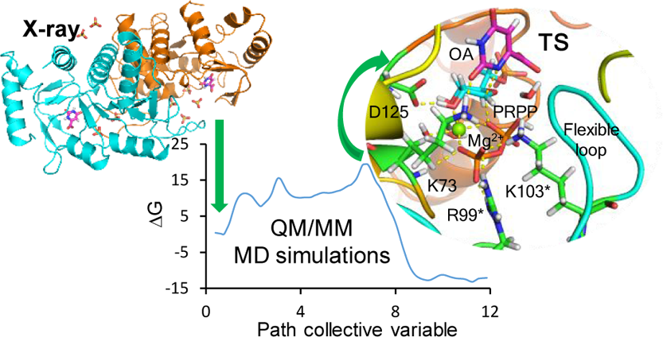

## 背景

### 嘧啶核苷酸生物合成的重要性

磷酸核糖转移酶(PRTases)参与嘧啶核苷酸的合成,这些核苷酸是DNA和RNA的关键前体,也参与某些氨基酸(如组氨酸和色氨酸)以及吡啶辅酶NAD和NADP的合成。其中，**乳清酸磷酸核糖转移酶(OPRTase)催化嘧啶核苷酸OMP的形成**，OMP随后被OMP脱羧酶转化为尿苷-5′-单磷酸(UMP)，即所有嘧啶核苷酸的前体。OPRTase广泛分布于多种生物中，包括疟原虫(*Plasmodium falciparum*)、结核分枝杆菌(*Mycobacterium tuberculosis*)、鼠伤寒沙门氏菌(*Salmonella typhimurium*)、酿酒酵母(*Saccharomyces cerevisiae*)和人类。对于这些生物体，**从头嘧啶生物合成是核苷酸生产的主要途径**。

### 药物开发的重要靶点

恶性疟原虫是导致人类疟疾的最致命寄生虫，由于疟原虫对现有治疗的耐药性增加，迫切需要开发新的抗疟药物。结核分枝杆菌引起的结核病是严重的人类传染病，耐药结核病的兴起对公共卫生构成重大威胁。此外，人类OPRTase在快速增殖细胞中发挥关键作用，以满足核酸合成的增加需求，针对嘧啶生产的疗法已用于治疗自身免疫疾病和恶性肿瘤。**通过抑制OPRTase阻断OMP生产，可以治疗疟疾、结核病和癌症等致命疾病**,因此OPRTase是合理设计抗疟、抗结核和抗癌药物的吸引靶点。

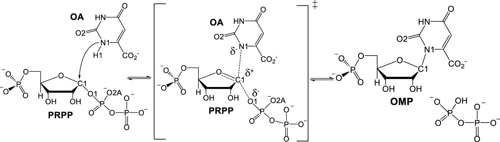

**示意图1：PRPP与乳清酸在** $\ce{Mg^{2+}}$ **参与下转化为OMP与焦磷酸的整体反应**。子底物、产物以及$\ce{Mg^{2+}}$配位关系一览，强调了焦磷酸离去与OMP生成的同步性。

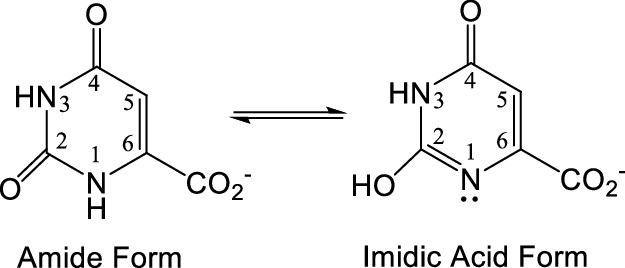

**示意图2：乳清酸在酰胺形式与亚氨酸形式之间的互变平衡**。亚氨酸形式在概念上有助于活化N1，但本研究证明其在酶中并不占优势。

### 关键科学问题

尽管OPRTase的重要性已得到广泛认可，但其**催化反应机制的分子细节仍不清楚**：

1. **反应立体化学**：已知反应**在异头碳C1处发生构型反转**，提出了松散的氧碳正离子样过渡态，推测为$S_N$1样机制
2. **质子转移路径**：OA的N1原子质子（H1）如何转移到酶或PRPP的精确路径仍不明确
3. **底物互变异构**：OA可能以酰胺和亚氨酸两种互变异构形式存在平衡，**哪种形式是真正的反应底物？**
4. **残基作用机制**：突变研究表明保守的Lys73、Lys103、Asp125等残基对催化至关重要，但其**具体作用机制尚未阐明**
5. **蛋白质环境效应**：以往的真空中过渡态优化忽略了**蛋白质环境**（包括灵活性）的**复杂效应**

这些问题的解答对于**深入理解催化机制、准确表征过渡态结构**至关重要，进而能够指导设计过渡态类似物（TSA）抑制剂来控制这些疾病。

需要强调的是，虽然实验证明在异头碳C1发生构型反转，但QM/MM自由能分析显示过渡态是**松散的氧碳正离子**，亲核体逼近与焦磷酸离去并不同步，因此整体机理更偏向$S_N$1样极限；构型反转源于催化环和$\ce{Mg^{2+}}$将N1从离去基团对面拉近，可视为“松散$S_N$2”与$S_N$1之间的连续体。

### 创新点

- **首次报道**大肠杆菌OPRTase的空活性位点高分辨率结构（1.55 Å）
- **首次系统比较**酰胺和亚氨酸互变异构形式在酶中的稳定性（通过FEP计算）
- **首次使用自适应弦方法结合路径集合变量**探索OPRTase的完整反应自由能面
- **首次实现理论与实验的定量吻合**：计算的活化自由能（$16.7\,\mathrm{kcal\cdot mol^{-1}}$）与实验测定的 $k_{\text{cat}}$（对应$15.5\,\mathrm{kcal\cdot mol^{-1}}$）**高度一致**
- 揭示了**水分子作为质子中继**的关键作用
- 阐明了**柔性催化环的动力学行为**及其对催化的影响
- 提供了**详细的过渡态结构信息**，为TSA抑制剂设计提供结构基础

---

## 研究内容

### 高分辨率X射线晶体学：捕捉酶的多个构象态

#### 晶体结构概况

研究团队成功解析了三种大肠杆菌OPRTase（EcOPRTase）的晶体结构：

- **空活性位点**：1.55 Å分辨率（PDB：6TAI）
- **OA复合物**（无硫酸根）：1.59 Å（PDB：6TAJ）
- **OA/** $\ce{SO4^2-}$ **复合物**：1.25 Å（PDB：6TAK）

所有结构均为**二聚体**，每个单体由α+β结构组成，包含中心三层α/β（Rossmann）折叠，以及N端和C端延伸部分。

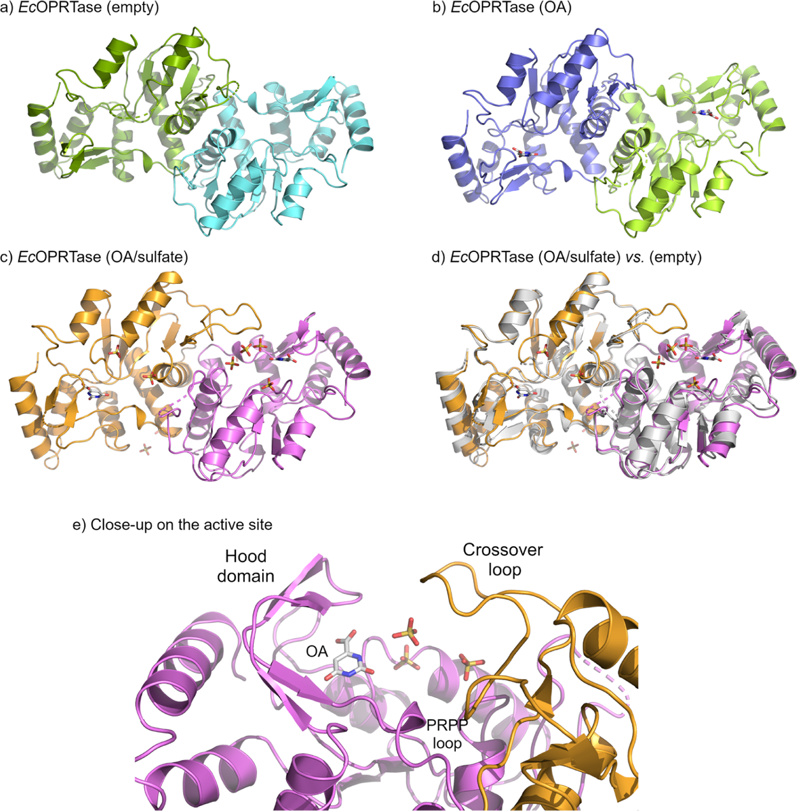

**图4：EcOPRTase的晶体结构全景**。(a) 空活性位点；(b) OA 复合物；(c) OA/$\ce{SO4^2-}$复合物；(d) OA/$\ce{SO4^2-}$（彩色）与空活性位点（白色）的叠加；(e) 展示交叉环、帽结构域和PRPP结合环的活性位点局部，展示有序的交叉环（crossover loop，橙色）、帽或罩结构域（hood domain，紫色）和PRPP结合环（粉色）。各结构的卡通表示，链用不同颜色显示。OA和硫酸根离子以棍状和CPK颜色显示。

#### 空活性位点结构的关键发现

这是**首次报道的无硫酸根/磷酸根的EcOPRTase空活性位点结构**。关键观察：

- **两个交叉环**（催化环，残基99-109）**完全无序**，在电子密度图中不可见
- 这与含硫酸根的先前结构（PDB 1ORO）形成对比，后者的硫酸根使交叉环固定在非活性构象
- 与酿酒酵母OPRTase的空活性位点结构（PDB 2PRY，2.35 Å）一致

**意义**：说明**在无底物时，催化环处于灵活的开放状态**；只有在PRPP结合后，催化环才倾向于采取闭合构象。

#### OA结合位点已预先形成

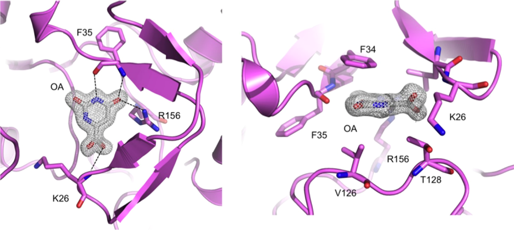

**图5：EcOPRTase/OA复合物的活性位点特写**。关键残基与OA建立的氢键及疏水堆叠关系以虚线和棍状模型标示。

活性位点的卡通表示。左图：显示与OA建立氢键相互作用（虚线）的酶残基侧链；右图：参与形成OA疏水口袋的残基侧链。OA的$\sigma_A$加权$2mF_o - DF_c$电子密度图以1 rms等高线水平显示。

OA的结合由以下相互作用稳定：
- Lys26主链N与OA羧基形成salt bridge
- Phe34侧链提供π-π堆积（距离3.5-4.2 Å）
- Phe35主链O和N分别与OA的O4和N3形成氢键
- Arg156侧链与O4相互作用

**这些相互作用在MD模拟中保持稳定**，表明OA结合位点在PRPP缺失时已经**预先组织**好。

#### 硫酸根模拟PRPP结合模式

在OA/$\ce{SO4^2-}$复合物中识别出多达4个硫酸根离子，其中3个占据功能重要位置：

1. **5′-磷酸结合位点**：一个硫酸根与PRPP结合环（残基128-132：Thr128、Ala129、Gly130、Thr131、Ala132）相互作用
2. **焦磷酸模拟位点**：一个硫酸根位于两个亚基界面，与Tyr72、Lys73、Lys100（同一单体）以及Arg99\*、Lys103\*相互作用
3. **活性位点入口**：第三个硫酸根位于底物结合口袋入口，由Lys73、Lys103\*和His105\*稳定

> 文中带\*的残基（如Arg99\*）均表示来自邻近亚基的对侧残基，用以标记由对侧催化环跨亚基伸入并参与配位的残基。

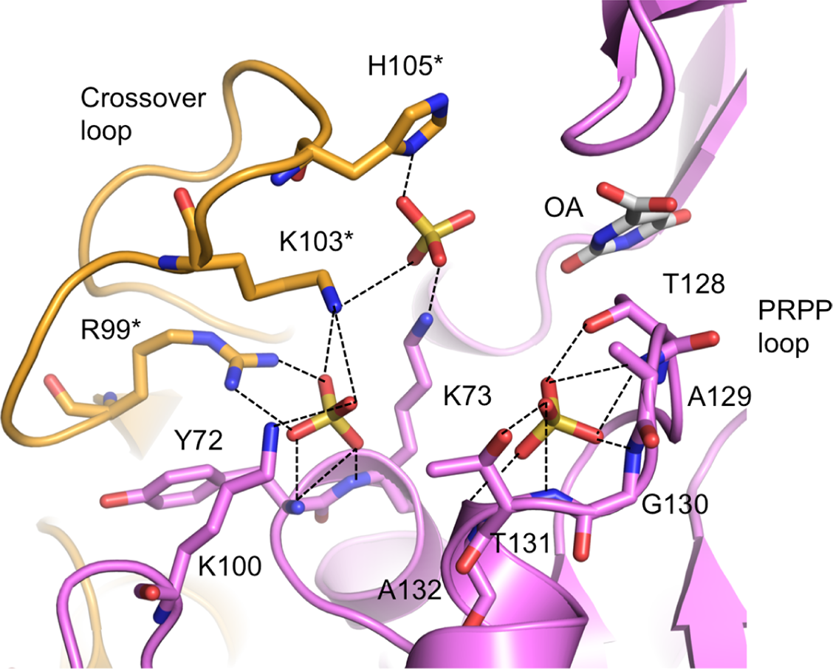

**图6：EcOPRTase/OA/** $\ce{SO4^2-}$ **复合物的活性位点特写**。三个功能性硫酸根分别模拟5′-磷酸、焦磷酸与入口结合位点，突出跨亚基协同作用。

显示与硫酸根离子建立氢键相互作用（虚线）的酶残基侧链。柔性交叉环来自邻近亚基（橙色）。

**关键洞察**：这些硫酸根-蛋白质相互作用**与S. typhimurium OPRTase中PRPP各磷酸基团的相互作用高度保守**，为PRPP在活性位点的结合模式提供了准确预测。

> 小编锐评：解结构里面出现这种非特异的硫酸根还模拟正常底物PRPP就是纯纯扯淡，不是说物理错了，确实能结合，而是完全偏离了重点，感觉像是强调硫酸根。且底物不只负电部分，不一定像离子一样结合这么多。能用模拟底物肯定得用啊，ATP-γ-S这种，没用只能说明他们菜。

#### 亚基不对称性与协同催化

尽管OPRTase是同型二聚体，但两个亚基在晶体结构中**并非完全对称**：

- 空活性位点结构：两个亚基的rmsd为0.76 Å
- OA复合物：rmsd为0.75 Å
- OA/$\ce{SO4^2-}$复合物：rmsd为0.55 Å（对称性最高）

在OA/$\ce{SO4^2-}$复合物中，链B的交叉环完全折叠并有可解释的电子密度，采用与链A基本相同的构象。这种**亚基不对称性**与OPRTase的**双Theorell-Chance**（“打了就跑”）**机制**一致，其中：
- 一个活性位点OA和PRPP结合的时机与对侧位点OMP和焦磷酸释放的时机同步
- 导致**独特的交替位点催化**，无需累积三元复合物

### 酶促动力学：实验基准

使用连续分光光度法测定EcOPRTase在25°C下的催化常数和米氏常数：

$$
k_{\text{cat}} = 26.4 \pm 0.6 \, \mathrm{s^{-1}}\\
K_M = 99 \pm 8 \, \mu\mathrm{M} \quad (\text{for OA})\\
k_{\text{cat}}/K_M = 2.66 \times 10^5 \, \mathrm{M^{-1}\cdot s^{-1}}
$$

**对应的实验活化自由能**：

$$
\Delta G^{\ddagger}_{\text{exp}} = -RT \ln \frac{k_{\text{cat}} h}{k_B T} = 15.5 \, \mathrm{kcal\cdot mol^{-1}} \quad (T = 298 \, \mathrm{K})
$$

这一数值与相关酶的文献值一致，**为后续计算结果提供了可靠的实验基准**。

### 分子动力学模拟：探索酶的柔性

#### 体系构建

基于S. typhimurium OPRTase的三元复合物结构（PDB 1LH0，含$\ce{Mg^{2+}}$、PRPP和OA），将PRPP和$\ce{Mg^{2+}}$添加到EcOPRTase/OA/$\ce{SO4^2-}$结构的链A活性位点，构建米氏复合物（Michaelis complex）。

分别对OA的**酰胺形式**和**亚氨酸形式**进行了100 ns的经典MD模拟：
- 使用AMBER ff14SB力场和TIP3P水模型
- NPT系综，298 K，1 bar
- $\ce{Mg^{2+}}$与PRPP形成**八面体配位**（4个PRPP氧原子 + 2个水分子），在整个MD模拟中保持完整

#### 柔性催化环的动力学行为

结构分析表明：
- **OA和5′-磷酸结合区域相对刚性**，氢键网络在MD中高度保守
- **焦磷酰基团结合区域**（催化环）**显著更灵活**：
  - Arg99\*、Lys103\*（来自邻近亚基）与焦磷酸氧原子的相互作用大部分时间保持
  - Lys100、Lys73与焦磷酸的相互作用有较大波动
  - His105\*与α-磷酸的相互作用因Lys26和Lys100的竞争而减弱

**功能意义**：催化环的这种**灵活性对于催化周期至关重要**——无PRPP时保持开放以允许底物进入，PRPP结合后倾向闭合以封闭活性位点，产物释放后再次打开。

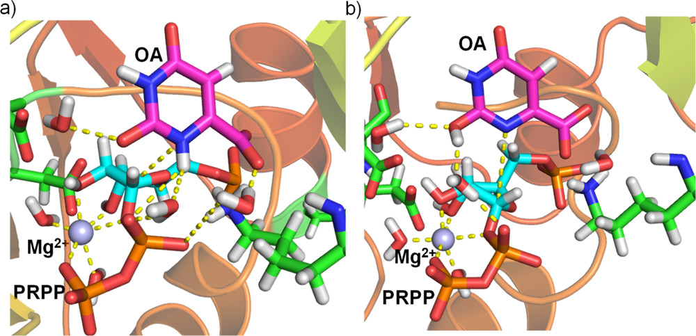

**图1：100 ns经典MD后OPRTase活性位点的对比**。(a) OA保持酰胺形式时，关键残基（Lys73、Asp125、Arg99\*、Lys103\*）与PRPP和$\ce{Mg^{2+}}$形成稳定氢键/静电网络；(b) 若强行引入亚氨酸形式，活性位点氢键网络发生明显扰动，解释了其热力学劣势。

#### 水分子的关键作用

MD模拟揭示了一个**关键水分子**位于：
- OA的N1原子（质子供体）附近
- PRPP的α-磷酸O2A原子（最终质子受体）附近

该水分子通过氢键网络连接N1和O2A，**平均距离约3 Å**，提示其可能作为**质子中继**。这一水分子也在EcOPRTase/OA/$\ce{SO4^2-}$晶体结构中观察到。

### 互变异构形式的热力学稳定性

文献提出OA可能以两种互变异构形式存在平衡：
- **酰胺形式**（amide form）：N1-H，C2=O
- **亚氨酸形式**（imidic acid form）：N1（去质子化），C2-OH

后者可能通过N1去质子化而被“激活”用于亲核攻击。但**哪种形式在酶中更稳定？**

#### 自由能微扰（FEP）计算

使用热力学循环计算两种互变异构形式在酶中的相对稳定性：

$$
\begin{aligned}
&\text{OA}_{\text{lactam}}^{\text{gas}} \xrightarrow{\Delta G_{\text{gas}}} \text{OA}_{\text{lactim}}^{\text{gas}}\\
&\quad\downarrow \Delta G_{\text{Amide,p}} \qquad\downarrow \Delta G_{\text{Imidic,p}}\\
&\text{OA}_{\text{lactam}}^{\text{protein}} \xrightarrow{\Delta G_{\text{Protein}}} \text{OA}_{\text{lactim}}^{\text{protein}}
\end{aligned}
$$

其中，根据热力学循环的闭合条件：

$$
\Delta G_{\text{Protein}} = \Delta G_{\text{gas}} + (\Delta G_{\text{Imidic,p}} - \Delta G_{\text{Amide,p}})
$$

**示意图3：计算** $\Delta G_{\text{Protein}}$ **的热力学循环**。
- 左支：在气相中将酰胺形式转化为亚氨酸形式，得到$\Delta G_{\text{gas}}$。
- 右支：分别评估两种互变异构体在蛋白环境中的结合自由能，得到$\Delta G_{\text{Imidic,p}}$与$\Delta G_{\text{Amide,p}}$。
- 顶部与底部：通过闭合循环确保$\Delta G_{\text{Protein}}$等于气相差与蛋白质差的代数和，用于判定哪种互变异构体在酶中更稳定。

**气相自由能差**（M06-2X/6-311+G(2df,pd)）：
$$
\Delta G_{\text{gas}} = 27.5 \, \mathrm{kcal\cdot mol^{-1}}
$$

酰胺形式在气相中**显著更稳定**。

**蛋白质-底物相互作用自由能差**（BAR方法，21个λ窗口，每个5 ns）：
$$
\Delta G_{\text{Imidic,p}} - \Delta G_{\text{Amide,p}} = -7.61 \pm 0.11 \, \mathrm{kcal\cdot mol^{-1}}
$$

蛋白质**优先稳定亚氨酸形式约** $7.6\,\mathrm{kcal\cdot mol^{-1}}$。

**酶中的净自由能差**：

$$
\Delta G_{\text{Protein}} = 27.5 - 7.6 = 19.9 \, \mathrm{kcal\cdot mol^{-1}}
$$

**结论**：尽管酶优先稳定亚氨酸形式，但**无法克服气相中的巨大能量差**。因此，**酰胺形式仍是酶中最稳定的化学结构**，也是优选的反应起始形式。任何需要OA获得亚氨酸功能的机制都因约 $20\,\mathrm{kcal\cdot mol^{-1}}$ 的**能量代价而被排除**。

> 小编锐评：气相自由能差作为free态也太抽象了，FEP老狗震怒，亏你软件都会用，算出20 kcal纯活该。可能只是为了省掉一些可能的反应路径，排除掉这个互变异构形式，说不定是审稿人让补的。。

### QM/MM反应机制探索

#### 方法学：自适应弦方法

使用**自适应弦方法**（adaptive string method）结合**路径集合变量**（path collective variable，s坐标）探索最小自由能路径（MFEP）。详细方法学原理请参见附录。

**本研究的具体设置**：
- **QM区域**（54原子，PM6方法）：OA、PRPP、$\ce{Mg^{2+}}$和3个水分子
- **MM区域**：其余蛋白质和溶剂（ff14SB + TIP3P）
- **弦节点**：80个等间距节点，每个节点独立MD模拟（最长250 ps）
- **副本交换**：每50步尝试相邻节点交换以增强采样
- **集合变量**（CVs）：追踪反应进程的关键几何参数
  - **成键/断键距离**：如d(N1-C1)、d(C1-O1)等，描述化学键的形成与断裂
  - **C1原子杂化坐标**：C1是PRPP核糖部分的**1'位碳原子**（异头碳），其杂化状态在反应中发生变化：
    - 反应前（sp³杂化）：C1与O1键合，呈**四面体构型**
    - 过渡态（sp²杂化倾向）：C1-O1键断裂，C1形成**氧碳正离子特征**，趋向**平面构型**
    - 反应后（sp³杂化）：N1对C1亲核攻击后，C1重新形成**四面体构型**
  - 杂化坐标通过C1周围的键角或距离组合定义，反映C1从四面体（109.5°）向平面（120°）过渡的程度，是**捕捉磷酸核糖基转移反应几何变化的关键参数**
- **势能均值力**（PMF）：沿s坐标使用伞形采样（US），95%置信区间目标为±$1\,\mathrm{kcal\cdot mol^{-1}}$

**高级别修正**：
- 使用M06-2X/6-311+G(2df,pd)//PM6单点能校正PMF
- 定位反应物和过渡态并计算零点能（ZPE）校正

**图2：从OA酰胺形式出发提出的三条反应途径**。机制1为水介导、机制2为直接质子转移、机制3为经羧基+水的分两步转移；箭头标明质子传递及随后的亲核攻击/离去基团步骤。

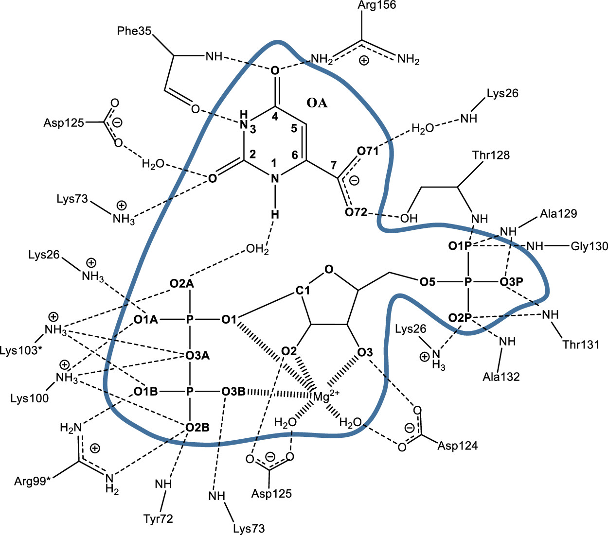

**图3：QM/MM模型中活性位点与QM区域的示意**。蓝色封闭曲线内的原子（OA、PRPP、$\ce{Mg^{2+}}$与三个催化水分子）采用QM描述，灰色区域为MM层；标出了支撑过渡态的关键氢键与静电相互作用。

#### 机制1：水介导质子转移（最优机制）

**图9：机制1**（水介导质子转移）**的反应路径与自由能剖面**。(a) 三步质子/亲核事件示意；(b) 沿路径集合变量s坐标的PMF，显示$16.7\,\mathrm{kcal\cdot mol^{-1}}$的总活化自由能。

(a) 反应机制：从OA的N1原子质子转移到水分子，再从水转移到PRPP的α-磷酸O2A原子，最后OA的N1原子对PRPP的C1原子进行亲核攻击，生成OMP和焦磷酸。
(b) 沿路径集合变量s坐标计算的PMF（M06-2X/6-311+G(2df,pd):PM6/MM水平）以及定义s坐标的集合变量。

**反应路径**（三步机制）：

- **步骤1**：质子从OA的N1转移到水分子，形成**瞬态水合氢离子**（$\ce{H3O+}$）。该中间体不太稳定
- **步骤2**：质子从水合氢离子转移到PRPP的α-磷酸O2A原子，形成稳定的中间体

- **步骤3**（速率限制步骤）：OA的N1原子对PRPP的C1原子进行亲核攻击

  - 同时C1-O1键断裂，生成OMP和焦磷酸

  - **过渡态呈现松散的氧碳正离子特征**

- **自由能垒**（M06-2X/6-311+G(2df,pd):PM6/MM）：$\Delta G^{\ddagger}_{\text{calc}} = 19.7 \, \mathrm{kcal\cdot mol^{-1}}$
- **ZPE校正后**（从10对反应物/TS结构平均）：$
\Delta G^{\ddagger}_{\text{calc+ZPE}} = 16.7 \, \mathrm{kcal\cdot mol^{-1}}$，**与实验值** $15.5\,\mathrm{kcal\cdot mol^{-1}}$ **高度吻合！**

#### 机制2和3：被排除的替代路径

**机制2**：**直接质子转移** — N1(OA)直接将质子转移给O2A(PRPP)，无水分子中介

- **自由能垒**：$42.6\,\mathrm{kcal\cdot mol^{-1}}$
- **结论**：能垒**过高**，机制不可行

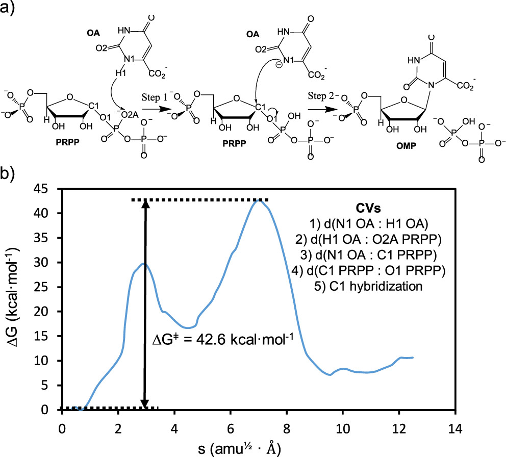

**图7：机制2**（直接质子转移）**的路径与PMF**。仅包含N1→O2A的直接转移，导致$42.6\,\mathrm{kcal\cdot mol^{-1}}$的高能垒。

**机制3**：**分子内质子转移** — 质子先从N1转移到OA的羧基氧，再经水分子中继转移到O2A(PRPP)

- **自由能垒**：$33.8\,\mathrm{kcal\cdot mol^{-1}}$
- **结论**：能垒仍然**过高**

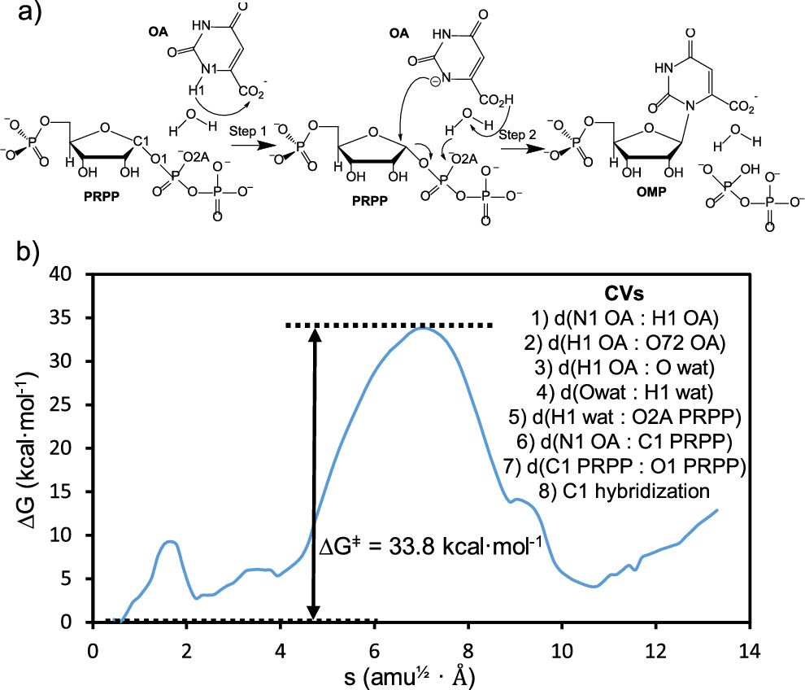

**图8：机制3**（经羧基+水的两步质子接力）**的路径与PMF**。尽管引入水中继，仍需$33.8\,\mathrm{kcal\cdot mol^{-1}}$的能垒，无法与机制1竞争。

从OA的酰胺形式出发的三种可能机制示意图。

**为什么机制1能垒最低？**

通过比较三种机制的反应物态和过渡态的关键几何参数（表S1），发现：

| 参数 | 机制1（R/TS） | 机制2（R/TS） | 机制3（R/TS） |
|------|--------------|--------------|--------------|
| $d$(N1-C1) / Å | 3.38 / **2.34** | 3.72 / 2.22 | 3.66 / 2.53 |
| ∠(N1-C1-O1) / ° | 153 / **166** | 125 / 153 | 131 / 149 |
| $d$(O1-Mg²⁺) / Å | 2.22 / **2.02** | 2.09 / 2.15 | 2.36 / 2.20 |

**机制1的优势**：
1. **反应物态预组织更好**：N1-C1距离更短（3.38 Å），亲核攻击角度更接近线性（153°）
2. **过渡态几何更理想**：∠(N1-C1-O1)达到166°，接近$S_N$2理想角度（180°）
3. $\ce{Mg^{2+}}$ **对离去基团O1的静电稳定更强**：TS时距离缩短至2.02 Å

**底物预组织和过渡态静电稳定**共同降低了活化能垒。

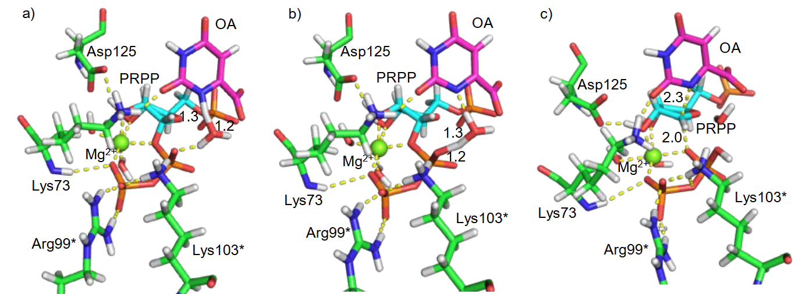

**图S8：三种机制在反应物态和过渡态的关键几何参数对比**。展示N1-C1距离、C1-O1距离、亲核攻击角度以及$\ce{Mg^{2+}}$-O1距离等关键参数在三种机制中的差异。机制1（水介导质子转移）的反应物态预组织最优，过渡态几何最接近理想的$S_N$2构型，因此具有最低的活化能垒。

### 过渡态结构分析：揭示催化残基的作用

对速率限制步骤（亲核攻击）的反应物态（R）和过渡态（TS）进行距离分析（表2，基于US窗口的平均值）：

| 距离 | R / Å | TS / Å | 变化趋势 |
|------|-------|--------|---------|
| $d$(N1 OA, C1 PRPP) | 3.38±0.18 | 2.34±0.10 | 键形成 |
| $d$(C1 PRPP, O1 PRPP) | 1.43±0.03 | 2.04±0.12 | 键断裂 |
| $d$(O1 PRPP, $\ce{Mg^{2+}}$) | 2.22±0.10 | **2.02±0.07** | **缩短**，稳定负电荷 |
| $d$(O2 PRPP, OD2 Asp125) | 3.05±0.12 | **2.73±0.11** | **缩短**，稳定正电荷 |
| $d$(O3B PRPP, N Lys73) | 3.60±0.20 | **3.43±0.20** | **缩短** |
| $d$(O1B PRPP, NH2 Arg99\*) | 2.98±0.10 | **2.79±0.10** | **缩短** |
| $d$(O2B PRPP, NH1 Arg99\*) | 2.95±0.11 | **2.81±0.10** | **缩短** |
| $d$(O1B PRPP, NZ Lys103\*) | 2.85±0.10 | **2.70±0.09** | **缩短** |
| $d$(O3A PRPP, NZ Lys103\*) | 3.50±0.22 | **2.86±0.16** | **显著缩短** |

#### 关键催化残基的作用

| 元素/残基 | 主要相互作用与R→TS变化 | 作用解读 |
|-----------|-----------------------|----------|
| $\ce{Mg^{2+}}$ | $d$(O1 PRPP, $\ce{Mg^{2+}}$)由2.22缩短至**2.02 Å** | **静电稳定离去基团负电荷**，防止焦磷酸早退 |
| **Asp125** | $d$(O2 PRPP, OD2 Asp125)由3.05缩短至**2.73 Å** | **稳定C1形成的氧碳正离子正电荷**，并锁定核糖取向 |
| Lys73 | $d$(O3B PRPP, N Lys73)由3.60缩短至**3.43 Å** | **加强对β-磷酸的正电性夹持**，抑制离去基团震荡 |
| Arg99\* | 多个O···NH距离普遍缩短至~2.8 Å | **跨亚基提供双正电荷网**，协同维持焦磷酸负电荷分布 |
| Lys103\* | $d$(O3A PRPP, NZ Lys103\*)由3.50缩短至**2.86 Å** | **驱动催化环闭合**，封住活性位点并**限制溶剂进入** |
| Arg99\*+Lys103\* | 见表中所有O1B/O2B/O3A距离同时缩短 | **双重作用**：静电稳定 + 机械式“咬合”闭环 |

催化环整体中Lys103\*与O3A变化最显著；**催化环在TS进一步闭合**，形成“舱门”屏蔽溶剂扰动。

#### 突变研究的合理化解释

参考文献中Lys73A/Q、Lys103A与Asp125N等突变均导致$k_{\text{cat}}$显著降低，本研究的距离分析和自由能计算给出统一解释：这些保守残基与$\ce{Mg^{2+}}$共同构成稳定焦磷酸负电荷与核糖正电荷的静电网络，突变会削弱上述作用，使得过渡态的电荷分布无法被充分稳定、催化环也难以闭合，最终抬高活化能垒并造成实验观测的速率损失。

---

## 关键结论与批判性总结

### 关键结论

- **首次提供了OPRTase催化反应的完整原子级描述**：结合高分辨率晶体结构、长时间MD模拟和高级QM/MM自由能计算
- **确立了水介导的质子转移机制**：水分子作为质子中继，从N1(OA)经$\ce{H3O+}$中间体到O2A(PRPP)，随后亲核攻击
- **理论与实验定量吻合**：计算的活化自由能（$16.7\,\mathrm{kcal\cdot mol^{-1}}$）与实验（$15.5\,\mathrm{kcal\cdot mol^{-1}}$）吻合度极高，验证了机制的准确性
- **阐明了保守残基的催化作用**：Lys73、Asp125、Arg99\*、Lys103\*和$\ce{Mg^{2+}}$通过**静电稳定过渡态**和**维持催化环闭合**发挥关键作用
- **揭示了OA互变异构形式的命运**：酰胺形式在酶中仍比亚氨酸形式稳定约$20\,\mathrm{kcal\cdot mol^{-1}}$，排除了亚氨酸形式作为反应底物的可能
- **催化环的动态行为至关重要**：柔性催化环（残基99-109）的开-闭运动控制底物进入、反应进行和产物释放

### 科学意义与方法学优势

- **多层次结构描述**：X射线晶体学提供高分辨率静态结构，MD模拟揭示动态构象变化，QM/MM结合量子力学精度和统计力学采样，三者相互验证、互为补充
- **方法学创新**：展示了**自适应弦方法结合路径集合变量**在探索复杂酶促反应自由能面方面的强大能力，虽需选择集合变量但无需预先指定反应坐标，可在多维空间中自动搜索最小自由能路径
- **热力学严谨性**：FEP精确计算互变异构体相对稳定性，自由能曲线定量描述反应能垒，统计不确定度评估保证结果可靠性
- **机制区分能力强**：系统比较三种可能机制，定量能垒计算排除不可行路径，过渡态几何分析验证化学合理性
- **定量预测与实验吻合**：计算能垒（$16.7\,\mathrm{kcal\cdot mol^{-1}}$）与实验值（$15.5\,\mathrm{kcal\cdot mol^{-1}}$）的良好一致性验证了方法的可靠性
- **为药物设计提供结构基础**：详细的过渡态结构信息为**设计针对疟疾、结核病和癌症的OPRTase抑制剂**提供了蓝图
- **理解酶催化的普适原理**：揭示了**蛋白质环境预组织、静电稳定和动态构象控制**在酶催化中的协同作用

### 潜在局限性

- **QM方法选择**：PM6是折衷方案（精度vs计算成本），虽经M06-2X/6-311+G(2df,pd)单点能校正，但更高级别方法（如CCSD(T)）可能改善能垒精度。DFT对氢键和色散作用的描述存在系统误差，可能影响对$\ce{Mg^{2+}}$-PRPP复合物等体系的描述
- **采样限制**：QM/MM路径优化可能遗漏其他低能路径，虽探索了三种主要机制但仍可能存在其他次要通道。100 ns MD模拟可能未完全采样稀有构象事件，伞形采样窗口密度影响自由能曲线精度
- **环境简化**：忽略了晶体环境的影响，未考虑温度和pH的动态变化。量子隧穿效应（质子转移）未显式处理，所有计算在298 K进行，生理温度（310 K）下的行为可能略有不同
- **力场参数**：GAFF对有机磷化合物的参数可能不够精确，PRPP的参数化基于小分子类比而非针对性优化
- **亚基协同性的简化处理**：仅模拟了一个活性位点的反应，未显式考虑两个亚基之间的动态偶联和交替催化的完整循环

### 未来研究方向

- **抑制剂筛选与设计**：利用TS结构进行**虚拟筛选**或**从头设计**TSA抑制剂，针对疟疾、结核病和癌症OPRTase的种间差异进行选择性优化
- **其他PRTases的机制比较**：将方法学扩展到其他磷酸核糖转移酶（如HGPRT、APRT），揭示该酶家族催化机制的**保守性和多样性**
- **突变体的理论预测**：对Lys73、Asp125、Lys103等残基的突变体进行QM/MM计算，**定量预测活性变化**，指导蛋白质工程
- **长时间尺度动力学**：使用增强采样方法（如REMD、metadynamics）研究**催化环开-闭转换的完整动力学**及其与底物/产物结合/解离的耦合
- **种间差异的结构基础**：比较人源、疟原虫源和结核杆菌源OPRTase的过渡态，**寻找选择性抑制的结构特征**

详细的计算方法、模拟参数设置和Q&A解答，请参阅[附录文档](2025-12-14-oprtase-reaction-mechanism-附录.md)。
