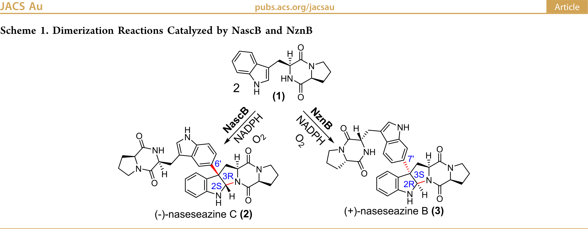
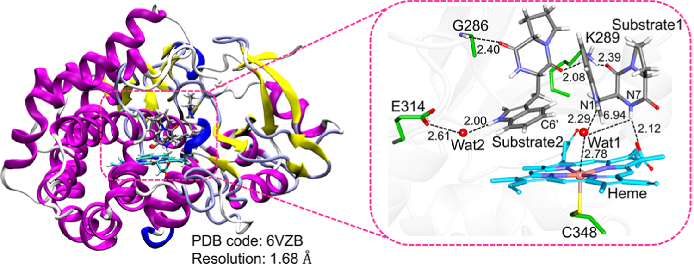
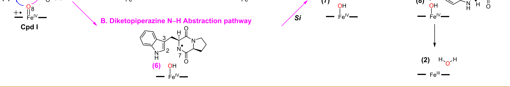
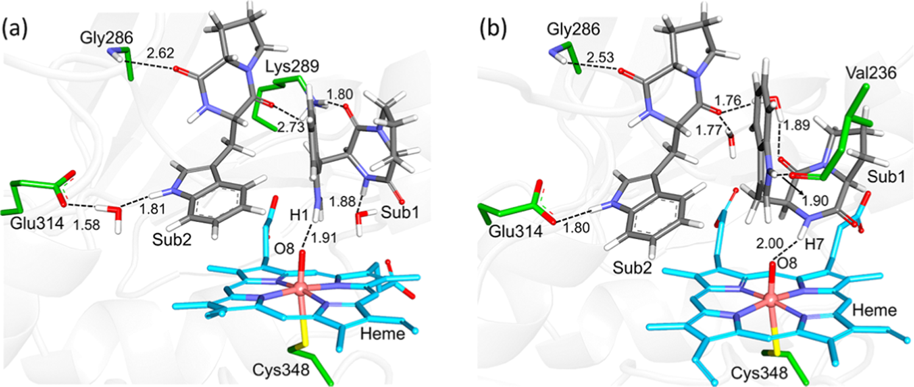
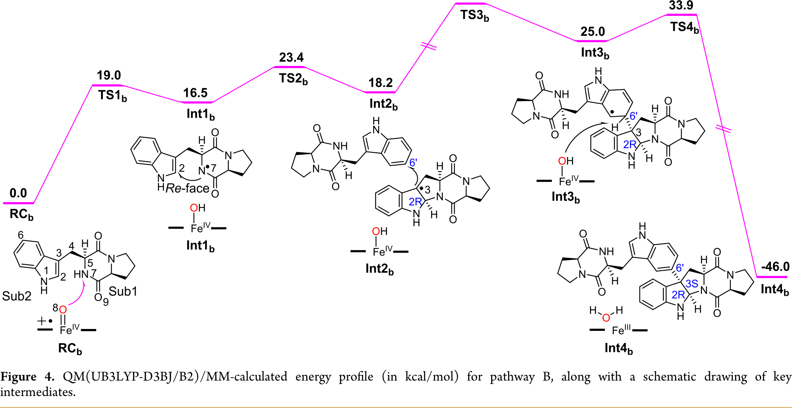
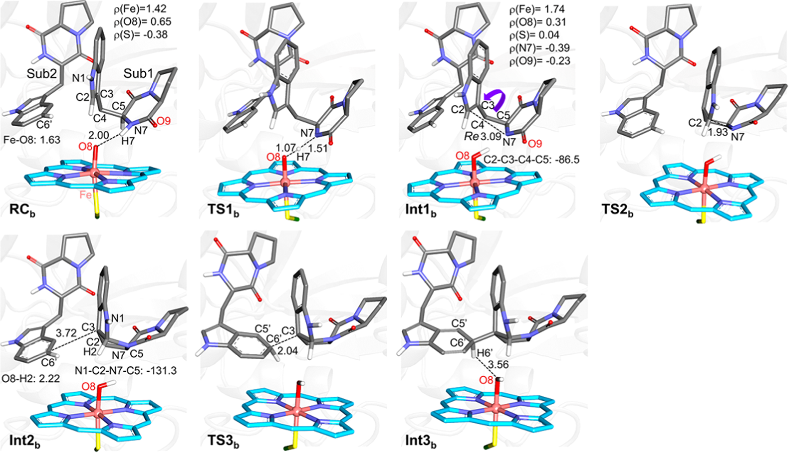
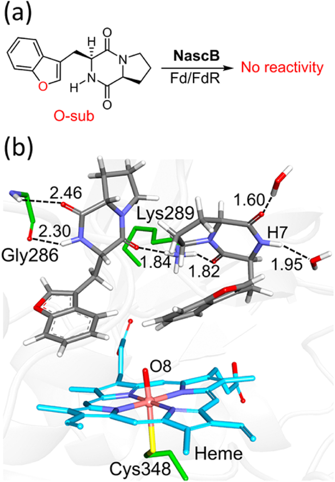
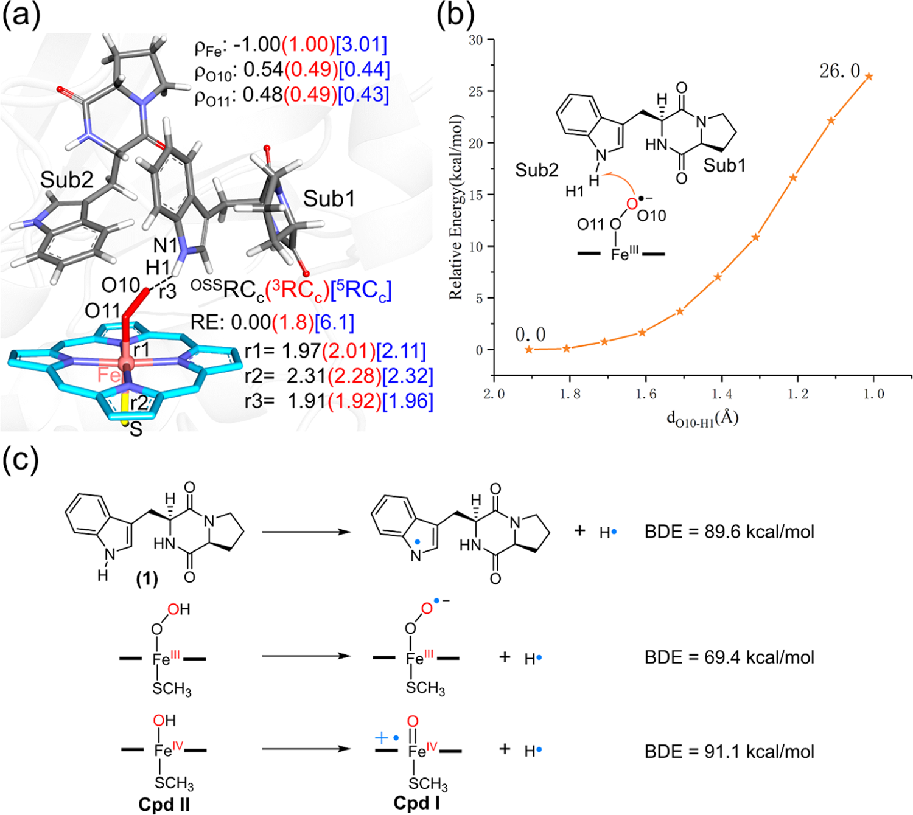

# 底物构象转换决定P450酶的立体选择性：分子动力学揭示二聚化反应的精妙机制

## 本文信息

- **标题**：Substrate Conformational Switch Enables the Stereoselective Dimerization in P450 NascB: Insights from Molecular Dynamics Simulations and Quantum Mechanical/Molecular Mechanical Calculations
- **作者**：Tai-Ping Zhou, Jianqiang Feng, Yongchao Wang, Shengying Li,* and Binju Wang*
- **发表时间**：2024年4月9日
- **单位**：厦门大学固体表面物理化学国家重点实验室、理论与计算化学福建省重点实验室，中国；山东大学微生物技术国家重点实验室，中国
- **期刊**：JACS Au 2024, 4, 1591−1604
- **DOI**：https://doi.org/10.1021/jacsau.4c00075
- **引用格式**：Zhou, T.-P.; Feng, J.; Wang, Y.; Li, S.; Wang, B. Substrate Conformational Switch Enables the Stereoselective Dimerization in P450 NascB: Insights from Molecular Dynamics Simulations and Quantum Mechanical/Molecular Mechanical Calculations. *JACS Au* **2024**， *4*, 1591−1604.

## 摘要

> P450 NascB催化cyclo-(L-tryptophan-L-proline) (1)的偶联反应，通过**分子内C−N键形成**和**分子间C−C偶联**生成(−)-naseseazine C (2)。透彻理解其催化机制对于工程化或设计P450催化的C−N二聚化反应至关重要。通过结合MD模拟、QM/MM计算和增强采样方法，我们系统评估了近期研究提出的多种可能机制。研究表明，**最有利的反应路径始于从N7−H向Cpd I的氢原子转移**。随后，底物自由基发生关键的**构象转换**，从底物1中N7的Re-face转换到Si-face。底物1的Si-face构象通过**蛋白质环境**和**吲哚环与血红素卟啉之间的π−π堆积相互作用**得到稳定。接下来，底物1自由基与底物2之间通过**自由基攻击机制**发生**分子间C3−C6′键形成**。**底物1自由基的构象转换不仅降低了分子间C3−C6′键形成的能垒，还产生了与实验观察一致的正确立体选择性**。此外，我们评估了铁-超氧物种的反应性，表明其活性不足以引发从底物吲哚NH基团的氢原子夺取。我们的模拟提供了关于P450酶如何精确控制分子内C−N环化和分子间C−C偶联的全面机制见解。当前发现与现有实验数据一致，**强调了底物动力学在控制P450催化中的关键作用**。

### 核心结论

- **构象转换是关键**：底物自由基从Re-face到Si-face的构象转换（能垒仅6.3 kcal/mol）是实现正确立体选择性的决定性步骤
- **反应路径确定**：最有利路径为N7−H氢原子转移到Cpd I（pathway B），而非N1−H转移（pathway A）
- **能垒计算吻合实验**：计算得到的活化自由能垒为19.0 kcal/mol（从N7−H），远低于从N1−H的路径（13.8 kcal/mol的HAA后无法继续反应）
- **蛋白质环境至关重要**：Val236、Lys289等残基通过氢键和疏水相互作用稳定Si-face构象，π−π堆积进一步稳定了构象
- **铁-超氧物种不参与**：ferric-superoxide物种的反应性不足（能垒超过26.0 kcal/mol），无法引发反应

## 背景

色氨酸连接的二聚二酮哌嗪（DKP）衍生物是一类具有独特结构架构和广泛生物活性的天然产物，展现出**抗癌、抗肿瘤、抗病毒和神经保护活性**。细胞色素P450酶（CYPs），作为一个依赖血红素的酶超家族，已被证明在DKPs的生物合成中起到关键作用。

近期，两种同源P450酶**NascB和NznB**被鉴定可催化cyclo-(L-tryptophan-L-proline) (1)的二聚化，分别生成(−)-naseseazine C (2)和(+)-naseseazine B (3)。这些转化涉及**分子内C−N偶联**和**分子间C−C偶联**，这是P450催化中独特的反应类型。

**Scheme 1：NascB和NznB催化的二聚化反应**。NascB催化生成(−)-naseseazine C (2)，而同源酶NznB生成(+)-naseseazine B (3)，两者具有相反的立体化学。

Qu及其合作者表征了另一种同源酶NasF5053，它对(1)表现出高催化活性。值得注意的是，双突变体S284A-V288A主要生成化合物(2)。该突变体与天然底物复合物的高分辨率晶体结构（1.68 Å）显示，**活性位点被两个(1)分子占据，每个占据一个独立的口袋**。底物1通过一系列氢键网络（来自K289残基）固定，而底物2则通过G286和E314稳定。

**图1：NasF5053的晶体结构**（PDB ID: 6VZB）与两个底物(1)的复合物，右侧框显示活性位点的放大视图。关键氢键用虚线表示，距离以Å为单位。可以看到**底物1的吲哚N1−H接近血红素Fe**（约2.91 Å），而**底物2位于另一个口袋**，通过Gly286和Glu314稳定。

### 关键科学问题

尽管前期研究提供了机制见解，但P450催化DKPs生物合成的分子机制尚未完全阐明，特别是关于以下几个关键问题：

- **氢原子夺取的位点**：从吲哚N1−H（pathway A）还是从二酮哌嗪N7−H（pathway B）？晶体结构显示N1−H更接近Cpd I，但MD模拟表明底物可能重新定位使N7−H靠近
- **立体选择性的控制**：如何确保N7自由基从Si-face攻击C2=C3双键，生成正确的S构型？
- **蛋白质环境的作用**：蛋白质环境如何影响区域选择性和立体选择性的C−N和C−C偶联？
- **构象动力学的重要性**：底物和中间体的构象变化在催化循环中起什么作用？

这些问题的解答需要超越静态晶体结构和气相DFT模型计算，**必须结合蛋白质环境、动力学采样和精确的QM/MM能量计算**。

### 创新点

- **多尺度计算策略**：结合200 ns MD模拟、QM/MM几何优化、umbrella sampling增强采样，系统探索了反应机制
- **蛋白质环境的显式处理**：首次全面考虑了保守残基（Lys73、Asp125、Arg99、Lys103）、催化环的柔性、活性位点水分子等因素
- **构象转换的发现**：揭示了底物自由基Re-face到Si-face的构象转换是控制立体选择性的关键步骤，这一机制在之前研究中被忽略
- **机制的定量比较**：通过精确的能垒计算排除了多种可能路径，确定了最有利的反应机制
- **铁-超氧物种的评估**：证明了ferric-superoxide物种不参与反应，排除了一种可能的氧化剂

---

## 研究内容

针对上述科学问题，本研究系统评估了两种可能的反应机制：

**Scheme 2：P450 NascB催化二聚化的两种可能机制**。**Pathway A**：从吲哚N1−H夺取氢原子，然后进行分子内C−N环化和分子间C−C偶联；**Pathway B**：从二酮哌嗪N7−H夺取氢原子，随后的反应路径类似。本研究通过QM/MM计算评估了这两条路径的可行性。

### 计算方法概述

本研究采用多层次计算策略：

**1. 分子动力学**（MD）**模拟**
- 体系设置：基于晶体结构（PDB ID: 6VZB），补全缺失残基，建模Cpd I物种
- 力场：蛋白质使用AMBER ff14SB，底物使用GAFF，Cpd I参数来自文献
- 模拟时长：三次独立的200 ns NPT系综模拟，用于采样底物结合构象

**2. QM/MM计算**
- QM区域：血红素卟啉、Cpd I的氧原子、两个底物分子、近端半胱氨酸（作为−SCH3）
- QM方法：UB3LYP-D3BJ泛函，几何优化使用def2-SVP基组（B1），单点能使用def2-TZVP（B2）
- MM区域：蛋白质、反离子和12 Å内的溶剂水分子
- 嵌入方案：电子嵌入（electronic embedding）考虑蛋白质环境对QM区的极化效应

**3. Umbrella sampling增强采样**
- 集合变量（CV）：C2−C3−C4−C5二面角（−90.6°到110.4°）
- 窗口间隔：3°
- 每窗口模拟：10 ns，力常数200 kcal/mol/Å
- 分析方法：加权直方图分析方法（WHAM）构建势能均值力（PMF）

**图2：Cpd I与底物的QM/MM优化活性位点结构**。(a) Conf-a构象：底物1的吲哚N1−H与Cpd I形成氢键（1.91 Å），底物1通过Lys289稳定；(b) Conf-b构象**：70 ns MD后，底物1重新定位，**DKP N7−H与铁-氧形成氢键**（2.00 Å），底物1通过Val236稳定。两种构象中**底物2的位置变化较小**。

### 底物结合模式：两种关键构象

三次独立的200 ns MD模拟揭示了底物1（Sub1）的**两种代表性结合模式**：

**Conf-a**（0-70 ns）**：
- 吲哚N1−H与Cpd I形成氢键（类似晶体结构）
- 底物1通过Lys289的氢键相互作用稳定
- 这种构象**相对不稳定**，约70 ns后转变为Conf-b

**Conf-b**（70-200 ns）**：
- **DKP N7−H与铁-氧**（FeIV=O）**形成氢键**
- 底物1通过Val236的氢键相互作用稳定
- 底物2（Sub2）位置变化较小
- 这种构象更稳定，**暗示N7−H可能是氢原子夺取的位点**

### Pathway A：吲哚N1−H氢夺取（被排除）

基于Conf-a构象，我们首先探索了从吲哚N1−H夺取氢原子的pathway A。

**图3：Pathway A的QM/MM能量曲线**。从N1−H的氢原子夺取能垒为13.8 kcal/mol，生成吲哚自由基中间体Int1a（相对于RCa高3.1 kcal/mol）。

**HAA步骤**（RCa → TS1a → Int1a）**：
- 能垒：13.8 kcal/mol
- 产物Int1a能量：比RCa高3.1 kcal/mol
- 自旋布居分析：自由基离域在吲哚环上，C3（−0.43）和N1（−0.22）上有显著布居

然而，**从Int1a出发的所有可能路径都动力学上不可行**：

1. **OH反弹到N1**：能垒超过30.0 kcal/mol
2. **OH反弹到C3**：能垒超过40.0 kcal/mol（底物定位不利）
3. **从N7−H夺取氢生成双自由基**：能垒超过50.0 kcal/mol
4. **与Sub2的C3−C6′键形成**：能垒超过50.0 kcal/mol

**质子化方案也不可行**：
- 吲哚自由基的pKa比实验环境（~7.5）低约4.8单位
- 质子化是吸热的（6.55 kcal/mol）
- QM计算显示质子化吲哚自由基在所有反应中都有高能垒

**结论**：Pathway A从N1−H夺取氢原子**会生成死端中间体Int1a**，无法进行后续反应，因此被排除。

### Pathway B：二酮哌嗪N7−H氢夺取（最优机制）

基于Conf-b构象，我们探索了从DKP N7−H夺取氢原子的pathway B。

**图4：Pathway B的QM/MM能量曲线**。从N7−H的氢原子夺取（TS1b，19.0 kcal/mol）生成二酮哌嗪自由基Int1b。从Re-face的直接C2−N7环化（TS2b，23.4 kcal/mol）生成R-构型的Int2b，但后续C3−C6′偶联能垒过高（40.0 kcal/mol），表明Re-face路径不可行。

**图5：Pathway B关键物种的QM/MM优化结构**。显示了RCb、TS1b、Int1b、TS2b和Int2b的几何结构，标注了关键原子的自旋布居和键长（单位：Å）。为清晰起见，只显示了相关的氢原子。

**第1步**：HAA从N7−H**（RCb → TS1b → Int1b）**：
- 能垒：19.0 kcal/mol
- 产物Int1b能量：比RCb高16.5 kcal/mol
- 自旋布居分析：一个电子从Sub1转移到卟啉基团，形成Fe(IV)−OH状态

**第2步**：Re-face的直接N7攻击C2**（Int1b → TS2b → Int2b）**：
- 能垒：23.4 kcal/mol（相对于RCb）
- 产物Int2b：C2保持**R构型**（错误立体化学）
- **关键问题**：从Int2b出发的C3−C6′偶联能垒为40.0 kcal/mol，过高！

**Re-face路径失败的原因**：
- Int2b中N1−C2−N7−C5二面角为−131.3°，**新形成的五元环有显著环张力**
- C3−C6′距离较远，不利于偶联

### 关键发现：Re到Si的构象转换

受先前研究启发，我们探索了二酮哌嗪自由基的**柔性构象**。通过umbrella sampling计算C2−C3−C4−C5二面角旋转的PMF**：

**图6：(a) "Re"构象到"Si"构象转换的PMF曲线**。反应坐标为C2−C3−C4−C5二面角。旋转能垒仅**6.3 kcal/mol**，"Si"构象比"Re"构象稳定0.4 kcal/mol。(b) "Si"构象的活性位点结构。二面角增加到101.0°，使N7能够从Si-face攻击C2，**底物1通过Val236和Lys289的氢键以及与血红素的π−π堆积稳定**。

**关键发现**：
- **构象转换能垒很低**：仅6.3 kcal/mol
- **Si-face构象更稳定**：比Re-face低0.4 kcal/mol
- **蛋白质环境的作用**：
  - Val236和Lys289通过氢键稳定
  - 吲哚环与血红素卟啉之间的**π−π堆积相互作用**（距离约3.3 Å）
  - 非键相互作用能：Si-face为−53.5 kcal/mol，Re-face为−55.1 kcal/mol（相当）
- **构象转换的选择性**：只有**自由基**能够轻易转换，未反应的底物1在两种结合模式下都难以转换（热力学不利）

200 ns无约束MD验证了Si-face构象的稳定性（RMSD < 1.5 Å）。

### 从Si-face构象的完整反应路径

**图7：从“Si”构象出发的Pathway B完整能量曲线**。包括N7从Si-face攻击C2（TS2c，21.8 kcal/mol），生成**S-构型**的吡咯并吲哚啉自由基Int2c；随后C3−C6′偶联（TS3c，23.0 kcal/mol）和最后的再芳构化（TS4c，20.9 kcal/mol）。

**从Si-face的反应步骤**：

**步骤2**：N7从Si-face攻击C2**（Int1c → TS2c → Int2c）**：
- 能垒：21.8 kcal/mol（相对于RCb）
- TS2c中C2−N7距离缩短到2.26 Å（从Int1c的3.19 Å）
- 产物Int2c：C2为**S构型**（正确立体化学！）
- Int2c能量：比RCb高2.4 kcal/mol
- 自旋布居：C3位点携带最多自旋布居（−0.62），有利于后续C3−C6′偶联

**步骤3**：分子间C3−C6′偶联**（Int2c → TS3c → Int3c）**：
- 能垒：23.0 kcal/mol（相对于RCb）
- 机制：**自由基介导**，而非阳离子Friedel-Crafts机制
- C3−C6′距离：3.50 Å（远短于C3−C7′的4.84 Å）
- C3−C7′偶联的能垒：30.7 kcal/mol（更高，与实验一致）
- Int3c能量：比RCb高14.7 kcal/mol

**步骤4**：再芳构化**（Int3c → TS4c → Int4c）**：
- 从C6′−H到Cpd II的HAT
- 能垒：20.9 kcal/mol（相对于RCb）
- 最终产物Int4c：比RCb低53.9 kcal/mol（放热）

**图8：Si-face路径关键物种的QM/MM结构**。显示了构象转换后的Int1c（二面角103.2°）、N7攻击C2的TS2c、吡咯并吲哚啉自由基Int2c（C3上自旋−0.62）、C3−C6′偶联的TS3c、以及最终产物Int4c的几何结构和自旋布居。

**Si-face路径的优势**：
- Int2c中C3−C4−N7−C7二面角为174.4°，**环张力显著降低**
- C3−C6′距离更短（3.50 Å vs 5.4 Å in Int2b）
- π−π堆积相互作用进一步稳定Int2c
- **正确的S立体化学**与实验完全一致

### O-取代底物为何无反应性

Qu及其合作者测试了一种O-取代底物（O-sub）类似物，但**未观察到反应性**。为理解这一实验观察，我们进行了200 ns MD模拟。

**图9：(a) NascB中测试的O-取代底物类似物**。(b) MD模拟中Cpd I与O-sub的代表性结构。N7−H远离Cpd I（平均距离约10 Å），取代的氧原子在活性中心不形成任何氢键相互作用。

**MD结果**：
- 体系在60 ns后达到稳定收敛（RMSD分析）
- O-sub的N7−H远离Cpd I（平均距离~10 Å）
- 取代的氧原子**不形成任何氢键**
- **结论**：O-底物的不适当结合构象使其极不利于从N7−H引发HAA，解释了其无反应性

### 铁-超氧物种的反应性评估

最近研究表明铁-超氧中间体可能作为氧化剂促进环状二肽的二聚化。我们评估了ferric-superoxide (FeIII−OO•−)介导的HAA可行性。

**图10：(a) 不同自旋态的ferric-superoxide物种的QM/MM优化结构**。OSS、3和5分别表示开壳层单重态、三重态和五重态。基态为OSS，Fe上自旋布居−1.00，O10和O11上分别为0.54和0.48。(b) 从OSSRCc的HAA扫描能量曲线，估计能垒超过26.0 kcal/mol。(c) 计算的键解离能（BDE）**：N1−H1键（89.6 kcal/mol），FeIII−OOH的O−H键（69.4 kcal/mol），Cpd II的O−H键（91.1 kcal/mol）。

**关键发现**：
- 基态为开壳层单重态（OSS）
- 从吲哚N1−H的HAA能垒超过26.0 kcal/mol
- 从DKP N7−H的HAA能垒超过29.9 kcal/mol（N7−H键更强）
- FeIII−OOH的O−H BDE比Cpd II低21.7 kcal/mol
- **结论**：ferric-superoxide物种**缺乏足够的反应性**引发HAA，不参与反应

---

## Q&A

- **Q1**：为什么之前的计算研究未能准确描述OPRTase的反应机制？
- **A1**：以往的计算优化在**真空或简化模型**中进行，忽略了多个关键因素**：**蛋白质环境的静电效应**（保守残基Lys73、Asp125、Arg99、Lys103和$\ce{Mg^{2+}}$对过渡态的稳定作用），**蛋白质的柔性**（催化环的开-闭动力学），**底物互变异构形式的相对稳定性**（需要FEP计算），以及**活性位点水分子**作为质子中继的作用。本研究通过结合高分辨率晶体结构、长时间MD模拟和QM/MM自由能计算，首次全面考虑了这些因素。
- **Q2**：构象转换在多大程度上降低了能垒？
- **A2**：构象转换对能垒的影响是决定性的。从Re-face直接进行的C3−C6′偶联能垒为**40.0 kcal/mol**，而从Si-face进行同样反应的能垒为**23.0 kcal/mol**，降低了**17 kcal/mol**。更重要的是，Int2c（Si-face产物）的能量（2.4 kcal/mol相对于RCb）远低于Int2b（Re-face产物，18.2 kcal/mol），这主要是因为Si-face构象显著释放了五元环的环张力（二面角从−131.3°变为174.4°），并且得益于π−π堆积的额外稳定。
- **Q3**：为什么底物必须先形成自由基才能进行构象转换？
- **A3**：MD模拟表明，未反应的底物1在两种结合模式（Conf-a和Conf-b）下的构象转换都是**热力学不利的**。这是因为**：（1）完整底物的电子结构更刚性，旋转能垒更高；（2）DKP环和吲哚环之间的相互作用在中性底物中更强；（3）氢原子夺取后形成的自由基具有更大的柔性，sp²杂化的N7中心使得旋转更容易。此外，自由基的离域电子结构允许更好的适应蛋白质环境，通过π−π堆积与血红素相互作用。
- **Q4**：这种机制对P450工程有什么启示？
- **A4**：本研究的机制见解为P450工程提供了几个重要启示**：（1）**底物动力学至关重要**：设计催化口袋时应考虑底物和中间体的动态行为，而非仅基于静态晶体结构；（2）**π−π相互作用可调控**：通过改变血红素周围的芳香族残基，可以调节底物/中间体的构象偏好；（3）**氢键网络决定选择性**：Val236和Lys289等残基对于稳定特定构象至关重要，突变这些位点可能改变立体选择性；（4）**识别正确的HAA位点**：N7−H而非N1−H是反应的起点，这提示在设计新底物时应优化DKP部分而非吲哚部分的定位。

---

## 关键结论与批判性总结

### 科学意义

- **多尺度模拟策略的验证**：本研究展示了**MD模拟结合QM/MM计算和增强采样**在揭示复杂酶促反应机制方面的强大能力，特别是在需要同时考虑蛋白质环境和电子结构变化时
- **底物动力学的关键作用**：首次明确证明了**底物自由基的构象动力学**是控制P450催化立体选择性的决定性因素，这一发现强调了动态信息在理解酶催化中的重要性
- **机制预测与实验验证**：计算机制与实验观察（立体化学、区域选择性、O-底物的无反应性）完全一致，证明了理论方法的可靠性
- **P450多样性催化的理解**：为理解P450酶如何催化非传统的C−N和C−C偶联反应提供了分子层面的洞察

### 潜在局限性

- **QM方法的精度**：UB3LYP-D3BJ虽然经过验证适用于P450体系，但更高级别的方法（如CCSD(T)或多参考方法）可能进一步改善过渡态能垒的精度
- **采样的完整性**：虽然进行了200 ns MD和umbrella sampling，但仍可能存在未被采样到的其他低能构象或反应路径
- **环境简化**：未考虑晶体堆积效应、pH动态变化、温度效应（所有计算在298 K）等因素
- **量子隧穿效应**：质子转移步骤可能涉及量子隧穿，本研究未显式处理

### 未来研究方向

- **亚基协同性**：NascB是同二聚体，两个亚基可能存在协同催化，需要研究完整二聚体的催化循环
- **突变体研究**：基于构象转换机制，设计突变体（如改变Val236、Lys289）来反转或调节立体选择性
- **底物拓展**：利用本研究建立的机制理解，设计新的底物或改造酶以催化非天然DKP二聚化
- **与NznB的比较**：研究同源酶NznB如何产生相反立体化学的产物，可能涉及不同的构象稳定机制

---

**本文详细的计算方法、补充数据和技术细节请参见[附录文档](2025-12-15-p450-nascb-stereoselective-dimerization-appendix.md)**。
