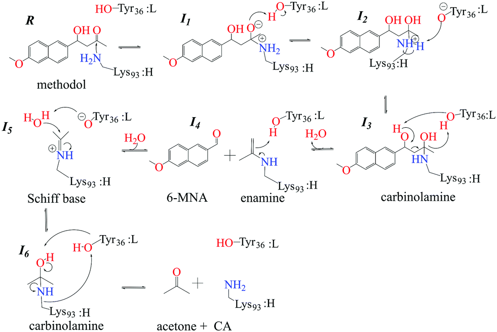
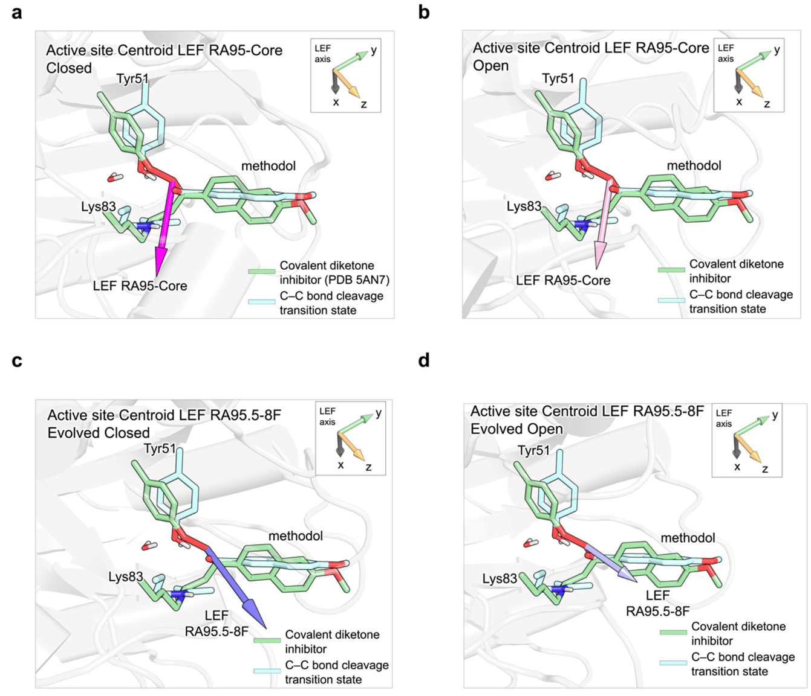

# 设计逆醛缩酶RA95的远端突变研究 - 技术附录

> 本文档是主文档《设计逆醛缩酶RA95的远端突变研究：环动力学调控、电场优化与速率限制步骤的转移》的技术附录，包含详细的计算方法参数、完整数据表格和深度技术问答。

## 本文信息

- 标题：**Distal Mutations in a Designed Retro-Aldolase Alter Loop Dynamics to Shift and Accelerate the Rate-Limiting Step**
- 作者：**Serena E. Hunt, Cindy Klaus, Aqza E. John, Niayesh Zarifi, Alec Martinez, Ferran Feixas, Marc Garcia-Borràs, Michael C. Thompson, Roberto A. Chica**
- 通讯作者：**Roberto A. Chica**
- 发表时间：**2025年8月13日**
- 单位：**渥太华大学化学与生物分子科学系和催化研究与创新中心（加拿大）、赫罗纳大学计算与催化化学研究所（西班牙）、加州大学默塞德分校化学与生物化学系（美国）**
- 引用格式：**Hunt, S. E., Klaus, C., John, A. E., Zarifi, N., Martinez, A., Feixas, F., Garcia-Borràs, M., Thompson, M. C., & Chica, R. A. (2025). Distal Mutations in a Designed Retro-Aldolase Alter Loop Dynamics to Shift and Accelerate the Rate-Limiting Step. *J. Am. Chem. Soc.*, *147*, 30723-30736. https://doi.org/10.1021/jacs.5c05134**
- 数据可用性：**分子动力学轨迹和参数文件已存放在Zenodo（DOI: 10.5281/zenodo.16281142）**

## 反应机制详解

上图展示了逆醛缩酶催化的完整反应机制（通用示意），涉及6个关键中间体（I1-I6）。**重要注意事项**：图中标注的残基编号为示意性编号，在RA95.5-8F中，实际的催化残基是**Lys83**（催化亲核试剂）和**Tyr51**（质子供体，催化四联体成员之一）：

- R → I1：底物methodol与催化赖氨酸（RA95.5-8F中为Lys83）的氨基发生亲核加成，形成醇胺中间体，酪氨酸残基（RA95.5-8F中为Tyr51）通过氢键稳定过渡态
- I1 → I2：Tyr36-Lys93质子转移网络重新分配电荷，使羟基成为更好的离去基并为后续构象调整预组织活性位点
- I2 → I3：进一步的质子迁移和水分子协同作用生成图中标注的氨基醇（carbinolamine）I3，为C-C键断裂提供正确的几何构型
- I3 → I4：**C-C键断裂**（本研究的焦点步骤），产生6-甲氧基-2-萘甲醛（6-MNA）与**烯胺中间体**（enamine）中间体，Tyr36的羟基作为质子供体稳定离去基
- I4 → I5：烯胺在Tyr36提供质子并吸收水分子的条件下，转化为图示的**Schiff base**（I5），即赖氨酸与底物之间的亚胺中间体
- I5 → I6：Schiff base水解生成第二个醇胺（I6），随后分解为丙酮并再生活性赖氨酸，完成催化循环

本研究通过溶剂粘度效应实验和量子力学计算，重点研究了**I3 → I4步骤**（C-C键断裂）的能垒变化，以及远端突变如何通过优化局部电场方向加速这一化学转化步骤。

## 详细计算方法

### 分子动力学模拟参数

#### 初始结构准备

##### 晶体与模型来源

本研究涉及的4个变体中，**3个有实验晶体结构**（RA95、RA95-Shell、RA95.5-8F），**1个通过计算建模**（RA95-Core）。所有变体均为**无配体结合的apo形式**，用于研究蛋白质在**无底物状态下的构象动力学**。

| 体系 | 是否新测 | PDB编号/来源 | 构象 | 备注 |
|------|---------|-------------|------|------|
| RA95 | **本研究解析** | 9MYA | Apo，空间群P21212，1.89 Å | 以无底物构象提供基准 |
| RA95-Shell | **本研究解析** | 9MYB | Apo，空间群P21212，1.77 Å | 展示远端突变诱导的L1极端开放态 |
| RA95.5-8F | 文献 | 5AOU（Apo） 5AN7（共价抑制剂） | 5AOU：无底物 5AN7：与二酮抑制剂共价结合 | **Loop L1残基58-63缺失**（高度无序） 5AN7用于Theozyme模型与LEF对齐 |
| RA95（抑制剂复合物） | 文献 | 4A29 | Covalent inhibitor | 作为分子置换搜索模型 |
| RA95-Core | **计算模型** | 基于9MYA，经Triad引入 12个活性位点突变 | Apo | 因未能获得晶体，仅用于MD/LEF分析 |

**说明**：除9MYA与9MYB为本研究首次报告外，其余结构均来自早期定向进化研究。本文在正文中统一称为“无底物结构”或“抑制剂复合物”，但在附录明确列出来源，以便追溯。

**为什么RA95-Core没有晶体结构**？RA95-Core是本研究设计的回溯变体（deconvolution construct），将RA95.5-8F的远端突变回复到RA95，仅保留活性位点突变。这个变体之前未被表征，因此无现成晶体结构。**为什么不对RA95-Core做晶体学**？本研究重点是通过MD模拟研究动力学差异，而非静态结构，计算建模结合MD模拟可以提供足够的构象动力学信息。

##### 详细建模流程

**1. RA95.5-8F缺失残基补全（MODELLER）**

RA95.5-8F晶体结构（5AOU）中Loop L1的残基58-63因构象异质性高而缺失电子密度，需要使用**MODELLER 10.4**的AutoModel模块进行补全。建模输入包括5AOU晶体结构作为模板和RA95.5-8F的完整序列，建模区域仅限于缺失的残基58-63，其他区域完全保持晶体坐标不变。软件生成5个候选模型后，选择DOPE（Discrete Optimized Protein Energy）评分最低的模型作为最终结构，并通过Ramachandran图检查Loop几何合理性以及与周围残基的立体冲突。

**2. RA95-Core突变建模（Triad软件）**

RA95-Core变体从RA95晶体结构（9MYA）出发，使用**Triad蛋白设计软件v2.1.2**的sequenceDesign模块引入12个活性位点突变（V51Y、E53L、T83K、N90D、S110N、K135E、G178T、M180Y、R182M、D183N、K210L、L231M）。软件逐个引入突变，每次突变后使用Dunbrack 2010 backbone-dependent rotamer库优化周围残基的侧链构象，并应用Rosetta能量函数进行局部能量最小化以消除立体冲突。最终模型经过验证，确保突变位点的侧链几何和氢键网络符合化学规则。

##### 质子化状态预测

所有变体（包括晶体结构和计算模型）统一使用**H++服务器**（http://biophysics.cs.vt.edu/H++）预测pH 7.0条件下的质子化状态。输入为PDB结构文件，计算参数设置为pH 7.0、内部介电常数10、外部介电常数80、盐浓度0.15 M。服务器输出每个可质子化残基（His、Glu、Asp、Lys、Arg、Cys、Tyr）的质子化状态，其中最关键的是催化残基**Lys83采用去质子化形式**（NH₂），作为亲核试剂参与反应；His残基的质子化根据pKa预测确定；大多数Glu/Asp残基采用去质子化形式（COO⁻）。

#### MD模拟参数设置

| 参数类别 | 具体设置 |
|---------|---------|
| **软件与力场** | |
| 软件 | Amber 2020 (http://ambermd.org/) |
| 蛋白质力场 | AMBER19SB |
| 水模型 | OPC (Optimal Point Charge, 4-point water model) |
| 参数化工具 | LEaP程序（Amber套件） |
| **体系设置** | |
| 盐浓度 | 0.15 M $\ce{NaCl}$（$\ce{Na+}$和$\ce{Cl-}$反离子中和蛋白电荷） |
| 水盒类型 | 八面体盒子，周期性边界条件 |
| 水盒边界 | 距蛋白质表面10 Å |
| **平衡与生产** | |
| 能量最小化 | 最陡下降法，目标最大力1000 $\mathrm{kJ\cdot mol^{-1}\cdot nm^{-1}}$ |
| 加热阶段 | 0 → 300 K，240 ps，NVT系综 |
| NPT平衡 | 300 K，10 ns，恒压恒温 |
| 生产运行 | 每个变体1000 ns × 3次独立重复（总计3 μs/变体） |
| 时间步长 | 2 fs |
| 轨迹保存频率 | 每20 ps保存一帧（用于PCA分析） |
| **温度与压力控制** | |
| 温度 | 300 K |
| 温控算法 | Langevin恒温器 |
| 压力 | 1 bar |
| 控压算法 | Berendsen barostat |
| **非键相互作用** | |
| 静电计算 | PME (Particle Mesh Ewald)，长程截断>10 Å |
| 范德华截断 | 10 Å |
| **几何约束** | |
| 键长约束 | SHAKE算法（所有涉及氢原子的键） |

#### PCA与聚类分析

| 分析工具 | 参数与方法 |
|---------|----------|
| **PCA分析** | |
| 软件 | pyEMMA 2 |
| 输入数据 | Cα原子接触矩阵（contact matrix） |
| 采样 | 每20 ps抽取一帧，约50,000帧/变体 |
| 主成分 | PC1和PC2解释最大方差 |
| **聚类分析** | |
| 算法 | 距离型k-means（pyEMMA实现） |
| 集合变量 | L1-L6 Cα距离（残基58与185） |
| 采样频率 | 每2 ns抽取一帧，共1500帧/变体 |
| 构象分类 | 关闭态（13±1 Å）、部分开放态（18±2 Å）、开放态（23±3 Å） |
| **质心结构** | 每个聚类的几何中心结构，用于后续LEF和QM计算 |

### 局部电场（LEF）计算方法

#### 基本设置

| 参数 | 设置与说明 |
|------|----------|
| **计算软件** | TUPÃ v1.0（J. Comput. Chem. 2022, 43, 1113-1119） 专用于分子模拟中的电场分析 |
| **计算点位置** | 与RA95.5-8F共价抑制剂（PDB: 5AN7）中羟基氧原子位置重合 代表C-C键断裂过渡态的关键位置（该氧原子在反应中积累部分负电荷） |
| **包含残基** | 整个蛋白质，**不含催化残基Lys83和Tyr51** 原因：它们直接参与化学反应，其电场贡献通过QM计算单独处理 |
| **输出参数** | 1. 电场强度（矢量模$\|\vec{E}\|$，单位a.u.） 2. 电场方向（三维矢量$(E_x, E_y, E_z)$） |
| **构象采样** | 从MD轨迹中提取质心结构： - RA95：关闭态（主要）、开放态（次要） - RA95.5-8F：关闭态、部分开放态、开放态（三态平衡） |

#### 电场对齐方法

为确保不同变体/构象的电场可比较，所有质心结构都与**RA95.5-8F共价抑制剂晶体结构（PDB: 5AN7）**对齐。**特别说明**：对齐以RA95.5-8F的Lys83与Tyr51主链原子为参考，同时保留PDB:5AN7中共价抑制剂的几何只是为了定义活性口袋坐标；MD/LEF计算全程处于apo态，无底物或抑制剂参与。
虽然MD模拟在apo状态（无配体）下进行，但对齐时使用5AN7作为参考坐标系，以确保LEF计算点的位置一致：

1. **参考结构**：PDB 5AN7（RA95.5-8F与二酮抑制剂共价复合物晶体结构）
2. **对齐方法**：将MD质心结构（apo态）对齐到5AN7，对齐时使用催化残基Lys83和Tyr51
3. **对齐算法**：最小化RMSD（均方根偏差）
4. **LEF计算点位置**：与5AN7中抑制剂羟基氧原子位置重合（代表C-C键断裂过渡态的关键位置）
5. **Theozyme模型对齐**：将theozyme模型（包括Lys83、Tyr51、methodol底物）手动对齐到已对齐的各变体蛋白质结构

#### 电场验证：网格点分析

为验证单点计算的代表性，在活性位点进行了网格扫描：

| 参数 | 设置 |
|------|------|
| **网格中心** | 羟基氧原子位置 |
| **网格范围** | 沿x/y/z轴各±2 Å |
| **网格间距** | 1 Å |
| **网格总点数** | 125个点（5×5×5立方体） |
| **主要结论** | 确认单点电场能有效描述活性位点腔内LEF趋势（见补充图S10） |

#### 电场贡献分析

计算各残基对LEF变化的贡献：

$$
\Delta\vec{E}_{\text{res}} = \vec{E}_{\text{RA95.5-8F}}^{\text{res}} - \vec{E}_{\text{RA95-Core}}^{\text{res}}
$$

其中$\vec{E}_{\text{variant}}^{\text{res}}$是单个残基在该变体中产生的电场矢量。贡献百分比定义为：

$$
\text{Contribution} = \frac{|\Delta\vec{E}_{\text{res}}|}{\sum_{\text{all res}}|\Delta\vec{E}_{\text{res}}|} \times 100\%
$$

**主要发现**：
- **柔性环贡献**（L1、L2、L6、L7）：77%
- **远端突变位点直接贡献**：8%
- **其他区域**：15%

#### 电场方向比较方法

**余弦相似度**（衡量两个电场矢量方向的一致性）：

$$
\cos\theta = \frac{\vec{E}_1 \cdot \vec{E}_2}{|\vec{E}_1||\vec{E}_2|}
$$

- $\cos\theta = 1$：完全平行（最优）
- $\cos\theta = 0$：垂直（无贡献）
- $\cos\theta = -1$：反平行（最差）

**参考系选择**：RA95.5-8F关闭态的LEF方向作为“最优参考”（因为其催化效率最高）

**夹角计算**：
$$
\theta = \arccos\left(\frac{\vec{E}_{\text{variant}} \cdot \vec{E}_{\text{ref}}}{|\vec{E}_{\text{variant}}||\vec{E}_{\text{ref}}|}\right)
$$

### 量子力学计算方法

#### Theozyme模型构建

| 参数 | 详细说明 |
|------|---------|
| **基础结构** | PDB: 5AN7（RA95.5-8F与二酮抑制剂共价复合物） |
| **模型组成** | 1. **Lys83**：催化亲核试剂（截取至Cβ） 2. **Tyr51**：氢键供体（截取至Cβ） 3. **Methodol底物片段**：包含待断裂的C-C键及carbinolamine中间体 |
| **结构编辑** | PyMOL手动编辑： - 补全截断末端氢原子 - 调整键序使模型处于carbinolamine中间体几何 - 生成反应物与过渡态初猜结构 |
| **总原子数** | 约50-60个原子（截取后的精简模型） |
| **电荷与多重度** | 根据carbinolamine中间体质子化状态确定 |

#### DFT计算设置

| 参数类别 | 具体设置 |
|---------|---------|
| **所用软件** | Gaussian 16 Revision C.01 |
| **所用泛函** | (U)B3LYP（非限制性B3LYP） 适用于可能的开壳层体系，如过渡态 |
| **基组选择** | 6-31G(d)（Pople基组，包含d极化函数） 平衡计算精度与成本 |
| **溶剂模型** | CPCM（Conductor-like Polarizable Continuum Model） |
| **溶剂介电常数** | $\varepsilon_r = 8.93$（二氯甲烷） 模拟蛋白质活性位点内部低介电环境 |
| **溶剂腔半径** | UFF（Universal Force Field）原子半径 |

#### 几何优化与频率计算

| 步骤 | 方法 |
|------|------|
| **反应物优化** | (U)B3LYP/6-31G(d)/CPCM - 优化算法：Berny - 收敛标准：最大力 < 0.00045 hartree/bohr |
| **过渡态搜索** | (U)B3LYP/6-31G(d)/CPCM - 反应坐标：C-C键断裂 - TS优化算法：Berny - 初猜：手动拉伸C-C键生成 |
| **频率分析** | 在优化几何上计算Hessian矩阵： - **反应物频率检查**：无虚频（0个负本征值），确认为稳定结构 - **过渡态频率检查**：仅1个虚频（对应C-C键断裂模式）。- **频率数据的主要用途**：提取零点能（ZPE）用于能垒校正 |
| **IRC计算** | （可选）内禀反应坐标验证TS连接正确的反应物和产物 |

> 过渡态是反应坐标上的一阶鞍点，唯一的虚频验证了结构沿反应方向不稳定、垂直方向稳定

#### 外部电场施加（FDB方法）

**FDB（Field-Dependent Barrier）方法**：通过施加不同强度和方向的外部电场，计算能垒对电场的依赖关系。

| 参数 | 设置 |
|------|------|
| **电场来源** | TUPÃ计算得到的各变体/构象LEF矢量 |
| **Gaussian输入** | `Field=X,Y,Z`关键词 例如：`Field=0.001,0.002,0.003`（单位：a.u.） |
| **电场强度范围** | 0（零场参考）至实际LEF强度（约0.008 a.u.） |
| **电场方向** | 使用实际LEF矢量方向 |
| **计算流程** | 1. 零场条件：计算基准能垒 2. 施加各变体LEF：重新优化TS和反应物 3. 计算场依赖能垒：$\Delta E^\ddagger(F)$ |

#### 能垒计算与基组验证

| 能垒定义 | 公式 |
|---------|------|
| **电子能垒** | $\Delta E^\ddagger_{\text{elec}} = E_{\text{TS}} - E_{\text{reactant}}$ |
| **零点能校正** | $\Delta E^\ddagger_{\text{ZPE}} = \Delta E^\ddagger_{\text{elec}} + \Delta\text{ZPE}$ |
| **最终能垒** | 表格中报告的是ZPE校正后的值 |

**基组依赖性验证**（补充表S5）：

| 基组 | 零场能垒 | RA95-Core关闭态 | RA95.5-8F关闭态 | 能垒降低 |
|------|---------|----------------|----------------|---------|
| 6-31G(d) | 15.4 kcal/mol | 6.9 kcal/mol | 1.6 kcal/mol | 5.3 kcal/mol |
| 6-31+G(d,p) | 13.2 kcal/mol | 5.2 kcal/mol | -0.2 kcal/mol | 5.4 kcal/mol |
| 6-311+G(2d,2p) | 11.6 kcal/mol | 3.2 kcal/mol | -1.6 kcal/mol | 4.8 kcal/mol |

**关键结论**：虽然绝对能垒值随基组变化，但**相对趋势一致**（RA95.5-8F能垒比RA95-Core低约5 kcal/mol），支持结论的稳健性。

#### 量子力学能垒计算流程

1. **构建化学子系统并定义反应坐标**：从PDB 5AN7中截取Lys83、Tyr51及与之共价连接的methodol抑制剂片段，补全末端氢原子并在PyMOL中手动编辑键序，使模型保持carbinolamine中间体几何；随后针对待断裂的C-C键生成反应物与过渡态初猜。
2. **DFT优化与频率校验**：使用(U)B3LYP/6-31G(d)/CPCM在Gaussian16中分别优化反应物和过渡态，收敛后进行频率分析以确认反应物无虚频、过渡态仅存在一条与C-C断裂相关的虚频，并提取零点能用于能垒校正。
3. **加载蛋白来源电场并扫描能垒**：将TUPÃ得到的局部电场矢量（各构象平均值）转化为Gaussian的`Field=X,Y,Z`输入，分别施加在Theozyme模型上，再次求取$E_\text{TS}$与$E_\text{reactant}$；必要时调节电场方向与强度做灵敏度测试，从而量化不同构象、不同变体的能垒变化。
4. **验证外推并映射回蛋白背景**：把带电场的Theozyme结构重新与RA95-Core及RA95.5-8F的代表构象对齐，确保电场方向与蛋白质框架一致，再将量化得到的$\Delta E^\ddagger$回填到图5d及附录表格，与实验$k_3$提升倍数做对照，验证远端突变通过电场方向优化实现化学加速。

## 完整数据表格

### 电场强度数据

**局部电场强度**（单位：a.u.，$1~\mathrm{a.u.} = 5.14 \times 10^{11}~\mathrm{V/m}$）

| 变体 | 构象状态 | 平均电场强度 | 标准偏差 |
|------|---------|------------|---------|
| RA95-Core | 关闭态 | 0.0081 | 0.0012 |
| RA95-Core | 开放态 | 0.0077 | 0.0015 |
| RA95.5-8F | 关闭态 | 0.0083 | 0.0011 |
| RA95.5-8F | 开放态 | 0.0058 | 0.0018 |

**关键观察**：
- 电场强度在不同变体间**处于相似的量级**（0.006-0.008 a.u.范围）
- 开放构象的电场强度略低于关闭构象
- **标准偏差表明电场存在构象依赖的涨落**，这与MD模拟观察到的构象异质性一致

### 电场方向数据

**电场矢量夹角**（相对于RA95.5-8F关闭态的电场方向）

| 比较体系 | 构象状态 | 夹角（度） | 余弦相似度 | 解释 |
|---------|---------|-----------|----------|------|
| RA95.5-8F关闭 vs RA95-Core关闭 | 关闭 | 54° | 0.59 | 中等偏差 |
| RA95.5-8F关闭 vs RA95-Core开放 | 开放 | 53° | 0.60 | 中等偏差 |
| RA95.5-8F关闭 vs RA95.5-8F开放 | 开放 | 20° | 0.94 | 高度一致 |

**关键发现**：
- RA95-Core与RA95.5-8F的电场方向偏差约**54°的角度误差**
- 这个方向差异导致C-C键断裂能垒相差**1.5-5 kcal/mol**
- RA95.5-8F内部的开放-关闭转换对电场方向影响较小（仅20°）

### C-C键断裂能垒完整数据

**量子力学计算的活化能垒** $\Delta E^\ddagger$（单位：kcal/mol）

| 体系 | 构象状态 | 能垒 | 相对零电场降低 | 相对RA95-Core降低 |
|------|---------|-----|--------------|----------------|
| **零电场参考**，模型TS（无蛋白） | - | 15.3 | 0 | - |
| RA95-Core | 关闭态 | 6.9 | 8.4 | 0 |
| RA95-Core | 开放态 | 7.3 | 8.0 | 0 |
| RA95.5-8F | 关闭态 | 1.6 | 13.7 | 5.3 |
| RA95.5-8F | 开放态 | 5.8 | 9.5 | 1.5 |
| RA95-Shell | 关闭态 | 7.1 | 8.2 | -0.2 |

**关键解读**：
1. **RA95.5-8F关闭态能垒最低**（**1.6 kcal/mol**），比零电场参考降低**13.7 kcal/mol**，解释了其化学转化速率最快
2. **远端突变的效应完全取决于活性位点环境**：
   - RA95-Core → RA95.5-8F：能垒降低**1.5-5.3 kcal/mol**（显著）
   - RA95 → RA95-Shell：能垒几乎无变化（-0.2 kcal/mol），与实验观察到的$k_\text{cat}$降低一致
3. **构象依赖性显著**：开放态能垒比关闭态高**4.2 kcal/mol**，说明化学转化优先在关闭构象中发生，这解释了为何关闭态对催化至关重要

### LEF残基贡献分析

**对电场变化贡献最大的残基区域**（RA95.5-8F vs RA95-Core）

| 残基区域 | 包含残基 | 贡献百分比 | 特征 |
|---------|---------|----------|------|
| Loop L1 | 52-66 | 28% | 柔性环，远端突变诱导构象变化 |
| Loop L6 | 180-190 | 22% | 柔性环，包含催化残基Tyr180 |
| Loop L2 | 85-95 | 15% | 活性位点邻近区域 |
| Loop L7 | 210-220 | 12% | 柔性环 |
| 远端突变位点 | 分散 | 8% | **贡献较小** |
| 其他残基 | - | 15% | 分散贡献 |

**关键发现**：
- **柔性环L1和L6贡献了50%的电场变化**
- **远端突变位点本身贡献仅8%**
- 这证明远端突变是通过**改变环动力学**间接优化电场，而非直接静电作用

**补充图S9：各变体的局部电场矢量（MD质心结构与theozyme C-C键断裂过渡态对齐）**。活性位点结构展示了各变体和构象态的LEF矢量大小和方向：(a) RA95-Core关闭态，(b) RA95-Core开放态，(c) RA95.5-8F关闭态，(d) RA95.5-8F开放态。Theozyme过渡态模型（包括Lys83、Tyr51和methodol底物）以青色棒状表示。每个酶的质心结构都与RA95.5-8F结合二酮抑制剂的晶体结构（PDB: 5AN7）对齐，其中Lys83、Tyr51和抑制剂以绿色棒状表示。Theozyme结构与活性位点残基及抑制剂的对齐方法详见Methods部分。

---

## 深度Q&A

### Q1：这项研究对从头酶设计和深度学习方法有什么启示？

**A1**：文章提醒我们，传统的"**只在活性位点堆叠过渡态稳定化残基**"的思路远远不够。RA95-Core已经拥有理想的Lys83-Tyr51-Asn110-Tyr180催化四联体和氢键网络，却仍落后于加入远端突变的RA95.5-8F **14倍**，说明忽视**环动力学、活性位点开放性与产物释放**等步骤会限制整体效率。类似地，基于单一构象优化的Rosetta流程无法反映**2态到3态的群体转移**，而只调节电荷分布也无法把**电场方向与反应偶极对齐**。

针对未来的从头设计，需要把**整条催化循环**都纳入优化：底物进入、活性位点关闭、化学转化、开放、产物释放和酶再生必须在速率上取得平衡，环的固有柔性与能垒更应成为设计目标之一。此外，**远端突变的效应高度依赖背景**，需要像本文的"**Core/Shell**"拆分那样明确上下文才能评估外显性。

1. **显式建模环动力学与电场方向**：设计流程应增加对构象系综与局部电场方向的约束，而不只是静态构型
2. **维持背景拆分以识别外显性**：延续"**Core vs Shell**"思想，可以帮助筛查哪些突变只有在特定活性位点出现时才有效
3. **多尺度证据共同验证**：晶体学、MD、粘度实验与QM在本文形成闭环，未来的计算设计也应在迭代中结合这些手段，避免仅依赖单一模型

### Q2：如何评价本文电场计算方法的优缺点？

**A2**：本研究采用**经典静电模型**（TUPÃ软件）结合**量子力学theozyme计算**的双层策略，既保证了计算效率，又通过多重验证确保了结果可靠性。这种方法在**计算成本与物理真实性之间取得了平衡**，但也存在近似带来的局限。

#### 主要优点

- **计算效率高且可扩展**：TUPÃ基于经典Coulomb定律和Amber力场点电荷，可快速处理上千个MD构象快照。相比QM/MM全蛋白计算，节省**数个数量级的计算时间**，使研究者能系统扫描不同变体、不同构象态的电场分布。
- **多层级验证机制**：研究设计了三重验证以弥补经典近似的不足——**125点网格扫描**（5×5×5立方体，±2 Å范围）证明单点LEF能代表活性位点腔的电场趋势；**三套基组交叉验证**（6-31G(d)、6-31+G(d,p)、6-311+G(2d,2p)）表明虽然绝对能垒随基组变化，但RA95.5-8F相对RA95-Core的**能垒降低量稳定在4.8-5.4 kcal/mol**；FDB方法的电场扫描量化了能垒对电场强度和方向的依赖关系，建立了**LEF与催化效率的因果链**。
- **物理图像清晰**：将蛋白质环境简化为外部电场矢量施加在theozyme模型上，使复杂的蛋白-底物相互作用降维为可解释的"**电场方向-过渡态偶极对齐**"问题。这种简化既保留了核心物理机制（远程静电作用），又避免了QM/MM中活性区与MM区界面的处理难题。

#### 主要局限

- **点电荷近似的固有误差**：Amber力场将电子密度简化为原子中心的固定点电荷，**忽略了电荷转移、极化效应和多极矩**。蛋白质中的芳香残基（如Tyr、Phe）、质子化氢键网络的电荷分布实际是连续的，点电荷模型无法捕捉这些细节对LEF的贡献。虽然作者通过网格扫描验证了单点计算的代表性，但**电场绝对值的精度仍存疑**。
- **theozyme模型的截断效应**：为使QM计算可行，研究将活性位点简化为约50-60个原子（Lys83、Tyr51和methodol片段），截断位置在Cβ处并补氢饱和。这种截断**丢失了侧链与主链的耦合**、周围残基的范德华挤压以及水分子的动态氢键网络。虽然CPCM连续溶剂模型（$\varepsilon_r = 8.93$）试图补偿蛋白介电环境，但**静态介电常数无法反映蛋白构象涨落引起的介电响应**。
- **构象采样的代表性**：电场计算仅基于MD聚类的质心结构（每个构象态1个代表），未考虑构象系综内部的电场涨落。虽然标准差数据（如RA95-Core关闭态**0.0081±0.0012** a.u.）表明电场存在构象依赖的涨落，但**单一质心结构可能无法完全代表该构象态的平均电场**。理想情况下应对每个聚类的多个构象计算LEF并取系综平均，但这会显著增加计算成本。

#### 方法选择的权衡

本研究的目标是**比较不同变体间的相对趋势**而非预测绝对能垒，因此选择经典LEF+theozyme QM的组合是合理的。关键验证在于**基组依赖性测试证明了相对趋势的稳健性**：即使绝对能垒从6-31G(d)的15.4 kcal/mol降到6-311+G(2d,2p)的11.6 kcal/mol，RA95.5-8F相对RA95-Core的优势始终保持约5 kcal/mol。这表明**方法的系统误差在变体间基本抵消**，足以支持"**远端突变通过优化电场方向降低能垒**"的核心结论。

若要获得更高精度，未来可考虑**QM/MM动力学**（如CP2K或Amber/Gaussian接口）直接模拟蛋白-底物复合物的反应路径，或使用**极化力场**（如AMOEBA）改进电场计算，但计算成本将增加数个数量级，可能超出当前研究的必要性。

### Q3：图3中为什么用PCA降维而不是直接用L1-L6距离作为集体变量画自由能面？L1-L6距离是如何计算的？

**A3**：这是一个方法学问题，作者的策略是**先让PCA捕捉全局运动，再用聚类+L1-L6距离做物理解释**，而不是直接用单一距离画自由能面。这种顺序避免了预设集体变量带来的信息损失，也让图3能够同时呈现比例变化与结构实例。

#### 分析流程

Methods 部分明确写到：PCA的输入是每20 ps抽样的Cα接触矩阵（约5万帧），输出PC1/PC2后在pyEMMA中用距离型k-means进行聚类，再从每2 ns抽样的1500帧里计算残基58与185的Cα距离及标准差，作为各cluster的统计特征。**因此L1-L6距离是"事后解释"指标而非降维输入**，图3a中的"13±1 Å"、"23±3 Å"都是聚类后求得的均值±标准差。

#### 为什么不直接用距离画自由能面

**PCA→聚类→距离三步法**遵循"**先探索、再分类、后解释**"的逻辑：PCA无偏发现主变化模式，聚类把**2个态变为3个态的群体转移**刻画出来，然后用L1-L6距离给每个群体贴上物理标签。如果直接以单一距离作为集体变量画自由能面，只能得到$F(d) = -k_B T \ln P(d)$的单峰或双峰曲线，但会丢掉其他环（L2、L6、L7）的协同运动，闭合↔开放的真实路径也难以还原。更重要的是，**FEL上的极值与晶体中观察到的构象未必一一对应**。

#### 何时需要FEL或增强采样

在小肽或简化体系中，确实可以直接沿1-2个CV画FEL；但RA95需要区分多个环的联合运动，本研究目标只是证明远端突变把体系从2个态推到3个态，因此以PCA+聚类的方式展示比例变化已经足够稳健。若未来想获得严谨的自由能面，则需要在L1-L6距离等CV上施加**metadynamics或umbrella sampling偏置**，使用WHAM重构自由能，同时验证采样是否收敛，这将显著增加计算成本。

#### 关键技术参数

本研究使用pyEMMA 2进行PCA和k-means，PCA输入为Cα接触矩阵；统计阶段的距离定义为残基58 Cα与185 Cα的欧氏距离。**这一套参数保证聚类既含全局构象信息，又能用L1-L6距离这样直观尺度描述**。由于PC1与该距离高度相关（关闭态约13 Å，开放态约23 Å），作者最终得到的聚类标签与图3中的实验观察保持一致。

**何时考虑FEL或增强采样**：

- **采样自由度少且充分时**：沿主要CV绘制FEL可直接读取能垒高度
- **需要定量能垒时**：在L1-L6距离等CV上施加metadynamics或umbrella sampling，再用WHAM重建自由能
- **多环耦合体系时**：先用PCA/聚类定位主要运动，再视需要进行增强采样是更稳健的工作流

### Q4：本研究选择的几个特定突变体（RA95-Core、RA95-Shell、RA95.5-8F）是否足以支持“远端突变通过环动力学调控催化”这一general规律？

**A4**：这是一个非常重要的批判性问题，涉及**研究设计的内部效度与外部效度的权衡**。本研究的变体设计策略在揭示RA95系统中远端突变的作用机制方面具有很强的内部效度，但其普适性（外部效度）确实需要更多证据支持。

#### 本研究设计的优势

**完整的效应分离**：通过回复突变策略构建RA95-Core和RA95-Shell，研究者**首次完全分离活性位点与远端突变的贡献**。从RA95.5-8F出发，分别将远端或活性位点突变回复到RA95原始序列，使研究者能够系统比较三条路径并定量解析外显性效应，证明远端突变的催化效应**完全依赖于活性位点环境**。

**多尺度证据链**：研究整合了结构（X-ray）、动力学（MD）、功能（酶活）、动力学（溶剂粘度）和电子结构（QM）**五个层面的证据**，形成自洽机制链：远端突变 → 环L1/L6构象分布改变 → 活性位点开放性增加 + 电场方向优化 → 产物释放加速（$k_4$提高4倍）+ 化学转化加速（$k_3$提高**100倍**）→ **速率限制步骤转移**。

**定向进化的天然实验**：RA95.5-8F是经过19轮定向进化自然选择出来的，22个突变（含10个远端突变）代表真实进化压力下被"**验证**"的组合。

#### 普适性的局限

**单一酶系统**：所有分析都基于RA95这一个人工设计的逆醛缩酶系统。尽管作者在Discussion中引用了其他酶（如DHFR、β-lactamase）的远端突变案例，但**尚未在其他酶系统中重复Core/Shell拆分实验**。因此，"**远端突变通过环动力学调控电场方向进而影响催化**"这一机制是否适用于：
- 其他反应类型（氧化还原、转移酶等）
- 其他支架蛋白（TIM桶、Rossmann折叠等）
- 天然进化的酶（而非从头设计）

仍需进一步验证。

**远端突变集合的代表性**：RA95.5-8F的10个远端突变是定向进化的产物，但我们不知道是否还有其他远端突变组合也能达到类似效果。**缺少饱和突变或深度突变扫描，无法评估"远端突变 → 环动力学"关系的覆盖率**。

**构象变化的多样性**：L1和L6环的动力学变化是本研究观察到的主要现象，但其他酶可能通过不同的构象变化（如结构域重排、二聚化界面调整）实现远端调控。**环动力学只是远端突变作用机制的一种可能模式，而非唯一模式**。

#### 支持普适性的证据

尽管存在上述局限，一些证据暗示该机制可能具有一定普适性：

**文献中的类似案例**：
- **DHFR**（二氢叶酸还原酶）：远端突变M42W/G121V通过改变Met20 loop动力学影响催化效率，与本研究的环调控机制相似
- **β-lactamase**：远端位点突变影响Ω-loop的柔性，进而改变底物结合和产物释放
- **P450酶**：远端突变调控F/G helix和B′-C loop的动力学，影响底物识别和催化

这些案例表明**环动力学调控可能是一个跨越不同酶家族的共同策略**。

**物理机制的普遍性**：

- 活性位点开放/关闭转换是许多酶催化循环的必要步骤
- 局部电场对过渡态稳定化的影响是普遍的物理原理
- 构象熵-焓补偿是蛋白质功能的基本特征

因此，即使具体的环或残基不同，"**远端突变 → 构象动力学 → 电场/结合效率优化**"这一因果链在其他酶中也可能成立。

#### 验证普适性需要的证据

要真正确立这一机制的普适性，需要：

1. **跨酶系统验证**：在至少3-5个不同反应类型、不同折叠类型的酶中重复Core/Shell拆分实验
2. **深度突变扫描**：系统性地测试所有远端位点的单点和组合突变，绘制"远端突变 → 环动力学 → 催化效率"的完整景观
3. **计算预测验证**：开发能够从序列预测环动力学变化和电场方向的机器学习模型，并在实验中验证
4. **进化分析**：比较自然酶的同源序列，检验进化中固定的远端位点是否富集在环附近并影响构象动力学

#### 结论

本研究为RA95系统提供了**高质量、多尺度的机制解析**，其设计策略（Core/Shell分离）和方法学组合（结构+动力学+功能+QM）具有示范意义。然而，**从单一案例到general规律的跨越需要更多酶系统的验证**。

**更准确的表述应该是**：
- "**远端突变可以通过调控环动力学来优化催化循环**"（可能的机制之一）
- 而非"**远端突变必然通过环动力学调控催化**"（唯一机制）

这种审慎的态度既尊重本研究的贡献，也为未来研究留下了清晰的方向。正如作者在局限性部分指出的，**需要在更多天然酶和设计酶中验证这一机制的普适性**。

## 参考主文档

更多背景信息、核心结果和结论，请参阅主文档：[《设计逆醛缩酶RA95的远端突变研究：环动力学调控、电场优化与速率限制步骤的转移》](2025-12-15-ra95-distal-mutations-loop-dynamics.md)
