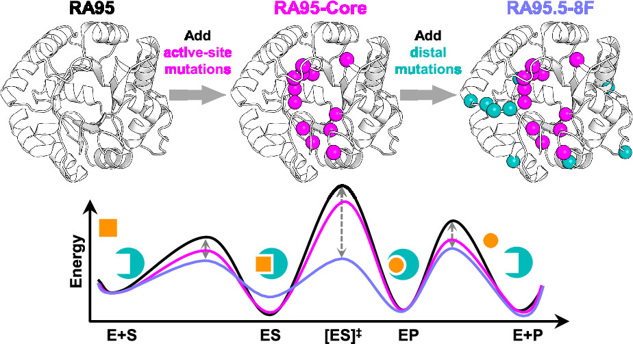
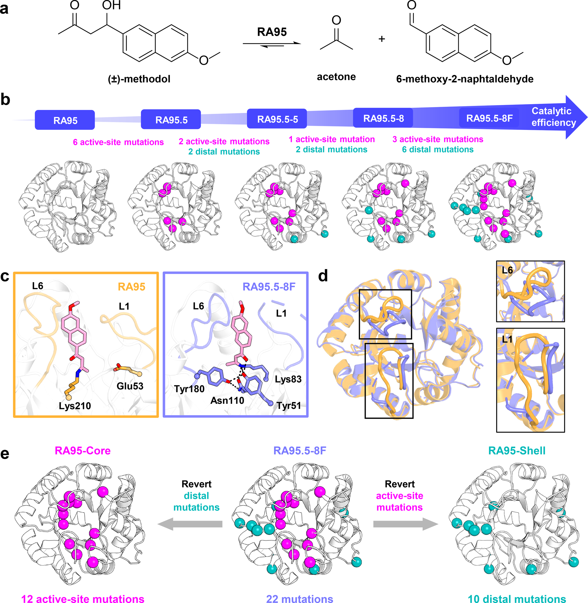
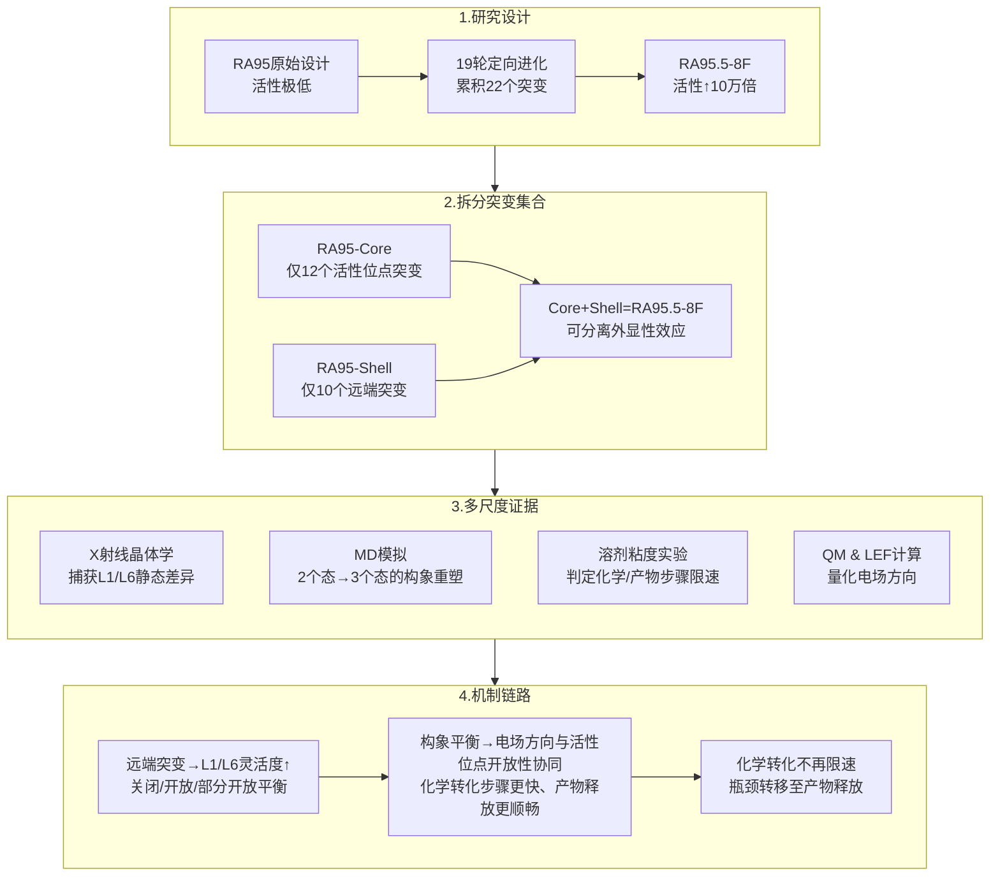
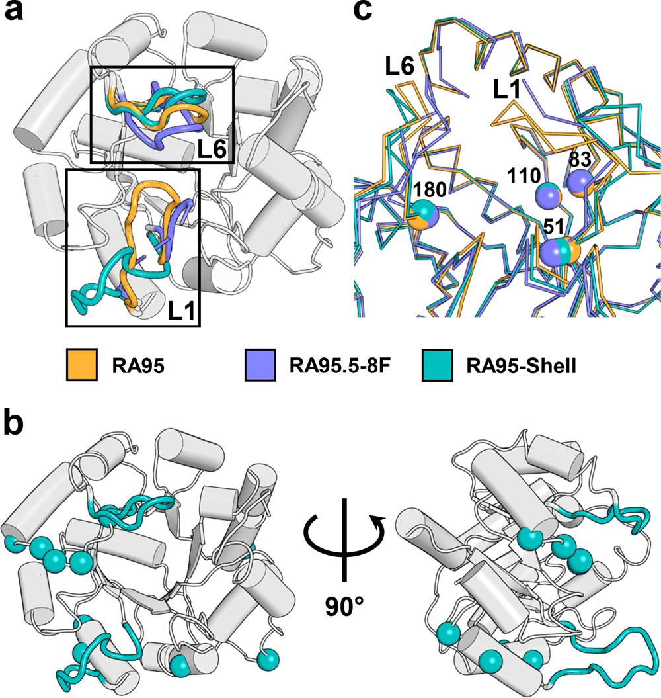
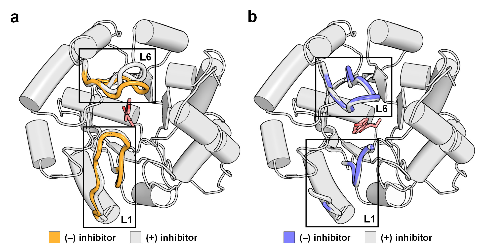
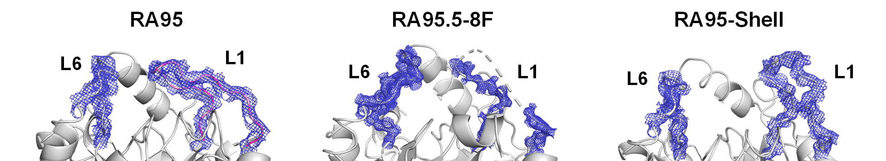
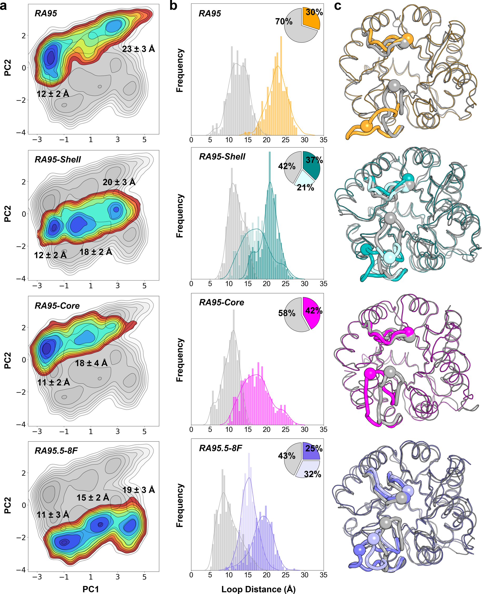
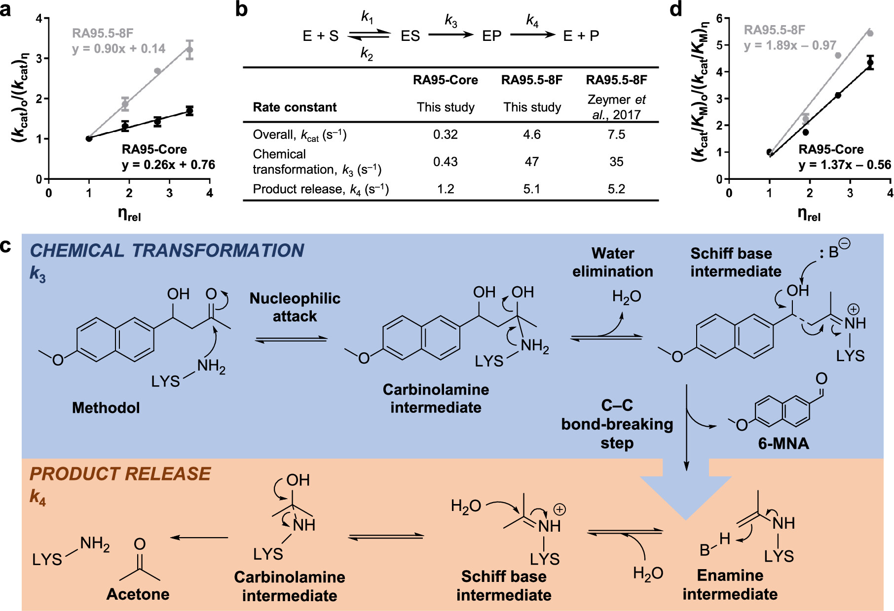
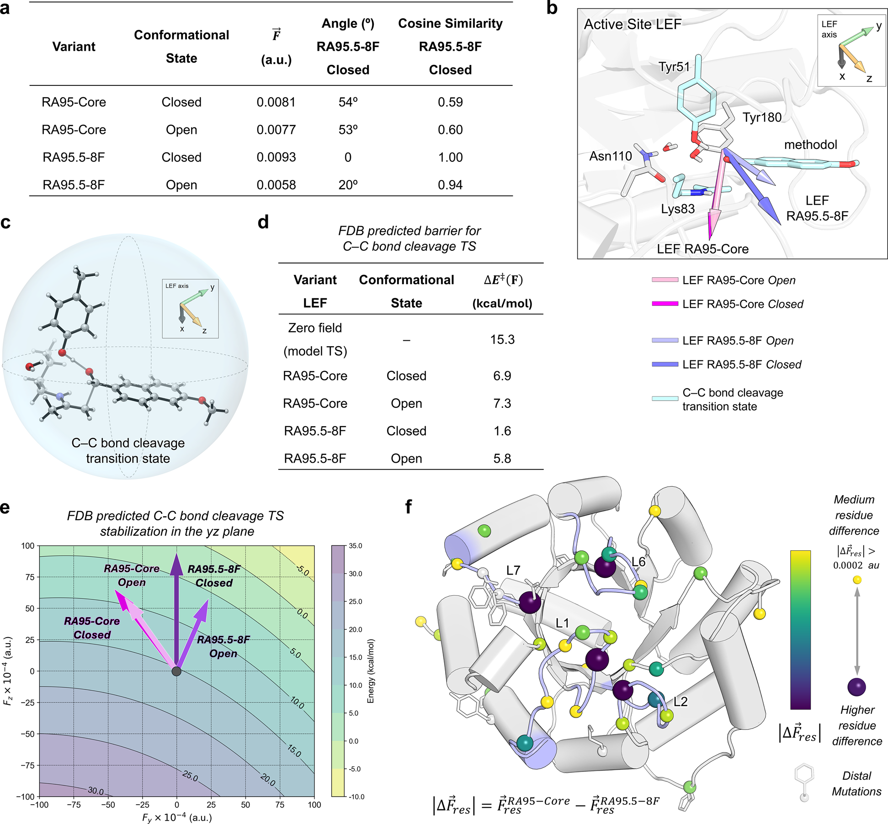

# 设计逆醛缩酶RA95的远端突变研究：环动力学调控、电场优化与速率限制步骤的转移

## 本文信息

- 标题：**Distal Mutations in a Designed Retro-Aldolase Alter Loop Dynamics to Shift and Accelerate the Rate-Limiting Step**
- 作者：**Serena E. Hunt, Cindy Klaus, Aqza E. John, Niayesh Zarifi, Alec Martinez, Ferran Feixas, Marc Garcia-Borràs, Michael C. Thompson, Roberto A. Chica**
- 通讯作者：**Roberto A. Chica**
- 发表时间：**2025年8月13日**
- 单位：**渥太华大学化学与生物分子科学系和催化研究与创新中心（加拿大）、赫罗纳大学计算与催化化学研究所（西班牙）、加州大学默塞德分校化学与生物化学系（美国）**
- 引用格式：**Hunt, S. E., Klaus, C., John, A. E., Zarifi, N., Martinez, A., Feixas, F., Garcia-Borràs, M., Thompson, M. C., & Chica, R. A. (2025). Distal Mutations in a Designed Retro-Aldolase Alter Loop Dynamics to Shift and Accelerate the Rate-Limiting Step. *J. Am. Chem. Soc.*, *147*, 30723-30736. https://doi.org/10.1021/jacs.5c05134**
- 数据可用性：**分子动力学轨迹和参数文件已存放在Zenodo（DOI: 10.5281/zenodo.16281142）**

## 摘要

> 已知远离酶活性位点的氨基酸残基会影响催化，但它们对催化循环的机制贡献仍然知之甚少。本研究通过计算设计的逆醛缩酶RA95的定向进化，系统研究了远端突变和活性位点突变的结构、功能和机制影响。**活性位点突变使催化效率提高3600倍，而单独的远端突变没有带来改善**。但当远端突变与活性位点突变结合时，催化效率进一步提高6倍，展示了显著的**外显性效应**（epistatic effect）。X射线晶体学和分子动力学模拟揭示，**远端突变通过改变环动力学促进活性位点开放**。动力学溶剂粘度效应和电场计算表明，远端突变使化学转化加速100倍，**将速率限制步骤从化学转化转移到产物释放**，而后者又因活性位点开放性增加而进一步加速。这些发现确立了远端残基在塑造活性位点环境和促进高效催化循环所必需的结构动力学中的关键作用。

### 核心结论

- 远端突变的催化效应**依赖于优化的活性位点并可额外带来6倍效率增益**：单独对RA95无益甚至有害，但与活性位点突变协同可显著提升催化效率
- 通过改变**环L1和L6的动力学**促进活性位点开放：将构象景观从**两个主要构象态**转变为**包含三类构象的分布**，富集开放和部分开放构象
- **化学转化加速100倍**：优化局部电场方向，降低C-C键断裂能垒**1.5-5 kcal/mol**
- **速率限制步骤转移**：从RA95-Core的**化学转化限制**转移到RA95.5-8F的**产物释放限制**
- 同时**改善催化效率、补偿稳定性损失**：部分恢复活性位点优化导致的热稳定性下降

**图文摘要：远端突变通过调控催化循环实现效率提升**

上图展示了RA95、RA95-Core和RA95.5-8F三个关键变体的结构演化及其对催化循环能量景观的影响。**活性位点突变**（洋红色球）优化了催化四联体，显著降低了过渡态能垒（[ES]‡）。**远端突变**（青色球）进一步调控了环动力学，改变了整个催化循环的能量分布：降低底物结合（ES）和产物释放（EP）的能垒，同时通过优化局部电场进一步降低过渡态能垒。这种协同效应最终实现了速率限制步骤从化学转化转移到产物释放，并将整体催化效率提高6倍。

## 背景

远离活性位点的氨基酸残基（distal residues）对酶催化的影响已被广泛观察到，但其具体的机制贡献一直是酶学研究中的难题。这些远端残基的突变可以在自然进化中**增强催化活性**、在从头酶设计中**提高催化效率**、在人类疾病突变中**破坏催化活性**。

然而，目前的研究存在两大局限：

- **混杂效应难以区分**：大多数研究在分析远端突变时同时存在活性位点突变，难以判断其效应是直接作用还是外显性相互作用，无法清晰分离各自的贡献
- **机制理解不足**：远端突变对催化循环各步骤（底物结合、化学转化、产物释放等）的机制影响在很大程度上被忽视，阻碍了我们全面理解这些突变如何影响反应坐标上的不同步骤并贡献整体催化效率

计算设计的逆醛缩酶**RA95是研究远端突变的理想模型系统**。初始设计的$k_\text{cat}$仅为$5 \times 10^{-5}~\mathrm{s^{-1}}$，但经过**19轮定向进化**引入**22个突变**后，最终变体RA95.5-8F的活性提高了**5个数量级**（**10万倍**）。需要特别强调的是，这一漫长的定向进化流程已经在早期工作（参考文献14、15）中完成，本文**并未重新开展定向进化实验**，而是直接基于这些既有突变来设计Core/Shell组合，借此在同一结构背景下拆解活性位点与远端突变的效应。

不同于其他从头设计酶，RA95的进化涉及**彻底的活性位点改造**：原始催化亲核试剂Lys210被Lys83取代，引入**3个额外残基**（Tyr51、Asn110、Tyr180）形成**催化四联体**（catalytic tetrad），通过氢键网络增强催化。进化还触发了邻近表面环的构象转变，以缓解与新底物结合位置的空间冲突。

**图1：RA95逆醛缩酶的演化与变体设计**
- (a) Methodol逆醛缩反应的催化机理示意，颜色依照底物（粉色）与产物（灰色）区分
- (b) 19轮定向进化中，活性位点突变以洋红色标示、远端突变以青绿色标示，折线图用黑色曲线显示$k_\text{cat}/K_M$从0.52提升至$1.2\times10^{4}~\mathrm{M^{-1}\,s^{-1}}$
- (c) RA95（橙色）与RA95.5-8F（紫色）的活性位点叠加，Loop L1、L6以同色突出，便于比较差异
- (d) RA95.5-8F晶体结构中，Loop L1残基58-63缺失电子密度（灰色虚线框），强调其高度无序
- (e) 变体构建示意沿用橙色（RA95）、青绿色（远端突变）、洋红（活性位点突变）的标记规则，清晰展示Core/Shell分离策略

### 创新点

- **创新变体设计策略**：创建RA95-Core（仅活性位点突变）和RA95-Shell（仅远端突变）两个关键变体，**首次完全分离**远端突变和活性位点突变的效应，消除了以往研究中的混杂因素
- **多尺度机制整合**：整合**X射线晶体学、分子动力学模拟、溶剂粘度效应实验和量子力学计算**四种互补方法，从结构、动力学、动力学和静电四个层面系统揭示远端突变的作用机制
- **速率限制步骤转移的定量证据**：通过溶剂粘度效应实验**首次定量证明**远端突变将速率限制步骤从**化学转化转移到产物释放**，明确了远端突变在催化循环中的关键角色
- **外显性效应的全面解析**：揭示远端突变的催化效应**完全依赖于优化的活性位点**，在次优活性位点中反而有害，为理解突变间的**非线性相互作用**提供了清晰案例
- **电场方向优于强度的发现**：证明远端突变主要通过改变局部电场的**整体方向取向**而非强度来稳定过渡态，且这种效应是通过调控环动力学**间接实现**的，而非直接静电作用

---

## 研究内容

### 整体研究逻辑

### 核心策略：精巧的变体设计

本研究的核心挑战是分离远端突变和活性位点突变的各自效应。以往的研究在分析远端突变时，往往同时存在活性位点突变，无法区分哪些催化提升来自远端突变本身，哪些来自它与活性位点突变的协同作用（外显性效应）。为了解决这个问题，研究者从最终的进化变体RA95.5-8F出发，通过**回复突变策略**构建了两个关键变体：将远端突变回复到RA95原始序列得到RA95-Core（仅保留**12个活性位点突变**），将活性位点突变回复得到RA95-Shell（仅保留**10个远端突变**）。这种"加法实验"设计在同一个蛋白支架上**首次实现了完全的效应分离**。

**突变定义标准**：活性位点突变限定为**距离Lys83共价二酮抑制剂8 Å以内的残基集合**，远端突变则划归为**超出该8 Å球面的外围残基**。这个8 Å截断值不是任意选择的，而是基于结构分析：它包括与抑制剂直接接触的残基（第一壳层）和与第一壳层残基相互作用的残基（第二壳层），确保活性位点的微环境被完整定义。这种分类方法使得研究者能够系统性地回答：远端突变在优化的活性位点存在时是否有益？在次优活性位点中又如何？

| 变体 | 包含突变 | 构建方法 |
|------|---------|---------|
| RA95 | 0个（原始设计） | 计算从头设计 |
| RA95-Core | 12个活性位点突变 | RA95.5-8F远端突变回复到RA95 |
| RA95-Shell | 10个远端突变 | RA95.5-8F活性位点突变回复到RA95 |
| RA95.5-8F | 12个活性位点 + 10个远端突变 | 19轮定向进化最终变体 |

值得注意的是，上述四个变体的序列都直接源自既有的定向进化成果：19轮实验早在前期工作中完成（文献14、15详述，由Hilvert组在苏黎世联邦理工学院于2013-2017年完成），本文作者Chica组只是在这些现成突变的基础上进行回溯构建与机理分析，没有新增的定向进化实验步骤。这是典型的机制研究follow-up工作：前人团队完成酶演化优化，本文团队负责深入解析作用机制。

### 功能效应：外显性主导的催化增强

酶活性测定揭示了出乎意料的结果。如果远端突变和活性位点突变的效应是简单相加的，那么RA95.5-8F的活性应该等于RA95-Core加上RA95-Shell的贡献。但实验结果显示，远端突变的效应高度依赖于活性位点的背景环境。

催化效率的系统性提升数据揭示了突变间的复杂相互作用：

- **活性位点突变是主要驱动力**：RA95-Core相比RA95效率提高**3600倍**（$k_\text{cat}/K_M$从0.52提升至**1900 M$^{-1}$s$^{-1}$**），证明催化四联体的构建是活性提升的关键。而RA95-Shell的$k_\text{cat}$反而呈现**约2倍的下降趋势**（从0.00027降至0.00016 s$^{-1}$），表明远端突变单独作用时不仅无益甚至有害——**远端突变在次优活性位点中是破坏性的**
- **协同效应显著**：RA95.5-8F比RA95-Core额外实现**整体活性再提升6倍的协同增益**（$k_\text{cat}$从0.32提升至$4.6~\mathrm{s^{-1}}$），证明远端突变在优化的活性位点环境中才能发挥催化增强作用
- **外显性效应惊人**：将活性位点突变引入RA95-Shell（形成RA95.5-8F），$k_\text{cat}$增加**29,000倍**（从0.00016增至4.6 s$^{-1}$），远超各突变集合的简单加和效应。远端突变和活性位点突变之间存在**非线性的协同效应**

| 酶变体 | $k_\text{cat}$ ($\mathrm{s^{-1}}$) | $k_\text{cat}/K_M$ ($\mathrm{M^{-1}\,s^{-1}}$) | 相对RA95提升 |
|--------|---------|--------------------|------------|
| RA95 | 0.00027 | 0.52 | 1× |
| RA95-Shell | 0.00016 | 0.37 | 0.7× |
| RA95-Core | 0.32 | 1,900 | 3,600× |
| RA95.5-8F | 4.6 | 12,000 | 23,000× |

为了验证活性位点中哪些残基最重要，研究者对**催化四联体**（Lys83、Tyr51、Asn110、Tyr180）进行了单点回复突变分析。结果显示**Tyr51是最关键的残基**，其Y51F突变使催化效率出现**约12倍的衰减**，N110S和Y180F分别带来**约3倍和6倍的下降**。这解释了为什么远端突变能够通过优化Tyr51的定位（位移**1.4 Å**）来增强催化——即使微小的骨架调整也能显著影响关键残基的功能。

活性提升往往伴随着蛋白稳定性的损失，这是酶设计中的经典权衡。

- 远端突变对RA95单独作用时$T_m$降低约2°C（轻微不利），但活性位点突变对RA95的影响是$T_m$降低15°C（高度不稳定）——这是因为催化四联体的引入破坏了原始设计的结构稳定性。当远端突变引入RA95-Core后，$T_m$升高约3°C，表现出**补偿作用**
- 这说明远端突变在进化中被选择，部分原因是为了**补偿活性位点优化导致的大幅稳定性损失**，实现了"既要活性又要稳定"的双重目标。这也解释了为什么自然进化和人工定向进化都倾向于累积远端突变——它们能够维持蛋白整体折叠的同时优化局部催化功能

### 结构效应：环构象的戏剧性变化

**功能数据揭示了远端突变的重要性，但不能回答“如何实现”的问题**。为了理解远端突变如何影响催化，研究者转向结构生物学，成功解析了RA95（空间群P21212，分辨率1.89 Å，PDB: 9MYA）和RA95-Shell（空间群P21212，分辨率1.77 Å，PDB: 9MYB）的无底物结合晶体结构，同时引用先前报道的RA95.5-8F apo结构（PDB: 5AOU）与RA95/RA95.5-8F的抑制剂复合物（PDB: 4A29/5AN7）。RA95-Core因未能结晶，使用Triad在9MYA框架上引入12个活性位点突变生成的模型用于比较，在正文中统称为“无底物结构”但注明来源差异。**这些结构的关键价值在于捕获了不同突变背景下的“静息态”构象，揭示了远端突变对活性位点入口（Loop L1和L6）的深刻影响**：

- **RA95原始设计展示诱导契合机制**：Loop L1（残基52-66）和L6（残基180-190）清晰可见，L6距离L1较远。抑制剂结合时L6才移动以容纳底物，显示**诱导契合**（induced fit）机制——这是一种"被动适应"的策略，底物到来后蛋白才调整构象。这种机制的缺点是底物结合需要克服构象变化的能垒，导致**结合速度较慢**
- **RA95.5-8F实现构象选择机制**：无论有无抑制剂，L1和L6位置基本不变。Loop L1残基**58-63**（无底物）或**58-61**（有抑制剂）**无电子密度、高度无序**，说明环已**预先定位**用于高效底物结合，实现**构象选择**（conformational selection）机制——蛋白已经"准备好"多种构象，底物只需选择合适的那个。这是更高效的策略，但代价是蛋白需要**维持更高的构象异质性**（熵成本）
- **RA95-Shell的惊人发现揭示长程调控**：Loop L1发生**大规模构象变化**，距RA95位置约**10 Å**，展现出**最开放构象**。这种构象在所有其他变体中都未观察到，**AlphaFold2也无法预测**——说明它可能是能量较高的罕见态，被晶格接触稳定。**关键观察是，引起这种变化的远端突变不在L1或L6环上或附近**，证明了远端位点对环动力学的**长程调控作用**。这一发现挑战了传统观念：**影响Loop的突变不一定在Loop上**
- **活性位点骨架的微妙变化具有催化意义**：位置51的Cα碳从RA95到RA95-Shell偏移**0.7 Å**，RA95到RA95.5-8F总共偏移**1.4 Å**，帮助Tyr51优化定位以发挥催化作用。虽然1.4 Å看似微小，但考虑到Tyr51是催化四联体中**最关键的残基**（其突变会造成**约12倍的活性损失**），这种精确的骨架调整对于优化氢键网络和过渡态稳定化至关重要

**图2：远端突变的结构效应**
- (a) **无底物结构叠加揭示L1位移约10 Å**，RA95（橙色）、RA95-Shell（青绿色）与RA95.5-8F（紫色）一目了然，展示远端突变如何驱动最大开放构象
- (b) Loop L1与L6的局部视图采用相同配色并用球体标记突变位点，**凸显远端突变虽不在Loop上却显著改变其相对位置**
- (c) Tyr51骨架偏移也使用橙/青绿/紫三色表示，RA95→RA95-Shell偏移0.7 Å、RA95→RA95.5-8F偏移1.4 Å，**说明微米级骨架调整即可重新定位关键催化残基**

**补充图S4：诱导契合与构象选择机制**

(a) RA95晶体结构叠加（有抑制剂：白色；无抑制剂：橙色），显示Loop L6在底物结合前后的构象变化（诱导契合机制）。(b) RA95.5-8F晶体结构叠加显示Loop位置在底物结合前后基本不变（构象选择机制）。

**补充图S5：Loop L1/L6的电子密度**

RA95、RA95-Shell和RA95.5-8F的Loop L1和L6区域的2mFo-DFc电子密度图（1σ，蓝色网格）。RA95.5-8F的L1残基58-63缺失电子密度（虚线）。

**方法学验证**：值得注意的是，**AlphaFold2无法预测RA95-Shell中L1的极端开放构象**（约10 Å位移），这表明该罕见态可能是能量较高的局部构象，被晶格接触稳定。这一发现强调了结合实验结构（X-ray）、计算模拟（MD）和结构预测（AlphaFold2）多种方法的重要性（详见附录补充图S6和Q&A第4题）。

### 动力学效应：构象景观的重塑

**晶体结构只能提供静态快照，无法回答构象动力学的问题**。不同构象的相对稳定性如何？它们之间如何转换？远端突变是否真的改变了构象分布？为了回答这些问题，研究者进行了**1000 ns分子动力学模拟**（Amber 2020，AMBER19SB力场，OPC水模型，每个变体**三次独立重复**；详细参数见附录"分子动力学模拟参数"），这相当于在计算机中"观看"蛋白质在溶液中**持续约1微秒的运动轨迹**。通过**主成分分析**（PCA）和**k-means聚类**，研究者将复杂的轨迹数据转化为清晰的构象状态分布图，**揭示了远端突变如何将简单的2个态系统重塑为更复杂的3个态系统**。

**构象状态分类**基于L1-L6距离（残基58和185的Cα距离）：
- **关闭态（12-13 Å构象）**：类似RA95抑制剂结合形式
- **部分开放态（15-18 Å区间）**：新出现的中间态
- **开放态（19-23 Å距离）**：有利于产物释放

**关键发现与机制解释**：
- **RA95呈现简单两态分布**：展现**2个态系统**，关闭态占比70%，开放态占比30%。这种分布反映了原始设计中Loop的相对刚性——活性位点大部分时间处于关闭态以保护催化残基，偶尔打开释放产物。然而，这种**过于关闭**的倾向导致产物释放缓慢，成为催化瓶颈
- **RA95.5-8F实现复杂三态平衡**：从2个态转变为**3个态系统**，关闭态占比43%（降低27个百分点）、部分开放态占比32%（新增）、开放态占比25%（降低5个百分点）。这种构象异质性增加看似混乱，实则是高度优化的结果：**关闭态足够用于化学转化**（需要紧密的活性位点稳定过渡态），**部分开放态方便构象转换**（作为过渡状态降低能垒），**开放态加速产物释放**（Loop打开让产物逃逸）。这种多态平衡使催化循环的每个步骤都有合适的构象可用，避免了单一构象的瓶颈
- **远端突变驱动构象景观重塑**：RA95→RA95-Shell和RA95-Core→RA95.5-8F都实现了**2个态→3个态转变**，富集开放/部分开放构象，降低关闭构象比例。这证明远端突变的主要作用是**调控构象系综的分布**，而非创造全新的构象——所有构象在RA95中都可能存在（以罕见态形式），但远端突变改变了它们的相对能量，使开放构象更容易出现。**这回答了一个关键问题：远端突变如何提高催化效率？答案是通过促进产物释放**
- **活性位点突变与远端突变的互补效应**：RA95→RA95-Core几乎**消除完全开放构象这30%的群体**（降至接近0%），引入部分开放态（**18±4** Å），将群体向关闭/部分开放状态偏移。这看似与产物释放相悖，但实际上是为化学转化步骤优化——过于开放的活性位点无法有效稳定过渡态。**这解释了为什么需要远端突变来平衡**：活性位点突变优化了化学转化步骤但牺牲了产物释放（$k_3$提高但$k_4$降低），远端突变则补偿了这一损失（恢复开放构象，加速$k_4$），最终实现催化循环的整体优化

**图3：MD模拟揭示的构象动力学**
- (a) PC1-PC2投影中，颜色沿图例统一：RA95=橙色、RA95-Shell=青绿色、RA95-Core=灰色、RA95.5-8F=紫色；聚类区块与同色标注的平均L1-L6距离相对应
- (b) Loop距离直方图及饼图沿用同一配色，**橙色柱对应RA95的二态分布、青绿柱显示RA95-Shell开放比例增加、紫色柱显示RA95.5-8F出现三态平衡**
- (c) 代表性结构中，Loop L1和L6用加粗卡通及同色球体表示残基58/185位置，直观呈现不同构象下的空间摆动

### 速率限制步骤的鉴定：溶剂粘度效应实验

MD模拟显示远端突变促进活性位点开放，但这是否真的加速了产物释放？速率限制步骤是否发生了转移？这些问题需要实验验证。溶剂粘度效应实验能够定量区分催化循环中的扩散控制步骤和化学转化步骤。

实验原理很直接：加入蔗糖后，溶液越粘稠，分子扩散越慢。**底物结合、产物释放、构象变化都依赖扩散，会被粘度拖累**；而**化学转化发生在活性位点内部，被蛋白质"保护"，基本不受粘度影响**。通过测量$k_\text{cat}$在不同粘度下的变化，可以判断哪个步骤是限速的：如果$k_\text{cat}$不受粘度影响，说明**化学转化慢**；如果$k_\text{cat}$随粘度增加而降低，说明**产物释放慢**。

使用蔗糖（0、20、28、33% w/v）作为viscogen（增粘剂），检测$k_\text{cat}$和$k_\text{cat}/K_M$随相对粘度的变化。通过拟合方程
$$
k_\text{cat} = \frac{k_3 k_4}{k_3 + k_4 \eta^n}
$$
可以分离出各步骤的速率常数，其中$k_3$是**化学转化速率常数**（不受粘度影响），$k_4$是**产物释放速率常数**（受粘度η影响）。当$k_3 \ll k_4$时，$k_\text{cat} \approx k_3$（**化学转化步骤限速**）；当$k_3 \gg k_4$时，$k_\text{cat} \approx k_3/\eta^n$（**产物释放限速**，受粘度影响）。

| 变体 | $k_3$（化学转化，$\mathrm{s^{-1}}$） | $k_4$（产物释放，$\mathrm{s^{-1}}$） | 速率限制步骤 |
|------|-----------------|---------------|------------|
| RA95-Core | 0.43 | 1.2 | **化学转化** |
| RA95.5-8F | 47 | 5.1 | **产物释放** |

实验结果显示速率限制步骤发生了转移：

- **RA95-Core：化学转化是瓶颈**。$k_3 < k_4$说明化学转化步骤限速。归一化$k_\text{cat}$曲线几乎水平——粘度增加时相对$k_\text{cat}$基本不变（斜率接近0），证明瓶颈在不受粘度影响的C-C键断裂步骤
- **RA95.5-8F：产物释放成为瓶颈**。$k_3 = 47~\mathrm{s^{-1}}$（化学快了**109倍**），$k_4 = 5.1~\mathrm{s^{-1}}$（产物释放快了**4.3倍**），$k_3 \gg k_4$说明产物释放限速。归一化$k_\text{cat}$曲线明显下降——当相对粘度增至3.5时，归一化$k_\text{cat}$降至约0.5（斜率在0-1之间），证明瓶颈转移到受粘度影响的产物释放步骤

这个结果有两层含义。首先，远端突变实现了**双重加速**：不仅让化学转化快了**100倍**（这才是最大的贡献），还让产物释放快了**约4倍的速率提升**。但因为化学转化步骤加速得太多，原本不是问题的产物释放现在成了新瓶颈——这是催化优化的标志，说明已经接近完美平衡。其次，**速率限制步骤的转移证明了远端突变的机制**：如果远端突变只是改善活性位点环境（如优化电场），那么$k_3$应该增加但$k_4$不变，速率限制步骤不会转移。转移的发生直接证明了远端突变通过改变Loop动力学促进了产物释放，与MD模拟的发现吻合。

两个变体的$k_\text{cat}/K_M$斜率均呈现**明显大于1的趋势**（纯扩散限制的理论极限仅为1），揭示了底物结合的复杂性。根据**Kramers理论**和**Smoluchowski扩散方程**，如果反应完全由扩散控制（底物简单扩散到活性位点就立即反应），粘度依赖性应遵循$k_\text{cat}/K_M \propto \eta^{-1}$（斜率m=1）。**斜率>1表明存在额外的受粘度影响的过程**——不仅是底物扩散，还包括**蛋白质构象变化**：Loop的开合运动受到溶剂粘度的摩擦阻力（像在蜂蜜里推门），底物需要等待Loop打开才能进入。当底物扩散（$\propto \eta^{-1}$）和构象变化（$\propto \eta^{-m}$）这两个步骤都受粘度影响时，总效应会叠加，导致斜率>1。

RA95.5-8F粘度效应更强（斜率分别约为1.5与1.2），直接反映了远端突变的作用：Loop L1构象异质性增加（三态分布）使得底物结合涉及更复杂的**构象门控**——底物不仅要扩散到酶表面，还要等待Loop采样到开放态，然后Loop再闭合包裹底物。这些构象转换步骤都受粘度影响，因此RA95.5-8F的粘度敏感性更强。这一观察**从动力学角度证实了远端突变通过调控Loop动力学影响底物结合的机制**。

**图4：溶剂粘度效应实验**
- (a) 归一化$k_\text{cat}$曲线中，橙色代表RA95-Core、紫色代表RA95.5-8F，灰色阴影为SEM；斜率差异直接显示瓶颈由化学步骤转向产物释放
- (b) 催化循环示意图用同样配色标出$k_3$（橙）与$k_4$（紫），并附上拟合得到的速率常数
- (c) 机制框图区分粘度敏感（紫色箭头）与不敏感（灰色箭头）步骤，帮助读者将曲线与物理过程对照
- (d) $k_\text{cat}/K_M$随粘度的曲线亦沿用橙/紫配色，**斜率>1 表明底物结合伴随构象重排**

### 静电效应：局部电场方向的优化

粘度实验证明远端突变加速了化学转化（$k_3$提高**100倍**），但具体机制是什么？Loop动力学变化能解释产物释放加速（$k_4$提高**约4倍的幅度**），但化学转化发生在活性位点内部，Loop怎么影响C-C键断裂？答案在于**局部电场**（LEF）——近年来研究发现，活性位点的静电环境（由所有残基的电荷分布决定）能够显著影响过渡态稳定性，从而改变化学转化步骤的速率。远端突变可能通过改变Loop位置，**间接改变了活性位点的电场**。

通过**TUPÃ软件**计算活性位点局部电场（详细方法见附录"局部电场计算方法"），计算点与RA95.5-8F共价抑制剂中羟基氧原子位置重合，代表C-C键断裂过渡态的关键位置（该氧原子在反应中积累部分负电荷）。这个选择不是任意的——**过渡态稳定化的关键在于降低该位置的能量**，而电场正是通过静电相互作用实现这一点。

所有变体的电场强度都相似（约**0.008 a.u.**），但**方向差异巨大**。为了量化这种差异，研究者以**RA95.5-8F关闭态**的电场方向作为"最优参考"（因为它催化效率最高），计算其他变体的电场方向与之的夹角：

- **RA95-Core关闭态**：表现出**约54°的偏离角**（余弦相似度**0.59**）——方向严重偏离
- **RA95-Core开放态**：表现出**约53°的偏离角**（余弦相似度**0.60**）——与关闭态类似，都偏离很大
- **RA95.5-8F开放态**：仅保留**约20°的小偏差**（余弦相似度**0.94**）——方向基本一致

**电场的方向比强度更重要**。为什么？因为过渡态稳定化能量取决于电场矢量$\vec{E}$与反应偶极矩$\Delta\vec{\mu}$（反应物→过渡态的偶极变化）的**矢量点积这一代数关系**：
$$
\Delta E = -\vec{E} \cdot \Delta\vec{\mu} = -|\vec{E}||\Delta\vec{\mu}|\cos\theta
$$
即使电场强度$|\vec{E}|$相同，夹角$\theta$越大（余弦值越小），稳定化能量就越低——就像推车上坡，沿坡方向推最省力（$\theta=0°$，$\cos\theta=1$），偏离方向则事倍功半（$\theta=54°$时只剩下59%的有效推力）。

量子力学能垒计算验证了电场效应（Theozyme模型，DFT：(U)B3LYP/6-31G(d)，CPCM溶剂；具体流程详见附录“量子力学能垒计算流程”）：
- **零电场参考**：过渡态能垒**15.3 kcal/mol**——这是没有蛋白质环境时的"裸"能垒
- **RA95-Core关闭态**：**6.9 kcal/mol**（电场降低8.4 kcal/mol）
- **RA95.5-8F关闭态**：**1.6 kcal/mol**（能垒最低），电场方向优化使能垒相比RA95-Core再降低**5.3 kcal/mol**
- RA95-Core开放态：**7.3 kcal/mol**；RA95.5-8F开放态：**5.8 kcal/mol**

根据过渡态理论，能垒降低**5.3 kcal/mol**对应速率提高约$e^{5.3/(RT)} \approx 10{,}000$倍（室温下）。这与实验观察到的$k_3$加速**100倍**（从0.43到47$~\mathrm{s^{-1}}$）在数量级上一致——QM计算可能高估了电场效应，但方向性预测是正确的。RA95-Shell的LEF相对RA95没有显著改变能垒（分别为7.1和6.9 kcal/mol），与单独远端突变对$k_\text{cat}$无益（甚至有害）的实验结果一致。这从量子化学层面证实了**外显性效应**：远端突变需要优化的活性位点才能发挥电场优化作用。

LEF变化的主要贡献来自**柔性环区域**（L1、L2、L6、L7）上的残基（贡献77%），而不是直接来自远端突变位点（仅贡献8%）。这个**77**% vs **8**%的对比揭示了远端突变的真实机制：

- **传统观念**：远端突变通过改变自身电荷直接影响活性位点的静电环境
- **本研究发现**：远端突变通过调控Loop动力学→Loop位置改变→Loop上残基的电场贡献改变→活性位点电场方向优化

这个机制解释了为什么远端突变位于Loop之外却能影响Loop功能：它们不需要在Loop上，只需要能够改变Loop的构象系综分布（通过改变能量景观）。这是一个**多级联的调控机制**：**远端突变→环动力学→电场方向→化学加速**，同时**环动力学→活性位点开放→产物释放加速**。

**图5：局部电场与过渡态稳定化**
- (a) LEF雷达图采用橙色（RA95-Core关闭）、灰色（RA95-Core开放）、青绿色（RA95-Shell）和紫色（RA95.5-8F）标出夹角与余弦相似度
- (b) 活性位点结构中，箭头颜色与(a)一致，**橙/灰/紫三种矢量直观展示方向差异**
- (c) 能垒条形图同样沿用橙/灰/紫配色，使读者易于把方向变化与能垒降低联系起来
- (d) 贡献分析图显示不同Loop区域的颜色条（L1=青绿、L2=浅蓝、L6=粉色、L7=黄色等），强调柔性环占77%

---

## 关键结论与批判性总结

### 主要发现

本研究通过精巧的变体设计和多尺度机制解析，系统阐明了远端突变在酶催化中的关键作用：

- **外显性主导的催化增强**：远端突变的效应**完全依赖于优化的活性位点**，展示了显著的外显性效应（**29,000倍**增强）
- **环动力学的关键作用**：远端突变通过改变环L1和L6的动力学，将构象景观从**2个态重塑为3个态**，富集有利于产物释放的开放构象
- **双重加速机制**：化学转化加速**100倍**（通过电场优化）加上产物释放加速**约4倍的幅度**（通过活性位点开放），协同提升整体催化效率
- **速率限制步骤转移**：成功将瓶颈从**化学转化转移到产物释放**，实现催化循环的平衡优化
- **静电机制的认识：电场方向这一因素**比强度更关键，且主要由**柔性环残基贡献的77%电场**提供，而非远端突变位点本身（仅贡献8%）

### 潜在影响

**对酶设计的启示**：

- 传统的**活性位点中心设计范式**需要扩展，必须同时考虑**动力学灵活性、电场优化和催化循环协调**
- 深度学习方法需要整合**变构效应**和**外显性网络**，预测突变间的非线性相互作用
- 设计策略应关注**整个催化循环**的优化，而非单一步骤的能垒最小化

**对理解自然酶的启示**：
- 自然进化不仅优化活性位点，还**协同优化远端残基**以调控环动力学
- **产物释放作为瓶颈在自然酶中很常见**：许多高效的自然酶（如**三磷酸异构酶、乙酰胆碱酯酶**）的速率限制步骤都是产物释放，而非化学转化。本研究揭示的远端突变通过环动力学加速产物释放的机制，可能解释了自然酶如何在进化中克服这一普遍瓶颈
- **变构调控**可能是自然酶高效催化的普遍机制，解释了为何许多疾病突变位于远端位置

**对疾病突变的启示**：
- 远端突变可通过改变**环动力学**和**局部电场分布**间接破坏催化
- 评估突变效应需要**超越活性位点范围**，考虑对构象动力学和电场的影响

### 局限性

- **模型系统的代表性**：RA95突变体是**计算设计的人工酶**，其远端突变机制可能不完全代表自然酶
- **MD模拟的精度**：基于**经典力场**，可能无法完全准确描述活性位点的微妙相互作用和量子效应
- **QM模型的简化**：**Theozyme模型**仅包含催化关键残基，忽略了蛋白质环境的动态性和远程相互作用
- **中间态结构缺失**：无法直接观察催化循环中间态的**高分辨结构**，依赖计算推断

### 未来方向

- **普适性验证**：扩展到其他酶系统（**天然酶和设计酶**），验证远端突变的动力学调控机制是否具有普适性
- **实验方法改进**：使用**时间分辨晶体学或NMR等快时序结构手段**捕获催化循环中间态，直接观测环动力学和构象变化
- **计算方法发展**：开发能预测远端突变-活性位点协同效应的**深度学习模型**，整合序列、结构、动力学和催化数据
- **定向进化策略**：设计实验进化方法专门优化**环动力学**和**电场方向**，而非仅关注活性位点
- **全催化循环研究**：系统研究远端突变对**底物结合、构象变化**等其他步骤的影响，建立完整的催化循环模型

> 小编锐评：
>
> - 要多看远端突变和allosteric相关的文章，找到合适的描述dynamics的descriptor，指导工程设计
> - 这篇模拟算是做得有点简单，电场看起来算得也没有很精确，结构模型也有局限（都详见附录），可以继续深挖
