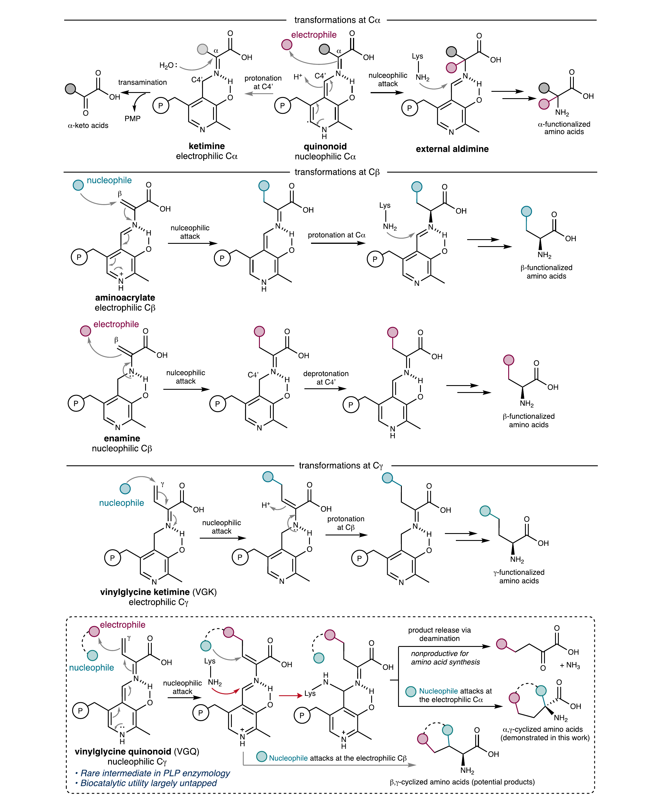
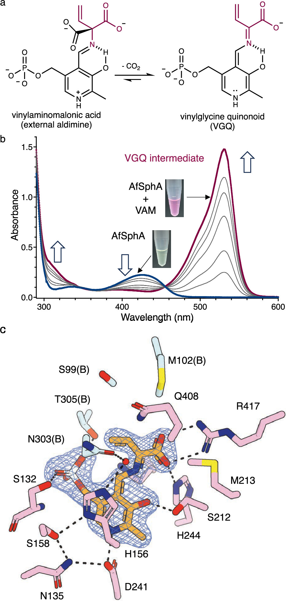
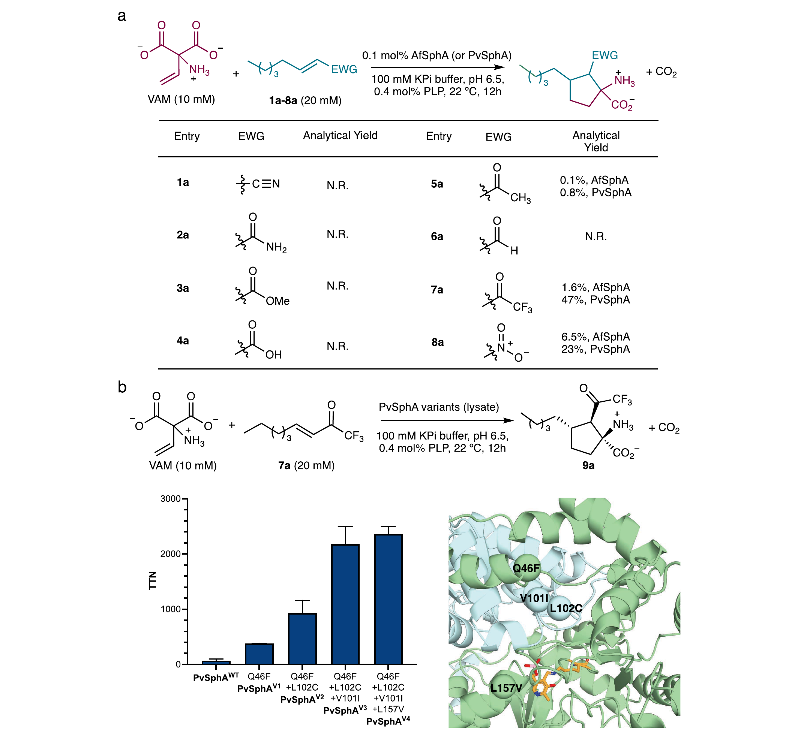
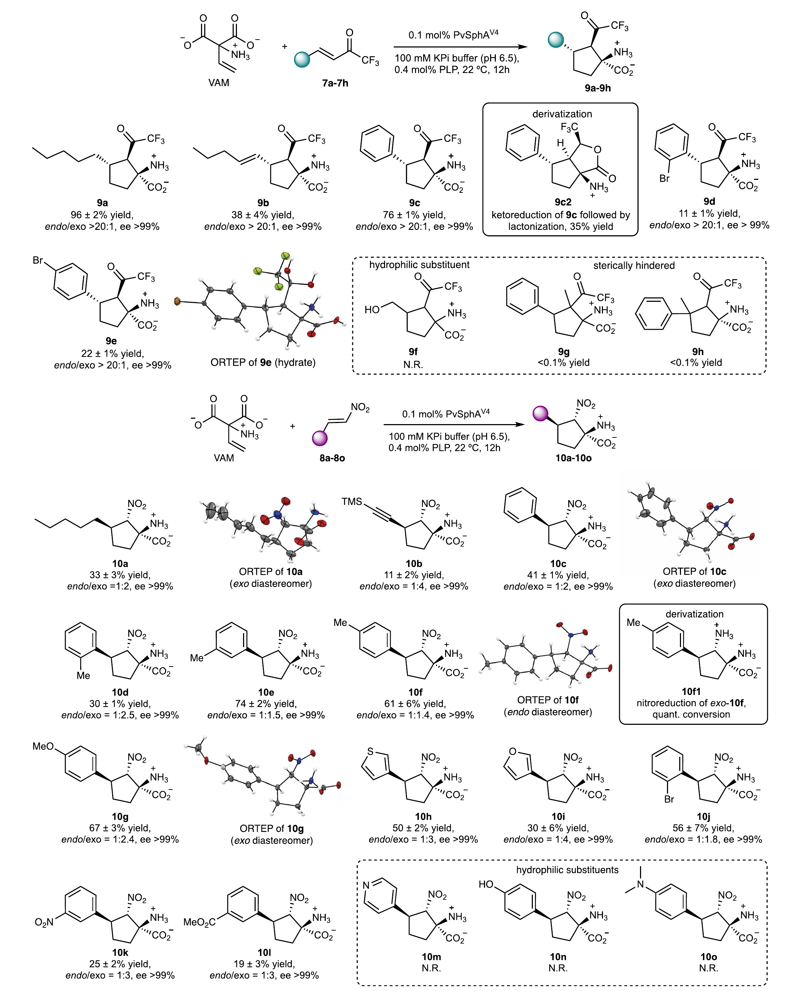
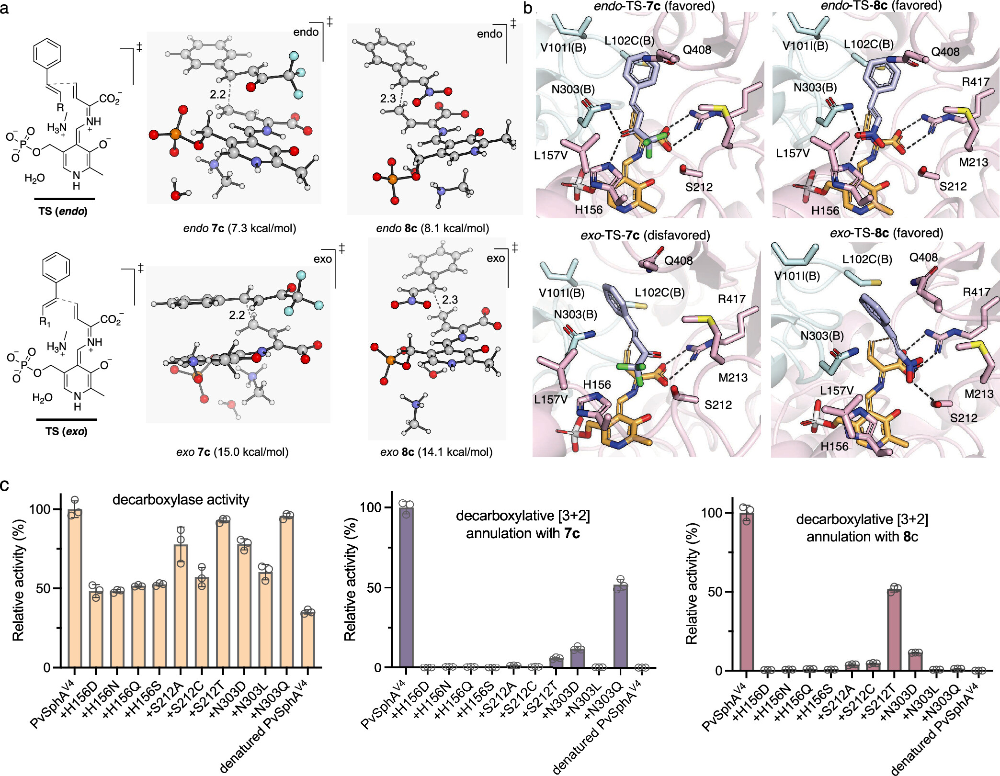
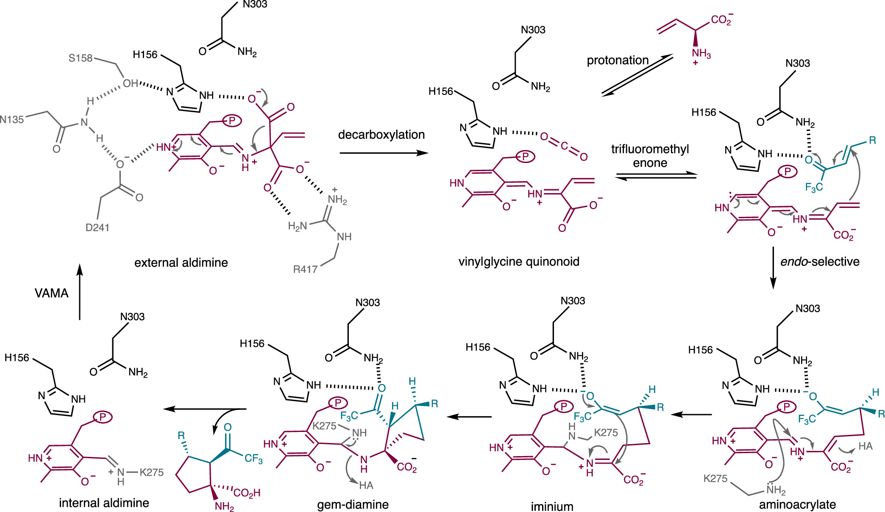

# 解锁PLP酶的隐藏超能力：罕见VGQ中间体实现酶催化[3+2]环化反应

## 本文信息

- **标题**：吡哆醛-5′-磷酸依赖酶催化的脱羧环化反应
- **作者**：Weiwei Chai, Shenggan Luo（共同第一作者）, Wenhui Xi, Xu He, Ting Zhang, Yike Zou（通讯作者）, Yang Hai（通讯作者）
- **收稿/修回/接收**：2025年11月26日 / 2026年2月19日 / 2026年2月24日
- **单位**：
  - 加州大学圣塔芭芭拉分校化学与生物化学系（美国）
  - 上海交通大学药学院、张江高等研究院（中国）
- **期刊**：*Journal of the American Chemical Society* (JACS)
- **引用格式**：Chai, W., Luo, S., Xi, W., He, X., Zhang, T., Zou, Y., & Hai, Y. (2026). Pyridoxal 5′-Phosphate-Dependent Enzymatic Decarboxylative Annulation. *Journal of the American Chemical Society*. https://doi.org/10.1021/jacs.5c20979

## 摘要

> 吡哆醛-5′-磷酸（PLP）依赖酶是自然界中最通用的生物催化剂之一，但涉及Cγ-亲核性的乙烯基甘氨酸醌式中间体的转化却极其罕见。本文通过重新编程天然催化脱羧Claisen缩合反应的PLP依赖酶SphA，建立了一个人工生物催化平台，实现了乙烯基氨基丙二酸（VAM）的简便脱羧生成VGQ中间体，并利用该高能中间体的反应性，实现了VAM与缺电子烯烃之间的脱羧[3+2]环化反应。晶体学、计算和突变研究揭示了这一非天然转化背后的关键机理特征。研究结果证明了VGQ中间体的潜在[3+2]环化能力，扩展了PLP依赖酶的催化谱系，为酶法构建复杂碳环结构确立了新策略。

### 核心结论

- **实现VGQ介导的[3+2]环化**：通过酶重新编程，利用罕见的Cγ-亲核性VGQ中间体实现了非天然的脱羧[3+2]环化反应，合成了具有三个连续立体中心的环戊烷基α,α-二取代氨基酸
- **创新性脱羧路线**：开发了VAM的α-脱羧路线生成VGQ，比天然系统中的SAM γ-消除路线更经济、操作更简单
- **高效定向进化**：通过迭代饱和突变策略，获得四重突变体PvSphAV4，总转化数提升超过30倍
- **立体选择性控制**：三氟甲基烯酮底物呈现严格的endo选择性，而硝基烯烃底物虽然非对映选择性降低，但对映选择性始终优异（ee>99%）

## 背景

### PLP酶：蛋白质改造的“瑞士军刀”

吡哆醛-5′-磷酸（PLP）依赖酶是自然界中最通用的生物催化剂家族之一，它们能够催化氨基酸的多样化转化，包括转氨、脱羧、消旋、β-消除和α-取代等反应。这种**惊人的催化多功能性**源于它们能够访问并选择性稳定不同的PLP结合中间体，并通过**精确控制这些中间体的质子化状态**来调控它们的电子极性（即烯胺vs亚胺特征），最终决定反应轨迹和位点选择性。

### PLP酶反应的中间体调控

PLP酶通过控制中间体的电子特性实现多样化的氨基酸转化：

- **富电子的醌式中间体**：倾向于Cα-亲核功能化，如Claisen缩合、aldol加成、Mannich反应、亲核取代（SN2）和光生物催化自由基反应
- **亲电的酮亚胺中间体**：通过在醌式物种C4′位置质子化产生，典型功能是转氨酶活性
- **Cβ功能化**：可通过色氨酸合成酶中的亲电氨基丙烯酸酯中间体或天冬氨酸脱羧酶UstD中的亲电烯胺中间体进行
- **Cγ功能化**：大多数已知的γ-取代反应通过Cγ-亲电的乙烯基甘氨酸酮亚胺（VGK）中间体进行

### VGQ中间体的独特性和挑战

Cγ-亲核的乙烯基甘氨酸醌式（VGQ）中间体仅在altemicidin生物合成途径中的SbzP及其同源物中被发现，它们催化VGQ与β-烟酰胺腺嘌呤二核苷酸（NAD）的环化反应。VGQ化学的罕见性源于其**独特的电子结构施加的机制约束**：

- **单键形成的局限**：在其Cγ中心上的单键形成事件不可避免地导致脱氨的酮酸产物
- **氨基酸产物的双键需求**：氨基酸产物的形成需要串联的成键催化序列
- **内在的环化优势**：虽然这一要求限制了VGQ在简单γ-取代反应中的实用性，但赋予了其作为**内置环化试剂**的独特优势，能够在单次催化操作内形成两个键

### 关键科学问题

1. **VGQ中间体的内在反应性**：VGQ中间体是否具有内在的[3+2]环化反应性，能够用于构建碳环氨基酸？
2. **VGQ的人工生成策略**：如何在非天然酶中高效生成VGQ中间体？
3. **立体选择性控制**：如何实现[3+2]环化反应的高立体选择性控制？
4. **酶工程策略**：如何通过定向进化提高酶对非天然反应的催化效率？

### 创新点

**图1：PLP依赖的氨基酸转化类型与罕见的VGQ中间体**。上方依次展示Cα、Cβ和Cγ功能化的典型通路，紫色与蓝色圆点区分亲电/亲核反应中心；下方给出VGK与VGQ中间体及其“内置环化试剂”潜力，强调VGQ的罕见性与潜在环化反应性。

- **概念创新**：证明了VGQ中间体的内在[3+2]环化能力，并将其应用于非天然的酶催化碳环构建反应
- **方法创新**：开发了VAM的α-脱羧路线生成VGQ，相比天然SAM γ-消除路线更经济实用
- **催化创新**：通过重新编程天然催化脱羧Claisen缩合的PLP酶，实现了全新的[3+2]环化功能
- **应用创新**：合成了具有三个连续立体中心的环戊烷基α,α-二取代氨基酸，这类结构在生物活性天然产物和药物分子中广泛存在

---

## 研究内容

### 核心方法：从脱羧Claisen缩合到[3+2]环化

本研究选取的SphA是一种天然催化脱羧Claisen缩合反应的PLP依赖酶，在鞘真菌素生物合成中作为链释放酶，通过脱羧缩合释放酰基载体蛋白（ACP）结合的多聚酮中间体。研究人员设想，在**多聚酮合酶伴侣缺失**的情况下，SphA可能能够催化VAM的脱羧反应生成VGQ中间体。

#### 方法选择：α-脱羧 vs α-去质子

研究者考虑了两条生成VGQ的可能路径：

| 生成路径 | 前体 | 优势 | 劣势 |
|---------|------|------|------|
| **α-去质子** | L-乙烯基甘氨酸 | 直接生成 | 需要手性前体，成本高 |
| **α-脱羧** | 乙烯基氨基丙二酸（VAM） | **前体易得、非手性、不可逆脱羧提供热力学驱动力** | 需要酶催化脱羧 |

研究者选择了**VAM的α-脱羧路线**，主要基于VAM是**非手性**的且易于合成，其**不可逆脱羧**为VGQ形成提供了**热力学驱动力**，避免了昂贵的L-乙烯基甘氨酸前体。

#### VGQ中间体的生成与表征

研究者选择了两个SphA同源蛋白进行表征：

| 酶 | 来源 | VGQ半衰期 | 特征 |
|---|------|----------|------|
| **AfSphA** | *Aspergillus fumigatus* | 7.9分钟 | 品红色变化，中间体更稳定 |
| **PvSphA** | *Paecilomyces variotii* | <0.4分钟 | 快速衰变，产物主要为L-乙烯基甘氨酸 |

#### 实验证据

| 实验方法 | 关键观察 | 意义 |
|---------|---------|------|
| **颜色变化** | 加入VAM后立即从黄色变为品红色 | 表明VGQ中间体形成 |
| **UV-可见光谱** | ~530 nm特征吸收带 | 与VGQ中间体一致 |
| **半衰期测定** | AfSphA：7.9分钟；PvSphA：<0.4分钟 | 酶稳定性差异 |
| **NMR监测** | 定量生成乙烯基甘氨酸 | 支持α-质子化衰变路径 |
| **非酶对照** | 12小时仅约20%转化 | 酶催化的必要性 |
| **手性分析** | PvSphA产物主要为L型 | 酶控立体选择性 |

#### 晶体结构证据：VGQ的s-cis构象

研究者通过**晶体浸泡**技术获得了1.85 Å高分辨率的AfSphA-VGQ复合物晶体结构，揭示了：

- **明确的电子密度**：对应于**s-cis构象**的VGQ中间体，证明VAM底物已完成脱羧
- **氢键网络**：活性位点中涉及残基H156、S158、N135和D241的氢键网络，与8-氨基-7-氧壬酸合酶（AONS）家族其他成员一致
- **关键水分子**：保守的组氨酸残基H156还与相邻单体N303(B)通过水介导的氢键相互作用。这个水分子**直接位于VGQ中间体的Cα上方**，可能模拟离去CO₂的结合位点

这些结果共同确立了通过VAM酶催化脱羧形成VGQ中间体的**分子基础**。

**图2：通过脱羧路线生成乙烯基甘氨酸醌式（VGQ）中间体**。  
（a）VAM脱羧生成VGQ的反应路线示意。  
（b）AfSphA对VAM滴定的UV-可见吸收光谱，~420 nm与~530 nm吸收带分别对应内部醛亚胺与VGQ中间体；紫红色曲线强调VGQ特征吸收，灰色曲线为滴定序列。  
（c）1.85 Å分辨率的AfSphA–VGQ复合物结构，蓝色网格为省略图密度，验证VGQ生成与结合构象。

### 反应开发：从概念验证到定向进化

#### 底物设计与筛选

鉴于SphA天然识别长链多聚酮硫酯底物，研究者主要关注**羰基功能化的烯烃**，羰基既作为**吸电子基团（EWG）**活化烯烃，又作为**导向基团（DG）**促进酶的识别，每个底物都附加了**正戊基尾链**以模拟天然多聚酮底物的**扩展疏水链**。

#### 突破性发现

AfSphA和PvSphA都能催化带有**强吸电子基团**的缺电子烯烃的脱羧[3+2]环化反应，包括：
- **三氟甲基烯酮7a**
- **硝基烯烃8a**

#### 对照实验

- 使用L-乙烯基甘氨酸直接作为VGQ前体时，观察到相似的反应结果，但产率**显著低于**使用VAM作为底物
- 使用**变性酶**时，无论用VAM还是乙烯基甘氨酸作为氨基酸供体，都**未观察到环加成产物**，排除了SphA仅催化脱羧而[3+2]环化非酶进行的可能性

#### 定向进化：30倍的效率提升

为了提高非天然[3+2]环化活性，研究者采用**迭代饱和突变（ISM）**策略工程化改造PvSphA：

**表：PvSphA的定向进化结果**

| 参数 | 野生型PvSphA | 进化变体PvSphA V4 | 提升倍数 |
|------|-------------|----------------|---------|
| **有益突变** | 无 | Q46F、L102C、V101I、L157V | - |
| **总转化数（TTN）** | 基准 | - | >30倍 |
| **催化周转数（kcat）** | 基准 | - | >10倍 |
| **脱羧速率** | 基准 | 相当 | ~1倍 |
| **[3+2]环化速率** | 基准 | - | >10倍 |
| **产率（9a）** | - | 96% | - |
| **对映选择性** | - | >99% ee | - |

**图3：反应开发与蛋白质工程**。  
（a）缺电子烯烃底物筛选与反应开发，展示脱羧[3+2]环化构建环戊烷基α,α-二取代氨基酸的整体路线与初筛结果。  
（b）PvSphA的定向进化结果与关键突变位点定位，蓝色柱表示TTN的平均值，误差条为标准差；结构图中标出有益突变位点。

#### 活性提升的来源

- 增强的活性**不归因于脱羧速率增加**（PvSphA V4催化VAM脱羧速率与野生型酶相当）
- 而是**来自更高效的[3+2]环化**（稳态动力学分析显示kcat增加超过10倍）

使用工程化的PvSphA V4，碳环氨基酸产物9a以**优异产率（96%）**和对映选择性（>99% ee）获得。尽管三氟甲基酮部分在水溶液中自发互变异构，产生水合物、酮和烯醇形式的平衡混合物，但**未检测到非对映异构体**。这表明PvSphA V4施加了**卓越的非对映和对映控制**。

### 底物范围：环戊烷氨基酸的多样性构建

#### 三氟甲基烯酮底物：endo选择性

对于三氟甲基烯酮底物，PvSphA V4能够容纳**疏水性烷基和芳基取代基**，以中等至良好的产率（**11−76%**）生成相应的碳环氨基酸产物（9c−9e），并具有**一致的高对映选择性和非对映选择性**。通过单晶X射线衍射分析确认了9e的绝对立体化学，并确定环化**以endo选择性**进行。

#### 硝基烯烃底物：exo选择性趋势

PvSphA V4有效容纳疏水性烷基、芳基和杂芳基取代的硝基烯烃（8a−8o），对电子效应**低敏感性**，但更受取代基位置和大小的影响。

**表：三氟甲基烯酮与硝基烯烃底物的选择性对比**

| 底物类型 | 产率范围 | 对映选择性 | 非对映选择性 | 立体化学 | 主要限制 |
|---------|---------|-----------|-------------|---------|---------|
| **三氟甲基烯酮** | 11−76% | >99% ee | 严格endo | 单一异构体 | 亲水性底物、三取代烯烃不被接受 |
| **硝基烯烃** | 中等至良好 | >99% ee | 降低（exo为主） | exo/endo混合物 | 非对映选择性需优化 |

虽然硝基烯烃产生非对映异构体混合物，但单个产物可通过**重结晶**易于分离。随后的锌粉硝基还原**定量进行**，得到相应的α,β-二氨基酸作为单一立体异构体（如10f1）。

#### 产物的进一步转化

**三氟甲基烯酮衍生产物**可通过NaBH4**非对映选择性还原**，相应的γ-羟基氨基酸可通过分子内SN2反应进一步**内酯化**，以高效率获得双环γ-内酯衍生物（如9c2）。这些例子突出了该工程化环化平台在获取**结构多样、致密功能化的环戊烷基序**及相关衍生物方面的合成潜力。

**图4：立体选择性脱羧[3+2]环化的底物范围**。  
上半部分为三氟甲基烯酮底物，整体呈endo选择性且对映选择性一致优异；下半部分为硝基烯烃底物，保持高对映选择性但非对映选择性下降。图中同时标注了关键衍生化与还原步骤，9c1与10f1的具体条件见补充方法。

### 机理研究：DFT计算和MD模拟揭示的反应路径

#### 分步机理：排除协同[3+2]路径

DFT计算支持**分步机理**，因为**未能成功定位协同的[3+2]过渡态**。反应首先由VGQ中间体启动对缺电子烯烃的vinylogous Michael加成，导致VGQ的Cγ-烷基化并形成**烯醇负离子中间体**；随后赖氨酸在PLP的C4′位置攻击，与氨基酸片段Cβ的质子化一起促进**异构化过程**，生成Cα-亲电的亚铵物种；最后烯醇负离子的分子内亲核加成完成环戊烷环的形成。

#### [3+2] vs [2+2]：路径选择的热力学和动力学

DFT计算表明，理论上存在一个竞争的**[2+2]环化路径**，初始C−C键形成后生成的烯醇负离子可直接攻击PLP结合的氨基丙烯酸酯，在Cβ处形成第二个C−C键。

**表：[3+2]与[2+2]环化路径的能量学对比**

| 参数 | [3+2]环化路径 | [2+2]环化路径 | 偏好 |
|------|-------------|-------------|------|
| **动力学能垒** | - | 11.8 kcal/mol | [2+2]动力学可及 |
| **热力学稳定性** | 产物明显更稳定 | 仅比VGQ稳定0.5 kcal/mol | [3+2]热力学优势 |
| **环大小** | 五元环（环戊烷） | 四元环（环丁烷） | [3+2]更稳定 |
| **实验结果** | 优势路径 | 未观察到 | [3+2]为主 |

这种**最小的热力学驱动力**使得[2+2]路径不利，为观察到的[3+2]环化路径偏好提供了合理化解释。VGQ中间体的**内在成键偏好**使得五元环形成更具优势，这一选择性在酶活性位点中被进一步放大。

#### 立体选择性起源：endo vs exo

**表：DFT计算与MD模拟揭示的立体选择性控制机制**

| 底物 | 内禀能量差（endo-exo） | 关键相互作用 | MD模拟结合能差 | 实验选择性 |
|------|---------------------|-------------|--------------|----------|
| **三氟甲基烯酮7c** | endo低7.7 kcal/mol | endo-TS与N303、H156形成两个氢键 | endo更稳定18.1 kcal/mol | 严格endo选择性 |
| **硝基烯烃8c** | endo低6.0 kcal/mol | 两个TS均能与S212形成氢键 | exo更稳定5.4 kcal/mol | 非对映选择性降低 |

研究者提出，**内禀TS能量学和差异酶-TS结合偏好的综合效应**解释了三氟甲基烯酮观察到的严格endo选择性和硝基烯烃观察到的降低的非对映选择性。对于三氟甲基烯酮，酶的氢键网络**强化了内禀的endo偏好**；而对于硝基烯烃，酶对两条路径的区分能力被削弱，导致选择性降低。

#### 有益突变的结构基础

对接和MD模拟还提供了通过定向进化鉴定的**有益突变的见解**，特别是L102C和V101I，它们似乎直接与烯酮底物的疏水取代基相互作用。**V101I**的异亮氨酸取代增加了**局部疏水表面积**，从而加强与底物的有利范德华相互作用；**L102C**用半胱氨酸替换可能**减轻了野生型酶中体积更大的L102侧链施加的空间干扰**，从而促进更有效的底物结合。

#### 关键残基的催化功能

对接和MD模拟揭示了关键残基在催化中的作用：

**表：关键残基的催化功能与突变效应**

| 残基 | 催化作用 | 突变效应 | 识别底物 |
|------|---------|---------|---------|
| **H156** | 定位VAM离去羧酸基团 | 主要影响脱羧步骤 | 羧酸基团 |
| **N303** | 识别酮基导向基团 | N303Q部分恢复三氟甲基烯酮7c活性 | 三氟甲基酮 |
| **S212** | 识别硝基导向基团 | S212T保留硝基烯烃8c约50%活性 | 硝基 |
| **V101I** | 增加局部疏水表面积 | 有益突变，强化范德华相互作用 | 疏水取代基 |
| **L102C** | 减轻空间位阻 | 有益突变，促进底物结合 | 疏水取代基 |

这两个位点的差异敏感性也与对接模型解释一致，该模型表明S212与硝基相互作用，而N303识别酮部分，揭示了**底物依赖性的识别机制**。

**图5：计算与突变研究提供的机理见解**。  
（a）7c的endo-TS与exo-TS比较显示仅endo-TS更有利。  
（b）8c的endo-TS与exo-TS比较显示两种过渡态在酶活性位点中都可能成立。  
（c）突变分析对净脱羧活性与整体脱羧[3+2]环化活性的影响；球棍模型中灰/红/蓝分别代表C/O/N。

### 催化机理：完整的反应循环

基于所有证据，研究者提出了PvSphA V4催化endo选择性脱羧[3+2]环化的**合理机理**：

#### VGQ中间体的形成

VGQ中间体的形成包括以下步骤：
1. **外部醛亚胺形成与脱羧**：VAM与PLP形成外部醛亚胺后，H156定向VAM的离去羧酸基团，并将Cα−CO₂−键**垂直于PLP辅因子**定位以促进C−C键裂解，形成关键的VGQ中间体。这一催化作用与VGQ结合的晶体结构和突变结果一致。
2. **无效质子化路径**：在没有任何亲电共底物的情况下，VGQ中间体经历**立体选择性Cα-质子化**生成L-乙烯基甘氨酸，这一立体化学结果强烈表明K275充当该步骤的一般酸。

#### 产物[3+2]环化路径

对于高效的[3+2]环化反应：
1. **底物结合与过渡态稳定**：H156和N303定位三氟甲基烯酮以**有利于endo路径**，这两个残基还可能稳定Cγ−C键形成的过渡态和相应的烯醇负离子中间体。
2. **异构化与质子转移**：氨基丙烯酸酯中间体的异构化生成Cα-亲电物种，这一过程由K275的**共价催化**促进。虽然这一过程需要质子转移步骤，但一般酸的**身份尚不清楚**——DFT计算表明K275可以履行这一作用，但也不能排除水介导质子转移的可能性，如为SbzP提出的。
3. **分子内环化**：亚铵中间体随后经历三氟甲基烯醇负离子**si面的分子内亲核加成**，gem-二胺中间体的塌陷完成[3+2]环化。

**图6：PvSphA V4催化endo选择性脱羧[3+2]环化的建议酶催化机理**。图中展示外部醛亚胺形成、H156辅助脱羧生成VGQ、中间体与三氟甲基烯酮结合并发生endo选择性环化的完整路径，关键残基H156、N303、K275与S212参与底物定位与质子转移。

---

## Q&A

- **Q1**：为什么选择VAM的α-脱羧路线而不是天然系统的SAM γ-消除路线来生成VGQ中间体？
- **A1**：这一选择主要基于**经济性和实用性考量**。
  - **成本与操作优势**：VAM易于合成且是非手性的，而SAM（S-腺苷-L-甲硫氨酸）价格昂贵且化学不稳定，VAM的不可逆脱羧为VGQ形成提供了**热力学驱动力**，使得VGQ的生成更加高效和可控，脱羧路线在操作简便性和成本效益上具有明显优势。
  - **收敛性证明**：尽管来自**基本无关的蛋白质折叠**的酶，两个系统都收敛于相同的[3+2]环化轨迹，这突出了VGQ中间体本身的**内在[3+2]环化倾向**，独立于其生物合成来源或周围蛋白质支架的架构，为VGQ反应性的利用提供了更**实用和通用的基础**。
- **Q2**：为什么三氟甲基烯酮和硝基烯烃在非对映选择性上表现出如此显著的差异（endo vs exo）？
- **A2**：这种差异源于**内禀过渡态能量学和酶-TS结合偏好的综合效应**。
  - **内禀能量与氢键作用**：DFT计算显示endo过渡态内禀地比exo过渡态更稳定（三氟甲基烯酮7c低7.7 kcal/mol，硝基烯烃8c低6.0 kcal/mol）。对接研究进一步揭示，对于三氟甲基烯酮7c，endo-TS能够通过其酮基与残基N303和H156形成**两个稳定氢键**，而exo-TS缺乏此类相互作用。相比之下，硝基烯烃8c的硝基能够在**两个TS中都形成有利相互作用**（如与S212的氢键），这**削弱了酶对两条路径的区分能力**。
  - **MD模拟验证**：7c的endo-TS比exo-TS稳定18.1 kcal/mol，而8c的exo-TS仅比endo稳定5.4 kcal/mol。这种底物依赖性的立体选择性差异突出了酶活性位点的**精细调控能力**以及不同导向基团对酶-底物相互影响的**微妙作用**。
- **Q3**：竞争性[2+2]环化路径在动力学上是可及的（能垒仅11.8 kcal/mol），为什么反应仍然偏好[3+2]路径？
- **A3**：这是一个**热力学驱动力**的问题，而非动力学可及性。
  - **能量学对比**：DFT计算显示，[2+2]环化路径生成的环丁烷产物仅比VGQ中间体稳定**0.5 kcal/mol**，这种**最小的热力学驱动力**使得该路径在热力学上不利。相比之下，[3+2]环化生成的环戊烷产物具有**更显著的热力学稳定性优势**。在酶活性位点中，这种热力学差异可能被进一步放大，因为酶能够通过稳定特定过渡态和中间体来**增强有利路径的速率**。
  - **VGQ的内在偏好**：这一发现揭示了VGQ中间体的**内在成键偏好**——尽管能够通过多种路径形成碳-碳键，但其电子结构和几何构型使得[3+2]环化更具优势。这种内在的反应选择性可能是VGQ中间体在自然界中罕见的原因之一——它需要特定的催化环境来释放其独特的反应性。

---

## 关键结论与批判性总结

### 科学价值

1. **概念突破**：确立了VGQ作为PLP依赖环化酶催化[3+2]环化反应的**机理关键**，证明了VGQ中间体的**内在[3+2]环化能力**，并将其应用于非天然的酶催化碳环构建。更广泛地说，这证明了**罕见酶中间体可以作为非天然催化物种被利用**，实现超越自然进化选择的生物催化成键新模式。

2. **方法创新**：开发了**VAM脱羧路线**生成VGQ。与天然系统中SAM γ-消除路线相比，该路线提供了**操作简单和经济可行**的VGQ生成手段，考虑到SAM的高成本和化学不稳定性，这为利用VGQ反应性提供了**更实用和通用的基础**。

3. **收敛性证明**：尽管来自**基本无关的蛋白质折叠**的酶，两个系统都收敛于相同的[3+2]环化轨迹。这种收敛强调了VGQ中间体本身的**内在[3+2]环化倾向**，独立于其生物合成来源或周围蛋白质支架的架构。

4. **催化谱系扩展**：通过酶重新编程，实现了从脱羧Claisen缩合到[3+2]环化的**功能转换**，展示了PLP酶催化谱系的**可扩展性**。

5. **立体控制机制**：通过DFT计算、对接和MD模拟，**系统阐明**了酶如何通过氢键网络和疏水相互作用实现高立体选择性控制，为理性酶设计提供了**理论指导**。

### 应用潜力

1. **药物合成价值**：环戊烷骨架是**生物活性天然产物和药物分子**中的优势结构，常作为增强生物活性、代谢稳定性和靶点选择性的**构象约束支架**。本研究为构建**致密功能化、多手性中心的环戊烷氨基酸**提供了高效的生物催化方法。

2. **酶工程策略验证**：定向进化获得的PvSphA V4展示了**超过30倍的活性提升**（TTN）和**超过10倍的催化周转数提升**（kcat），证明了工程化改造PLP酶以适应非天然反应的**可行性**。

3. **底物普适性与可扩展性**：成功应用于三氟甲基烯酮和硝基烯烃两大类底物，产率高达**96%**，对映选择性**始终>99% ee**，产物可进一步转化为**γ-内酯**和**α,β-二氨基酸**等衍生物，显示了方法的**实用价值**和**多功能模块**特性。

### 局限性与挑战

1. **底物范围限制**：酶对**亲水性底物**（如带羟基的7f）**不耐受**，反映了其疏水活性位点的天然偏好，限制了底物范围。

2. **位阻敏感性**：**三取代烯烃**（如7g、7h）由于空间位阻成为较差底物，可能需要进一步工程化改造以容纳更复杂的底物。

3. **选择性挑战**：硝基烯烃底物的**非对映选择性降低**（exo/endo混合物），虽然产物可通过重结晶分离，但增加了纯化步骤。此外，**异构化步骤的质子供体**尚未明确——DFT计算表明K275可以履行这一作用，但也不能排除水介导质子转移的可能性。

### 未来方向

1. **VGQ的其他环化模式探索**：一个有趣的方向是检查VGQ中间体是否能够参与**超越[3+2]环化的其他串联成键模式**，如**形式[4+2]和[2+2]环加成**，甚至在与光催化平台结合时进行**基于自由基的环加成**。

2. **酶工程深化**：通过理性设计和定向进化的结合，进一步**扩展底物范围**，特别是容纳亲水性和位阻更大的底物。

3. **反应模式扩展**：在本文建立的VGQ反应框架上，继续探索**超越[3+2]环化的其他串联成键模式**，如原文讨论中明确提到的**形式[4+2]、[2+2]环加成**以及与光催化耦合的**自由基型环加成**。
