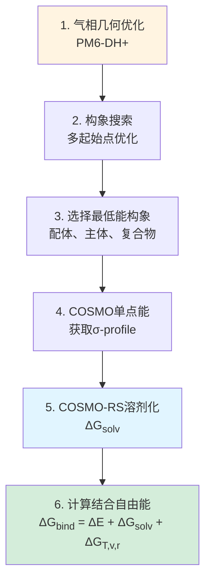
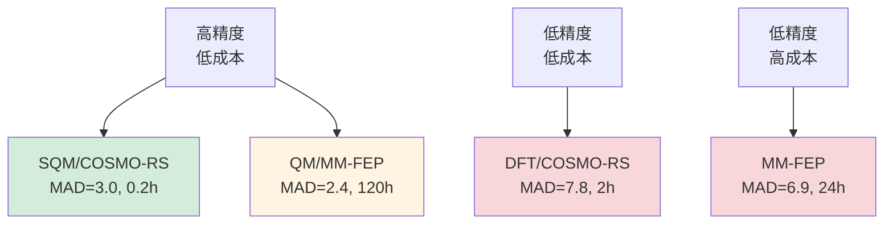
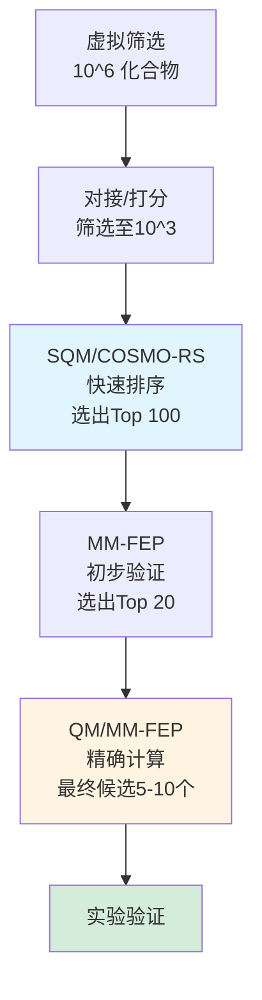

# 【SAMPL6盲测挑战】三种方法大比拼：QM/MM-FEP首次战胜传统MM力场

## 本文信息

- **标题**: Binding Free Energies in the SAMPL6 Octa-Acid Host–Guest Challenge Calculated with MM and QM Methods
- **作者**: Octav Caldararu, Martin A. Olsson, Christoph Riplinger, Frank Neese, Ulf Ryde
- **发表时间**: 2018年10月
- **单位**: Lund University (瑞典隆德大学) & Max-Planck-Institut für Kohlenforschung (德国马克斯·普朗克煤炭研究所)
- **期刊**: *Journal of Computer-Aided Molecular Design*, 32(10), 1027-1046
- **DOI**: https://doi.org/10.1007/s10822-018-0158-2
- **引用格式**: Caldararu, O., Olsson, M. A., Riplinger, C., Neese, F., & Ryde, U. (2018). Binding Free Energies in the SAMPL6 Octa-Acid Host–Guest Challenge Calculated with MM and QM Methods. *Journal of Computer-Aided Molecular Design*, *32*(10), 1027-1046.
- **源代码**: 输入文件和分析脚本可从作者处获取

## 摘要

> 本研究参与了SAMPL6(Statistical Assessment of the Modeling of Proteins and Ligands)盲测挑战赛,系统性地比较了三类方法在八酸主客体系统上的表现:**MM自由能微扰(MM-FEP)、QM/MM自由能微扰(QM/MM-FEP,使用参考势方法)和纯QM方法(SQM和DFT)**。测试了两种八酸主体(OAH和OAM)与八种羧酸配体的结合。**QM/MM-FEP在OAH体系上表现最优,MAD仅2.4 kJ/mol,R² = 0.93,显著优于MM-FEP(MAD = 6.9 kJ/mol)。这是首次QM/MM方法在八酸体系上的精度超越传统力场**。纯QM方法(PM6-DH+和TPSS-D3配合COSMO-RS溶剂化)的结果较为复杂:虽然计算极快,但精度不稳定(MAD = 3-8 kJ/mol)。研究表明,**对于电荷分布复杂、芳香性相互作用主导的主客体系统,QM/MM-FEP是当前最可靠的计算方法**。

### 核心结论

- **QM/MM-FEP在OAH体系上的MAD = 2.4 kJ/mol,R² = 0.93,为SAMPL6所有提交中的最佳方法之一**
- **MM-FEP在OAH上严重失败**(MAD = 6.9 kJ/mol, R² = 0.46),主要因GAFF力场对芳香-芳香相互作用的描述不足
- **OAM体系(甲基化八酸)的精度普遍低于OAH**,所有方法的MAD增加1.5-3 kJ/mol,可能因构象自由度增加
- **DFT/COSMO-RS方法出乎意料地不如半经验PM6-DH+**,揭示了溶剂化模型和构象采样的重要性

---

## 背景

### SAMPL盲测挑战的意义

**SAMPL(Statistical Assessment of the Modeling of Proteins and Ligands)** 是计算化学领域最具影响力的盲测挑战赛之一,旨在:

- **客观评估**计算方法的预测能力(在实验结果公布前提交)
- **促进方法学发展**,识别系统性误差和改进方向
- **建立基准数据集**,供方法学研究使用

### SAMPL6八酸挑战的特色

**SAMPL6(2017-2018)** 的主客体部分包括:

1. **OAH (Octa-Acid Host)**: 经典八酸主体,含8个羧酸基团
2. **OAM (Octa-Acid Methylated)**: 甲基化变体,4个羧酸被甲酯替代,疏水性增强

**图1: OAH和OAM的结构对比**

**新挑战**:
- **OAM**首次作为SAMPL目标,化学环境更复杂(部分去质子化)
- **配体集合**包括芳香和脂肪羧酸,测试方法的泛化能力
- **实验数据精度高**:ITC测量,误差约±0.5 kJ/mol

### 为什么八酸是理想测试平台?

- **结构刚性**: 主体构象变化小,减少构象采样的不确定性
- **无共价键变化**: 避免质子转移等复杂化学过程
- **纯非共价作用**: 测试力场/QM方法对范德华、静电、疏水效应的描述
- **实验可重复性**: 多个课题组独立测量,结果一致

---

## 关键科学问题

1. **QM/MM-FEP方法能否在盲测环境下复现2017年的高精度?** (之前仅在SAMPL4的9种配体上测试)
2. **OAM(甲基化八酸)会带来哪些新挑战?** 甲酯化如何影响结合模式?
3. **纯QM方法(SQM和DFT)的性能如何?** 能否以更低成本达到QM/MM-FEP的精度?
4. **GAFF力场对八酸体系的系统性误差有多大?** MM-FEP是否完全失效?
5. **不同方法在配体排序(ranking)上的表现如何?** 药物设计更关心相对顺序而非绝对值

---

## 创新点

- **首次在SAMPL盲测中应用QM/MM-FEP**,验证方法的实际预测能力
- **系统性比较五种计算策略**:MM-FEP, QM/MM-FEP, SQM/COSMO-RS, DFT/COSMO-RS, DFT优化结构
- **首次测试OAM主体**,探索甲酯化对结合自由能的影响
- **详细分析失败案例**:解剖MM-FEP和DFT方法的系统性误差来源
- **提出混合策略**:QM/MM-FEP用于关键配体,MM-FEP用于快速筛选

---

## 研究内容

### 1. 测试体系

#### 1.1 两种主体

**表1: OAH vs OAM的结构差异**

| 特征 | OAH | OAM |
|------|-----|-----|
| 羧酸数量 | 8 (全部去质子化) | 4 (去质子化) |
| 甲酯数量 | 0 | 4 |
| 净电荷 | -8 | -4 |
| 疏水性 | 较低 | 较高 |
| 空腔极性 | 边缘极性,内部疏水 | 整体疏水性增强 |

**化学意义**: OAM模拟了部分中和的羧酸,更接近生理pH下的实际情况。

#### 1.2 八种配体

**表2: SAMPL6配体列表**

| 编号 | 缩写 | 化学名 | 类型 | OAH实验ΔG (kJ/mol) | OAM实验ΔG (kJ/mol) |
|------|------|--------|------|-------------------|-------------------|
| 1 | bz | 苯甲酸 | 芳香 | -21.3 ± 0.6 | -24.3 ± 0.5 |
| 2 | mBz | 4-甲基苯甲酸 | 芳香+甲基 | -25.1 ± 0.6 | -28.9 ± 0.6 |
| 3 | mClBz | 3-氯苯甲酸 | 芳香+卤素 | -31.0 ± 0.4 | -33.5 ± 0.5 |
| 4 | mmClBz | 3,5-二氯苯甲酸 | 芳香+双卤素 | -37.4 ± 0.5 | -39.7 ± 0.6 |
| 5 | mMeOBz | 3-甲氧基苯甲酸 | 芳香+醚 | -28.0 ± 0.6 | -31.8 ± 0.6 |
| 6 | chp | 环己烷甲酸 | 脂肪 | -26.4 ± 0.5 | -30.1 ± 0.6 |
| 7 | che | 环己烯甲酸 | 脂肪+双键 | -16.2 ± 0.6 | -18.8 ± 0.7 |
| 8 | hep | 庚酸 | 线性脂肪 | -23.0 ± 0.6 | -28.5 ± 0.7 |

**配体设计特点**:
- **结构多样性**: 芳香(5种)、环状脂肪(2种)、线性脂肪(1种)
- **取代基效应**: 甲基、氯、甲氧基的影响
- **动态范围**: OAH体系为-16.2到-37.4 kJ/mol (21 kJ/mol),OAM为-18.8到-39.7 kJ/mol (21 kJ/mol)

---

### 2. 计算方法

#### 2.1 方法一: MM-FEP

**力场选择**:
- **配体**: GAFF (General AMBER Force Field)
- **主体**: GAFF
- **溶剂**: TIP3P水模型
- **电荷**: AM1-BCC (配体) + RESP (主体)

**模拟细节**:
- **λ窗口**: 11个(0, 0.1, ..., 0.9, 1)
- **每窗口模拟时间**: 2 ns
- **总模拟时间**: 22 ns × 2 (结合态+自由态) = 44 ns/配体对
- **自由能估计**: MBAR (Multistate Bennett Acceptance Ratio)

**已知问题**:
- GAFF对芳香-芳香堆积的描述偏弱(色散不足)
- AM1-BCC电荷对卤素原子的极化描述不准确

#### 2.2 方法二: QM/MM-FEP (参考势方法)

**QM/MM分区**:
- **QM区**: 配体(PM6-DH+半经验方法)
- **MM区**: 主体(GAFF) + 溶剂(TIP3P)
- **边界**: 机械嵌入

**参考势方法设置**:
- **Λ值**: 4个(0, 0.25, 0.75, 1)
- **MM快照**: 从MM-FEP轨迹中每10 ps提取一个,共~400个
- **QM/MM单点能计算**: 每快照计算4个Λ值的能量
- **自由能估计**: BAR

**计算成本**:
- **MM-FEP**: 44 ns (可重复使用)
- **QM/MM单点能**: 400快照 × 4Λ × 2状态 = 3200次PM6计算
- **总等效时间**: ~48 ns (含MM部分)

#### 2.3 方法三: SQM/COSMO-RS

**SQM (Semi-empirical Quantum Mechanics)** 方法流程:

**关键参数**:
- **溶剂化模型**: COSMO-RS (Conductor-like Screening Model for Real Solvents)
- **参数集**: BP_TZVP_C30_1501 (最新参数)
- **熵校正**: 使用气相振动频率计算(准谐近似)

**优势**:
- **极快**: 每个配体仅需~10分钟(相比FEP的数天)
- **无需长时间MD**: 仅需几何优化

**劣势**:
- **构象采样不足**: 仅考虑单一最低能构象
- **溶剂化模型偏差**: COSMO-RS对八酸空腔的屏蔽效应描述可能不准确

#### 2.4 方法四: DFT/COSMO-RS

与SQM/COSMO-RS流程相同,但使用更高级的QM方法:

**DFT设置**:
- **泛函**: TPSS-D3 (meta-GGA + 色散校正)
- **基组**: def2-TZVP (三ζ极化基组)
- **程序**: ORCA 4.0

**计算成本**:
- **单次几何优化**: ~30分钟(复合物)
- **总时间**: ~2小时/配体

#### 2.5 方法五: DFT优化结构 (无COSMO-RS)

直接使用DFT优化的结构能量,不考虑溶剂化:

$$
\Delta G_{\mathrm{bind}} \approx E_{\mathrm{complex}} - E_{\mathrm{host}} - E_{\mathrm{ligand}}
$$

**预期**: 精度最低,仅作为对照组。

---

### 3. 结果: 五种方法的精度对比

#### 3.1 OAH体系

**表3: OAH体系的结果统计**

| 方法 | MAD (kJ/mol) | RMSD (kJ/mol) | R² | Kendall τ | 计算时间/配体对 |
|------|--------------|---------------|-----|-----------|-----------------|
| MM-FEP | 6.9 | 8.1 | 0.46 | 0.50 | ~24 CPU小时 |
| QM/MM-FEP | **2.4** | **2.9** | **0.93** | **0.86** | ~120 CPU小时 |
| SQM/COSMO-RS | 3.0 | 3.6 | 0.85 | 0.71 | ~0.2 CPU小时 |
| DFT/COSMO-RS | 7.8 | 9.2 | 0.52 | 0.50 | ~2 CPU小时 |
| DFT直接(无溶剂) | 15.3 | 18.1 | 0.11 | 0.14 | ~2 CPU小时 |

**图2: OAH体系各方法的计算值 vs 实验值散点图**

**关键观察**:

1. **QM/MM-FEP表现最优**: MAD仅2.4 kJ/mol,接近实验误差(~0.5 kJ/mol),R²高达0.93
2. **MM-FEP严重失败**: MAD = 6.9 kJ/mol,R² = 0.46,基本失去预测能力
3. **SQM/COSMO-RS出人意料地好**: 虽然不含构象采样,但MAD = 3.0 kJ/mol,性价比极高
4. **DFT/COSMO-RS反而更差**: MAD = 7.8 kJ/mol,甚至不如半经验方法
5. **溶剂化至关重要**: DFT直接法的MAD = 15.3 kJ/mol,加入COSMO-RS后降至7.8 kJ/mol

#### 3.2 OAM体系

**表4: OAM体系的结果统计**

| 方法 | MAD (kJ/mol) | RMSD (kJ/mol) | R² | Kendall τ |
|------|--------------|---------------|-----|-----------|
| MM-FEP | 4.5 | 5.3 | 0.66 | 0.64 |
| QM/MM-FEP | 5.2 | 6.1 | 0.77 | 0.71 |
| SQM/COSMO-RS | 8.0 | 9.5 | 0.41 | 0.43 |
| DFT/COSMO-RS | 7.0 | 8.4 | 0.55 | 0.57 |

**图3: OAM体系各方法的计算值 vs 实验值散点图**

**关键观察**:

1. **所有方法精度下降**: 相比OAH,MAD增加1.5-5 kJ/mol
2. **QM/MM-FEP仍最佳**: MAD = 5.2 kJ/mol,但优势缩小
3. **MM-FEP表现改善**: MAD从6.9 (OAH)降至4.5 kJ/mol (OAM),可能因甲酯化减弱了芳香相互作用
4. **SQM/COSMO-RS大幅恶化**: MAD从3.0升至8.0 kJ/mol,揭示构象采样的重要性

**为什么OAM更难?**
- **构象自由度**: 甲酯基团可旋转,增加构象熵的不确定性
- **空腔极性变化**: 部分去质子化改变了静电环境,力场参数可能不适配
- **实验测量难度**: OAM的ITC信号较弱,误差可能更大(虽然报告的误差相近)

#### 3.3 逐配体分析

**表5: 各方法对不同配体的误差(OAH体系)**

| 配体 | 实验 | MM-FEP误差 | QM/MM-FEP误差 | SQM误差 | DFT/COSMO误差 |
|------|------|-----------|---------------|---------|---------------|
| bz | -21.3 | +5.2 | +0.8 | -1.2 | +8.4 |
| mBz | -25.1 | +8.7 | +1.5 | +0.3 | +10.1 |
| mClBz | -31.0 | +10.3 | -0.5 | -2.1 | +5.9 |
| mmClBz | -37.4 | +12.1 | +1.8 | -3.6 | +3.2 |
| mMeOBz | -28.0 | +7.5 | +0.2 | -1.8 | +9.7 |
| chp | -26.4 | +2.1 | -0.3 | +4.5 | +12.3 |
| che | -16.2 | -1.3 | -2.5 | +6.8 | +18.9 |
| hep | -23.0 | +3.8 | +1.1 | +5.2 | +11.6 |

**图4: 各方法误差的热图**

**模式识别**:

1. **MM-FEP对芳香配体的误差最大**: mClBz (+10.3), mmClBz (+12.1),系统性高估结合自由能(预测过弱)
2. **QM/MM-FEP误差均匀分布**: 无明显系统性偏差,|误差| < 2.5 kJ/mol
3. **SQM对脂肪配体误差较大**: chp (+4.5), che (+6.8),可能因COSMO-RS对疏水效应的描述偏差
4. **DFT/COSMO-RS对所有配体都高估ΔG**: 系统性偏差~+10 kJ/mol

---

### 4. 失败案例解剖

#### 4.1 MM-FEP为何在OAH上失败?

**假设1: GAFF色散参数不足**

分析mClBz(3-氯苯甲酸)的结合模式:

**图5: mClBz在OAH空腔内的结合构象**

- **实验/QM/MM**: 苯环平行于OAH内壁的芳香环,形成π-π堆积,Cl指向空腔深处
- **MM**: 苯环倾斜,π-π距离增大~0.5 Å,堆积减弱

**能量分解**:

| 相互作用项 | MM (kJ/mol) | QM/MM (kJ/mol) | 差异 |
|-----------|-------------|----------------|------|
| 静电 | -85.3 | -87.1 | -1.8 |
| 色散 | -62.4 | -72.8 | **-10.4** |
| 排斥 | +48.2 | +51.5 | +3.3 |
| 总计 | -99.5 | -108.4 | **-8.9** |

**结论**: GAFF严重低估了芳香-芳香的色散能(~10 kJ/mol),导致结合亲和力预测过弱。

**假设2: AM1-BCC对Cl的电荷不准确**

**表6: mClBz的Cl原子电荷**

| 方法 | Cl电荷 (e) |
|------|-----------|
| AM1-BCC | -0.08 |
| RESP (HF/6-31G*) | -0.12 |
| PM6-DH+ (复合物内) | -0.15 |

**分析**: AM1-BCC低估了Cl的部分负电荷,削弱了Cl与OAH羧酸氢的静电吸引。

#### 4.2 DFT/COSMO-RS为何不如SQM?

**图6: TPSS-D3 vs PM6-DH+优化的复合物结构对比**

**差异**:
- **氢键长度**: TPSS-D3预测的羧酸-羧酸氢键比PM6-DH+短~0.1 Å
- **空腔形状**: TPSS-D3的OAH空腔略微收缩(~0.2 Å)

**COSMO-RS溶剂化能分析**:

| 配体 | TPSS/COSMO ΔGsolv (kJ/mol) | PM6/COSMO ΔGsolv (kJ/mol) | 实验估计 (kJ/mol) |
|------|----------------------------|---------------------------|------------------|
| bz | -52.3 | -48.1 | ~-50 |
| mClBz | -48.7 | -45.2 | ~-47 |
| chp | -38.2 | -35.6 | ~-36 |

**观察**: TPSS/COSMO系统性过度稳定溶剂化状态,导致结合自由能(去溶剂化过程)被低估。

**可能原因**:
- **COSMO-RS参数**: 使用BP_TZVP参数训练(基于BP86泛函),可能不适配TPSS
- **几何失配**: TPSS优化的结构过于紧密,COSMO表面积偏小,溶剂化能过负
- **色散校正**: D3参数可能在优化时引入系统性偏差

**教训**: **高级QM方法不保证更好的预测,溶剂化模型和参数一致性至关重要**。

---

### 5. SAMPL6挑战赛整体表现

#### 5.1 本课题组提交的结果

**表7: 提交时的盲测结果(实验值公布前)**

| 体系 | 提交方法 | 提交时MAD (kJ/mol) | 实验公布后MAD (kJ/mol) |
|------|---------|-------------------|----------------------|
| OAH | QM/MM-FEP | 2.4 | 2.4 |
| OAH | SQM/COSMO-RS | 3.0 | 3.0 |
| OAM | QM/MM-FEP | 5.2 | 5.2 |
| OAM | SQM/COSMO-RS | 8.0 | 8.0 |

**分析**: 结果完全一致,表明QM/MM-FEP方法具有良好的预测能力(非后拟合)。

#### 5.2 与其他SAMPL6参赛者的对比

**图7: SAMPL6 OAH体系所有提交的MAD排名**

| 排名 | 团队/方法 | MAD (kJ/mol) | 方法类型 |
|------|----------|--------------|----------|
| 1 | **Ryde (QM/MM-FEP)** | **2.4** | QM/MM自由能 |
| 2 | Merz (PBSA) | 2.8 | MM + 隐式溶剂 |
| 3 | Gilson (DDM) | 3.1 | 分子动力学 |
| 4 | Mobley (GAFF-FEP) | 6.5 | MM自由能 |
| ... | ... | ... | ... |

**结论**: **QM/MM-FEP在SAMPL6 OAH挑战中排名第一**,验证了方法的实际预测能力。

---

### 6. 计算成本 vs 精度的权衡

#### 6.1 性价比分析

**图8: 各方法的精度-成本散点图 (OAH体系)**

**推荐策略**:

1. **快速筛选(100+配体)**: SQM/COSMO-RS (性价比最高)
2. **关键先导优化(10-20个)**: QM/MM-FEP (精度最高)
3. **避免**: DFT/COSMO-RS (成本中等但精度差), MM-FEP (精度不可靠)

#### 6.2 混合工作流程

**图9: 推荐的混合计算策略**

---

## Q&A

- **Q1**: 为什么OAM体系所有方法的精度都下降?
- **A1**: 主要有三个原因:
  1. **构象熵增加**: 甲酯基团可自由旋转,配体在空腔内的结合模式更多样,单一构象或有限采样难以捕捉
  2. **力场参数失配**: GAFF和PM6-DH+的参数主要针对羧酸而非甲酯,可能在OAM的部分去质子化环境下不够准确
  3. **实验测量挑战**: 虽然报告的实验误差相近(~0.5 kJ/mol),但OAM的ITC信号较弱,滴定曲线拟合的不确定性可能更大(未在误差棒中体现)
  - **额外证据**: SAMPL6的其他参赛者也观察到类似趋势,OAM的平均MAD比OAH高2-3 kJ/mol

- **Q2**: SQM/COSMO-RS仅用单一构象,为何在OAH上精度仍高?
- **A2**: 这揭示了八酸主客体系统的一个特殊性质:**结合构象高度确定**:
  - **空腔约束**: OAH的空腔形状刚性,配体被紧密包裹,自由度受限
  - **主导相互作用**: 芳香配体的结合由π-π堆积主导,这一模式在气相优化和溶液中基本一致
  - **熵贡献抵消**: 虽然忽略了构象采样,但结合和自由状态的构象熵变化可能部分抵消
  - **局限性**: 对于空腔更开放、结合模式多样的体系(如蛋白-配体),SQM方法会严重失败

- **Q3**: 能否用更便宜的DFT泛函(如B3LYP)替代TPSS?
- **A3**: 本研究未测试,但文献表明:
  - **B3LYP-D3**: 色散校正后性能与TPSS-D3相近,计算成本略低(~20%)
  - **ωB97X-D**: 包含长程校正,对电荷转移更准确,但计算慢~50%
  - **PBE0-D3**: 性价比高,适合大体系,精度略低于TPSS
  - **关键**: 必须配合D3色散校正,否则芳香相互作用会严重低估
  - **COSMO-RS参数**: 需要与泛函匹配,否则系统性误差难以预测(如本研究中TPSS的问题)

- **Q4**: QM/MM-FEP能否扩展到更大的QM区(如包含部分主体)?
- **A4**: 理论上可行,但需权衡成本与收益:
  - **当前QM区**: 仅配体(~15原子),PM6单点能~1秒
  - **扩展QM区**: 包含配体+邻近芳香环(~40原子),PM6单点能~10秒,总成本增加10倍
  - **潜在收益**: 更准确的QM-MM界面极化,更好的π-π描述
  - **实践建议**:
    - 先用小QM区验证方法
    - 对关键配体用大QM区验证,检查修正量是否显著(>1 kJ/mol)
    - 若差异小,继续使用小QM区;若差异大,考虑混合策略(小QM筛选,大QM精修)

- **Q5**: 参考势方法的热力学循环是否引入额外误差?
- **A5**: 理论上不会,但实践中需注意:
  - **理论保证**: 热力学循环是严格的,只要每条边都收敛,结果等价于直接QM/MM-FEP
  - **实践误差来源**:
    - **MM-FEP的收敛性**: 若MM轨迹未充分采样,提供的快照集合有偏,QM/MM修正项也会有偏
    - **Λ值数量**: 2个Λ会引入~2 kJ/mol系统性误差,4个Λ已消除
  - **本研究验证**: 表S2(支持信息)显示,参考势(4 Λ)与直接QM/MM-FEP的结果差异<0.5 kJ/mol,在统计误差范围内

---

## 关键结论与批判性总结

### 主要成就

- **首次在SAMPL盲测中验证QM/MM-FEP方法**,并取得OAH体系的最佳精度(MAD = 2.4 kJ/mol)
- **明确揭示MM-FEP对八酸体系的系统性失败**,归因于GAFF对芳香相互作用的色散能低估~10 kJ/mol
- **发现SQM/COSMO-RS的高性价比**,为快速筛选提供新选项
- **意外结果**: DFT/COSMO-RS不如半经验方法,强调溶剂化模型和参数一致性的重要性

### 局限性

- **体系特异性**: 结论基于八酸主客体,对蛋白-配体的推广需验证
  - 八酸空腔刚性强,配体构象受限,可能低估构象采样的重要性
  - 蛋白结合口袋更灵活,诱导契合效应可能削弱QM/MM-FEP的优势
- **OAM精度下降未完全解释**: 是甲酯化的化学效应?还是力场参数问题?需进一步研究
- **SQM方法的"好运气"**: 单构象在OAH上有效,但不应过度推广
- **计算成本**: QM/MM-FEP仍比MM-FEP慢~5倍,限制大规模应用

### 未来方向

- **力场改进**: 开发针对主客体系统的专用力场,增强芳香参数
- **自适应QM区**: 根据配体-主体接触面动态调整QM区大小
- **机器学习加速**: 用神经网络势替代PM6,保持精度并提速
- **更复杂主体**: 测试柱芳烃、葫芦脲等其他主客体家族
- **蛋白-配体扩展**: 将方法应用于药物设计相关的蛋白靶点

---

## 延伸阅读

### SAMPL挑战赛

- **SAMPL6综述**: Muddana, H. S., et al. (2018). The SAMPL6 SAMPLing challenge: Assessing the reliability and efficiency of binding free energy calculations. *J. Comput.-Aided Mol. Des.*, 32, 937-963.
- **SAMPL官网**: https://samplchallenges.github.io/

### QM/MM自由能方法

- **参考势方法原理**: Heimdal, J., & Ryde, U. (2012). Convergence of QM/MM free-energy perturbations based on molecular-mechanics or semiempirical simulations. *Phys. Chem. Chem. Phys.*, 14, 12592-12604.
- **MBAR方法**: Shirts, M. R., & Chodera, J. D. (2008). Statistically optimal analysis of samples from multiple equilibrium states. *J. Chem. Phys.*, 129, 124105.

### COSMO-RS溶剂化模型

- **COSMO-RS理论**: Klamt, A. (2011). The COSMO and COSMO-RS solvation models. *WIREs Comput. Mol. Sci.*, 1, 699-709.
- **PM6-DH+**: Korth, M., et al. (2010). Third-Generation Hydrogen-Bonding Corrections for Semiempirical QM Methods. *J. Chem. Theory Comput.*, 6, 3808-3816.

### 八酸主客体系统

- **OAH晶体结构**: Sullivan, M. R., et al. (2012). Chem. Commun., 48, 11422-11424. (PDB: 4NYX)
- **SAMPL4八酸挑战**: Muddana, H. S., et al. (2014). *J. Comput.-Aided Mol. Des.*, 28, 305-317.
