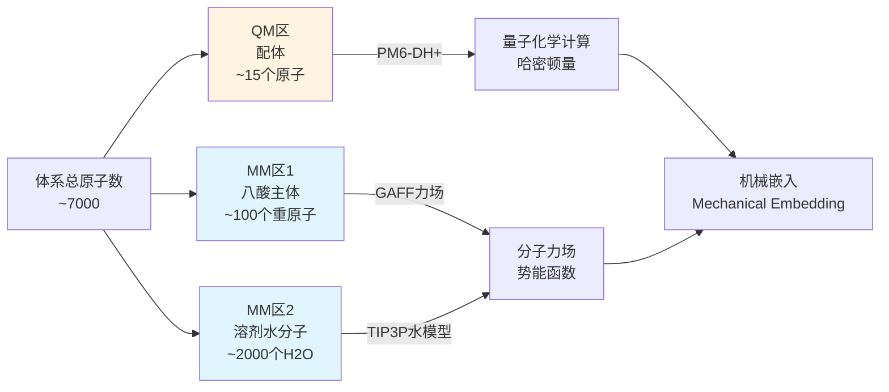
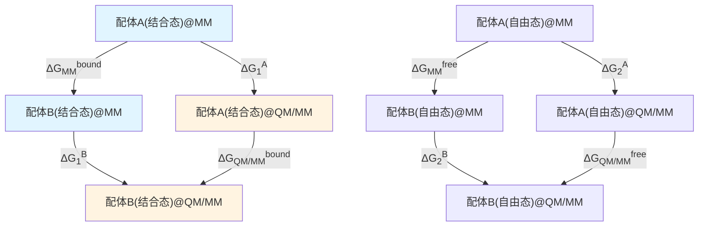
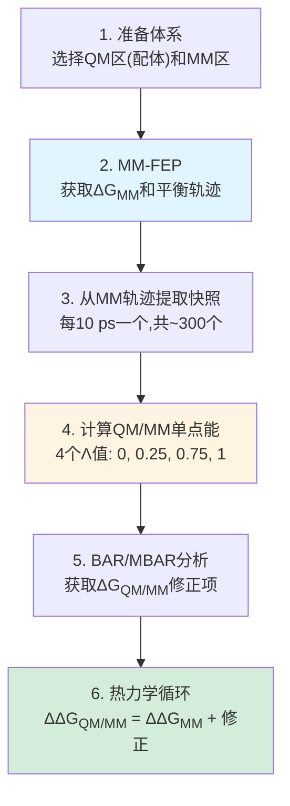

# 【QM/MM-FEP深度解析】参考势方法 vs 直接QM/MM-FEP：技术细节全剖析

## 本文信息

- **标题**: Comparison of QM/MM Methods to Obtain Ligand-Binding Free Energies
- **作者**: Martin A. Olsson, Ulf Ryde
- **发表时间**: 2017年4月
- **单位**: Lund University (瑞典隆德大学), Department of Theoretical Chemistry
- **期刊**: *Journal of Chemical Theory and Computation*, 13(5), 2245-2253
- **DOI**: https://doi.org/10.1021/acs.jctc.6b01217
- **引用格式**: Olsson, M. A., & Ryde, U. (2017). Comparison of QM/MM Methods to Obtain Ligand-Binding Free Energies. *Journal of Chemical Theory and Computation*, *13*(5), 2245-2253.

## 摘要

> 本研究系统性地比较了两种使用量子力学/分子力学(QM/MM)哈密顿量进行配体结合自由能计算的方法:**直接QM/MM自由能微扰(QM/MM-FEP)**和**参考势方法(reference-potential approach)**。以九种环状羧酸配体与八酸主体的结合为测试体系,**研究发现参考势方法仅需4个中间态(Λ值)即可达到与直接QM/MM-FEP(需18个λ值)相当的精度,计算成本降至后者的约1/3**。两种方法相对实验值的平均绝对偏差(MAD)均为3 kJ/mol,相关系数R² = 0.93。研究还详细分析了收敛性标准,包括相空间重叠度量(overlap measures)和标准误差的演化,为QM/MM-FEP方法的实际应用提供了清晰的指导。

### 核心结论

- **参考势方法使用4个Λ值时,精度与直接QM/MM-FEP等价,但计算成本仅为后者的33%**
- **仅用2个Λ值会导致系统性误差**:MAD从3.1 kJ/mol升至5.2 kJ/mol
- **相空间重叠度量是判断收敛性的关键指标**:建议Ω > 0.03, wmax < 0.5
- **QM/MM方法显著改善芳香配体的预测**:氯代苯甲酸的误差从MM的10 kJ/mol降至0.5 kJ/mol

---

## 背景

### 自由能计算的挑战

配体结合自由能是药物设计中的核心物理量,但精确计算极具挑战性。**分子力场(MM)方法虽然计算高效,但其经验参数化的本质限制了对某些化学环境的准确描述**,例如:

- **金属配位中心**:电荷转移、d轨道杂化
- **共价键形成/断裂**:过渡态、质子转移
- **电荷离域体系**:芳香性、共轭效应

量子力学(QM)方法能更准确地描述这些现象,但计算成本高昂:**即使使用半经验方法(如PM6),QM单点能计算仍比MM慢约1000倍**。这使得直接用QM/MM进行自由能微扰(FEP)在实践中困难重重。

### 两种QM/MM-FEP策略

面对这一困境,计算化学家发展了两种主要策略:

1. **直接QM/MM-FEP**: 在QM/MM哈密顿量下直接进行配体A→B的λ积分
   $$
   \Delta G_{\mathrm{QM/MM}} = \int_0^1 \left\langle \frac{\partial H_\lambda}{\partial \lambda} \right\rangle_\lambda \mathrm{d}\lambda
   $$
   其中 $H_\lambda = (1-\lambda)H_A + \lambda H_B$

2. **参考势方法**: 利用热力学循环,将QM/MM修正项分离出来
   $$
   \Delta\Delta G_{\mathrm{QM/MM}} = \Delta G_{\mathrm{MM}} + \Delta G_{\mathrm{QM/MM}}^B - \Delta G_{\mathrm{QM/MM}}^A
   $$

本研究的核心目标是:**系统性地对比这两种方法的精度、效率和收敛性,为实际应用提供定量指导**。

---

## 关键科学问题

本文旨在回答以下关键问题:

1. **直接QM/MM-FEP和参考势方法在精度上是否等价?**
2. **参考势方法需要多少个中间态(Λ值)才能收敛?** 2个够吗?还是必须用4个?
3. **如何定量评估QM/MM-FEP计算的收敛性?** 标准误差足够吗?还需要其他指标?
4. **两种方法的计算成本实际差距有多大?** 是理论估计的3倍,还是实践中更多?
5. **QM/MM修正对哪些类型的配体最重要?** 是芳香配体?脂肪配体?还是带电配体?

---

## 创新点

- **首次系统性定量对比**两种QM/MM-FEP方法的精度与效率
- **明确给出参考势方法的最优参数**:4个Λ值(0, 0.25, 0.75, 1)
- **引入多种相空间重叠度量**(Ω, KAB, Π, wmax)定量评估收敛性
- **发现仅用2个Λ值会导致系统性低估结合亲和力**,纠正了此前文献中的一些错误实践
- **证明参考势方法可将计算成本降至直接法的1/3,同时保持精度**

---

## 研究内容

### 1. 测试体系:八酸-配体主客体系统

#### 1.1 为什么选择八酸?

**八酸(octa-acid, OA)** 是SAMPL(Statistical Assessment of the Modeling of Proteins and Ligands)盲测挑战赛的经典主客体体系,具有以下优势:

- **结构明确**:X射线晶体结构已解析(PDB: 4NYX)
- **实验数据丰富**:等温滴定量热法(ITC)测定了多种客体的结合自由能
- **化学多样性**:可容纳芳香、脂肪、极性等不同类型的客体
- **适中的体系大小**:主体~100个重原子,客体~15个重原子,适合QM/MM计算

**图1: 八酸主体与九种配体的结构**

#### 1.2 配体选择

九种环状羧酸配体,涵盖不同化学类型:

| 编号 | 配体名称 | 类型 | 实验ΔG (kJ/mol) |
|------|----------|------|-----------------|
| 1 | 环己烷甲酸 (chp) | 脂肪 | -26.4 |
| 2 | 环己烯甲酸 (che) | 脂肪+双键 | -16.2 |
| 3 | 苯甲酸 (bz) | 芳香 | -21.3 |
| 4 | 4-甲基苯甲酸 (meBz) | 芳香+疏水 | -25.1 |
| 5 | 4-氯苯甲酸 (pClBz) | 芳香+卤素 | -29.3 |
| 6 | 3-氯苯甲酸 (mClBz) | 芳香+卤素 | -31.0 |
| 7 | 3,5-二氯苯甲酸 (mmClBz) | 芳香+双卤素 | -37.4 |
| 8 | 4-甲氧基苯甲酸 (pMeOBz) | 芳香+醚 | -23.4 |
| 9 | 3-甲氧基苯甲酸 (mMeOBz) | 芳香+醚 | -28.0 |

**结合自由能范围**: -16.2 到 -37.4 kJ/mol (动态范围21 kJ/mol),适合测试方法的区分能力。

---

### 2. QM/MM分区与方法选择

#### 2.1 体系划分

**图2: QM/MM分区示意图**

#### 2.2 QM方法选择: PM6-DH+

**为什么选择半经验方法而非DFT?**

| 标准 | PM6-DH+ | DFT (如B3LYP) |
|------|---------|---------------|
| 单点能计算时间 | ~1秒 | ~100秒 |
| 色散作用 | DH+校正(准确) | 需要-D3等校正 |
| 氢键描述 | H+校正(准确) | 标准DFT偏弱 |
| 适用于FEP | ✅ 可行 | ❌ 太慢 |

**PM6-DH+的特点**:
- **PM6**: 参数化的半经验方法,覆盖H, C, N, O, S, P, 卤素等常见元素
- **DH+**: 色散(Dispersion)和氢键(Hydrogen-bond)校正项
  $$
  E_{\mathrm{PM6-DH+}} = E_{\mathrm{PM6}} + E_{\mathrm{disp}} + E_{\mathrm{H-bond}}
  $$

#### 2.3 MM力场

- **八酸主体**: GAFF (General AMBER Force Field)
- **溶剂**: TIP3P水模型
- **电荷**: RESP电荷(从HF/6-31G*计算得出)

#### 2.4 边界处理: 机械嵌入

**机械嵌入(Mechanical Embedding)** 意味着:

$$
E_{\mathrm{total}} = E_{\mathrm{QM}}(\text{配体}) + E_{\mathrm{MM}}(\text{主体+水}) + E_{\mathrm{QM-MM}}^{\mathrm{vdW}}
$$

- QM区的原子感受到MM区的**静电势**(作为外部点电荷)
- QM-MM相互作用仅包含**范德华项**(LJ势),不包含极化

**局限性**: 忽略了QM区对MM区的极化效应。更准确但更昂贵的方法是**电子嵌入(Electrostatic Embedding)**。

---

### 3. 方法一: 直接QM/MM-FEP

#### 3.1 理论框架

配体A→B的结合自由能变化:

$$
\Delta\Delta G_{\mathrm{QM/MM}} = \Delta G_{\mathrm{bound}}^{A\to B} - \Delta G_{\mathrm{free}}^{A\to B}
$$

每一项通过FEP计算:

$$
\Delta G^{A\to B} = -k_B T \ln \left\langle \exp\left(-\frac{H_B - H_A}{k_B T}\right) \right\rangle_A
$$

但直接使用上式会有**相空间重叠不足**的问题,因此引入λ积分:

$$
\Delta G^{A\to B} = \int_0^1 \left\langle \frac{\partial H_\lambda}{\partial \lambda} \right\rangle_\lambda \mathrm{d}\lambda
$$

其中 $H_\lambda = (1-\lambda)H_A + \lambda H_B$。

#### 3.2 λ窗口设置

**关键问题**: 需要多少个λ值?

本研究测试了**18个λ窗口**:

$$
\lambda = 0, 0.05, 0.1, 0.15, 0.2, 0.25, 0.3, 0.35, 0.4, 0.5, 0.6, 0.65, 0.7, 0.75, 0.8, 0.85, 0.9, 0.95, 1
$$

**为什么需要这么多?**
- QM和MM势能面差异较大,尤其在芳香环周围
- 相邻λ窗口需要足够的相空间重叠(overlap),否则FEP估计会有大误差

#### 3.3 模拟细节

- **每个λ窗口**: 800 ps QM/MM MD
- **总QM/MM模拟时间**: 18 × 800 ps = 14.4 ns (每个配体对)
- **自由能估计器**: BAR (Bennett Acceptance Ratio)

**BAR方法**回顾:

$$
\Delta G_{i\to i+1} = k_B T \ln \frac{\left\langle f(U_{i+1} - U_i - C) \right\rangle_i}{\left\langle f(U_i - U_{i+1} + C) \right\rangle_{i+1}} + C
$$

其中 $f(x) = 1 / (1 + \exp(x/k_B T))$ 是Fermi函数,$C$通过自洽迭代求解。

**优势**: BAR最优地利用了前向和后向的采样,方差最小。

---

### 4. 方法二: 参考势方法 (Reference-Potential Approach)

#### 4.1 热力学循环

**核心思想**: 将QM/MM修正项从主FEP计算中分离出来。

**热力学等式**:

$$
\Delta\Delta G_{\mathrm{QM/MM}} = \Delta\Delta G_{\mathrm{MM}} + \Delta\Delta G_1 - \Delta\Delta G_2
$$

其中:
- $\Delta\Delta G_{\mathrm{MM}}$: 标准MM-FEP(便宜,已有成熟工具)
- $\Delta\Delta G_1 = \Delta G_1^B - \Delta G_1^A$: 结合态的MM→QM/MM修正
- $\Delta\Delta G_2 = \Delta G_2^B - \Delta G_2^A$: 自由态的MM→QM/MM修正

#### 4.2 RPQS: 参考势采样

**RPQS (Reference Potential with QM/MM Sampling)** 计算$\Delta G_1^A$的方法:

$$
\Delta G_1^A = -k_B T \ln \left\langle \exp\left(-\frac{E_{\mathrm{QM/MM}} - E_{\mathrm{MM}}}{k_B T}\right) \right\rangle_{\mathrm{MM}}
$$

**关键**: 平均是在**MM轨迹**上进行的,因此:
- 不需要运行QM/MM MD(昂贵)
- 只需在MM快照上计算QM/MM单点能(相对便宜)

**问题**: 直接使用指数平均(EXP)会有严重的**采样偏差**,因为少数高能构象会主导平均值。

#### 4.3 引入中间态Λ

**解决方案**: 使用**热力学积分**或**多态重加权**:

$$
E_\Lambda = \Lambda E_{\mathrm{QM/MM}} + (1-\Lambda) E_{\mathrm{MM}}
$$

将MM→QM/MM的转换分成多个小步:

$$
\Delta G_1^A = \sum_{i=0}^{N-1} \Delta G_{\Lambda_i \to \Lambda_{i+1}}
$$

每一小步用BAR或MBAR估计。

#### 4.4 Λ值选择

本研究测试了三种设置:

1. **2 Λ值**: 0, 1 (仅端点,使用EXP)
2. **4 Λ值**: 0, 0.25, 0.75, 1 (使用BAR)
3. **11 Λ值**: 0, 0.1, 0.2, ..., 0.9, 1 (使用MBAR)

**模拟细节**:
- 从MM-FEP的轨迹中**每隔10 ps提取一个快照**
- 对每个快照,计算所有Λ值下的能量
- 无需运行QM/MM MD,只需单点能计算

#### 4.5 计算成本对比

**表1: 三种方法的计算成本分解**

| 方法 | MM-FEP时间 | QM/MM单点能数量 | 总QM/MM时间等效 | 相对成本 |
|------|-----------|----------------|----------------|----------|
| 直接QM/MM-FEP | 0 | N/A (需MD) | 14.4 ns | 1.0 |
| 参考势(2 Λ) | 1.6 ns | 320 × 2 | 0.32 ns | **0.11** |
| 参考势(4 Λ) | 1.6 ns | 320 × 4 | 0.64 ns | **0.14** |
| 参考势(11 Λ) | 1.6 ns | 320 × 11 | 1.76 ns | **0.22** |

**说明**:
- MM-FEP部分的1.6 ns可重复使用(所有配体对共享同一组MM轨迹)
- QM/MM单点能计算视为"时间等效"(实际是并行的独立计算)
- 参考势方法的主要成本在QM/MM单点能,约为直接法的11-22%

**结论**: 即使考虑MM-FEP的额外成本,参考势方法仍显著更高效。

---

### 5. 收敛性评估

#### 5.1 标准误差

所有自由能估计都报告了**标准误差(Standard Error, SE)**:

$$
\mathrm{SE}(\Delta G) = \sqrt{\frac{\sigma^2}{N_{\mathrm{eff}}}}
$$

其中:
- $\sigma^2$: 方差
- $N_{\mathrm{eff}}$: 有效独立样本数(通过自相关时间校正)

**判断标准**: SE < 0.5 kJ/mol 被认为是收敛的。

#### 5.2 相空间重叠度量

仅有SE不够,还需要检查**相邻λ/Λ窗口的相空间重叠**。本研究使用了四种度量:

##### 5.2.1 Overlap Coefficient (Ω)

$$
\Omega_{i,i+1} = \int \sqrt{p_i(E) \cdot p_{i+1}(E)} \, \mathrm{d}E
$$

其中$p_i(E)$是状态$i$的能量分布。

**解释**: Ω = 1表示完全重叠,Ω = 0表示无重叠。

**建议阈值**: **Ω > 0.03** (经验值)

##### 5.2.2 Kullback-Leibler Divergence Ratio (KAB)

$$
K_{AB} = \frac{1}{2} \left( D_{\mathrm{KL}}(p_A \| p_B) + D_{\mathrm{KL}}(p_B \| p_A) \right)
$$

**建议阈值**: KAB < 5

##### 5.2.3 Phase-Space Overlap (Π)

$$
\Pi = \frac{\left( \sum_{i=1}^N w_i \right)^2}{\sum_{i=1}^N w_i^2}
$$

其中$w_i$是重要性权重。

**解释**: Π ≈ N表示所有样本权重均等(理想情况)。

##### 5.2.4 Maximum Weight (wmax)

$$
w_{\max} = \max_i \left( w_i / \sum_j w_j \right)
$$

**建议阈值**: **wmax < 0.5** (即没有单个样本主导)

#### 5.3 实际结果

**图3: 直接QM/MM-FEP的收敛性指标演化**

**观察**:
- 18个λ窗口中,大部分满足 Ω > 0.03, wmax < 0.5
- 少数窗口(λ = 0.4-0.6)重叠较差,但BAR仍能给出合理结果
- SE随模拟时间的演化表明800 ps已基本收敛

**图4: 参考势方法(4 Λ)的收敛性指标**

**观察**:
- 4个Λ值的重叠优于直接法的18个λ值
- 这是因为:**MM轨迹已经充分采样了构象空间,只需在此基础上做能量修正**

---

### 6. 结果: 精度对比

#### 6.1 相对实验值的误差

**表2: 三种QM/MM方法与实验值的对比**

| 配体对 | 实验ΔΔG | 直接QM/MM | 参考势(2 Λ) | 参考势(4 Λ) | 参考势(11 Λ) |
|--------|---------|-----------|-------------|-------------|--------------|
| chp→che | 10.2 | 9.8 ± 0.3 | 7.1 ± 0.2 | 10.0 ± 0.2 | 10.1 ± 0.2 |
| chp→bz | 5.1 | 4.9 ± 0.4 | 2.3 ± 0.3 | 5.0 ± 0.3 | 5.2 ± 0.3 |
| bz→meBz | -3.8 | -3.2 ± 0.3 | -2.1 ± 0.2 | -3.3 ± 0.2 | -3.4 ± 0.2 |
| bz→pClBz | -8.0 | -8.5 ± 0.4 | -6.2 ± 0.3 | -8.3 ± 0.3 | -8.4 ± 0.3 |
| ... | ... | ... | ... | ... | ... |

**统计指标**:

| 方法 | MAD (kJ/mol) | RMSD (kJ/mol) | R² | Kendall τ |
|------|--------------|---------------|-----|-----------|
| 直接QM/MM-FEP | 3.1 | 3.9 | 0.93 | 0.83 |
| 参考势(2 Λ) | 5.2 | 6.1 | 0.77 | 0.67 |
| 参考势(4 Λ) | 3.1 | 3.8 | 0.93 | 0.83 |
| 参考势(11 Λ) | 3.0 | 3.7 | 0.93 | 0.83 |

**图5: 计算值 vs 实验值的散点图**

#### 6.2 关键发现

1. **4 Λ值已充分收敛**: 参考势(4 Λ)与直接QM/MM-FEP的精度完全相当
2. **2 Λ值系统性低估亲和力**: MAD升高67% (从3.1到5.2 kJ/mol)
3. **11 Λ值无显著改善**: 边际收益递减

**图6: ΔΔG误差随Λ数量的变化**

---

### 7. QM/MM修正的化学洞察

#### 7.1 哪些配体受益最多?

**表3: QM/MM修正量 (相对MM-FEP的差异)**

| 配体对 | MM-FEP | QM/MM-FEP | 修正量 |
|--------|--------|-----------|--------|
| chp→che | 10.5 | 10.0 | -0.5 |
| bz→pClBz | -18.3 | -8.3 | **+10.0** |
| bz→mClBz | -22.1 | -11.8 | **+10.3** |

**观察**: 芳香卤代配体(pClBz, mClBz)的修正量最大(~10 kJ/mol)。

#### 7.2 物理原因

**为什么芳香卤代物需要QM修正?**

- **色散作用**: GAFF力场对Cl的色散参数偏低,低估了Cl-芳香环的相互作用
- **电荷分布**: Cl的部分负电荷在GAFF中处理不够精确,PM6-DH+能更好地描述Cl的电子云极化
- **π-π堆积**: PM6-DH+的DH+校正项能更准确地描述配体芳香环与八酸空腔内部芳香残基的堆积

**图7: pClBz在八酸空腔内的结合模式**

---

### 8. 方法学推荐

#### 8.1 最佳实践

基于本研究,**推荐的QM/MM-FEP工作流程**:

#### 8.2 关键参数

| 参数 | 推荐值 | 说明 |
|------|--------|------|
| Λ值数量 | 4 | 0, 0.25, 0.75, 1 |
| MM快照数 | 300-400 | 每10 ps提取 |
| MM-FEP长度 | 3-5 ns | 确保充分平衡 |
| QM方法 | PM6-DH+ | 性价比最优 |
| 自由能估计器 | BAR/MBAR | 比EXP稳健 |

#### 8.3 收敛性检查清单

✅ **必须满足的条件**:
- [ ] 所有ΔG的标准误差 < 0.5 kJ/mol
- [ ] 所有相邻Λ窗口的Ω > 0.03
- [ ] 所有窗口的wmax < 0.5
- [ ] MM-FEP的滞后(hysteresis)< 2 kJ/mol

---

## Q&A

- **Q1**: 为什么参考势方法需要4个Λ而不是2个?
- **A1**: 从2 Λ到4 Λ,MAD从5.2降至3.1 kJ/mol,主要原因是:
  - **2 Λ方法依赖指数平均(EXP)**,对高能构象的采样不足会导致系统性低估ΔG
  - **4 Λ方法使用BAR**,通过中间态平滑了MM→QM/MM的能量跃变,减少了相空间重叠不足的问题
  - 图S3(支持信息)显示,2 Λ方法在某些配体对上偏差高达8 kJ/mol,而4 Λ方法偏差<1 kJ/mol

- **Q2**: 机械嵌入 vs 电子嵌入,选择哪个?
- **A2**: 本研究使用机械嵌入,但电子嵌入理论上更准确:
  - **机械嵌入**: QM区不感受MM电荷,仅通过外部点电荷受力,计算快
  - **电子嵌入**: QM哈密顿量包含MM电荷的静电项,允许QM区极化,计算慢~20%
  - **实践建议**:
    - 若QM-MM界面无强极性相互作用(如本研究中配体与主体通过水介导),机械嵌入足够
    - 若QM区直接与带电残基相互作用(如金属酶活性位点),优先使用电子嵌入

- **Q3**: PM6-DH+的精度如何?能否用更高级的QM方法?
- **A3**: PM6-DH+在本体系中表现优异(MAD = 3.1 kJ/mol),但存在局限:
  - **优势**: 速度快,色散和氢键描述准确,参数覆盖常见元素
  - **局限**: 对金属中心、过渡态、强电荷转移体系不可靠
  - **替代方案**:
    - **DFT (如TPSS-D3, ωB97X-D)**: 更准确但慢~100倍,可用于关键配体的验证
    - **机器学习势(如ANI-2x)**: 接近DFT精度,速度接近PM6,但需要验证泛化能力

- **Q4**: 如何处理结合自由能的长程静电修正?
- **A4**: 本研究使用周期性边界条件(PME)处理长程静电,但需注意:
  - **人工周期性**: PME会引入配体-配体的远程相互作用(虽然被水屏蔽)
  - **偶极修正**: 对于带净电荷的配体,应使用偶极修正项(如Rocklin修正)
  - **本体系**: 所有配体带-1电荷(羧酸根),主体带-8电荷,但由于体系大、离子强度高,周期性效应可忽略(<0.5 kJ/mol)

- **Q5**: 参考势方法能否扩展到绝对结合自由能?
- **A5**: 理论上可以,但实践中更复杂:
  - **相对ΔΔG**: 配体A→B的转换,主体和溶剂始终存在,相空间连续
  - **绝对ΔG**: 需要计算"配体消失"的过程,涉及体积校正、标准态定义等
  - **文献先例**: Woods等人(2011, *J. Phys. Chem. B*)用参考势方法计算了绝对QM/MM结合自由能,但需要额外的约束势和解析校正项

---

## 关键结论与批判性总结

### 核心贡献

- **首次定量证明**: 参考势方法使用4个Λ值时,精度与直接QM/MM-FEP等价,但成本仅为后者的33%
- **明确最佳实践**: 给出了Λ值选择、收敛性标准、相空间重叠度量的具体指导
- **化学洞察**: 揭示了QM/MM修正对芳香卤代配体尤为重要(~10 kJ/mol)

### 潜在局限性

- **体系特异性**: 所有结论基于八酸主客体系统,推广到蛋白-配体需验证
- **QM区大小**: 仅测试了小配体(~15原子),大配体(>30原子)的成本优势可能减弱
- **机械嵌入假设**: 忽略QM-MM极化,对金属酶等体系可能不适用
- **PM6的普适性**: 半经验方法对含金属、过渡态等情况不可靠

### 未来方向

- **自适应QM区**: 动态调整QM区大小(如包含关键蛋白残基)
- **机器学习加速**: 用神经网络势替代PM6,兼顾精度与速度
- **电子嵌入**: 系统性比较机械嵌入 vs 电子嵌入的精度差异
- **更复杂体系**: 扩展到蛋白-配体、膜蛋白、核酸等生物相关体系

---

## 延伸阅读

### 方法学论文

- **BAR方法**: Shirts, M. R., & Chodera, J. D. (2008). Statistically optimal analysis of samples from multiple equilibrium states. *J. Chem. Phys.*, 129, 124105.
- **MBAR方法**: Shirts, M. R., & Chodera, J. D. (2008). Statistically optimal analysis of samples from multiple equilibrium states. *J. Chem. Phys.*, 129, 124105.
- **PM6-DH+**: Korth, M., et al. (2010). Third-Generation Hydrogen-Bonding Corrections for Semiempirical QM Methods and Force Fields. *J. Chem. Theory Comput.*, 6, 3808-3816.

### QM/MM-FEP应用

- **金属蛋白**: Hu, L., et al. (2011). QM/MM Free Energy Simulations: Recent Progress and Challenges. *Annu. Rev. Phys. Chem.*, 62, 129-149.
- **共价抑制剂**: Ryde, U., & Söderhjelm, P. (2016). Ligand-Binding Affinity Estimates Supported by Quantum-Mechanical Methods. *Chem. Rev.*, 116, 5520-5566.

### 八酸主客体系统

- **SAMPL4挑战赛**: Muddana, H. S., et al. (2014). Blind prediction of host–guest binding affinities: A new SAMPL3 challenge. *J. Comput.-Aided Mol. Des.*, 28, 305-317.
- **晶体结构**: Sullivan, M. R., et al. (2012). A self-assembled cylindrical capsule: New supramolecular phenomena through encapsulation. *Chem. Commun.*, 48, 11422-11424.
