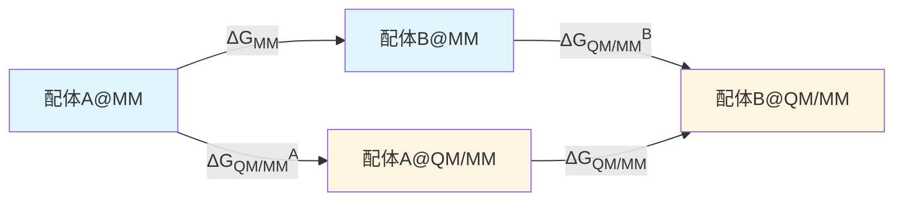
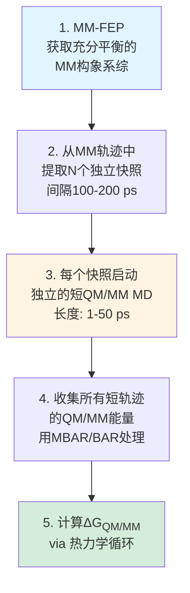
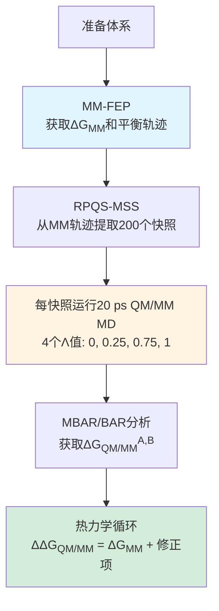

## 方法学核心：参考势方法 (Reference-Potential Approach)

### 为什么需要QM/MM-FEP?

传统的MM-FEP在许多蛋白-配体体系中表现良好,但对某些化学环境(如金属配位、质子化状态变化、电荷转移)的描述存在系统性误差。**直接用QM/MM进行自由能模拟在理论上可行,但实践中面临两大挑战**:

1. **计算成本极高**: QM计算比MM慢3-5个数量级,即使使用半经验方法(如PM6)也难以完成FEP所需的长时间采样
2. **相空间重叠问题**: QM和MM势能面差异较大,直接做λ积分需要大量中间态(~18个λ点)

### 参考势方法的热力学循环

Ryde课题组采用的**参考势方法(reference-potential approach)**巧妙地绕过了上述问题:

**热力学循环关系**:

$$
\Delta\Delta G_{\mathrm{QM/MM}} = \Delta G_{\mathrm{MM}} + \Delta G_{\mathrm{QM/MM}}^B - \Delta G_{\mathrm{QM/MM}}^A
$$

其中:
- $\Delta G_{\mathrm{MM}}$: 标准MM-FEP计算(便宜,已有成熟工具)
- $\Delta G_{\mathrm{QM/MM}}^A$ 和 $\Delta G_{\mathrm{QM/MM}}^B$: MM→QM/MM的垂直能量修正项(RPQS)

### RPQS: 参考势采样方法

**RPQS (Reference Potential with QM/MM Sampling)** 的核心思想是:

$$
\Delta G_{\mathrm{QM/MM}}^A = -k_B T \ln \left\langle \exp\left(-\frac{E_{\mathrm{QM/MM}} - E_{\mathrm{MM}}}{k_B T}\right) \right\rangle_{\mathrm{MM}}
$$

这个公式表明:**只需要在MM轨迹上计算QM/MM单点能,就能得到MM→QM/MM的自由能修正**。但直接应用这个指数平均公式(EXP)会有严重的收敛问题。

**解决方案**: 引入中间态Λ,使用BAR/MBAR等更稳健的估计器:

$$
E_\Lambda = \Lambda E_{\mathrm{QM/MM}} + (1-\Lambda) E_{\mathrm{MM}}
$$

2017年的研究表明:**使用4个Λ值(0, 0.25, 0.75, 1)能给出收敛的结果**,而仅用2个Λ值会导致系统性误差。

---

## 研究脉络一：方法建立与对比 (2017)

### 测试体系：八酸-配体

所有四篇论文都使用了**八酸(octa-acid, OA)主客体体系**作为测试平台。这是SAMPL(Statistical Assessment of the Modeling of Proteins and Ligands)盲测挑战赛中的经典体系:

**图1: 八酸主体结构与配体示例**

- **主体**: 八酸(OA),一个具有深疏水空腔的笼状分子,带8个羧酸基团
- **客体**: 9种环状羧酸配体(苯甲酸衍生物、环己烷羧酸等)
- **实验结合自由能范围**: -16 到 -37 kJ/mol

### 两种QM/MM-FEP方法对比

Olsson和Ryde (2017)对比了两种策略:

1. **直接QM/MM-FEP**: 在QM/MM哈密顿量下直接做配体A→B的λ积分
   - **优点**: 理论上最直接
   - **缺点**: 需要~18个λ窗口,计算成本极高

2. **参考势方法**: 使用上述热力学循环
   - **优点**: 只需4个Λ值,总计算量约为直接法的1/3
   - **缺点**: 需要额外的MM-FEP计算(但这很便宜)

### QM/MM分区与方法选择

- **QM区**: 配体(~15个原子)
- **QM方法**: PM6-DH+ (半经验方法,包含色散校正和氢键校正)
- **MM区**: 八酸主体(GAFF力场) + 溶剂(TIP3P水模型)
- **边界处理**: 机械嵌入(mechanical embedding)

### 主要结果

**表1: 两种方法的精度与效率对比**

| 方法 | MAD (kJ/mol) | R² | 相对计算成本 | Λ/λ值数量 |
|------|--------------|-----|--------------|-----------|
| 直接QM/MM-FEP | 3.1 | 0.93 | 1.0 | 18 |
| 参考势(2 Λ) | 5.2 | 0.77 | 0.11 | 2 |
| 参考势(4 Λ) | 3.1 | 0.93 | **0.33** | 4 |

**核心结论**:
- **参考势方法使用4个Λ值时,精度与直接法相当,但计算成本降至约1/3**
- 仅用2个Λ值会导致精度显著下降(MAD从3.1升至5.2 kJ/mol)
- 相对结合自由能的相关系数达到0.93,表明方法可靠

---

## 研究脉络二：SAMPL6盲测验证 (2018)

### 扩展到更大数据集

Caldararu等人(2018)将方法应用于SAMPL6挑战赛,测试了:

- **OAH**: 八酸原型(8个羧酸客体)
- **OAM**: 甲基化八酸(疏水性增强的变体,8个羧酸客体)

这是**首次在盲测环境下验证QM/MM-FEP方法**。

### 三种方法的系统性对比

**图2: SAMPL6中三种方法的结果对比**

1. **MM-FEP**: GAFF力场
   - OAH: MAD = 6.9 kJ/mol, R² = 0.46
   - OAM: MAD = 4.5 kJ/mol, R² = 0.66

2. **QM/MM-FEP (PM6-DH+)**: 参考势方法,4 Λ值
   - OAH: MAD = 2.4 kJ/mol, R² = 0.93
   - OAM: MAD = 5.2 kJ/mol, R² = 0.77
   - **比MM-FEP显著改善,尤其在OAH体系**

3. **SQM方法**: PM6-DH+优化的结构,直接计算ΔG
   - 使用COSMO-RS溶剂化模型
   - MAD = 3-8 kJ/mol
   - 计算成本极低,但精度不稳定

4. **DFT方法**: TPSS-D3/def2-TZVP
   - MAD = 7.0-7.8 kJ/mol
   - **令人意外地不如半经验方法准确**,可能因:
     - 构象采样不足(仅用优化结构)
     - 溶剂化模型(COSMO-RS)的系统性误差

### 关键发现

> **这是首次QM/MM方法在八酸体系上的表现与MM-FEP相当甚至更优**。对于OAH体系,QM/MM-FEP的MAD仅2.4 kJ/mol,相关系数高达0.93,显著优于MM-FEP的6.9 kJ/mol和0.46。

这表明:**对于电荷分布复杂、芳香性相互作用主导的体系,QM方法能捕捉到MM力场遗漏的物理细节**。

---

## 研究脉络三：多轨迹短时模拟优化 (RPQS-MSS, 2018)

### 计算瓶颈分析

虽然参考势方法已经比直接QM/MM-FEP快3倍,但对于药物设计等需要筛选大量配体的场景,**QM/MM单点能计算仍然是主要瓶颈**:

- 每个配体需要在4个Λ值下各运行数百ps的QM/MM MD
- 总QM/MM模拟时间: ~1-2 ns/配体

### RPQS-MSS的核心思想

Steinmann等人(2018)提出:**与其运行少数几条长的QM/MM轨迹,不如从MM轨迹中提取大量快照,分别运行极短的QM/MM MD**。

**方法学流程**:

### 收敛性测试

**关键问题**: 每条QM/MM轨迹需要多长才能收敛?

**图3: 不同配体的收敛时间**

通过分析ΔG随QM/MM MD长度的变化,发现:

- **大多数配体**: 1-15 ps即达到收敛(误差<1 kJ/mol)
- **芳香配体(如苯甲酸)**: 需要5 ps平衡期,因为π-π相互作用弛豫较慢
- **问题配体(mClBz)**: 需要~50 ps,可能因构象转换慢

**最佳实践**: 使用20 ps QM/MM MD(包括5 ps平衡),从200个MM快照启动

### 效率提升

**表2: RPQS vs RPQS-MSS的计算成本对比**

| 方法 | 每配体QM/MM MD总时长 | 相对成本 | 精度(vs RPQS) |
|------|----------------------|----------|---------------|
| RPQS (标准) | ~1 ns | 1.0 | 基准 |
| RPQS-MSS | ~0.25 ns (200×20 ps) | **0.25** | 等价 |

**核心优势**:
- **约4倍加速**,且精度保持不变(MAD差异<0.5 kJ/mol)
- 高度并行化友好(200个独立任务)
- 无需担心QM/MM MD的平衡问题(从已平衡的MM构象开始)

---

## 研究脉络四：非平衡方法探索 (RPQS-NE, 2018)

### Jarzynski等式与非平衡FEP

Wang等人(2018)探索了**非平衡(NE)方法**:使用Jarzynski等式从快速非平衡过程中提取平衡自由能。

**Jarzynski等式**:

$$
\Delta G = -k_B T \ln \left\langle \exp\left(-\frac{W}{k_B T}\right) \right\rangle
$$

其中$W$是非平衡过程的功。

### RPQS-NE流程

1. 从MM轨迹提取快照
2. 对每个快照,快速切换Λ: 0→1 (20-100 ps)
3. 记录累积功$W$
4. 用Jarzynski等式计算$\Delta G_{\mathrm{QM/MM}}$

**理论优势**: 非平衡方法理论上可以"更快"地探索相空间。

### 令人意外的结果

**表3: RPQS-MSS vs RPQS-NE的效率对比**

| 配体 | RPQS-MSS所需模拟数 | RPQS-NE所需模拟数 | 相对效率 |
|------|-------------------|-------------------|----------|
| bz | 18 | 36 | 0.5× |
| mClBz | 90 | 324 | 0.28× |

**核心发现**:
- RPQS-NE **不比RPQS-MSS更高效**,反而慢约1.5倍
- 非平衡方法需要更多独立模拟来克服指数平均的偏差
- 精度相当(与RPQS的MAD仅0.4 kJ/mol)

**结论**: **对于QM/MM-FEP,多条短的平衡轨迹(RPQS-MSS)优于非平衡切换(RPQS-NE)**。这可能因为:
- MM已提供充分的相空间采样
- MM→QM/MM的能量差相对较小,平衡方法已足够高效

---

## 方法总结与最佳实践

### 推荐工作流程

基于四篇论文的结果,**最优的QM/MM-FEP计算流程**如下:

### 关键参数选择

| 参数 | 推荐值 | 备注 |
|------|--------|------|
| Λ值数量 | 4 | 0, 0.25, 0.75, 1 |
| MM快照数 | 200 | 间隔100-200 ps |
| 每快照QM/MM MD长度 | 20 ps | 包括5 ps平衡 |
| QM方法 | PM6-DH+ | 半经验,性价比最优 |
| QM区 | 配体 | ~15-30个原子 |
| MM力场 | GAFF/OPLS | 根据体系选择 |

### 精度与成本

**预期精度**:
- MAD: 2-5 kJ/mol (相对实验值)
- R²: 0.8-0.9 (相对排序)

**计算成本**(相对传统MM-FEP):
- 时间: ~5-10倍
- 适用场景: 精度要求高,配体数量中等(10-100个)的先导优化阶段

---

## 方法的适用性与局限

### 适用场景

✅ **推荐使用QM/MM-FEP的情况**:
- 金属蛋白(如锌指蛋白、血红素蛋白)
- 共价抑制剂
- 质子化状态敏感的体系
- 电荷转移复合物
- MM力场系统性失败的案例(如SAMPL6的OAH)

### 局限性

⚠️ **需要注意的问题**:
- **QM方法选择至关重要**: DFT(TPSS-D3)在这些研究中表现不如PM6-DH+,可能因构象采样不足
- **QM区大小**: 目前仅测试了小配体(~15原子),扩展到大配体(>30原子)会显著增加成本
- **长程静电**: 机械嵌入忽略了QM-MM的极化效应,电子嵌入会更准确但更昂贵
- **仍需充分的MM采样**: RPQS依赖MM轨迹的质量,若MM力场非常差,方法可能失效

### 未来方向

📌 **潜在改进**:
- 自适应选择QM区大小(如包含关键蛋白残基)
- 机器学习加速QM/MM能量计算(如神经网络势)
- 扩展到绝对结合自由能(目前仅相对值)
- 与增强采样方法结合(如metadynamics)

---

## 结论

Ryde课题组的系列工作展示了**如何通过巧妙的方法学设计,将QM精度引入自由能计算而不付出过高代价**:

1. **参考势方法**将QM/MM-FEP的成本降至直接法的1/3
2. **SAMPL6盲测**验证了方法在复杂主客体体系中优于标准MM-FEP
3. **RPQS-MSS**通过多轨迹短时模拟再次实现4倍加速,总加速比达~12倍
4. **非平衡方法(RPQS-NE)**虽然理论上有吸引力,但实践中效率不及平衡方法

**最终结论**: 使用**参考势方法+多条短QM/MM MD(RPQS-MSS)**,可在相对可承受的计算成本下,实现对配体结合自由能的高精度QM修正,为计算辅助药物设计提供了新工具。

---

## 延伸阅读

- SAMPL挑战赛: https://samplchallenges.github.io/
- PM6-DH+方法: Korth, M. (2010). *J. Chem. Theory Comput.*, 6(12), 3808-3816
- MBAR方法: Shirts, M. R., & Chodera, J. D. (2008). *J. Chem. Phys.*, 129(12), 124105
- Jarzynski等式: Jarzynski, C. (1997). *Phys. Rev. Lett.*, 78(14), 2690
