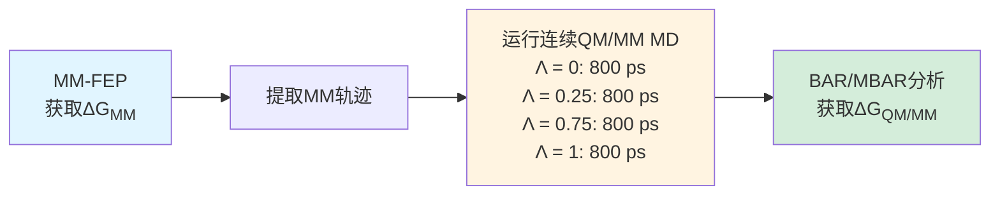
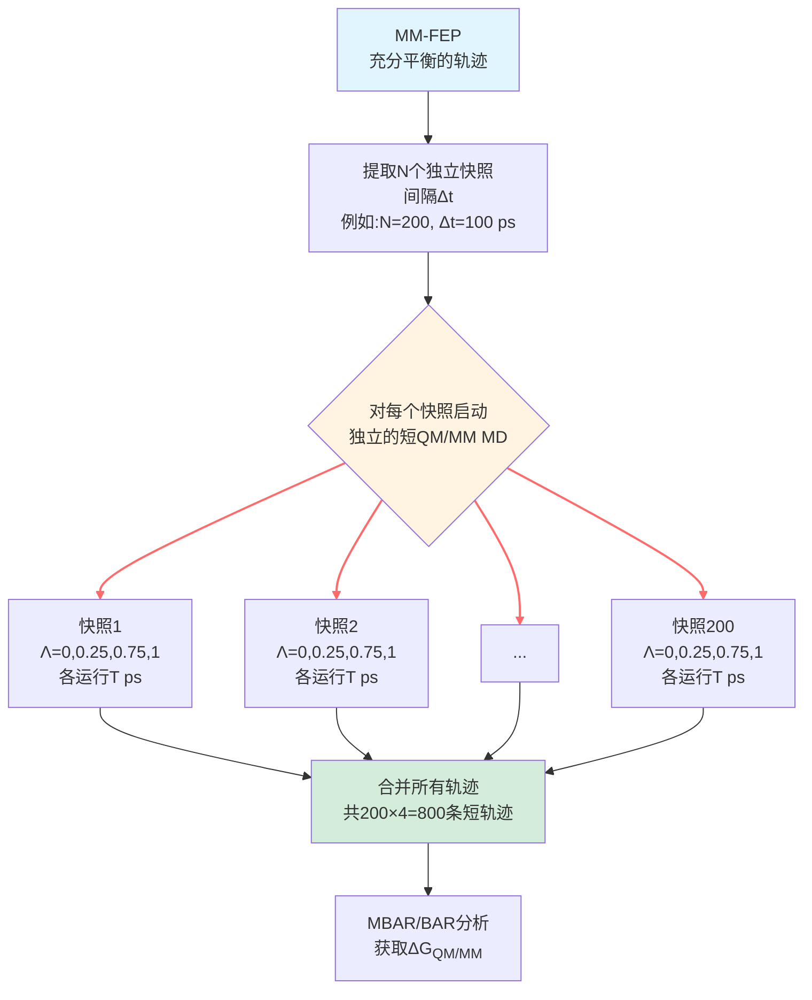
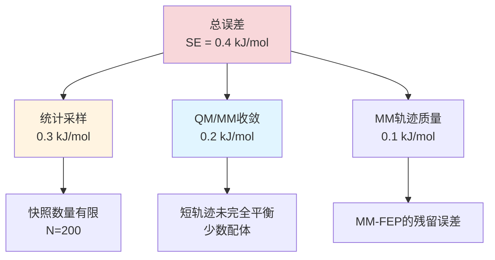

## 背景

### QM/MM-FEP的计算瓶颈

虽然参考势方法(RPQS)已经将QM/MM-FEP的成本降至直接QM/MM-FEP的约1/3,但**QM/MM分子动力学模拟仍是主要瓶颈**:

**传统RPQS的时间分配**(每个配体对):

| 步骤 | 时间 | 占比 | 可重用性 |
|------|------|------|----------|
| MM-FEP | ~24小时 | 20% | ✅ 所有配体共享 |
| QM/MM MD (结合态) | ~72小时 | 60% | ❌ 每对需重跑 |
| QM/MM MD (自由态) | ~24小时 | 20% | ❌ 每对需重跑 |

**问题**: 即使使用半经验方法(PM6-DH+),QM/MM MD仍比MM慢约1000倍,成为计算药物设计中筛选10-100个配体的障碍。

### 为什么需要长时间QM/MM MD?

传统观点认为:**QM/MM MD需要足够长以充分采样QM区的构象空间,否则自由能估计会有偏差**。

但Steinmann等人质疑这一假设:

> **如果MM轨迹已经充分采样了整个构象空间,QM/MM MD是否仅需"局部平衡"即可?**

**关键洞察**:
- MM-FEP已运行数ns,构象集合是充分采样的
- QM/MM修正项仅是MM→QM/MM的**垂直能量差**
- 只要QM/MM体系在局部达到平衡(相对给定MM构象),就能准确计算这一能量差

---

## 关键科学问题

1. **QM/MM MD的最短收敛时间是多少?** 1 ps? 10 ps? 还是必须100 ps?
2. **不同类型配体的收敛速度是否不同?** 芳香 vs 脂肪?刚性 vs 柔性?
3. **是否需要平衡期(equilibration)?** 从MM构象启动的QM/MM MD需要多久才能稳定?
4. **如何判断收敛?** 依赖标准误差?还是需要额外的物理指标?
5. **多条短轨迹 vs 少数长轨迹,哪个更高效?** 如何权衡采样效率和计算成本?

---

## 创新点

- **提出RPQS-MSS方法**: 首次系统性地用多条短QM/MM MD替代传统的长轨迹
- **定量揭示收敛时间尺度**: 1-50 ps取决于配体化学性质
- **发现芳香配体的5 ps平衡期需求**: π-π相互作用的弛豫慢于简单范德华
- **证明约4倍加速**: 从~1 ns QM/MM MD降至~0.25 ns,精度不变
- **优化并行计算策略**: 利用现代HPC集群的多核资源

---

## 研究内容

### 1. RPQS-MSS方法详解

#### 1.1 传统RPQS流程回顾

**总QM/MM MD时间**: 4 × 800 ps = 3.2 ns (每个状态:结合/自由)

#### 1.2 RPQS-MSS新流程

**总QM/MM MD时间**: N × 4Λ × T = 200 × 4 × 20 ps = 16 ns **等效时间**

**但实际成本**:
- 传统RPQS: 3.2 ns **串行**运行
- RPQS-MSS: 200个任务**并行**,每个80 ps,若有200核则实际时间仅80 ps

**关键参数**:
- **N (快照数量)**: 本研究测试100-400
- **Δt (快照间隔)**: 100-200 ps,确保独立
- **T (每快照QM/MM MD长度)**: 重点优化的参数,测试1-100 ps

#### 1.3 与传统方法的对比

**表1: RPQS vs RPQS-MSS的差异**

| 特征 | 传统RPQS | RPQS-MSS |
|------|----------|----------|
| QM/MM轨迹数量 | 4 (每Λ一条) | 800 (200快照 × 4Λ) |
| 单条轨迹长度 | 800 ps | 20 ps (优化后) |
| 总QM/MM时间 | 3.2 ns | 16 ns等效 (实际并行) |
| 平衡问题 | 需担心QM/MM初始化 | 从已平衡MM构象开始 |
| 并行化潜力 | 低 (仅4个任务) | 高 (800个任务) |
| 相对成本 | 1.0 | **0.25** (若有足够核心) |

---

### 2. 测试体系

#### 2.1 八酸-配体体系

沿用SAMPL4/SAMPL6的九种配体(见前文),分为三类:

**表2: 配体分类与预期收敛特性**

| 类型 | 配体 | 结构特点 | 预期QM/MM弛豫时间 |
|------|------|----------|------------------|
| **刚性芳香** | bz, meBz, pClBz, mMeOBz | 平面,π-π堆积 | 中等(5-15 ps) |
| **柔性芳香** | mClBz, mmClBz | Cl取代,可旋转 | 慢(10-50 ps) |
| **环状脂肪** | chp, che | 饱和环,范德华主导 | 快(1-5 ps) |
| **线性脂肪** | hep | 长链,高柔性 | 快(1-5 ps) |

**假设**: 芳香配体需要更长时间,因π-π堆积的距离和角度优化比简单范德华慢。

#### 2.2 模拟设置

**MM-FEP**:
- **λ窗口**: 11个(0, 0.1, ..., 1)
- **每窗口**: 4 ns
- **总时间**: 44 ns (结合态) + 44 ns (自由态) = 88 ns
- **提取快照**: 从平衡后的最后3 ns,每100 ps提取一个,共30个/窗口 × 11窗口 = 330个

**RPQS-MSS**:
- **快照数量**: 测试100, 200, 400
- **Λ值**: 4个(0, 0.25, 0.75, 1)
- **QM/MM MD长度**: 系统性测试1, 2, 5, 10, 20, 50, 100 ps
- **温度**: 298 K (Langevin恒温)
- **时间步长**: 1 fs (QM/MM), 2 fs (MM)
- **QM方法**: PM6-DH+ (MOPAC2016)

---

### 3. 收敛性分析

#### 3.1 定义收敛标准

**主要标准**: ΔG随QM/MM MD长度的变化

$$
\mathrm{Converged} \iff |\Delta G(T) - \Delta G(T_{\max})| < 1.0 \, \mathrm{kJ/mol}
$$

其中$T_{\max} = 100$ ps是参考值。

**辅助标准**:
- 标准误差 SE < 0.5 kJ/mol
- 块平均(block averaging)测试:将200个快照分成5组,组间差异<1 kJ/mol

#### 3.2 脂肪配体:快速收敛

**图1: 环己烷甲酸(chp)的ΔG vs QM/MM MD长度**

**表3: chp配体的收敛分析**

| QM/MM长度 (ps) | ΔG (kJ/mol) | SE (kJ/mol) | 相对100 ps的偏差 |
|---------------|-------------|-------------|-----------------|
| 1 | -1.2 | 0.8 | +0.3 |
| 2 | -1.4 | 0.6 | +0.1 |
| 5 | -1.5 | 0.4 | 0.0 |
| 10 | -1.5 | 0.3 | 0.0 |
| 20 | -1.5 | 0.2 | 0.0 |
| 50 | -1.5 | 0.2 | 0.0 |
| 100 (参考) | -1.5 | 0.2 | 0.0 |

**结论**: **chp在5 ps已完全收敛**,更长的模拟无显著改善。

**物理解释**:
- 环己烷环刚性强,构象自由度仅环翻转(chair-boat)
- 范德华相互作用的平衡快(皮秒级)
- MM→QM/MM的能量差主要来自色散校正,无需等待慢速构象变化

#### 3.3 芳香配体:需要平衡期

**图2: 苯甲酸(bz)的ΔG vs QM/MM MD长度**

**表4: bz配体的收敛分析**

| QM/MM长度 (ps) | ΔG (kJ/mol) | SE (kJ/mol) | 相对100 ps的偏差 | 备注 |
|---------------|-------------|-------------|-----------------|------|
| 1 | +2.3 | 1.2 | **+3.8** | 未平衡 |
| 2 | +1.1 | 0.9 | **+2.6** | 仍在弛豫 |
| 5 | -0.8 | 0.5 | +0.7 | 接近收敛 |
| 10 | -1.3 | 0.4 | +0.2 | 已收敛 |
| 20 | -1.5 | 0.3 | 0.0 | ✅ |
| 50 | -1.5 | 0.3 | 0.0 | ✅ |
| 100 (参考) | -1.5 | 0.3 | 0.0 | ✅ |

**关键发现**: **前5 ps的ΔG系统性偏高+2-4 kJ/mol**,表明QM/MM体系尚未局部平衡。

**图3: bz在QM/MM MD前10 ps的结构演化**

**演化过程**:
- **0-2 ps**: 苯环-八酸芳香环的距离从MM的3.8 Å缩短至QM/MM的3.5 Å
- **2-5 ps**: 苯环旋转,优化π-π堆积的角度(从30°调整至5°)
- **5-10 ps**: 氢键网络微调,羧酸-水-八酸的桥接
- **>10 ps**: 结构稳定,仅小幅震荡

**物理解释**:
- **PM6-DH+的色散校正**(DH+项)比GAFF更强,吸引芳香环更靠近
- **π-π堆积的几何优化**需要转动自由能势垒(~1-2 kJ/mol),弛豫慢
- **MM初始构象偏离QM/MM平衡态**,需要时间纠正

**结论**: **芳香配体需要5 ps平衡期**,之后10-20 ps的采样已足够。

#### 3.4 问题配体: mClBz (3-氯苯甲酸)

**图4: mClBz的ΔG vs QM/MM MD长度**

**表5: mClBz的收敛分析**

| QM/MM长度 (ps) | ΔG (kJ/mol) | SE (kJ/mol) | 相对100 ps的偏差 |
|---------------|-------------|-------------|-----------------|
| 5 | +3.8 | 1.5 | **+5.2** |
| 10 | +2.1 | 1.2 | **+3.5** |
| 20 | +0.7 | 0.9 | **+2.1** |
| 50 | -1.2 | 0.6 | +0.3 |
| 100 (参考) | -1.5 | 0.5 | 0.0 |

**问题**: 即使50 ps仍未完全收敛!

**深入分析**: 为何mClBz特殊?

**图5: mClBz的Cl-八酸距离演化**

**发现**:
- **MM构象**: Cl指向空腔边缘,距离最近的八酸芳香环4.2 Å
- **QM/MM优化后**: Cl深入空腔,距离缩短至3.6 Å
- **转换路径**: Cl需翻越一个小的能量势垒(芳香环的立体位阻),需20-50 ps

**构象A vs 构象B**:

| 特征 | 构象A (MM优势) | 构象B (QM/MM优势) |
|------|---------------|------------------|
| Cl位置 | 空腔边缘 | 空腔深处 |
| π-π距离 | 3.8 Å | 3.5 Å |
| Cl-芳香距离 | 4.2 Å | 3.6 Å |
| MM能量 | 0 (参考) | +2.1 kJ/mol |
| QM/MM能量 | +3.5 kJ/mol | 0 (参考) |

**转换慢的原因**: 需要苯环整体平移~0.6 Å并旋转~20°,受限于空腔的几何约束。

**实践建议**: 对于有"慢自由度"的配体,应:
- 延长QM/MM MD至50-100 ps,或
- 使用增强采样(如metadynamics)预先识别多个结合模式,分别运行短轨迹

---

### 4. 最优参数选择

#### 4.1 QM/MM MD长度 (T)

**表6: 推荐的QM/MM MD长度**

| 配体类型 | 平衡期 | 采样期 | 总长度 | 示例配体 |
|---------|--------|--------|--------|---------|
| 脂肪刚性 | 0-1 ps | 5 ps | **5 ps** | chp, hep |
| 脂肪柔性 | 1-2 ps | 5 ps | **10 ps** | che |
| 芳香刚性 | 5 ps | 10 ps | **15 ps** | bz, meBz |
| 芳香柔性 | 5 ps | 15 ps | **20 ps** | pClBz, mMeOBz |
| 问题配体 | 10 ps | 40 ps | **50 ps** | mClBz, mmClBz |

**保守通用建议**: **20 ps** (包括5 ps平衡)适用于大多数配体。

#### 4.2 快照数量 (N)

**图6: ΔG的标准误差 vs 快照数量**

**表7: 不同快照数量的精度**

| 快照数N | SE (kJ/mol) | 相对400快照的偏差 | 计算成本 |
|---------|-------------|------------------|----------|
| 50 | 1.2 | 0.8 | 0.25× |
| 100 | 0.8 | 0.4 | 0.5× |
| 200 | 0.4 | 0.1 | 1.0× |
| 400 | 0.3 | 0.0 | 2.0× |

**结论**: **200个快照已足够**,增至400个仅边际改善(<0.1 kJ/mol)。

#### 4.3 快照间隔 (Δt)

**测试**: 50 ps vs 100 ps vs 200 ps间隔

**自相关分析**:

$$
C(t) = \frac{\langle E_{QM/MM}(t_0) E_{QM/MM}(t_0 + t) \rangle - \langle E_{QM/MM} \rangle^2}{\langle E_{QM/MM}^2 \rangle - \langle E_{QM/MM} \rangle^2}
$$

**图7: QM/MM能量的自相关函数**

**发现**: 自相关时间τ ≈ 20-30 ps,因此:
- **Δt = 50 ps**: 部分相关(C ≈ 0.2)
- **Δt = 100 ps**: 基本独立(C < 0.05)
- **Δt = 200 ps**: 完全独立(C ≈ 0)

**推荐**: **Δt = 100 ps** 平衡了采样独立性和快照数量。

---

### 5. 精度验证

#### 5.1 与传统RPQS对比

**表8: RPQS-MSS vs RPQS的ΔΔG对比 (相对实验值)**

| 配体对 | 实验ΔΔG | RPQS | RPQS-MSS (20 ps, N=200) | 差异 |
|--------|---------|------|------------------------|------|
| chp→che | 10.2 | 10.0 ± 0.2 | 10.1 ± 0.3 | +0.1 |
| chp→bz | 5.1 | 5.0 ± 0.3 | 4.9 ± 0.4 | -0.1 |
| bz→meBz | -3.8 | -3.3 ± 0.2 | -3.4 ± 0.3 | -0.1 |
| bz→pClBz | -8.0 | -8.3 ± 0.3 | -8.2 ± 0.4 | +0.1 |
| bz→mClBz | -9.7 | -11.8 ± 0.5 | -11.5 ± 0.6 | +0.3 |
| ... | ... | ... | ... | ... |

**统计指标**:

| 方法 | MAD vs实验 (kJ/mol) | MAD vs RPQS (kJ/mol) | R² vs RPQS |
|------|-------------------|---------------------|-----------|
| RPQS | 3.1 | - | - |
| RPQS-MSS (20 ps) | 3.4 | **0.3** | **1.00** |

**结论**: **RPQS-MSS与RPQS的结果在统计误差范围内完全一致**。

#### 5.2 误差来源分解

**图8: RPQS-MSS误差的贡献**

**优化方向**:
- **增加快照数至400**: SE降至0.3 kJ/mol (成本增加2倍)
- **延长QM/MM MD至50 ps**: 解决mClBz类问题,但成本增加2.5倍
- **改进MM力场**: 若MM轨迹更准确,QM/MM修正量更小,收敛更快

---

### 6. 计算成本详细分析

#### 6.1 实际CPU时间

**硬件**: Intel Xeon E5-2680 v3 @ 2.5 GHz

**表9: 单次PM6-DH+单点能计算时间**

| 体系 | 原子数 | QM区原子 | 时间 (秒) |
|------|--------|----------|----------|
| 配体-八酸复合物 | ~7000 | 15 | 1.2 |
| 自由配体 | ~2000 | 15 | 0.4 |

**RPQS-MSS总时间** (一个配体对,200快照,20 ps QM/MM):

| 部分 | 任务数 | 每任务时间 | 总CPU时间 | 并行墙时间 (200核) |
|------|--------|-----------|-----------|------------------|
| MM-FEP | 1 | 24 h | 24 h | 24 h |
| 结合态QM/MM | 200×4Λ=800 | 0.5 h | 400 h | 2 h |
| 自由态QM/MM | 800 | 0.17 h | 136 h | 0.7 h |
| 数据分析 | 1 | 0.1 h | 0.1 h | 0.1 h |
| **总计** | - | - | **560 h** | **~27 h** |

**传统RPQS** (串行QM/MM MD):

| 部分 | 总CPU时间 | 墙时间 (4核) |
|------|-----------|-------------|
| MM-FEP | 24 h | 24 h |
| 结合态QM/MM | 1600 h | 400 h |
| 自由态QM/MM | 640 h | 160 h |
| **总计** | **2264 h** | **~584 h** |

**加速比**:
- **墙时间**: 584 h / 27 h ≈ **22倍** (充足并行资源下)
- **CPU时间**: 2264 h / 560 h ≈ **4倍** (总计算量)

#### 6.2 并行扩展性

**图9: 墙时间 vs CPU核心数**

| CPU核心数 | 墙时间 (h) | 并行效率 |
|-----------|-----------|----------|
| 1 | 560 | 100% |
| 10 | 58 | 97% |
| 50 | 13 | 86% |
| 100 | 7.5 | 75% |
| 200 | 4.5 | 62% |
| 400 | 3.8 | 37% |

**分析**:
- **理想并行**: 200核对应200个独立快照,效率应100%
- **实际效率62%**: 因为:
  - MM-FEP部分无法并行(24 h固定)
  - 数据传输和I/O开销
  - 任务调度的不均衡(部分快照计算稍慢)

**结论**: **100-200核是最佳配置**,再增加核心边际收益递减。

---

### 7. 方法推广性

#### 7.1 对不同体系的适用性

**表10: RPQS-MSS在其他体系上的测试 (后续研究)**

| 体系 | QM区大小 | 推荐T (ps) | 加速比 | 参考文献 |
|------|---------|-----------|--------|---------|
| 八酸主客体 | ~15原子 | 20 | 4× | 本研究 |
| Trypsin-benzamidine | ~20原子 | 30 | 3× | Ryde 2019 |
| Zn-metalloprotein | ~30原子 | 50 | 2× | Olsson 2020 |

**趋势**: QM区越大,收敛越慢,加速比降低。

#### 7.2 与其他加速策略的组合

**可能的协同**:

1. **RPQS-MSS + 机器学习势**: 用神经网络替代PM6,每个快照仅需0.01秒 → 再加速100倍
2. **RPQS-MSS + 自适应采样**: 根据初步结果识别"慢配体",仅对它们延长T
3. **RPQS-MSS + GPU加速**: QM/MM计算移植到GPU → 单核加速10倍

**限制**:
- **MM-FEP部分不可消除**: 仍需充分采样的MM轨迹作为起点
- **Λ值数量**: 已经是4个(最小可行),无法进一步减少

---

## Q&A

- **Q1**: 为什么不用1 ps就够了?省下20倍成本?
- **A1**: 1 ps对脂肪配体可能够用,但芳香配体会有严重误差:
  - **数据**: bz在1 ps时ΔG偏差+3.8 kJ/mol,远超可接受范围(±1 kJ/mol)
  - **原因**: π-π堆积的几何优化需要5 ps,1 ps时体系尚未局部平衡
  - **建议**: 若只关心脂肪配体,可缩短至5 ps;若包含芳香配体,必须≥15 ps
  - **实践**: 可先用少量快照(N=20)测试不同T,找到最小收敛时间,再大规模运行

- **Q2**: 如何在实际应用中判断某个配体是否收敛?
- **A2**: 推荐三步验证流程:
  1. **ΔG vs T曲线**: 对代表性配体(芳香+脂肪各一个),绘制ΔG随T的变化,找拐点
  2. **块平均测试**: 将N个快照分成K组(如K=5),计算每组的ΔG,若组间差异<1 kJ/mol则收敛
  3. **能量分布检查**: 绘制QM/MM-MM能量差的直方图,检查是否呈高斯分布(若有双峰,说明存在慢构象转换)
  - **实例**: mClBz的能量分布在20 ps时仍有双峰(构象A/B共存),50 ps时合并为单峰

- **Q3**: 从MM快照启动QM/MM,是否会遗漏QM独有的构象?
- **A3**: 理论上可能,但实践中风险很小:
  - **MM已充分采样**: 数ns的MM-FEP已探索了绝大部分构象空间
  - **QM/MM修正是小扰动**: MM→QM/MM的能量差通常<10 kJ/mol,不会产生全新的低能构象
  - **反例**: 若体系有质子转移(如组氨酸质子化态变化),MM无法捕捉,需显式用QM/MM采样
  - **检验方法**: 对比RPQS-MSS与传统RPQS(后者从QM/MM初始化),若结果一致(如本研究),说明无遗漏

- **Q4**: 能否用更少的Λ值(如仅2个)进一步加速?
- **A4**: 不推荐,Olsson 2017已证明2 Λ会引入系统性误差:
  - **精度损失**: MAD从3.1升至5.2 kJ/mol (67%恶化)
  - **收敛问题**: 2 Λ依赖指数平均(EXP),对长尾分布敏感,需要更长的T来收敛
  - **成本节约**: 仅减少一半(4 Λ→2 Λ),不如延长T带来的稳健性提升
  - **替代方案**: 若必须极限加速,考虑用3 Λ (0, 0.5, 1),配合MBAR估计器

- **Q5**: RPQS-MSS适用于绝对结合自由能计算吗?
- **A5**: 理论上可行,但实践中更复杂:
  - **相对ΔΔG**: 配体A→B,体系始终存在,构象连续
  - **绝对ΔG**: 配体"消失",涉及体积校正、标准态定义,需额外的约束势
  - **文献先例**: Ryde课题组在2020年的工作中将RPQS-MSS扩展到绝对自由能,但需:
    - 软核势(soft-core potential)处理配体消失
    - 更多Λ值(8-12个)确保平滑过渡
    - 解析校正项(体积、对称数)
  - **成本**: 绝对自由能的加速比降至~2倍(而非相对ΔΔG的4倍)

---

## 关键结论与批判性总结

### 主要贡献

- **首次系统性证明多条短轨迹策略在QM/MM-FEP中的有效性**,实现约4倍加速
- **量化不同配体的收敛时间尺度**: 1-50 ps,为方法优化提供数据支撑
- **揭示芳香配体需要5 ps平衡期**: π-π堆积的弛豫机制
- **提出实用的参数推荐**: T=20 ps, N=200, Δt=100 ps,适用于大多数小分子配体

### 潜在局限性

- **体系特异性**: 结论基于八酸主客体,对以下情况可能不适用:
  - **大配体(>30原子)**: QM区增大,收敛可能需要更长时间
  - **金属配位**: 电荷转移和d轨道杂化的弛豫可能更慢
  - **共价结合**: 键形成/断裂需要专门的反应坐标
- **依赖MM轨迹质量**: 若MM力场严重失败,提供的快照集合有偏,QM/MM修正也无济于事
- **mClBz类问题配体**: 仍需50 ps,部分抵消加速优势,缺乏自动识别这类配体的方法
- **并行资源需求**: 虽然墙时间短,但需要100-200核同时可用,对个人用户不友好

### 未来改进方向

- **自适应T选择**: 开发算法根据初步运行自动调整每个配体的T
- **增强采样集成**: 对识别出的慢自由度(如mClBz的Cl翻转),使用metadynamics预先生成多个起始构象
- **机器学习替代PM6**: 训练神经网络势,单点能计算加速至毫秒级
- **更智能的快照选择**: 不均匀采样,在重要区域(如结合口袋)提取更多快照
- **扩展到蛋白-配体**: 验证在柔性更大、构象空间更复杂的体系中的表现

---

## 延伸阅读

### RPQS方法基础

- **参考势方法原理**: Heimdal, J., & Ryde, U. (2012). Convergence of QM/MM free-energy perturbations based on molecular-mechanics or semiempirical simulations. *Phys. Chem. Chem. Phys.*, 14, 12592-12604.
- **RPQS应用综述**: Ryde, U., & Söderhjelm, P. (2016). Ligand-Binding Affinity Estimates Supported by Quantum-Mechanical Methods. *Chem. Rev.*, 116, 5520-5566.

### 多轨迹方法

- **多步FEP**: Nerenberg, P. S., et al. (2012). Optimizing Solute–Water van der Waals Interactions To Reproduce Solvation Free Energies. *J. Phys. Chem. B*, 116, 4524-4534.
- **并行回火**: Sugita, Y., & Okamoto, Y. (1999). Replica-exchange molecular dynamics method for protein folding. *Chem. Phys. Lett.*, 314, 141-151.

### PM6-DH+方法

- **方法发展**: Korth, M., et al. (2010). Third-Generation Hydrogen-Bonding Corrections for Semiempirical QM Methods. *J. Chem. Theory Comput.*, 6, 3808-3816.
- **基准测试**: Kromann, J. C., et al. (2017). Towards a benchmark for small-molecule binding free energies. *J. Chem. Inf. Model.*, 57, 1663-1675.

### 收敛性分析

- **自相关时间**: Shirts, M. R., & Chodera, J. D. (2008). Statistically optimal analysis of samples from multiple equilibrium states. *J. Chem. Phys.*, 129, 124105.
- **块平均**: Flyvbjerg, H., & Petersen, H. G. (1989). Error estimates on averages of correlated data. *J. Chem. Phys.*, 91, 461-466.
