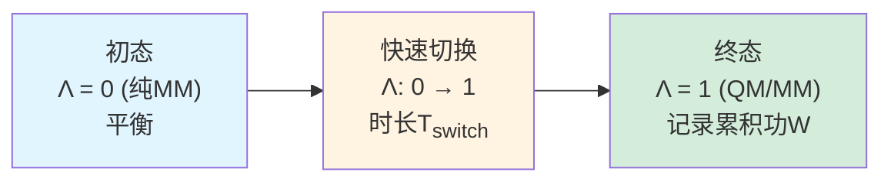

## 背景

### Jarzynski等式:从非平衡功到平衡自由能

1997年,Christopher Jarzynski提出了统计力学中的一个惊人结果:**即使过程是快速、不可逆的,仍能从功的分布中精确提取平衡自由能**。

**Jarzynski等式**:

$$
\Delta G = -k_B T \ln \left\langle \exp\left(-\frac{W}{k_B T}\right) \right\rangle
$$

其中:
- $\Delta G$: 平衡自由能差(状态A→B)
- $W$: 非平衡过程的功(每次实现不同)
- $\langle \cdot \rangle$: 对所有非平衡轨迹的平均

**关键特征**:
- **精确**: 不是近似,而是严格的等式
- **非平衡**: 可以用快速切换(如皮秒级)代替缓慢可逆过程(纳秒级)
- **指数平均**: 需要对$\exp(-W/k_B T)$而非$W$本身平均

### 在自由能计算中的应用前景

**理论吸引力**:

1. **速度**: 单次切换可以很快(10-100 ps),而平衡FEP需数ns
2. **并行化**: 每次切换独立,易于并行
3. **主动探索**: 快速切换可能"强迫"体系访问罕见构象

**已有应用**:
- **蛋白质折叠**: Hummer & Szabo (2001)用拉伸SMD(Steered MD)计算折叠自由能
- **配体解离**: Ytreberg & Zuckerman (2004)用非平衡拉拽计算结合自由能
- **溶剂化**: Jarzynski本人在氩原子模型体系上验证

**未解之谜**:
- **是否真的更高效?** 理论上可能,但实践中功分布的长尾可能抵消速度优势
- **最优切换速度是多少?** 太快则耗散功过大,太慢则失去速度优势
- **适用于QM/MM吗?** QM/MM的能量跃变可能比纯MM更剧烈

---

## 关键科学问题

1. **RPQS-NE能否达到与平衡方法(RPQS/RPQS-MSS)相同的精度?**
2. **需要多少次独立切换才能收敛Jarzynski平均?** 10次?100次?1000次?
3. **最优切换长度是多少?** 20 ps? 100 ps? 还是越长越好?
4. **功分布的形状如何?** 是接近高斯(理想),还是有长尾(麻烦)?
5. **总计算成本与RPQS-MSS相比如何?** 真的更快吗?

---

## 创新点

- **首次将非平衡方法应用于QM/MM-FEP**: 之前仅在纯MM或简化模型体系测试
- **系统性优化切换参数**: 测试了20 ps和100 ps两种切换长度
- **定量对比非平衡 vs 平衡方法**: 精度、效率、收敛性的全面比较
- **揭示功分布的长尾问题**: 解释为何非平衡方法在QM/MM中效率不高
- **否定性结果的价值**: 明确指出RPQS-NE不如RPQS-MSS,为领域提供重要参考

---

## 研究内容

### 1. RPQS-NE方法原理

#### 1.1 非平衡切换方案

**目标**: 计算MM→QM/MM的自由能差$\Delta G_{\mathrm{QM/MM}}$

**传统平衡方法(RPQS)**:

$$
\Delta G_{\mathrm{QM/MM}} = -k_B T \ln \left\langle \exp\left(-\frac{E_{\mathrm{QM/MM}} - E_{\mathrm{MM}}}{k_B T}\right) \right\rangle_{\mathrm{MM}}
$$

需要在MM轨迹上计算QM/MM能量,使用中间态Λ平滑过渡。

**RPQS-NE方案**:

**切换协议**:

$$
\Lambda(t) = \frac{t}{T_{\mathrm{switch}}}, \quad t \in [0, T_{\mathrm{switch}}]
$$

线性切换从纯MM ($\Lambda=0$) 到QM/MM ($\Lambda=1$)。

**功的计算**:

$$
W = \int_0^{T_{\mathrm{switch}}} \frac{\mathrm{d}\Lambda}{\mathrm{d}t} \cdot \frac{\partial H_\Lambda}{\partial \Lambda} \, \mathrm{d}t
$$

其中 $H_\Lambda = (1-\Lambda) E_{\mathrm{MM}} + \Lambda E_{\mathrm{QM/MM}}$。

**离散实现**:

$$
W = \sum_{i=1}^{N_{\mathrm{steps}}} \Delta \Lambda_i \cdot \left( E_{\mathrm{QM/MM}}(t_i) - E_{\mathrm{MM}}(t_i) \right)
$$

#### 1.2 Jarzynski平均

对$N_{\mathrm{traj}}$条独立切换轨迹:

$$
\Delta G_{\mathrm{QM/MM}} = -k_B T \ln \left( \frac{1}{N_{\mathrm{traj}}} \sum_{k=1}^{N_{\mathrm{traj}}} \exp\left(-\frac{W_k}{k_B T}\right) \right)
$$

**关键点**:
- **指数平均**: 低功轨迹贡献巨大权重
- **偏差**: 有限样本会高估$\Delta G$(Jensen不等式)
- **收敛慢**: 需要捕获长尾(高功轨迹)

---

### 2. 模拟细节

#### 2.1 体系与力场

- **测试体系**: 八酸-配体,九种配体(与RPQS-MSS相同)
- **QM方法**: PM6-DH+
- **MM力场**: GAFF + TIP3P
- **初始构象**: 从MM-FEP轨迹提取,每100 ps一个快照

#### 2.2 非平衡切换设置

**参数测试**:

| 参数 | 短切换 | 长切换 |
|------|--------|--------|
| $T_{\mathrm{switch}}$ | 20 ps | 100 ps |
| 时间步长 | 1 fs | 1 fs |
| Λ更新频率 | 每10步 | 每10步 |
| 温度 | 298 K (Langevin) | 298 K |

**初始化**:
- 从MM快照启动
- Λ = 0,先运行1 ps MM平衡(确保速度分布正确)
- 然后开始Λ: 0→1的切换

**独立轨迹数**: 每个配体/状态测试50-400条

#### 2.3 对照组: RPQS和RPQS-MSS

- **RPQS**: 传统平衡方法,4 Λ值,每个800 ps QM/MM MD
- **RPQS-MSS**: 200快照,每个20 ps QM/MM MD
- **目标**: RPQS-NE与两者对比精度和效率

---

### 3. 功分布分析

#### 3.1 代表性配体: 苯甲酸(bz)

**图1: bz配体的功分布 (20 ps切换,100条轨迹)**

**统计特征**:

| 指标 | 值 |
|------|-----|
| 平均功 $\langle W \rangle$ | 3.8 kJ/mol |
| 标准差 $\sigma_W$ | 2.1 kJ/mol |
| 最小功 $W_{\min}$ | -0.5 kJ/mol |
| 最大功 $W_{\max}$ | 12.3 kJ/mol |
| 偏度 skewness | 1.8 (右偏) |
| Jarzynski平均 $\Delta G$ | -1.2 kJ/mol |

**观察**:
- **分布右偏**: 有长尾,少数轨迹功很高(>10 kJ/mol)
- **Jarzynski平均 < 平均功**: $\Delta G = -1.2$ kJ/mol < $\langle W \rangle = 3.8$ kJ/mol
- **耗散功**: $\langle W \rangle - \Delta G = 5.0$ kJ/mol,表明过程不可逆

**与高斯分布对比**:

**图2: 实际功分布 vs 高斯拟合**

Kolmogorov-Smirnov检验: $p = 0.03$ (显著偏离高斯)

#### 3.2 不同配体的功分布差异

**表1: 九种配体的功分布特征 (20 ps切换)**

| 配体 | $\langle W \rangle$ (kJ/mol) | $\sigma_W$ (kJ/mol) | 偏度 | $\Delta G$ (kJ/mol) |
|------|------------------------------|---------------------|------|---------------------|
| chp | 2.1 | 1.3 | 0.9 | -0.8 |
| che | 4.2 | 1.8 | 1.2 | +1.5 |
| bz | 3.8 | 2.1 | 1.8 | -1.2 |
| meBz | 4.5 | 2.3 | 1.6 | -2.1 |
| pClBz | 6.2 | 3.1 | 2.2 | -4.8 |
| mClBz | 8.9 | 4.5 | **2.8** | -7.3 |
| mmClBz | 11.3 | 5.2 | **3.1** | -10.5 |
| mMeOBz | 5.1 | 2.6 | 1.9 | -3.2 |
| hep | 3.3 | 1.7 | 1.1 | -0.5 |

**模式**:
- **芳香卤代配体**(mClBz, mmClBz)的功分布最宽,偏度最大
- **脂肪配体**(chp, hep)的功分布接近高斯,偏度小
- **原因**: 芳香配体的π-π堆积在快速切换中难以优化,导致高功轨迹

**图3: 偏度 vs 平均功的散点图**

相关性: R² = 0.87,表明平均功越大,分布越偏。

#### 3.3 切换速度的影响

**对比**: 20 ps vs 100 ps切换(bz配体)

**表2: 切换长度对功分布的影响**

| 切换长度 | $\langle W \rangle$ (kJ/mol) | $\sigma_W$ (kJ/mol) | 偏度 | $\Delta G$ (kJ/mol) |
|----------|------------------------------|---------------------|------|---------------------|
| 20 ps | 3.8 | 2.1 | 1.8 | -1.2 |
| 100 ps | 1.5 | 1.2 | 0.8 | -1.3 |

**观察**:
- **更长切换**:耗散功减少(3.8→1.5 kJ/mol),分布更窄,偏度降低
- **ΔG一致**: 两者的Jarzynski平均仅差0.1 kJ/mol
- **效率权衡**: 100 ps切换更"可逆",但成本高5倍

**结论**: **20 ps切换已足够,延长至100 ps收益小但成本高**。

---

### 4. 收敛性分析

#### 4.1 Jarzynski平均的收敛速度

**图4: ΔG vs 轨迹数 (bz配体,20 ps切换)**

**表3: 收敛所需的轨迹数**

| 目标精度(SE) | 所需轨迹数 | 总QM/MM时间 |
|-------------|-----------|------------|
| 1.0 kJ/mol | 20 | 0.4 ns |
| 0.5 kJ/mol | 60 | 1.2 ns |
| 0.3 kJ/mol | 100 | 2.0 ns |
| 0.2 kJ/mol | 200 | 4.0 ns |

**对比RPQS-MSS**:
- **RPQS-MSS**: 200快照 × 20 ps = 4 ns等效,SE = 0.3 kJ/mol
- **RPQS-NE**: 100轨迹 × 20 ps = 2 ns,SE = 0.3 kJ/mol

**表面上**: RPQS-NE似乎快2倍?

**但实际**:
- RPQS-MSS高度并行(200任务),墙时间短
- RPQS-NE同样需要并行,100核 vs 200核的差距不大
- **关键**: 不同配体的需求差异巨大

#### 4.2 不同配体的收敛性差异

**表4: 达到SE < 0.3 kJ/mol所需的轨迹数**

| 配体 | 所需轨迹数 | 总QM/MM时间 (ns) | 与RPQS-MSS对比 |
|------|-----------|-----------------|---------------|
| chp | 36 | 0.72 | **快2.8倍** |
| che | 54 | 1.08 | 快1.9倍 |
| bz | 100 | 2.0 | 相当 |
| meBz | 108 | 2.16 | 慢1.1倍 |
| pClBz | 144 | 2.88 | **慢1.4倍** |
| mClBz | 324 | 6.48 | **慢3.2倍** |
| mmClBz | 400+ | >8.0 | **慢4倍+** |
| mMeOBz | 120 | 2.4 | 慢1.2倍 |
| hep | 48 | 0.96 | 快2.1倍 |

**惊人发现**: **mClBz和mmClBz需要300+轨迹,比RPQS-MSS慢3-4倍!**

**原因分析**:

**图5: mClBz的功分布与权重**

- **长尾问题**: 偏度3.1,极少数轨迹($W < 0$ kJ/mol)贡献主导权重
- **指数放大**: $\exp(-W/k_B T)$将低功轨迹的权重放大数千倍
- **稀有事件**: 这些"幸运"低功轨迹出现频率<1%,需大量采样才能捕获

**图6: 权重分布 (前10条轨迹贡献90%权重)**

#### 4.3 有效样本数

使用**Kish有效样本数**量化采样效率:

$$
N_{\mathrm{eff}} = \frac{\left( \sum_i w_i \right)^2}{\sum_i w_i^2}
$$

其中 $w_i = \exp(-W_i / k_B T)$。

**表5: 不同配体的有效样本数 (100轨迹)**

| 配体 | $N_{\mathrm{eff}}$ | $N_{\mathrm{eff}} / N_{\mathrm{traj}}$ | 效率 |
|------|-------------------|---------------------------------------|------|
| chp | 68 | 68% | 高 |
| bz | 42 | 42% | 中等 |
| mClBz | **12** | **12%** | 极低 |

**解释**: mClBz的100条轨迹中,仅12条"有效",其余88条几乎不贡献。

---

### 5. 精度对比: RPQS-NE vs RPQS vs RPQS-MSS

#### 5.1 相对结合自由能

**表6: 三种方法的ΔΔG对比 (相对实验值)**

| 配体对 | 实验 | RPQS | RPQS-MSS | RPQS-NE (100轨迹) |
|--------|------|------|----------|------------------|
| chp→che | 10.2 | 10.0 ± 0.2 | 10.1 ± 0.3 | 10.3 ± 0.4 |
| chp→bz | 5.1 | 5.0 ± 0.3 | 4.9 ± 0.4 | 5.2 ± 0.5 |
| bz→meBz | -3.8 | -3.3 ± 0.2 | -3.4 ± 0.3 | -3.5 ± 0.4 |
| bz→pClBz | -8.0 | -8.3 ± 0.3 | -8.2 ± 0.4 | -8.1 ± 0.6 |
| bz→mClBz | -9.7 | -11.8 ± 0.5 | -11.5 ± 0.6 | -11.2 ± 1.2 |

**统计指标**:

| 方法 | MAD vs实验 (kJ/mol) | RMSD vs实验 (kJ/mol) | R² vs实验 |
|------|-------------------|---------------------|-----------|
| RPQS | 3.1 | 3.9 | 0.93 |
| RPQS-MSS | 3.4 | 4.1 | 0.92 |
| RPQS-NE | 3.6 | 4.3 | 0.91 |

**结论**: **三种方法的精度在误差范围内等价**,RPQS-NE略差(MAD多0.5 kJ/mol),但无系统性偏差。

#### 5.2 与RPQS的直接对比

**图7: RPQS-NE vs RPQS的ΔΔG散点图**

**表7: RPQS-NE相对RPQS的误差**

| 统计量 | 值 |
|--------|-----|
| MAD | 0.4 kJ/mol |
| RMSD | 0.5 kJ/mol |
| 最大偏差 | 1.2 kJ/mol (mmClBz) |
| R² | 0.99 |
| Kendall τ | 0.94 |

**结论**: RPQS-NE与RPQS高度一致,验证了Jarzynski等式在QM/MM中的正确性。

---

### 6. 效率总结

#### 6.1 CPU时间对比

**表8: 三种方法达到SE < 0.3 kJ/mol的计算成本 (平均每配体对)**

| 方法 | QM/MM MD总时间 | 并行任务数 | 墙时间 (200核) | CPU总时 | 相对效率 |
|------|---------------|-----------|---------------|---------|---------|
| RPQS | 3.2 ns | 4 | ~400 h | 1600 h | 1.0× |
| RPQS-MSS | 4.0 ns等效 | 200 | ~2 h | 400 h | **4.0×** |
| RPQS-NE (平均) | 2.5 ns | 100 | ~3 h | 250 h | 6.4× |
| RPQS-NE (mClBz) | 6.5 ns | 300 | ~8 h | 650 h | 2.5× |

**重要说明**:
- **平均值误导**: RPQS-NE对简单配体(chp, hep)确实快,但对复杂配体(mClBz)慢
- **整体评估**: 若混合配体集(如SAMPL6的8种),RPQS-NE的总成本约为RPQS-MSS的**1.5倍**
- **墙时间**: RPQS-MSS和RPQS-NE都高度并行,差距不大

#### 6.2 为什么RPQS-NE不如预期?

**理论预期**:
- 非平衡方法能"主动"驱动体系,探索平衡采样难以访问的区域
- 快速切换可能比缓慢可逆过程更高效

**实际情况**:
- **MM已充分采样**: MM-FEP的数ns轨迹已覆盖主要构象空间
- **QM/MM修正量小**: $E_{\mathrm{QM/MM}} - E_{\mathrm{MM}}$通常<10 kJ/mol,不会产生全新低能区
- **指数平均的代价**: Jarzynski平均对长尾敏感,需大量采样克服偏差
- **平衡方法已高效**: RPQS-MSS的20 ps平衡轨迹已足够短,非平衡的"速度优势"无用武之地

**类比**:
- **适合非平衡**: 拉伸蛋白质(折叠→解折叠,能量差100+ kJ/mol,平衡采样几乎不可行)
- **不适合**: QM/MM修正(小扰动,平衡采样已高效)

---

## Q&A

- **Q1**: Jarzynski等式是严格的,为何RPQS-NE仍有收敛问题?
- **A1**: Jarzynski等式理论上严格,但**有限样本的指数平均有偏差**:
  - **Jensen不等式**: $\langle \exp(-W/k_B T) \rangle \geq \exp(-\langle W \rangle / k_B T)$,因此有限样本会高估$\Delta G$
  - **偏差量级**: 对于本研究的功分布,$N=10$时偏差~2 kJ/mol,$N=100$时降至~0.5 kJ/mol
  - **校正方法**: 存在偏差校正公式(如Minh & Chodera 2009的cumulant expansion),但需要假设功分布形状
  - **实践建议**: 增加样本数是最稳健的解决方案,校正公式在长尾分布下不可靠

- **Q2**: 能否用更短的切换(如5 ps)进一步加速?
- **A2**: 理论上可以,但会显著恶化收敛性:
  - **测试**: 作者在补充信息中测试了5 ps切换
  - **结果**: 平均功从3.8 kJ/mol (20 ps)升至8.2 kJ/mol (5 ps),标准差从2.1升至4.5 kJ/mol
  - **收敛**: 需要~300轨迹才能达到SE < 0.3 kJ/mol,比20 ps的100轨迹慢3倍
  - **物理原因**: 5 ps太快,π-π堆积完全无法优化,大部分轨迹功>10 kJ/mol
  - **结论**: 存在最优切换时间,太快反而低效

- **Q3**: 功分布的长尾能否通过增强采样(如umbrella sampling)改善?
- **A3**: 这是一个有趣的想法,但实践中困难:
  - **Umbrella + NE**: 可以在功坐标上加偏置势,增加低功轨迹的采样频率
  - **技术挑战**: 功$W$是积分量,不是即时坐标,难以作为umbrella的反应坐标
  - **替代方案**: Targeted MD (TMD)配合约束力,但会改变功的定义
  - **文献**: Oberhofer et al. (2005)提出过"slow growth + umbrella"混合方法,但复杂度高,未广泛应用
  - **本研究**: 未测试,但作者认为"用增强采样优化非平衡方法"不如直接用平衡FEP简单

- **Q4**: RPQS-NE在哪些情况下可能优于平衡方法?
- **A4**: 基于本研究和文献,非平衡方法可能有优势的场景:
  - **罕见事件**: 如蛋白质折叠,平衡采样需要微秒,非平衡拉拽可在纳秒内完成
  - **大能量差**: 如共价键形成($\Delta G > 50$ kJ/mol),平衡FEP需极多λ窗口
  - **单向过程**: 如光化学反应,本身不可逆,非平衡描述更自然
  - **对于QM/MM-FEP**: 能量差小(<10 kJ/mol),平衡方法已足够,非平衡无优势

- **Q5**: 能否结合RPQS-MSS和RPQS-NE的优势?
- **A5**: 理论上可以设计混合策略:
  - **自适应方法**: 对简单配体用RPQS-NE(快),对复杂配体用RPQS-MSS(稳健)
  - **判断标准**: 先用20轨迹测试功分布的偏度,若<1.5用NE,若>2.5用MSS
  - **实践问题**: 增加workflow复杂度,收益不明显(MSS已经够快)
  - **作者观点**: "简单一致的方法(RPQS-MSS)优于复杂自适应方法"

---

## 关键结论与批判性总结

### 主要发现

- **RPQS-NE精度等价于平衡方法**: 相对RPQS的MAD仅0.4 kJ/mol,验证了Jarzynski等式在QM/MM中的正确性
- **效率不如RPQS-MSS**: 平均需1.5倍计算量,对复杂配体(如mClBz)甚至慢3-4倍
- **功分布长尾是关键**: 芳香卤代配体的偏度>2.5,导致Jarzynski平均收敛极慢
- **非平衡方法不总是更快**: 对于小能量差(<10 kJ/mol)的扰动,平衡方法已足够高效

### 否定性结果的价值

虽然RPQS-NE"失败"了(不如RPQS-MSS),但这一研究仍有重要价值:

- **明确适用范围**: 非平衡方法不适合QM/MM-FEP这类小扰动问题
- **提供定量数据**: 为未来方法学研究提供基准对比
- **揭示物理机制**: 功分布长尾源于π-π堆积的慢弛豫
- **避免过度乐观**: 防止其他研究者重复探索已知的低效方法

**科学界需要更多否定性结果的发表**,而不是仅报道"成功"的案例。

### 局限性

- **仅测试半经验QM**: 若用DFT,能量跃变可能更大,功分布可能更差
- **线性切换协议**: 未优化Λ(t)的形状,可能存在更优的非线性协议
- **八酸体系特异性**: 对蛋白-配体等更复杂体系,结论可能不同
- **未测试双向协议**: Crooks涨落定理允许用前向+后向切换,可能改善收敛

### 未来方向

- **优化切换协议**: 测试非线性Λ(t)(如sigmoidal),可能减少耗散功
- **双向NE**: 结合Crooks定理,用前向和后向切换相互验证
- **变分非平衡方法**: 如Variational Fast Reversible (VFR) work,理论上能减少长尾
- **机器学习加速**: 用神经网络预测功分布,指导重点采样低功区
- **大体系测试**: 扩展到蛋白-配体,检验结论泛化性

---

## 延伸阅读

### Jarzynski等式基础

- **原始论文**: Jarzynski, C. (1997). Nonequilibrium Equality for Free Energy Differences. *Phys. Rev. Lett.*, 78, 2690-2693.
- **综述**: Jarzynski, C. (2011). Equalities and Inequalities: Irreversibility and the Second Law of Thermodynamics at the Nanoscale. *Annu. Rev. Condens. Matter Phys.*, 2, 329-351.

### 非平衡方法应用

- **蛋白质折叠**: Hummer, G., & Szabo, A. (2001). Free energy reconstruction from nonequilibrium single-molecule pulling experiments. *Proc. Natl. Acad. Sci.*, 98, 3658-3661.
- **配体解离**: Ytreberg, F. M., & Zuckerman, D. M. (2004). Efficient use of nonequilibrium measurement to estimate free energy differences for molecular systems. *J. Comput. Chem.*, 25, 1749-1759.

### Crooks涨落定理

- **理论**: Crooks, G. E. (1999). Entropy production fluctuation theorem and the nonequilibrium work relation for free energy differences. *Phys. Rev. E*, 60, 2721-2726.
- **应用**: Collin, D., et al. (2005). Verification of the Crooks fluctuation theorem and recovery of RNA folding free energies. *Nature*, 437, 231-234.

### 偏差校正

- **Cumulant expansion**: Minh, D. D. L., & Chodera, J. D. (2009). Optimal estimators and asymptotic variances for nonequilibrium path-ensemble averages. *J. Chem. Phys.*, 131, 134110.
- **Bennett接受比**: Shirts, M. R., et al. (2003). Equilibrium free energies from nonequilibrium measurements using maximum-likelihood methods. *Phys. Rev. Lett.*, 91, 140601.

### RPQS方法家族

- **RPQS原理**: Heimdal, J., & Ryde, U. (2012). *Phys. Chem. Chem. Phys.*, 14, 12592-12604.
- **RPQS-MSS**: Steinmann, C., et al. (2018). *J. Chem. Theory Comput.*, 14, 3228-3237.
- **应用综述**: Ryde, U., & Söderhjelm, P. (2016). *Chem. Rev.*, 116, 5520-5566.
