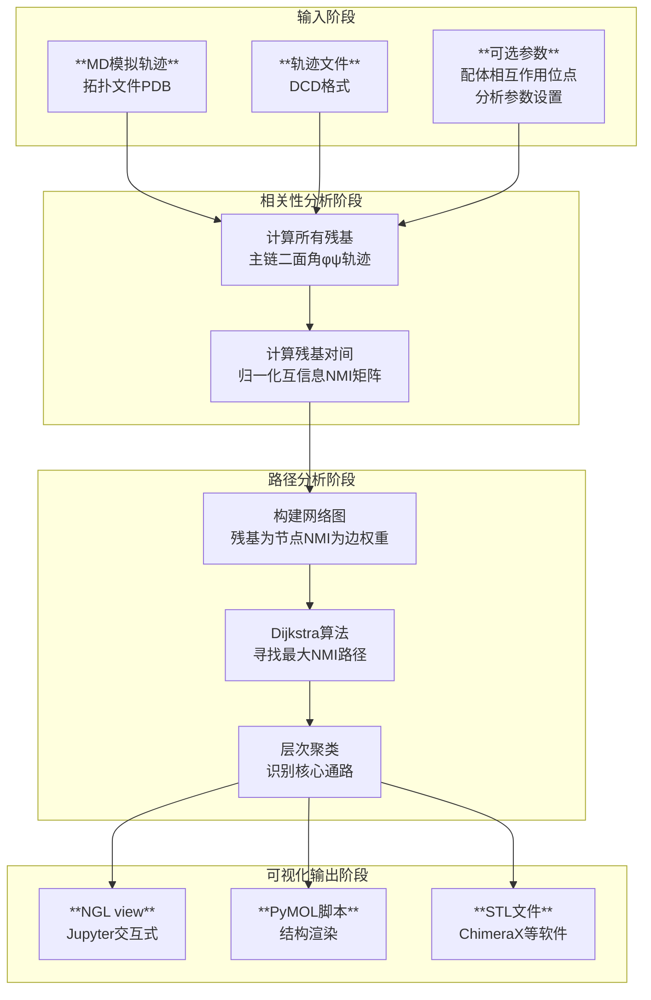

# MDPath：追踪蛋白质中的“悄悄话”——用分子动力学揭示药物靶点（如GPCRs）的变构通信路径

## 本文信息

  - **标题**: MDPath：通过分子动力学模拟揭示药物靶点的变构通讯路径
  - **作者**: Niklas Piet Doering, Marvin Taterra, Marcel Bermúdez, and Gerhard Wolber
  - **发表时间**: 2025年9月23日 (Accepted)
  - **单位**: 柏林自由大学生物、化学与药学系 (德国)，明斯特大学药物与医药化学研究所 (德国)
  - **引用格式**: Doering, N. P., Taterra, M., Bermúdez, M., & Wolber, G. MDPath: Unraveling Allosteric Communication Paths of Drug Targets through Molecular Dynamics Simulations. *Journal of Chemical Information and Modeling*. Published online September 23, 2025. [https://doi.org/10.1021/acs.jcim.5c01590](https://doi.org/10.1021/acs.jcim.5c01590)
  - **源代码**: [https://github.com/wolberlab/mdpath](https://github.com/wolberlab/mdpath)

## 摘要

> 理解蛋白质中的变构通讯对于基于结构的理性药物设计仍然是一个关键挑战。我们在此推出**MDPath**，一个用于分析分子动力学模拟中**变构通讯路径**的Python工具包，其核心是基于**归一化互信息（NMI）**的分析。我们以β₂-肾上腺素能受体、腺苷A₂A受体和μ-阿片受体为模型系统，展示了MDPath识别已知及新型GPCR变构机制的能力。该工具包揭示了β₂-肾上腺素能受体和MOR中配体特异性的变构效应，阐明了蛋白质-配体相互作用如何驱动构象变化。通过对ABL1激酶与变构和正构抑制剂复合物的分析，证明了该方法的广泛适用性。最终，MDPath为绘制蛋白质内部的变构通讯提供了一个开源框架，推动了基于结构的药物设计。

## 背景

变构（Allostery）是生物学中最基本的调控原则之一，它描述了一种“隔山打牛”的现象：**蛋白质上一个位点的扰动（如配体结合或氨基酸突变）能够引起远处另一个功能位点的活性发生改变**。这种远程调控使得药物分子不必直接作用于蛋白质的活性中心，而是可以通过结合在一个全新的“变构口袋”，来精细地调节蛋白质的功能，这为开发高选择性、低副作用的药物提供了巨大机遇。GPCRs、激酶等许多重要药物靶点都受到变构调控。

然而，识别连接这两个远距离位点的“通讯线路”是一个巨大的挑战。这些线路并非静态的物理连接，而是由蛋白质内部残基间动态的、协同的运动所构成的复杂网络。静态的晶体结构往往无法揭示这些隐藏的动态信息，因此，**分子动力学（MD）模拟**成为捕捉蛋白质动态行为、研究变构机制不可或缺的工具。

近年来，虽然涌现出多种用于分析MD轨迹以识别变构网络的计算工具，但它们大多关注于蛋白质整体的通讯网络，难以精确地分离出由**特定配体结合所诱导的信号通路**。此外，许多工具的设置复杂或并非开源，限制了其在药物研发领域的广泛应用。因此，亟需一个易于使用、开源且能系统性地、定量地描绘配体特异性变构路径的工具。

## 关键科学问题

如何从分子动力学模拟的海量数据中，系统性地、自动化地识别并可视化连接药物结合位点与功能远端位点的**变构通讯路径**？

我们能否开发一个通用工具，不仅能确认已知的变构机制（如GPCR中的保守“微开关”），还能揭示**配体特异性**的调控网络（如激动剂和拮抗剂引发的不同信号通路），并为实验中观察到的突变效应提供合理的动力学解释？

## 创新点

  - **发布MDPath开源工具包**：提供了一个完整的、从MD轨迹分析到三维可视化的Python工具包，用于系统性地研究蛋白质变构通讯，其代码已在GitHub上开源。

  - **基于归一化互信息（NMI）的路径识别**：采用NMI来量化残基间动态运动的相关性，并结合图论算法（Dijkstra）来寻找“信息流”最优的路径，为变构分析提供了数学上严谨且物理上直观的方法。

  - **配体特异性路径分析**：实现了从特定配体接触残基出发追踪通讯路径的功能，能够清晰地区分不同配体（如激动剂与拮抗剂）引发的不同变构信号网络。

  - **广泛的验证与应用**：在GPCRs和激酶这两大类重要药物靶点上成功验证了该方法，不仅重现了已知的保守变构基序，还为实验突变数据提供了新的机理见解。

-----

## 研究内容

### 分子动力学模拟方法

**体系构建与参数化**：研究使用了多个GPCR体系和ABL1激酶体系。GPCR结构来源于PDB数据库，包括激动剂结合态（β2：7DHI，A2A：2YDO，MOR：8EFQ）和拮抗剂/反向激动剂结合态（β2：5JQH，A2A：5MZP，MOR：7UL4），ABL1激酶结构为8SSN。所有体系使用MOE 2022.2进行预处理，包括缺失环区建模、突变回归野生型序列、添加缺失原子等。

**模拟软件与力场**：
- **GPCR体系**：使用OpenMMDL进行体系构建，OpenMM进行MD模拟
- **ABL1体系**：使用CHARMM GUI进行体系构建
- **力场选择**：蛋白质使用AMBER14SB力场，脂质使用Lipid21力场，配体使用GAFF2力场（ABL1体系中阿西米尼使用OpenFF）
- **溶剂模型**：TIP3P水模型，0.15 M NaCl离子浓度

**模拟参数**：所有体系均进行能量最小化和0.5 ns平衡后，在NPT系综下运行3个独立的200 ns生产模拟。温度控制在300 K（Langevin动力学），压强控制在1.0 atm，时间步长2 fs，每个重复记录1000帧轨迹用于后续分析。

### 核心方法论深度解析：MDPath的工作原理与流程

MDPath的核心思想是将蛋白质看作一个信息传递网络，利用MD模拟捕捉其动态行为，再通过信息论和图论的工具来寻找信息传递效率最高的“高速公路”。

**图5：MDPath用于变构通讯路径检测的主要工作流程。**

工作流程分为三个主要阶段：输入阶段接收MD模拟轨迹文件（PDB拓扑和DCD轨迹），可选择性添加配体相互作用位点等参数；分析阶段首先计算残基主链二面角运动，然后计算归一化互信息矩阵，接着构建网络图并使用Dijkstra算法寻找最大NMI路径，最后进行层次聚类识别核心通路；可视化阶段生成多种格式的输出文件，包括NGL view（Jupyter笔记本）、PyMOL脚本和STL文件（用于ChimeraX等软件）。

#### 1. 相关性分析：从原子运动到信息网络

##### 为什么选择二面角？

MDPath选择监测每个残基的**主链二面角（$\phi, \psi$）的动态变化，而不是Cα原子的笛卡尔坐标。这是一个关键的方法学选择。因为笛卡尔坐标会受到蛋白质在模拟盒子中整体平动和转动的影响，直接计算坐标相关性会引入大量虚假的、无物理意义的噪声。而二面角是内坐标**，它只描述了肽链局部的扭转运动，与分子的整体运动无关。因此，基于二面角计算出的相关性更能反映蛋白质内部真实的构象变化和信息传递，信噪比更高。

##### 如何量化“通讯”强度？——互信息与NMI

MDPath采用信息论中的**归一化互信息（Normalized Mutual Information, NMI）来量化任意两个残基（X和Y）之间的“通讯强度”。首先，计算两个残基二面角运动之间的互信息（Mutual Information, MI）**：
$$MI(X,Y)=\sum_{x}\sum_{y}P(x,y)\log_{2}\left(\frac{P(x,y)}{P(x)\cdot P(y)}\right)$$

#### 公式的通俗解释

互信息衡量了知道一个变量后，另一个变量不确定性减少的程度，可以理解为两个变量之间**非线性相关性**的量度。

  * $P(x,y)$ 是**联合概率分布**，表示残基X处于状态x（某个二面角角度范围）且同时残基Y处于状态y的概率。
  * $P(x)$ 和 $P(y)$ 是**边缘概率分布**，分别表示X处于状态x和Y处于状态y的概率。
  * 如果X和Y的运动完全**独立**，那么 $P(x,y) = P(x) \cdot P(y)$，比值为1，$\log_2(1)=0$，MI为0。
  * 如果X和Y的运动高度**相关**，那么 $P(x,y)$ 会远大于 $P(x) \cdot P(y)$，比值大于1，$\log_2$项为正，MI值就高。

然后，使用每个残基自身的**熵（Entropy）** $H(X)=-\sum P(x)\log_{2}(P(x))$ 对MI进行归一化，得到NMI：
$$NMI(X, Y) = \frac{MI(X, Y)}{\sqrt{H(X)\cdot H(Y)}}$$

#### 公式的通俗解释

NMI通过除以两个残基各自信息熵的几何平均值，消除了变量自身复杂性的影响。这使得NMI的取值范围被限定在**0（完全无关）到1（完全相关）**之间。一个高的NMI值意味着两个残基在动态运动上是高度协同的，即使它们在空间上相距很远，也表明它们之间存在一条有效的“通讯”通路。

#### 2. 基于图的路径分析：寻找最优通讯路径

计算出所有残基两两之间的NMI值后，MDPath将蛋白质抽象成一个**网络图（Graph）**。它将每个氨基酸残基视为一个**节点（node）**，并在空间上邻近（\< 5 Å）的残基之间创建**边（edge）**。

关键的一步是如何利用**Dijkstra算法**。Dijkstra算法是图论中一个经典的**最短路径算法**，它寻找的是图中两点之间**权重之和最小**的路径。然而，我们的目标是寻找**累积NMI值最大**（即信息流最强）的路径。为了利用Dijkstra算法，MDPath进行了一个巧妙的转换：它将每条边的权重（weight）定义为与NMI值成反比的量（例如 $w = 1 - NMI$）。这样，NMI值越高（通讯越强），边的权重就越小。因此，**在这个权重被“反转”的图中寻找“最短路径”，就等价于在原始概念中寻找“信息量最大的路径”**。通过对所有可能的残基对运行该算法并筛选，MDPath便可描绘出蛋白质内部主要的变构通讯网络。

### 结果与分析

#### 1. 模拟体系的质量控制：确保动力学轨迹的可靠性

**图S3-S5：激动剂结合的GPCR在200 ns模拟过程中的A100激活指数变化。**

**A100激活指数的计算原理**：A100是一个专为A类GPCR设计的通用激活指数，基于五个关键的跨膜螺旋间距离计算得出。**该指数通过机器学习方法训练**，使用了大量微秒级分子动力学模拟数据和268个已发表的X射线晶体结构进行验证。A100指数的分类准确性在二态模型中达到94%（活性态）和99%（非活性态），在三态模型（包括中间态）中对活性态、中间态和非活性态的准确性分别为63%、81%和89%。

在分析通讯路径之前，必须确保MD模拟本身是可靠的，即蛋白质在模拟过程中保持在预期的功能状态（活性态或非活性态）。作者使用A100激活指数来监测GPCR的构象状态（分数 > 0表示活性态，分数 < 0表示非活性态）。补充材料中的图S3-S5显示，在所有激动剂结合的体系中，A100分数在200 ns的模拟时长内基本都保持在0以上，表明**模拟轨迹很好地维持了受体的活性构象**，为后续的路径分析提供了可靠的数据基础。

#### 2. 验证：识别GPCR中的保守变构“微开关”

**图1：(A) 沙丁胺醇结合的活性态β₂-肾上腺素能受体的完整路径图。(B) 卡拉洛尔结合的非活性态β₂-肾上腺素能受体的完整路径图。(C) 热图显示了在所有三个模拟重复的前500条路径中，A类GPCR保守基序残基的参与情况。图中蓝色和紫色路径表示变构通讯路径，路径的粗细反映通讯强度**。子图(D-H)详细展示了特定基序的路径：蓝色路径穿过CWxP基序(D)和PIF基序(E)，橙色残基标记关键基序位点。在非活性态中，蓝色路径通过NPxxY基序(F)和DRY基序的离子锁结构(G,H)。

**热图计算方法**：图1C的热图统计了前500条最强通讯路径中每个保守基序残基的出现次数。对于每个基序（如CWxP、PIF、NPxxY、DRY），计算该基序内所有残基在路径中的参与频率，然后**取该基序内任一残基的最大出现频率作为该基序的代表值**。这种计算方式能够量化不同功能状态下各个保守"微开关"基序在变构通讯网络中的重要性。**热图使用对数标度**以更清晰地显示频率差异，**颜色越深表示该基序在相应条件下的参与度越高**。

GPCR的激活过程依赖于几个保守的氨基酸基序（"微开关"）的协同运动。MDPath的分析结果与已知的生物学机制高度吻合。在活性态受体(A)中，可以看到从细胞外域延伸到细胞内域的蓝色路径。非活性态受体(B)显示不同的路径模式。如图1C热图所示，在**激动剂**结合的**活性态**受体中，与激活相关的**CWxP**和**PIF**基序在通讯路径中的出现频率非常高。相反，在**反向激动剂**结合的**非活性态**受体中，与稳定非活性态相关的**NPxxY**和**DRY**基序则占据了主导地位。

#### 3. 解释：为实验突变数据提供机理支撑

**图2：(A) 腺苷结合的腺苷A₂A受体中，从T88到W246的路径。(B) DAMGO结合的μ-阿片受体中，通过关键枢纽Y328的路径。**

图中蓝色路径表示变构通讯路径，橙色残基标记关键位点，黄色分子为配体。在A₂A受体(A)中，蓝色路径连接T88³·³⁶（橙色）到激活开关W246⁶·⁴⁸（橙色），展示从TM3到CWxP基序的直接变构通讯，解释了T88突变导致受体活性降低的机理。在μ-阿片受体(B)中，蓝色路径汇聚于关键枢纽残基Y328⁷·⁴³（橙色），该残基位于NPxxY基序上方，作为路径分布中心控制向细胞内结构域的信号传递。

实验表明，在A₂A受体中将T88突变会显著降低受体活性。**MDPath的分析（图2A）首次发现了一条从T88直达激活开关CWxP基序的变构路径**，为该实验现象提供了清晰的机理解释。同样，对于μ-阿片受体（MOR），MDPath也发现Y328是一个关键的**路径“枢纽”（hub）（图2B），与其实验功能的重要性相符**。

#### 4. 洞察：绘制配体特异性的通讯网络

**图3：β₂-肾上腺素能受体中的配体特异性路径。(A) 激动剂沙丁胺醇结合的活性态中的路径集群。(B) 反向激动剂卡拉洛尔结合的非活性态中的路径集群。**

图中展示了两种不同的变构路径集群：蓝色和红色路径代表两个主要的通讯集群，路径粗细反映通讯强度。黄色分子为配体（沙丁胺醇或卡拉洛尔），橙色残基标记参与路径的关键位点。在激动剂沙丁胺醇结合的**活性态(A)中，路径主要汇聚到激活相关的PIF基序**，显示出典型的激活信号传递模式。在反向激动剂卡拉洛尔结合的非活性态(B)中，路径模式完全不同，**主要连接到稳定非活性态的NPxxY基序**。值得注意的是，N312⁷·³⁹在两种状态下都不是主要路径的组成部分，表明其主要作用可能是配体结合而非功能调控。

#### 5. 方法的稳健性与拓展应用

  * **模型完整性的重要性**：补充材料中的一个关键负对照实验表明，如果人为地截断GPCR的一个重要胞内环（ICL3），MDPath分析出的路径就会变得模糊不清，甚至出现矛盾的信号（如在激活模拟中出现失活路径）。这证明了**使用完整的、高质量的蛋白质模型进行MD模拟是获得可靠变构路径的前提**。
  * **变构调节剂的影响**：补充材料（图S7）还探究了钠离子和胆固醇等变构调节剂对通讯路径的影响。结果显示，这些调节剂的加入虽然会改变某些路径的权重（如增强了钠离子结合位点周围的信号），但**核心的通讯通路模式保持不变**，显示了变构网络的稳健性。
  * **在激酶靶点中的应用**：**图4：(A) ABL激酶与波舒替尼（紫色路径）和阿西米尼（蓝色路径）结合的完整视图。(B) DFG基序被变构路径稳定在DFG-out构象。(C) 远端T212残基作为正构路径的终点。**

图中紫色路径起始于正构ATP结合口袋（波舒替尼结合位点），蓝色路径起始于变构肉豆蔻酰口袋（阿西米尼结合位点）。两条路径都汇聚到自抑制性SH3结构域，但通过不同的机制。子图(B)显示蓝色变构路径如何稳定DFG基序（橙色）保持DFG-out构象，为阿西米尼的变构抑制机制提供分子基础。子图(C)展示远端T212残基（橙色）作为紫色正构路径的终点，解释了该位点突变如何影响ATP结合口袋抑制剂的活性。

为了证明方法的普适性，作者将其应用于著名的ABL1激酶。MDPath成功识别出由正构抑制剂（波舒替尼）和变构抑制剂（阿西米尼）引发的两条截然不同的路径，并首次从动力学网络角度揭示了阿西米尼的变构抑制机制。

-----

## Q&A

  - **Q1**: 这个工具对于药物研发的实际价值体现在哪里？

  - **A1**: MDPath的价值主要体现在以下几个方面：
    1. **理解药物作用机制**：通过可视化不同药物（如激动剂vs拮抗剂）引发的特异性通讯路径，可以深入理解其产生不同药理效应的分子基础。
    2. **指导理性药物设计**：识别出的路径上的关键“枢纽”残基，可以作为新的药物设计靶点，或者用于指导对现有分子的结构优化。
    3. **解释耐药性突变**：MDPath可以找到连接药物结合位点与远处突变位点的变构路径，从而解释为什么一个远端的突变会影响药物的疗效。
    4. **发现新的变构口袋**：通过分析整个蛋白的通讯网络，有可能识别出此前未被发现的、对蛋白功能至关重要的“热点”区域，这些区域可能成为全新的变构药物靶点。

  - **Q2**: MDPath的分析依赖于MD模拟，那么模拟的时长和质量对结果有什么影响？

  - **A2**: 这是一个非常关键的实际问题。**模拟的时长决定了构象采样的充分性**。本文使用了200 ns的模拟，这对于捕捉局部、快速的二面角运动是足够的，可以很好地分析处于一个稳定状态的通讯网络。但如果想要研究从非活性态到活性态的完整转变过程，这种慢过程就需要更长的模拟或结合增强采样方法。**模拟的质量**，如力场的准确性、体系构建的合理性，直接决定了轨迹的物理真实性。如果模拟本身不准确（如本文补充材料中ICL3截断的例子），那么从中分析出的任何“路径”都将是不可信的。因此，高质量、充分采样的MD模拟是MDPath分析成功的基石。

  - **Q3**: 论文中提到了对路径进行“层次聚类”，这一步的目的是什么？

  - **A3**: Dijkstra算法会找到成百上千条独立的“最优”路径。许多路径在空间上可能是高度重叠、非常相似的，它们实际上代表了同一条宏观的通讯“干道”。**层次聚类**的目的就是将这些相似的路径**自动地分组归类**。MDPath通过计算不同路径上残基原子坐标的距离来衡量路径的相似性，然后将相似的路径聚成一类。这样做的好处是，可以从纷繁复杂的数百条路径中，提炼出几条（如3-5条）最具代表性的、结构上不同的**核心通讯通路（path clusters）**，如图3A中显示的红色和蓝色两条截然不同的路径。这极大地简化了结果的分析和可视化，让研究者能更容易地抓住主要的变构机制。

-----

## 关键结论与批判性总结

  * **核心结论**

      * 本文成功开发并开源了一款名为MDPath的Python工具包，用于从MD模拟轨迹中系统性地识别、分析和可视化蛋白质的变构通讯路径。
      * 该方法以残基主链二面角的归一化互信息（NMI）为核心，结合图论算法，能够有效捕捉残基间的动态协同运动，并绘制出信息传递的最优路径。
      * 在GPCRs和ABL1激酶等多个重要药物靶点上的测试表明，MDPath不仅能准确识别已知的保守变构基序和激活机制，还能揭示配体特异性的信号通路。
      * MDPath的分析结果与实验突变数据高度吻合，能够为突变如何影响蛋白质功能提供合理的动力学机理的解释。

  * **潜在影响**

      * 为药物研发领域的研究者提供了一个易于使用且功能强大的开源工具，有助于加深对药物作用机制的理解，并指导基于结构的理性药物设计。
      * 其“配体特异性”路径分析功能，为研究GPCR功能选择性、偏向性激动等前沿问题提供了新的计算视角。

  * **存在的局限性**

      * 该方法目前仅考虑了主链二面角的信息，忽略了侧链运动和水分子等其他可能参与变构通讯的因素。
      * 路径识别的准确性依赖于MD模拟的充分采样。对于涉及大的构象变化的慢过程，可能需要更长的模拟或结合增强采样方法。
      * 路径的可视化和解读在一定程度上仍需要研究者的专业知识和判断。

  * **未来研究方向**

      * 将侧链构象、水分子网络等更多维度的信息整合到NMI计算中，以构建更全面的通讯网络模型。
      * 将MDPath与马尔可夫状态模型（MSM）等方法结合，分析不同构象状态之间的转变路径。
      * 利用MDPath分析更大规模的MD数据库（如GPCRmd），进行高通量的变构机制探索。