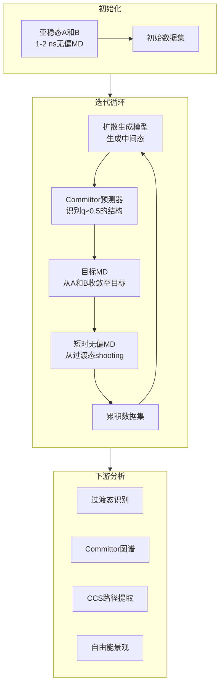
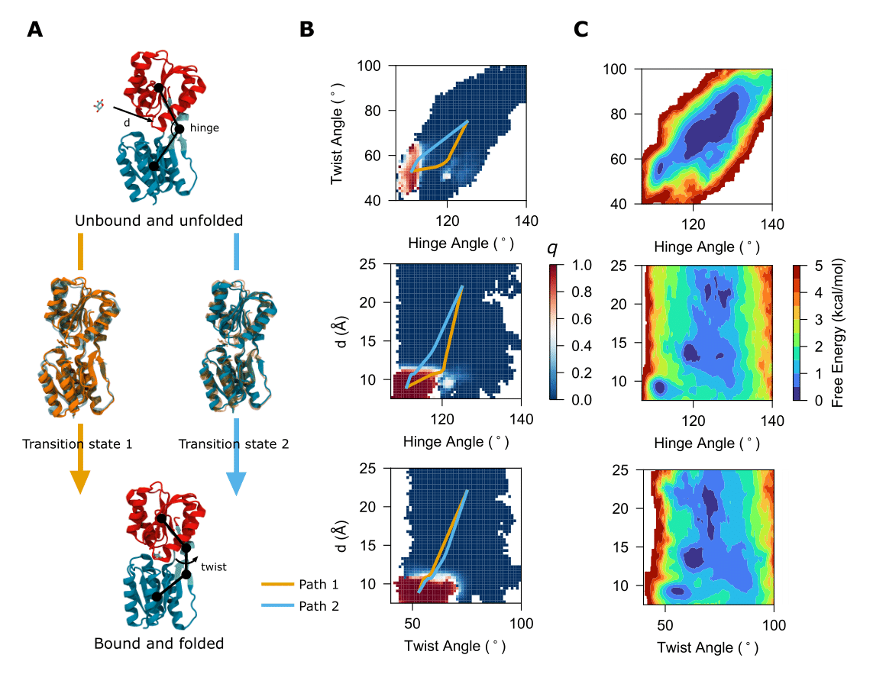

# 突破时间尺度壁垒：Gen-COMPAS用生成式AI重新定义罕见事件模拟

## 本文信息

- **标题**: Breaking the Timescale Barrier: Generative Discovery of Conformational Free-Energy Landscapes and Transition Pathways
- **作者**: Chenyu Tang, Mayank Prakash Pandey, Cheng Giuseppe Chen, Alberto Megías, François Dehez, Christophe Chipot
- **发表时间**: 2025年10月28日（arXiv预印本）
- **单位**: 法国洛林大学、西班牙马德里理工大学、美国芝加哥大学、美国伊利诺伊大学香槟分校
- **引用格式**: Tang, C., Pandey, M. P., Chen, C. G., Megías, A., Dehez, F., & Chipot, C. (2025). Breaking the Timescale Barrier: Generative Discovery of Conformational Free-Energy Landscapes and Transition Pathways. *arXiv preprint* arXiv:2510.24979v1.

## 摘要

> 蛋白质折叠、变构调节和膜转运等分子转变是生物学的核心，但由于其内在的罕见性，传统分子动力学模拟难以触及。增强采样方法虽然能加速模拟，但成本高昂且依赖于预先定义的任意集合变量，可能引入偏差。本文介绍了**Gen-COMPAS框架**，一种生成式committor引导的路径采样策略，能够在不预定义变量的情况下、以极低成本重构完整的转变路径。Gen-COMPAS将**扩散生成模型**（产生物理上合理的中间态）与**committor过滤**（精准定位过渡态）相结合。通过从这些中间态出发的短时无偏模拟，该方法能在纳秒级时间尺度内快速获得完整的转变路径集合，而传统方法需要数个数量级更多的采样。应用于从微型蛋白到核糖结合蛋白再到线粒体载体的多种体系，Gen-COMPAS高效地获得了committors、过渡态和自由能景观，**将机器学习与分子动力学完美统一**，为机理研究和实际应用提供了广泛的洞见。

### 核心结论

- **无需预定义集合变量**：Gen-COMPAS自动从无偏MD轨迹中学习committor函数，识别控制转变的关键自由度
- **采样效率提升数百倍**：Trp-cage蛋白折叠研究中，将所需采样时间从208微秒降至594纳秒，效率提升约350倍
- **同时获得动力学与热力学信息**：一次计算即可获得过渡态集合、committor图谱、转变路径和自由能景观
- **适用于复杂异质体系**：不同于多数生成模型仅限蛋白质，Gen-COMPAS可显式处理蛋白-配体复合物和膜蛋白体系
- **揭示新的生物学机制**：首次明确证明线粒体AAC转运蛋白的闭合态（O-state）是$\ce{ADP^3-}$转运的必经中间态

## 背景

分子体系中的罕见转变——如蛋白质折叠、化学反应、分子识别与结合——是理解生物功能的关键。精确绘制**过渡态集合**（TSE）、主导路径和**自由能景观**（FEL）对于药物发现、蛋白质设计和催化研究至关重要。

传统方法主要依赖两种策略：一是**暴力分子动力学**（brute-force MD），原则上可提供无偏的动力学视图,但计算资源需求巨大。即使是Anton这类专用超级计算机，其模拟范围仍远短于许多生物学或化学相关过程的真实时间尺度。二是**增强采样方法**（umbrella sampling、metadynamics、adaptive biasing force等），通过沿预定义的集合变量（CVs）施加偏置来加速采样。然而，这类方法的有效性完全取决于CVs的选择质量——如果关键坐标被遗漏，偏置可能扭曲真实机制或无法有效加速采样。

近年来，**神经网络**的引入带来了数据驱动的CV识别方法（如autoencoder、图神经网络），**committor理论**的发展也将committor $q$ 确立为最优反应坐标。然而，即使是这些先进方法，仍然严重依赖于增强采样技术。

与此同时，**生成模型**（如Boltzmann generators、MDGen、BioEmu）虽然能直接生成平衡构象，但需要海量训练数据（数百毫秒MD轨迹或大规模实验测量），且生成的构象来自学习的潜空间而非真实分子哈密顿量，可能引入热力学预测的系统性偏差。**如何在保持物理严格性的同时实现计算效率，真实捕获罕见分子事件的动力学和热力学，仍是一个艰巨挑战。**

## 关键科学问题

本文旨在解决以下核心问题：

1. **能否在不预定义集合变量的情况下，高效探索罕见事件的转变路径？**
2. **如何同时获得动力学（committor、过渡态）和热力学（自由能景观）信息？**
3. **生成模型能否在物理严格性约束下，真正加速罕见事件的采样？**
4. **该框架能否推广到蛋白-配体复合物、膜蛋白等异质体系？**

## 创新点

- **首次将扩散生成模型与committor理论结合**：形成强大的迭代反馈循环，自动聚焦于过渡态区域
- **完全无需预定义集合变量**：消除CV依赖方法中的系统性偏差
- **原生GPU优化**：可扩展至大型生物分子体系
- **适用于异质体系**：突破多数生成方法仅限纯蛋白质的局限
- **物理严格性**：所有采样源自无偏轨迹，直接操作真实哈密顿量
- **极高效率**：采样时间缩短2-3个数量级

---

## Gen-COMPAS框架详解

### 核心工作流程

Gen-COMPAS的工作流程可分为三个阶段：

**阶段1：初始化**
- 对两个亚稳态（反应物态A和产物态B）进行极短的无偏MD模拟（1-2 ns）
- 生成初始训练数据集

**阶段2：迭代优化循环**
- **扩散生成模型**：基于当前数据集，生成连接A和B的物理合理的中间态构象
- **Committor预测**：在构象空间中学习高维committor函数 $q$，识别 $q \approx 0.5$ 的近过渡态结构（separatrix，即等概率返回A或B的超曲面）
- **目标MD**（TMD）：从A和B态出发，收敛至生成的中间态目标
- **Shooting模拟**：从separatrix上的点出发，进行短时无偏MD模拟
- **数据累积**：新生成的数据用于下一轮扩散模型和committor预测器的训练

**阶段3：下游分析**
- 识别过渡态集合（TSE）
- 构建投影到任意可解释CVs上的committor图谱
- 提取committor一致性路径（CCS）
- 近似自由能景观（FEL）

### 方法学细节

**扩散生成模型**

采用去噪扩散概率模型（DDPM），通过逐步添加噪声将数据分布转化为高斯分布，再通过学习的逆过程生成新样本。关键是该模型在蛋白质构象空间中训练，能够生成物理上合理的中间态。

**Committor函数学习**

Committor $q(\mathbf{x})$ 定义为从构象 $\mathbf{x}$ 出发、在到达A之前先到达B的概率。$q = 0.5$ 的超曲面（separatrix）精确定义了过渡态集合。Gen-COMPAS直接在笛卡尔空间中用神经网络表示committor，无需预定义CVs。

**目标MD（TMD）**

通过在原子坐标上施加调和约束，引导系统从起始态（A或B）收敛至目标构象。这确保生成的中间态能够通过物理上合理的路径到达。

**Shooting模拟**

从separatrix附近的构象出发，进行短时（纳秒级）无偏MD模拟，观察其最终落入A态或B态的概率，以验证和细化committor预测。

### 与现有方法的对比

| 特性 | 传统增强采样 | 纯生成模型 | Gen-COMPAS |
|------|------------|-----------|-----------|
| 需要预定义CVs | ✓ | ✗ | ✗ |
| 训练数据需求 | 中等 | 极大（ms级） | 极小（ns级） |
| 物理严格性 | 高（可能有偏） | 低（潜空间） | 高（无偏MD） |
| 采样效率 | 低-中 | 高（训练后） | 高 |
| 动力学信息 | 有限 | 近似 | 精确（committor） |
| 异质体系 | ✓ | ✗（多数） | ✓ |
| GPU优化 | 部分 | ✓ | ✓ |

---

## 研究内容

### 案例1：Trp-cage快速折叠蛋白

**研究背景**

Trp-cage微型蛋白（20个残基）是快速折叠蛋白研究的经典体系。其简单拓扑和短折叠时间使其成为验证计算方法的理想基准——既小到可以进行全原子模拟，又足够复杂以捕获协同转变和类天然中间态的形成。

**图2：Gen-COMPAS对Trp-cage快速折叠蛋白的研究**
- **图2A**：Trp-cage在折叠态、过渡态和解折叠态的代表性结构
  - 高亮显示 $\alpha$-螺旋和端到端距离 $d$
- **图2B**：学习到的committor $q$ 投影到三个集合变量上
  - 所有 $\ce{C_\alpha}$ 原子的RMSD
  - $\alpha$-螺旋 $\ce{C_\alpha}$ 原子的RMSD
  - 端到端距离
  - 同时显示两条采样路径
- **图2C**：自由能景观投影到相同的CVs上
  - 左图：Gen-COMPAS结果
  - 右图：DESRES微秒级模拟结果（作为对照）
- **图2D**：沿路径的归一化CV值和对应的committor值

**关键发现**

Gen-COMPAS成功识别了中间过渡态并重构了折叠自由能景观。**估计的自由能差与DESRES的208微秒参考模拟定量一致**。Committor和TSE分析揭示了**折叠机制呈双路径分叉**：
- **路径1**：早期螺旋成核，随后核心固化
- **路径2**：以中心色氨酸残基周围的疏水塌缩为起始，螺旋形成滞后

这一多路径观察与之前的显式溶剂转变路径采样研究一致。

**效率提升**

**采样时间从208微秒降至594纳秒，效率提升约350倍**。更重要的是，这种效率不仅限于平衡自由能景观，还扩展到动力学研究——通过直接学习committor（折叠先于解折叠的概率），Gen-COMPAS无需超长模拟即可表征折叠动力学。

### 案例2：核糖结合蛋白（RBP）的结合伴随折叠

**研究背景**

RBP是一种周质结合蛋白（PBP），对细菌营养摄取至关重要，介导高亲和力核糖识别和递送。与其他PBPs类似，RBP在开放态（apo，无配体）和闭合态（holo，结合配体）之间发生大尺度构象变化。核糖结合与柔性区域的折叠紧密耦合，使RBP成为**结合伴随折叠**过程的模型体系，展示了局部无序如何驱动分子识别。捕获这一过程在计算上极具挑战性，需要同时采样大尺度运动、局部环结构化和配体对接。

**图3：Gen-COMPAS对RBP结合伴随折叠过程的研究**
- **图3A**：RBP-核糖未结合态和结合态的代表性结构、过渡态以及转变路径
  - 标注三个集合变量：$d$（配体距离）、hinge（铰链角）、twist（扭转角）
- **图3B**：Committor和committor一致性路径
  - 揭示两种不同的结合-折叠机制
  - 颜色表示committor值
- **图3C**：Gen-COMPAS获得的自由能景观
  - 左图：$d$ vs hinge
  - 右图：$d$ vs twist
  - 清晰显示结合伴随折叠机制

**双路径机制**

Gen-COMPAS重构了RBP的完整结合伴随折叠路径，捕获了从无序开放态、经部分折叠中间态、到最终核糖结合闭合态的转变，揭示了配体结合与蛋白质折叠的协同相互作用：
- **扭转角重排**：两条路径类似，表明运动保守
- **铰链弯曲重排**：路径分化
  - 路径1：分步诱导契合机制（配体结合先于蛋白闭合）
  - 路径2：同步结合与折叠

**定量热力学与动力学统一**

Committor函数直接估计识别了TSE，此时核糖正在与RBP相互作用，但蛋白尚未完全闭合。沿配体位置和域间角度的回溯定义CVs投影的自由能景观，显示出明显的开放和闭合能量盆，由与预期门控运动一致的能垒分隔。

这些分析将热力学和动力学统一为结合伴随折叠过程的连贯机理图谱。通过原子水平分辨转变路径并定量其能量学，Gen-COMPAS**提供了解剖复杂耦合折叠-结合事件的通用策略**，对其他PBPs或本征无序蛋白具有广泛相关性。

### 案例3：线粒体ADP/ATP载体（AAC）的复杂转运机制

**研究背景**

AAC是一种必需的线粒体转运蛋白，通过严格的1:1反转运机制交换胞质$\ce{ADP^3-}$和基质$\ce{ATP^4-}$，维持细胞能量平衡，为生物合成、信号转导和肌肉收缩等过程提供燃料。由于线粒体内膜对核苷酸不可透过，AAC是$\ce{ADP^3-}$的唯一入口，使其功能对氧化磷酸化不可或缺。

AAC通过**交替通路机制**运作，在胞质开放态（C-state，结合$\ce{ADP^3-}$）和基质开放态（M-state，释放$\ce{ADP^3-}$并结合ATP导出）之间循环。虽然晶体学研究在抑制剂存在下捕获了这些末端态，但并未解释AAC如何在转变过程中防止不受控的核苷酸泄漏。生化和计算研究因此提出了一个瞬态**闭合态**（O-state），其中$\ce{ADP^3-}$被完全包裹在中央腔内，与膜两侧隔绝。这一状态充当保障机制以确保严格耦合的交换，但直接证据一直难以捕获——常规MD难以捕获这一短寿命中间态，实验数据也大多是间接的。

**图4：Gen-COMPAS对线粒体ATP/ADP载体（AAC）的研究**
- **图4A**：holo-AAC（$\ce{ADP^3-}$结合态）的三个亚稳态、过渡态和转变路径
  - 从C-state → O-state → M-state的路径
  - $\ce{ADP^3-}$从O-state到M-state的轴向运动
  - 三维CV空间中的构象转变路径和自由能景观能量盆
- **图4B**：AAC在膜中的holo-state以及描述构象转变的集合变量
  - $d_1$：胞质侧门控残基对距离之和
  - $d_2$：基质侧门控残基对距离之和
  - $d_3$：$\ce{ADP^3-}$的N6原子到胞质侧门控残基质心的距离
- **图4C**：连接三个状态的committor和committor一致性路径
- **图4D**：投影到二维的自由能景观（holo-AAC）
- **图4E**：apo-AAC的两个亚稳态及其投影到 $d_1$ 和 $d_2$ 的自由能景观

**明确证实闭合中间态的存在**

Gen-COMPAS克服了传统方法的局限，**明确展示了$\ce{ADP^3-}$转运过程中闭合中间态的存在**。模拟显示转变通过明确定义的 $\text{C} \to \text{O} \to \text{M}$ 路径进行：
1. $\ce{ADP^3-}$首先在胞质开放态中牢固结合
2. 通过跨膜螺旋的重排被困在闭合中间态
3. 当AAC采用基质开放构象时最终释放到基质中

这一路径**确认O-state是$\ce{ADP^3-}$导入基质的必经步骤**，而非偶然构象。

**三维集合变量与热力学分析**

自由能景观投影到三个事后定义的CVs上：
- $d_1 = \sum (\text{CE-ASP231/CD-LYS32, CZ-ARG137/CE-GLU29, CZ-ARG234/CD-ASP134})$
- $d_2 = \sum (\text{CE-LYS95/CD-ASP195, CE-LYS198/CD-ASP291, CE-LYS294/CD-ASP92})$
- $d_3 = \text{distance}(\ce{ADP^3-}\ \text{N6}, \text{COM of}\ d_1\ \text{residues})$

这三个CVs捕获了此转变的关键热力学特征。观察到对应C、O、M态的明显极小值，能垒与AAC预期的螺旋门控运动一致。**O-state显现为自由能盆，证明其热力学上足够稳定以充当真正的中间态**。

**Committor分析的动力学意义**

Committor分析进一步确立了O-state的动力学作用：一旦AAC转变到闭合态，**向基质开放构象前进的概率占主导**，确认这一中间态是向内转运过程的决定性检查点。

**配体对转运路径的关键作用**

为进一步探究配体结合与无配体条件下的机理差异，作者对AAC apo-state进行了Gen-COMPAS研究。与holo-state的相对较低能垒（C → O约2.5 kcal/mol，O → M约2 kcal/mol）形成鲜明对比，**apo-state中O-state消失，C-M之间出现高达约10 kcal/mol的能垒**。这一结果确认apo-state转变在热力学上强烈不利，与之前研究一致，**突显了底物在稳定转运兼容路径中的关键作用**。

**生理与疾病意义**

这些发现不仅阐明了AAC功能的分子机制，还将转运蛋白动力学与线粒体生理和疾病联系起来。由于AAC是生物能量学的核心，$\ce{ADP}$转运功能障碍可能损害ATP生产，导致从线粒体肌病到神经退行性疾病的各种病症。通过确认和定量闭合态，Gen-COMPAS提供了理解突变或抑制剂如何破坏$\ce{ADP^3-}$转运的机理基础，为健康和病理学中线粒体功能的合理调控铺平道路。

---

## Q&A

- **Q1**: Gen-COMPAS如何处理大型复杂体系的计算成本？
- **A1**: Gen-COMPAS的计算效率来自三个方面：
  - **聚焦采样**：通过committor引导，采样集中在过渡态区域（separatrix附近），避免浪费资源探索不相关的构象空间
  - **短时模拟**：初始化仅需1-2 ns的无偏MD，shooting模拟也在纳秒级，远短于传统方法的微秒-毫秒需求
  - **GPU原生优化**：扩散模型和神经网络committor预测器都原生支持GPU加速，可高效处理大型体系（如AAC的膜蛋白体系包含数万原子）

- **Q2**: 为什么不能直接使用纯生成模型（如Boltzmann generators）来替代Gen-COMPAS？
- **A2**: 纯生成模型存在以下局限：
  - **训练数据需求巨大**：通常需要数百毫秒的MD轨迹或大规模实验数据，对罕见事件来说几乎不可能收集
  - **物理严格性问题**：生成的构象来自学习的潜空间而非真实哈密顿量，可能引入mode imbalance、训练集几何偏好等artifacts
  - **热力学不准确**：自由能景观不能与直接MD严格比较，定量预测可靠性有限
  - **缺乏动力学信息**：无法提供committor等动力学可观测量
  - Gen-COMPAS通过将生成模型与物理严格的无偏MD结合，克服了这些限制，确保所有结果源自真实分子力学

- **Q3**: Committor函数 $q$ 为什么是最优反应坐标？
- **A3**: 从理论角度，committor $q(\mathbf{x})$ 定义为从构象 $\mathbf{x}$ 出发、在到达反应物态A之前先到达产物态B的概率。它具有以下独特性质：
  - **动力学最优性**：满足后向Kolmogorov方程，是唯一完全表征转变动力学的单变量
  - **定义过渡态**：$q = 0.5$ 的超曲面（separatrix）精确定义了过渡态集合，无任意性
  - **无需预判**：不需要预先知道哪些自由度是慢变量，自动从全维构象空间中提取关键信息
  - **路径独立**：committor一致性路径（CCS）追踪动力学上有意义的路径，通常不同于最小自由能路径（MFEP）

- **Q4**: Gen-COMPAS能否应用于化学反应或材料科学中的相变？
- **A4**: 原则上可以。Gen-COMPAS的核心思想——通过生成模型探索中间态+committor引导识别过渡态——是通用的。只要能定义清晰的两个亚稳态（反应物/产物，或两种相），并能进行短时MD模拟，就可以应用。但需要注意：
  - 化学反应可能需要ab initio MD或机器学习力场以准确描述键的断裂/形成
  - 相变可能涉及更复杂的多态共存，可能需要扩展到多于两个亚稳态的情况
  - 当前实现针对生物分子优化，应用于其他领域可能需要调整生成模型架构

- **Q5**: 如何验证Gen-COMPAS结果的准确性？
- **A5**: 文章采用了多重验证策略：
  - **与标准基准对比**：Trp-cage结果与DESRES的208微秒全原子模拟定量一致
  - **与已知机制一致性**：RBP的双路径机制、AAC的O-state中间态均与已有实验和计算证据吻合
  - **内部一致性检查**：Committor预测通过shooting模拟验证（观察从 $q \approx 0.5$ 构象出发的轨迹确实以约50%概率到达A或B）
  - **物理合理性**：所有中间态构象通过TMD从真实亚稳态出发可达，确保路径的物理可行性
  - **事后CV投影**：将结果投影到已知的物理相关CVs上，检查能垒、极小值位置是否合理

---

## 关键结论与批判性总结

**主要贡献**

- **方法学突破**：首次将扩散生成模型与committor理论有机结合，形成完全无CV依赖的罕见事件采样框架
- **效率革命**：将罕见事件采样所需时间从微秒-毫秒级降至纳秒级，提升2-3个数量级
- **机理洞见**：揭示了Trp-cage的双折叠路径、RBP的双机制结合伴随折叠、AAC的必经闭合中间态等新的生物学机制
- **通用性**：适用于蛋白折叠、配体结合、膜转运等多种复杂过程，克服了纯生成模型仅限蛋白质的局限

**潜在影响**

- **药物发现**：快速预测配体结合路径和能垒，指导先导化合物优化
- **蛋白质设计**：理解折叠路径以设计快速折叠或特定中间态的蛋白
- **转运蛋白研究**：解析膜蛋白转运机制，为疾病相关突变和抑制剂设计提供结构基础
- **方法学范式转变**：可能改变分子模拟领域对暴力MD和传统增强采样的依赖

**局限性**

- **两态假设**：当前框架主要针对两个亚稳态之间的转变，多态体系（如多个折叠中间态、多步骤反应）的扩展尚未充分探索
- **力场依赖**：结果准确性仍然受限于底层力场（或机器学习力场）的质量
- **定量精度**：作者坦诚指出，生成的自由能景观应作为快速探索工具，对于需要最高定量精度的应用，应以此为起点再用传统增强采样或转变路径采样精修
- **迭代收敛判据**：文中未详细讨论如何判断迭代何时收敛，可能需要经验或额外的收敛诊断

**未来研究方向**

- 扩展到多个亚稳态的复杂网络（超越简单两态跃迁）
- 结合更高精度的ab initio MD或神经网络势能面
- 开发自动化的收敛诊断和不确定性量化
- 应用于更大尺度的生物复合物（如病毒衣壳组装、染色质重塑）
- 与实验技术（如单分子FRET、低温电镜）结合验证预测

**批判性思考**

正如作者在Discussion中提出的provocative问题：“**我们是否正在见证微秒至毫秒级暴力模拟和传统增强采样策略终结的开端？**”虽然Gen-COMPAS并非完全取代这些方法，但它确实展示了罕见事件动力学的本质可以在不付出极端计算代价的情况下揭示。然而，我们也需要清醒地认识到，Gen-COMPAS的成功建立在精心选择的基准体系上（Trp-cage、RBP、AAC都是研究充分的体系）。对于全新的、机制完全未知的体系，如何确保生成模型不会产生物理上虽然合理但动力学上不相关的中间态，仍是一个开放性问题。此外，committor的学习本身也需要足够的过渡态附近的采样，如何在初始迭代中高效bootstrap这一过程，可能是方法鲁棒性的关键。

尽管如此，Gen-COMPAS无疑代表了分子模拟领域的一次重要进步，**将机器学习的生成能力与物理模拟的严格性完美结合**，为我们理解生命分子的动态过程打开了新的窗口。
