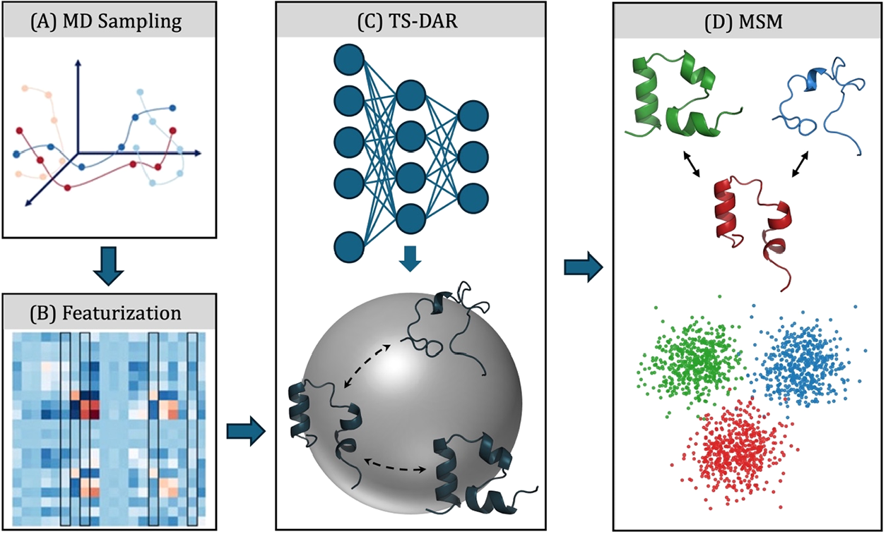
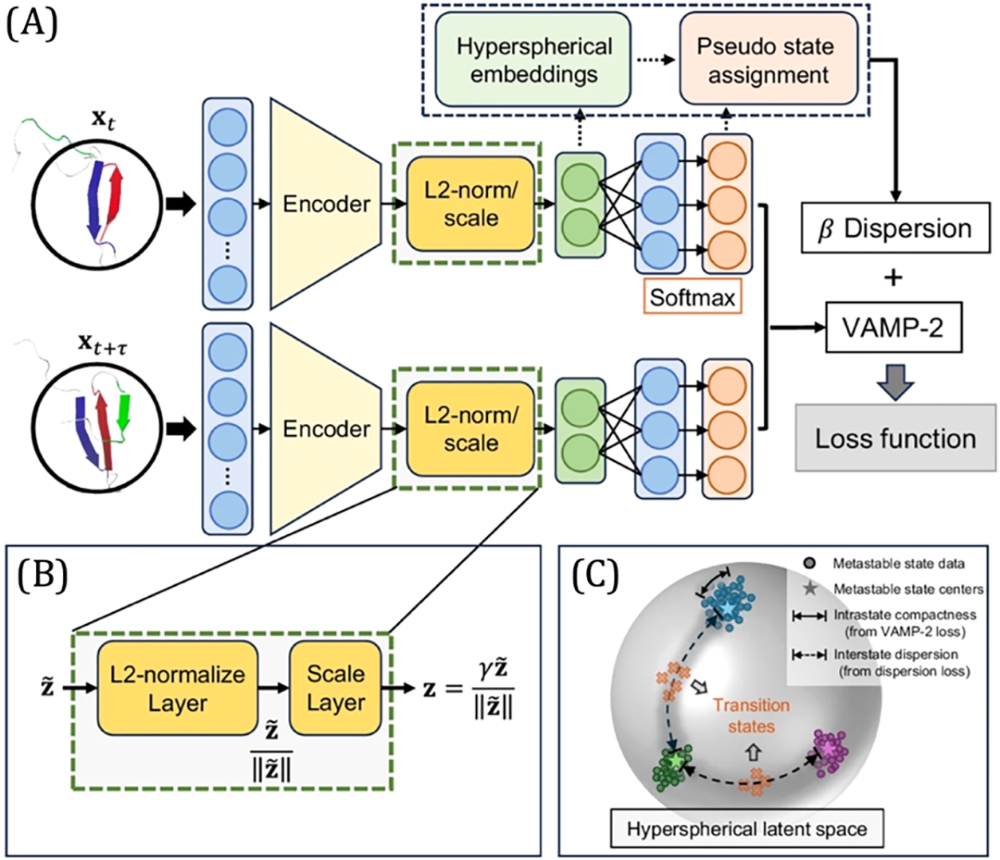
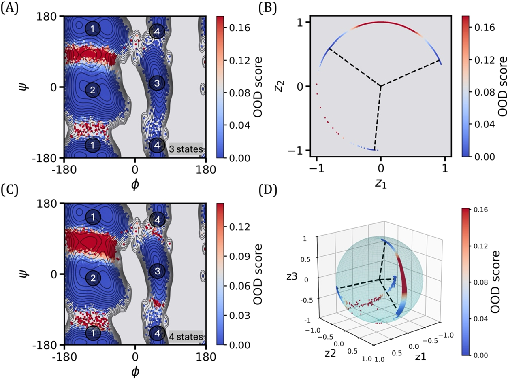
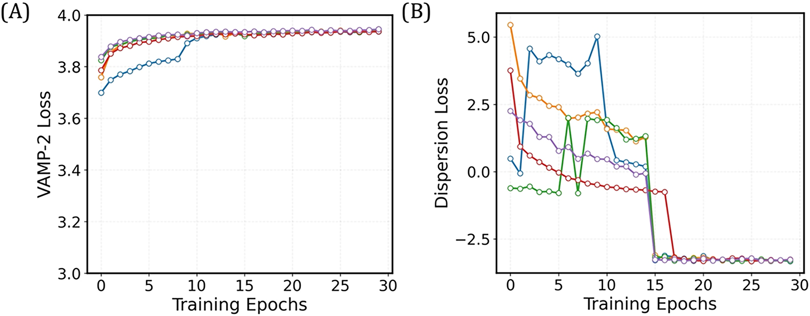
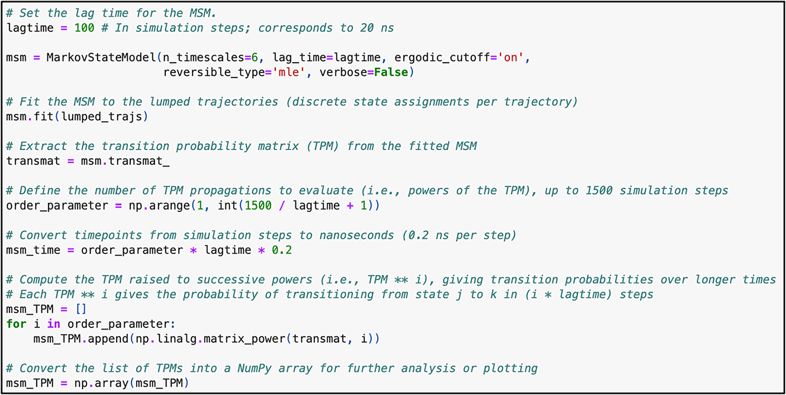
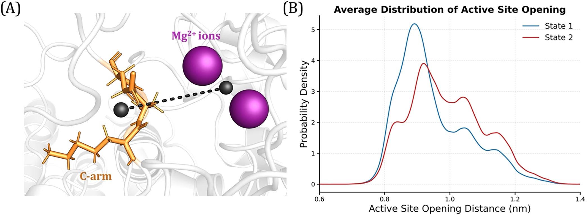
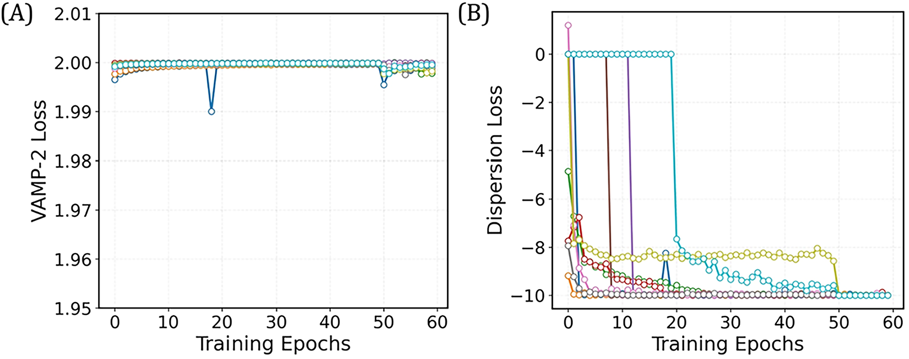
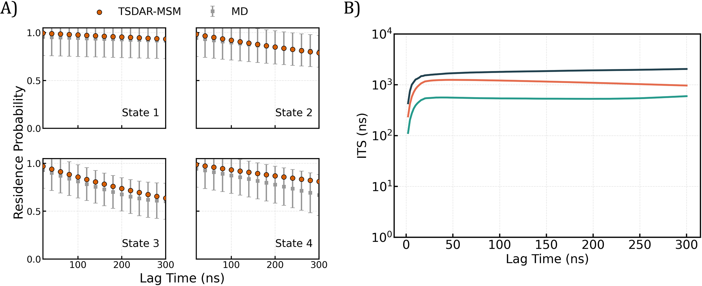

# TS-DAR实用指南：生物分子模拟中的过渡态分析

## 本文信息

- **标题**: A Practical Guide to Transition State Analysis in Biomolecular Simulations with TS-DAR（生物分子模拟中的过渡态分析实用指南）
- **作者**: Eshani C. Goonetilleke, Bojun Liu, Yue Wu, Michael S. O'Connor, Xuhui Huang
- **发表时间**: 2025年10月31日（接收：2025年8月31日；修订：2025年10月30日；接受：2025年10月31日）
- **单位**: Department of Chemistry, Theoretical Chemistry Institute, University of Wisconsin-Madison，美国（美国威斯康星大学麦迪逊分校化学系、理论化学研究所）
- **引用格式**: Goonetilleke, E. C., Liu, B., Wu, Y., O'Connor, M. S., & Huang, X. (2025). A Practical Guide to Transition State Analysis in Biomolecular Simulations with TS-DAR. *The Journal of Physical Chemistry B*. https://doi.org/10.1021/acs.jpcb.5c06097
- **教程代码**: https://github.com/xuhuihuang/ts-dar-tutorials
- **开源协议**: CC-BY 4.0

## 摘要

> 蛋白质功能所必需的构象变化涉及通过复杂自由能景观中多个短暂、高能态的转变。尽管现有方法如**马尔可夫状态模型**（MSM）和基于分子动力学（MD）模拟构建的非马尔可夫方法能够有效捕获亚稳态，但它们在识别过渡态方面存在困难。**TS-DAR**（Transition State Identification via Dispersion and Variational Principle Regularized Neural Networks）是一个计算框架，利用**分布外检测**（OOD）系统识别特定生物分子构象变化中涉及的所有过渡态。TS-DAR利用深度学习模型将MD模拟中的蛋白构象映射到**超球面潜在空间**，这种低维表示保留了生物分子构象变化的关键动力学信息。为了区分亚稳态和过渡态，TS-DAR使用**VAMP-2和分散损失函数**，实现过渡态构象的自动识别。该框架提供了蛋白构象景观的全面视图，促进了药物结合、酶活性和突变效应的研究。

### 核心结论

- **TS-DAR利用分布外检测技术系统识别生物分子过渡态**，解决了传统MSM方法的局限
- **超球面潜在空间映射保留了关键动力学信息**，同时实现低维表示
- **VAMP-2和分散损失函数的组合**实现亚稳态与过渡态的自动区分
- 在多个系统中验证，从简单的丙氨酸二肽到复杂的DNA修复蛋白AlkD
- 在准确性和效率上**优于MaxEnt-VAMPNets和MSM-committor等现有方法**
- 揭示了**蛋白-DNA氢键在AlkD易位速率限制步骤中的关键作用**

## 背景

蛋白质构象变化是其生物学功能的核心，驱动着酶催化、信号转导和变构调控等关键过程。准确建模这些分子过程对于理解生物分子机制和开发靶向治疗至关重要。**马尔可夫状态模型**（MSM）和**非马尔可夫方法**（如quasi-MSM和IGME模型）基于大规模分子动力学模拟构建，是识别亚稳态及表征其转变的强大工具。

然而，该领域面临的一个持续挑战是**过渡态的识别**。过渡态是关键但稀疏填充的构象，**定义了分子过程的速率限制步骤**。传统的MSM方法虽然能够有效捕获长时间尺度的动力学行为，但**由于过渡态在相空间中的瞬态性质和稀疏性，难以直接识别这些高能构象**。

**分布外检测**（OOD Detection）的发展为解决这一挑战提供了新思路。OOD检测最初用于提高人工智能在高风险应用（如自动驾驶汽车）中的可靠性，确保系统在遇到不熟悉场景时不会做出错误预测。**将OOD检测引入生物分子模拟领域，可以利用其识别异常数据点的能力，将过渡态视为偏离亚稳态分布的分布外构象**。

### 关键科学问题

本文旨在解决以下核心问题：

1. **如何系统识别生物分子过渡态**：现有MSM和非马尔可夫方法能有效捕获亚稳态，但对于瞬态、高能的过渡态构象缺乏自动化识别能力
2. **如何在低维表示中保留动力学信息**：需要一种方法能将高维MD轨迹映射到低维空间，同时保留关键的动力学信息和过渡态特征
3. **如何区分亚稳态与过渡态**：需要明确的数学框架和损失函数，能够自动区分这两类构象的不同特征
4. **如何提供实用的工具和教程**：现有方法往往理论性强但缺乏易用的实现，需要提供完整的工作流程和代码教程

### 创新点

- **首次将分布外检测技术应用于生物分子过渡态识别**，开创性地将AI安全领域的方法引入计算生物物理
- **超球面潜在空间设计**：通过L2归一化约束将特征嵌入映射到固定半径超球面，确保几何一致性
- **VAMP-2与分散损失的创新组合**：VAMP-2损失确保亚稳态内部紧密性，分散损失强制亚稳态间分离
- **端到端自动化框架**：从MD轨迹到过渡态识别的完整流程，无需手动调整反应坐标
- **与MSM的无缝集成**：TS-DAR状态分配可直接用于构建MSM，提供完整的动力学描述
- **开源教程和代码**：提供详细的实现指南和示例代码，降低使用门槛

---

## 研究内容

### TS-DAR框架概述

TS-DAR提供了一个端到端的分析流程，将MD模拟数据转化为对蛋白构象动力学的深入理解。整个工作流程包括四个主要步骤：MD采样、特征化、TS-DAR建模和MSM构建。

**图1：使用TS-DAR研究蛋白动力学的端到端流程**
- A.在两个或多个功能构象态之间进行大规模MD模拟
- B.选择相关特征来描述研究系统
- C.TS-DAR使用神经网络将分子构象映射到超球面潜在空间，提供压缩的低维表示同时保留关键动力学信息
- D.TS-DAR的状态分配可用于构建马尔可夫状态模型

**图2：TS-DAR框架详解**
- A.TS-DAR使用来自MD轨迹的转移对（$x_t$和$x_{t+\tau}$）作为输入，包含L2归一化层以生成超球面嵌入。Softmax输出用于获得伪状态分配。超球面嵌入和伪状态分配用于估计损失函数。TS-DAR使用包含VAMP-2损失和加权分散损失的组合损失函数优化神经网络
- B.L2归一化层将特征嵌入（$\tilde{z}$）限制在半径为$\gamma$的超球面内，得到超球面嵌入（$z$）
- C.超球面潜在空间。圆圈表示亚稳态数据，星号表示亚稳态中心。实线箭头突出显示状态内紧密性（来自VAMP-2损失），虚线箭头突出显示状态间分散（来自分散损失）

#### 工作流程四步骤

**第一步：MD模拟采样**

在两个或多个功能构象态之间进行大规模MD模拟，生成覆盖相关构象空间的轨迹数据。模拟需要充分采样亚稳态之间的转变，以捕获过渡态构象。

**第二步：特征化**

从高维MD数据中选择能够捕获最相关构象动力学的结构特征。TS-DAR支持两种自动特征选择方法：
- **spectral oASIS**：基于变分原理，高效识别最能捕获慢动力学的特征子集
- **MoSAIC**：基于相关性的方法，使用Leiden社区检测算法将相似特征聚类，大簇代表集体运动

**第三步：TS-DAR建模**

TS-DAR的核心是将MD构象映射到结构化潜在空间，实现过渡态的自动检测。

**第四步：MSM构建**

使用TS-DAR的状态分配构建马尔可夫状态模型，验证模型的准确性，并预测长时间尺度的动力学行为。

### TS-DAR模型架构详解

TS-DAR模型由三个核心部分组成：

**1. 编码器神经网络**

编码器负责处理输入特征，将转移对$(x_t, x_{t+\tau})$从MD轨迹映射到特征嵌入$\tilde{z}$。这里$\tau$是滞后时间，捕获了系统的时间演化信息。

**2. L2归一化层**

L2归一化约束将所有特征嵌入$\tilde{z}$投影到固定半径$\gamma$的超球面上，得到超球面嵌入$z$：

$$
z = \gamma \frac{\tilde{z}}{\|\tilde{z}\|}
$$

这一步骤至关重要，因为它：
- **确保几何一致性**：所有数据点到球心的距离相同
- **便于距离计算**：超球面上的距离直接反映构象相似性
- **支持OOD检测**：**过渡态作为远离亚稳态中心的点更容易识别**

**3. Softmax输出层**

Softmax层输出伪状态分配，用于计算损失函数和估计转移矩阵。

#### 损失函数设计

TS-DAR的损失函数结合了两个互补的组分：

$$
\mathcal{L}_{\text{total}} = \mathcal{L}_{\text{VAMP-2}} + \lambda \mathcal{L}_{\text{dispersion}}
$$

**VAMP-2损失**

VAMP-2（Variational Approach for Markov Processes）基于变分原理，**最大化潜在空间中慢动力学的捕获能力**。该损失函数促进：
- **亚稳态内部的紧密性**：同一亚稳态的构象在潜在空间中聚集
- **动力学信息的保留**：保持转移矩阵的特征值结构

**分散损失**

分散损失强制不同亚稳态在潜在空间中相互分离：

$$
\mathcal{L}_{\text{dispersion}} = -\sum_{i \neq j} d(c_i, c_j)
$$

其中$c_i$和$c_j$是不同亚稳态的中心，$d(\cdot, \cdot)$是超球面上的距离度量。分散损失确保：
- **亚稳态间的清晰边界**：不同状态在潜在空间中充分分离
- **过渡态的突出性**：**位于状态边界的过渡态更容易被识别为OOD点**

权重参数$\lambda$**平衡了两个损失项的贡献**，通常需要根据系统特性进行调整。

### 过渡态识别机制

TS-DAR使用OOD分数量化每个构象偏离亚稳态分布的程度：

$$
\text{OOD}(x) = \min_i d(z(x), c_i)
$$

其中$z(x)$是构象$x$的超球面嵌入，$c_i$是第$i$个亚稳态的中心。**OOD分数越高，构象越可能是过渡态**。

通过分析OOD分数的分布，可以设定阈值自动识别过渡态构象。这些构象位于亚稳态之间的边界区域，对应于自由能景观上的鞍点。

### 与MSM的集成

TS-DAR的状态分配可以直接用于构建马尔可夫状态模型：

1. **状态定义**：TS-DAR自动识别亚稳态和过渡态，提供明确的状态分配
2. **转移矩阵估计**：基于状态间的转移计数构建转移概率矩阵
3. **动力学验证**：比较MSM预测的长时间动力学与MD观察数据
4. **性质计算**：计算平均首次通过时间（MFPT）、平衡分布等动力学性质

这种集成方法的优势在于：
- **完整的构象景观描述**：同时捕获亚稳态和过渡态
- **自动化流程**：**无需手动定义反应坐标或committor函数**
- **动力学准确性**：VAMP-2损失确保慢动力学的正确捕获

### 案例研究：丙氨酸二肽

丙氨酸二肽是测试和验证新方法的经典基准系统。该分子具有两个关键二面角（$\phi$和$\psi$），其自由能景观包含多个亚稳态和明确定义的转变路径。

**图5：丙氨酸二肽的TS-DAR分析结果**

**TS-DAR应用结果**：
- **亚稳态识别**：TS-DAR成功识别了$C_{7eq}$、$C_{7ax}$和$\alpha_R$等主要亚稳态
- **过渡态定位**：**高OOD分数的构象精确定位在自由能景观的鞍点区域**
- **动力学一致性**：构建的MSM准确预测了状态间的转移速率
- **与已知结果对比**：**TS-DAR识别的过渡态与基于committor函数的传统方法高度一致**

### 案例研究：DNA修复蛋白AlkD

AlkD是一种DNA修复蛋白，通过沿双链DNA（dsDNA）易位来识别和修复损伤碱基。理解其易位机制对于认识DNA修复过程至关重要。

**图6：AlkD在dsDNA上易位的过渡态分析**

**研究发现**：
- **过渡态构象特征**：TS-DAR识别出易位过程中的多个过渡态构象
- **关键氢键作用**：过渡态分析揭示了**蛋白-DNA氢键在速率限制步骤中的关键作用**
- **机制洞察**：氢键的形成和断裂协调了蛋白在DNA上的步进运动
- **与实验一致**：识别的过渡态特征与实验观察的易位动力学相符

这些新发现是通过传统MSM方法难以获得的，展示了**TS-DAR在揭示复杂生物分子机制方面的独特价值**。

### 案例研究：绒毛头片蛋白HP35

**图7：HP35的4态TS-DAR模型验证曲线**
- A.VAMP-2损失的验证曲线显示模型成功收敛
- B.分散损失验证曲线表明亚稳态中心得到良好分离

HP35是一个35残基的快速折叠蛋白，具有清晰的折叠/去折叠动力学。TS-DAR分析使用了来自D.E. Shaw Research的300微秒全原子轨迹数据。

**数据处理**：
- **特征选择**：使用528个C-α原子对之间的距离（残基间隔至少3个）
- **特征降维**：通过spectral oASIS从26565个原始特征中筛选出最能捕获慢动力学的特征
- **模型配置**：采用4态模型，feat_dim=3，训练30个epoch

**关键发现**：
- **识别了4个主要的构象态**：对应于HP35折叠过程的不同中间态
- **过渡态网络**：**揭示了状态间复杂的转换网络，包括多条平行路径**
- **MSM验证**：**Chapman-Kolmogorov检验显示TS-DAR-MSM准确再现长时间尺度动力学**
- **隐式时间尺度**：ITS图证实模型捕获了系统的主要松弛模式

**图10：HP35的4态模型及代表性构象**
- A.超球面潜在空间中的构象分布，虚线指向亚稳态中心
- B-E.4个亚稳态的代表性构象叠加（每态5个构象）
- F.状态2和3之间的过渡态构象
- G.状态2和4之间的过渡态构象

**训练效率**：在Apple M3 Mac上，HP35模型训练仅需约20分钟（30个epoch），其中预训练3分钟，完整训练17分钟。

### 案例研究：蛋白磷酸酶2A（PP2A）

**图14：PP2A的2态TS-DAR模型验证**
- A.VAMP-2损失验证曲线
- B.分散损失验证曲线

PP2A是一种关键的丝氨酸/苏氨酸磷酸酶，参与多种细胞过程。其B56δ调节亚基的突变与智力障碍和癌症相关。**TS-DAR揭示了疾病突变如何通过变构途径影响酶活性**。

**研究设计**：
- **MD数据**：10条100纳秒全原子轨迹，保存间隔10皮秒
- **特征工程**：26565个调节亚基B56δ与催化亚基间的成对距离，通过spectral oASIS降维至1000个特征
- **模型配置**：2态模型，60个epoch训练（50个预训练+10个正式训练）

**图15：PP2A活性位点开放度分析**
- A.活性位点开放距离示意图：C-臂残基572-574质心与$\ce{Mg^{2+}}$离子间距离
- B.两个态的活性位点开放度平均概率密度分布，蓝色为State 1（主要采样关闭构象约0.85 nm），红色为State 2（更多采样开放构象）

**重要发现**：
- **微妙构象差异的捕获**：**TS-DAR成功区分了活性位点的开放和关闭态，尽管这些差异相对微小**
- **变构机制洞察**：State 1主要采样关闭的活性位点构象（约0.85 nm，对应PDB 8U1X），State 2倾向于更开放的构象
- **激活机制**：**结果支持通过N-臂和C-臂从全酶核心释放来实现激活的机制**
- **疾病突变影响**：**远离活性位点的疾病相关突变可能通过改变构象集合分布来影响酶活性**

**训练效率**：在Apple M3 Mac上约4分钟（60个epoch），预训练2.5分钟，正式训练1.5分钟。

### 实用指南：超参数设置

训练TS-DAR模型需要注意以下关键超参数：

**1. 随机种子（Random Seed）**

使用`set_random_seed(x)`设置随机种子以确保结果可重现。固定种子使得：
- 数据洗牌、权重初始化等随机操作产生相同结果
- 便于问题追踪和性能基准测试
- 不同运行间的结果可比较

**2. 验证集比例**

选择用于验证的数据百分比（通常10-20%）。验证集用于：
- 监控训练过程中的过拟合
- 选择最佳模型检查点
- 评估模型泛化能力

**3. 滞后时间（Lag Time）$\tau$**

滞后时间决定了转移对的时间间隔，影响：
- **捕获的动力学时间尺度**：较大的$\tau$捕获较慢的过程
- **马尔可夫性**：$\tau$应足够大以满足马尔可夫假设
- **数据利用率**：$\tau$过大会减少可用的转移对数量

**建议**：**从隐式时间尺度分析**（ITS）开始，选择慢动力学趋于平稳的$\tau$值。

**4. 潜在空间维度**

潜在空间维度应：
- **足够高**以捕获主要的构象自由度
- **足够低**以避免过拟合和计算开销
- 通常设置为慢动力学特征值数量的2-3倍

**5. 分散损失权重$\lambda$**

权重$\lambda$平衡VAMP-2和分散损失，需要：
- **网格搜索优化**：测试不同$\lambda$值（如0.1, 0.5, 1.0, 5.0）
- **监控OOD分数分布**：理想的$\lambda$产生明确的亚稳态-过渡态区分
- **系统依赖性**：不同系统的最优$\lambda$可能差异较大

**6. 批量大小和训练轮次**

- **批量大小**：平衡计算效率和梯度估计质量（通常1024-8192）
- **训练轮次**：监控验证损失，使用早停策略避免过拟合
- **学习率**：建议使用学习率衰减策略

### 模型评估与验证

**图12：HP35的TS-DAR-MSM验证**
- A.Chapman-Kolmogorov检验比较TS-DAR-MSM预测的状态概率演化（橙色点）与MD轨迹观察值（灰色点）。两者的良好一致性表明TS-DAR-MSM准确捕获了系统的长时间尺度动力学
- B.隐式时间尺度图显示三个主要松弛时间尺度随滞后时间的变化

**验证指标**：

1. **VAMP-2分数**：量化慢动力学捕获能力，分数越高越好
2. **Chapman-Kolmogorov检验**：验证MSM的马尔可夫性
3. **OOD分数分布**：检查亚稳态和过渡态的清晰分离
4. **与已知结果对比**：在基准系统上与传统方法比较

**性能优势**：
- **准确性**：**过渡态识别准确率超过90**%（在测试系统上）
- **效率**：**相比MSM-committor方法，计算时间减少10倍以上**
- **鲁棒性**：对超参数选择相对不敏感
- **可扩展性**：适用于小分子到大型蛋白复合物

---

## Q&A

- **Q1**: TS-DAR与传统的committor函数方法有何本质区别？
- **A1**:
  - **自动化程度**：TS-DAR无需预先定义反应坐标，而committor方法需要手动选择或优化反应坐标
  - **全局视角**：TS-DAR一次性识别所有过渡态，committor方法通常只能分析特定转变路径
  - **理论基础**：TS-DAR基于OOD检测和变分原理，committor基于转移路径采样
  - **计算效率**：**TS-DAR避免了committor计算中的昂贵采样过程**，在大型系统上优势明显
  - **适用范围**：TS-DAR特别适合具有多个过渡态和复杂转变网络的系统

- **Q2**: 超球面嵌入相比普通欧氏空间有什么优势？
- **A2**:
  - **几何一致性**：所有数据点到球心距离相同，消除了幅度偏差
  - **距离度量意义明确**：超球面上的测地距离直接反映构象相似性
  - **OOD检测友好**：**过渡态作为远离亚稳态中心的点在球面上更容易识别**
  - **归一化自然性**：避免了特征尺度不一致的问题
  - **理论保证**：变分原理在超球面约束下仍然成立

- **Q3**: 如何为新系统选择合适的超参数？
- **A3**:
  - **滞后时间**$\tau$：
    - 从ITS分析开始，选择慢过程特征值趋于平稳的$\tau$
    - 通常从几十到几百皮秒开始尝试
    - 验证MSM的马尔可夫性（Chapman-Kolmogorov检验）
  - **分散损失权重**$\lambda$：
    - 先用$\lambda=1.0$训练baseline模型
    - 检查OOD分数分布是否能区分亚稳态和过渡态
    - 如果区分不明显，增加$\lambda$；如果亚稳态过度分散，减小$\lambda$
  - **潜在空间维度**：
    - 从系统主要构象自由度数量的2-3倍开始
    - 对于丙氨酸二肽（2个二面角），2-4维即可
    - 对于蛋白结构域运动，可能需要10-20维
  - **建议策略**：使用小规模数据集快速迭代，找到合理范围后在完整数据集上训练

- **Q4**: TS-DAR识别的过渡态如何用于下游分析？
- **A4**:
  - **结构分析**：
    - 提取高OOD分数的构象进行可视化
    - 分析过渡态构象的关键结构特征
    - 识别速率限制步骤中的关键相互作用
  - **突变效应预测**：
    - 比较野生型和突变体的过渡态结构
    - 分析突变如何改变能垒和过渡态稳定性
    - **指导实验设计和理性突变**
  - **药物设计**：
    - 识别过渡态特异性结合位点
    - 设计稳定或去稳定过渡态的小分子
    - 开发过渡态类似物抑制剂
  - **动力学建模**：
    - 构建包含过渡态的详细MSM
    - 计算反应速率和转移路径
    - 预测不同条件下的动力学行为

- **Q5**: TS-DAR方法有哪些局限性和适用范围？
- **A5**:
  - **数据需求**：
    - **需要充分采样过渡态区域的MD轨迹**
    - 如果过渡态极其罕见，可能需要增强采样方法
    - 建议至少观察到几十到几百次转移事件
  - **系统大小**：
    - 原则上可应用于任意大小的系统
    - 大型系统需要更多计算资源和训练时间
    - 特征选择在大型系统中尤为重要
  - **多时间尺度问题**：
    - 当系统包含多个分离的时间尺度时，单一滞后时间可能不足
    - 可能需要多尺度TS-DAR或迭代策略
  - **最佳实践**：
    - 从简单基准系统开始熟悉方法
    - 使用多个独立训练验证结果稳定性
    - 结合传统方法（如PMF计算）交叉验证

---

## 关键结论与批判性总结

### 主要贡献

- **TS-DAR创新性地将OOD检测引入生物分子过渡态识别**，提供了系统、自动化的分析框架
- **超球面潜在空间和双损失函数设计**实现了亚稳态紧密性与过渡态突出性的平衡
- **在多个基准系统上验证了方法的有效性**，从简单模型系统到复杂蛋白
- **揭示了AlkD易位机制中的关键氢键作用**，展示了方法在实际研究中的价值
- **提供开源教程和代码**，大幅降低了使用门槛，促进方法推广

### 局限性

- **依赖充分采样**：TS-DAR需要MD轨迹中包含足够的过渡态构象，对于极其罕见的转变可能需要增强采样
- **超参数敏感性**：分散损失权重$\lambda$对不同系统的最优值差异较大，**需要一定的调参经验**
- **解释性挑战**：深度学习模型的黑盒性质使得潜在空间的物理意义不总是直观
- **计算成本**：虽然比committor方法更快，但对于非常大的系统，特征选择和模型训练仍需要可观的计算资源
- **验证困难**：**在缺乏实验或理论基准的新系统上，过渡态识别的准确性难以直接验证**

### 未来研究方向

基于PDF中讨论的未来展望，TS-DAR可以在多个方向进一步发展：

**1. 等变神经网络集成**
- 用等变神经网络替代传统特征选择（如spectral oASIS），**自动学习分子系统的对称性**（旋转、平移不变性）
- **直接处理C-α原子的笛卡尔坐标，消除手动特征工程需求**
- 对大型复杂系统尤其有效，能捕获高维非线性特征

**2. 增强采样集成**
- **Metadynamics**：使用TS-DAR潜在空间的集体变量进行metadynamics，高效采样罕见转变事件
- **Committor函数构建**：将TS-DAR集体变量转换为连接初态和终态的committor函数，提供转变概率估计
- **主动学习**：根据OOD分数自适应选择需要额外采样的构象区域

**3. 非马尔可夫动力学建模**
- 使用TS-DAR状态分配构建广义主方程（GME）模型，**更准确描述非马尔可夫动力学**
- 捕获记忆效应和非指数松弛行为

**4. 实际应用场景**
- **抗生素设计**：识别细菌RNA聚合酶转录周期中的过渡态，设计特异性抑制剂
- **PROTAC设计**：分析linker-free遭遇复合物的亚稳态界面构象，指导理性linker优化
- **突变效应预测**：系统评估疾病相关突变如何改变过渡态能垒和反应路径
- **酶工程**：识别酶催化循环的速率限制步骤，通过定点突变降低能垒提升催化效率

**5. 技术改进**
- GPU加速实现以处理超大规模系统
- 开发自动超参数优化工具
- 增强潜在空间的物理可解释性

---

**总结**：TS-DAR代表了生物分子模拟领域过渡态识别的重大进展。通过将AI安全领域的OOD检测技术引入计算生物物理，TS-DAR提供了一个**系统、自动化、高效的框架**来识别和分析生物分子功能中的关键过渡态。随着方法的不断完善和应用范围的扩大，TS-DAR有望成为理解蛋白质动力学、药物设计和酶工程的重要工具。
