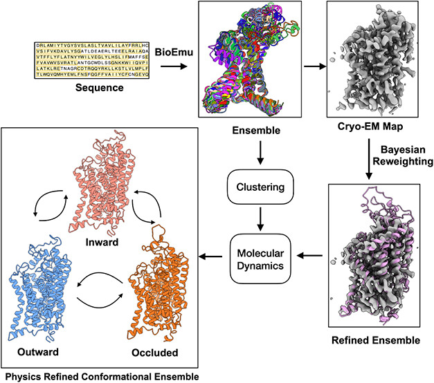
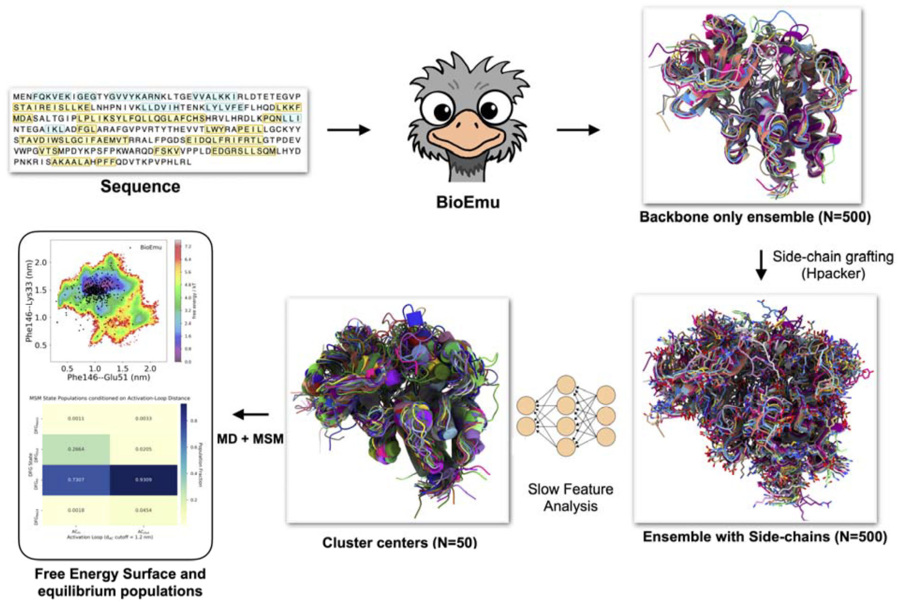
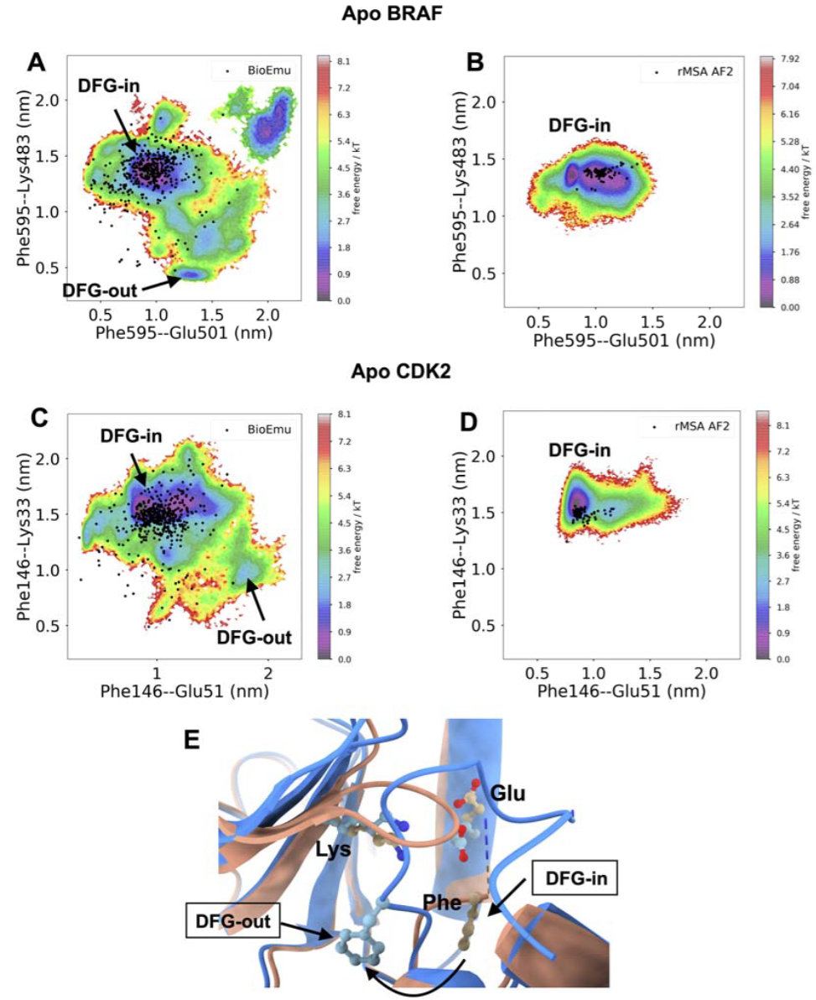
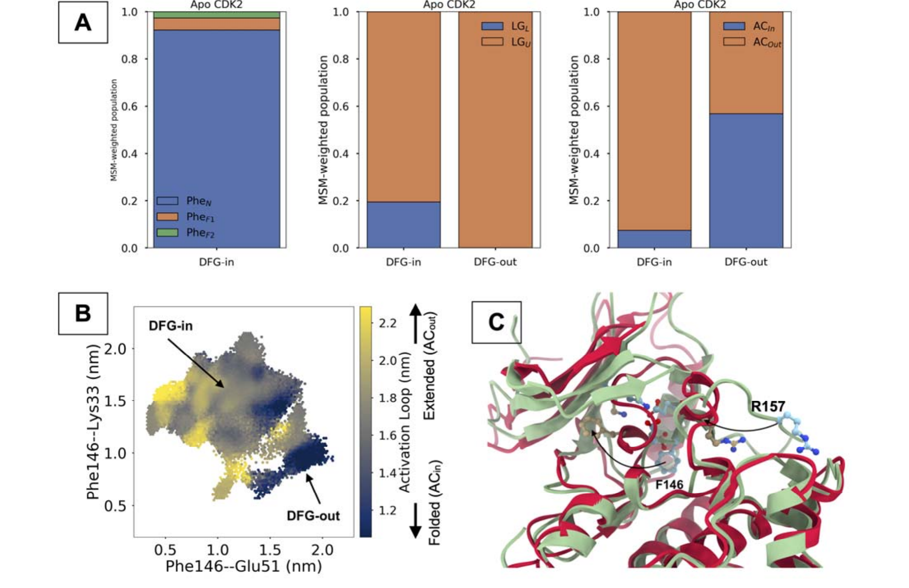
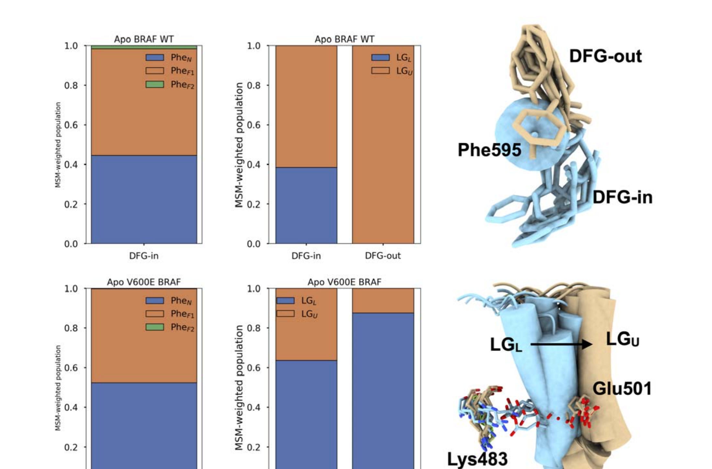
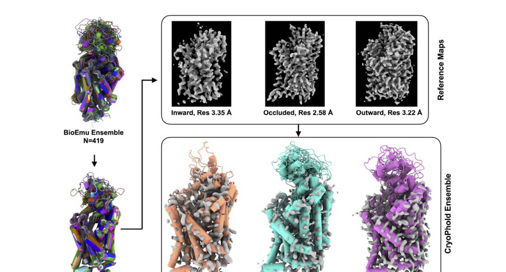
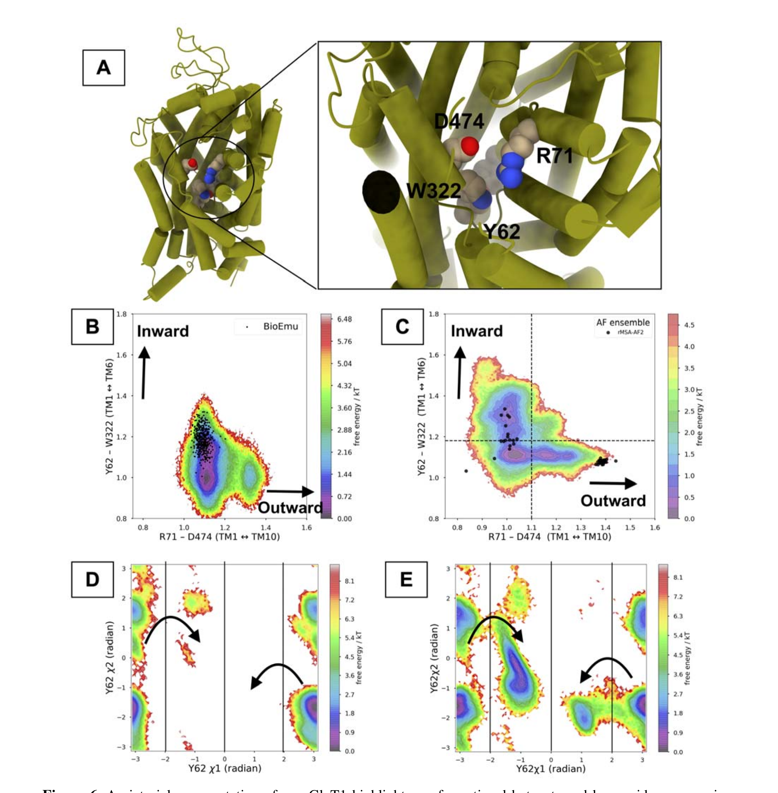
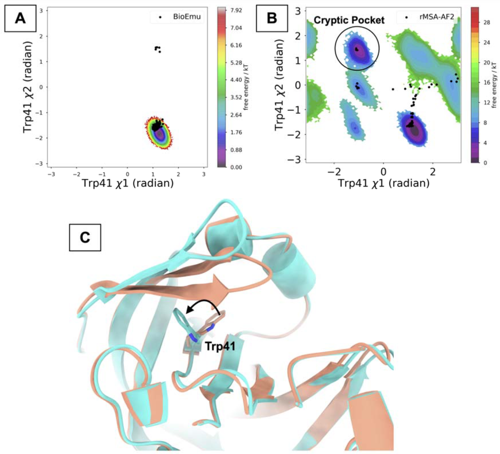

# BioEmu能把蛋白动力学采样推多远？激酶成功，转运体与隐蔽口袋暴露边界

## 本文信息

- **标题**：Accelerated sampling of protein dynamics using BioEmu augmented molecular simulation
- **作者**：Soumendranath Bhakat，Eva-Maria Strauch
- **发表时间**：2026年6月10日（J. Chem. Inf. Model.）
- **单位**：AlloTec Bio Inc.（美国密苏里州圣路易斯）；Washington University in St. Louis School of Medicine, Division of Infectious Diseases（美国密苏里州圣路易斯）
- **DOI**：https://doi.org/10.1021/acs.jcim.6c01000
- **引用格式**（不加粗）：Bhakat, S., & Strauch, E.-M. (2026). Accelerated sampling of protein dynamics using BioEmu augmented molecular simulation. *J. Chem. Inf. Model.*, *66*(17), 7168–7178. https://doi.org/10.1021/acs.jcim.6c01000
- **源代码与相关工具**：
  - BioEmu：https://github.com/microsoft/bioemu
  - H-packer：https://github.com/gvisani/hpacker
  - CryoPhold：https://github.com/strauchlab/cryoPhold
  - MDML：https://github.com/svats73/mdml/tree/main

**摘要图：BioEmu 增强分子模拟的工作流概览**。生成式 AI（BioEmu）产生多样化的骨架构象，经侧链补全、慢特征分析与聚类后，选取代表性结构启动短程无偏MD，最后通过MSM恢复玻尔兹曼加权的构象分布。同时，BioEmu 系综也可与 Cryo-EM 贝叶斯重加权（CryoPhold）结合，构建实验约束的全原子系综。

## 摘要

> 这篇论文提出了一条把**生成式AI构象生成**、**无偏分子动力学模拟**和**马尔可夫状态模型**串起来的工作流。作者先用 BioEmu 生成蛋白质骨架构象，再补全侧链、做慢特征分析与聚类，最后从代表性结构出发跑多条短程 MD，并用 MSM 恢复**符合玻尔兹曼权重的构象分布**。在 CDK2 与 BRAF 这类丝氨酸、苏氨酸激酶上，这条路线确实能捕获 DFGin 到 DFGout 的稀有转变，还能解析 V600E 突变诱导的群体迁移。更进一步，作者把 BioEmu 与 Cryo-EM 重加权结合，用于构建 GlyT1 的全原子构象系综。不过，论文同样强调了一点：**BioEmu 并不是普适的动力学万能钥匙**。在 GlyT1 与 PlmII 这类强依赖侧链构象异质性的体系里，BioEmu 派生的初始系综并没有覆盖足够广的功能相关状态，后续 MD 也就难以“凭空补回来”。

### 核心结论

- **BioEmu 加短程 MD**在激酶体系里确实有效，能用**累计 5 μs 的模拟捕获 DFGin 到 DFGout 转变**，而对照的 rMSA-AF2 路线即使做到 8 μs 仍主要困在 DFGin。rMSA-AF2 仍然更受初始结构“覆盖率”的限制，而 BioEmu 给出的起始构象分布更开阔
- 这套方法不只找到“终态”，还能够解析**中间态、亚态和相对群体**，例如 CDK2 激活环折叠、伸展状态与 BRAF 的 DFG-Phe 旋转异构体分布。需要注意的是，原文对 PheN 和 PheF1 的 $\chi_1$ 标注前后并不完全一致，因此这里不再硬性对应具体角度，而是保留“不同 DFG-Phe 亚态及其相对权重”这一层结论
- 对 V600E BRAF，方法成功恢复了**突变诱导的群体转移**，包括 DFG-Phe 旋转异构体分布的重新分配，以及 αC 螺旋向更活性样构象偏移。文中的定量结果显示，V600E 会让 DFGin 宏观态内各亚态的群体比例发生明显变化，αC 螺旋的“in”状态（LGL）群体也随之增加
- 把 BioEmu 与 Cryo-EM 贝叶斯重加权结合后，可以得到 GlyT1 的全原子先验系综，但采样仍然不完整，尤其是 inward 态与 Y62 翻转。关键缺陷在于：BioEmu v1.0 只显式生成骨架，侧链通过 H-packer 后补，因此**很难完整覆盖 Y62 的 $\chi_1/\chi_2$ 二面角分布**，而这个残基的翻转又是从 occluded 向 inward 态转变的必要条件。这里真正暴露出来的是方法边界：**当动力学高度依赖侧链异质性时，只有骨架多样性往往不够**，BioEmu v1.0 的优势会明显下降。

## 背景

蛋白质功能往往不是由单一静态结构决定的，而是由多个**亚稳态之间的相对群体与相互转化**共同决定。对药物研发来说，这一点尤其关键，因为变构口袋开放、激活环重排、跨膜转运开关、蛋白—蛋白相互作用界面暴露，很多都属于**低概率但功能关键的稀有事件**。这些构象转变直接调控蛋白的功能状态、配体结合亲和性和信号传导效率，因此理解蛋白的动力学景观对于精准药物设计至关重要。

传统无偏 MD 最大的问题是时间尺度。很多功能相关转变隔着很高的自由能垒，常规模拟在可接受的算力预算内根本跨不过去。增强采样方法虽然被开发出来应对这一限制，但主要分为两类：**沿着预定义集体变量施加偏置**的方法（如伞形采样、metadynamics）和**全局修改势能面**的方法（如温度加速、副本交换）。这些方法虽然强大，但存在关键缺陷：它们高度依赖对反应坐标的先验知识，而且得到的群体分布不是内在物理的，需要仔细的重新加权才能恢复无偏热力学。

近年来，基于 AlphaFold2 的方法（如 AF2-RAVE、AF2-MSM 和 CryoPhold）通过**减少多序列比对**来诱导构象多样性。rMSA-AF2 的核心思想是生成异质性的初始结构来启动下游的无偏 MD 模拟，从而加速构象探索。然而，这些方法的物理精修系综仍然**强烈依赖于初始系综的“覆盖率”**——如果初始覆盖没有捕捉到有意义的多样性，后续短 MD 模拟很难显著改善采样。

这几年生成式 AI 进入分子模拟领域后，一个自然的问题是：能不能让 AI 先把构象空间“撒开”，再由物理模拟去恢复真实分布？BioEmu 走的是另一条路：它不是扰动静态结构预测器的输入，而是在分子动力学模拟数据上微调的生成式扩散模型，训练目标是重现统计上独立的平衡结构分布。这使得 BioEmu 相比 rMSA-AF2 能够实现**更广的构象空间覆盖**。不过，BioEmu 生成的系综本身并不直接给出可信的状态群体，因此仍然需要结合物理模拟和 MSM 来恢复热力学意义。

这篇文章的思路正是如此。不过作者没有把 BioEmu 包装成万能替代品，而是很认真地比较了它在不同体系中的表现，最后给出的结论是：**它在某些问题上很强，但也有非常具体、非常物理的失效场景**。

## 研究方法

**图1：BioEmu 种子分子模拟的整体工作流**。整条路线可以概括为：**先用生成式 AI 扩大初始构象覆盖，再用物理模拟和统计力学恢复热力学意义**。下面按三个层次来看。

### 第一层：构象生成与降维

工作流从**蛋白质序列**开始，BioEmu v1.0 首先生成约 **500** 个仅含骨架的单体构象。这些构象不是简单的随机采样，而是基于分子动力学训练数据的扩散模型输出，因此天然包含了平衡态的构象多样性。随后，H-packer 负责补全侧链，把骨架系综转换成**全原子表示**。

为了从500个构象中挑选出最具代表性的结构用于后续模拟，作者对 Cα–Cα 距离做**慢特征分析**（Slow Feature Analysis，SFA）。

SFA 是一种无监督降维算法，目标是找到**变化最慢的特征方向**，这些方向通常对应于系统最缓慢、最功能相关的集体运动。数学上，SFA 通过优化目标函数 $\min \Delta(\Omega(z)) = \mathbb{E}[(\dot{z})^2]$ 来提取慢特征，其中 $z$ 是提取的特征，$\dot{z}$ 是其时间导数。作者在前两个慢特征上进行 K-means 聚类（$K=50$），得到 **50** 个聚类中心。SFA 与聚类使用的是 **MDML** 软件包。

对 GlyT1，作者再把这 **50** 个聚类中心作为 CryoPhold 的先验，用于针对三张 Cryo-EM 图的贝叶斯重加权。**CryoPhold** 是一个结合 AlphaFold2 与 Cryo-EM 数据的框架，通过**贝叶斯重加权**将生成式 AI 输出的构象系综与实验密度图对齐，从而得到既符合物理原理又与实验一致的构象分布。

### 第二层：物理模拟与参数设置

这 **50** 个代表性结构分别启动 **100 ns** 无偏 MD，总计 **5 μs**。分子模拟的具体参数设置如下：

- 使用 **Amber2022** 中的 `tleap` 进行体系准备，蛋白力场是 **AMBER ff14SB**，水模型是 **TIP3P**
- 使用截角八面体水盒，蛋白到盒边界最小缓冲为 **10 Å**
- 先做受限最小化，再做全体系无约束最小化
- Amber 拓扑通过 **ACPYPE** 转到 GROMACS 格式，后续模拟在 **GROMACS 2022** 中进行
- 体系从 **0 K 升温到 300 K**，先进行 **500 ps NVT** 升温，再进行 **200 ps NPT** 平衡
- 生产模拟为无偏 100 ns，轨迹每 10 ps 保存一次
- 温控采用 velocity-rescale thermostat，压强控制采用 Parrinello–Rahman barostat
- 非键相互作用截断为 **1.0 nm**，长程静电采用 `PME`，含氢键长通过 `LINCS` 约束

### 第三层：统计力学分析

所有轨迹最后交给 MSM 统一整合，输出**自由能面、宏观态群体和亚态分布**。MSM 使用 `PyEMMA` 构建，激酶体系使用图2中的两个距离来区分 DFG 态，GlyT1 则使用能区分 inward、outward、occluded 的距离变量来建模。

> BioEmu 提供了**结构覆盖的广度**，而 MSM 则通过统计力学分析赋予这些结构**物理意义**，计算每个状态的热力学权重和动力学连通性。

如果只看 BioEmu 本身，它给出的是构象多样性，而不是严格的平衡分布。作者因此没有直接把 BioEmu 输出当答案，而是把它当作**更聪明的初始构象提案器**。

后续的全原子 MD 提供局部物理松弛和能量精修，MSM 则通过构建转移概率矩阵，将多条短程轨迹整合成**符合玻尔兹曼统计的群体分布与自由能面**。具体而言，MSM 通过特征值分解得到长时间尺度的平衡分布，从而预测每个宏观态和亚态的相对群体。

这一点也解释了为什么作者坚持用对照组。文章不是简单展示“BioEmu 能采到什么”，而是要比较：**同样是短程无偏 MD，不同初始构象覆盖到底能把结果拉开多大差距**。

这种比较能够区分“方法本身的优势”和“初始条件的运气”。图1中的黑点投影直观展示了这一差异：BioEmu 的500个初始构象在两个慢特征坐标上的分布明显比 rMSA-AF2 的80个构象更分散，这为后续采样覆盖更广的构象空间奠定了基础。

> 这里最要紧的一点是，**BioEmu 的优势首先体现在起始构象分布更开阔**。后续无偏 MD 当然提供了局部松弛，但如果初始系综本身没有覆盖到相关区域，短程轨迹通常很难自己翻过高自由能垒。

从技术路线看，这篇工作的重点在于**把生成式构象采样、全原子 MD 和 MSM 顺畅接起来**，把结构多样性进一步落到可解释的热力学分布上。

## 研究结果

### 激酶测试：BioEmu 的最佳表现出现在 DFG 翻转问题上

**图2：MSM 加权自由能面解析 BRAF 与 CDK2 的 DFGin 到 DFGout 转变**

- A、C 是 BioEmu 种子模拟得到的自由能面，分别对应 apo BRAF 与 apo CDK2
- B、D 是 rMSA-AF2 增强 MD 的对照结果
- 黑点是初始构象系综投影，作者用它来直观看出**初始覆盖范围**
- E 给出了 DFGin 与 DFGout 的代表性结构，salmon 色对应 DFGin，cyan 色对应 DFGout，重点看的是 **DFG-Phe、Lys、Glu** 的相对位置变化

这组结果非常直观。BioEmu 种子模拟不只是跑出了更散的点云，而是真正在自由能面上覆盖到了**从 DFGin 到 DFGout 的过渡区域**。相比之下，rMSA-AF2 的初始系综和后续模拟几乎都局限在 DFGin 附近。

更直接的比较来自采样结果本身：**BioEmu 路线总模拟时间是 5 μs，对照路线是 8 μs，但后者仍没能真正跨出 DFGin 盆地**。这说明在这类问题上，初始构象覆盖确实比单纯延长短程模拟更重要。

### CDK2：不仅采到 DFGout，还采到了更细的活化相关异质性

**图3：BioEmu 增强模拟解析 apo CDK2 的 DFG-Phe、αC 螺旋与激活环亚态**

- A 是 DFGin 宏观态内不同 DFG-Phe 旋转异构体，以及 αC 螺旋 LGL／LGU 和激活环 ACin／ACout 的相对群体
- B 把激活环距离投影到 DFG 相关的两个距离坐标上，显示 **DFGout 更偏向折叠激活环**
- C 叠合了代表性 DFGin 与 DFGout 结构，突出显示**DFG-Phe 翻转与激活环折叠**

图2说明 BioEmu 能把体系带到新的盆地，图3进一步表明：**它还能解析盆地内部的细致异质性**。

**图3B：激活环的延伸-折叠转移**：图3B 将激活环距离（D145-CA–R157-CA）投影到区分 DFGin 和 DFGout 的两个距离坐标上。关键发现是：DFGout 态中折叠激活环（ACin）的群体明显高于 DFGin 态。这意味着**从 DFGin 到 DFGout 的转变伴随着激活环从延伸态（ACout）向折叠态（ACin）的转移**。激活环是激酶功能调控的核心区域，其折叠状态直接影响底物结合和催化活性。这种耦合变化揭示了激酶活性-非活性转变的层级化特征：DFG 基序的翻转与激活环的构象变化是协同发生的，共同构成了从活性样到非活性样构象转变的结构基础。

在 apo CDK2 里，作者不仅看到了 DFGin 与 DFGout 两个终态，还看到了 DFGin 内部的不同 DFG-Phe 亚态，以及 αC 螺旋与激活环的耦合变化。尤其是从 DFGin 到 DFGout 时，激活环从 ACout 向 ACin 转移，这正是**从更活性样构象走向更非活性样构象**的重要标志。

因此，BioEmu 的价值不只是“帮忙见到稀有终态”，还在于它能让后续 MSM 在更合理的初始覆盖上，恢复出**与功能转换相关的层级化构象景观**。

### V600E BRAF：群体转移而不是单一结构切换，才是更难也更有用的测试

**图4：V600E 突变如何把 BRAF 系综推向更活性样构象**

- 左侧柱状图比较野生型与 V600E 在 DFGin 宏观态内的 PheN、PheF1、PheF2 群体
- 中间柱状图比较 αC 螺旋在 LGL 与 LGU 两种构象下的群体变化
- 右侧结构示意图标出 Phe595、Lys483、Glu501，并用蓝色与米色展示更偏 DFGin／DFGout 或 LGL／LGU 的构象差异

在 DFGin 宏观态内部，**V600E 会重新分配 DFG-Phe 侧链旋转异构体的群体**，同时也让 αC 螺旋更偏向“in”状态，也就是 LGL。这里保留“群体重新分配”这一层结论，不再把单个亚态之间的对应关系写得过死。

这很重要，因为突变激活常常不是把蛋白从一个完全静止的构象“掰”到另一个，而是让整个系综在多个亚态之间**重新分配权重**。这篇文章的一个亮点就在于，它确实把这种“群体转移”用 MSM 权重给量化了出来，而不只是画一张构象示意图就结束。

### 把 Cryo-EM 和 BioEmu 接起来：GlyT1 是更接近真实应用场景的测试

**图5：BioEmu 先验系综经 CryoPhold贝叶斯重加权后，得到 GlyT1 的全原子构象集合**

- 左侧是原始 BioEmu 系综和 SFA 聚类后的 **50** 个代表性结构
- 右上是三张 Cryo-EM 参考图，对应 inward、occluded 与 outward 三种状态，分辨率分别约为 **3.35 Å**、**2.58 Å** 和 **3.22 Å**
- 右下是重加权后的全原子 CryoPhold 系综，橙色、青绿色、紫色分别对应 inward、occluded、outward

在 GlyT1 这部分，生成式先验、Cryo-EM 约束和后续 MD 被接到了一起。这里不是直接拿 BioEmu 输出做解释，而是先通过 Cryo-EM 参考图做贝叶斯重加权，得到**更接近实验的全原子后验系综**。

从方法设计上看，这一步把 **BioEmu 的广覆盖起点**、**Cryo-EM 的状态约束** 和 **CryoPhold 的重加权** 自然接了起来。

### 但问题也从这里开始：GlyT1 并没有被完全采开

**图6：在 GlyT1 上，BioEmu 系综的覆盖不足开始暴露出来**

- A 标出 GlyT1 的关键热点残基，尤其是 **Y62、W322、R71、D474**，它们共同定义了状态转变相关的局部几何
- B 是 BioEmu 种子模拟在 TM1–TM6 与 TM1–TM10 距离空间中的采样结果
- C 是 rMSA-AF2 种子模拟的对照，明显覆盖到更多 inward、occluded、outward 区域
- D、E 则比较了 Y62 的 $\chi_1/\chi_2$ 二面角采样，显示 BioEmu 路线对 **Y62 翻转 的覆盖明显不足**

图6 对应的结论很明确：**BioEmu 并不是在所有体系里都比 rMSA-AF2 更强**。

**GlyT1 的三种构象态定义**：GlyT1 是一种膜转运蛋白，通过交替访问机制将甘氨酸从细胞外间隙转运到细胞内。这个过程涉及三种主要的构象态：
- **Occluded（封闭态）**：底物结合位点被封闭，既不向细胞外开放，也不向细胞质开放，通常结合甘氨酸
- **Inward（向内态）**：底物结合位点向细胞质侧开放，允许甘氨酸释放到细胞内，通常结合抑制剂 ALX-5407
- **Outward（向外态）**：底物结合位点向细胞外间隙开放，允许甘氨酸结合，通常结合抑制剂 SSR-504734 和 PF-03463275

这三种态之间的转变依赖于跨膜螺旋（TM1、TM6、TM10）的大尺度重排，以及关键残基 Y62 的侧链翻转。Y62 就像一个“盖子”，它的翻转是从 occluded 向 inward 态转变的必要条件。

在 GlyT1 中，作者发现 CryoEmu 增强模拟虽然能较好采到 outward 与 occluded，但对 inward 态以及 Y62 翻转的恢复并不充分。这个结果和前面激酶体系的成功形成鲜明对比，也说明 GlyT1 的关键动力学更依赖**局部残基闸门与侧链重排**，而不只是主链骨架的大尺度移动。

也就是说，对某些跨膜转运体来说，单纯把骨架铺得更开并不够。真正控制状态切换的，可能是像 Y62 这样的局部“盖子”残基，而这恰恰是 BioEmu v1.0 不擅长的地方。

### PlmII：隐蔽口袋开启再次证明，侧链问题绕不过去

**图7：在 PlmII 的隐蔽口袋开启问题上，rMSA-AF2 反而明显优于 BioEmu**

- A 是 BioEmu 增强模拟得到的 Trp41 $\chi_1/\chi_2$ 自由能面，基本只覆盖主态
- B 是 rMSA-AF2 的对照结果，可以看到更多离散盆地，其中圈出的区域对应**隐蔽口袋开启相关状态**
- C 给出 Trp41 翻转的结构示意，说明这个侧链运动与口袋暴露直接相关

如果说 GlyT1 已经让人开始怀疑“骨架覆盖是否足够”，那 PlmII 几乎就是把这个问题钉死了。作者明确指出，PlmII 的隐蔽口袋开启依赖 **Trp41 侧链翻转**，而 BioEmu 生成的初始系综在这件事上的构象多样性太有限，所以后续 MD 也很难补救。一个核心区别是，**激酶 DFG 转变更多体现为主链与局部二级结构层面的构象重排**，而 GlyT1 的 Y62、PlmII 的 Trp41 都属于**关键侧链闸门残基**。BioEmu v1.0 只显式生成骨架，侧链是后补的，所以一旦功能动力学高度依赖侧链异质性，起始覆盖就会受限。

这一点也是全文里最重要的负面结论之一：**对由关键侧链翻转主导的构象开关，BioEmu v1.0 的瓶颈不在后续采样，而在起跑线就没有把相关侧链异质性准备好**。

### 这篇文章真正回答的问题：什么时候该用 BioEmu，什么时候要谨慎

综合激酶、GlyT1 和 PlmII 三类体系，这篇文章给出的不是一个简单的“好用／不好用”结论，而是一个更细的经验判断。**在 BRAF 和 CDK2 这类激酶上，BioEmu 的构象覆盖明显更广；但在 GlyT1 与 PlmII 上，rMSA-AF2 反而给出了更好的功能相关采样**。作者真正想说明的是：**初始系综的质量必须和问题类型匹配**。

更适合 BioEmu 的情形通常有这些特征：

- 关键转变主要表现为**骨架层面的宏观构象重排**
- 稀有态虽然难采，但可以由较广的主链分布触达
- 后续短程 MD 加 MSM 足以把这些状态重新赋予物理权重

相对不利的情形则包括：

- 关键动力学由**局部侧链翻转**控制
- 功能相关状态依赖少数残基构象的精细组合
- 起始系综如果没有覆盖这些局部侧链模式，后续无偏 MD 很难在短时间内补齐

这也是作者为什么会在摘要和讨论里都强调，BioEmu 更像是一个**很强的构象覆盖工具**，而不是自动恢复全部真实动力学的黑箱。

## 关键结论与批判性总结

### 这篇文章最重要的价值

这篇文章没有只展示 BioEmu 在激酶上的成功，而是把 GlyT1 和 PlmII 这两个边界案例也放了进来。这样一来，方法什么时候有效、什么时候要谨慎，就说得更清楚了。

### 主要优点

- **成功案例很有说服力**：BRAF 与 CDK2 的 DFG 转变确实被采
- 到了，而且对照组差距明显
- **不只看终态**：文章分析了中间态、亚态、群体分布和突变诱导的**群体转移**，信息密度很高
- **工作流具有可操作性**：BioEmu、H-packer、MDML、GROMACS、PyEMMA、CryoPhold 串起来后，路线相对明确
- **对失败模式有清楚归因**：作者把问题聚焦到**侧链异质性不足**，这个解释既具体又有物理直觉

### 局限性

- **BioEmu v1.0 不显式建模侧链**，这会直接限制对 Y62、Trp41 这类关键残基翻转的覆盖
- 当前流程**主要面向单体蛋白**，对蛋白—蛋白或蛋白—配体体系的适用性仍有限
- 虽然结果与已知机制一致，但很多系统仍缺少更直接的**实验定量验证**
- 成败在很大程度上取决于**初始系综是否覆盖到真正相关的局部自由度**，这意味着方法仍然需要系统特异性判断

### 对后续工作的启发

- **这项工作对药物发现最直接的启发**：如果目标体系的关键动力学主要由**骨架级别的大构象转变**主导，BioEmu 这类模型可以显著提高稀有态触达率；但如果问题核心是**局部侧链翻转、闸门残基摆动或隐蔽口袋开启**，就不能指望只靠骨架多样性解决问题，必须考虑更强的侧链建模或额外实验约束
- 如果未来的生成模型能更好处理**全原子级别的侧链异质性**，这条路线的适用范围会明显扩大
- 把 Cryo-EM、DEER、FRET 等实验信息与生成模型输出做更紧的耦合，可能是提高可靠性的关键方向
- 对于隐蔽口袋和局部闸门问题，后续方法很可能需要从“只学骨架”走向**同时学习骨架与关键侧链坐标**

总体来看，**BioEmu 确实能显著改善一类问题，但它的边界也把下一步最需要补的地方暴露了出来**。
