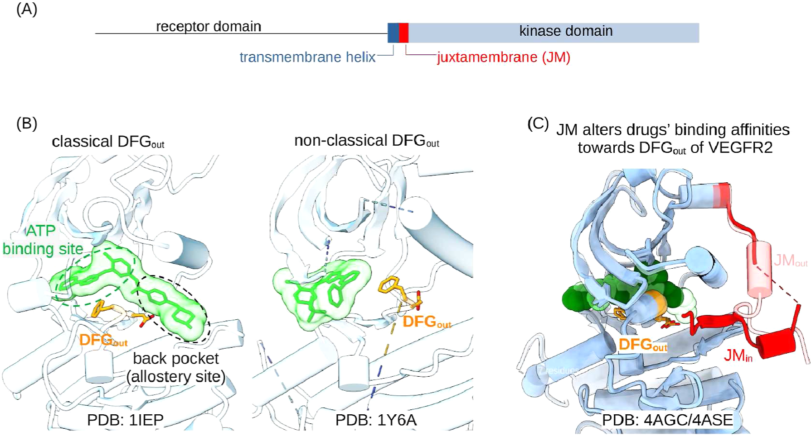
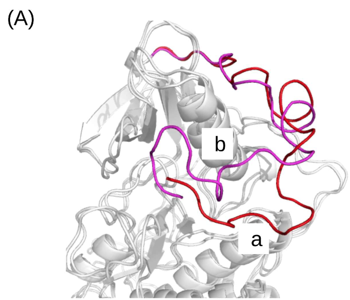

# 无序的JM基序通过动态效应促进RTKs中经典DFGout构象的形成

## 本文信息

- **标题**：受体酪氨酸激酶中的无序JM基序通过动态效应促进经典DFGout构象的形成
- **作者**：Xiaohui Chen, Hao Wang, Wenjian Li, Manjie Zhang, Bin Sun
- **发表期刊**：Journal of Chemical Information and Modeling
- **发表时间**：2026年（Received： November 4, 2025; Accepted: April 7, 2026）
- **DOI**：https://doi.org/10.1021/acs.jcim.5c02610
- **单位**：哈尔滨医科大学药学院医药信息研究中心
- **引用格式**：Chen, X.; Wang, H.; Li, W.; Zhang, M.; Sun, B. The Disordered JM Motif in RTKs Promotes Classical DFGout Conformation Formation via the Dynamic Effect. *J. Chem. Inf. Model.* 2026. https://doi.org/10.1021/acs.jcim.5c02610
- **代码与数据**：
  - MD轨迹：https://zenodo.org/records/19401175
  - 分析脚本：https://github.com/bsu233/bslab/tree/main/2025RTKs

---

## 摘要

> 受体酪氨酸激酶（RTKs）是经过验证的抗癌靶点，**靶向其DFGout构象是开发高选择性II型抑制剂的主流策略**。RTKs可以呈现多种DFGout构象，但只有形成完整后口袋（back pocket，也常称back cleft）的经典构象，才在结构上被验证能够稳定容纳II型抑制剂。然而，**实验解析的经典DFGout构象结构非常稀缺**，这给基于结构的选择性RTK抑制剂设计带来了重大障碍。最近有报道称，RTKs激酶结构域N端一个保守的无序基序——即近膜（juxtamembrane，JM）基序——能够调控抑制剂与VEGFR2（一种参与血管生成的RTK）的DFGout构象的结合。在本研究中，作者进行了广泛的MD模拟，以探索**无序JM基序对RTKs中DFG基序构象空间的影响**，并研究这种影响如何可能调控抑制剂与VEGFR2的结合。作者发现，在VEGFR2中，无序的JM具有高度动态性，与激酶结构域形成瞬态接触，精细调节DFGout亚构象空间，使群体从非经典DFGout构象向经典DFGout构象转移。**这一动态模型为已报道的JM基序对抑制剂与VEGFR2结合的调控效应提供了替代性的结构解释**。此外，作者还证明，在VEGFR2以外的其他RTKs中，无序的JM同样能够促进经典DFGout构象的形成。

### 核心结论

- **JM基序是内在无序的**：无论是分离状态还是与激酶结构域连接时，JM都高度动态，主要采取卷曲或弯曲构象，只与激酶结构域形成瞬态氢键接触
- **JM促进经典DFGout构象的形成**：在VEGFR2中，JM的存在使DFG采样从非经典DFGout区域向经典DFGout区域（后口袋完全形成）转移，并显著扩大了抑制剂结合口袋的体积
- **别构信号网络介导JM的调控作用**：JM通过分层网络传递动态变化——外围区域（如αC螺旋的N端）发生大幅动态改变，而核心区域则经历精细调整，最终实现对DFGout亚构象空间的微调
- **晶体结构中的JMin构象是热力学可及的亚稳态**：通过metadynamics模拟发现，JMin构象（与激酶结构域形成反平行β-折叠）是多个亚稳态之一，与全局最小自由能状态相差约8.0 kcal/mol
- **JM的作用在其他RTK中保守**：在PDGFRA、KIT、EPHA3、RET和ErbB4中，JM同样能够促进经典DFGout构象的形成，且这种效应依赖于初始DFG状态——当起始为DFGin时，JM不会诱导向DFGout的翻转

## 背景

### RTK抑制剂的选择性困境

受体酪氨酸激酶（RTKs）是跨膜信号转导的关键分子，其异常激活与多种癌症的发生发展密切相关。靶向RTK激酶结构域的小分子抑制剂是重要的抗癌药物。然而，**人类激酶组中有超过500种蛋白激酶，它们的ATP结合口袋高度保守**，导致ATP竞争性抑制剂（I型抑制剂）往往选择性差，容易产生脱靶副作用。因此，**提高抑制剂的选择性**是该领域的核心挑战之一。

**这一选择性问题的根源在于激酶的进化保守性**：ATP结合口袋在激酶家族中高度相似，因为它们都结合同一个底物——ATP。这意味着，**如果抑制剂只针对ATP口袋，就很难区分不同的激酶**。脱靶抑制不仅会降低疗效，还可能产生严重的副作用，因为抑制了非靶标激酶的正常功能。

### DFGout构象与II型抑制剂

激酶的活化环上有一个保守的DFG基序（Asp-Phe-Gly三联体）。根据天冬氨酸的侧链方向，激酶可以处于两种主要构象：

| 构象 | 侧链方向 | 状态与结构特征 |
| --- | --- | --- |
| DFGin | 天冬氨酸指向ATP结合位点 | 对应活性状态 |
| DFGout | 天冬氨酸翻出ATP结合位点 | 对应非活性状态，形成额外的后口袋（back pocket，也称back cleft），该区域在不同激酶之间具有较高结构多样性 |

**靶向DFGout构象的抑制剂被称为II型抑制剂**。由于后口袋的多样性，II型抑制剂通常比I型抑制剂具有更好的选择性。因此，**靶向DFGout构象已成为设计高选择性激酶抑制剂的主流策略**。

> II型抑制剂的选择性优势，本质上来自对后口袋（back pocket）差异的利用。

**图1：结构背景**。**A**：RTKs的结构域组成示意，强调JM位于跨膜段与激酶结构域之间，是潜在的远程调控节点。**B**：经典DFGout（如PDB 1IEP）与非经典DFGout（如PDB 1Y6A）对比。经典DFGout的后口袋完整，更利于II型抑制剂结合；非经典DFGout后口袋不完整，限制配体稳定占位。**C**：McTigue等提出的JMin/JMout模型，认为JM通过在两种构象间切换产生空间位阻来调控药物结合。

#### 问题：经典DFGout构象的结构稀缺

然而，DFGout构象本身也具有高度的构象多样性。Vijayan等人（2015）将DFGout构象分为两类：

| 类别 | 结构特征 | 抑制剂结合能力 |
| --- | --- | --- |
| 经典DFGout | 后口袋完全形成 | 能够稳定容纳II型抑制剂 |
| 非经典DFGout | 后口袋部分形成或缺失 | 无法有效结合II型抑制剂 |

根据激酶结构数据库KLIFS的统计，**在所有解析的激酶结构中，DFGin构象占83%以上，而DFGout构象不足10%**。其中，经典DFGout构象更是稀少**。这种结构信息的缺乏严重阻碍了基于结构的II型抑制剂设计**。

#### JM基序：一个被忽视的调控因子

近膜（juxtamembrane，JM）基序位于RTKs的跨膜螺旋与激酶结构域之间，由约40个或更多残基组成，**序列保守但结构上被认为是无序的**。McTigue等人（2012）的实验发现，**JM基序能够差异性地调控VEGFR2的DFGout构象与几种药物的结合亲和力**：阿西替尼（axitinib）、舒尼替尼（sunitinib）和帕唑帕尼（pazopanib）的亲和力受JM影响显著，而利尼法尼（linfanib）和索拉非尼（sorafenib）则几乎不受影响**。他们提出了一个“JMin/JMout”模型**，认为JM可以通过在两种构象之间切换来产生空间位阻，干扰药物结合。

但是，**这一静态模型存在明显的局限性**：无法解释为什么JM对某些药物有影响而对另一些没有；更重要的是，**它忽略了JM本身的无序本质**。JM到底是如何调控DFGout构象？其分子机制是什么？本文通过大规模分子动力学模拟回答了这些问题。

### 关键科学问题

- **JM调控药物亲和力的结构基础是什么**？McTigue等人报道JM对不同药物（如阿西替尼、舒尼替尼 vs 利尼法尼、索拉非尼）的结合亲和力有差异性影响，但这个效应背后的结构机制尚不清楚。JM是无序的，它如何在没有稳定结构的情况下产生差异化的调控效果？
- **JM在没有诱导DFGout→DFGin翻转的情况下，如何影响药物结合**？既然没有构象翻转发生，那么“JM通过构象变化影响药物”这条逻辑链路需要重新解释——药物结合口袋本身的性质（经典/非经典DFGout）可能是关键变量。
- **JMin构象是JM的主要存在形式，还是只是结晶条件下的亚稳态**？晶体结构（PDB 4AGC、4AGD）捕获了JMin——JM与激酶结构域形成反平行β-折叠的稳定构象。但在溶液条件下，JM是否主要处于这个状态？其热力学可及性如何？
- **JM与激酶结构域的瞬态接触如何传递到远端的DFG基序**？是否存在分层别构网络来解释这个远程效应？

### 创新点

- **改进静态模型，提出动态调控机制**：证明JM并非通过稳定的JMin构象产生空间位阻，而是通过瞬态接触和别构信号网络来精细调节DFGout亚构象空间
- **首次定量刻画JM对DFGout亚构象空间的“微调”效应**：JM不改变DFGin/DFGout的整体平衡（因为能垒高），而是将已处于DFGout状态的群体从非经典推向经典
- **结合常规MD与metadynamics，全面揭示JM的构象景观**：发现JMin只是多个亚稳态之一，并非全局最稳定状态，这解释了为什么晶体结构中能捕获到它但并非主要存在形式
- **跨RTK验证**：在五种不同RTK（PDGFRA、KIT、EPHA3、RET、ErbB4）中验证了JM对经典DFGout的促进作用，证明该机制具有保守性
- **提出JM包含型构建体对II型抑制剂筛选的重要性**：建议在计算模拟和实验筛选中使用包含JM的激酶构建体，以获得更真实的DFGout构象

---

## 研究内容

### 方法概览

#### 模拟系统设计

为了探究JM基序的作用，作者为每个RTK构建了两个系统：
- **含JM系统**：包含完整的JM基序和激酶结构域
- **不含JM系统**：仅包含激酶结构域（从JM与激酶结构域的连接点开始）

**起始结构来自PDB数据库中的晶体结构**（VEGFR2使用4AGC，其他RTK使用各自的PDB）**。对于缺失的残基，使用AlphaFold预测的结构进行修补**。

#### VEGFR2的模拟细节

- 力场：Amber ff99SB-ILDN，水模型TIP3P
- 离子浓度：150 mM NaCl，温度：300 K
- 模拟时长：含JM和不含JM各5 × 1 μs（5条独立轨迹，每条1 μs）
- 额外模拟：对分离的JM片段进行了500 ns MD；对JM与激酶结构域的相互作用进行了**1 μs well-tempered metadynamics**（使用PLUMED 2.8.2）

#### 其他五种RTK的模拟

| RTK | PDB | 起始构象 |
| --- | --- | --- |
| EPHA3 | 4TWO | DFGin |
| RET | 7DUA | DFGin |
| ErbB4 | 3BCE | DFGin |
| PDGFRA | 8PQJ | DFGout |
| KIT | 7ZW8 | DFGout |

模拟时长均为1.5 μs （1 + 0.5）

#### 关键分析方法

- **经典DFGout的定义**（Vijayan等人）：两个距离度量判定

| 参数与阈值 | 定义 |
| --- | --- |
| $d_1$ < 7.2 Å | HRDxxxxN基序中Asn的Cα与DFG中Phe的Cα之间的距离 |
| $d_2$ > 9.0 Å | αC螺旋中保守Glu的Cα与DFG-Phe的Cα之间的距离 |

- **差异接触网络分析**（dCNA）：**计算有无JM时残基-残基接触概率的变化**，使用Girvan-Newman算法将蛋白划分为功能社区（community），量化社区间的信号传导变化。**dCNA方法的具体流程**：
  1. **接触定义**：如果任意两个非氢原子之间的距离 ≤ 4.5 Å，则认为这两个残基之间形成了一次**接触**
  2. **接触概率计算**：对**每一个残基对**（如残基i和残基j），统计MD轨迹中它们形成接触的时间占比，得到接触概率P。例如残基对（i，j）在含JM系统中的接触概率P含JM = 0.95，表示95%的模拟时间这两个残基处于接触状态
  3. **构建共识网络**：只保留在**两个系统中形成概率都大于0.9**的接触，确保比较基线一致
  4. **社区划分**：应用Girvan-Newman算法自动将蛋白划分为功能社区，基于边介数逐步删除**桥梁边**来分离社区
  5. **差异网络构建**：对**每一个残基对**，计算两个系统间接触概率的差值ΔP = P含JM - P不含JM。**只考虑非局部残基对**（序列间隔 > 3个残基），聚焦别构相关的非共价相互作用。ΔP为正表示接触增强，ΔP为负表示接触减弱，绝对值表示变化幅度
  6. **粗粒化映射**：将残基级别的ΔP映射到预定义的社区上，生成社区—社区差异网络。**图3B右图中的数字不是单个残基对的ΔP**，而是某两个社区之间所有相关残基对变化在社区层面的**净汇总强度**。原文方法部分明确说它量化的是**net changes in interactions between protein domains**，但没有再展开给出更细的归一化公式
- **结合口袋体积**：使用MDpocket工具测量

### 结果一：JM是内在无序的，与激酶结构域形成瞬态接触

作者验证了JM基序的无序本质：
- **PONDR预测**：分离的JM几乎完全无序
- **分离JM的MD模拟**（500 ns）：RMSD为**10.94 ± 1.61 Å（见图S3A）**，只有少数残基形成瞬时α-螺旋，大部分时间处于卷曲或弯曲构象（图2A）
- **与激酶结构域连接后**：RMSD仍然很高（**9.55 ± 2.75 Å；见图S3B**），表明动态特性得以保持

**图2B**显示氢键形成的时间演化：5条独立1 μs轨迹里，红线只是在不同时间点短暂出现又消失，说明JM和激酶结构域之间没有一个长期占优的固定接触面。聚类分析给出的也是多种彼此不同的构象簇，而不是一个单独稳定的结合态。

> JM不是“固定卡位”的结构元件，而是通过**高频瞬态接触**持续影响构象分布。

**图S4**把晶体中的JMin和溶液里的实际采样放到一起比较后，结论更明确。用于稳定晶体JMin的两对关键残基距离在常规MD模拟中的平均值见下表：

| 残基对 | 平均距离 ± 标准差（Å） | 氢键阈值（Å） | 是否形成氢键 |
| --- | --- | --- | --- |
| Y801–L1049 | 22.84 ± 7.36 | 约3.5 | 否 |
| V805–I1025 | 13.70 ± 7.53 | 约3.5 | 否 |

这两个距离都远大于氢键形成的阈值，说明在溶液条件下这些氢键并未形成并维持稳定。因此，**JMin是可及亚稳态，不是默认主态**。它可以在晶体条件下被捕获，但不代表它在动态环境中长期占优。

**图2：JM促进VEGFR2中经典DFGout构象的形成**。**A**：PONDR无序预测和MD二级结构结果，显示JM整体以无序卷曲态为主，仅有短暂二级结构片段。**B**：5条1 μs轨迹中的JM-激酶氢键时间演化。红线为氢键存在，呈反复出现和消失，说明以瞬态接触为主。**C**：经典DFGout判据（$d_1$、$d_2$）与构象投影。黑色星号为起始结构；含JM体系的采样更集中在经典区域。**D**：有无JM时结合口袋体积对比。含JM体系整体右移，提示可成药后口袋更容易形成。

### 结果二：JM将DFGout亚构象空间从非经典推向经典

**图2C**将构象投影到 $d_1-d_2$ 平面：
- **无论有无JM，DFG都未发生向DFGin的翻转**（即没有进入$d_1 \lt 7.2$且$d_2 \lt 9.0$的区域）。这与文献中报道的**DFGin/DFGout转变能垒约10 kcal/mol**一致，在10 μs的总采样时间内无法跨越
- **但是，在DFGout区域内，JM显著改变了子状态的分布**：不含JM时，采样点散布在经典区域（$d_1 \lt 7.2$且$d_2 \gt 9.0$，浅绿色背景）和非经典区域（其他区域）之间；而含JM时，采样点明显向经典区域集中

**图2D**显示含JM系统的结合口袋体积分布整体右移，说明后口袋更容易维持开放。为了验证这一结果并非单一指标的偶然波动，作者分析了溶剂可及表面积（SASA，图S6A），结果显示SASA也呈现同向增大趋势，两个独立的度量指标共同指向同一个结论。综合起来，JM的作用更像是**提高“可被II型抑制剂利用的经典DFGout亚构象”的占比**，而不是直接制造一个新的翻转事件。

### 结果三：分层别构网络介导JM的调控作用

**图3A左图**展示了激酶结构域每个残基的RMSF（均方根波动），蓝线为含JM，红线为不含JM，阴影表示5条独立轨迹的标准差。**图3A右图**则把每个残基的$|\Delta \mathrm{RMSF}|$映射回结构。作者识别出四个动态变化显著的片段，并根据空间位置分为两类：**邻近JM的区域**和**远离JM的区域**。整体模式是**外围变化更大，核心变化更小**。

- **邻近区域**（靠近JM锚点834位残基）变化大：包括**αC螺旋的N端片段**（残基876-877）、**两个C端环**（975-986和1061-1063），这些区域在JM存在下RMSF变化幅度大
- **远端区域**（远离JM界面）也有变化：如C端叶的一个片段（947-950），提示存在别构效应
- **ATP结合位点周围的核心区域**动态变化非常微小

为了量化这种别构通信，作者使用了**差异接触网络分析**。该方法先在残基层面计算有无JM时接触概率的变化，再把这些变化映射到**9个功能社区**上，得到社区层面的差异网络。

> dCNA方法的核心思想是**将蛋白质残基网络划分为功能社区**，通过Girvan-Newman算法识别社区间的关键连接，从而量化信号传导路径。Girvan-Newman算法基于**边介数**——介数越高的边越可能是社区间的“桥梁”，删除这些边可以逐步分离社区结构。

**图3B左图**是残基层面的差异接触网络：**蓝线表示含JM后接触增强，红线表示接触减弱，线宽表示变化幅度**。**图3B中图**给出了用于粗粒化分析的9个功能社区。**图3B右图**则把残基层面的ΔP进一步汇总成社区—社区之间的净信号变化强度；节点大小对应社区规模，连线颜色仍表示增强或减弱，旁边的数字就是社区层面的净变化值。

这9个功能社区是根据蛋白结构域组织自动划分的，主要包括：
- **N叶相关社区**：N端β-折叠（蓝色节点）、αC螺旋（红色节点）等
- **C叶相关社区**：活化环、C端环等结构单元
- **连接节点**：一个连接N叶和C叶的核心节点（深灰色节点）
- JM：棕色球体代表其质心分布
- 其他功能区域：如ATP结合位点周围的社区等

图3B右图量化了社区间信号变化的强度。主要发现：
- **JM（棕色球体代表其质心分布）主要破坏了N端β-折叠、αC螺旋以及核心节点之间的接触**
- **核心节点通过更多连接与其他节点耦合**，但每一条社区连接上的净变化值通常较小；而**外围节点虽然连接较少**，单条连接上的净变化幅度却更大

这形成了一个**分层网络结构**：外围区域（如αC螺旋N端）承受大幅动态变化，但经过核心节点的缓冲后，传到DFG基序时变成了小幅、可定向的精细调节。这种结构使得JM能够将外围的大幅动态变化转化为对DFGout亚构象空间的精细调节。

**图3：VEGFR2激酶结构域内的别构信号网络**。

- **A左**：含JM和不含JM时的残基RMSF曲线，阴影为5条独立轨迹的标准差；**A右**：每个残基的$|\Delta \mathrm{RMSF}|$结构映射，标出了三个邻近JM的片段（876-877、975-986、1061-1063）和一个远端片段（947-950）。
- **B左**：残基层面的dCNA差异接触网络，**蓝线为接触增强，红线为接触减弱，线宽表示变化幅度**；
- **B中**：9个功能社区的划分；**B右**：社区—社区之间的净信号变化强度，旁边数字为社区层面的净变化值，棕色球体为MD中采样到的JM质心分布。
- **C左**：R-spine四个疏水残基在结构中的位置；**C中**：用于度量R-spine笔直程度的角度定义与代表性构象；**C右**：该角度分布的统计结果。含JM时R-spine平均角度更小，说明其更偏向经典DFGout相关构象。

作者还检查了**R-spine的笔直程度**（图3C。R-spine是一组保守的四残基疏水脊，其中包含DFG中的苯丙氨酸）。**JM的存在使R-spine更不笔直**，这与经典DFGout构象相符。**αC螺旋也表现出类似的微调效应**：在不含JM时，αC主要停留在典型的αC-in状态；而含JM时，其构象分布更宽，出现了部分αC-dilated中间状态（图S6B）。

> 这些数据进一步支持**JM的作用是精细调节DFGout亚构象空间，而非诱导构象翻转**。这里的别构传播更像“分层缓冲”：外围波动很大，但传到核心后变成**小幅、可定向的构象偏置**。

### 结果四：晶体结构中的JMin构象是热力学可及的亚稳态

既然常规MD显示JM与激酶结构域之间主要形成瞬态接触，而晶体结构4AGC中却捕捉到了一个稳定的JMin构象（**JM与激酶结构域形成反平行β-折叠**，通过Y801-L1049和V805-I1025氢键稳定）。

如何调和这一矛盾？作者进行了**1 μs的well-tempered metadynamics模拟**：

- **反应坐标**：以**R1（Y801-L1049距离）和R2（V805-I1025的平均距离）**为集体变量，全面采样JM的构象空间
- **自由能景观**（图4B）：识别出至少四个亚稳态，见下表

| 亚稳态 | 结构特征 | 相对state a的自由能（kcal/mol） |
| --- | --- | --- |
| a | 晶体JMin样构象（PDB 4AGC），与激酶结构域形成反平行β-折叠 | 作为对照态展示 |
| b | 与激酶结构域接触，N端区域（残基801-815）显著重排 | 未报告 |
| c | **全局最低自由能状态**，与激酶结构域接触 | -8.0 kcal/mol |
| d | 游离在溶剂中，不与激酶结构域接触 | 未报告 |

**图4：JM的构象空间**。**A**：PDB 4AGC中的JMin构象，Y801-L1049和V805-I1025两对相互作用用于定义反应坐标R1、R2.**B**：metadynamics自由能景观，识别出a、b、c、d四个亚稳态。a与晶体JMin重叠，但全局最低自由能盆地为c，说明JMin可及但并非主导态。

**状态a和状态b的主要差异集中在JM的N端区域**（残基801-815），该区域在两者之间经历了显著的构象重排（**图S9**）。

**图S9：state a与state b的构象对比**。显示两个亚稳态中JM片段的结构叠加，主要差异集中在N端区域（残基801-815），该区域在两者之间经历了显著的骨架重排和空间位置变化。

> 状态a与全局最稳态（状态c）的自由能差约**8.0 kcal/mol**，说明：**JMin构象是JM在热力学上可及的一个亚稳态，但并非最稳定的状态**。在晶体生长条件下，分子堆积或配体结合可能将其稳定化并捕获；而在溶液动态环境中，JM更倾向于采样其他构象。

### 结果五：JM在其他RTK中保守地促进经典DFGout构象

为了检验JM的调控作用是否具有普遍性，作者选择了五种RTK：**EPHA3、RET、ErbB4、PDGFRA和KIT**。它们的JM序列高度保守（图5A），晶体结构显示其中三个（EPHA3、RET、ErbB4）起始于DFGin构象，两个（PDGFRA、KIT）起始于DFGout构象（图5B）。

对于每个RTK，作者进行了**1.5 μs（1 μs + 0.5 μs两个重复）的MD模拟**，比较含JM和不含JM系统的DFG构象采样（图5C、5D）。结果清晰地显示：

- **当起始构象为DFGout时**（PDGFRA和KIT）：JM的存在使采样向经典DFGout区域（浅绿色背景）集中，与VEGFR2中的效应一致
- **当起始构象为DFGin时**（EPHA3、RET、ErbB4）：**JM虽然影响了DFG的构象采样，但并未诱导DFGin向DFGout的翻转**——采样点仍然主要停留在DFGin区域

> 这一结果进一步支持了作者的结论：**JM的效应是“微调”而非“开关”**。它的能量影响（在几kcal/mol量级）足以在DFGout亚构象空间内重新分布群体，但**不足以克服DFGin/DFGout之间约10 kcal/mol的能垒**。

**图5：JM对其他五种RTK中DFG构象空间的影响**。**A**：EPHA3、RET、ErbB4、PDGFRA、KIT的JM序列保守性。**B**：五种RTK的起始晶体构象，上排ErbB4、EPHA3、RET起始于DFGin，下排PDGFRA、KIT起始于DFGout。**C**：三种起始于DFGin的RTK在$d_1-d_2$平面的投影，左列为不含JM，右列为含JM。**D**：两种起始于DFGout的RTK在$d_1-d_2$平面的投影，左列为不含JM，右列为含JM。浅绿色区域对应经典DFGout构象。

### 讨论

#### 从静态空间位阻到动态构象微调

McTigue等人（2012）基于晶体结构提出了一个“JMin/JMout”模型：当JM处于JMin构象时，它会插入激酶结构域的裂隙中，与某些药物产生空间位阻，降低其结合亲和力。**这个模型虽然直观，但难以解释为什么JM对某些药物影响大而对另一些影响小**，也无法说明JM如何在不诱导DFGout→DFGin翻转的情况下改变药物结合。

本研究的动态模型提供了一个更合理的解释：**JM通过瞬态接触和别构网络，将DFGout亚构象空间的群体从非经典推向经典**。经典DFGout构象具有更开放、体积更大的后口袋，这可能会改变药物进入和结合的方式。不同药物的化学结构不同，它们对后口袋形状和体积的敏感性也不同——这恰好可以解释McTigue等人的实验结果：**某些药物（如阿西替尼）可能对后口袋的细微变化非常敏感**，因此JM的效应显著；**而另一些药物（如索拉非尼）可能对后口袋形状变化不敏感**，或者它们本来就偏好非经典DFGout构象。

#### 能量景观的层次结构

本研究揭示了一个重要的能量景观特征：DFGin与DFGout之间的能垒**明显高于**DFGout亚构象空间内不同子状态之间的能垒（约10 kcal/mol vs 几kcal/mol）。JM的瞬态相互作用提供的自由能扰动（约几kcal/mol）**足以在DFGout亚空间内重新分布群体**，但**不足以驱动**DFGin/DFGout翻转。这解释了为什么在10 μs的模拟中从未观察到构象翻转，但却清晰看到了经典DFGout群体的增加。

> 这一发现对II型抑制剂设计具有实用意义：**在计算模拟中使用包含JM的构建体，可以更真实地再现经典DFGout构象的分布**，提高虚拟筛选的准确性。同样，**在实验筛选中，使用包含JM的激酶构建体可能会得到与全长蛋白更接近的抑制活性数据**。

综合来看，本文的核心创新不在于给JM贴上一个新的静态标签，而在于把它重新定义为**会重分配DFGout亚构象群体的动态调控元件**。

## 总结

### 1. 逻辑拆解

- **小背景**：经典DFGout构象是II型抑制剂的关键靶点，但实验解析的结构极度稀缺，阻碍了选择性抑制剂的设计。
- **真问题**：JM基序被报道能调控抑制剂与VEGFR2的结合，但**其分子机制不清晰**——JM是无序的，它如何产生有意义的结构效应？经典的“JMin空间位阻”模型无法解释药物选择性的差异。
- **课题设计**：作者设想JM通过**瞬态接触和别构信号网络**，在DFGout亚构象空间内精细调节经典/非经典DFGout的比例，而非通过稳定构象产生空间位阻。
- **验证方法**：构建含/不含JM的体系进行对比MD模拟，使用dCNA分析别构网络，结合metadynamics探索能量景观，并在五种其他RTK中验证普适性。

### 2. 实验证据的成分分析与主要贡献

| 证据类型 | 具体内容 | 作用与主要贡献 |
| --- | --- | --- |
| **核心实验（骨架）** | VEGFR2含/不含JM的5 × 1 μs MD轨迹，$d_1-d_2$平面投影与口袋体积对比 | 直接证明JM将DFGout亚构象从非经典推向经典，无此数据则结论不成立。**定量刻画了JM对DFGout亚构象空间的微调效应**：证明JM将群体从非经典推向经典DFGout，而不诱导DFGin/DFGout翻转；**提出了实用的设计建议**：在II型抑制剂的虚拟筛选和实验筛选中应使用包含JM的激酶构建体 |
| **核心实验（骨架）** | metadynamics自由能景观，识别a/b/c/d四个亚稳态，JMin（态a）与全局最低（态c）差约8 kcal/mol | 定量揭示JMin是亚稳态而非主态，解释晶体结构的捕获现象。**揭示了JMin构象的热力学本质**：它是多个亚稳态之一，而非全局最稳定状态，自由能差约8.0 kcal/mol |
| **交叉印证（肌肉）** | 五种RTK（PDGFRA、KIT、EPHA3、RET、ErbB4）的对比模拟，证明JM效应保守且依赖于初始DFG状态 | 交叉闭合，提高结论普适性，降低单系统偶然性风险。**验证了JM效应的保守性**：在六种RTK（VEGFR2 + 五种其他）中均观察到相同趋势，且效应依赖于初始DFG状态 |
| **交叉印证（肌肉）** | 图S4关键距离分布、图S6 SASA与αC关键距离分布、图S9 a/b态结构对比 | 多角度支撑JM的无序本质和微调机制，证据链完整。**提出了JM调控DFGout构象的动态机制**：取代了之前的静态空间位阻模型，强调瞬态接触和别构信号网络的核心作用 |
| **求新炫技（首饰）** | Girvan-Newman算法划分的分层别构网络可视化（图3） | 增强机制解释的深度，非结论必需但显著提升论文层次感 |
| **展示工作量（体力活）** | 10条独立轨迹（5 + 5）、五种RTK各两条重复模拟、参数扫描（如口袋体积计算） | 证明采样充分性，防御审稿人”采样不足”的质疑 |

### 局限性

- 作者使用了Amber ff99SB-ILDN力场。该力场曾被报道对某些IDPs产生过度压缩的构象集合，但本研究的数据表明**它成功捕捉了JM的无序和动态特性**：**分离JM的RMSD高达10.9 Å**，与激酶结合后RMSD仍然很高；瞬态接触的形成与断裂；metadynamics显示的广阔低能采样区域。因此，当前结论受力场偏差影响较小。虽然ff99SB-ILDN在本系统中表现良好，但其对IDPs的描述并非完美。使用更现代的力场（如ff19SB或a99SB-disp）进行交叉验证会增强结论的可靠性
- **模拟时间尺度**：尽管累计10 μs的采样已经相当可观，但DFGin/DFGout翻转的能垒可能高于预期，更长时间的模拟或增强采样技术（如元动力学、自适应偏置力）可能有助于直接观察翻转事件
- **缺乏直接的抑制剂结合模拟**：本研究没有直接模拟抑制剂在有无JM时的结合过程，因此“JM通过改变DFGout亚构象空间来影响药物结合”这一推论仍有待直接验证。未来的对接或自由能计算可以填补这一空白
- **JM的长度和序列变异**：不同RTK的JM长度和序列存在差异，本研究选取的五种可能无法完全代表整个RTK家族。

