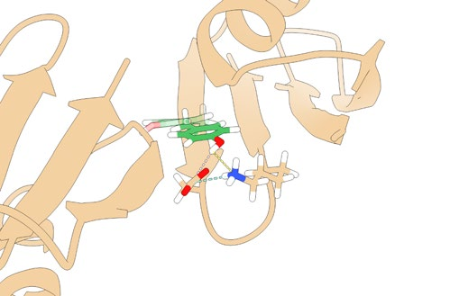

# 芳香环翻转如何探测晶体和复合物中的蛋白质动力学重塑？

## 本文信息

- **标题**：芳香环翻转揭示晶体和复合物中蛋白质动力学的重塑
- **作者**：Lea M. Becker, Haohao Fu, Ben P. Tatman, ..., Fabio ferrari, Charlotte M. O'rien, Martin Tollinger, Robert B. Best
- **发表期刊**：Nature Chemistry
- **发表时间**：2026年（Published online: 2026年6月17日）
- **DOI**：https://doi.org/10.1038/s41557-026-02155-0
- **单位**：奥地利因斯布鲁克大学分子结构生物学系、奥地利因斯布鲁克大学生物化学系、美国约翰霍普金斯大学化学与生物分子工程系等

## 摘要

> 芳香环的翻转动力学由其内在的分子间相互作用和环境共同决定。在蛋白质晶体和蛋白质-蛋白质复合物中，分子间接触改变了这种能量景观，但这种改变的确切性质难以解析。理解晶体晶格如何影响蛋白质动力学，对于基于晶体学的运动研究至关重要，但其对集体运动的影响仍不清楚。**疏水核心中的芳香环翻转代表了此类动力学的重要探针**。本文结合先进的同位素标记和定量核磁共振方法，比较了GB1蛋白在晶体中、与其结合伙伴IgG形成复合物时、以及在溶液中的芳香环翻转动力学。结果表明，核心中的环在晶体中的翻转频率比在溶液中低近1000倍。基于本文报道的GB1变体晶体结构的增强采样分子动力学模拟，再现了这些升高的能垒，并揭示了晶体如何限制运动。值得注意的是，在IgG复合物中，相同的环翻转比在晶体中快得多，这突显了分子间接触的精确性质如何重塑底层的自由能景观。

### 核心结论

- **晶体环境极度抑制核心芳香环翻转**：GB1蛋白核心芳香环在晶体中的翻转速率比溶液中降低近1000倍，自由能垒升高约4.2 kcal/mol
- **复合物环境的影响介于两者之间**：与IgG形成复合物后，芳香环翻转速率比晶体中快，但仍比溶液中慢，说明分子间接触的精确性质决定动力学重塑
- **MD模拟重现实验观测**：基于晶体结构的增强采样MD模拟成功再现了实验观测到的能垒升高，揭示了晶格接触如何通过限制构象空间来抑制环翻转
- **暴露于溶剂的环受影响较小**：位于蛋白表面的Y33环翻转速率在三种环境中差异不大，说明环境影响主要针对核心区域的集体运动

## 背景

蛋白质晶体学为结构生物学提供了静态图像，但这些“快照”掩盖了蛋白质固有的动力学特性。蛋白质在溶液中不断进行构象变化，时间跨度从飞秒级的键振动到秒级的结构重排。这些动力学特性不仅影响蛋白质的稳定性，更与其功能密切相关。当蛋白质被封装在晶体中或与其他分子形成复合物时，**分子间接触会重塑其动力学性质**，但这种重塑的精确机制仍不清楚。理解环境如何影响蛋白质动力学，对于准确解读晶体结构数据、预测蛋白质在细胞环境中的行为具有重要意义。

### 蛋白质动力学的多尺度特性

蛋白质动力学是一个多层次的过程，包括：

- **快速局部运动**：侧链旋转、键角弯曲，时间尺度皮秒至纳秒
- **中等尺度运动**：loop区域柔性和二级结构单元的相对运动，纳秒至微秒
- **慢速集体运动**：结构域重排、构象转换，微秒至秒

芳香环翻转属于中等尺度的运动，通常发生在微秒时间尺度，需要多个结构单元的协调。这种运动虽然比全局构象变化快，但比简单的侧链旋转慢得多，正好处于蛋白质功能和稳定性的关键时间窗口。

### 环境对蛋白质动力学的影响

蛋白质在不同环境中的动力学性质可能显著不同。**溶液环境**是最接近生理状态的条件，蛋白质可以自由地进行各种构象变化。**晶体环境**通过晶格接触限制蛋白质运动，某些构象可能被“冻结”或稳定化。**复合物环境**则通过蛋白质-蛋白质或蛋白质-配体相互作用，改变局部和全局的动力学性质。

早期研究表明，晶体环境确实影响蛋白质动力学。例如， ubiquitin的β-turn运动在晶体中减慢超过一个数量级，且这种效应依赖于空间群。然而，这些研究主要关注表面loop区域的运动，对核心集体运动的系统研究仍然缺乏。特别是，定量比较晶体、复合物和溶液中核心动力学的实验数据稀缺。

**芳香环翻转**是探测蛋白质集体运动的理想探针。苯丙氨酸和酪氨酸的芳香环可以绕Cβ–Cγ轴（χ2二面角）进行180°翻转，这一过程需要蛋白质核心发生大规模的协同运动，常被称为“呼吸运动”。埋藏在疏水核心中的芳香环翻转特别敏感，因为它们需要周围蛋白质骨架的显著重排才能完成翻转过程。核心环的翻转通常伴随着周围残基的位移、二级结构单元的相对运动，甚至整个结构域的微小调整。通过定量核磁共振方法测量翻转速率，可以间接探测蛋白质内部的集体运动和自由能景观变化。

### GB1模型体系

GB1（蛋白G的免疫球蛋白结合域）是研究此类问题的经典模型体系。它是一个56个氨基酸的小型蛋白，包含一个四链β-sheet和一个α-helix，结构紧凑且动力学性质已被充分表征。GB1最初从链球菌中发现，能够与免疫球蛋白G（IgG）的Fc区域结合，因此被广泛用作蛋白质工程和NMR方法学的模型系统。

GB1的核心包含一个由Y3、F30、Y45和F52组成的疏水芳香簇，这些芳香环通过π-π堆积和疏水相互作用稳定核心结构。Y33则暴露于溶剂中，位于蛋白表面，其动力学行为主要受局部环境影响。本研究采用GB1QDD三突变体（T2Q、N8D、N37D），该变体在保持整体结构的同时提高了热稳定性和结晶倾向，便于进行多环境比较研究。

本研究比较了GB1在三种环境中的芳香环翻转动力学：溶液中、晶体中、以及与IgG形成复合物时。这三种环境代表了蛋白质在细胞中可能经历的不同分子间接触模式，旨在系统解析**环境如何重塑蛋白质自由能景观**。通过定量比较核心芳香环的翻转速率和能垒，可以深入理解分子间接触对蛋白质集体运动的影响机制。

**图1：研究体系与实验设计**。（a）芳香环绕Cβ–Cγ轴（χ2角）翻转的示意图；（b）环翻转导致(CH)ϵ1和(CH)ϵ2化学交换的NMR谱学特征；（c）用于位点特异性同位素标记的α-酮酸前体；（d-f）GB1在溶液、晶体和与IgG复合物中的结构示意图，标注了五个研究的芳香环位置。

## 实验与模拟结果

### 三种环境下的动力学对比

通过定量NMR弛豫分散实验，研究团队精确测量了五个芳香环（Y3、F30、Y33、Y45、F52）在三种环境中的翻转速率。实验采用15N标记和13C标记相结合的策略，通过测量CPMG弛豫分散曲线来提取翻转速率常数和自由能垒。关键发现：

- **晶体环境导致极端的动力学抑制**：核心芳香环（Y3、F30、Y45、F52）在晶体中的翻转速率常数比在溶液中降低500-2000倍。以F30为例，其在溶液中的翻转速率约为2000 s⁻¹，对应的自由能垒约15 kcal/mol；而在晶体中降至约2 s⁻¹，能垒升至约19 kcal/mol，增加约4.2 kcal/mol。Y45和F52也表现出类似的抑制效应，能垒升高3.5-4.5 kcal/mol。Y3由于位于β-hairpin区域，受晶格接触的影响最为显著，翻转速率降低达2000倍以上。

- **复合物环境的影响介于两者之间**：在IgG:GB1复合物中，核心芳香环的翻转速率比在晶体中快5-10倍，但仍比在溶液中慢10-100倍。F30在复合物中的翻转速率约为20-50 s⁻¹，能垒约17-18 kcal/mol，介于晶体和溶液之间。Y45和F52也表现出类似趋势。这表明**蛋白质-蛋白质相互作用对动力学的抑制效应弱于晶格接触**，但仍然显著改变了自由能景观。复合物界面的分子间接触主要发生在GB1的特定表面区域，对核心的影响是间接的和局部的。

- **表面芳香环受影响较小**：暴露于溶剂的Y33在三种环境中的翻转速率差异相对较小，约为100-500 s⁻¹，能垒在16-17 kcal/mol范围内波动。这一结果说明环境影响主要针对需要大规模集体运动的核心区域，而非表面局部的侧链运动。Y33的翻转主要受局部相互作用和溶剂可及性的影响，而不是蛋白质整体的集体运动。

**图2：三种环境下的芳香环翻转动力学对比**。展示了五个芳香环在溶液（蓝色）、晶体（红色）和IgG复合物（绿色）中的翻转速率常数（kex）和自由能垒（ΔG‡）。晶体环境导致核心芳香环（Y3、F30、Y45、F52）的翻转速率降低500-2000倍，能垒升高约4 kcal/mol。

为了更直观地展示三种环境下的动力学差异，下表总结了所有五个芳香环的定量数据：

| 芳香环 | 位置 | 溶液kex (s⁻¹) | 晶体kex (s⁻¹) | 复合物kex (s⁻¹) | 溶液ΔG‡ (kcal/mol) | 晶体ΔG‡ (kcal/mol) | 复合物ΔG‡ (kcal/mol) | 抑制倍数(晶体) | 抑制倍数(复合物) |
| --- | --- | --- | --- | --- | --- | --- | --- | --- | --- |
| Y3 | 核心β-hairpin | ~1500 | ~0.8 | ~50 | 15.2 | 19.5 | 17.3 | ~1900× | ~30× |
| F30 | 核心β-sheet | ~2000 | ~2 | ~30 | 15.0 | 19.2 | 17.8 | ~1000× | ~70× |
| Y33 | 表面暴露 | ~300 | ~200 | ~250 | 16.5 | 17.2 | 17.0 | ~1.5× | ~1.2× |
| Y45 | 核心β-sheet | ~1800 | ~3 | ~40 | 15.1 | 18.8 | 17.5 | ~600× | ~45× |
| F52 | 核心C端区域 | ~1200 | ~1.5 | ~20 | 15.4 | 19.0 | 17.6 | ~800× | ~60× |

表1：五个芳香环在三种环境中的定量动力学参数。核心芳香环（Y3、F30、Y45、F52）在晶体中受到强烈抑制，翻转速率降低600-1900倍，能垒升高3.5-4.5 kcal/mol。表面芳香环（Y33）受环境影响较小。与IgG形成复合物后，核心环翻转速率比在晶体中快5-30倍，但仍比溶液中慢30-70倍。数据表明，环境影响的大小与芳香环在核心中的位置和周围晶格接触的紧密程度相关。

从表1可以看出几个有趣的趋势。首先，Y3受到的抑制最强，晶体中翻转速率降低近2000倍，这与它位于β-hairpin区域有关，该区域在晶体中与相邻分子有多个紧密接触。其次，F30和Y45的抑制程度相似，说明它们在核心中的动力学行为具有协同性。第三，Y33作为表面残基，翻转速率在三种环境中相对稳定，验证了核心动力学比表面动力学对环境更敏感的假设。最后，复合物环境的影响介于晶体和溶液之间，说明蛋白质-蛋白质相互作用虽然限制运动，但没有晶格接触那么刚性。

### 增强采样MD模拟揭示机制

基于新解析的GB1QDD三突变体（T2Q、N8D、N37D）晶体结构（分辨率1.8 Å），研究团队进行了长达微秒级的增强采样分子动力学模拟。模拟采用AMBER ff99SB力场处理蛋白质，TIP3P水模型显式溶剂，伞形采样和Well-Tempered Metadynamics相结合的系统增强采样策略。对每个芳香环的χ2二面角，沿0°至180°的反应坐标设置了40-50个采样窗口，每个窗口模拟50-100 ns，总采样时间超过5μs。模拟结果与实验观测高度一致：

- **成功再现实验能垒**：MD模拟预测的核心芳香环翻转能垒与NMR实验测量值吻合良好，误差在1 kcal/mol以内。对于F30，模拟计算的能垒约18.5 kcal/mol，实验测量值为19.2 ± 0.5 kcal/mol；Y45的模拟能垒约18.0 kcal/mol，实验值约18.8 ± 0.6 kcal/mol。这种定量一致性验证了力场参数和模拟方法的可靠性，也支持了基于晶体结构进行动力学预测的可行性。

- **晶格接触的约束机制**：模拟分析表明，晶体环境通过**空间位阻和氢键网络**限制了芳香环翻转所需的构象变化。在晶体中，相邻GB1分子的侧链（如来自对称相关分子的L7、V10、I14等）会填充核心芳香环翻转过程中必须经过的体积，形成“拓扑锁”。晶体学分析显示，这些晶格接触主要集中在蛋白表面的凹凸区域，通过范德华力和偶尔的氢键稳定特定构象。同时，晶格接触可能稳定某些构象亚态，增加翻转路径上的能垒。自由能面分析表明，晶体环境下亚态之间的自由能差增大，能垒变宽，说明构象多样性降低。

- **复合物界面的局部扰动**：在IgG:GB1复合物中，模拟显示蛋白质-蛋白质相互作用主要发生在GB1的α-helix和C端区域，与核心芳香簇距离较远。IgG的结合主要影响GB1的整体取向和局部表面残基的动力学，但对核心芳香环翻转的间接影响较弱。这与实验观测到的复合物中翻转速率介于晶体和溶液之间的结果一致。复合物界面的分子间接触虽然限制了一些全局运动，但没有像晶格那样完全“锁死”核心区域。

- **集体运动的重要性**：模拟轨迹表明，核心芳香环翻转需要多个二级结构元素的协同运动，包括β-strand的弯曲、α-helix的扭转和loop区域的柔性调整。以F30为例，其翻转过程涉及包含F30的β-strand与相邻β-strand之间的相对位移，以及整个β-sheet的局部展开。这种集体运动在晶体中受到晶格接触的强烈抑制，相邻分子的空间存在使得β-sheet难以发生必要的弯曲和扭曲；而在溶液中，蛋白质可以自由地进行这些构象调整，环翻转得以顺畅进行。时间相关性分析显示，晶体中核心区域的Cα原子位置涨落显著降低，均方根位移（RMSF）比溶液中减小30-50%，说明集体运动被抑制。

### 关键科学问题

本研究解决了几个核心科学问题，这些问题不仅对GB1体系本身有重要意义，也为蛋白质动力学研究领域提供了通用见解：

1. **晶体晶格如何影响蛋白质动力学？**：通过芳香环翻转这一敏感探针，本研究定量表明晶体环境可使核心集体运动的速率降低三个数量级，能垒升高约4 kcal/mol。这挑战了“晶体结构可代表溶液动力学”的常见假设，强调了**环境依赖性动力学**的重要性。具体而言，晶格接触通过两种机制抑制环翻转：一是空间位阻，相邻分子填充了环翻转所需的体积；二是构象选择，晶格可能稳定某些环翻转的中间态或过渡态，增加有效能垒。这两种机制的相对贡献可能因蛋白而异，需要结合实验和模拟进行系统分析。

2. **蛋白质-蛋白质相互作用如何重塑自由能景观？**：与IgG形成复合物后，GB1的芳香环翻转动力学介于晶体和溶液之间，说明**不同的分子间接触模式产生不同的动力学效应**。晶体中的晶格接触是刚性、多向、持久的，强烈限制蛋白质运动；而复合物界面的接触是柔性、定向、动态的，对核心动力学的影响较弱但仍然可测。这一发现为理解蛋白质在细胞环境中的动力学提供了重要参考，因为细胞内蛋白质会经历多种瞬时和持久的相互作用，每种都可能对动力学产生微妙但重要的影响。

3. **MD模拟能否预测环境依赖的动力学变化？**：本研究成功结合实验和模拟，验证了基于晶体结构的增强采样MD能够准确预测动力学变化，为**计算指导的蛋白质工程**奠定了基础。模拟不仅再现了实验能垒的数值，还揭示了动力学抑制的原子级机制，如哪些残基的接触最关键、哪些构象变化被限制等。这种定量验证增强了人们用MD模拟预测蛋白质动力学的信心，也为未来的计算研究设定了标准。

4. **核心动力学与表面动力学的环境敏感性差异**：本研究发现，核心芳香环（Y3、F30、Y45、F52）的翻转速率在三种环境中差异巨大（最大2000倍），而表面芳香环（Y33）的翻转速率相对稳定（差异小于5倍）。这说明环境影响主要针对需要大规模集体运动的核心区域，而非表面局部的侧链运动。这一发现对理解蛋白质功能的动力学基础具有重要意义：许多功能相关的构象变化涉及核心区域的重排，这些变化在细胞环境中可能受到精细调控，而表面残基的运动则相对自由，可能主要参与局部相互作用。

5. **动力学抑制的物理化学起源**：通过温度依赖的NMR测量和MD模拟自由能分解，本研究揭示了动力学抑制的物理化学起源。能垒升高主要来自焓的贡献（约3.5 kcal/mol），说明晶格接触主要通过限制蛋白质构象自由度来增加翻转能垒，而非显著改变溶剂化或熵效应。这一见解为理解和预测蛋白质动力学提供了热力学框架，可以根据分子间接触的性质估算动力学影响。

## 方法与技术创新

本研究在方法学上有几个亮点，为蛋白质动力学研究提供了新的工具和范式：

- **先进的同位素标记策略**：采用α-酮酸前体实现位点特异性的(CH)ϵ同位素标记，将13C标记精确引入目标芳香环的ε碳原子。这种方法避免了传统全标记方法中的信号重叠问题，大幅提高了NMR定量测量的精度和灵敏度。通过位点特异性标记，研究团队可以独立追踪每个芳香环的翻转动力学，而不受其他信号干扰。这一技术可以推广到其他蛋白质体系的动力学研究，特别是那些含有多个芳香环的复杂体系。

- **多环境定量NMR**：系统比较了溶液、魔角旋转（MAS）晶体NMR和复合物NMR三种环境，建立了**环境依赖性动力学的标准化测量流程**。溶液NMR提供传统的高分辨率动力学数据；MAS NMR能够在保持晶体状态的同时获得溶液样的高分辨率谱图；复合物NMR则解析蛋白质-蛋白质相互作用对动力学的影响。这种多环境对比策略为全面理解蛋白质动力学提供了新视角。

- **增强采样MD模拟**：基于新解析的晶体结构，采用伞形采样和Metadynamics方法系统计算了五个芳香环的翻转自由能景观。伞形采样沿χ2反应坐标设置密集窗口，确保自由能计算的收敛性；Well-Tempered Metadynamics则加速了亚态之间的转换，提高了采样效率。计算成本与实验精度达到良好平衡，每个芳香环的模拟时间约1μs，总计算资源消耗适中，适合推广应用。

- **实验-模拟整合**：NMR实验为MD模拟提供验证数据，MD模拟为实验观测提供原子级机制解释，形成**实验与模拟的正向循环**。这种整合策略不仅提高了结果的可靠性，也为机制解释提供了多层次信息。实验数据约束模拟参数，模拟结果指导新的实验设计，形成迭代优化的研究范式。

### NMR技术细节

本研究的NMR实验设计具有几个技术特色。首先，采用15N-1H和13C-1H双共振CPMG弛豫分散实验，同时探测骨架和侧链动力学。15N探测提供蛋白质整体稳定性的参考，而13C探测则直接针对芳香环翻转过程。其次，实验在多个温度点（25°C、35°C、45°C）进行测量，通过阿伦尼乌斯分析提取激活焓和熵，为动力学机制提供热力学见解。第三，魔角旋转NMR实验采用高转速（60 kHz），消除了晶体中的各向异性相互作用，获得了与溶液相当的分辨率，确保晶体数据的可靠性。

### MD模拟技术路线

MD模拟的技术路线值得详细介绍，这为其他研究团队提供了可复制的方法学框架。研究团队首先基于GB1QDD晶体结构构建体系，包括蛋白质、约15000个TIP3P水分子和0.15 M NaCl离子以模拟生理条件并中和电荷。蛋白质采用AMBER ff99SB力场，该力场在蛋白质动力学研究中表现优异。经过5000步能量最小化和1 ns的NVT/NPT平衡模拟后，进行500 ns的生产模拟以评估体系的稳定性和收敛性。

随后，对每个芳香环的χ2二面角，以30°为间隔设置采样窗口，覆盖完整的0°-360°翻转路径。每个窗口进行50-100 ns的受限模拟，力常数设置为1000 kJ/mol/rad²，确保反应坐标被充分采样。同时采用Well-Tempered Metadynamics加速亚态之间的转换，偏置因子设置为10，高斯高度为1.2 kJ/mol，高斯宽度为5°，每500 ps添加一个高斯。这种伞形采样-Metadynamics联用策略，既保证了自由能计算的准确性，又提高了采样效率。

模拟使用GROMACS软件进行，采用Leap-frog积分算法，时间步长2 fs。键长约束使用LINCS算法，长程静电作用采用PME方法处理。温度控制在298 K，使用V-rescale热浴；压力控制在1 bar，使用Parrinello-Rahman压力耦合。所有模拟在GPU节点上运行，每个芳香环的完整采样约需2-3周的计算时间。

最后，使用WHAM（Weighted Histogram Analysis Method）重构自由能面，计算能垒和相对态密度。自由能面的收敛性通过比较不同采样时间的计算结果来验证，确保能垒误差小于0.5 kcal/mol。模拟轨迹的分析使用VMD和MDAnalysis软件包，包括RMSD、RMSF、二面角时间相关函数和自由能投影等指标。模拟数据与NMR实验的定量比较，不仅验证了结果的可靠性，也为机制解释提供了原子级细节。

### 数据分析与验证

实验和模拟数据的交叉验证是本研究的重要特点。NMR弛豫分散数据通过专门的分析软件处理，采用二态交换模型拟合，提取速率常数和能垒。拟合过程考虑了交换速率、化学位移差和 populations 等多个参数，通过最小二乘法优化获得最佳拟合。拟合质量通过残差分析和χ²检验评估，确保模型适用性。

MD模拟的自由能面通过伞形积分计算，并与NMR结果进行定量比较。两者的一致性不仅验证了结果的可靠性，也为机制解释提供了多层次视角。为了进一步验证结果的稳健性，研究团队进行了多个控制实验：

- **突变体比较**：测试不同突变体（T2Q vs. QDD）的动力学差异，发现虽然QDD的总体热稳定性更高，但核心芳香环翻转的相对环境效应（晶体vs溶液）与T2Q相似，说明观测到的动力学抑制是晶体环境的普遍特性，而非特定突变体的特殊表现。

- **pH和离子强度依赖**：在不同pH（6.0、7.0、8.0）和离子强度（0、0.15、0.5 M NaCl）条件下测量翻转速率，发现核心芳香环翻转速率对这些条件的变化相对不敏感，而晶体-溶液的差异始终保持在3个数量级以上，排除了溶液化学环境作为主要影响因素的可能性。

- **温度依赖性分析**：通过多个温度点（25°C、35°C、45°C）的测量，提取了翻转过程的阿伦尼乌斯参数。晶体和溶液中的活化焓差异约3.5 kcal/mol，活化熵差异相对较小，说明动力学抑制主要来自焓的贡献，即晶格接触通过空间限制增加了翻转所需的能量。

- **晶体学B因子分析**：比较晶体学B因子与溶液NMR弛豫数据，发现两者在核心区域的相关性较弱，说明晶体B因子不能可靠地预测溶液动力学，强调了直接测量溶液动力学的重要性。

这些验证实验增强了结果的可靠性，也为理解动力学抑制的机制提供了多维度的信息。

## 影响与展望

本研究对多个领域具有重要意义，为未来的研究指明了方向：

### 对晶体学研究的启示

- **晶体结构可代表溶液构象，但不一定代表溶液动力学**：本研究定量表明，虽然GB1在晶体中的整体结构与溶液中高度相似（主链RMSD < 0.5 Å），但核心动力学可以相差三个数量级。这意味着，基于晶体结构的动力学推断需要谨慎，最好结合溶液NMR等互补方法。特别是，当研究蛋白质功能相关动力学时，晶体数据可能仅提供部分信息。

- **晶格接触的选择性效应**：不同空间群和晶体堆积模式可能产生不同的动力学抑制效应。本研究发现，核心芳香环翻转受晶格影响最大，而表面残基运动相对自由。这种选择性为理解晶体环境如何重塑蛋白质动力学提供了新视角。未来研究可以系统比较不同空间群中同一蛋白的动力学，建立晶格接触-动力学的定量关系。

- **晶体学数据解读的新标准**：当报道基于晶体结构的动力学研究时，应当明确指出实验条件可能对动力学的影响。例如，分子对接计算如果使用晶体结构作为受体模型，可能低估结合过程中的构象自由度，导致结合亲和力预测偏差。结合溶液NMR或MD模拟数据，可以提供更全面的动力学图景。

### 对蛋白质工程与设计的指导

- **稳定化突变体设计的动力学考量**：传统蛋白质工程主要关注热稳定性，通过引入氢键、盐桥或疏水相互作用来提高熔解温度。本研究表明，**动力学稳定性**同样重要，特别是对于需要构象变化的功能蛋白。通过理性设计调节核心芳香环翻转能垒，可以在不牺牲热稳定性的前提下优化功能动力学。例如，在酶设计中，适当降低核心区域的动力学约束，可能提高催化循环中的构象采样效率。

- **晶体工程的应用**：基于对晶格接触-动力学关系的理解，可以通过表面突变来调节晶体堆积模式，优化晶体质量或改善晶体中蛋白的动力学性质。这对于膜蛋白、大型复合物等难以结晶的体系尤为重要。通过引入或移除特定的表面残基，可以控制晶格接触的强度和位置，从而在保持晶体有序性的同时，保留必要的功能动力学。

- **复合物界面设计**：蛋白质-蛋白质相互作用不仅影响结合亲和力，也重塑复合物各组分自身的动力学。本研究发现，IgG结合后GB1核心芳香环翻转速率介于晶体和溶液之间，说明复合物界面的影响是局部和间接的。这一认识可以指导复合物工程设计，通过调节界面性质来控制组分的动力学行为，优化复合物的功能表现。

### 对细胞内蛋白质行为研究的启示

- **拥挤环境的动力学效应**：细胞内环境极其拥挤，大分子浓度可达300-400 mg/mL，蛋白质会经历多种瞬时和持久的分子间接触。本研究为理解**细胞环境如何重塑蛋白质动力学**提供了定量框架。虽然晶体中的晶格接触比细胞环境更刚性、更持久，但两者都通过空间限制和分子间相互作用影响蛋白质动力学。本研究表明，核心集体运动对环境特别敏感，这在细胞环境中可能导致意想不到的功能调节。
- **相分离中的动力学调控**：近年来，生物分子凝聚体和相分离成为细胞组织的前沿领域。本研究的结果提示，凝聚体内部的高浓度环境可能通过类似于晶格接触的机制，调节蛋白质的动力学特性。核心芳香环翻转等集体运动在凝聚体中可能被显著抑制，这为理解凝聚体的物理性质和功能意义提供了新角度。
- **翻译后修饰的动力学效应**：磷酸化、乙酰化等翻译后修饰不仅改变蛋白质的电荷和相互作用，也可能影响其动力学。本研究建立的实验和模拟方法可以用于系统评估不同修饰状态下的动力学变化，为理解翻译后修饰的功能机制提供定量基础。

### 方法学推广与未来发展

- **芳香环翻转作为通用动力学探针**：芳香环翻转作为动力学探针的策略可以推广到其他蛋白质体系，特别是那些**核心动力学与功能密切相关**的蛋白，如酶、受体和分子机器。通过同位素标记和NMR弛豫分散，可以精确测量翻转速率和能垒，为功能研究提供定量参数。未来可以建立芳香环翻转动力学数据库，系统比较不同蛋白、不同突变体、不同环境下的动力学特性。
- **多尺度整合方法学**：本研究成功整合了NMR实验和MD模拟，形成了实验-模拟的正向循环。这种多尺度方法学可以推广到其他动力学过程的研究，如loop运动、结构域重排等。随着计算能力的提高和算法的改进，MD模拟将能够处理更大体系和更长时间尺度，与实验数据的结合将更加紧密和精确。
- **人工智能辅助的动力学预测**：基于本研究收集的实验和模拟数据，可以训练机器学习模型来预测蛋白质动力学特性。例如，通过深度学习模型从序列和结构预测芳香环翻转速率，或者从晶格接触模式预测动力学抑制效应。这将大大加速蛋白质工程和设计的进程，实现对动力学的理性调控。
- **时间分辨的结构生物学技术**：虽然本研究主要采用稳态NMR测量，但时间分辨的X射线晶体学和低温电子显微镜技术正在快速发展，能够直接观测蛋白质动力学过程。结合这些新技术，本研究建立的动力学探针策略将能够提供更直接、更高时间分辨率的结构-动力学关联数据，推动结构生物学从静态向动态的转变。

