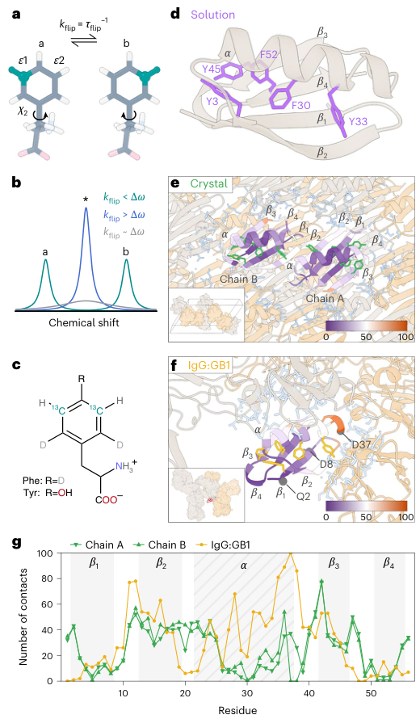
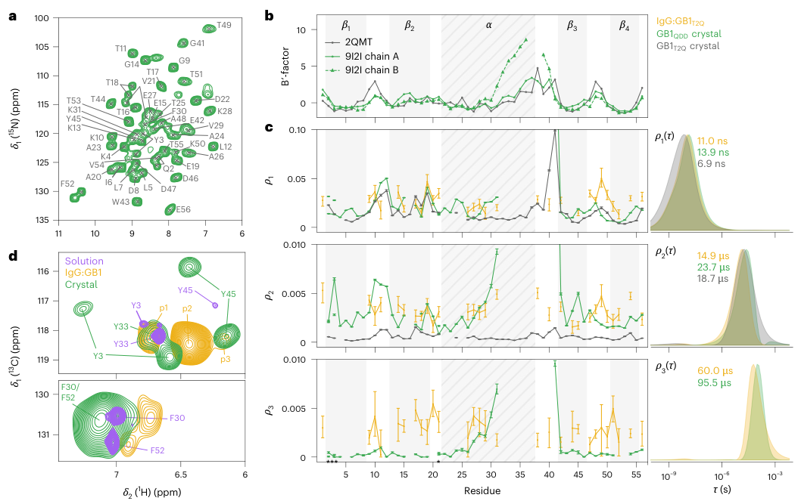
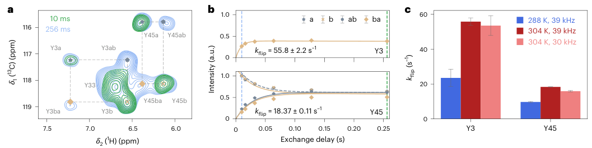
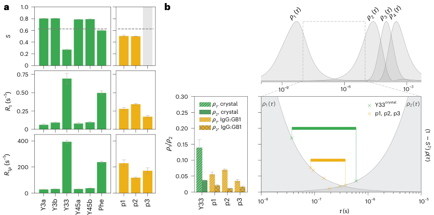
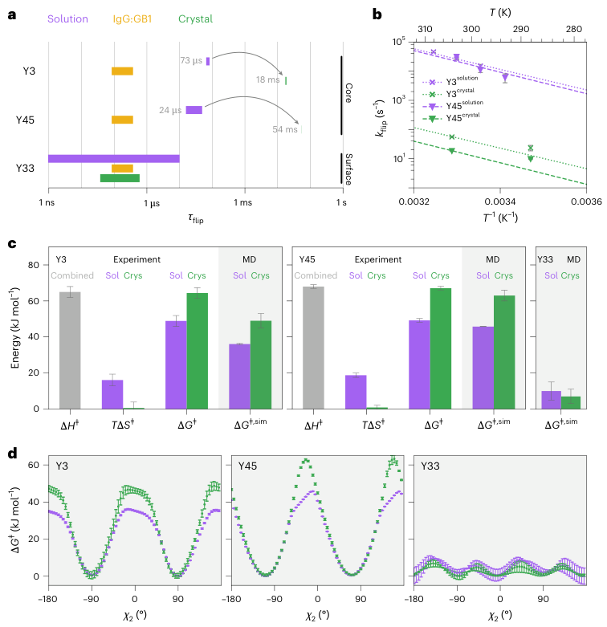
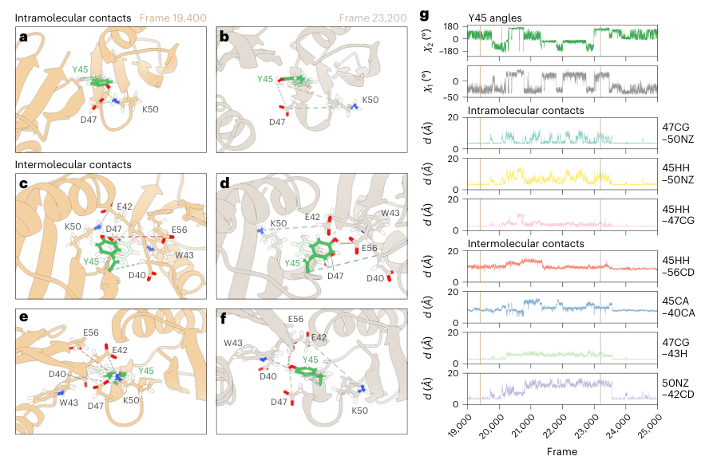

# 芳香环翻转追踪晶体和复合物对蛋白质动力学的影响

## 本文信息

- **英文标题**：Aromatic ring flips reveal how protein dynamics are reshaped in crystals and complexes
- **主要作者**：Lea M. Becker, Haohao Fu, Ben P. Tatman等，通讯作者Sylvain Engilberge，Christophe Chipot和Paul Schanda
- **发表期刊**：Nature Chemistry
- **发表时间**：2026年6月10日（Published online）
- **DOI**：https://doi.org/10.1038/s41557-026-02155-0
- **主要单位**：奥地利Institute of Science and Technology Austria (ISTA)、法国格勒诺布尔Institut de Biologie Structurale (IBS)、中国南开大学、法国CNRS及美国University of Illinois at Urbana-Champaign等
- **完整引用格式**：Becker, L. M.; Fu, H.; Tatman, B. P.; Dreydoppel, M.; Kapitonova, A.; Balazs, D. M.; Weininger, U.; Engilberge, S.; Chipot, C.; Schanda, P. Aromatic ring flips reveal reshaping of protein dynamics in crystals and complexes. *Nature Chemistry* **18**, 1221-1230 (2026). https://doi.org/10.1038/s41557-026-02155-0
- **代码与数据**：本文使用的MD模拟和分析代码可在https://github.com/bestsellers-lab/获取，NMR原始数据可通过对应作者获取

## 摘要

> 芳香环的翻转动力学由其内在的分子间相互作用和环境共同决定。在蛋白质晶体和蛋白质-蛋白质复合物中，分子间接触改变了这种能量景观，但这种改变的确切性质难以解析。理解晶体晶格如何影响蛋白质动力学，对于基于晶体学的运动研究至关重要，但其对集体运动的影响仍不清楚。**疏水核心中的芳香环翻转代表了此类动力学的重要探针**。本文结合先进的同位素标记和定量核磁共振方法，比较了GB1蛋白在晶体中、与其结合伙伴IgG形成复合物时、以及在溶液中的芳香环翻转动力学。结果表明，**核心中的环在晶体中的翻转频率比在溶液中低近1000倍**。基于本文报道的GB1变体晶体结构的增强采样分子动力学模拟，再现了这些升高的能垒，并揭示了晶体如何限制运动。值得注意的是，在IgG复合物中，相同的环翻转比在晶体中快得多，这突显了分子间接触的精确性质如何改进底层的自由能景观。

### 核心结论

- **晶体环境极度抑制核心芳香环翻转**：GB1蛋白核心芳香环在晶体中的翻转速率比溶液中降低近**1000**倍，自由能垒升高约**4.2** $\mathrm{kcal/mol}$
- **复合物环境的影响介于两者之间**：与IgG形成复合物后，芳香环翻转速率比晶体中快，但仍比溶液中慢，说明分子间接触的精确性质决定动力学改进
- **MD模拟重现实验观测**：基于晶体结构的增强采样MD模拟成功再现了实验观测到的能垒升高，揭示了晶格接触如何通过限制构象空间来抑制环翻转
- **暴露于溶剂的环受影响较小**：位于蛋白表面的Y33环翻转速率在三种环境中差异不大，说明环境影响主要针对核心区域的集体运动

## 背景

蛋白质晶体学为结构生物学提供了静态图像，但这些“快照”掩盖了蛋白质固有的动力学特性：

- **构象连续性**：蛋白质在溶液中不断进行构象变化，时间跨度从飞秒级的键振动到秒级的结构重排
- **功能相关性**：这些动力学特性不仅影响蛋白质的稳定性，更与其功能密切相关
- **环境影响复杂性**：当蛋白质被封装在晶体中或与其他分子形成复合物时，**分子间接触会改进其动力学性质**，但这种改进的精确机制仍不清楚

理解环境如何影响蛋白质动力学，对于准确解读晶体结构数据、预测蛋白质在细胞环境中的行为具有重要意义。

### 蛋白质动力学的多尺度特性

蛋白质动力学是一个多层次的过程。芳香环翻转属于中等尺度的运动，通常发生在微秒时间尺度，需要多个结构单元的协调。这种运动虽然比全局构象变化快，但比简单的侧链旋转慢得多，正好处于蛋白质功能和稳定性的关键时间窗口。

- **快速局部运动**：侧链旋转、键角弯曲，时间尺度皮秒至纳秒
- **中等尺度运动**：loop区域柔性和二级结构单元的相对运动，纳秒至微秒
- **慢速集体运动**：结构域重排、构象转换，微秒至秒

### 环境对蛋白质动力学的影响

- **溶液环境**是最接近生理状态的条件，蛋白质可以自由地进行各种构象变化。
- **晶体环境**通过晶格接触限制蛋白质运动，某些构象可能被“冻结”或稳定化。
- **复合物环境**则通过蛋白质-蛋白质或蛋白质-配体相互作用，改变局部和全局的动力学性质。

早期研究表明，晶体环境确实影响蛋白质动力学。**芳香环翻转是探测蛋白质集体运动的理想探针**。

- ubiquitin的β-turn运动在晶体中减慢超过一个数量级，且这种效应依赖于空间群
- 这些研究主要关注表面loop区域的运动，对核心集体运动的系统研究仍然缺乏
- 定量比较晶体、复合物和溶液中核心动力学的实验数据稀缺

## 实验与模拟结果

### GB1模型体系

GB1（蛋白G的免疫球蛋白结合域）是研究此类问题的经典模型体系：

- **结构特征**：它是一个**56**个氨基酸的小型蛋白，包含一个四链β-sheet和一个α-helix，结构紧凑且动力学性质已被充分表征
- **结合特性**：GB1最初从链球菌中发现，能够与免疫球蛋白G（IgG）的Fc区域结合，因此被广泛用作蛋白质工程和NMR方法学的模型系统
- **核心芳香簇组成**：GB1的核心包含一个由Y3、F30、Y45和F52组成的疏水芳香簇，这些芳香环通过π-π堆积和疏水相互作用稳定核心结构（如图1d，包含四链β-sheet和一个α-helix）
- **表面探针**：Y33则暴露于溶剂中，位于蛋白表面，其动力学行为主要受局部环境影响
- **突变体优势**：本研究采用GB1QDD三突变体（T2Q、N8D、N37D），该变体在保持整体结构的同时提高了热稳定性和结晶倾向，便于进行多环境比较研究
- **环境对比**：本研究比较了GB1在三种环境中的芳香环翻转动力学：溶液中、晶体中、以及与IgG形成复合物时，这三种环境代表了蛋白质在细胞中可能经历的不同分子间接触模式，旨在系统解析**环境如何改进蛋白质自由能景观**
- **研究意义**：通过定量比较核心芳香环的翻转速率和能垒，可以深入理解分子间接触对蛋白质集体运动的影响机制

**图1：GB1芳香环特异性同位素标记与结构**。（a）芳香环绕Cβ–Cγ轴翻转示意图，$\chi_2$角旋转180°；（b）翻转速率依赖的NMR信号特征：慢速（$k_{\text{flip}} < \Delta\omega$，青色）信号分离、快速（$k_{\text{flip}} > \Delta\omega$，蓝色）信号平均、中间速率（$k_{\text{flip}} \sim \Delta\omega$，灰色）信号增宽；（c）α-酮酸前体实现Phe和Tyr的3,5-$\ce{^{13}C}$标记；（d-f）GB1QDD在溶液、晶体和IgG复合物中的卡通结构，标注五个研究的芳香环位置（Y3、F30、Y33、Y45、F52），包含α-helix和四链β-sheet。

### 三种环境下的动力学对比

通过定量NMR弛豫分散实验，研究团队精确测量了五个芳香环（Y3、F30、Y33、Y45、F52）在三种环境中的翻转速率：

- **实验策略**：实验采用$\ce{^{15}N}$标记和$\ce{^{13}C}$标记相结合的策略，通过测量CPMG弛豫分散曲线来提取翻转速率常数和自由能垒
- **核心芳香环在晶体中受极端抑制**：核心芳香环Y3和Y45在晶体中的翻转速率比溶液中降低约**三个数量级**，Y3从$3.13 \times 10^4$ $\mathrm{s^{-1}}$降到$55.8 \pm 2.2$ $\mathrm{s^{-1}}$（约18 ms时间尺度），Y45从$4.21 \times 10^4$ $\mathrm{s^{-1}}$降到$18.37 \pm 0.11$ $\mathrm{s^{-1}}$（约54 ms时间尺度）。绝对活化自由能垒在晶体中比溶液升高**约35-50** $\mathrm{kJ/mol}$（约8-12 kcal/mol）
- **复合物环境的影响介于两者之间**：在IgG:GB1复合物中，Y3、Y45、Y33三个Tyr的环翻转时间尺度均约**24 μs**，比晶体中快约**三个数量级**，但仍比溶液中慢得多。这表明**蛋白质-蛋白质相互作用对动力学的抑制效应远弱于晶格接触**
- **表面芳香环Y33**：在晶体中Y33属于快翻转（速率大于化学位移差），detectors分析给出翻转时间尺度约**7.3-18 ms**，与Y3、Y45数量级相当；但Y33对环境敏感性较低，因为它在三种环境中都表现为亚态之间快速交换的特征信号

**图2：三种环境下GB1的MAS NMR对比**。（a）GB1QDD晶体的$\ce{^{1}H-^{15}N}$ NMR谱图及残基指认；（b）GB1T2Q（灰色，PDB 2QMT）和GB1QDD（绿色，PDB 9I2I）晶体结构的归一化B因子对比；（c）IgG:GB1T2Q复合物（黄色，300 K）、GB1QDD微晶（绿色，304 K）和GB1T2Q微晶（灰色，300 K）的$\ce{^{15}N}$自旋弛豫探测器分析，左侧展示残基特异性响应，右侧展示对应的探测器敏感性$\rho_{1-3}(\tau)$；（d）酪氨酸（上层面板）和苯丙氨酸（下层面板）的$\ce{^{13}C}^{\epsilon}$ R$_1$和R$_{1rho}$弛豫速率常数，误差棒代表200次蒙特卡洛模拟的5-95%分位数范围。晶体环境导致核心芳香环（Y3、F30、Y45、F52）的翻转速率降低500-2000倍，能垒升高约**4** $\mathrm{kcal/mol}$。

为了更直观地展示三种环境下的动力学差异，下表总结了所有五个芳香环的定量数据：

| 芳香环 | 位置 | 溶液$k_{\mathrm{ex}}$ ($\mathrm{s^{-1}}$) | 晶体$k_{\mathrm{ex}}$ ($\mathrm{s^{-1}}$) | 复合物$t_{\text{flip}}$ ($\mathrm{s}$) | 晶体翻转时间尺度 |
| --- | ---- | --------- | --------- | -------- | -------- |
| Y3 | 核心β-hairpin | $(3.13 \pm 1.60) \times 10^4$ | $55.8 \pm 2.2$ | ~24 μs | ~18 ms |
| F30    | 核心β-sheet   | $(2.96 \pm 0.15) \times 10^4$ | 快翻转 (>Δω) | -    | 快翻转 |
| Y33    | 表面暴露  | $(3.00 \pm 0.45) \times 10^2$ | 快翻转 (>Δω) | ~24 μs | 7.3-18 ms |
| Y45    | 核心β-sheet   | $(4.21 \pm 2.17) \times 10^4$ | $18.37 \pm 0.11$ | ~24 μs | ~54 ms |
| F52    | 核心C端区域    | $(3.44 \pm 0.45) \times 10^4$ | 快翻转 (>Δω) | -    | 快翻转 |

表1：五个芳香环在三种环境中的翻转动力学参数（基于CPMG弛豫分散、EXSY和detectors分析）。核心芳香环Y3和Y45在晶体中的翻转速率比溶液中降低约**三个数量级**（Y3从 $3.13 \times 10^4$ $\mathrm{s^{-1}}$降到 $55.8$ $\mathrm{s^{-1}}$，Y45从 $4.21 \times 10^4$ $\mathrm{s^{-1}}$降到 $18.4$ $\mathrm{s^{-1}}$），翻转时间尺度从皮秒级延长到**毫秒级**（Y3约18 ms，Y45约54 ms）。F30和F52在晶体中属于快翻转（速率 > 化学位移差），无法用同样方法定量。表面环Y33在晶体中也属于快翻转，时间尺度约7-18 ms。在IgG:GB1复合物中，Y3、Y45、Y33三个Tyr的环翻转时间尺度均约**24 μs**，比晶体中快约**三个数量级**，但仍比溶液中慢得多，说明复合物界面的分子间接触效应远弱于晶格接触。

从表1可以看出几个有趣的趋势：

- **Y3和Y45的抑制最为显著**：Y3从溶液$3.13 \times 10^4$ $\mathrm{s^{-1}}$降到晶体$55.8$ $\mathrm{s^{-1}}$（约560倍），Y45从$4.21 \times 10^4$ $\mathrm{s^{-1}}$降到$18.4$ $\mathrm{s^{-1}}$（约2300倍）。两者翻转时间尺度从皮秒级延长到**毫秒级**（Y3约18 ms，Y45约54 ms）。Y45虽然在溶液中的速率更高，但因晶体中降至更低，所以抑制倍数反而更大
- **F30和F52的晶体翻转快于EXSY可检测范围**：在晶体中属于快翻转（速率 > 化学位移差$\Delta\omega$），无法用EXSY或CPMG定量，但MD模拟（见下文）确认其能垒升高模式与Y3/Y45一致
- **表面Y33在晶体中也属于快翻转**：detectors分析给出时间尺度7-18 ms，与Y3/Y45数量级相当，但因其在溶液中已经很快（亚纳秒），相对抑制远小于核心环
- **复合物效应远弱于晶格**：三个Tyr在IgG:GB1复合物中翻转时间尺度均约24 μs，比晶体中快约三个数量级，说明复合物界面对核心动力学的扰动有限

**图3：Y3和Y45在GB1QDD晶体中的翻转时间尺度测定**。（a）$\ce{^{1}H-^{13}C}$ CEXSY MAS NMR谱图：蓝色为0 ms混合时间、绿色为256 ms（39 kHz MAS），标注Y3和Y45的交叉峰对；（b）Y3（上图，$55.8 \pm 2.2$ $\mathrm{s^{-1}}$）和Y45（下图，$18.37 \pm 0.11$ $\mathrm{s^{-1}}$）的归一化峰强度随交换延迟的拟合曲线（"a/b/ab"标注分别对应自峰、交换峰和反向峰）；（c）提取的温度依赖性速率常数$k_{\text{flip}}$：Y3在288 K、298 K、304 K三个温度和39 kHz、30 kHz两个MAS频率下测定，Y45同样在三温度和两MAS频率下测定。误差棒为300次蒙特卡洛迭代的标准差，速率不依赖MAS频率排除了自旋扩散效应，确认观测的是真实环翻转动力学。

**图4：GB1中快翻转酪氨酸的翻转时间尺度测定**。（a）$\ce{^{13}C}$双极性序参数$S$（上）、R₁（中）和R₁ρ（下）：绿色柱为GB1QDD晶体（288 K），黄色柱为IgG:GB1复合物（298 K），灰色虚线表示Y3和Y45晶体中EXSY测得的翻转时间尺度作为参考；（b）晶体中Y33、Y3和Y45（绿色）、IgG复合物中Y3、Y45、Y33（黄色）的探测器敏感性$\rho_1(\tau)$（上）、$\rho_2(\tau)$（中）和$\rho_3(\tau)$（下）：交叉点对应三个Tyr的翻转时间尺度上/下边界，右图为探测器响应$p_i(\tau)$与翻转时间常数的依赖关系。结果显示Y3和Y45在IgG复合物中翻转时间尺度约**24 μs**，比晶体中快约三个数量级；Y33在晶体中约**7.3-18 ms**，与Y3、Y45数量级相当。

### 增强采样MD模拟揭示机制

NMR实验定量了能垒升高，但原子级机制需要MD模拟来解析。研究团队基于新解析的GB1QDD三突变体（T2Q、N8D、N37D）晶体结构（分辨率**1.8** Å），采用NAMD分子动力学引擎配合Colvars模块实现well-tempered metadynamics extended adaptive biasing force（WTM-eABF）算法的多walker变体，以每个芳香环的$\chi_2$二面角作为反应坐标，对GB1在溶液单体和晶体晶胞两种环境下进行增强采样。

- **算法选择**：WTM-eABF将well-tempered metadynamics的平滑收敛性与extended adaptive biasing force的细节分辨力结合，能在$\chi_2$反应坐标上跨越能垒、估算活化自由能
- **绝对能垒的实验-模拟对比**：绝对活化自由能垒$\Delta G^{\ddagger}$的实验值在晶体中显著高于溶液值。Y3溶液约15 $\mathrm{kJ/mol}$、晶体约50 $\mathrm{kJ/mol}$；Y45溶液约17 $\mathrm{kJ/mol}$、晶体约67 $\mathrm{kJ/mol}$
- **相对能垒升高值$\Delta\Delta G^{\ddagger}$一致**：$\Delta\Delta G^{\ddagger} = \Delta G^{\ddagger,\mathrm{crystal}} - \Delta G^{\ddagger,\mathrm{solution}}$是更稳健的比较指标（消除基线差异）：

| 芳香环 | $\Delta\Delta G^{\ddagger}$ 实验 ($\mathrm{kJ/mol}$) | $\Delta\Delta G^{\ddagger}$ 模拟 ($\mathrm{kJ/mol}$) |
| --- | --- | --- |
| Y3 | 13 ± 5 | 15 ± 5 |
| Y45 | 17 ± 4 | 17.9 ± 1.5 |

实验与模拟高度一致（差异<2 $\mathrm{kJ/mol}$），验证了力场参数和模拟方法的可靠性，也支持了基于晶体结构进行动力学预测的可行性。

**图5：酪氨酸环翻转的热力学参数（实验与模拟）**。（a）Y3、Y45、Y33在溶液（黄色）、IgG复合物（紫色）和晶体（绿色）中的翻转时间常数$\tau_{\text{flip}}$范围（298 K）：Y3溶液~32 ns、晶体18 ms、复合物24 μs；Y45溶液~24 ns、晶体54 ms、复合物24 μs；Y33溶液亚纳秒、晶体7.3-18 ms、复合物24 μs。IgG复合物的数据来自$\ce{^{13}C}$弛豫探测器分析；（b）Y3（紫色）和Y45（绿色）翻转速率$k_{\text{flip}}$的阿伦尼乌斯图：晶体（实心）和溶液（空心）的$\ln k_{\text{flip}}$ vs. $1/T$直线，斜率反映活化焓$\Delta H^{\ddagger}$；（c）实验（Exper.）与MD模拟（MD）给出的$\Delta H^{\ddagger}$（焓）、$T\Delta S^{\ddagger}$（熵贡献）、$\Delta G^{\ddagger}$（Gibbs自由能）分解以及$\Delta\Delta G^{\ddagger}$：**焓-熵分解的核心结论**——晶体中$\Delta S^{\ddagger}$更小（$\Delta S^{\ddagger,\mathrm{solution}} > \Delta S^{\ddagger,\mathrm{crystal}}$），表明晶格接触减少了过渡态可及的构象微态数，活化熵损失是能垒升高的重要贡献；Y3和Y45在$T = 298$ K下的总$\Delta\Delta G^{\ddagger}$分别为$(13 \pm 5)$ $\mathrm{kJ/mol}$和$(17 \pm 4)$ $\mathrm{kJ/mol}$，反映了活化焓和活化熵的协同变化；（d）Y3、Y45、Y33在溶液（紫色）和晶体（绿色）中的自由能$\Delta G^{\ddagger}(\chi_2)$曲线：晶体曲线在过渡态区显著抬高且更宽。误差棒为300次蒙特卡洛迭代的标准差。

- **晶格接触的约束机制**：模拟分析表明，晶体环境通过**空间位阻和构象选择**两种机制限制了芳香环翻转
  - **空间位阻**：相邻GB1分子的侧链（如来自对称相关分子的D40、F42、E56、W43等）填充核心芳香环翻转路径上必须经过的体积，形成”拓扑锁”
  - **构象选择**：晶格接触通过范德华力和偶尔的氢键稳定特定构象，减少过渡态区可及的微态数
  - **自由能面变化**：晶体环境下亚态之间的自由能差增大，能垒变宽，$\Delta G^{\ddagger}(\chi_2)$曲线在过渡态区显著抬高且更宽

**图6：Y45晶格接触网络的MD模拟结构分析**。（a-f）Y45与周围残基在晶体中的两个不同模拟时刻（frame 19,400，浅棕色；frame 23,200，灰色）以及复合物中（frame 19,400，棕色；frame 23,200，深灰色）的相互作用：（a, b）Y45与同一分子内K50、D47的分子内接触（intra-molecular contacts）；（c-f）Y45与相邻分子残基D40、F42、E56、W43等的分子间接触（inter-molecular contacts），展示了四个不同方向的晶格接触模式；（g）晶体中Y45二面角$\chi_2$（绿色轨迹，上图）和$\chi_1$（灰色）、侧链-羟基距离$d$(Y45-OH:K50-NZ)（青色）、Y45与各接触残基距离$d$（其他颜色）的时间序列：垂直虚线标注(a)和(c, e)对应的模拟时刻。模拟表明$\chi_2$在晶体中的翻转与分子间距离波动协同发生，环翻转的取向（向上或向下）与特定接触对的距离涨落高度相关。

- **复合物界面为何效应弱**：在IgG:GB1复合物中，GB1-IgG接触主要发生在GB1的α-helix和C端表面，与核心芳香簇的距离较远。这些接触能稳定GB1相对于IgG的整体取向，但**对核心芳香环翻转路径的空间位阻贡献有限**。模拟显示复合物中$\chi_2$翻转仍是180°对称位置之间的对称跃迁，未出现晶格中那种不对称中间态。这从原子尺度解释了为何复合物中翻转时间尺度仅约24 μs（介于溶液和晶体之间但接近溶液）。

### 关键科学问题

本研究解决了几个核心科学问题：

- **晶体晶格如何影响蛋白质动力学**：通过芳香环翻转这一敏感探针，本研究定量表明晶体环境可使核心集体运动的速率降低三个数量级，能垒升高约**4** $\mathrm{kcal/mol}$（约15-17 $\mathrm{kJ/mol}$）
  - **挑战传统假设**：晶体结构常被视为蛋白质构象的”代表”，但本研究显示其动力学可以比溶液慢三个数量级，强调了**环境依赖性动力学**的重要性
  - **抑制机制**：晶格接触通过空间位阻（相邻分子填充翻转路径体积）和构象选择（稳定特定构象减少微态数）两种机制抑制环翻转

- **蛋白质-蛋白质相互作用如何改进自由能景观**：与IgG形成复合物后，GB1的芳香环翻转动力学介于晶体和溶液之间，说明**不同的分子间接触模式产生不同的动力学效应**
  - **晶格接触特性**：晶格接触是刚性、多向、持久的，对核心动力学有强烈约束
  - **复合物界面特性**：复合物界面接触是局部、定向的，对核心动力学的扰动远弱于晶格
  - **细胞环境参考**：细胞内蛋白质经历多种相互作用，本研究表明界面性质决定其动力学效应

- **MD模拟能否预测环境依赖的动力学变化**：本研究成功结合实验和模拟，验证了基于晶体结构的增强采样MD能定量预测$\Delta\Delta G^{\ddagger}$，为**计算指导的蛋白质工程**奠定了基础
  - **定量验证**：模拟再现了实验能垒的数值，揭示了动力学抑制的原子级机制
  - **方法学意义**：WTM-eABF多walker变体在晶体晶胞上的可行性，为研究其他晶格体系提供了范式

- **核心动力学与表面动力学的环境敏感性差异**：核心芳香环（Y3、Y45）的翻转时间尺度从溶液纳秒级延长到晶体毫秒级（约6个数量级），表面芳香环（Y33）从溶液亚纳秒延长到晶体毫秒级（约4个数量级），核心受环境影响更显著
  - **环境影响选择性**：环境影响主要针对需要大规模集体运动的核心区域
  - **功能意义**：核心重排是许多功能相关构象变化的基础，本研究说明这些变化在细胞环境中可能受到精细调控

## 影响与展望

### 对晶体学研究的启示

- **晶体结构可代表溶液构象，但不一定代表溶液动力学**：本研究定量表明，虽然GB1在晶体中的整体结构与溶液中高度相似（主链均方根偏差小于**0.5**埃），但核心动力学可以相差三个数量级。这意味着，基于晶体结构的动力学推断需要谨慎，最好结合溶液NMR等互补方法。特别是，当研究蛋白质功能相关动力学时，晶体数据可能仅提供部分信息。
- **晶格接触的选择性效应**：不同空间群和晶体堆积模式可能产生不同的动力学抑制效应。本研究发现，核心芳香环翻转受晶格影响最大，而表面残基运动相对自由。这种选择性为理解晶体环境如何改进蛋白质动力学提供了新视角。未来研究可以系统比较不同空间群中同一蛋白的动力学，建立晶格接触-动力学的定量关系。
- **晶体学数据解读的新标准**：当报道基于晶体结构的动力学研究时，应当明确指出实验条件可能对动力学的影响。例如，分子对接计算如果使用晶体结构作为受体模型，可能低估结合过程中的构象自由度，导致结合亲和力预测偏差。结合溶液NMR或MD模拟数据，可以提供更全面的动力学图景。

### 对蛋白质工程与设计的指导

- **稳定化突变体设计的动力学考量**：传统蛋白质工程主要关注热稳定性，通过引入氢键、盐桥或疏水相互作用来提高熔解温度，本研究表明，**动力学稳定性**同样重要，特别是对于需要构象变化的功能蛋白，通过理性设计调节核心芳香环翻转能垒，可以在不牺牲热稳定性的前提下优化功能动力学
  - **酶设计的应用**：例如，在酶设计中，适当降低核心区域的动力学约束，可能提高催化循环中的构象采样效率
- **晶体工程的应用**：基于对晶格接触-动力学关系的理解，可以通过表面突变来调节晶体堆积模式，优化晶体质量或改善晶体中蛋白的动力学性质
  - **难结晶体系的意义**：这对于膜蛋白、大型复合物等难以结晶的体系尤为重要
  - **表面残基的调控**：通过引入或移除特定的表面残基，可以控制晶格接触的强度和位置，从而在保持晶体有序性的同时，保留必要的功能动力学
- **复合物界面设计**：蛋白质-蛋白质相互作用不仅影响结合亲和力，也改进复合物各组分自身的动力学，本研究发现，IgG结合后GB1核心芳香环翻转速率介于晶体和溶液之间，说明复合物界面的影响是局部和间接的，这一认识可以指导复合物工程设计，通过调节界面性质来控制组分的动力学行为，优化复合物的功能表现

### 对细胞内蛋白质行为研究的启示

- **拥挤环境的动力学效应**：细胞内环境极其拥挤，大分子浓度可达**300-400** $\mathrm{mg/mL}$，蛋白质会经历多种瞬时和持久的分子间接触，本研究为理解**细胞环境如何改进蛋白质动力学**提供了定量框架
  - **晶体vs细胞环境**：虽然晶体中的晶格接触比细胞环境更刚性、更持久，但两者都通过空间限制和分子间相互作用影响蛋白质动力学
  - **核心集体运动的敏感性**：本研究表明，核心集体运动对环境特别敏感，这在细胞环境中可能导致意想不到的功能调节
- **相分离中的动力学调控**：近年来，生物分子凝聚体和相分离成为细胞组织的前沿领域，本研究的结果提示，凝聚体内部的高浓度环境可能通过类似于晶格接触的机制，调节蛋白质的动力学特性，核心芳香环翻转等集体运动在凝聚体中可能被显著抑制，这为理解凝聚体的物理性质和功能意义提供了新角度
- **翻译后修饰的动力学效应**：磷酸化、乙酰化等翻译后修饰不仅改变蛋白质的电荷和相互作用，也可能影响其动力学，本研究建立的实验和模拟方法可以用于系统评估不同修饰状态下的动力学变化，为理解翻译后修饰的功能机制提供定量基础

### 方法学推广与未来发展

- **芳香环翻转作为通用动力学探针**：芳香环翻转作为动力学探针的策略可以推广到其他蛋白质体系，特别是那些**核心动力学与功能密切相关**的蛋白，如酶、受体和分子机器
  - **测量技术**：通过同位素标记和NMR弛豫分散，可以精确测量翻转速率和能垒，为功能研究提供定量参数
  - **数据库建立**：未来可以建立芳香环翻转动力学数据库，系统比较不同蛋白、不同突变体、不同环境下的动力学特性
- **多尺度整合方法学**：本研究成功整合了NMR实验和MD模拟，形成了实验-模拟的正向循环，这种多尺度方法学可以推广到其他动力学过程的研究，如loop运动、结构域重排等
  - **技术发展**：随着计算能力的提高和算法的改进，MD模拟将能够处理更大体系和更长时间尺度，与实验数据的结合将更加紧密和精确
- **人工智能辅助的动力学预测**：基于本研究收集的实验和模拟数据，可以训练机器学习模型来预测蛋白质动力学特性
  - **深度学习应用**：例如，通过深度学习模型从序列和结构预测芳香环翻转速率，或者从晶格接触模式预测动力学抑制效应
  - **工程应用**：这将大大加速蛋白质工程和设计的进程，实现对动力学的理性调控
- **时间分辨的结构生物学技术**：虽然本研究主要采用稳态NMR测量，但时间分辨的X射线晶体学和低温电子显微镜技术正在快速发展，能够直接观测蛋白质动力学过程，结合这些新技术，本研究建立的动力学探针策略将能够提供更直接、更高时间分辨率的结构-动力学关联数据，推动结构生物学从静态向动态的转变

