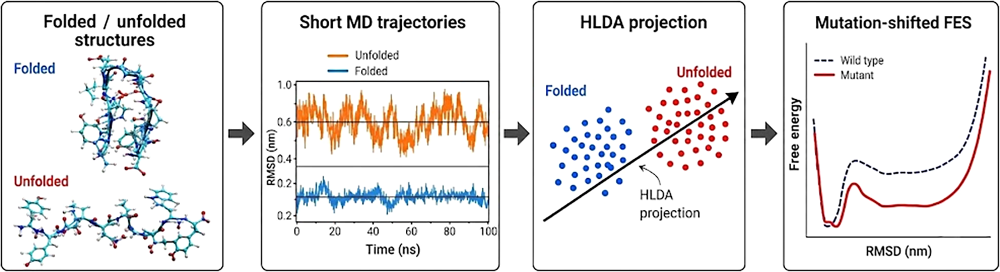
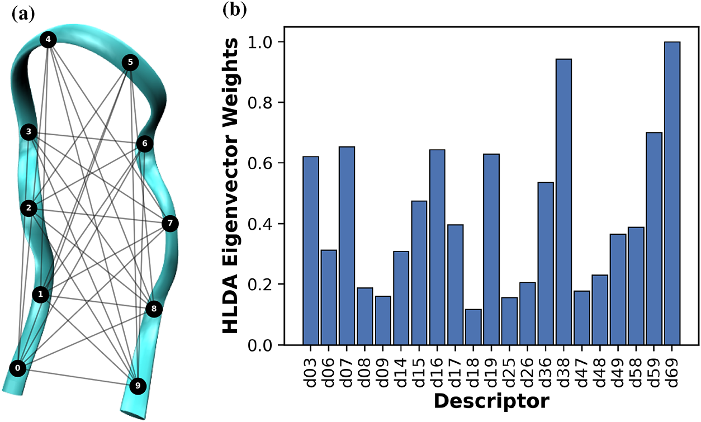
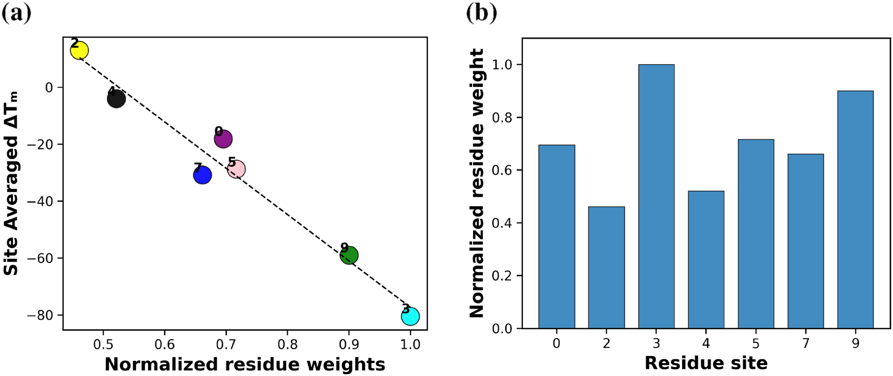
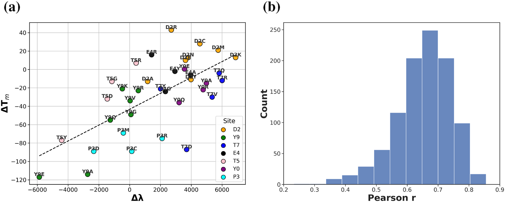
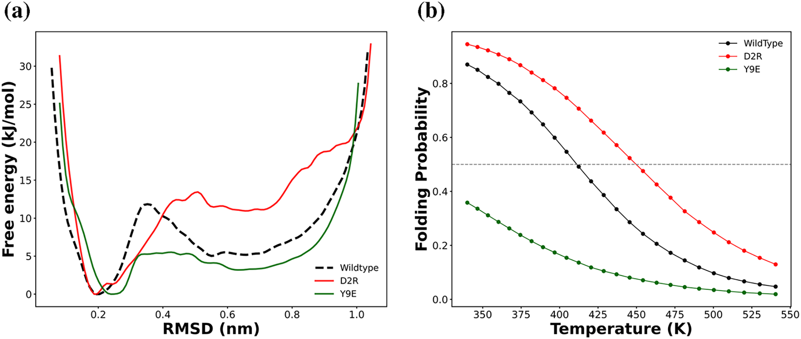

# 如何高效预测突变对多肽稳定性的影响？用集体变量从短轨迹中学习

## 本文信息

- **标题**：Collective-Variable-Guided Engineering of the Free-Energy Surface of a Small Peptide
- **作者**：Muralika Medaparambath, Alexander Zhilkin, Dan Mendels
- **发表期刊**：Journal of Chemical Information and Modeling
- **发表时间**：2026年7月6日
- **单位**：The Wolfson Department of Chemical Engineering、Faculty of Mathematics，Technion − Israel Institute of Technology，Haifa 32000，Israel
- **DOI**：https://doi.org/10.1021/acs.jcim.6c00674
- **引用格式**：Medaparambath, M., Zhilkin, A., & Mendels, D. (2026). Collective-Variable-Guided Engineering of the Free-Energy Surface of a Small Peptide. *Journal of Chemical Information and Modeling*, in press. https://doi.org/10.1021/acs.jcim.6c00674
- **代码与数据**：https://github.com/MendelsResearchGroup/CV-guided-FES-engineering

## 摘要

> 工程化蛋白质和肽类的自由能面对于控制构象系综及其对扰动的响应至关重要。然而，特别是在数据稀缺的情况下，预测点突变等化学修饰如何改变自由能面并改变构象平衡仍然具有挑战性。基于CV-FEST（Collective Variables for Free-Energy Surface Tailoring）框架，我们开发了一种计算方法，利用短的无偏分子动力学轨迹来指导突变分析。使用十残基β-发夹CLN025及其单点突变体的系统性文库，我们应用调和线性判别分析（HLDA）从构象数据中提取集体变量。我们发现，仅从短野生型轨迹学习的HLDA特征向量提供了残基层面的洞察，可预测特定位点突变的热力学稳定性或去稳定化倾向。进一步分析显示，**突变体间HLDA特征值的移动与突变诱导的熔点温度变化呈强相关**，这反映了状态间自由能差的变化。

### 核心结论

- **HLDA权重预测突变敏感性**：野生型HLDA残基权重与位点平均熔点变化呈强负相关（$r = -0.98$），表明HLDA可以识别哪些残基位点对突变最敏感
- **特征值变化预测稳定性**：突变引起的HLDA特征值变化$\Delta\lambda$与熔点变化$\Delta T_m$正相关（$r = 0.66$），可作为预测突变效应的定量指标

## 背景

**小肽的自由能面工程**是蛋白质设计的重要挑战。突变如何影响**折叠-展开平衡**？能否用计算方法预测突变效应，而不需要对每个突变都进行昂贵的**增强采样模拟**？

这个问题的重要性超出了小肽本身的范畴。虽然近年来人工智能在蛋白质结构预测方面取得了重要进展，如AlphaFold等工具，但结构信息不足以预测蛋白质的稳定性、功能和动力学。**自由能面才是决定蛋白质行为的核心**，它包含了构象系综的相对稳定性、转换势垒和动力学信息。如果能够精确地工程化蛋白质的自由能面，就可以控制其构象系综和对扰动的响应，这对于蛋白质设计、药物开发和理解疾病机制都有重要意义。

传统方法如REMD虽然准确，但计算成本高，每个突变都需要重复模拟。**如何用较少的计算量预测大量突变的效应**是关键问题。即使对于只有10个残基的肽，通过蛮力方法需要计算$20^{10}$（约$10^{13}$）种可能突变体的自由能面，这使得直接计算突变诱导的自由能变化变得不切实际。本文提出的CV-FEST框架，通过每个体系的短无偏MD训练HLDA，再用$\Delta\lambda$作廉价代理指标，**降低了单个突变的计算成本**。

- CLN025是一个十残基的β-发夹肽，序列为`YYDPETGTWY`（依SI Table S1），不含二硫键，是研究折叠-转变的理想模型体系。它结构简单但保留了蛋白质折叠的核心物理原理，计算成本可控，可以详尽表征热力学、动力学和动力学行为。
- 此外，肽类在生物识别和调节中起关键作用，作为治疗模态的应用日益增长，其内在构象柔性使其成为研究无序和部分有序蛋白质系统的有价值的模型。

## 核心方法

本文提出了CV-FEST框架，核心思想是用调和线性判别分析（HLDA）从短的无偏分子动力学模拟中学习最优集体变量（CV），再用这些CV分析突变效应。

### HLDA学习集体变量

> **HLDA**（调和线性判别分析）是一种监督降维方法，目标是找到一个新的投影方向，使得两个类别（这里指折叠态和展开态）在投影后的空间中尽可能分离，名字源于类内散度矩阵采用协方差的调和平均。

CV-FEST框架的核心优势是在数据稀缺情况下仍然有效：**只需要在系统的亚稳态内进行短的无偏模拟即可训练**，不需要把稀有跃迁完整跑出来，而是两个或多个亚稳态各自内部的分布信息，更像是一种局部统计学习假设。具体到本文，对每个体系（WT和36个突变体中的每一个）都生成两条100 ns的无偏MD作为HLDA训练数据——**一条从折叠态开始，一条从展开态开始，分别捕捉两个亚稳态内部的构象分布**——再以$\Delta\lambda$与REMD得到的$\Delta T_m$做关联。**省下的是每个突变体的长REMD，不是突变体各自的HLDA分析本身**。关键步骤：

1. **构建残基间距离描述符**：选择28个残基间质心距离作为描述符，只考虑$|i - j| \ge 3$的残基对，避免nearest-和next-nearest-neighbor。**这些距离描述符捕捉了肽链的拓扑结构和折叠状态信息**
2. **准备折叠态和展开态训练数据**：为每个体系生成两条短的无偏轨迹作为HLDA训练数据——一条从折叠的原生结构开始，一条从通过临时限制肽端到端距离后释放获得的展开构象开始，每条轨迹在340 K下传播100 ns。**用RMSD CV相对最小焓参考结构区分两个状态，以限制亚稳态之间的混合**
3. **修剪高相关描述符以提高数值稳定性**：为提高HLDA数值稳定性，先剔除高相关的描述符。**分别在折叠和展开集合内使用Pearson相关性进行修剪**，去除绝对相关系数超过容差rtol的描述符对，只保留在两个集合中都存活下来的描述符
4. **训练HLDA得到判别向量**：得到一个判别向量，每个描述符有一个权重，**权重绝对值大小反映该距离对折叠-展开判别的贡献**。为了提高稳定性，特征向量分析使用更严格的容差（rtol = 0.93），而特征值分析使用较宽松的容差（rtol = 0.98）

**图1**： CV-FEST框架的核心输入。（a）十残基β-发夹CLN025的结构模型，黑色线表示28个残基间质心距离描述符（只考虑$|i - j| \ge 3$的残基对）。（b）每个距离描述符的绝对HLDA特征向量权重，显示不同残基间距离对折叠-展开判别的相对贡献。

### 突变体库构建

本文在CLN025小肽的10个残基中的7个位点引入了**36个单点突变**，覆盖多种氨基酸替换类型（包括极性、非极性、带电等）。每个突变体都用REMD模拟计算熔点$T_m$和自由能剖面。

**表1 突变体库设计概览**

| 突变位点（0-index） | WT残基 | 氨基酸类型 | 突变数量 | 替换策略 |
| --- | --- | --- | --- | --- |
| Y0 | Tyr | 极性/Tyr | 4 | Ala, Glu, Gln, Arg |
| D2 | Asp | 带负电 | 8 | Ala, Cys, Phe, Lys, Met, Asn, Arg, Tyr |
| P3 | Pro | 疏水/Pro | 4 | Cys, Asp, Met, Arg |
| E4 | Glu | 带负电 | 4 | Gly, Lys, Arg, Tyr |
| T5 | Thr | 极性 | 4 | Asp, Gly, Arg, Tyr |
| T7 | Thr | 极性 | 5 | Asp, Gln, Arg, Val, Tyr |
| Y9 | Tyr | 极性/Tyr | 7 | Ala, Glu, Gly, Lys, Gln, Arg, Val |

每个位点的突变选择覆盖了不同的**理化类别以全面评估突变效应**，涵盖极性、非极性、带电等多种氨基酸类型，以评估其对肽自由能面的影响。完整的突变序列列表见补充材料Table S1。

#### REMD模拟设置和方法

- **力场和溶剂模型**：采用CHARMM22*力场和TIP3P水溶剂，体系溶于约1800个水分子组成的立方盒，用钠离子中和电荷，配合周期性边界条件与PME处理远程静电相互作用

- **温度和副本设置**：使用340.0-540.5 K的温度范围（几何分布，缩放因子$a = 1.0195$）和25个温度副本的NVT系综，每1 ps尝试一次温度交换，**温度范围覆盖折叠、转变和展开态**

- **平衡处理**：主文在总体分析中丢弃每个副本前100 ns；SI Fig.S9的代表性收敛性分析则在多条独立轨迹（总采样超过2 μs）后，丢弃每条轨迹前150 ns，并将剩余数据分成50、100、150、200和250 ns的连续块，每个块各算出一个$T_m$，再跨运行聚合为加权平均$T_m$和加权标准误

- **$T_m$的提取方法**：对每个温度计算折叠概率$P_{\text{folded}}(T) = N_F/(N_F + N_U)$（$N_F$和$N_U$分别是折叠和展开势阱的帧数），把$P_{\text{folded}} = 0.5$对应的温度定义为$T_m$，**这个温度本质上是折叠和展开态各占一半的半变性温度**

- **折叠和展开势阱的划分标准**：构象状态用相对native folded参考结构的RMSD CV分类，RMSD阈值定义folded和unfolded两个势阱，两个势阱的边界由FES上的低谷位置决定：
  - **folded势阱的上限**对应FES的自由能垒区域，即fold↔unfold转变的过渡态位置
  - **unfolded势阱的下限**对齐完全展开集合的特征RMSD，**排除部分折叠（partially folded）构象**

  由于阈值对结果有一定敏感性，作者扫描了一组RMSD阈值对，**发现最强residue-importance相关性和最强$\Delta\lambda-\Delta T_m$相关性几乎出现在同一组阈值**，说明分类边界在物理上是稳健的

- **收敛性验证策略**：通过多个独立REMD运行（论文未给出具体运行数，仅提到总采样超过2 μs）验证收敛性，**最终$T_m$值通过合并运行估计得到**，不确定性来自块大小（50–250 ns）之间$T_m$的波动。副本交换混合和采样收敛使用标准诊断评估，如温度空间随机游走、最低温度副本的RMSD时间序列，以及$T_m$的块大小收敛性（SI Fig.S9）

### 特征值变化$\Delta\lambda$计算

**计算流程**：对每个体系（WT和36个突变体）独立构建HLDA，得到各自的判别向量与最大特征值$\lambda$，再计算$\Delta\lambda = \lambda_{\text{mutant}} - \lambda_{\text{WT}}$，最后与REMD得到的$\Delta T_m$做关联。

> 特征值的统计意义：**特征值越大，表示折叠态和展开态在HLDA坐标上的投影分布越分离，即类间离散度与类内离散度之比越大**。
> 
> 论文将其作为与$\Delta T_m$相关的廉价代理指标，反映突变引起的FES形状变化；它本身并不直接等同于“自由能面更陡峭”或“折叠态自由能下降”的定量证明。

**WT的HLDA特征向量被直接用于位点级residue-importance score（eq 7）的计算**，而突变体的$\Delta\lambda$则各自重新构建HLDA。

## 关键结果

### 残基重要性预测与热力学稳定性强相关

虽然HLDA的原始描述符是残基对距离，但论文通过eq 7把每个残基关联的所有距离描述符权重绝对值聚合，得到了**单残基的importance score**。这个残基级分数与突变引起的平均熔点变化$\Delta T_m$呈**极强的负相关**（$r = -0.98, p = 8.09 \times 10^{-5}$，$n = 7$个位点）。**HLDA权重较大的残基，其突变对热力学稳定性影响更大**。需要注意，这一强相关性的实现依赖于HLDA训练集包含完全展开集合而排除部分展开态的阈值选择（见SI Section S2−S4），即对folded/unfolded边界定义有一定敏感性。

> **核心发现的物理机制**：HLDA权重大的残基，其相关距离在WT折叠态和展开态之间变化显著，说明这些残基对**折叠-转变过程贡献很大**，因此突变这些位置会剧烈改变**折叠-展开态的自由能平衡**。这验证了HLDA提取的CV确实捕捉到了**折叠转变的核心物理特征**。

从另一个角度理解，HLDA残基分数本质上反映了这个残基相关距离在区分折叠态和展开态时的**信息含量高低**。分数大的残基意味着相关距离在两个状态之间有明显差异，是折叠-转变的关键传感器。突变这些位置会直接改变这些关键距离，从而对折叠-展开平衡产生显著影响。

SI Fig.S11将位点平均拆回36个单突变后，WT残基重要性与突变特异的$\Delta T_m$仍呈负相关（Pearson $r = -0.77$，$p = 5.37 \times 10^{-8}$）。SI Fig.S12再进行了10,000次子采样：每次从每个位点随机略去一个替换，位点平均与单突变两种分析都维持负相关，说明图3的趋势并非由少数替换的平均效应单独造成。

**图3**：残基重要性预测与热力学稳定性的强相关。

- （a）散点图显示WT HLDA残基权重（横轴）与每个位点突变引起的平均熔点变化$\Delta T_m$（纵轴）呈强负相关（Pearson $r = -0.98, p = 8.09 \times 10^{-5}$，$n = 7$）。每个数据点代表一个残基位点，颜色和符号区分不同氨基酸类型。
- （b）按残基显示的WT权重条形图，经过归一化处理（除以最大权重），显示不同位点的贡献差异；P3和Y9的权重较高，D2和E4较低。

### 特征值变化预测稳定效应

> 突变引起的HLDA最大特征值变化$\Delta\lambda$与$\Delta T_m$呈正相关（图4a）。这意味着**增加折叠-展开可分性的突变倾向于稳定该小肽**。

物理机制：当突变使折叠态和展开态在判别方向上更加分离，通常伴随折叠/展开自由能平衡向更稳定的折叠态移动。这个经验相关性表明，**特征值变化$\Delta\lambda$可以作为突变效应的定量代理指标**，但不能单独确定具体相互作用或自由能变化的来源。

> **实用价值**：通过CV-FEST，可为每个候选突变用短无偏轨迹构建HLDA并计算$\Delta\lambda$，以**优先筛选更值得进行长REMD或实验验证的候选**。这降低的是单个候选的计算成本。

在小肽工程中，研究者通常需要比较大量候选突变的效应。若对每个候选都进行收敛的REMD模拟，计算成本很高。CV-FEST以每个候选的两条短无偏轨迹获得$\Delta\lambda$，因此可将长REMD集中用于少数优先候选。

**图4**：特征值变化$\Delta\lambda$预测突变效应。

- （a）36个突变体的HLDA特征值变化$\Delta\lambda$（横轴）与熔点变化$\Delta T_m$（纵轴）呈正相关（Pearson $r = 0.66, p = 1.1 \times 10^{-5}$，Spearman $\rho = 0.61, p = 7.6 \times 10^{-5}$）。去除两个离群点D2R和T7D后，SI Fig.S5给出Pearson $r = 0.77$、Spearman $\rho = 0.74$。
- （b）子采样分析随机移除40%的突变体、重复100次；相关系数分布中心仍为$r = 0.66$，表明这种关系在该数据扰动下保持稳定。

$\Delta\lambda$作为代理指标的可靠性，有一个前提：WT与突变体的HLDA特征向量方向应大体对齐，否则“特征值差值”比较的就不是同一方向上的量变。**SI Fig.S13检验了这一假设**：WT与突变体主特征向量夹角同$T_m$没有显著相关性（Pearson $r=-0.043$，$p=0.805$；Spearman $\rho=-0.197$，$p=0.251$），说明判别方向在体系间大体稳定，$\Delta\lambda$的比较在统计上是成立的。

### WT vs 突变体自由能面

比较WT与两个代表性突变体（D2R和Y9E）的自由能轮廓，可以看到：
- **D2R**：沿RMSD CV的FES显示其势垒区域相对WT发生位移（见SI Fig.S7），在图2所示温度范围内折叠概率高于WT，熔点$T_m$也更高，是一个代表性稳定突变
- **Y9E**：在340 K（WT折叠态稳定温度）下FES明显偏向展开区域，折叠概率显著降低，是典型去稳突变

这些变化表明，突变改变了**折叠-展开态的相对自由能平衡**，并导致熔点$T_m$相应偏移。通过REMD模拟得到的自由能剖面可以直观地展示这种变化，为理解突变效应提供了物理基础。

**图2**：WT CLN025与两个代表性突变体的热力学性质比较。（a）沿RMSD CV的自由能剖面在340 K的变化，显示突变如何改变折叠-展开平衡。D2R的折叠态更稳定，Y9E在340 K时FES明显偏向展开区域。（b）折叠概率$P_{\text{folded}}$随温度的变化曲线，$T_m$定义在$P_{\text{folded}} = 0.5$处。

### 离群点分析

数据中有两个明显的离群点：
- **D2R**：与T7D是$\Delta\lambda-\Delta T_m$分析中偏离最大的两个突变。SI Section S6显示，D2R的RMSD自由能垒区域相对WT发生位移，使统一的状态边界不再良好对齐，这是其离群行为的合理解释。
- **T7D**：同样显著离群，但没有出现D2R式的RMSD势垒位移。进一步在Asp3N–Gly7O和Asp3N–Thr8O平面检查折叠/错折叠极小值后，也**没有观察到T7D的隐藏错折叠态**，其偏离原因仍未明确。

离群点的存在提示，**统一的状态边界定义在极端突变上可能失效**，这是方法在当前阶段的一个已知局限。未来工作可考虑为每个突变体定制状态边界或使用替代的状态定义方式（SI Section S6）。

## 关键结论与批判性总结

### 主要影响

- **学术影响**：CV-FEST为自由能面工程提供了一条新思路，**从短的无偏模拟中学习判别性CV来关联突变效应**，展示了在数据稀缺情况下进行蛋白质研究的可能性
- **方法学贡献**：展示了HLDA在生物分子模拟中的应用潜力，**其可解释性和数据效率使其区别于黑箱机器学习方法**，为物理信息丰富的机器学习在计算生物学中的应用提供了范例
- **实用价值**：CV-FEST作为计算筛选工具，优势体现在两方面：
  - **成本**：每个体系只需两条100 ns无偏MD（折叠态和展开态各一条）训练HLDA，再以$\Delta\lambda$作廉价代理指标；36个突变体若逐一采用REMD需要36次独立多副本模拟，CV-FEST则为各突变体开展短无偏MD与HLDA分析，两者都随突变数线性增长，优势在于单个突变体的计算成本远低于完整REMD，**可缩小需要实验验证的突变范围**
  - **可解释性**：HLDA权重直接反映每个残基对折叠-转变的贡献，特征值$\Delta\lambda$反映折叠-展开可分性变化（即类间离散度与类内离散度之比），可帮助研究者优先关注对突变最敏感的残基位点
- **HLDA权重具有明确的物理可解释性**：每个距离描述符的权重反映了该残基对折叠-转变的贡献，特征值$\Delta\lambda$直接反映折叠-展开可分性变化，即类间离散度与类内离散度之比

**表2 CV-FEST与传统REMD方法对比**

| 方法 | 数据需求 | 计算成本 | 可解释性 | 适用场景 |
| --- | --- | --- | --- | --- |
| **REMD** | 每个突变需要长NVT副本模拟（25个温度副本） | 每个突变都需要独立长REMD | 基于物理原理，直接可解释 | 精确热力学分析，少量突变 |
| **CV-FEST** | 每个体系两条100 ns无偏MD | 每个体系短无偏MD + HLDA分析 | HLDA权重物理意义明确 | 大规模突变筛选，数据稀缺场景 |

### 局限性

- **离群点现象**：D2R和T7D两个离群点表明，**统一的状态边界定义在极端突变上可能失效**（如D2R的FES势垒区域相对WT发生位移），这限制了方法在极端突变情况下的预测能力
- **体系依赖性**：目前仅在CLN025小肽上验证，**对于更大、更复杂的蛋白质体系，HLDA的有效性仍需进一步验证**
- **训练集要求**：强相关性的实现依赖于HLDA训练集包含完全展开集合数据而排除中间部分展开态，**这暗示折叠态统计在观察到的相关性中起主导作用**，但对于其他体系可能需要不同的训练策略
- **理化性质整合**：本文将$\Delta T_m$与电荷变化、Grantham距离和Kyte–Doolittle疏水性变化逐一比较。后两者没有清晰相关性；电荷变化显示一定关联，但部分电荷类别样本很少、类内变异较大，因此仍需谨慎解释
- **位点级相关性的稳健性**：$r=-0.98$仅基于7个位点的平均值，需要在更多体系和更多突变数据上验证

### 未来方向

- **扩展到更大体系**：将CV-FEST应用于更大、更复杂的蛋白质系统，验证其在真实蛋白质工程任务中的有效性
- **整合多模态信息**：结合序列特征、物理化学描述符和进化信息，构建更全面的突变效应预测框架
- **深度突变扫描**：应用于深度突变扫描（DMS）数据，指导高通量实验设计，加速蛋白质功能进化
- **动力学预测**：除了热力学稳定性，探索CV-FEST在预测折叠速率、结合动力学等动力学性质方面的潜力
- **与其他方法融合**：结合自动状态识别、替代结构描述符或更先进的CV构建方法，评估其在更复杂体系中的适用性
