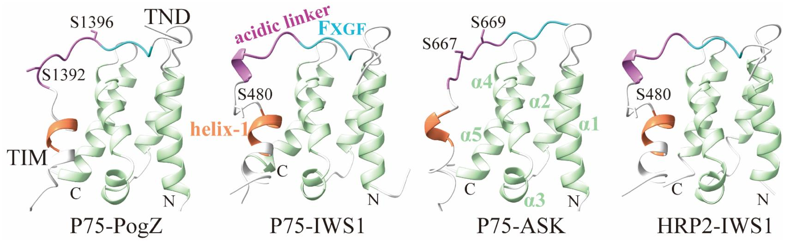
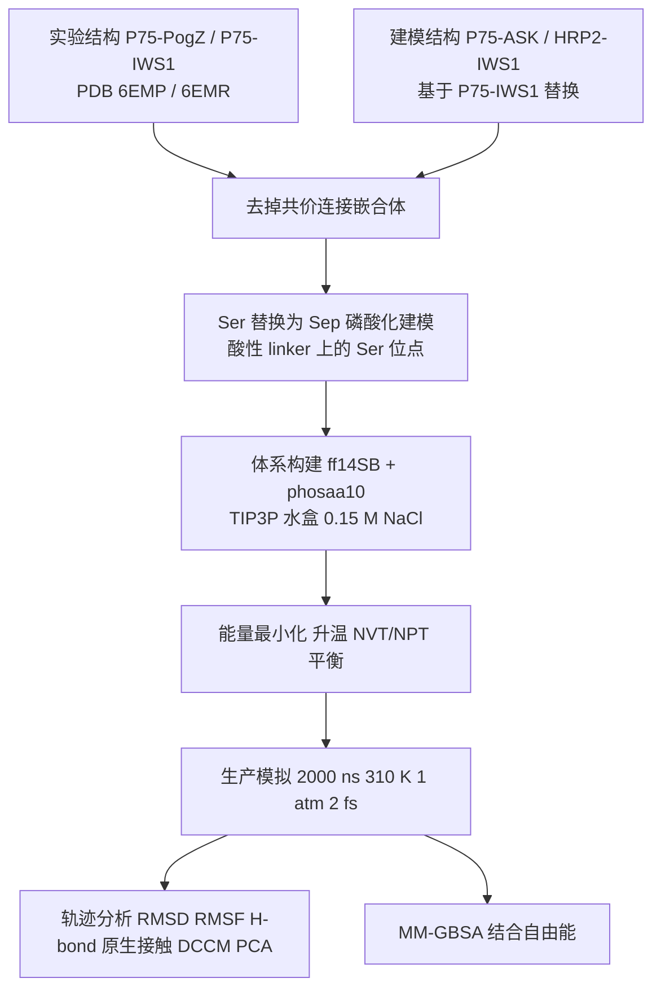
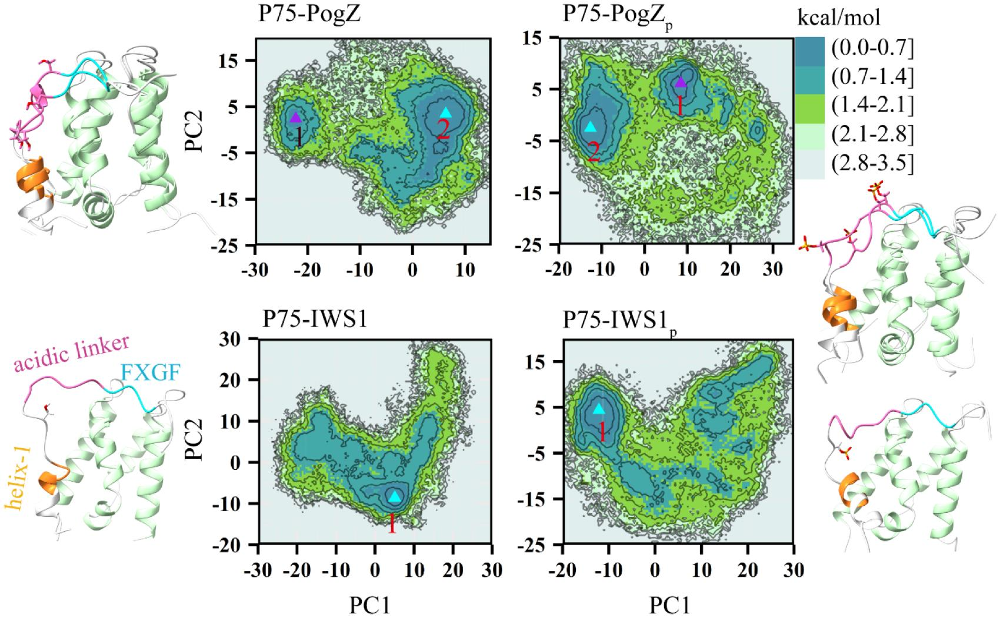
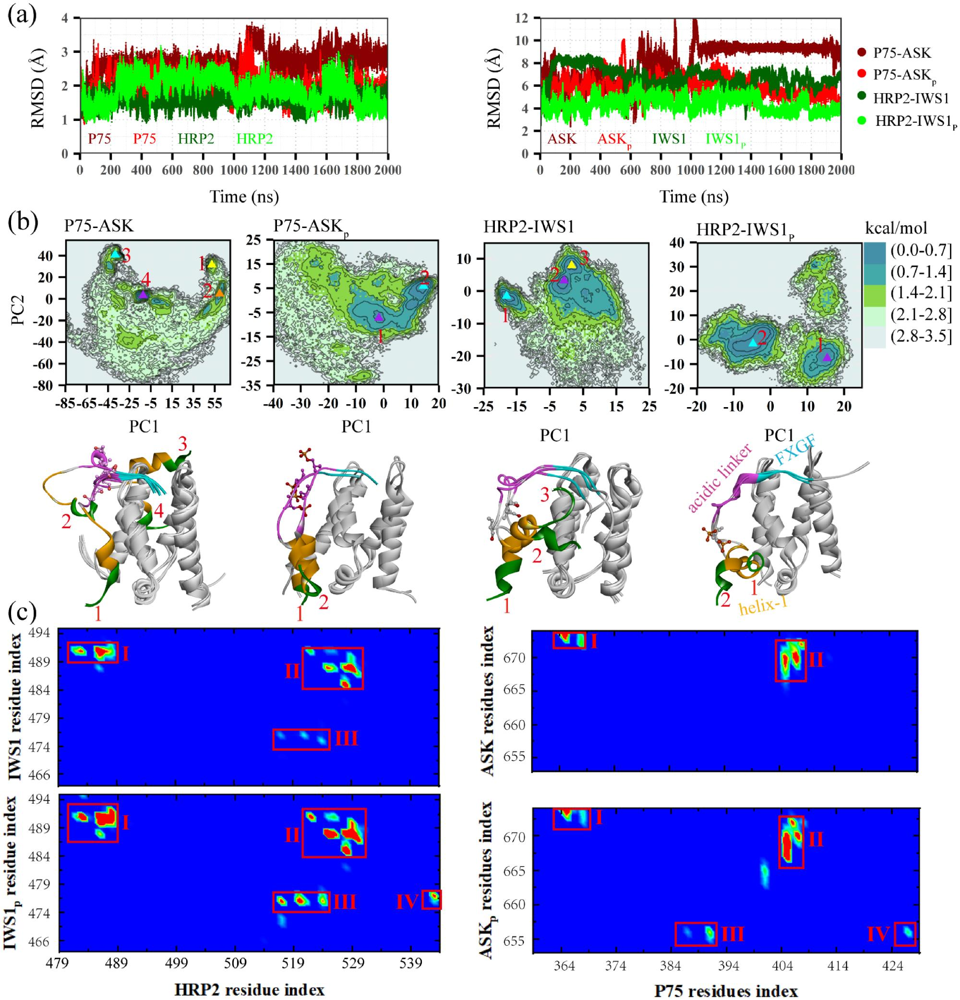
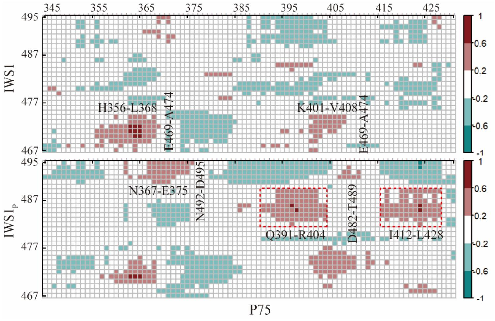
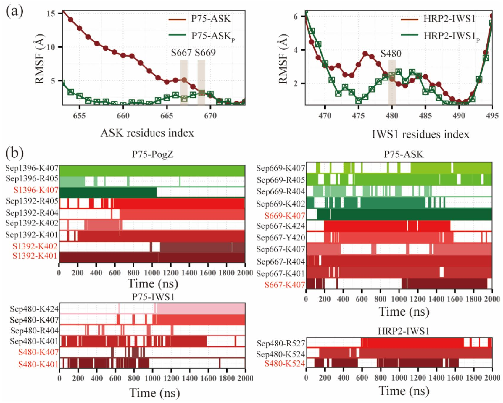

# 微秒级分子动力学解析磷酸化如何调控无序蛋白互作模块TND-TIM的结合亲和力

## 本文信息

- **标题**：磷酸化调控无序蛋白相互作用模块的机制洞察
- **作者**：Yongjian Zang、Yu Ni、Xuhua Li、Zhiwei Yang、Zhaoming Fu、Shengli Zhang
- **发表期刊**：Journal of Biomolecular Structure and Dynamics
- **发表时间**：2025年2月12日
- **DOI**：<https://doi.org/10.1080/07391102.2025.2460748>
- **单位**：云南师范大学物理与电子信息学院、云南省光电信息技术重点实验室（昆明，中国）；西安交通大学物理学院（西安，中国）
- **引用格式**：Zang, Y., Ni, Y., Li, X., Yang, Z., Fu, Z., & Zhang, S. (2025). Mechanistic insights into the phosphorylation-regulated a disordered protein interaction module. *Journal of Biomolecular Structure and Dynamics*. <https://doi.org/10.1080/07391102.2025.2460748>

## 摘要

> TFIIS N-terminal domain（TND）是一个关键的蛋白支架，能选择性识别被称为TND-interacting motifs（TIMs）的无序配体。理解TND-TIM相互作用的具体机制，对解读转录机器至关重要。本文用**分子动力学模拟**研究了TND-TIM相互作用模块的构象系综。研究表明，TND-TIM复合物的实验结构（包括P75-PogZ和P75-IWS1）在**微秒级模拟中保持构象稳定**，即使去掉TND与TIM之间连接的蛋白，或对TIM做磷酸化。相反，基于P75-IWS1结构构建的P75-ASK与HRP2-IWS1在模拟中不稳定，例如TIM的helix-1会从TND上的初始结合位点偏移。然而，**磷酸化增强了TND-TIM相互作用，并快速稳定复合物结构**。本文总结出一条磷酸化调控TND-TIM相互作用的普适规律：TIM的磷酸基团与TND残基带正电荷的侧链**形成氢键**，促进TND与TIM含磷酸化Ser的酸性linker之间的动态关联，并增强TIM的helix-1和FXGF基序与TND之间的残基-残基相互作用。这些磷酸化诱导的变化使TND与TIM之间的**亲和力升高**。本研究在原子层面揭示了磷酸化调控的TND-TIM相互作用模块，有助于深入理解转录机器中蛋白互作组装配的分子机制。

### 核心结论

- **实验解析的TND-TIM结构在微秒MD中稳定**（P75-PogZ、P75-IWS1），去掉连接蛋白或对TIM磷酸化都不显著改变其构象分布
- 基于P75-IWS1建模的P75-ASK与HRP2-IWS1初始结合态不理想，模拟中TIM的helix-1从TND结合位点明显偏移，**整体很不稳定**
- **磷酸化能快速挽救这些复合物**：已位移的helix-1重新稳定地结合TND，而FxGF基序始终结合、并未脱离
- **MM/GBSA定量给出结合自由能的升高**：TIM磷酸化使全部四种TND-TIM模块的结合自由能一致升高，具体数值见正文表1、表2
- **磷酸基团通过与TND带正电侧链形成氢键**（主要是Lys与Arg），降低TIM柔性、增强动态关联与原生接触，最终提升亲和力
- **结论与ITC实验一致**：P75对PogZ的亲和力高于对IWS1，且TIM磷酸化普遍增强亲和力

### 创新点

- 对四种TND-TIM模块（实验结构P75-PogZ/P75-IWS1与建模结构P75-ASK/HRP2-IWS1）在磷酸化前后做系统性比较，统一用**微秒MD结合MM/GBSA**量化
- 把“磷酸化增强亲和力”这一表型，拆解为**氢键形成→动态关联增强→原生接触增加→结合自由能升高**的原子级因果链
- 归纳出普适规律：调控的关键在**磷酸基团与TND正电侧链的氢键**，而非磷酸化这一修饰本身

## 背景

转录机器的核心由大量**固有无序区**（IDRs）构成，而IDRs的一项重要功能就是**选择性地组装结合伙伴**。转录因子IIS的N-terminal domain（TND）是一类蛋白支架，通过一种被称为**TND-interacting motifs**（TIMs）的无序短肽来识别伙伴。因为含TND的蛋白是转录延伸调控最富集的一类因子，TND-TIM模块在转录过程中举足轻重。

已知的TND支架包括TFIIS、LEDGF/P75（PSIP1）、HRP2、IWS1等；其中P75通过C端整合酶结合域（IBD/TND）结合HIV整合酶，也通过其TND结合一系列**含TIM的胞内蛋白**，例如PogZ、ASK与IWS1。单个蛋白可含多个TIM，例如IWS1序列中就有三个不同的TIM，因此能通过TIM同时招募多个含TND的伙伴。

TIM通常由两部分组成：一是**带强α螺旋倾向、含一个保守苯丙氨酸的helix-1**；二是**识别TND关键的、高度保守疏水FxGF基序**。两者之间由**富含丝氨酸与负电残基的酸性linker**（Ser）连接。已有实验表明，这段酸性linker可被磷酸化，能在低亲和力与高亲和力状态之间切换。**这种磷酸化开关很可能参与调控RNA聚合酶II的暂停、进程性以及延伸期不同状态之间的转换**。磷酸化一般增强TND-TIM亲和力，但具体到原子层面，磷酸化到底怎么把弱结合变成强结合，长期不清楚。

此前对TND-TIM模块的研究已有不少进展：HIV整合酶与P75之间的相互作用和结合自由能，就曾被**分子动力学结合MM/GBSA方法探索过**；P75-PogZ与P75-IWS1的复合物结构，则是通过**把TND与TIM用共价连接的嵌合蛋白加到NMR样品里**才解析出来的。

这就留下三个尚待回答的问题，而这篇论文正是用微秒级全原子MD，把这三件事一次性说清楚：

> 论文要回答的三个问题：去掉共价连接后，**实验结构在溶液中还稳不稳定**；P75-ASK、HRP2-IWS1这类复合物**到底如何结合**；磷酸化调控TND与TIM亲和力的**原子细节**是什么。

**图1：TND-TIM相互作用模式示意图**

- 依次展示四种模块：P75-PogZ、P75-IWS1、P75-ASK与HRP2-IWS1；前两者坐标取自NMR结构（PDB 6EMP、6EMR），后两者以P75-IWS1为模板、**原位点叠放**ASK/HRP2（ASK来自AlphaFold预测，HRP2来自NMR结构PDB 6T3I）
- 配色方案：TND五条α螺旋（α1–α5）浅绿；TIM的helix-1橙、酸性linker紫、FxGF基序青，磷酸化位点Ser（IWS1 S480、PogZ S1392/S1396、ASK S667/S669）用棒状显式标出；TIM其余片段灰色卡通，N/C端已标注

## 研究内容

### 核心方法：TND-TIM模块建模与微秒分子动力学

研究的起点是搭好八个复合物的初始结构，也就是**四个模块各自取磷酸化与未磷酸化两种状态**。

- 初始结构：P75-PogZ与P75-IWS1来自NMR结构（PDB 6EMP、6EMR），并去掉其中**共价连接的嵌合蛋白**；P75-ASK与HRP2-IWS1则是以P75-IWS1为模板、把其中IWS1或P75**替换为**ASK或HRP2，其坐标分别取自**AlphaFold预测结构**（ASK）与NMR结构PDB 6T3I（HRP2）；论文未交代具体的叠放或对齐协议
- 磷酸化建模：把酸性linker上的Ser位点（IWS1 Ser480、PogZ Ser1392与Ser1396、ASK Ser667与Ser669）替换为**磷酸化丝氨酸Sep**，得到各模块的磷酸化形式
- 力场与体系：使用**AMBER18与ff14SB力场**（Sep参数取自phosaa10）；TIP3P水盒距蛋白至少10 Å，盐浓度0.15 M；先三轮能量最小化，再升温（0→310 K，1 ns，约束骨架）、NVT（1 ns）与NPT（2 ns）平衡，最后生产**2000 ns模拟**，步长2 fs，310 K、1 atm
- 轨迹分析：用PYTRAJ计算均方根偏差（RMSD）、均方根涨落（RMSF）、动态交叉关联矩阵（DCCM）与主成分分析（PCA），以及氢键与原生接触；结合自由能由**MM/GBSA端点法**给出（分子力学广义玻恩表面积法，AmberTools19）

> 八个复合物（四种模块 × 磷酸化/未磷酸化）统一在 **2000 ns 全原子模拟 + MM/GBSA** 框架下比较，是本文能把“磷酸化增强亲和力”这一表型，拆解成氢键→动态关联→结合自由能原子级因果链的前提。

### 结果一：实验结构稳如磐石，磷酸化不改构象分布

第一组系统回答的是“实验结构去掉连接蛋白后还是否稳定”。对P75-PogZ与P75-IWS1的重原子RMSD（见补充材料图S2(a)）显示，它们相对初始结构在约500 ns达到平台，波动范围2.0–3.5 Å；PogZ与IWS1分别在约1000 ns与500 ns收敛。**磷酸化对RMSD几乎没有影响**，删除连接蛋白和TIM磷酸化都不显著改变这些实验结构的稳定性。

PCA进一步刻画了构象分布。对P75-PogZ，前两个主成分（PC1、PC2）分别解释超过49%与27%的结构方差，二者之和超过76%（P75-IWS1系统为72.6%），足以刻画动态结构。由PC1/PC2构建的二维自由能景观里，P75-PogZ出现两个**自由能极小点**，但复合物整体结构变化不大。代表性构象显示酸性linker发生了从loop到helix的转变；P75-IWS1在磷酸化与未磷酸化下都只有一个**极小点**，代表性构象相似。

RMSF分析（图S5）也给出一致结论：与P75结合的PogZ和IWS1，其主链柔性同样不受磷酸化影响，**稳定性来自实验结构本身的低能态，而非磷酸化带来的刚性变化**。

> 去掉嵌合连接之后体系依旧稳如磐石，意味着**后面建模复合物表现出的不稳定，根源在建模，而非TND-TIM模块本身**。

**图2：P75-PogZ与P75-IWS1复合物的二维自由能景观**

- 由PC1与PC2构建，左（右）面板对应未（磷酸化）系统；编号1、2表示自由能极小点按采样顺序出现的代表构象，左右两侧另附PogZ/IWS1代表性结构（TIM片段按图1同色方案着色，磷酸化Ser棒状显式标出）
- 配色按kcal/mol从低到高共5档，由深蓝（0.0–0.7）经浅蓝（0.7–1.4）、深绿（1.4–2.1）、浅绿（2.1–2.8）到浅米（2.8–3.5）

### 结果二：磷酸化快速挽救不稳定的建模复合物

第二组系统才是本文的重头戏。P75-ASK与HRP2-IWS1是基于P75-IWS1结构建模出来的，**初始结合态并不理想**。TND（P75、HRP2）的RMSD在约500 ns后趋于平稳且不受磷酸化影响，但TIM（ASK、IWS1）的原子位置波动很大，尤其ASK的RMSD在1000 ns后仍有约10 Å的相对平台，拖累整个P75-ASK的稳定性；而磷酸化的ASK相对初始结构只有约6 Å并快速稳定。HRP2-IWS1呈现类似趋势。

> **未磷酸化的建模复合物极不稳定**，TIM的helix-1从TND初始结合位点偏移，但**磷酸化让两个系统都快速稳定下来**。

把这两套复合物的构象分布画成二维自由能景观，磷酸化前后的差别就一目了然：未磷酸化的P75-ASK与HRP2-IWS1各掉进4个和3个**自由能极小点**，此时FxGF基序还黏在TND上，但helix-1已经滑出初始结合位点；磷酸化之后极小点缩减到2个，而且除了FxGF，**helix-1也重新坐回原位、稳定地结合TND**。

**图3：P75-ASK与HRP2-IWS1建模复合物的稳定性分析**

- **(a) 骨架RMSD时间演化**：左面板为TND（P75深红、HRP2深绿）及其磷酸化形式（红、浅绿）的RMSD（0–4 Å），右面板为TIM（ASK深红、IWS1深绿）及其磷酸化形式（红、浅绿）的RMSD（0–12 Å），各蛋白色标在面板内用同色文字标出
- **(b) 二维自由能景观**：四个PC1/PC2自由能景观（配色与图2一致，按kcal/mol深蓝→浅米5档），依次为P75-ASK、P75-ASKp、HRP2-IWS1、HRP2-IWS1p；**极小点按采样顺序编号1–4**（粉/青色三角标记），下方附代表性构象（TIM片段按图1同色方案着色，helix-1、酸性linker、FxGF分别标注）
- **(c) 残基接触数热图**：IWS1/IWS1p与HRP2、ASK/ASKp与P75的两两接触数；蓝底（无接触）上绿→红色块表示接触数由少到多，**红框标出四个关键接触区**（I–IV）

接触数图（图3c）进一步显示，无论磷酸化与否，P75L363–L368与ASKT672–F674、P75K401–M413与ASKS665–G673这两组残基的接触数都较高（图3c中I、II），是P75与ASK相互作用的关键。

MM/GBSA定量上，**磷酸化同样提升了两类系统的总结合自由能**。表2的 $\Delta G_\text{bind}$（四项分量之和）给出具体数值：P75-ASK从−22.91升至−39.76 kcal/mol，约16.9 kcal/mol的升高、误差棒不重叠、**提升显著**；HRP2-IWS1从−50.73升至−53.11 kcal/mol，升高幅度仅约2.4 kcal/mol、落在±3.7/±3.9的误差范围内，**提升有限**。这与NMR滴定实验吻合：P75与ASK本身亲和力极低（≥500 μM），而ASK Ser667/S669的磷酸化确实提高了与P75的结合。

> 对本来就不稳定的建模复合物，**磷酸化不是微调，而是把已经偏移的helix-1重新锚回TND**，这正是磷酸化开关能在生理条件下快速生效的结构基础。

为了把结合自由能量化清楚，下面两张表分别给出实验结构（表1）与建模结构（表2）的**MM/GBSA分项与总结合自由能**，并对照ITC实验值。

**表1：实验结构TND-TIM的平均结合自由能**（kcal/mol）

| 系统   | $\Delta E_\text{vdw}$ | $\Delta E_\text{ele}$ | $\Delta E_\text{GB}$ | $\Delta E_\text{surf}$ | $\Delta G_\text{bind}$ | ITC |
| --------- | --------------------- | --------------------- | -------------------- | ---------------------- | ---------------------- | ---------------------------- |
| P75-PogZ  | $−109.08 \pm 5.61$    | $−812.72 \pm 41.01$   | $885.19 \pm 34.13$   | $−16.40 \pm 0.69$ | $−53.01 \pm 3.86$ | $1.6 \pm 0.2\ \mu\mathrm{M}$ |
| P75-PogZp | $−116.76 \pm 6.41$    | $−834.13 \pm 37.87$   | $902.16 \pm 41.76$   | $−17.88 \pm 0.79$ | $−66.62 \pm 4.52$ | –   |
| P75-IWS1  | $−101.21 \pm 5.72$    | $−671.26 \pm 38.22$   | $740.94 \pm 30.79$   | $−16.03 \pm 0.61$ | $−47.56 \pm 3.19$ | $6.7 \pm 2.0\ \mu\mathrm{M}$ |
| P75-IWS1p | $−103.84 \pm 6.15$    | $−710.23 \pm 32.13$   | $778.18 \pm 32.19$   | $−16.42 \pm 0.81$ | $−52.31 \pm 3.75$ | –   |

**表2：建模结构TND-TIM的平均结合自由能**（kcal/mol）

| 系统    | $\Delta E_\text{vdw}$ | $\Delta E_\text{ele}$ | $\Delta E_\text{GB}$ | $\Delta E_\text{surf}$ | $\Delta G_\text{bind}$ | ITC  |
| ---------- | --------------------- | --------------------- | -------------------- | ---------------------- | ---------------------- | ------------------------ |
| P75-ASK    | $−72.99 \pm 6.88$| $−500.96 \pm 24.83$   | $561.71 \pm 21.31$   | $−10.67 \pm 0.36$ | $−22.91 \pm 2.63$ | $\ge 500\ \mu\mathrm{M}$ |
| P75-ASKp   | $−73.44 \pm 7.27$| $−513.13 \pm 26.25$   | $558.82 \pm 24.20$   | $−12.00 \pm 0.53$ | $−39.76 \pm 2.93$ | –    |
| HRP2-IWS1  | $−96.70 \pm 6.06$| $−830.37 \pm 37.91$   | $891.57 \pm 31.67$   | $−15.23 \pm 0.53$ | $−50.73 \pm 3.71$ | –    |
| HRP2-IWS1p | $−96.35 \pm 6.09$| $−754.88 \pm 31.31$   | $813.73 \pm 26.32$   | $−15.59 \pm 0.61$ | $−53.11 \pm 3.86$ | –    |

注：原文表2标题误作“in the experimental structures”，表体实为建模结构P75-ASK/HRP2-IWS1；其ITC列还沿用了表1的实验值，P75-ASK误填 $1.6 \pm 0.2\ \mu\mathrm{M}$、HRP2-IWS1误填 $6.7 \pm 2.0\ \mu\mathrm{M}$（后者实为P75-IWS1的实验Kd）。按正文NMR滴定（P75与ASK亲和力极低），P75-ASK更正为 $\ge 500\ \mu\mathrm{M}$；HRP2-IWS1无ITC测定数据，留空。

### 结果三：磷酸化调控的原子机制

为什么磷酸化能有这样的效果？论文从**动态关联与氢键**两方面给出答案。

#### 动态关联（DCCM）

**磷酸化显著增强了TND与TIM之间的长程耦合**，尤其是TND与TIM含Sep的酸性linker之间。以IWS1为例，磷酸化后P75的α4（Q391–R404）、α5（I412–L428）与IWS1p的酸性linker（D482–T489，含Sep480）耦合明显增强；FXGF基序之后的IWS1 N492–D495片段与P75的α2螺旋也出现更强关联。

更具体地说，P75的α1（H356–L368）与α2（K401–V408）螺旋，和IWS1 helix-1之前的E469–A474片段也显著相关，且在IWS1p中持续存在。原生接触分析同时确认，无论磷酸化与否，TIM的FxGF基序都结合TND，进一步印证FxGF是识别TND的关键；而**磷酸化额外通过helix-1与酸性linker强化了与TND的相互作用**。

> Sep的磷酸基团相当于一个锚点：**它只和TND带正电的侧链形成氢键**（主要是Lys、Arg、Tyr），从源头压低TIM的柔性，**同时把动态关联和原生接触一起拉高**。

**图4：P75与IWS1/IWS1p之间的动态交叉关联图**（DCCM，IWS1p即IWS1的Ser480被磷酸化为Sep480）

- 横轴为P75残基号（345–429），纵轴为IWS1（上）/IWS1p（下）残基号（467–495）
- 颜色编码（从正相关到反相关）：深红=强正相关（+0.6至+1.0）、浅红=弱正相关（+0.2至+0.6）、白色≈无相关、青色=反相关（−0.2至−0.6）、深青=强反相关（−0.6至−1.0）
- 正值表示两残基运动方向一致，负值表示反向；**红框标出IWS1p相对IWS1新增强耦合的区段**（仅下方面板）

#### 氢键与柔性（RMSF）

机制的另一个核心是氢键与柔性。在P75-PogZ中，PogZ的S1392羟基、S1396骨架与P75的K401、K402、K407形成氢键；而磷酸化的Sep1392、Sep1396还与P75带正电的R404、R405形成氢键。**磷酸化的Sep比未磷酸化的Ser多接出两个氢键伙伴**，这正是磷酸化“增强亲和力”的直接结构证据。

到了P75-ASK，未磷酸化的S667、S669只与P75的K407作用，但磷酸化的Sep667、Sep669却能与K401、K402、R404、R405、K407、Y420、K424一大串正电残基形成氢键，**一个磷酸化位点就能把氢键伙伴从1个扩到7个以上**。RMSF进一步显示（图5a），磷酸化不改磷酸化位点之后的片段（主要是FxGF）柔性，却显著降低了其之前helix-1与酸性linker的柔性。

点突变实验也支持这一氢键机制：P75的K407D突变会削弱P75-IWS1与P75-PogZ的相互作用，R404D-R405D双突变则影响P75与HIV整合酶的结合（Tesina等，2015）；而IWS1的I476A/F477A丙氨酸突变直接破坏了其与P75的相互作用（Sharma等，2018）。与此呼应，未磷酸化IWS1与P75结合时I476、F477的RMSF很大，而磷酸化IWS1p与HRP2结合时这两个残基的RMSF显著降低（图5a），**这些正电残基的高氢键占有率与突变表型相吻合**。

> 氢键网络是磷酸化放大亲和力的直接把手：磷酸化的Sep667/Sep669把TIM的酸性linker牢牢锚在TND正电口袋里。

**图5：磷酸化位点的结构柔性及氢键分析**

- **(a) RMSF**：左面板为P75-ASK系统ASK残基650–680的RMSF，右面板为HRP2-IWS1系统IWS1残基465–495的RMSF；深红=未磷酸化（P75-ASK或HRP2-IWS1）、深绿=磷酸化（P75-ASKp或HRP2-IWS1p），圆点标记未磷酸化、方块标记磷酸化，浅灰条标注磷酸化位点S667/S669（左）与S480（右）
- **(b) 氢键时间占用**：TIM磷酸化位点（Ser/Sep）与TND残基的氢键，四个面板分别为P75-PogZ、P75-ASK、P75-IWS1、HRP2-IWS1；**红条=未磷酸化Ser的氢键，绿条=磷酸化Sep的氢键**，横向连续色块表示H-bond在0–2000 ns内存在（Sep667-K407等关键绿条几乎横贯全程）

归纳起来，机制链条是：靠着这条锚点式的氢键，Sep**降低TIM柔性、增强动态关联与原生接触、最终使结合自由能升高**，这也解释了实验结构“本来就稳定”（磷酸化只是把结合自由能往下推、并不重塑构象），而建模结构“本来不稳定”（磷酸化恰好补上了缺失的helix-1接触，把它拉回稳定态）。

## 关键结论与批判性总结

### 潜在影响

- 在原子层面给出了**磷酸化增强TND-TIM亲和力的完整因果链**，把过去停留在表型的观察落到氢键与动态关联上
- 系统比较了实验结构与建模结构，说明**调控效果高度依赖初始结合态：结合态越差，磷酸化的“挽救”越明显**
- **为转录机器互作组装配与相关疾病干预靶点，提供了原子层面的参考**（如MLL依赖白血病、肝癌中HRP2过表达）

### 局限性

- 结合自由能用的是**MM/GBSA端点法**，本身有近似，且原文也承认收敛慢、误差约几kcal/mol，跨系统比较定性可靠、绝对值需谨慎
- **磷酸化与结合的先后顺序在文中并未回答**（先磷酸化还是先结合），结论默认两者可独立发生
- 建模复合物P75-ASK/HRP2-IWS1的初始态并非最优，**其“不稳定”部分来自建模假设，外推到生理状态需谨慎**
- 力场对磷酸化残基Sep依赖**phosaa10参数**，磷酸基团与蛋白的相互作用对力场细节较敏感

### 未来方向

- 用更长时标、更多副本或更强的自由能方法（如FEP）来**严格量化磷酸化带来的亲和力变化**
- 在更接近细胞环境的条件下验证TND-TIM调控，并**拓展到其他含TND的转录因子**
- 把“初始结合态决定磷酸化收益”这一规律，用于**理性设计或预测磷酸化依赖的蛋白互作开关**
