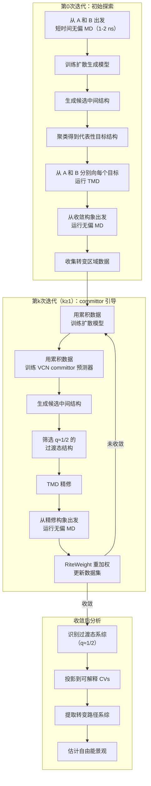
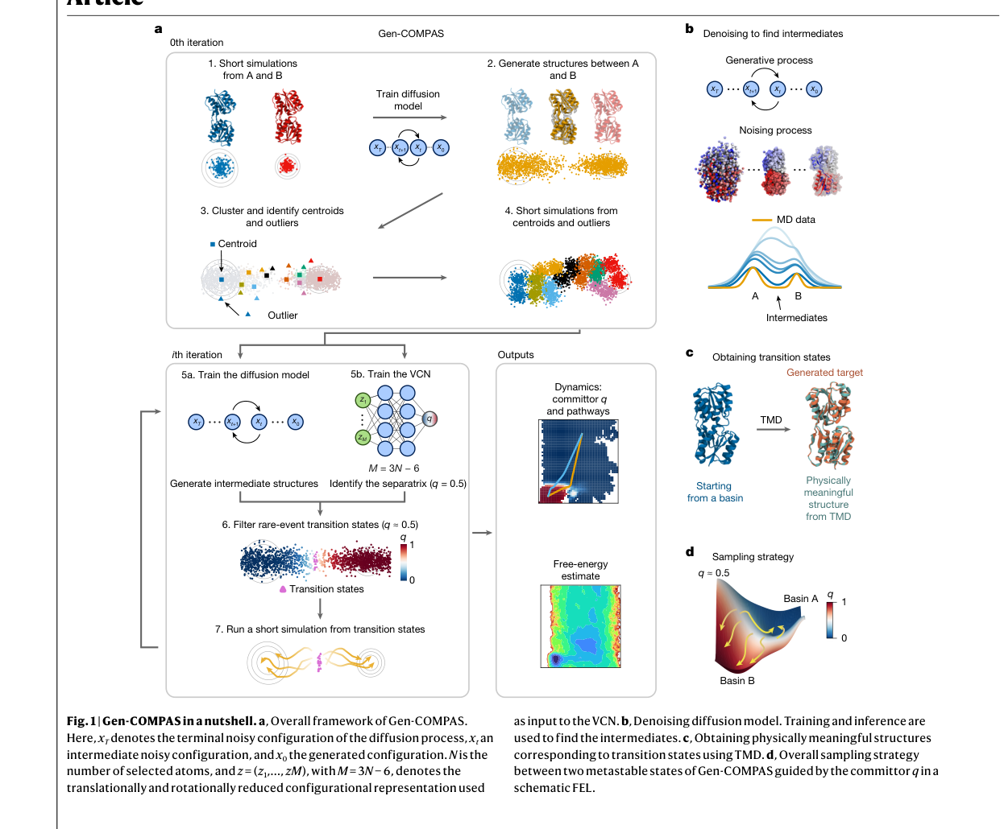
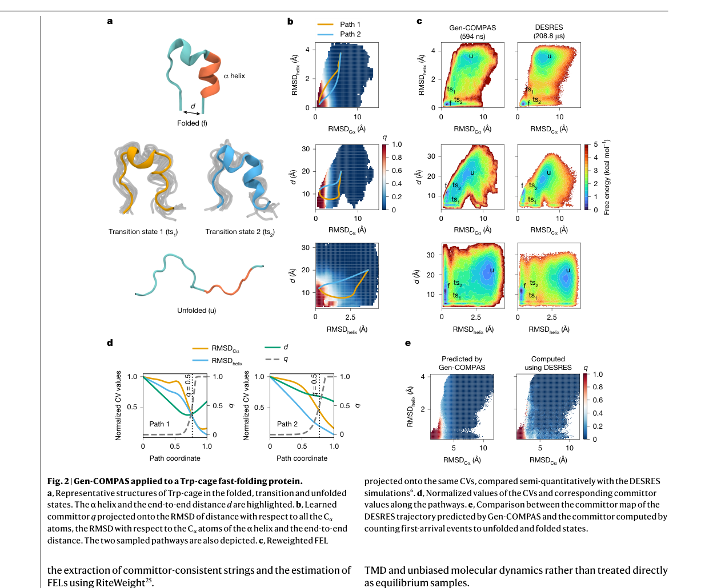
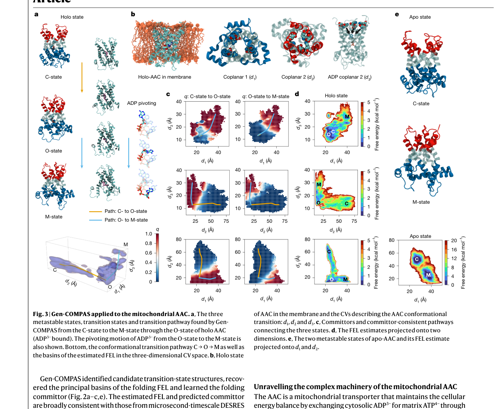
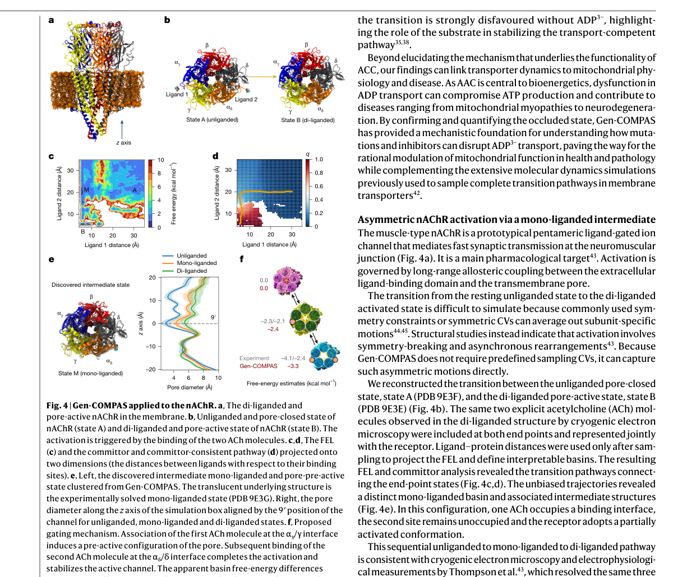

# 生成式采样打破时间尺度壁垒：无需预设反应坐标的构象转变模拟新框架

## 本文信息

- **标题**: Breaking timescales with generative sampling of conformational transitions
- **作者**: Chenyu Tang, Mayank Prakash Pandey, Cheng Giuseppe Chen, Alberto Megias, François Dehez, Christophe Chipot
- **发表期刊**: Nature
- **发表时间**: 2026年9月9日（在线发表）
- **单位**: 法国洛林大学理论与物理化学实验室（LPCT）；西班牙马德里理工大学；美国芝加哥大学；美国伊利诺伊大学厄巴纳-香槟分校
- **DOI**: https://doi.org/10.1038/s41586-026-11025-1
- **引用格式**: Tang, C., Pandey, M. P., Chen, C. G., Megias, A., Dehez, F., & Chipot, C. (2026). Breaking timescales with generative sampling of conformational transitions. *Nature*. https://doi.org/10.1038/s41586-026-11025-1
- **代码与数据**: https://github.com/Tangcyu/Gen-COMPAS

## 摘要

> 分子转变，包括蛋白质折叠、别构效应和膜转运，是生物功能的核心，但用标准分子动力学模拟这些稀有事件极为困难。增强采样方法计算成本高昂，且常依赖任意选择的集合变量，容易引入偏倚。本文提出 **Gen-COMPAS**，一个生成式、以 committor 引导的路径采样框架，能在**不需要预设集体变量**的前提下，以可接受的计算成本重建转变路径。它将去噪扩散概率模型与基于 committor 的过滤耦合：扩散模型生成结构合理的中间目标，committor 筛选识别过渡态。从这些中间态出发的短时间无偏模拟，在纳秒至亚微秒累计尺度上即可产生转变区域系综，而传统方法需要高出数个数量级的采样量。将该框架应用于从微型蛋白到五聚体配体门控离子通道的多个体系，Gen-COMPAS**仅从已知的端点结构出发**就恢复了 committor、过渡态和自由能景观，无需预设反应坐标或先验机理知识。

### 核心结论

- **Gen-COMPAS 无需预设集体变量**，仅从端点结构出发即可重建转变路径、过渡态系综和自由能景观。
- 在 Trp-cage 折叠中，Gen-COMPAS 仅用 **594** 纳秒的累计无偏采样就恢复了与 **208** 微秒 DESRES 模拟一致的折叠机制，采样量相差约 **350** 倍。
- 在线粒体 ADP/ATP 载体（AAC）中，Gen-COMPAS 揭示了清晰的 **C→O→M 转运机制**，证实了长期假设的 **occluded态**（闭塞态）是转运循环的必要步骤。
- 在肌肉型 nAChR 激活中，Gen-COMPAS 发现了**单配体中间态**，揭示了**不对称的逐步激活机制**，与冷冻电镜和电生理实验一致。
- 生成的结构只作为**提议目标**，必须经过**靶向分子动力学精修**（TMD）和**无偏模拟验证**后才能用于动力学和热力学估计。

### 创新点

1. **无预设 CV 的生成式采样框架**：Gen-COMPAS 将去噪扩散概率模型与 committor 引导的过滤耦合，不需要预设反应坐标即可从端点结构探索转变区域。
2. **迭代反馈循环**：生成模型提议结构 → TMD 从两端精修 → 无偏模拟产生转变区域数据 → 用累积数据重新训练生成模型和 committor 预测器，逐步将采样聚焦于过渡区域。
3. **基于 Z-matrix 内部坐标的 committor 学习**：使用完整的 3N-6 个内部坐标作为 VCN 的输入，**避免预设 CV 的选择偏差**，同时保持物理可解释性。
4. **RiteWeight 重加权**：把非平衡轨迹系综重加权为稳态分布，这样就能从短时间无偏模拟中估计自由能景观。

## 背景

分子转变是生物功能的核心：蛋白质折叠决定其功能构象，别构效应调控信号传导，膜转运蛋白控制物质进出细胞。这些过程都涉及**从一种亚稳态到另一种亚稳态的稀有跃迁**，时间尺度通常在微秒到秒之间。直接用暴力分子动力学模拟这些事件，对大多数体系来说计算成本都难以接受。

增强采样方法通过沿反应坐标（通常是一组集体变量 CVs）偏置动力学来解决这一问题，同时重建热力学可观测量。然而，**其有效性取决于所选 CVs 能否捕获相关的慢自由度**。不完整的 CVs 可能掩盖亚稳态或扭曲路径探索。基于弦的方法提供了基于路径的描述，但**当初始路径远离主导转变管时，其精修可能代价高昂或收敛到次优路径**。即使 CVs 有信息量，不恰当的偏置也可能将系统驱离热力学平衡，或以非预期方式扭曲分子结构。

过渡路径理论（TPT）将 **committor 函数 q** 确定为最优反应坐标，并为构建 committor 一致的弦提供了基础。基于 TPT 的深度学习方法已经让研究大型构象转变成为可能，最近的变分公式允许从偏置路径-CV 采样中迭代学习 q 和 committor 一致的弦。笛卡尔空间模型进一步减少了对显式降维的依赖。然而，**这些方法需要由增强采样提供的转变数据**。

生成式方法和 MD 引导的方法，包括 Boltzmann 生成器、MDGen、BioEmu、轨迹预测器和过渡路径采样器，以数据驱动的方式学习平衡系综、代理动力学或转变提议。这些进展推动了**将机器学习结构提议与显式哈密顿量动力学相结合的方法**。但很多模型依赖大规模预训练、修改的动力学或预先存在的转变数据，而新的稀有事件往往没有这些信息。**仅凭少数几个起始结构，同时获得动力学和机理量（如 committor、过渡态和路径）以及热力学可观测量（如重加权 FELs），仍然很困难**。这一困境在涉及膜耦合、配体结合、结构域重排和多个慢自由度的异质生物分子组装体中尤为明显。

### 关键科学问题

1. **如何在不预设集体变量的情况下采样稀有事件**？传统增强采样方法需要预先选择 CVs，而不完整的 CVs 会导致机理扭曲。能否直接从端点结构出发，让算法自行发现转变路径？
2. **如何以可接受的计算成本获得定量的动力学和热力学信息**？暴力 MD 需要微秒到秒级的模拟，增强采样方法需要大量偏置模拟。能否在纳秒到亚微秒尺度上重建转变系综？
3. **如何验证生成的结构是物理真实的**？生成式模型可能产生看起来合理但动力学上无意义的结构。如何确保生成的结构位于真实的过渡路径上？

## 研究内容

### Gen-COMPAS 框架总览

Gen-COMPAS 的核心思想是：**从两个已知的端点状态（反应物 A 和产物 B）出发，通过迭代的“生成-精修-采样-学习”循环，逐步探索连接 A 和 B 的转变区域**。整个流程如下图所示：

**图1：Gen-COMPAS 概览**。（a）整体框架：第0次迭代用短时间无偏 MD 训练扩散模型，生成中间结构，聚类后用 TMD 从两端收敛，再运行无偏 MD 收集转变区域数据；第 k 次迭代在累积数据上重新训练扩散模型和 VCN，用 committor 过滤挑选过渡态，TMD 精修后运行无偏 MD 并用 RiteWeight 更新数据，直到收敛。（b）去噪扩散模型示意：从高斯噪声逐步去噪得到合理中间结构。（c）从生成目标经 TMD 获得物理意义构象。（d）在 committor 引导的采样后估计自由能景观。

迭代工作流的核心步骤可以概括为：

1. **初始化**：从端点状态 A 和 B 出发，运行短时间无偏 MD（1-2 ns），收集初始数据集。
2. **训练扩散模型**：在初始数据上训练去噪扩散概率模型（DDPM），生成连接 A 和 B 的候选中间构象。
3. **聚类与 TMD 精修**：第一次迭代尚无 committor 模型，对生成构象聚类得到代表性目标，然后从 A 和 B 分别向每个目标运行**靶向分子动力学（TMD）**，识别从两端都可及的构象。
4. **无偏采样**：从 TMD 收敛的构象出发运行无偏 MD，获得转变区域的初始采样。
5. **迭代循环**（从第二次迭代开始）：
   - 用累积模拟数据训练扩散模型和**变分 committor 网络（VCN）**。
   - 生成候选中间构象，用 VCN 评估其 committor 值。
   - 选择 **q≈1/2** 的构象作为过渡态目标，位于 separatrix 附近。
   - 对这些目标进行 TMD 精修，然后从精修构象出发运行无偏 MD。
   - 用 **RiteWeight** 对轨迹重加权，更新数据集。
   - 重复直到 committor、TMD 一致性和重加权 FEL 诊断不再变化。

关键设计原则是：生成的结构只是**提议目标**，不是平衡样本或最终过渡态；TMD 仅用于精修，**排除在动力学和热力学估计之外**。

### 核心方法

Gen-COMPAS 由四个模块组成：去噪扩散概率模型（DDPM）生成候选中间结构；变分 committor 网络（VCN）用完整的 Z-matrix 内部坐标学习 q，无需预设 CV；TMD 将生成目标从端点精修成物理合理构象；RiteWeight 将非平衡无偏轨迹重加权为稳态分布。详细的公式和实现可参见[附录：Gen-COMPAS 方法详解](2026-09-14-gen-compas-methods.md)。

这套设计的核心是**把扩散模型的生成提议与 TMD/无偏 MD 的物理验证拆开**。扩散模型不看物理力场，可能给出几何上合理但能量上不可达的构象；TMD 把这些构象从端点拉向提议目标，只有两端都能收敛的结构才会被留下。随后从收敛点跑的无偏 MD 直接在真实哈密顿量下演化，产出的轨迹才用来估计动力学和热力学量。RiteWeight 解决的是一个更微妙的问题：这些轨迹的初始点并不是按 Boltzmann 分布采的，它们来自 TMD 端点和 separatrix 附近，必须用转移矩阵迭代重加权才能还原稳态分布。没有这个重加权步骤，FEL 的盆地高度会被人为偏置。

### 结果一：Trp-cage 折叠与微秒级模拟的一致性

Trp-cage 是一个 20 残基的快速折叠微型蛋白，是蛋白质折叠研究的经典基准体系。Gen-COMPAS 仅从**折叠态和去折叠态**的端点结构出发，成功识别了候选过渡态结构，恢复了折叠 FEL 的主要盆地，并学习了折叠 committor。

**图2：Gen-COMPAS 应用于 Trp-cage 折叠**。（a）折叠态、过渡态和去折叠态的代表性结构，标出 α 螺旋和端到端距离 d；两种过渡态分别对应早螺旋成核与疏水塌缩路径。（b）学习的 committor q 投影到三个 CV：全 Cα 原子的 RMSD、α 螺旋 Cα 原子的 RMSD 和端到端距离 d，黄色/蓝色曲线分别表示两条竞争路径。（c）重加权 FEL 投影到相同 CV，左为 Gen-COMPAS（594 ns），右为 DESRES（208 μs），色标表示自由能（kcal/mol）。（d）沿路径的归一化 CV 值和对应 committor。（e）Gen-COMPAS 预测的 committor 图与 DESRES 轨迹计算的 committor 图对比，右侧色标为 q 值。

> **594 ns 累计采样即可与 208 μs DESRES 轨迹半定量一致**，不是因为统计误差已经衰减到同一水平，而是 Gen-COMPAS 直接把采样聚焦到转变区域，用少得多的轨迹预算覆盖了关键路径。

**关键发现**：

- Gen-COMPAS 的 FEL 和 committor 与 DESRES 微秒级模拟**半定量一致**。力场、有限采样和重加权程序不完全相同，因此比较是半定量的。
- Aimless shooting 独立验证了学习的 committor，与先前基于 committor 的 TPS 研究一致。
- committor 和 TSE 分析揭示了**分叉的折叠机制**，有两条主导竞争路径：
  - **路径1**：早期螺旋成核，随后核心巩固。
  - **路径2**：以中心色氨酸残基周围的关键三级接触的疏水塌缩开始，螺旋形成滞后。
- Gen-COMPAS 使用 **594** ns 的累计无偏采样，而 DESRES 验证轨迹为 **208** μs。**约 350** 倍的轨迹长度差异反映的是采样预算的比较，而非统计误差的渐近衰减或墙钟时间，更短的传统 MD 模拟也可能产生可比的可观测量。

### 结果二：线粒体 ADP/ATP 载体，揭示 C→O→M 转运机制

AAC 是一种线粒体转运蛋白，通过严格的**一对一反向转运机制**将胞质 ADP³⁻ 与基质 ATP⁴⁻ 交换，维持细胞能量平衡。由于线粒体内膜对核苷酸不通透，AAC 为氧化磷酸化所需的 ADP 提供了必需入口。转运蛋白通过**交替访问机制**在胞质开放（C）态和基质开放（M）态之间循环。生化和计算研究提出了一个瞬时的 **occluded 态**（O 态），其中底物被封闭在中央腔内，与膜两侧隔离。然而，直接观察完整转运路径一直很困难，传统 MD 很少采样到这些中间构型之间的转变。

**图3：Gen-COMPAS 应用于线粒体 AAC**。（a）holo AAC（ADP³⁻ 结合）从 C 态经 O 态到 M 态的三个亚稳态、过渡态和转变路径，以及三维 CV 空间中的 C→O→M 路径和估计 FEL 盆地。（b）膜中 holo AAC 的结构和三个可解释 CV：d1 描述胞质盐桥网络开放，d2 描述基质盐桥网络开放，d3 描述 ADP³⁻ 在中央腔内的位置。（c）连接三个状态的 committor 和 committor 一致路径，色标为 q。（d）投影到二维的 FEL 估计，色标为自由能（kcal/mol）。（e）apo-AAC 的两个亚稳态及其在 d1-d2 上的 FEL 估计，apo 景观缺乏 occluded 盆地。

> **occluded 态不是可选项，而是转运循环的必要步骤**：没有 ADP³⁻ 时 C-M 势垒高达约 10 kcal/mol，底物将一条高垒路径变成了可行走的 C→O→M 路径。

**关键发现**：

- Gen-COMPAS 重建了 ADP³⁻ 转运路径，识别出清晰的 **C→O→M 机制**：ADP³⁻ 在胞质开放态结合，通过跨膜螺旋的协调重排被瞬时闭塞，随后随着 AAC 采用基质开放构象被释放到基质中。
- 这些结果**支持长期假设的 occluded 构型是转运循环的必要步骤**。
- 将采样投影到三个可解释 CV（post-simulation 定义）：
  - d1：胞质盐桥网络的开放。
  - d2：基质盐桥网络的开放。
  - d3：ADP³⁻ 在中央腔内的位置。
- FEL 揭示了对应 C、O 和 M 态的 distinct basins，势垒与转运蛋白的螺旋门控运动一致。
- **apo vs holo 对比**：holo 系统中 C→O 和 O→M 势垒分别约为 **2.5** kcal/mol 和约 **2** kcal/mol；apo 景观**缺乏 occluded 盆地**，C-M 之间势垒高达约 **10** kcal/mol。这说明**没有 ADP³⁻ 时转变强烈不利**，凸显了底物在稳定转运能力路径中的作用。
- AAC 功能障碍会损害 ATP 产生，导致从线粒体肌病到神经退行性疾病的多种疾病。确认和量化 occluded 态为理解突变和抑制剂如何破坏 ADP³⁻ 转运提供了机理基础。

### 结果三：肌肉型 nAChR 激活，发现单配体中间态

肌肉型 nAChR 是一个原型五聚体配体门控离子通道，介导神经肌肉接头的快速突触传递。激活由胞外配体结合域和跨膜孔之间的**长程别构耦合**控制。

**图4：Gen-COMPAS 应用于 nAChR**。（a）膜中双配体结合、孔开放的 nAChR。（b）无配体孔闭合态（状态 A，PDB 9E3F）和双配体孔活跃态（状态 B，PDB 9E3E），激活由两个 ACh 分子结合触发。（c）FEL 投影到两个维度（配体与其结合位点的距离）。（d）committor 和 committor 一致路径，色标为 q。（e）左：Gen-COMPAS 发现的中间单配体孔预活跃态，半透明底层结构为实验解析的单配体态（PDB 9E3G）；右：无配体、单配体和双配体状态的孔直径轮廓，横轴为孔轴向（z）位置。（f）提出的门控机制：第一个 ACh 在 αγ/γ 界面结合诱导部分重排和预激活孔构型，第二个 ACh 在 αδ/δ 界面结合完成激活并稳定活跃通道。

> nAChR 的激活不是对称开关，而是**先单后双的异步过程**：单个 ACh 结合就足以让受体进入部分激活构象，第二个 ACh 只是把通道推过 separatrix。

**关键发现**：

- 从无配体孔闭合态（PDB 9E3F）和双配体孔活跃态（PDB 9E3E）出发，Gen-COMPAS 重建了转变路径。
- **无偏轨迹揭示了一个明显的单配体盆地和相关的中间结构**：一个 ACh 占据一个结合界面，第二个位点未占据，受体采用部分激活构象。
- **顺序的无配体→单配体→双配体路径与 Thompson 等人的冷冻电镜和电生理测量一致**，他们解析了相同的三个状态并显示激动剂结合是顺序的。
- 实验结构和模拟都支持**不对称的单配体中间态**，其中一个主亚基是活跃样的，而相邻亚基保持不活跃但已准备好激活。
- 模拟进一步表明：**ACh 在 αγ/γ 界面的结合诱导部分重排和预激活孔构型；随后在 αδ/δ 界面的结合完成激活并稳定活跃通道**。
- 积分 FEL 盆地给出的表观自由能差异落在实验动力学方案推断的范围内（半定量比较）。

### 核心方法对比

| 特性 | Gen-COMPAS | 传统增强采样 | 基于 TPS 的方法 |
| --- | --- | --- | --- |
| 预设 CVs | **不需要**（Z-matrix 内部坐标） | 必需 | 可能需要 |
| 初始数据 | 仅端点结构 | 端点结构+CV 选择 | 需要转变数据 |
| 采样尺度 | 纳秒-亚微秒 | 微秒-毫秒 | 取决于偏置 |
| 生成模型 | DDPM | 无 | 无 |
| Committor 学习 | VCN（迭代） | 后处理 | 核心 |
| 重加权 | RiteWeight | 各种 | 各种 |
| 多状态扩展 | 可分解为连续段 | 复杂 | 复杂 |

这张对照表说明 Gen-COMPAS 的代价：它用生成模型和迭代学习替代了传统方法里“人选手动选 CV”的步骤，但并不是零成本。DDPM 和 VCN 的训练、多次 TMD 和无偏 MD 的运行、RiteWeight 的收敛检查，都需要计算资源。真正的节省来自于采样被直接聚焦到转变区域，而不是花在盆地内部漫长的平衡化上。对于那些盆地很大、转变很稀有的体系，这种聚焦带来的收益最显著。

## 关键结论与批判性总结

### 本文影响

- **Gen-COMPAS 提供了一个从端点结构出发、无需预设反应坐标的通用框架**，用于探索稀有事件转变，在纳秒-亚微秒尺度上重建转变路径、过渡态和自由能景观。
- 在 Trp-cage 中，**采样量比微秒级 DESRES 模拟少约 350 倍**，同时保持半定量一致，展示了生成式采样在打破时间尺度壁垒方面的潜力。
- 在 AAC 中，**证实了长期假设的 occluded 态**是 ADP³⁻ 转运的必要步骤，并量化了底物对转变势垒的影响（holo 约 2.5 kcal/mol vs apo 约 10 kcal/mol）。
- 在 nAChR 中，**发现了单配体中间态**，揭示了不对称逐步激活机制，与冷冻电镜和电生理实验一致。
- 该框架**原则上可扩展到更高保真度的哈密顿量**（如从头算分子动力学或机器学习力场），为未来多尺度模拟提供了灵活的平台。

### 研究局限性

（基于原文 Discussion 和补充信息）

- **重加权 FEL 的全局平衡收敛性并非对所有复杂体系都已建立**。FEL 可以揭示亚稳态盆地、势垒和转变区域，但全局 A→B 自由能差异仍是估计值。作者建议将这些 FEL 用于**局部和路径级观察**，并在需要更严格收敛时用识别的 TSEs**播种增强采样或 TPS**。
- **工作流可能遗漏未连接到给定盆地的路径**，或未被提议和精修循环到达的路径。结果依赖于端点结构和状态定义、力场、转变区域覆盖度以及生成和 committor 模型的准确性。
- **生成的结构仅在 MD 精修和验证后才具有物理可解释性**。TMD 仅用于精修，排除在动力学和热力学估计之外。
- **多状态体系需要分解为连续段**，每段学习一个二状态 committor，可能遗漏并行或协同路径。
- **计算成本仍然可观**。虽然比暴力 MD 少几个数量级，但对大型膜蛋白体系（如 nAChR）仍需数百纳秒的累计无偏采样和多次 TMD/生成循环。

### 未来方向

- **扩展到多状态转变网络**：将框架从二状态扩展到反应网络，处理多个亚稳态之间的复杂转变。
- **与更高保真度哈密顿量耦合**：将 Gen-COMPAS 与从头算分子动力学或机器学习力场结合，提高物理准确性。
- **改进生成模型**：结合等变图神经网络或扩散模型的改进架构，提高生成结构的物理合理性和多样性。
- **增强 committor 学习**：探索更高效的 VCN 架构或主动学习策略，减少训练数据需求。
- **与实验验证闭环**：将 Gen-COMPAS 预测的过渡态结构用于指导实验设计（如突变、交联、光谱），形成计算-实验迭代循环。
- **应用于药物发现**：利用 Gen-COMPAS 探索靶点蛋白的别构转变或配体结合路径，指导别构药物设计。