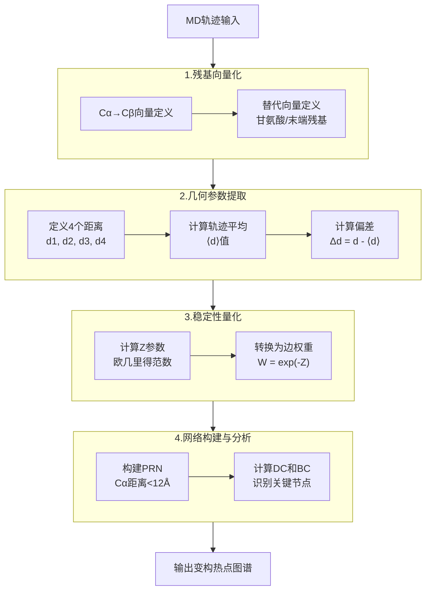
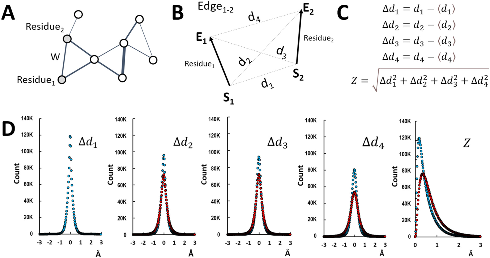
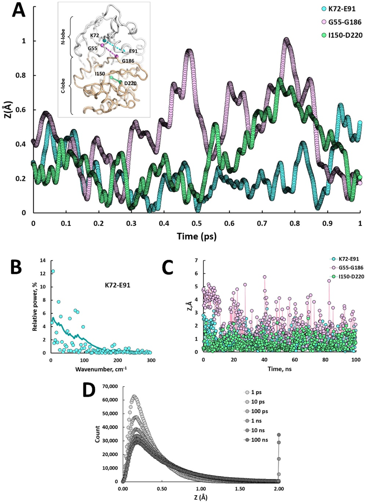
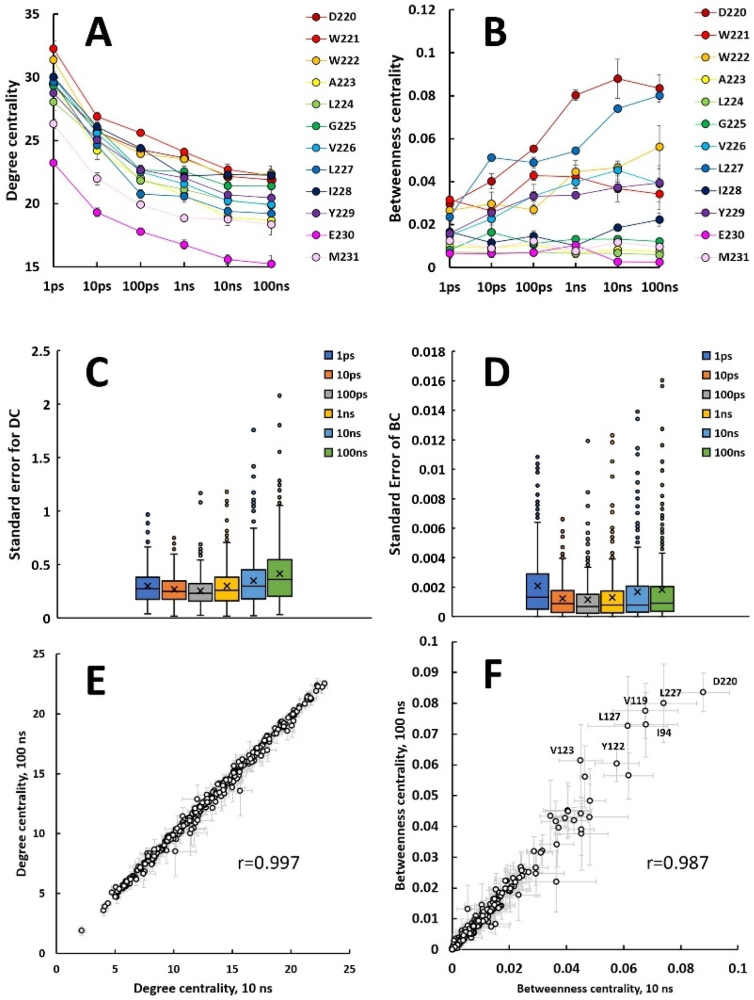
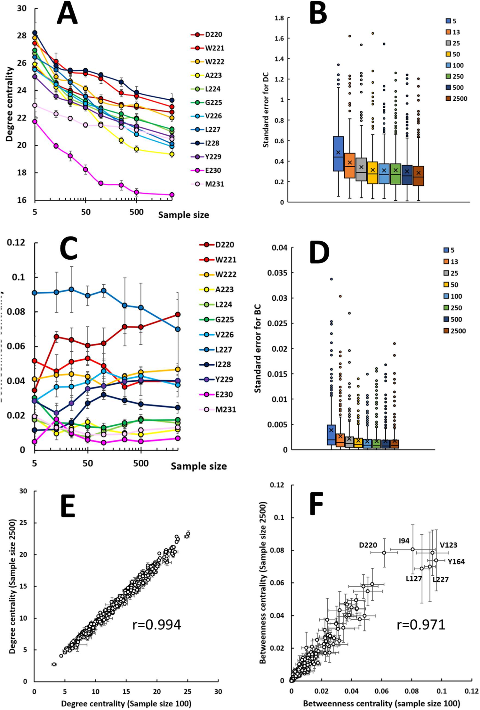
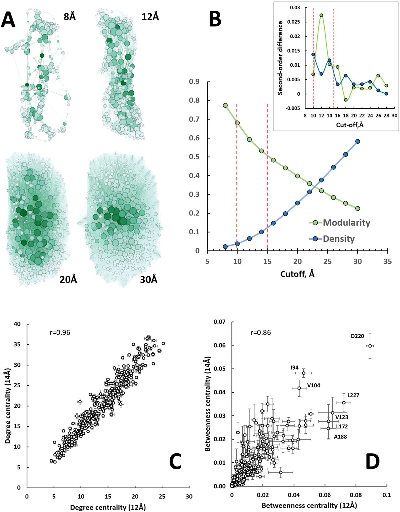
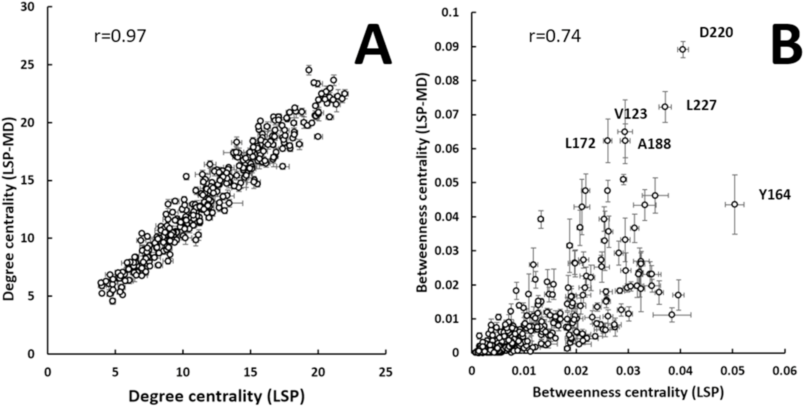

# LSP-MD：捕捉热振动驱动变构效应的快速计算方法

## 本文信息

- **标题**：LSP-MD: A Fast Computational Method to Study Allostery Driven by Thermal Vibrations
- **作者**：Alexandr P. Kornev
- 发表时间: 2025年11月4日
- **单位**：LSP Consulting LLC（美国加利福尼亚州）
- **引用格式**：Kornev, A. P. (2025). LSP-MD: A Fast Computational Method to Study Allostery Driven by Thermal Vibrations. *Journal of Chemical Theory and Computation*, *21*(21), 8699-8710. https://doi.org/10.1021/acs.jctc.5c01094
- **源代码/软件**：论文未公开代码，但LSP Consulting LLC提供与LSP相关方法的咨询服务和许可证（见Conflict of Interest声明）

## 摘要

> 与**热振动相关的构象熵**在蛋白质功能中发挥根本性作用，从配体结合和催化到变构调节。Cooper和Dryden首次将**熵驱动变构**作为这些效应的一个例子提出。然而，测量底层热运动在技术上仍然具有挑战性。在此，我们介绍了**LSP-MD**，这是一种建立在局部空间模式（LSP）对齐基础上的计算方法，用于跟踪分子动力学（MD）模拟中的**侧链稳定性**。LSP-MD使用基于图的**蛋白质残基网络（PRNs）**，其边权重来源于**快速的局部几何涨落**。应用于蛋白激酶A（PKA）时，该方法捕获了**皮秒时间尺度的振动**，振幅在0-2Å范围内，频率低于100 $\mathrm{cm^{-1}}$，正好在熵介导信号传导的范围内。从LSP-MD网络导出的**中心性指标**在不同模拟长度、向量定义和力场下保持稳定，确认了鲁棒性。重要的是，LSP-MD重现了传统LSP分析的关键发现，同时提供了**更清晰的物理基础**和**更高的计算效率**。该方法为探索各种大分子系统中的**熵驱动变构行为**开辟了新机会。

### 核心结论

- **热振动的直接测量**：LSP-MD方法首次实现了对皮秒时间尺度热振动的直接量化，捕获了振幅0-2Å、频率低于100 $\mathrm{cm^{-1}}$的振动模式
- **网络化稳定性分析**：通过基于蛋白质残基网络（PRN）的中心性指标，将局部几何涨落转化为全局变构信号
- **计算效率提升**：相比传统LSP对齐方法，LSP-MD消除了耗时的模式搜索和结构映射步骤，可将500帧轨迹分析，而传统方法仅能处理100帧
- **方法鲁棒性验证**：中心性指标在不同模拟长度（10-100 ns）、采样率、向量定义和力场（ff14SB与CHARMM36）下保持高度稳定
- **物理意义明确**：用单一物理参数Z（几何偏差的欧几里得范数）量化残基对稳定性，替代了传统方法的ad hoc参数

## 背景

蛋白质在沿着折叠漏斗向其天然结构滑动时，随着结构变得更加有序，其熵会减少。然而，即使在折叠完成后，侧链仍然保留了相当大的流动性。这种**残留熵**，也称为**构象熵**，在蛋白质功能中发挥着重要作用。在他们最近的综合综述中，Wankowicz和Fraser证明这些熵效应是蛋白质动力学的普遍特征，影响着从配体结合特异性到酶催化、从蛋白质稳定性到变构信号传导的各个方面。这些效应在**变构调节**中尤其重要，其中配体在一个位点的结合会通过结构变化或动力学效应远程影响另一个位点的功能。

早在1984年，Cooper和Dryden就提出了一个革命性的概念：**蛋白质的变构效应可以完全由熵变化驱动，而不需要明显的结构重排**。他们计算表明，侧链构象熵的微小变化（每个残基约0.4-1.2 kJ/mol）就足以产生显著的变构效应。这一预测在过去几十年中得到了实验支持。核磁共振（NMR）弛豫测量、异核核Overhauser效应和顺序参数分析等实验技术已经能够直接探测这些快速的热运动。然而，这些实验方法通常需要昂贵的设备、专业的样品制备（如同位素标记），并且难以获得全原子级别的分辨率。

从计算角度看，**分子动力学（MD）模拟提供了研究这些热振动的理想工具**。现代MD模拟可以在飞秒时间分辨率下跟踪每个原子的运动，理论上可以捕获从皮秒到毫秒时间尺度的所有动力学过程。然而，从海量轨迹数据中提取有意义的变构信号仍然是一个巨大的挑战。传统的分析方法要么过于简化（如均方根偏差分析），要么计算成本过高（如全原子互相关分析）。

为了解决这个问题，Kornev等人此前开发了**局部空间模式（LSP）对齐方法**，用于比较蛋白质晶体结构并识别侧链稳定性的变化。LSP方法通过将残基表示为向量，并分析不同结构中残基对之间几何关系的变化，成功捕获了与变构相关的稳定性模式。然而，传统LSP方法依赖于大量晶体结构的比较，且需要进行穷举式的模式搜索和结构映射，**计算成本高昂**，限制了其在MD轨迹分析中的应用。

### 关键科学问题

- **热振动的量化难题**：如何从MD模拟的海量轨迹数据中提取出真正与变构相关的微小热振动信号，而不是被其他大尺度构象变化所淹没
- **时间尺度的匹配问题**：变构相关的热振动主要发生在皮秒到纳秒时间尺度，如何设计专门针对这一时间尺度的高效分析方法
- **物理意义的阐释**：如何将抽象的网络拓扑参数与具体的物理过程（热振动、构象熵）联系起来，提供明确的物理解释
- **计算效率与准确性的平衡**：如何在保持对变构信号敏感的同时，大幅降低计算成本，使方法能够应用于大规模的MD轨迹分析

### 创新点

- **LSP-MD方法框架**：提出了一种全新的MD轨迹分析方法，直接在轨迹内量化残基对的稳定性，无需与外部参考结构比对
- **Z参数的引入**：使用几何偏差的欧几里得范数作为单一稳定性指标，具有明确的物理意义，替代了传统LSP方法的ad hoc参数
- **网络化变构分析**：将局部稳定性信息转化为PRN的边权重，通过网络中心性指标（DC、BC）识别关键的变构节点
- **系统性的参数优化**：系统研究了模拟时间、样本大小、距离截断等参数对结果的影响，提供了标准化的分析流程
- **方法验证与对比**：与传统LSP对齐方法进行了系统对比，证明新方法不仅计算效率更高，而且保留了原有的核心发现

---

## 研究内容

### LSP-MD方法的原理与实现

#### 核心思想：从几何涨落到网络权重

LSP-MD的核心思想是将MD轨迹中每个残基对的局部几何稳定性量化为一个单一的物理参数，然后将其转化为蛋白质残基网络（PRN）的边权重，通过网络分析识别关键的变构节点。

**方法的具体实现步骤**如下：

1. **残基向量化**：将每个残基表示为一个向量，通常从Cα指向Cβ。对于甘氨酸（没有Cβ）或其他特殊情况，可以使用替代定义（如N-Cα或质心-Cα）

2. **距离定义**：对于两个残基的向量对（残基i的向量为$\mathbf{v}_i$，残基j的向量为$\mathbf{v}_j$），定义四个距离：
   - $d_1$：残基i的起点到残基j的起点
   - $d_2$：残基i的起点到残基j的终点
   - $d_3$：残基i的终点到残基j的起点
   - $d_4$：残基i的终点到残基j的终点

3. **轨迹平均**：计算整个MD轨迹中这四个距离的平均值$\langle d_1 \rangle, \langle d_2 \rangle, \langle d_3 \rangle, \langle d_4 \rangle$

4. **几何偏差计算**：对于轨迹中的每一帧，计算四个距离的偏差$\Delta d_k = d_k - \langle d_k \rangle$（k=1,2,3,4）

5. **Z参数计算**：将四个偏差组合为单一参数Z，使用欧几里得范数：

$$
Z = \sqrt{(\Delta d_1)^2 + (\Delta d_2)^2 + (\Delta d_3)^2 + (\Delta d_4)^2}
$$

6. **边权重转换**：将Z值转换为边权重W，使用公式$W = \exp(-Z)$。这样稳定的残基对（小Z）获得高权重，不稳定的残基对（大Z）获得低权重

7. **网络构建**：仅当两个残基的Cα原子距离小于截断值（通常为12Å）时，在它们之间创建边

8. **中心性分析**：计算加权PRN中每个节点的度中心性（DC）和介数中心性（BC），识别关键的变构节点

#### Z参数的物理意义

Z参数是LSP-MD方法的**核心创新**，它具有明确的物理意义：

- **几何稳定性的直接度量**：Z值反映了残基对之间**相对几何关系**偏离其轨迹平均状态的程度。小Z值表示残基对的相对位置保持稳定，大Z值表示几何关系波动较大

- **热振动幅度的表征**：在PKA的10纳秒模拟中，Z值主要分布在0-2Å范围内，这与**热振动引起的小幅度构象变化**一致

- **频率选择性**：通过快速傅里叶变换（FFT）分析发现，Z值变化的频率分量主要集中在100 $\mathrm{cm^{-1}}$以下，正好对应于**热激发模式的频率范围**（<200 $\mathrm{cm^{-1}}$）

#### 与传统LSP对齐方法的区别

传统LSP对齐方法需要比较多个实验结构（通常是不同配体结合状态的晶体结构），通过穷举式的模式搜索和结构映射来识别侧链稳定性的变化。这种方法的主要限制包括：

- **依赖实验结构**：需要多个高质量的晶体结构，限制了其应用范围
- **计算成本高昂**：模式搜索和结构映射步骤耗时长，难以处理大量轨迹数据
- **参数ad hoc**：使用人为设定的阈值参数，缺乏明确的物理意义

相比之下，LSP-MD方法的优势在于：

- **直接分析轨迹**：不需要外部参考结构，直接在MD轨迹内分析
- **物理参数驱动**：使用具有明确物理意义的Z参数
- **计算高效**：消除了耗时的模式搜索和结构映射步骤

**图1：LSP-MD方法的局部稳定性测量原理**

该图系统展示了LSP-MD如何量化MD轨迹中的残基对几何稳定性：

- **(A) 蛋白质残基网络（PRN）构建示意图**：网络中的节点对应蛋白质残基，节点之间的边表示残基间的邻近关系。边的权重基于残基对的构象稳定性计算得到，稳定性高的残基对赋予高权重（粗线），稳定性低的残基对赋予低权重（细线）

- **(B) 残基向量化的几何定义**：每个残基用带有起点（S，通常为Cα）和终点（E，通常为Cβ）的向量表示。两个残基向量之间的相对几何关系通过四个距离描述：d1（残基i的S点到残基j的S点）、d2（残基i的S点到残基j的E点）、d3（残基i的E点到残基j的S点）、d4（残基i的E点到残基j的E点）。这种四距离定义完全刻画了两个向量的相对位置和朝向

- **(C) Z参数的计算流程**：对于MD轨迹中的每一帧，计算四个距离相对于轨迹平均值的偏差（Δd1, Δd2, Δd3, Δd4），其中平均值用尖括号⟨d⟩表示。这四个偏差通过欧几里得范数组合为单一参数Z = √[(Δd1)² + (Δd2)² + (Δd3)² + (Δd4)²]。Z值越大表示残基对几何关系波动越大，Z值越小表示越稳定

- **(D) PKA系统的距离偏差分布**：散点图展示了蛋白激酶A（PKA）在10 ns模拟中的统计结果。**蓝色点**：使用标准Cα→Cβ向量定义测量的结果；**红色点**：使用长侧链向量定义（对精氨酸、赖氨酸等使用Cα→侧链末端原子）的结果。横轴为四个距离偏差Δd的平均值，纵轴为组合后的Z值。**关键发现**：大多数Δd值落在±1 Å范围内，Z值集中在0-2 Å范围，这反映了热振动的典型幅度

### 应用案例：蛋白激酶A的热振动分析

#### 系统选择与模拟设置

蛋白激酶A（PKA）是研究变构调节的经典模型系统。PKA具有典型的双叶激酶折叠，包括较小的N叶（主要包含β折叠）和较大的C叶（主要包含α螺旋）。两叶之间的铰链区域包含了催化位点和多个关键的调节元件，如glycine-rich loop和αC-螺旋。

研究者使用PKA的催化亚基进行测试，模拟设置如下：

- **初始结构**：PDB ID 1ATP（ATP结合状态的PKA催化亚基）
- **力场**：AMBER ff14SB
- **溶剂**：TIP3P水模型，10Å溶剂缓冲
- **离子**：添加Na⁺/Cl⁻以中和电荷并达到150 mM盐浓度
- **平衡**：逐步加热至300 K，压强1 atm
- **生产模拟**：
  - 高分辨率轨迹：10 ps，0.5 fs时间步长（用于捕获皮秒振动）
  - 常规轨迹：10-100 ns，2 fs时间步长（用于稳定性分析）
- **软件**：AMBER 20

#### 皮秒时间尺度的热振动特征

**高分辨率模拟（0.5 fs步长）**揭示了PKA中残基对几何关系的超精细变化。图2A展示了三个代表性残基对在1 ps轨迹内的Z值演化：

- **K72-E91盐桥**：连接N叶β折叠和调节性αC-螺旋的普遍保守盐桥，被视为激酶活性态的标志。该盐桥在1 ps内的Z值变化极其微小（千分之一埃量级），展现了极高的稳定性

- **I150-D220**：位于C叶内部的残基对，相对稳定但比盐桥更灵活一些

- **G55-G186**：连接glycine-rich loop和DFG基序的残基对，代表了分子中最可动的区域之一。Z值变化最为明显，反映了该区域的高度流动性

这些超精细轨迹显示了LSP-MD方法的时间分辨率优势：即使在0.5 fs步长下，Z值曲线仍然非常平滑，能够捕捉到残基运动的每一个细节。

**图2：PKA中代表性残基对的Z值时间演化与频谱分析**

该图从多个时间尺度展示了LSP-MD捕获的热振动特征：

- **(A) 皮秒时间尺度的Z值演化（1 ps轨迹，0.5 fs步长）**：曲线展示了三个代表性残基对的Z值随时间的超精细变化。
  - **黑色曲线（K72-E91）**：连接N叶β折叠和调节性αC-螺旋的保守盐桥，曲线非常平滑，Z值变化极小（千分之一埃量级），展现了极高的结构刚性
  - **红色曲线（I150-D220）**：位于C叶内部的残基对，Z值略高于盐桥，反映了相对温和的灵活性
  - **蓝色曲线（G55-G186）**：连接glycine-rich loop和DFG基序的残基对，Z值变化最为明显，代表了分子中最可动的区域
  - **插图**：三个残基对在PKA结构上的位置。较大的C端用棕褐色着色，清晰显示了两叶结构和铰链区域

- **(B) K72-E91盐桥Z值变化的频谱分析**：通过快速傅里叶变换（FFT）将时域信号转换为频域功率谱。横轴为波数（$\mathrm{cm^{-1}}$），纵轴为相对功率（%）。**关键发现**：主频率分量集中在100 $\mathrm{cm^{-1}}$以下，最高功率谱峰出现在6.6 $\mathrm{cm^{-1}}$（>12%相对功率）。这一低频分布正好对应于热激发模式的频率范围（<200 $\mathrm{cm^{-1}}$），证明了LSP-MD捕获的振动确实是由热运动驱动的

- **(C) 纳秒时间尺度的Z值演化（100 ns轨迹）**：展示了更长时间尺度下Z值的变化。
  - **蓝色曲线（G55-G186）**：Z值最大可达约5Å，出现多个峰，对应于glycine-rich loop的大幅度构象重排
  - **黑色和红色曲线（K72-E91和I150-D220）**：Z值变化相对温和，最大约3Å，反映了刚性结构域的稳定性

- **(D) 不同长度模拟的Z值分布统计**：小提琴图展示了从不同长度模拟（100 ps、1 ns、10 ns、100 ns）中提取的500个PKA结构中所有残基对的Z值分布。**关键发现**：尽管模拟时间延长，Z值分布的形状和范围保持相对稳定，大多数值集中在0-1Å范围，证实了热振动的幅度在纳秒时间尺度上是受限的

**频率分析**揭示了这些热振动的频谱特征。对K72-E91盐桥的Z值进行FFT分析发现，主频率分量集中在100 $\mathrm{cm^{-1}}$以下，最大功率谱（>12%）出现在6.6 $\mathrm{cm^{-1}}$。这一频率分布具有双重意义：

1. **低于热激发阈值**：蛋白质中可以热激发的振动模式频率阈值约为200 $\mathrm{cm^{-1}}$。LSP-MD捕获的振动频率（5-100 $\mathrm{cm^{-1}}$）完全在这一范围内，说明这些振动确实是由热运动驱动的

2. **与变构相关的频率范围**：先前研究表明，小的变构事件（如侧链重新取向）主要影响100 $\mathrm{cm^{-1}}$以下的低频模式。LSP-MD正是聚焦于这一关键的频率窗口

#### 纳秒时间尺度的稳定性变化

将模拟时间延长至100 ns后，Z值的变化幅度显著增加（图2C）：

- **G55-G186**：Z值最大可达约5Å，反映了glycine-rich loop的大幅度构象重排
- **K72-E91和I150-D220**：Z值变化相对温和，最大约3Å

视觉检查发现，这些Z值的峰值对应于**构象状态的转变**，如loop的闭合/开放、侧链的rotameric跳跃等。

**Z值分布分析**（图2D）显示，对于PKA的所有残基对：

- 10 ns模拟：Z值主要集中在0-1Å范围
- 100 ns模拟：分布略微变宽，但绝大多数残基对的Z值仍低于2Å

这一发现表明，**尽管存在可动区域（如loop），PKA的大部分残基对在纳秒时间尺度上仍然保持着相对稳定的几何关系**。这种**局部稳定性**是蛋白质三维结构得以维持的基础，也是LSP-MD方法能够捕获有意义信号的前提。

#### 模拟时间对中心性指标的影响

研究者系统地研究了模拟时间对度中心性（DC）和介数中心性（BC）的影响：

**图3：模拟时间对LSP-MD中心性指标的影响**

该图系统展示了不同模拟长度下LSP-MD网络的收敛行为：

- **(A) 度中心性（DC）随模拟时间的变化**：折线图展示了αF-螺旋中12个连续残基的DC值在不同模拟长度下的变化（误差棒为5次独立重复的标准误差）。**关键发现**：在10 ns之前，DC值明显被高估，随后快速下降并趋于平稳。这表明短暂模拟（<10 ns）未能充分探索热振动的完整范围，导致边权重整体偏高

- **(B) 介数中心性（BC）随模拟时间的变化**：同样的12个αF-螺旋残基的BC值变化。**关键发现**：与DC相反，BC值在短模拟中被低估，随模拟时间增加而上升。这是因为BC对全局网络拓扑更敏感，短模拟中的高边权重掩盖了真实的通信路径结构

- **(C) 所有残基DC值的标准误差分布**：箱线图展示了PKA全部338个残基在不同模拟时间下DC值的重复性（5次重复的标准误差）。横轴为模拟长度，纵轴为标准误差。**关键发现**：标准误差在达到10 ns后基本稳定，更长的模拟并不会显著增加噪声

- **(D) 所有残基BC值的标准误差分布**：与DC类似，BC的标准误差也在10 ns后收敛。**注意**：BC的绝对误差值高于DC，这与BC对全局网络结构的敏感性一致

- **(E) 10 ns与100 ns模拟的DC值相关性**：散点图对比了所有残基在这两种模拟长度下的DC值。Pearson相关系数$r=0.997，表明极高的一致性。大多数点沿对角线紧密分布，说明10 ns和100 ns的DC图谱几乎相同

- **(F) 10 ns与100 ns模拟的BC值相关性**：BC值的对比也显示出强相关性（$r=0.987），虽然略低于DC，但仍证明10 ns模拟已能捕获关键的变构通信路径

**度中心性**（DC）：衡量节点在网络中的直接连接重要性。在加权PRN中，DC反映了一个残基与周围残基形成稳定连接的能力

**介数中心性**（BC）：衡量节点在网络中作为"桥梁"的能力。高BC残基通常位于不同结构域之间的通信路径上

从图中可以看出，**10 ns是一个关键的转折点**：

- **<10 ns模拟**：DC值被高估，BC值被低估
  - 短暂模拟未能充分探索热振动的完整范围，导致平均距离$\langle d \rangle$偏向起始构象
  - 距离偏差$\Delta d$因此偏小，Z值偏低，边权重偏高
  - 高边权重导致DC高估，而全局连通性信息的不足导致BC低估

- **≥10 ns模拟**：DC和BC值趋于稳定
  - 平均距离$\langle d \rangle$已充分收敛，真实反映了热振动的范围
  - DC和BC的标准误差在不同模拟时间下保持稳定
  - 10 ns和100 ns的DC值相关系数$r=0.997，BC值相关系数$r=0.987

这一发现的实际意义是：**对于PKA这类蛋白质，10 ns模拟已足够捕获热振动驱动的变构信号，更长的模拟并不会显著改变中心性图谱**。这**大大降低了计算成本**，使LSP-MD方法能够应用于大规模的蛋白质动力学研究。

#### 样本大小的优化

除了模拟时间，研究者还研究了从轨迹中采样的帧数对结果的影响：

**图4：样本大小对LSP-MD中心性指标的影响**

该图评估了从10 ns轨迹中提取不同数量帧对分析结果的影响：

- **(A) DC值随样本大小的变化**：折线图展示了αF-螺旋中12个残基的DC值随采样帧数增加的变化（从5帧到2500帧）。横轴为帧数（对数坐标），纵轴为DC值。**关键发现**：DC值在小样本（<100帧）时波动较大，在约100帧时趋于稳定

- **(B) 所有残基DC值的标准误差分布**：箱线图展示了PKA全部338个残基在不同样本大小下DC值的重复性（5次重复的标准误差）。**关键发现**：标准误差随样本增加而下降，在约100-500帧时达到平台期

- **(C) BC值随样本大小的变化**：同样的12个αF-螺旋残基的BC值变化。BC值需要更多帧才能收敛，反映了其对全局网络结构的敏感性

- **(D) 所有残基BC值的标准误差分布**：BC的标准误差在约500帧时达到较好的稳定性

- **(E) 100帧与2500帧的DC值相关性**：散点图对比了这两种采样密度的DC值。Pearson相关系数$r=0.98，说明100帧已能代表完整轨迹的DC图谱

- **(F) 100帧与2500帧的BC值相关性**：BC值的相关性（$r=0.96）同样很高，证明约100帧的采样已足够

使用10 ns轨迹（每4 ps保存一帧，共2500帧）：

- **<100帧**：DC和BC值波动较大，标准误差高
- **~100帧**：DC和BC趋于稳定
- **500帧**：提供更好的稳定性，且计算开销小

建议的平衡方案是使用约500帧进行分析。考虑到LSP-MD的高效性，处理500帧的计算时间非常短，这一建议具有很高的实用性。

#### 距离截断的优化

PRN的构建需要定义一个距离截断，只有两个残基的Cα原子距离小于该截断值时才创建边。研究者系统测试了不同截断值的影响：

**图5：Cα距离截断对LSP-MD网络拓扑的影响**

该图系统评估了不同距离截断值对PRN结构和中心性指标的影响：

- **(A) 不同截断距离下的ForceAtlas2网络布局**：使用力导向算法可视化PRN拓扑结构，节点大小反映DC，颜色深浅反映BC。
  - **8 Å截断**：网络非常稀疏，节点分散，模块化程度高但连通性差
  - **10 Å截断**：网络开始形成基本骨架，但仍较分散
  - **12 Å截断**：网络密度适中，模块（用虚线圈出）清晰可见，高BC节点（深色）集中在模块中心
  - **14 Å截断**：网络进一步致密化，模块边界开始模糊
  - **16 Å截断**：网络非常密集，模块化程度显著下降

- **(B) 模块化和边密度随截断距离的变化曲线**：
  - **绿色曲线（模块化）**：衡量网络划分为内部凝聚模块的能力。纵轴为模块化指数，横轴为截断距离。**关键发现**：在10-15Å范围出现明显的斜率变化（红色虚线标注），二阶差分（插图）确认了12Å是最优截断值
  - **蓝色曲线（边密度）**：实际边数与可能的最大边数之比。边密度随截断增加而单调上升，但在10-15Å范围出现斜率变化

- **(C) 12Å与14Å截断的DC值相关性**：散点图对比了这两种截断下所有残基的DC值。Pearson相关系数$r=0.96，说明在12-14Å范围内DC值高度一致，网络拓扑保持稳定

- **(D) 12Å与14Å截断的BC值相关性**：BC值的相关性（$r=0.86）同样显著，证明了这一截断范围的鲁棒性

**网络拓扑的变化**：
- **小截断（8-10Å）**：网络稀疏，模块化程度高
- **中等截断（12-14Å）**：网络密度适中，模块化稳定
- **大截断（>16Å）**：网络密集，模块化程度下降

**定量指标**：
- **模块化指数**：衡量网络划分为内部凝聚模块的程度
- **边密度**：实际边数与可能的最大边数之比

通过分析模块化和边密度随截断距离的变化曲线，发现**12-14Å范围是最优的截断窗口**：

1. **斜率变化**：在10-15Å范围内，两条曲线的斜率发生明显变化，二阶差分确认了这一拐点
2. **拓扑稳定性**：12Å和14Å截断下计算的DC值相关系数$r=0.96，BC值相关系数$r=0.86，说明网络拓扑在这一范围内稳定

这一发现与先前LSP研究的经验一致，也符合蛋白质结构中邻近残基通常定义在12Å左右的常见做法。

#### 与传统LSP对齐方法的对比

为了验证LSP-MD方法的可靠性，研究者将其与传统LSP对齐方法进行了系统对比：

**图6：LSP-MD与传统LSP对齐方法的结果对比**

该图验证了LSP-MD方法与传统方法的一致性，同时展示了更高的计算效率：

- **(A) 度中心性（DC）值的相关性**：散点图对比了LSP-MD分析500帧和传统LSP分析100帧得到的DC值（均来自相同的10 ns PKA轨迹，5次重复）。横轴为传统LSP的DC值，纵轴为LSP-MD的DC值。**关键发现**：Pearson相关系数$r=0.91，表明高度一致。大多数点沿对角线分布，误差棒（标准误差）较小，证明了LSP-MD能够重现传统方法的核心发现

- **(B) 介数中心性（BC）值的相关性**：BC值的对比同样显示出显著相关性（$r=0.80）。**关键标注**：图中标注了三个具有高BC值的功能重要残基：
  - **K72**：形成保守的K72-E91盐桥，连接N叶β折叠和αC-螺旋，是激酶活性态的标志
  - **E91**：与K72形成盐桥，稳定活性态构象，参与变构通信
  - **D184**：DFG基序的一部分，参与镁离子结合和活性位点组织

- **(C) 传统LSP的数据说明**：图下方的说明文字指出，传统LSP方法由于计算复杂性限制，仅能分析轨迹的前100帧，而LSP-MD可以高效处理500帧。这种5倍的采样密度提升使LSP-MD能够更准确地捕捉热振动的统计特征

使用相同的10 ns PKA轨迹：

**计算效率对比**：
- **LSP-MD**：分析500帧
- **传统LSP**：仅能分析100帧（受限于计算成本）

**结果一致性**：
- **度中心性**：$r=0.91（高度相关）
- **介数中心性**：$r=0.80（显著相关）

**关键功能残基的识别**：

两种方法都识别出了一批具有高BC值的功能重要残基，包括：

- **K72**：形成保守的盐桥K72-E91，连接N叶和αC-螺旋，参与活性调控
- **E91**：与K72形成盐桥，稳定活性态构象
- **D166**：催化残基，参与磷酸转移反应
- **D184**：DFG基序的一部分，参与镁离子结合和活性位点组织
- **F185**：DFG基序的一部分，其构象变化（DFG-in/out）是激酶活性的关键开关

这些残基在PKA的功能和调节中发挥着核心作用，两种方法的同时验证确认了LSP-MD方法的准确性。

### 方法的鲁棒性验证

#### 向量定义的独立性

研究者测试了不同的残基向量定义对结果的影响（图S1），包括：

1. **标准向量**：Cα→Cβ
2. **长侧链向量**：对于长侧链残基（如精氨酸、赖氨酸），使用Cα→侧链末端原子
3. **替代向量**：对于甘氨酸，使用N→Cα或质心→Cα

结果显示，尽管不同向量定义导致绝对Z值有所差异，但**DC和BC的相关系数均>0.95**，证明中心性图谱对向量定义的选择不敏感。

#### 力场的独立性

研究者使用两种不同的力场（ff14SB和CHARMM36）进行了对比模拟（图S2）。结果发现：

- **DC相关系数**：$r=0.98
- **BC相关系数**：$r=0.96

尽管两种力场对蛋白质动力学的描述存在差异，但LSP-MD捕获的中心性图谱高度一致，说明方法对不同力场具有鲁棒性。

#### 起始结构的独立性

研究者从不同的起始构象（包括ATP结合态、抑制剂结合态等）开始模拟，并比较LSP-MD结果（图S4）。发现尽管局部动力学细节有所差异，但**整体中心性图谱保持稳定**，进一步确认了方法的可靠性。

---

## Q&A

### Q1：LSP-MD方法与传统MD分析（如RMSD、RMSF、互相关分析）有什么本质区别？为什么要使用网络分析方法？

LSP-MD与传统MD分析方法的根本区别在于**关注的物理量不同**和**信息抽象层次不同**：

**传统方法的局限性**：

- **RMSD（均方根偏差）**：衡量整体结构的变化，无法区分局部稳定性差异。一个loop的大幅度运动和一个侧链的小角度变化可能贡献相似的RMSD，但其生物学意义完全不同

- **RMSF（均方根涨落）**：衡量单个残基的涨落幅度，但**忽略了残基之间的耦合关系**。变构效应恰恰体现在残基间的长程耦合上

- **互相关分析**：虽然可以捕捉残基间的相关性，但通常计算量很大，且结果难以解释（一个相关系数矩阵很难直接转化为生物学洞察）

**LSP-MD的优势**：

- **聚焦相对几何**：Z参数量化的是残基对的相对几何稳定性，而不是绝对位置变化。这对于识别局部刚性/柔性模块更为敏感

- **网络化抽象**：通过PRN将微观的几何涨落转化为宏观的中心性指标，天然地捕捉了多体耦合效应。高BC残基之所以重要，是因为它们位于多个通信路径的交汇处，这恰好对应了变构通信中的"热点"

- **物理意义明确**：Z参数直接对应于构象熵（几何涨落越大，熵越大），而中心性指标则对应于该残基在变构通信中的重要性。这种从物理量到功能指标的映射链条清晰可解释

**一个形象的类比**：想象一个城市交通系统。RMSD就像城市的整体繁荣度（所有人都在动），RMSF是每个人的忙碌程度（某些区域特别忙），互相关是人与人之间的联系矩阵（谁认识谁）。而LSP-MD的网络分析则识别出了"交通枢纽"——那些一旦堵塞就会导致全城瘫痪的关键节点。这些枢纽可能不是最忙的（RMSF不一定最高），也不是与所有人都有直接联系（度不一定最大），但它们位于不同区域之间的必经之路上（介数中心性高），因此对整体系统功能至关重要。

### Q2：LSP-MD捕获的热振动（100 $\mathrm{cm^{-1}}$以下）与变构效应有什么因果关系？为什么这些微小振动能驱动远程的变构响应？

这是一个深刻的物理生物学问题，涉及熵驱动变构的本质机制。Cooper和Dryden的理论预言可以通过LSP-MD方法得到直接验证，其物理逻辑如下：

**热振动的频率选择**：

- **200 $\mathrm{cm^{-1}}$阈值**：蛋白质中的振动模式可以分为两类：**高频模式**（>200 $\mathrm{cm^{-1}}$）涉及键的拉伸和弯曲，能量较高，室温下难以被热激发；**低频模式**（<200 $\mathrm{cm^{-1}}$）涉及扭动、剪切等集体运动，能量较低，室温下可以充分激发
- **LSP-MD的范围**：5-100 $\mathrm{cm^{-1}}$正好位于低频范围内，这些模式对应于**侧链的扭动**、**loop的摆动**等局域重排

**熵-稳定性耦合机制**：

一个残基对的热振动幅度（Z值）反映了其**构象熵的大小**。当配体在别处结合时，可能通过两种方式改变远程残基对的Z值：

1. **直接空间效应**：配体的存在改变了局部空间位阻，远程残基的可动范围因此增大或减小
2. **间接网络效应**：配体结合改变了某些关键残基（如铰链区残基）的稳定性，这种变化通过PRN传播，影响远程残基对的相对几何

**累积放大机制**：

单个残基对的熵变可能很小（如Cooper和Dryden估计的0.4-1.2 kJ/mol），但当**多个残基对的熵变协同作用**时，总效应可以被放大：

$$
\Delta S_\text{total} = \sum_i \Delta S_i
$$

如果配体结合导致10个残基对的熵各降低1 kJ/mol，总熵变就是10 kJ/mol，在室温下（T≈300 K）对应的自由能变化为：

$$
\Delta G = -T\Delta S \approx -300 \times 10 \times 10^{-3} = -3\,\mathrm{kJ/mol}
$$

这已经足以产生显著的变构效应（许多变构调控的自由能差在5-20 kJ/mol范围）

**从Z值到中心性的映射**：

LSP-MD的创新在于将微观的Z值通过PRN转化为宏观的中心性指标。高BC残基之所以重要，是因为它们连接了多个"熵变模块"。当这些模块的熵发生协同变化时，高BC残基就像是信息交换的枢纽，其稳定性变化会对整个网络产生放大效应。

### Q3：10 ns模拟是否足以捕获所有与变构相关的热振动？对于那些发生毫秒级变构转变的蛋白质（如变构酶），LSP-MD方法是否仍然适用？

这是一个关于**时间尺度分离**的重要问题，需要仔细区分不同类型的变构机制：

**时间尺度的层级结构**：

蛋白质变构涉及多个时间尺度：

1. **皮秒-纳秒**：侧链热振动、loop快速摆动（LSP-MD捕获的）
2. **微秒-毫秒**：构象态切换（如open/closed）、domain运动（传统MD增强采样捕获的）
3. **秒-分钟**：结合/解离、翻译后修饰等生化过程

**10 ns的物理意义**：

LSP-MD聚焦于**平衡态涨落**，而非非平衡态转变。其假设是：蛋白质在特定功能态（如apo态或holo态）下，其热振动模式（由Z值分布表征）已经编码了该态的变构性质。如果两个态的热振动模式不同，那么其LSP-MD中心性图谱也应该不同。

**对于慢速变构系统的适用性**：

对于那些发生毫秒级变构转变的蛋白质，LSP-MD的应用策略是：

1. **分别模拟不同功能态**：对每个态（如open态和closed态）进行10 ns以上的模拟
2. **对比中心性图谱**：计算两个态的DC和BC值，识别差异显著的残基
3. **识别变构热点**：那些BC值在态间发生剧烈变化的残基就是变构通信的关键节点

这种方法的物理基础是：**即使构象转变本身很慢，但在每个态内部，热振动已经很快（皮秒-纳秒）达到了平衡**。因此，10 ns模拟足以表征每个态的热振动特征，而态间差异则反映了变构效应。

**潜在局限与解决方案**：

- **多亚稳态问题**：如果10 ns轨迹在不同的亚稳态之间跳跃，Z值分布可能混合了多个态的特征。解决方案：使用聚类分析将轨迹分成不同亚稳态，分别分析

- **构象异质性**：某些蛋白质（如固有无序蛋白）本身就没有单一稳定构象。LSP-MD可能需要更长的模拟来捕获其系综特征。解决方案：使用多个短轨迹从不同起始构象开始模拟，构建综合的PRN

### Q4：LSP-MD方法能否应用于蛋白质-蛋白质相互作用（PPI）或更复杂的生物大分子复合物（如染色质、核糖体）？有哪些潜在的挑战和扩展方向？

LSP-MD方法的基本框架完全适用于更复杂的系统，但需要考虑一些技术挑战和可能的改进：

**直接应用场景**：

1. **蛋白质-蛋白质复合物**：
   - 可以为每个亚单位构建PRN，也可以构建整个复合物的统一PRN
   - 通过DC和BC的对比，识别界面处的关键残基和通信路径
   - 潜在应用：PPI抑制剂设计、变构调控网络解析

2. **大分子组装体**：
   - 对于核糖体、蛋白酶体等超大复合物，可以采用分层策略：先对每个亚基/亚单元进行LSP-MD分析，然后构建亚基间的PRN
   - 这样可以平衡计算效率和分辨率

**技术挑战**：

1. **计算成本**：
   - 系统越大，残基对数量越多（O(N²)）。对于1000个残基的蛋白质，需要处理约10⁶个残基对
   - 解决方案：使用稀疏矩阵技术，仅考虑一定距离内的残基对；或者并行化计算

2. **距离截断的选择**：
   - 不同大小的系统可能需要不同的截断值。对于染色质这种超分子系统，12Å可能太小
   - 解决方案：系统性地测试不同截断，使用模块化等指标优化

3. **多时间尺度问题**：
   - 大分子复合物通常包含从皮秒到秒的多尺度动力学。10 ns可能不足以平衡某些慢速模式
   - 解决方案：结合增强采样技术（如加速MD、Metadynamics），或使用马尔可夫态模型（MSM）整合多轨迹

**扩展方向**：

1. **时变PRN**：当前LSP-MD构建的是静态网络（时间平均的权重）。可以扩展为动态网络，捕捉DC和BC随时间的演化，揭示变构通信的时间过程

2. **多层网络**：对于复杂系统，可以构建多层PRN，每一层对应不同的定义（如Cα-Cβ向量、N-H向量、侧链质心向量），通过层间耦合分析更全面的动力学特征

3. **与其他方法整合**：
   - 结合正则模分析（NMA），理解低频集体运动与局部热振动的耦合
   - 结合机器学习，从大规模LSP-MD数据中识别变构模式
   - 结合实验数据（如NMR顺序参数、HDX-MS），验证和修正理论预测

---

## 关键结论与批判性总结

### 潜在影响

- **熵驱动变构的直接量化**：LSP-MD提供了第一个直接从MD轨迹量化热振动相关构象熵的计算工具，使Cooper和Dryden的理论预言能够在全原子分辨率下得到验证

- **变构热点识别**：通过网络中心性指标，LSP-MD能够识别出传统结构分析难以发现的变构热点，为药物设计（特别是变构药物开发）提供了新靶点

- **计算效率的革命**：相比传统LSP对齐方法，LSP-MD消除了穷举式模式搜索的瓶颈，使大规模MD轨迹的变构分析成为常规工作

- **方法可推广性**：LSP-MD的基本框架可应用于任何生物大分子系统（蛋白质、核酸、复合物），为研究广泛的功能相关动力学问题提供了通用工具

### 局限性

- **时间尺度限制**：LSP-MD聚焦于平衡态涨落（皮秒-纳秒），对于涉及大幅构象重排的变构过程（微秒-毫秒），需要分别模拟不同功能态并对比

- **起始结构依赖**：虽然方法对不同起始结构具有鲁棒性，但仍然需要合理的初始构象。对于固有无序蛋白或高度柔性系统，可能需要特殊处理

- **简化模型**：将复杂的侧链动力学简化为4个距离的欧几里得范数，虽然高效但可能丢失某些细节信息。对于特定科学问题，可能需要更精细的描述

- **实验验证的挑战**：LSP-MD预测的变构热点需要高分辨率实验技术（如NMR、时间分辨X射线晶体学）验证，这些实验本身技术要求高、成本昂贵

### 未来研究方向

- **与实验的深度整合**：将LSP-MD分析与NMR弛豫、HDX-MS、单分子FRET等实验技术结合，形成计算-实验闭环，提高预测准确性和可信度

- **增强采样集成**：结合加速MD、平行 tempering、Metadynamics等技术，扩展LSP-MD到更慢时间尺度的变构过程

- **机器学习增强**：使用深度学习从LSP-MD数据中提取更高级的变构模式，构建预测模型，快速筛选潜在的变构位点

- **数据库构建**：系统性地对不同蛋白质家族进行LSP-MD分析，建立变构热点的数据库和知识库，为变构药物设计提供资源

- **方法的自动化与可视化**：开发用户友好的软件包和可视化工具，降低方法使用门槛，使更多研究者能够应用LSP-MD解决实际问题
