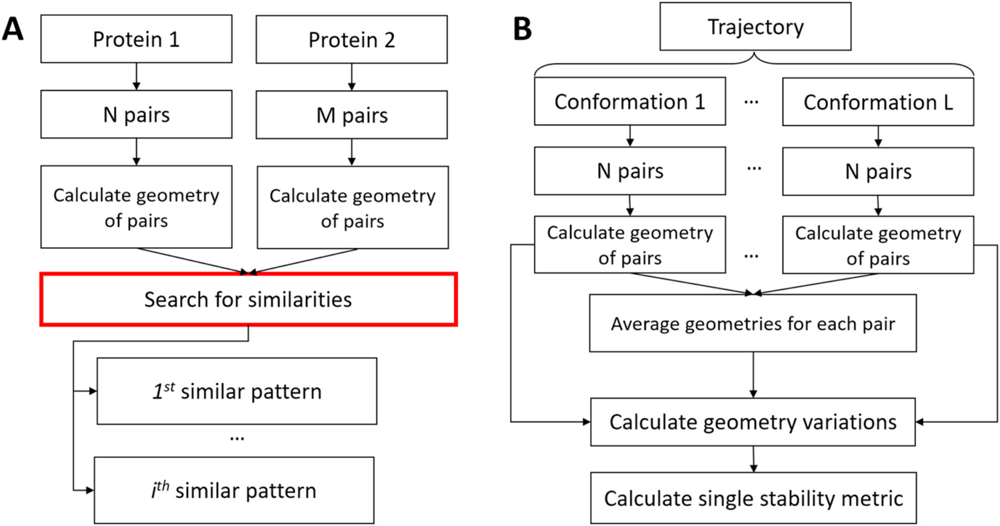
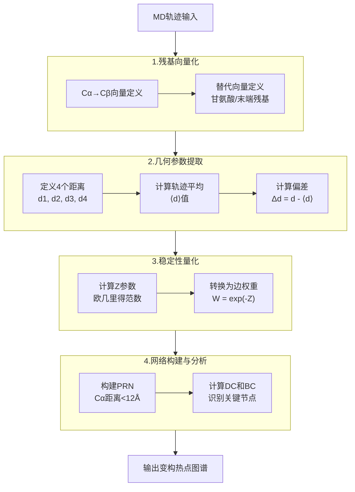
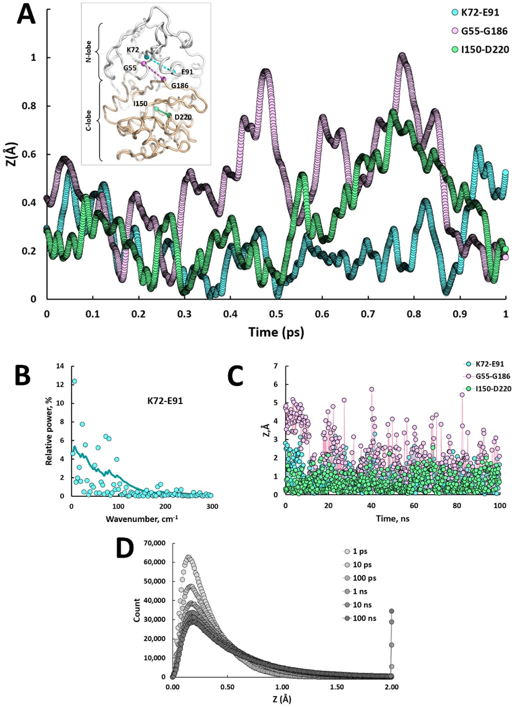
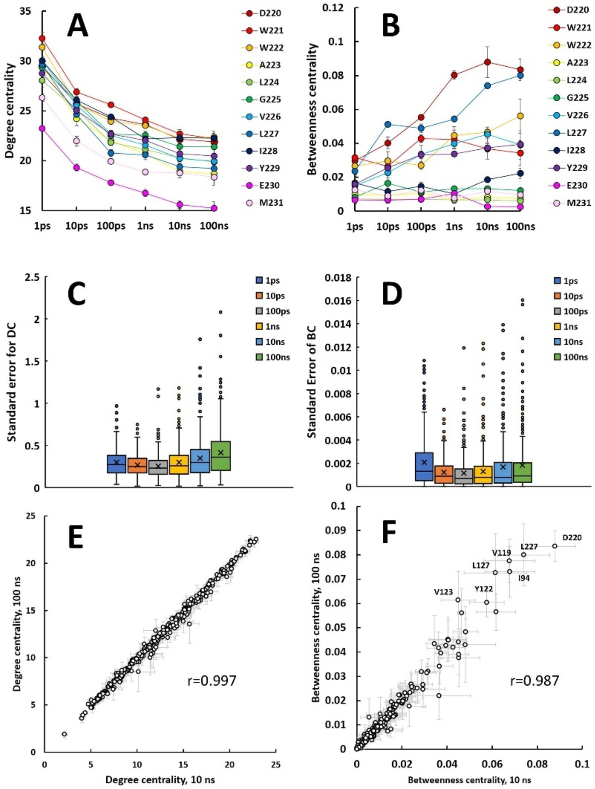
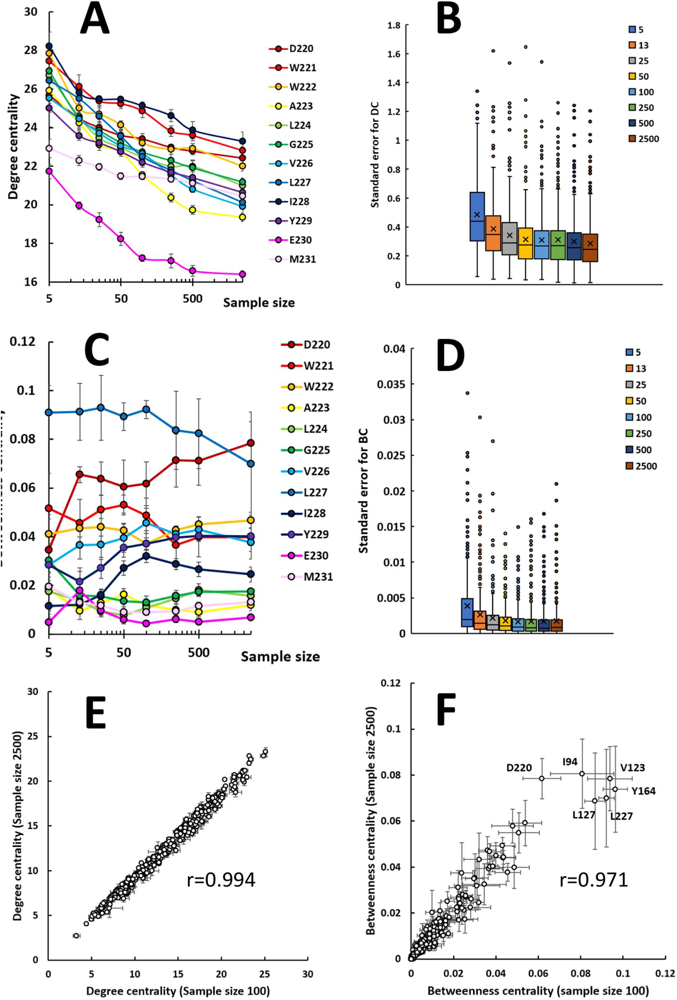
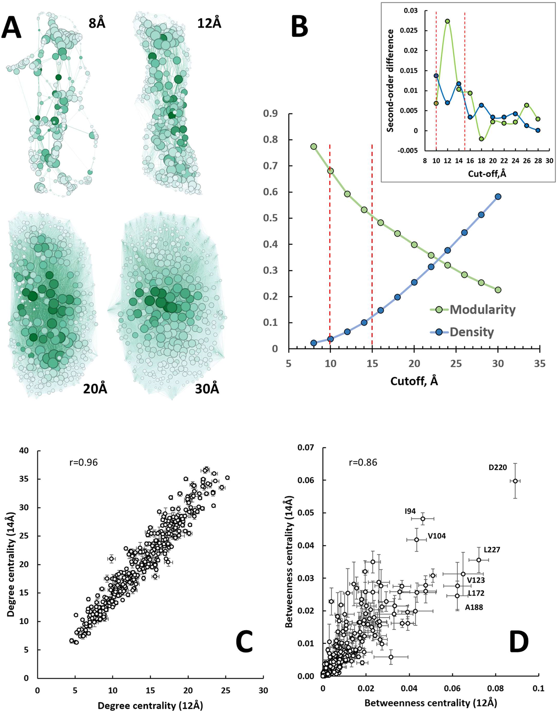
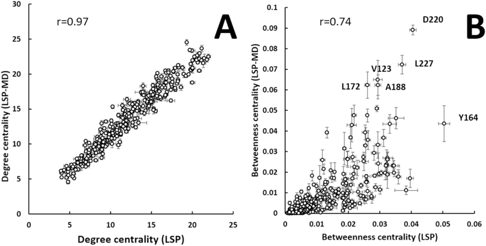

# LSP-MD：捕捉热振动驱动变构效应的快速计算方法

## 本文信息

- **标题**：LSP-MD： A Fast Computational Method to Study Allostery Driven by Thermal Vibrations
- **作者**：Alexandr P. Kornev
- 发表时间： 2025年11月4日
- **单位**：LSP Consulting LLC（美国加利福尼亚州）
- **引用格式**：Kornev, A. P. (2025). LSP-MD: A Fast Computational Method to Study Allostery Driven by Thermal Vibrations. *Journal of Chemical Theory and Computation*, *21*(21), 8699-8710. https://doi.org/10.1021/acs.jctc.5c01094
- **源代码/软件**：论文未公开代码，但LSP Consulting LLC提供与LSP相关方法的咨询服务和许可证（见Conflict of Interest声明）
## 摘要

> 与**热振动相关的构象熵**在蛋白质功能中发挥根本性作用，从配体结合和催化到变构调节。Cooper和Dryden首次将**熵驱动变构**作为这些效应的一个例子提出。然而，测量底层热运动在技术上仍然具有挑战性。在此，我们介绍了**LSP-MD**，这是一种建立在局部空间模式（LSP）对齐基础上的计算方法，用于跟踪分子动力学（MD）模拟中的**侧链稳定性**。LSP-MD使用基于图的**蛋白质残基网络（PRNs）**，其边权重来源于**快速的局部几何涨落**。应用于蛋白激酶A（PKA）时，该方法捕获了**皮秒时间尺度的振动**，振幅在0-2Å范围内，波数低于100 $\mathrm{cm^{-1}}$，正好在熵介导信号传导的范围内。从LSP-MD网络导出的**中心性指标**在不同模拟长度、向量定义和力场下保持稳定，确认了鲁棒性。重要的是，LSP-MD重现了传统LSP分析的关键发现，同时提供了**更清晰的物理基础**和**更高的计算效率**。该方法为探索各种大分子系统中的**熵驱动变构行为**开辟了新机会。

### 核心结论

- **热振动的直接测量**：LSP-MD方法首次实现了对皮秒时间尺度热振动的直接量化，捕获了振幅0-2Å、波数低于100 $\mathrm{cm^{-1}}$的振动模式
- **网络化稳定性分析**：通过基于蛋白质残基网络（PRN）的中心性指标，将局部几何涨落转化为全局变构信号
- **计算效率提升**：相比传统LSP对齐方法，LSP-MD消除了耗时的模式搜索和结构映射步骤，可将500帧轨迹分析，而传统方法仅能处理100帧
- **方法鲁棒性验证**：中心性指标在不同模拟长度（10-100 ns）、采样率、向量定义和力场（ff14SB与CHARMM36）下保持高度稳定
- **物理意义明确**：用单一物理参数Z（几何偏差的欧几里得范数）量化残基对稳定性，替代了传统方法的ad hoc参数
## 背景

蛋白质在沿着折叠漏斗向其天然结构滑动时，随着结构变得更加有序，其熵会减少。然而，即使在折叠完成后，侧链仍然保留了相当大的流动性。这种**残留熵**，也称为**构象熵**，在蛋白质功能中发挥着重要作用。在他们最近的综合综述中，Wankowicz和Fraser证明这些熵效应是蛋白质动力学的普遍特征，影响着从配体结合特异性到酶催化、从蛋白质稳定性到变构信号传导的各个方面。这些效应在**变构调节**中尤其重要，其中配体在一个位点的结合会通过结构变化或动力学效应远程影响另一个位点的功能。

早在1984年，Cooper和Dryden就提出了一个革命性的概念：**蛋白质的变构效应可以完全由熵变化驱动，而不需要明显的结构重排**。他们计算表明，侧链构象熵的微小变化（每个残基约0.4-1.2 kJ/mol）就足以产生显著的变构效应。这一预测在过去几十年中得到了实验支持。核磁共振（NMR）弛豫测量、异核核Overhauser效应和顺序参数分析等实验技术已经能够直接探测这些快速的热运动。然而，这些实验方法通常需要昂贵的设备、专业的样品制备（如同位素标记），并且难以获得全原子级别的分辨率。

从计算角度看，**分子动力学（MD）模拟提供了研究这些热振动的理想工具**。现代MD模拟可以在飞秒时间分辨率下跟踪每个原子的运动，理论上可以捕获从皮秒到毫秒时间尺度的所有动力学过程。然而，从海量轨迹数据中提取有意义的变构信号仍然是一个巨大的挑战。传统的分析方法要么过于简化（如均方根偏差分析），要么计算成本过高（如全原子互相关分析）。

为了解决这个问题，Kornev等人此前开发了**局部空间模式（LSP）对齐方法**，用于比较蛋白质晶体结构并识别侧链稳定性的变化。LSP方法通过将残基表示为向量，并分析不同结构中残基对之间几何关系的变化，成功捕获了与变构相关的稳定性模式。然而，传统LSP方法依赖于大量晶体结构的比较，且需要进行穷举式的模式搜索和结构映射，**计算成本高昂**，限制了其在MD轨迹分析中的应用。

### 关键科学问题

- **热振动的量化难题**：如何从MD模拟的海量轨迹数据中提取出真正与变构相关的微小热振动信号，而不是被其他大尺度构象变化所淹没
- **时间尺度的匹配问题**：变构相关的热振动主要发生在皮秒到纳秒时间尺度，如何设计专门针对这一时间尺度的高效分析方法
- **物理意义的阐释**：如何将抽象的网络拓扑参数与具体的物理过程（热振动、构象熵）联系起来，提供明确的物理解释
- **计算效率与准确性的平衡**：如何在保持对变构信号敏感的同时，大幅降低计算成本，使方法能够应用于大规模的MD轨迹分析
### 创新点

- **LSP-MD方法框架**：提出了一种全新的MD轨迹分析方法，直接在轨迹内量化残基对的稳定性，无需与外部参考结构比对
- **Z参数的引入**：使用几何偏差的欧几里得范数作为单一稳定性指标，具有明确的物理意义，替代了传统LSP方法的ad hoc参数
- **网络化变构分析**：将局部稳定性信息转化为PRN的边权重，通过网络中心性指标（DC、BC）识别关键的变构节点
- **系统性的参数优化**：系统研究了模拟时间、样本大小、距离截断等参数对结果的影响，提供了标准化的分析流程
- **方法验证与对比**：与传统LSP对齐方法进行了系统对比，证明新方法不仅计算效率更高，而且保留了原有的核心发现
---
## 研究内容

### LSP-MD方法的原理与实现

！[fig1](lspmd_figs/fig1.png)

**图1：LSP-MD方法的局部稳定性测量原理**
该图展示了LSP-MD如何通过四个几何距离量化残基对稳定性：

- **(A)** 蛋白质残基网络（PRN）示意图，节点为残基，边的粗细反映稳定性权重
- **(B)** 残基向量化几何定义，展示两个残基向量间的四个距离（$d_1, d_2, d_3, d_4$）
- **(C)** Z参数计算流程：四个距离偏差（$\Delta d_1, \Delta d_2, \Delta d_3, \Delta d_4$）通过欧几里得范数组合为Z
- **(D)** PKA系统的距离偏差分布散点图，**蓝色点为标准向量，红色点为长侧链向量**，展示Z值集中在0-2 Å范围

**Scheme 1：LSP对齐方法与LSP-MD算法的流程对比**

该图对比了传统LSP对齐方法和LSP-MD方法的计算流程：

- **(A) LSP对齐算法**：用于比较两个不同的蛋白质结构。首先计算两个蛋白质中所有残基对的内部几何关系，然后进行**计算密集型的相似性搜索**（红色矩形标注），寻找两个蛋白质中具有相似空间模式的残基对。最终输出一组同构子图，显示两个蛋白质中的相似模式
- **(B) LSP-MD算法**：用于分析单个蛋白质在多个构象下的动力学特征。对轨迹中的每一帧计算所有残基对的内部几何关系，然后对整个轨迹取平均，计算几何偏差，最终得到稳定性指标（Z值）。输出单一的PRN图，表征蛋白质的构象动力学

**关键区别**：传统LSP需要在两个蛋白质之间进行穷举式的模式搜索（计算复杂度高），而LSP-MD只需在单个蛋白质的轨迹内计算平均和偏差（计算效率高）。LSP-MD用**时间平均**替代了**结构比对**，用**几何涨落**替代了**模式相似性**。

#### 核心思想：从几何涨落到网络权重

LSP-MD的核心思想是将MD轨迹中**每个残基对的局部几何稳定性量化为一个单一的物理参数**，然后将其转化为蛋白质残基网络（PRN）的边权重，通过网络分析识别关键的变构节点。

**方法的具体实现步骤**
1。 **残基向量化**：将每个残基表示为一个向量，通常从Cα指向Cβ。对于甘氨酸（没有Cβ）或其他特殊情况，可以使用替代定义（如N-Cα或质心-Cα）
2。 **距离定义**：对于两个残基的向量对（残基 $i$ 的向量为$\mathbf{v}_i$，残基 $j$ 的向量为$\mathbf{v}_j$），定义四个距离：
   - $d_1$：残基 $i$ 的起点到残基 $j$ 的起点
   - $d_2$：残基 $i$ 的起点到残基 $j$ 的终点
   - $d_3$：残基 $i$ 的终点到残基 $j$ 的起点
   - $d_4$：残基 $i$ 的终点到残基 $j$ 的终点
3。 **轨迹平均**：计算整个MD轨迹中这四个距离的平均值$\langle d_1 \rangle, \langle d_2 \rangle, \langle d_3 \rangle, \langle d_4 \rangle$
4. **几何偏差计算**：对于轨迹中的每一帧，计算四个距离的偏差$\Delta d_k = d_k - \langle d_k \rangle$（$k=1,2,3,4$）
5. **Z参数计算**：将四个偏差组合为单一参数Z，使用欧几里得范数：
$$
Z = \sqrt{(\Delta d_1)^2 + (\Delta d_2)^2 + (\Delta d_3)^2 + (\Delta d_4)^2}
$$

6. **边权重转换**：将Z值转换为边权重W，使用公式$W = \exp(-Z)$。**这样稳定的残基对（小Z）获得高权重，不稳定的残基对（大Z）获得低权重**
7. **网络构建**：仅当两个残基的Cα原子距离小于截断值（通常为12Å）时，在它们之间创建边
8. **中心性分析**：计算加权PRN中每个节点的度中心性（DC）和介数中心性（BC），识别关键的变构节点

#### Z参数的物理意义

Z参数是LSP-MD方法的**核心创新**，它具有明确的物理意义：

- **几何稳定性的直接度量**：Z值反映了残基对之间**相对几何关系**偏离其轨迹平均状态的程度。小Z值表示残基对的相对位置保持稳定，大Z值表示几何关系波动较大
- **热振动幅度的表征**：在PKA的10纳秒模拟中，Z值主要分布在0-2Å范围内，这与**热振动引起的小幅度构象变化**一致
- **波数选择性**：通过快速傅里叶变换（FFT）分析发现，Z值变化的波数分量主要集中在100 $\mathrm{cm^{-1}}$以下，正好对应于**热激发模式的波数范围**（<200 $\mathrm{cm^{-1}}$）
#### 与传统LSP对齐方法的区别

传统LSP对齐方法需要比较多个实验结构（通常是不同配体结合状态的晶体结构），通过穷举式的模式搜索和结构映射来识别侧链稳定性的变化。LSP-MD方法与传统LSP方法的关键区别总结如下：

| 特征 | 传统LSP对齐方法 | LSP-MD方法 |
| --- | --- | --- |
| **数据来源** | 需要多个高质量晶体结构（不同配体状态） | 直接在MD轨迹内分析，无需外部参考结构 |
| **计算成本** | 模式搜索和结构映射耗时长，难以处理大量轨迹 | 消除模式搜索和结构映射，计算效率显著提升 |
| **参数设置** | 使用ad hoc阈值参数，物理意义不明确 | 使用Z参数（几何偏差的欧几里得范数），物理意义明确 |
| **适用范围** | 受限于可获得晶体结构的系统 | 可应用于任何MD模拟系统 |
| **处理规模** | 通常限于100帧左右结构对比 | 可轻松处理500帧甚至更多轨迹帧 |

### 应用案例：蛋白激酶A的热振动分析

#### 系统选择与模拟设置

蛋白激酶A（PKA）是研究变构调节的经典模型系统。PKA具有典型的双叶激酶折叠，包括较小的N叶（主要包含β折叠）和较大的C叶（主要包含α螺旋）。两叶之间的铰链区域包含了催化位点和多个关键的调节元件，如glycine-rich loop和αC-螺旋。

研究者使用PKA的催化亚基进行测试，模拟设置总结如下：

| 参数类别 | 具体设置 | 说明/目的 |
| --- | --- | --- |
| **初始结构** | PDB ID 1ATP | ATP结合状态的PKA催化亚基 |
| **力场** | AMBER ff14SB | 蛋白质标准力场 |
| **溶剂模型** | TIP3P水，10Å缓冲 | 水化蛋白，提供真实溶剂环境 |
| **离子条件** | Na⁺/Cl⁻，150 mM | 中和电荷，模拟生理盐浓度 |
| **平衡协议** | 逐步加热至300 K，1 atm | 系统平衡至目标温度和压强 |
| **生产模拟** | 10 ps（0.5 fs步长） | 高分辨率轨迹，捕获皮秒振动 |
|  | 10-100 ns（2 fs步长） | 常规轨迹，稳定性分析 |
| **模拟软件** | AMBER 20 |  |

#### 皮秒时间尺度的热振动特征

**图2：PKA中代表性残基对的Z值时间演化与频谱分析**
该图从多个时间尺度展示了LSP-MD捕获的热振动特征：

- **(A) 皮秒时间尺度的Z值演化（1 ps轨迹，0.5 fs步长）**：曲线展示了三个代表性残基对的Z值随时间的超精细变化。
  - **黑色曲线（K72-E91）**：连接N叶β折叠和调节性αC-螺旋的保守盐桥，被视为**激酶活性态的标志**。曲线非常平滑，Z值变化极小（千分之一埃量级），展现了极高的结构刚性
  - **红色曲线（I150-D220）**：位于C叶内部的残基对，Z值略高于盐桥，反映了相对温和的灵活性
  - **蓝色曲线（G55-G186）**：连接glycine-rich loop和DFG基序的残基对，Z值变化最为明显，代表了分子中最可动的区域
  - 插图：三个残基对在PKA结构上的位置。较大的C端用棕褐色着色，清晰显示了两叶结构和铰链区域
  这些超精细轨迹显示了LSP-MD方法的**时间分辨率优势**：即使在0.5 fs步长下，**Z值曲线仍然非常平滑**，能够捕捉到残基运动的每一个细节。

- **(B) K72-E91盐桥Z值变化的频谱分析**：通过快速傅里叶变换（FFT）将时域信号转换为频域功率谱。横轴为波数（$\mathrm{cm^{-1}}$），纵轴为相对功率（%）。**关键发现**：主波数分量集中在100 $\mathrm{cm^{-1}}$以下，最高功率谱峰出现在6.6 $\mathrm{cm^{-1}}$（>12%相对功率）。这一低频分布正好对应于热激发模式的波数范围（<200 $\mathrm{cm^{-1}}$），证明了LSP-MD捕获的振动确实是由热运动驱动的。这一**波数分布**具有双重意义：
  1. **低于热激发阈值**：蛋白质中可以热激发的振动模式**波数阈值**约为200 $\mathrm{cm^{-1}}$。LSP-MD捕获的**振动波数**（5-100 $\mathrm{cm^{-1}}$）完全在这一范围内，说明这些振动确实是由热运动驱动的
  2. **与变构相关的波数范围**：先前研究表明，小的变构事件（如侧链重新取向）主要影响100 $\mathrm{cm^{-1}}$以下的**低波数模式**。LSP-MD正是聚焦于这一关键的波数窗口
- **(C) 纳秒时间尺度的Z值演化（100 ns轨迹）**：展示了更长时间尺度下Z值的变化。
  - **蓝色曲线（G55-G186）**：Z值最大可达约5Å，出现多个峰，对应于glycine-rich loop的大幅度构象重排
  - **黑色和红色曲线（K72-E91和I150-D220）**：Z值变化相对温和，最大约3Å，反映了刚性结构域的稳定性
  - 视觉检查发现，这些Z值的峰值对应于**构象状态的转变**，如loop的闭合/开放、侧链的rotameric跳跃等。
- **(D) 不同长度模拟的Z值分布统计**：直方图展示了从不同长度模拟（100 ps、1 ns、10 ns、100 ns）中提取的500个PKA结构中所有残基对的Z值频率分布。横轴为Z值（Å），右端点表示Z>2Å的统计。
  - 10 ns模拟：Z值主要集中在0-1Å范围
  - 100 ns模拟：分布略微变宽，但绝大多数残基对的Z值仍低于2Å
  这一发现表明，**尽管存在可动区域（如loop），PKA的大部分残基对在纳秒时间尺度上仍然保持着相对稳定的几何关系**。这种**局部稳定性**是蛋白质三维结构得以维持的基础，也是LSP-MD方法能够捕获有意义信号的前提。

#### 模拟时间对中心性指标的影响

研究者系统地研究了模拟时间对度中心性（DC）和介数中心性（BC）的影响：

**图3：模拟时间对LSP-MD中心性指标的影响**

该图系统展示了不同模拟长度下LSP-MD网络的收敛行为：

- **(A) 度中心性（DC）随模拟时间的变化**：折线图展示了αF-螺旋中12个连续残基的DC值在不同模拟长度下的变化（误差棒为5次独立重复的标准误差）。**关键发现**：在10 ns之前，DC值明显被高估，随后快速下降并趋于平稳。这表明短暂模拟（<10 ns）未能充分探索热振动的完整范围，导致边权重整体偏高
- **(B) 介数中心性（BC）随模拟时间的变化**：同样的12个αF-螺旋残基的BC值变化。**关键发现**：与DC相反，BC值在短模拟中被低估，随模拟时间增加而上升。这是因为BC对全局网络拓扑更敏感，短模拟中的高边权重掩盖了真实的通信路径结构
- **(C) 所有残基DC值的标准误差分布**：箱线图展示了PKA全部338个残基在不同模拟时间下DC值的重复性（5次重复的标准误差）。横轴为模拟长度，纵轴为标准误差。**关键发现**：标准误差在达到10 ns后基本稳定，更长的模拟并不会显著增加噪声
- **(D) 所有残基BC值的标准误差分布**：与DC类似，BC的标准误差也在10 ns后收敛。**注意**：BC的绝对误差值高于DC，这与BC对全局网络结构的敏感性一致
- **(E) 10 ns与100 ns模拟的DC值相关性**：散点图对比了所有残基在这两种模拟长度下的DC值。Pearson相关系数$r=0.997$，表明极高的一致性。大多数点沿对角线紧密分布，说明10 ns和100 ns的DC图谱几乎相同
- **(F) 10 ns与100 ns模拟的BC值相关性**：BC值的对比也显示出强相关性（$r=0.987$），虽然略低于DC，但仍证明10 ns模拟已能捕获关键的变构通信路径

##### 中心性指标的定义

在详细讨论结果之前，我们先明确两个核心网络分析指标的定义和物理意义：

###### 度中心性（Degree Centrality, DC）

衡量节点在网络中的直接连接重要性。在加权PRN中，节点 $i$ 的DC定义为与该节点相连的所有边的权重之和：

$$
\mathrm{DC}(i) = \sum_{j \in N(i)} W_{ij}
$$

其中 $N(i)$ 是节点 $i$ 的邻居集合，$W_{ij} = \exp(-Z_{ij})$ 是节点 $i$ 和 $j$ 之间的边权重。DC反映了一个残基与周围残基形成**稳定连接**的能力。高DC残基通常位于蛋白质结构的稳定核心，与其周围的残基保持紧密且稳定的几何关系。

###### 介数中心性（Betweenness Centrality, BC）

衡量节点在网络中作为"桥梁"或"中继"的能力。节点 $i$ 的BC定义为：

$$
\mathrm{BC}(i) = \sum_{s \neq i \neq t} \frac{\sigma_{st}(i)}{\sigma_{st}}
$$

其中 $\sigma_{st}$ 是从节点 $s$ 到节点 $t$ 的最短路径总数，$\sigma_{st}(i)$ 是经过节点 $i$ 的最短路径数。BC反映了残基在**网络通信**中的重要性。高BC残基通常位于不同结构域之间的通信路径上，充当变构信号的"中继站"，在长距离信号传导中发挥关键作用。

这两个指标共同刻画了残基在蛋白质变构网络中的角色：DC反映**局部稳定性**，BC反映**全局通信能力**。

##### 10 ns模拟时间转折点分析

| 模拟时间 | DC值表现 | BC值表现 | 收敛状态 | 物理原因 |
| --- | --- | --- | --- | --- |
| **<10 ns** | 被高估 | 被低估 | 未收敛 | 未能充分探索热振动范围，$\langle d \rangle$偏向起始构象，导致$\Delta d$偏小，Z值偏低，边权重偏高 |
| **≥10 ns** | 趋于稳定 | 趋于稳定 | 充分收敛 | $\langle d \rangle$已充分收敛，DC和BC标准误差稳定，10 ns与100 ns相关性$r>0.98$ |

这一发现的实际意义是：**对于PKA这类蛋白质，10 ns模拟已足够捕获热振动驱动的变构信号，更长的模拟并不会显著改变中心性图谱**。这**大大降低了计算成本**，使LSP-MD方法能够应用于大规模的蛋白质动力学研究。

#### 样本大小的优化

除了模拟时间，研究者还研究了从轨迹中采样的帧数对结果的影响：

**图4：样本大小对LSP-MD中心性指标的影响**

该图评估了从10 ns轨迹中提取不同数量帧对分析结果的影响：

- **(A) DC值随样本大小的变化**：折线图展示了αF-螺旋中12个残基的DC值随采样帧数增加的变化（从5帧到2500帧）。横轴为帧数（对数坐标），纵轴为DC值。**关键发现**：DC值在小样本（<100帧）时波动较大，在约100帧时趋于稳定
- **(B) 所有残基DC值的标准误差分布**：箱线图展示了PKA全部338个残基在不同样本大小下DC值的重复性（5次重复的标准误差）。**关键发现**：标准误差随样本增加而下降，在约100-500帧时达到平台期
- **(C) BC值随样本大小的变化**：同样的12个αF-螺旋残基的BC值变化。BC值需要更多帧才能收敛，反映了其对全局网络结构的敏感性
- **(D) 所有残基BC值的标准误差分布**：BC的标准误差在约500帧时达到较好的稳定性
- **(E) 100帧与2500帧的DC值相关性**：散点图对比了这两种采样密度的DC值。Pearson相关系数$r=0.98$，说明100帧已能代表完整轨迹的DC图谱
- **(F) 100帧与2500帧的BC值相关性**：BC值的相关性（$r=0.96$）同样很高，证明约100帧的采样已足够
使用10 ns轨迹（每4 ps保存一帧，共2500帧），不同采样帧数的性能对比：

| 采样帧数 | DC和BC稳定性 | 计算开销 | 推荐程度 |
| --- | --- | --- | --- |
| **<100帧** | 波动较大，标准误差高 | 低 | 不推荐 |
| **~100帧** | 趋于稳定 | 低 | 可接受 |
| **500帧** | 提供更好的稳定性 | 小 | **推荐** |

建议的平衡方案是使用约500帧进行分析。考虑到LSP-MD的高效性，处理500帧的计算时间非常短，这一建议具有很高的实用性。

#### 距离截断的优化

PRN的构建需要定义一个距离截断，只有两个残基的Cα原子距离小于该截断值时才创建边。研究者系统测试了不同截断值的影响：

**图5：Cα距离截断对LSP-MD网络拓扑的影响**

该图系统评估了不同距离截断值对PRN结构和中心性指标的影响：

- **(A) 不同截断距离下的ForceAtlas2网络布局**：使用力导向算法可视化PRN拓扑结构，节点大小反映DC，颜色深浅反映BC。展示了从8Å到16Å截断的网络密度和模块化程度变化
- **(B) 模块化和边密度随截断距离的变化曲线**：
  - **绿色曲线（模块化）**：衡量网络划分为内部凝聚模块的能力。纵轴为模块化指数，横轴为截断距离。**关键发现**：在10-15Å范围出现明显的斜率变化（红色虚线标注），二阶差分（插图）确认了12Å是最优截断值
  - **蓝色曲线（边密度）**：实际边数与可能的最大边数之比。边密度随截断增加而单调上升，但在10-15Å范围出现斜率变化
- **(C) 12Å与14Å截断的DC值相关性**：散点图对比了这两种截断下所有残基的DC值。Pearson相关系数$r=0.96$，说明在12-14Å范围内DC值高度一致，网络拓扑保持稳定
- **(D) 12Å与14Å截断的BC值相关性**：BC值的相关性（$r=0.86$）同样显著，证明了这一截断范围的鲁棒性
##### 网络拓扑的变化

| 截断距离 | 网络特征 | 模块化程度 | 连通性 | 适用性 |
| --- | --- | --- | --- | --- |
| **8 Å** | 网络非常稀疏，节点分散 | 高 | 差 | 不推荐 |
| **10 Å** | 网络开始形成基本骨架 | 较高 | 较差 | 可接受 |
| **12 Å** | 网络密度适中，模块清晰可见，高BC节点集中在模块中心 | 稳定 | 良好 | **推荐** |
| **14 Å** | 网络进一步致密化，模块边界开始模糊 | 适中 | 很好 | 可接受 |
| **16 Å** | 网络非常密集 | 显著下降 | 过度连通 | 不推荐 |

##### 定量指标含义

**模块化指数（Modularity Q）**

衡量网络划分为内部凝聚模块的程度，定义为：
$$
Q = \frac{1}{2m} \sum_{i,j} \left[ W_{ij} - \gamma \frac{k_i k_j}{2m} \right] \delta(c_i, c_j)
$$

其中：
- $W_{ij}$ 是节点 $i$ 和 $j$ 之间的边权重（在LSP-MD中为 $\exp(-Z_{ij})$）
- $k_i = \sum_j W_{ij}$ 是节点 $i$ 的加权度
- $m = \frac{1}{2} \sum_{i,j} W_{ij}$ 是网络中所有边的权重总和
- $\gamma$ 是分辨率参数（通常为1）
- $\delta(c_i, c_j) = 1$ 如果节点 $i$ 和 $j$ 在同一模块，否则为0

**如何理解模块化指数？**

用一个社交网络类比：**模块化指数Q衡量网络能否清晰地分成几个内部紧密、外部疏离的“小圈子”**。计算逻辑（简化版）：
$$
Q \approx \frac{\text{圈子内部的实际联系数} - \text{随机期望的内部联系数}}{\text{总联系数}}
$$

- **Q接近1（高度模块化）**：三个完全不交流的微信群（科研群、游戏群、购物群），群内互动频繁但群间无联系
- **Q接近0（随机网络）**：随机派对，每个人随机聊天，无法划分出明显的小圈子
- **Q为负值（反模块化）**：刻意避免和“自己圈子”的人交流，反而只和“外人”互动

在PRN中：
- **高Q（如12Å截断）**：蛋白质可清晰分成几个结构域（N叶、C叶），符合真实结构
- **低Q（如16Å截断）**：所有残基混在一起，失去模块边界，失去生物学意义

**重要说明**：本文中使用modularity作为**评估指标**来量化网络的模块化程度，但论文**并未详细说明具体的模块划分算法**（如Louvain方法）或列出每个模块包含哪些残基。重点是通过观察modularity随截断距离的变化趋势（特别是在12-14Å范围内的斜率突变）来确定最优截断值，而不是深入分析模块的具体组成。

**边密度（Edge Density）**

实际边数与可能的最大边数之比，定义为：
$$
\rho = \frac{2|E|}{n(n-1)}
$$

其中 $|E|$ 是实际边数，$n$ 是节点数

##### 斜率变化的物理意义

通过分析模块化和边密度随截断距离的变化曲线，发现**12-14Å范围是最优的截断窗口**：

1. **斜率变化标志着网络性质的转变**：
   - **小截断（<10Å）**：网络稀疏，模块化高但连通性差，**斜率较陡**（模块化随距离快速下降）
   - **10-15Å范围**：斜率**明显变缓**，这是从"模块主导"到"连通主导"的过渡区
   - **大截断（>15Å）**：网络过度连通，模块化几乎消失，**斜率趋平**
2. **为什么斜率变化对应最优值**：
   - 斜率最大处意味着网络性质变化最快，这是**临界点**
   - 在临界点之前：增加截断距离能够有效改善连通性，同时保持模块化
   - 在临界点之后：再增加截断距离只会模糊模块边界，不再带来新的结构信息
3. **二阶差分的数学意义**：
   - 一阶导数 $f'(r)$：模块化随截断距离的变化率
   - 二阶导数 $f''(r)$：变化率的变化率（曲率）
   - **最大曲率点**：一阶导数变化最剧烈的位置，即最优截断值
   - 插图显示：**最大曲率出现在约12Å**，因此确认其为最优值

这一发现与先前LSP研究的经验一致，也符合蛋白质结构中邻近残基通常定义在12Å左右的常见做法。

#### 与传统LSP对齐方法的对比

为了验证LSP-MD方法的可靠性，研究者将其与传统LSP对齐方法进行了系统对比：

**图6：LSP-MD与传统LSP对齐方法的结果对比**。该图验证了LSP-MD方法与传统方法的一致性，同时展示了更高的计算效率：

- **(A) 度中心性（DC）值的相关性**：散点图对比了LSP-MD分析500帧和传统LSP分析100帧得到的DC值（均来自相同的10 ns PKA轨迹，5次重复）。横轴为传统LSP的DC值，纵轴为LSP-MD的DC值。**关键发现**：Pearson相关系数$r=0.91$，表明高度一致。大多数点沿对角线分布，误差棒（标准误差）较小，证明了LSP-MD能够重现传统方法的核心发现
- **(B) 介数中心性（BC）值的相关性**：BC值的对比同样显示出显著相关性（$r=0.80$）。图中标注了三个具有高BC值的功能重要残基（K72、E91、D184），具体功能见下表
- **(C) 传统LSP的数据说明**：图下方的说明文字指出，传统LSP方法由于计算复杂性限制，仅能分析轨迹的前100帧，而LSP-MD可以高效处理500帧。这种5倍的采样密度提升使LSP-MD能够更准确地捕捉热振动的统计特征

使用相同的10 ns PKA轨迹，两种方法的效率和结果对比如下：

| 对比维度 | LSP-MD方法 | 传统LSP对齐方法 |
| --- | --- | --- |
| **处理规模** | 分析500帧 | 仅能分析100帧（受限于计算成本） |
| **度中心性一致性** | - | $r=0.91$（与LSP-MD高度相关） |
| **介数中心性一致性** | - | $r=0.80$（与LSP-MD显著相关） |

##### 关键功能残基的识别

两种方法都识别出了一批具有高BC值的功能重要残基，具体如下：

| 残基 | 结构特征 | 功能作用 |
| --- | --- | --- |
| **K72** | 形成保守的K72-E91盐桥，连接N叶β折叠和αC-螺旋 | 激酶活性态的标志，参与活性调控 |
| **E91** | 与K72形成盐桥 | 稳定活性态构象，参与变构通信 |
| **D166** | 催化残基 | 参与磷酸转移反应 |
| **D184** | DFG基序的一部分 | 参与镁离子结合和活性位点组织 |
| **F185** | DFG基序的一部分 | 其构象变化（DFG-in/out）是激酶活性的关键开关 |

这些残基在PKA的功能和调节中发挥着核心作用，两种方法的同时验证确认了LSP-MD方法的准确性。

### 方法的鲁棒性验证

#### 向量定义的独立性

研究者测试了不同的残基向量定义对结果的影响（图S1），包括：

1. **标准向量**：Cα→Cβ
2. **长侧链向量**：对于长侧链残基（如精氨酸、赖氨酸），使用Cα→侧链末端原子
3. **替代向量**：对于甘氨酸，使用N→Cα或质心→Cα

结果显示，尽管不同向量定义导致绝对Z值有所差异，但**DC和BC的相关系数均>0.95**，证明中心性图谱对向量定义的选择不敏感。

#### 力场的独立性

研究者使用两种不同的力场（ff14SB和CHARMM36）进行了对比模拟（图S2）。结果发现：

- **DC相关系数**：$r=0.98$
- **BC相关系数**：$r=0.96$

尽管两种力场对蛋白质动力学的描述存在差异，但LSP-MD捕获的中心性图谱高度一致，说明方法对不同力场具有鲁棒性。

#### 起始结构的独立性

研究者从不同的起始构象（包括ATP结合态、抑制剂结合态等）开始模拟，并比较LSP-MD结果（图S4）。发现尽管局部动力学细节有所差异，但**整体中心性图谱保持稳定**，进一步确认了方法的可靠性。

## Q&A

### Q1：LSP-MD方法与传统MD分析（如RMSD、RMSF、互相关分析）有什么本质区别？为什么要使用网络分析方法？

LSP-MD与传统MD分析方法的根本区别在于**关注的物理量不同**和**信息抽象层次不同**：

**表：传统MD分析方法与LSP-MD的对比**
| 分析方法 | 关注的物理量 | 局限性 | 适用场景 |
| --- | --- | --- | --- |
| **RMSD（均方根偏差）** | 整体结构变化 | 无法区分局部稳定性差异，loop大运动和侧链小变化可能贡献相似的RMSD | 判断轨迹是否平衡、构象态聚类 |
| **RMSF（均方根涨落）** | 单个残基涨落幅度 | 忽略残基间耦合关系，无法捕捉长程变构通信 | 识别高柔性区域 |
| **互相关分析** | 残基间相关性 | 计算量大，相关系数矩阵难以直接转化为生物学洞察 | 初步识别残基间关联 |
| **LSP-MD** | 残基对相对几何稳定性 | 需要构建PRN，计算复杂度略高于RMSF | 识别变构热点、分析局部刚性/柔性模块 |

##### LSP-MD的独特优势

- **聚焦相对几何**：Z参数量化的是残基对的相对几何稳定性，而不是绝对位置变化。这对于识别局部刚性/柔性模块更为敏感
- **网络化抽象**：通过PRN将微观的几何涨落转化为宏观的中心性指标，天然地捕捉了多体耦合效应。高BC残基之所以重要，是因为它们位于多个通信路径的交汇处，这恰好对应了变构通信中的"热点"
- **物理意义明确**：Z参数直接对应于构象熵（几何涨落越大，熵越大），而中心性指标则对应于该残基在变构通信中的重要性。这种从物理量到功能指标的映射链条清晰可解释

**一个形象的类比**：想象一个城市交通系统。RMSD就像城市的整体繁荣度（所有人都在动），RMSF是每个人的忙碌程度（某些区域特别忙），互相关是人与人之间的联系矩阵（谁认识谁）。而LSP-MD的网络分析则识别出了"交通枢纽"——那些一旦堵塞就会导致全城瘫痪的关键节点。这些枢纽可能不是最忙的（RMSF不一定最高），也不是与所有人都有直接联系（度不一定最大），但它们位于不同区域之间的必经之路上（介数中心性高），因此对整体系统功能至关重要。

### Q2：LSP-MD捕获的热振动（100 $\mathrm{cm^{-1}}$以下）与变构效应有什么因果关系？为什么这些微小振动能驱动远程的变构响应？

这是一个深刻的物理生物学问题，涉及熵驱动变构的本质机制。Cooper和Dryden的理论预言可以通过LSP-MD方法得到直接验证，其物理逻辑如下：

##### 热振动的波数选择

| 振动模式类型 | 波数范围 | 运动形式 | 室温激发难易 | LSP-MD覆盖 |
| --- | --- | --- | --- | --- |
| **高频模式** | >200 $\mathrm{cm^{-1}}$ | 键的拉伸和弯曲 | 困难（能量高） | 否 |
| **低波数模式** | <200 $\mathrm{cm^{-1}}$ | 扭动、剪切等集体运动 | 容易（能量低） | 是 |
| **LSP-MD范围** | 5-100 $\mathrm{cm^{-1}}$ | 侧链扭动、loop摆动 | 充分激发 | 完全覆盖 |

##### 熵-稳定性耦合机制

一个残基对的热振动幅度（Z值）反映了其**构象熵的大小**。当配体在别处结合时，可能通过两种方式改变远程残基对的Z值：

1. **直接空间效应**：配体的存在改变了局部空间位阻，远程残基的可动范围因此增大或减小
2. **间接网络效应**：配体结合改变了某些关键残基（如铰链区残基）的稳定性，这种变化通过PRN传播，影响远程残基对的相对几何

##### 累积放大机制

Cooper和Dryden的理论框架提出，低波数振动模式（<200 $\mathrm{cm^{-1}}$）在生理温度下并未完全激发，可以在配体结合事件中被调制，从而导致构象熵的变化。单个残基对的熵变可能很小，但当**多个残基对的熵变协同作用**时，总效应可以被放大：

$$
\Delta S_\text{total} = \sum_i \Delta S_i
$$

这种累积效应可以产生显著的自由能变化（$\Delta G = -T\Delta S$），足以驱动变构响应。许多变构调控的自由能差在5-20 kJ/mol范围内。

##### 从Z值到中心性的映射

LSP-MD的创新在于将微观的Z值通过PRN转化为宏观的中心性指标。高BC残基之所以重要，是因为它们连接了多个"熵变模块"。当这些模块的熵发生协同变化时，高BC残基就像是信息交换的枢纽，其稳定性变化会对整个网络产生放大效应。

### Q3：10 ns模拟是否足以捕获所有与变构相关的热振动？对于那些发生毫秒级变构转变的蛋白质（如变构酶），LSP-MD方法是否仍然适用？

这是一个关于**时间尺度分离**的重要问题，需要仔细区分不同类型的变构机制：

##### 时间尺度的层级结构

蛋白质变构涉及多个时间尺度：

| 时间尺度 | 动力学过程 | 捕获方法 | LSP-MD应用 |
| --- | --- | --- | --- |
| **皮秒-纳秒** | 侧链热振动、loop快速摆动 | 常规MD | 直接分析 |
| **微秒-毫秒** | 构象态切换（open/closed）、domain运动 | 增强采样MD | 分态对比 |
| **秒-分钟** | 结合/解离、翻译后修饰 | 生化实验/特殊方法 | 不适用 |

##### 10 ns的物理意义

LSP-MD聚焦于**平衡态涨落**，而非非平衡态转变。其假设是：蛋白质在特定功能态（如apo态或holo态）下，其热振动模式（由Z值分布表征）已经编码了该态的变构性质。如果两个态的热振动模式不同，那么其LSP-MD中心性图谱也应该不同。

##### 对于慢速变构系统的适用性

对于那些发生毫秒级变构转变的蛋白质，LSP-MD的应用策略是：

1. **分别模拟不同功能态**：对每个态（如open态和closed态）进行10 ns以上的模拟
2. **对比中心性图谱**：计算两个态的DC和BC值，识别差异显著的残基
3. **识别变构热点**：那些BC值在态间发生剧烈变化的残基就是变构通信的关键节点

这种方法的物理基础是：**即使构象转变本身很慢，但在每个态内部，热振动已经很快（皮秒-纳秒）达到了平衡**。因此，10 ns模拟足以表征每个态的热振动特征，而态间差异则反映了变构效应。

##### 潜在局限与解决方案

- **多亚稳态问题**：如果10 ns轨迹在不同的亚稳态之间跳跃，Z值分布可能混合了多个态的特征。解决方案：使用聚类分析将轨迹分成不同亚稳态，分别分析
- **构象异质性**：某些蛋白质（如固有无序蛋白）本身就没有单一稳定构象。LSP-MD可能需要更长的模拟来捕获其系综特征。解决方案：使用多个短轨迹从不同起始构象开始模拟，构建综合的PRN

## 关键结论与批判性总结

### 核心贡献

- **物理基础明确**：LSP-MD捕获的热振动波数范围（5-100 $\mathrm{cm^{-1}}$）与Cooper和Dryden理论预测的热激发模式阈值（<200 $\mathrm{cm^{-1}}$）高度吻合，为熵驱动变构提供了可量化的物理证据
- **方法鲁棒性**：中心性指标在不同模拟长度（图3）、采样率（图4）、向量定义（图S1）和力场（图S2）下保持稳定，证明方法捕获的是有意义的物理特征而非噪声
- **截断距离优化**：系统性地验证了12-14Å范围能产生最优的网络拓扑并保留关键结构信息（图5）
- **与传统方法的连续性**：LSP-MD保留了原始LSP对齐方法的核心结果（图6），同时用物理可解释的稳定性指标替代了ad hoc参数
- **计算效率提升**：这种连续性，结合改进的计算效率和更清晰的物理解释，使LSP-MD成为研究动力学驱动变构的实用可靠工具

### 局限性与未来方向

- **大尺度构象重排的挑战**：一个悬而未决的问题是，LSP-MD记录的热动力学在涉及大尺度结构重排的变构系统中将如何表现。在这种情况下，局部熵特性可能在构象变化后发生改变。作者预期这些系统需要沿不同构象态分别取样分析。这些图谱的差异程度以及它们在什么时间尺度上达到平衡，仍有待确定。
- **BC的固有变异性**：DC值的强相关性尤为重要，因为这一指标是研究熵驱动变构的主要关注点。相比之下，BC的相关性始终较低（图3F、4F、5D、6B、S1B、S2B、S4B）。这反映了BC的固有特性：它是依赖于最短路径的全局指标，边权重的微小变化就可能改变哪些残基被包含在这些路径中。因此，**BC本质上比DC更易变**，这是网络理论中公认的局限性。替代的中心性指标，如流介数（flow betweenness），可以应用于LSP衍生的PRN，但探索它们超出了这项以方法为重点的研究范围。

> 小编锐评：
>
> - 本文基本上是在验证这个思想的可行性，各种指标什么的。
> - 显然不涉及大幅构象重排的变构过程，所以基本上是一个根据静态结构预测变构路径的增强版吧，可以作为未来工作流的一个步骤，比如边跑MD边根据这个工具修改CV？
> - 确实可能给DL训练提供数据？
> - 没验证是否适用于复合物，原则上应该可以吧
> - 如何对比两个体系，如ligand bound and unbound state，没给例子，似乎不好对比，只能各画各的图看不一样？
