# 变构激活的动态基础：恶性疟原虫蛋白激酶G的长程通信机制

## 本文信息
- **标题**: 变构激活的动态基础：恶性疟原虫蛋白激酶G的长程通信机制
- **作者**: Jinfeng Huang, Jung Ah Byun, Bryan VanSchouwen, Philipp Henning, Friedrich W. Herberg, Choel Kim, Giuseppe Melacini
- 发表时间: 2021年6月10日
- **单位**: McMaster University（加拿大麦克马斯特大学）, University of Kiel（德国基尔大学）, Baylor College of Medicine（美国贝勒医学院）, Rice University（美国莱斯大学）
- 引用格式: Huang, J., Byun, J. A., VanSchouwen, B., Henning, P., Herberg, F. W., Kim, C., & Melacini, G. (2021). Dynamical Basis of Allosteric Activation for the *Plasmodium falciparum* Protein Kinase G. *The Journal of Physical Chemistry B*, *125*(23), 6532-6542. https://doi.org/10.1021/acs.jpcb.1c03622

## 摘要

> 恶性疟原虫的cGMP依赖性蛋白激酶（PfPKG）对于疟原虫生命周期的进程是必需的，因此是一个有前景的抗疟药物靶点。PfPKG包含四个cGMP结合结构域（CBD-A至CBD-D）。CBD-D在PfPKG调控中发挥关键作用，它是催化结构域抑制和cGMP依赖性激活的主要决定因素。因此，理解CBD-D如何被cGMP变构调节至关重要。虽然CBD-D的apo与holo构象变化已有报道，但目前缺乏关于激活途径中间态的信息。在本研究中，我们采用**分子动力学模拟**来建模PfPKG CBD-D结构域cGMP依赖性激活热力学循环中的四个关键状态。模拟结果与**NMR数据**进行比较，揭示了PfPKG CBD-D激活途径会采样一种**紧凑中间态**，其中N端和C端螺旋靠近中央β桶。此外，通过比较cGMP结合的活性态和非活性态，识别了区分这两种状态的关键结合相互作用。识别cGMP结合非活性态特有的结构和动力学特征，为设计PfPKG选择性变构抑制剂作为疟疾的可行治疗方案提供了有希望的基础。

### 核心结论

- **四态热力学循环**：首次完整映射了PfPKG CBD-D的变构激活路径，包括难以捕捉的apo/active和holo/inactive中间态
- **区域特异性响应**：PBC区域的动力学抑制需要cGMP结合和变构构象变化的协同作用，而αB-αC螺旋主要由变构效应调控
- **变构抑制剂设计基础**：holo/inactive中间态的结构特征，特别是R484-A485与cGMP相互作用的变化，为设计选择性变构抑制剂提供了明确靶点
- **物种选择性机制**：PfPKG的R484与人类PKG的K308在αC螺旋相互作用上的差异，可实现宿主-寄生虫选择性

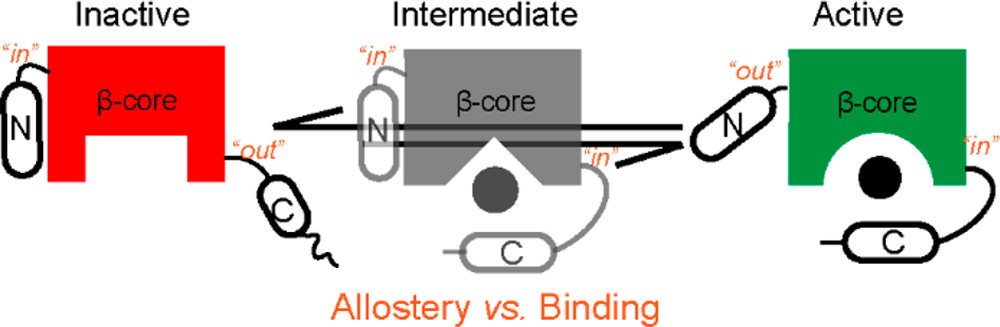

## 背景

### 关键术语解释

在深入讨论之前，先介绍本文涉及的关键缩写：
- **PfPKG**：*Plasmodium falciparum* cGMP-dependent protein kinase G（恶性疟原虫cGMP依赖性蛋白激酶G）
- **cGMP**：cyclic guanosine monophosphate（环磷酸鸟苷），细胞内第二信使分子
- **CBD**：cGMP-binding domain（cGMP结合结构域），负责识别和结合cGMP
- **PBC**：Phosphate-Binding Cassette（磷酸结合盒），CBD中结合cGMP磷酸基团的关键区域
- **BBR**：Base-Binding Region（碱基结合区），CBD中结合cGMP鸟嘌呤碱基的区域
- **N3A**：N-terminal three-helix assembly（N端三螺旋组装体），包含αX:N、α310和αA螺旋的复合结构
- **apo**：配体未结合状态（如无cGMP结合的蛋白状态）
- **holo**：配体结合状态（如cGMP结合的蛋白状态）
- **β-core**：中央β桶，CBD结构域的核心支架，由8个β折叠片组成
- **cation-π相互作用**：阳离子-π相互作用，带正电荷的离子（如铵根离子）与芳香环的π电子云之间的静电相互作用，在蛋白质-配体识别中很重要
- **His τ态中性**：组氨酸在pH=7时的质子化状态，质子位于Nε2（τ氮）上，整体不带电（记为HIE），是生理条件下最常见的组氨酸状态，适用于大多数蛋白质MD模拟

### 疟疾与PfPKG的重要性

疟疾是由恶性疟原虫（*Plasmodium falciparum*）引起的致命寄生虫病，每年导致全球数十万人死亡。疟原虫的生命周期复杂，包括在蚊虫中的有性生殖阶段和在人体内的无性增殖阶段，其中**从肝细胞释放出的裂殖子侵入红细胞**是引发疟疾症状的关键步骤。

PfPKG是一个**cGMP依赖性丝氨酸/苏氨酸激酶**，在疟原虫的生命周期调控中扮演中央开关的角色。研究表明，PfPKG在疟原虫的多个关键生命周期阶段都发挥着不可替代的作用，包括**裂殖子从红细胞释放**（egress）、**裂殖子重新侵入红细胞**（invasion）以及**配子体激活**（sexual stage development）。抑制PfPKG的活性可以阻断这些关键过程，从而阻止疟原虫的生命周期进程，因此PfPKG被认为是**极具前景的抗疟药物靶点**。

特别值得注意的是，PfPKG与人类PKG在结构上存在差异，这为实现**宿主-寄生虫选择性抑制**提供了可能性，即可以设计只杀灭疟原虫而不伤害人体正常细胞的药物。

### cGMP结构域与变构激活机制

PfPKG包含**四个cGMP结合结构域**（CBD-A、CBD-B、CBD-C和CBD-D），位于N端调控区，其中CBD-D具有最高的cGMP结合亲和力（Kd = 51 ± 7 nM），是变构调控的核心决定因素。此外，PfPKG还包含**一个催化结构域**，位于C端，负责**ATP**（**Adenosine Triphosphate**，三磷酸腺苷，细胞能量货币和磷酸供体）结合和磷酸转移反应，在无cGMP状态下被N端结构域抑制，cGMP结合后解除抑制。

在**无cGMP状态**下，CBD结构域与催化结构域通过αB-螺旋和连接区相互作用，抑制催化活性。当cGMP结合到CBD-A和CBD-B时，引发变构激活：**CBD-A结合cGMP**解除对催化结构域的抑制，而**CBD-B结合cGMP**进一步激活催化结构域。然而，这一过程的**原子级动态机制**和**长程通信路径**尚未明确，尤其是连接apo/inactive到holo/active转变的中间态（如apo/active和holo/inactive）仍难以通过实验手段表征。

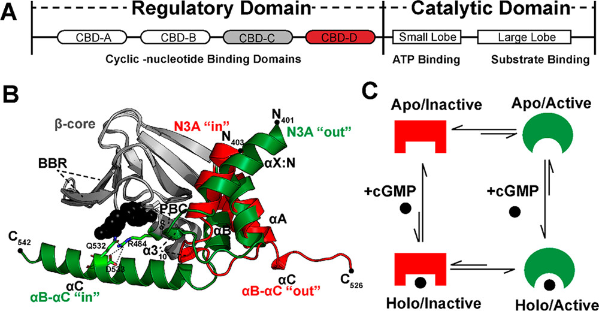

### 变构激活的科学问题

经典变构理论认为，配体结合通常稳定化蛋白局部结构，从而引发下游效应。但对于PfPKG，存在多个尚未解决的关键问题：**CBD-A和CBD-B的cGMP结合是否都导致局部稳定化**，还是存在区域特异性差异？**局部变化如何跨越约60Å的距离传播至催化结构域**，具体的信号传播路径是什么？**催化结构域的哪些区域对变构信号最敏感**，这些区域的动态变化如何与激酶活性相关？这些问题需要结合**实验动态测量**（如NMR化学位移分析）和**原子级模拟**（如微秒级MD模拟）来回答，特别是需要表征难以捕捉的中间态（如apo/active和holo/inactive）。

### 关键科学问题

本研究重点关注三个关键科学问题。**四态变构循环的动态特征**问题涉及PfPKG CBD-D的激活途径是否遵循离散的四态模型（apo/inactive、apo/active、holo/inactive、holo/active），以及不同状态间的转变路径和能量景观如何分布。**区域特异性的变构响应**问题关注PBC和αB-αC螺旋对cGMP结合和变构效应的敏感性是否存在显著差异，以及这种差异如何影响变构信号传播。**变构抑制剂的设计基础**问题则探索holo/inactive中间态具有哪些独特的结构和动力学特征，以及如何利用这些特征设计可结合但不激活激酶的选择性变构抑制剂，同时实现对PfPKG和人类PKG的区分。

### 创新点

- **方法学创新**：首次将NMR实验与MD模拟结合研究PfPKG完整四态变构循环，**实验-计算互补**验证动态变化
- **中间态表征**：首次在原子分辨率下表征了难以捕捉的apo/active和holo/inactive中间态
- **变构抑制剂设计基础**：识别了holo/inactive中间态的独特结构特征，为设计可结合但不激活的选择性抑制剂提供了明确靶点
- **区域特异性机制**：揭示了PBC和αB-αC螺旋对cGMP结合和变构效应的不同敏感性，深化了对变构通信机制的理解

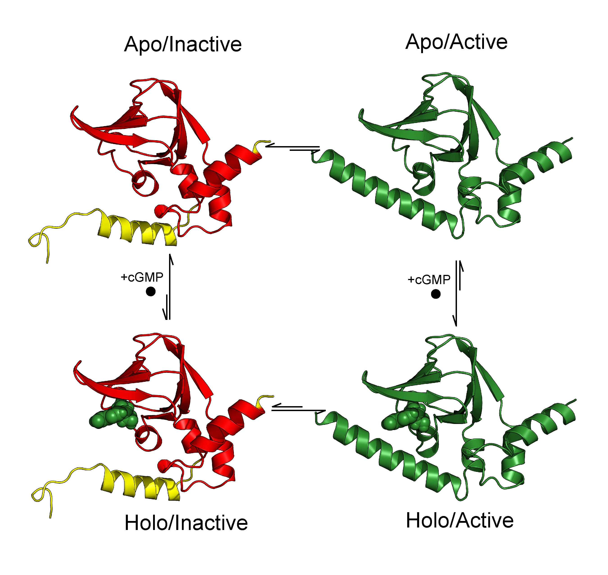

**图S1：四态变构循环的初始结构模型**

### 四态初始结构的建模

本研究仅**两态有实验解析的晶体结构**，另外两态通过**计算建模**获得：

#### 实验解析的晶体结构
- **apo/inactive状态**：PDB **4OFF**（apo CBD-D晶体结构）
- **holo/active状态**：PDB **4OFG**（cGMP-bound CBD-D晶体结构）

#### 计算建模的中间态

| 状态 | 建模方法 | 结构来源 | 关键操作 |
| --- | --- | --- | --- |
| **apo/active** | 从holo/active移除cGMP | 4OFG | 移除cGMP，保留活性构象（N3Aout/BCin） |
| **holo/inactive** | cGMP对齐到inactive结构 | 4OFF + 4OFG | 通过β-core区域对齐，将cGMP从4OFG对齐到4OFF |
| **apo/inactive (补充)** | 添加缺失残基 | 4OFF + 5DYK | 从全长结构(PDB 5DYK)补充N端2个残基和C端残基517-542 |

#### 关键建模细节
- **apo/active状态**：直接从holo/active晶体结构（4OFG）中移除cGMP，保持活性构象（N3Aout/BCin拓扑）
- **holo/inactive状态**：将holo/active（4OFG）和apo/inactive（4OFF）结构在**保守的β-core区域**对齐，然后将4OFG中的cGMP分子转移到4OFF结构中，创建一个配体结合但不激活的模型
- **apo/inactive补充**：4OFF结构缺失N端前2个残基和C端517-542残基，从全长apo/inactive结构（PDB 5DYK）移植这些缺失区域，并通过β-core对齐确保结构连续性

这种建模策略使得MD模拟能够探索**难以通过实验表征的中间态**（apo/active和holo/inactive），从而完整映射四态变构热力学循环。

## 研究方法：NMR与MD模拟的结合

本研究采用**实验-计算双管齐下**的策略：

### 核磁共振（NMR）实验

- 测量野生型和突变型PfPKG CBD-D在cGMP结合状态下的化学位移
- 通过化学位移导出的**序参量**（$S^2$，Order Parameter）评估蛋白质骨架动力学，$S^2$值范围0-1，越接近1表示运动越受限
- 比较不同变构状态下的NMR数据，识别关键构象变化
- 突变实验验证MD模拟预测的关键相互作用

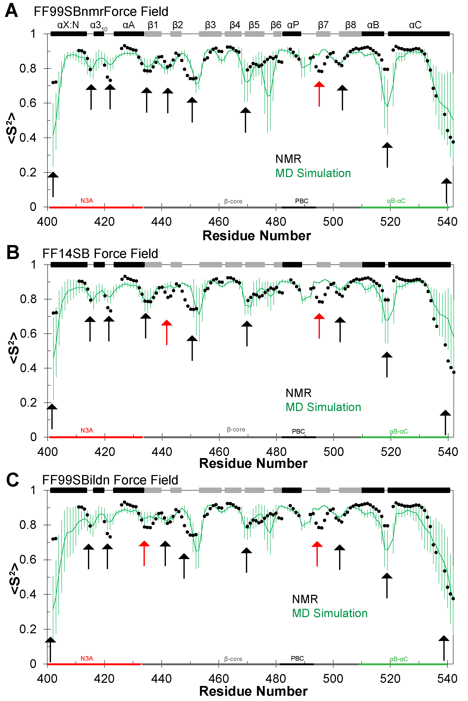

**图S2：MD模拟与NMR实验的验证**
- 对比了三种力场（FF99SBnmr、FF14SB、FF99SBildn）预测的N-H序参量（$S^2$）与NMR实验数据
- 黑色点为NMR实验值，绿色/红色/蓝色条为不同力场的MD预测值
- 垂直箭头标注实验观察到的局部极小值
- **结论**：FF99SBnmr力场与实验数据最为一致，因此作为后续分析的主力场

### 分子动力学（MD）模拟

- 对四态变构循环中的每个状态进行3×1 μs重复模拟（总计12 μs）
- 分析**均方根偏差**（*RMSD*，Root Mean Square Deviation），衡量结构与参考构象的偏离程度
- 分析**均方根涨落**（*RMSF*，Root Mean Square Fluctuation），衡量原子运动的柔性
- 使用**CHESPA**（**Chemical Shift Projection Analysis**，化学位移投影分析）比较突变效应
- 通过**相似性测量**（**SM**，Similarity Measure）图谱映射构象转变路径

### MD模拟细节
- 使用**Amber 16**与GPU版**pmemd.cuda**在SHARCNET平台运行
- cGMP参数通过**HF/6-31G\***量子化学计算获得电荷，经**RESP**（**Restrained Electrostatic Potential**，限制静电势）拟合得到部分电荷，并采用**GAFF**（**General Amber Force Field**，通用AMBER力场）补全缺失参数
- 蛋白使用**FF99SBnmr**（专门为NMR数据优化的AMBER力场）为主力场，**FF99SBildn**（改进的侧链二面角参数）与**FF14SB**（AMBER 2014力场）用于holo/active对照
- 体系溶剂化于**TIP3P水盒子**，边界距溶质至少12 Å；加入NaCl至100 mM模拟生理盐浓度
- pH设为7，His为τ态中性（质子位于Nε2，记为HIE）；N/C端与Asp/Glu/Arg/Lys为标准电离态
- **四态构象各进行3×1 μs轨迹**，另对holo/active用两种力场各补充3 μs，总计18 μs
- 能量最小化后分段升温与平衡：**NVT** 0–100 K（20 ps），**NPT** 100–306 K（80 ps），逐步降低主链约束
- 生产期在306 K、1 atm的NPT条件下运行，非键截断12 Å，长程静电相互作用用**PME**（**Particle Mesh Ewald**，粒子网格Ewald方法）
- 轨迹每10 ps存储一次，分析使用**CPPTRAJ**（Amber工具包中的轨迹分析程序）

---

## 结果与讨论

### 1. CBD-D结构域的动态分析

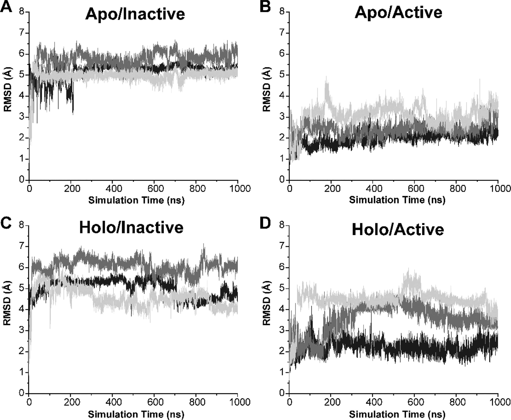

**图2：PfPKG CBD-D四态的全蛋白主链RMSD随时间变化**
- (A-D) 四态的RMSD时间轨迹：(A) Apo/Inactive，(B) Apo/Active，(C) Holo/Inactive，(D) Holo/Active
- **计算方法**：将整个蛋白的主链（N、Cα、C原子）对齐到各自状态的初始模型，计算RMSD
- 横轴为模拟时间（ns），纵轴为RMSD（Å）
- 每个状态有3条1 μs独立轨迹，用不同灰度表示（黑色、深灰、浅灰）
- **关键发现**：所有12条轨迹（四态×3次重复）在1 μs内保持稳定，没有持续上升或大的构象漂移，**表明模拟已达到平衡**，可用于后续分析

#### RMSF：残基级别的柔性变化

**均方根涨落**（RMSF）分析揭示了四态变构循环中的**区域特异性动态响应**。通过overlay整个CBD-D的Cα原子到初始模型，计算每个残基的RMSF值，发现：

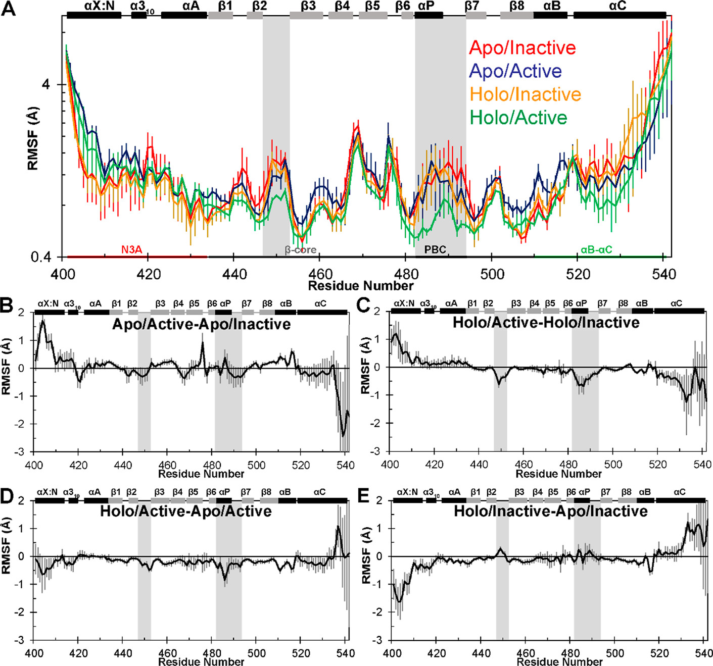

**图3：PfPKG CBD-D残基特异性结构涨落（RMSF）**
- (A) 全域RMSF vs 残基编号，四态用不同颜色表示：**红色**（apo/inactive）、**蓝色**（apo/active）、**橙色**（holo/inactive）、**绿色**（holo/active）。灰色高亮显示四态间最显著差异的区域，y轴使用log10刻度
- (B-E) 不同状态对间的RMSF差异图：B和C量化变构构象变化的效应，D和E量化cGMP结合的效应
- **关键发现**：PBC和αB-αC螺旋对变构信号和cGMP结合的敏感性截然不同

#### 区域特异性RMSD分布

为进一步量化不同结构元件的动态变化，研究分别计算了**N3A区域**、**PBC区域**和**αB-αC螺旋**的RMSD分布（通过overlay各自的β-core到初始结构，确保仅测量局部构象变化）。

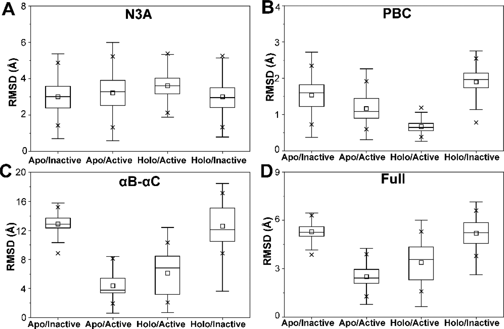

**图4：N3A、PBC与αB-αC区域的特异性动态响应**
- (A-C) 分别展示N3A、PBC、αB-αC区域的RMSD箱线图，通过overlay β-core到初始模型计算。横轴为四态，纵轴为RMSD（Å）
- (D) 全域RMSD分布（overlay整个CBD-D主链到初始结构）
- 箱线图说明：中线为中位数，箱体为25%-75%分位数，须为1.5×IQR范围，小方块为均值，两个叉号为1%和99%分位数

| 区域 | 四态RMSD特征 | 调控机制 | 物理意义 |
| --- | --- | --- | --- |
| **N3A** (图4A) | 四态间分布相似 | 由整体构象决定，而非cGMP结合 | N3A的in/out取向在所有状态下都能动态采样，与β-core的相对位置稳定 |
| **PBC** (图4B) | holo/active显著低于其他三态 | **cGMP结合和变构激活的协同作用** | PBC稳定化需要双重因素，验证了RMSF结果 |
| **αB-αC螺旋** (图4C) | active状态低于inactive状态 | **主要由变构效应决定** | αB-αC螺旋的动态性主要受构象状态调控，cGMP结合影响较小 |
| **全域** (图4D) | 反映αB-αC的大幅变化 | 变构贡献占主导 | 因αB-αC构象变化幅度最大，全域RMSD主要反映其变化 |

### 2. 变构转变路径：从inactive到active

#### SM图谱的计算方法

相似性测量（**SM**，Similarity Measure）是一种基于RMSD的二维散点图，用于直观评估构象在active和inactive状态之间的相对位置。对MD轨迹中的每一帧构象，分别计算：

$$
X = \mathrm{RMSD}_{\mathrm{N3A}}^{\mathrm{active}} - \mathrm{RMSD}_{\mathrm{N3A}}^{\mathrm{inactive}}
\\
Y = \mathrm{RMSD}_{\alpha\mathrm{B}\text{-}\alpha\mathrm{C}}^{\mathrm{active}} - \mathrm{RMSD}_{\alpha\mathrm{B}\text{-}\alpha\mathrm{C}}^{\mathrm{inactive}}
$$

| 符号 | 区域 | 相对于谁的RMSD | 参考结构 |
| --- | --- | --- | --- |
| $\mathrm{RMSD}_{\mathrm{N3A}}^{\mathrm{active}}$ | N3A区域 | active结构 | holo/active晶体（PDB 4OFG） |
| $\mathrm{RMSD}_{\mathrm{N3A}}^{\mathrm{inactive}}$ | N3A区域 | inactive结构 | apo/inactive晶体（PDB 4OFF） |
| $\mathrm{RMSD}_{\alpha\mathrm{B}\text{-}\alpha\mathrm{C}}^{\mathrm{active}}$ | αB-αC螺旋 | active结构 | holo/active晶体（PDB 4OFG） |
| $\mathrm{RMSD}_{\alpha\mathrm{B}\text{-}\alpha\mathrm{C}}^{\mathrm{inactive}}$ | αB-αC螺旋 | inactive结构 | apo/inactive晶体（PDB 4OFF） |

**计算步骤**：
1. 对MD轨迹的每一帧，分别计算N3A和αB-αC区域相对于active和inactive参考结构的RMSD
2. 计算差值得到 $(X, Y)$ 坐标
3. 在二维平面上绘制每帧的坐标点

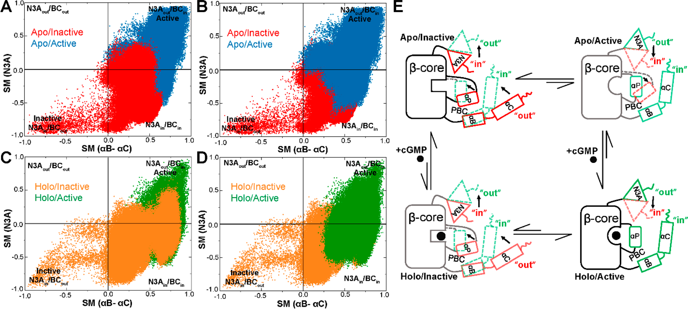

**图5：PfPKG CBD-D的活性-非活性转变路径映射**

- (A, B) N3A与αB-αC的RMSD相似性测量（SM）图谱，展示apo/inactive（红色）和apo/active（蓝色）模拟轨迹。每个象限代表N3A和αB-αC结构元件的不同in/out组合姿态。A和B面板仅在数据集的前后显示顺序上不同
- (C, D) 与A、B相同，但展示holo/inactive（橙色）和holo/active（绿色）模拟轨迹
- (E) 总结PfPKG CBD-D沿变构热力学循环的主要动态变化的示意图。实线表示inactive（红色）和active（绿色）状态的初始拓扑结构，虚线和黑色箭头表示转变过程中的主要拓扑变化

> - 这种作差的方法勉强可借鉴吧，甚至可以作为CV？
> - 这种模拟也算是类似于，用增强采样采到了一些关键态，再跑standard MD得到kinetics

#### 象限映射与物理意义

| 象限 | 坐标 | 构象组合 | 代表的状态 | 拓扑特征 |
| --- | --- | --- | --- | --- |
| **右上** | (+, +) | N3Aout/BCin | Holo/active参考态 | N3A向外，αB-αC向内（活性） |
| **左下** | (-, -) | N3Ain/BCout | Apo/inactive参考态 | N3A向内，αB-αC向外 |
| **右下** | (+, -) | N3Ain/BCin | **紧凑中间态** | 两者都向内，过渡态的必经之路（最多采样） |
| **左上** | (-, +) | N3Aout/BCout | **松散中间态** | 两者都向外（较少采样） |

Figure 5的SM图谱揭示了PfPKG CBD-D变构激活的**能量景观**。四个象限代表四个不同的构象 basin，每个数据点代表MD轨迹中的一帧构象。

1. **象限偏好性反映能垒**：
   - **apo/inactive轨迹（红色）**：主要分布在左下象限（N3Ain/BCout），与初始构象一致，表示**inactive状态是稳定的能量极小值**
   - **holo/active轨迹（绿色）**：主要分布在右上象限（N3Aout/BCin）和右下象限，表明active状态虽以N3Aout/BCin为主，但会大量**采样紧凑中间态**

2. **紧凑中间态的关键作用**：
   - **右下象限**（N3Ain/BCin）的数据点密度最高，所有四态的轨迹都显示出对这个象限的偏好采样
   - 这个**紧凑中间态**是**inactive→active转变的必经之路**，在能量景观中代表一个能量较低的区域
   - 物理上，N3Ain/BCin构象具有最小的空间位阻，是结构重排的最优路径

3. **松散中间态的稀有性**：
   - **左上象限**（N3Aout/BCout）的采样最少，表明松散构象在能量上不利
   - 这可能是因为N3Aout/BCout构象导致空间位阻增大，或者破坏了关键的分子内相互作用

**与PBC视角的一致性（Figure S3）**：当用PBC替换N3A进行SM分析时（Figure S3），观察到相似的象限偏好性：所有激活路径都偏好紧凑的PBCin/BCin中间态（注意：PBC的in对应active构象），而非松散的PBCout/BCout路径。这进一步验证了**紧凑中间态的普适性**。

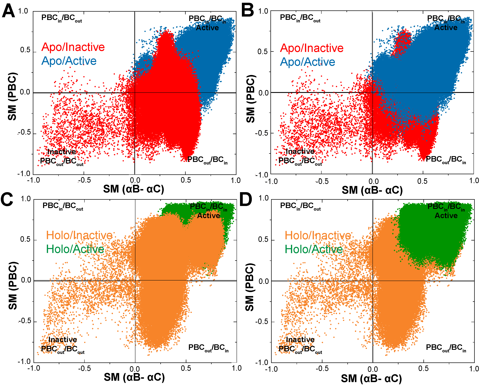

**图S3：PBC视角的活化-非活化转变路径**
- (A-B) Apo状态的PBC vs αB-αC SM图谱，比较PBC与αB-αC区域在active与inactive结构间的差异
- (C-D) Holo状态的SM图谱，展示相同区域的构象变化
- **关键发现**：与Figure 5类似，所有激活路径都偏好紧凑的PBCin/BCin中间态，而非松散的PBCout/BCout路径

#### 重要结论

基于Figure 5和S3的SM图谱分析，我们得出以下关键结论：

- **紧凑中间态是变构转变的瓶颈**：Figure 5的SM图谱显示所有四态轨迹**都对右下象限（N3Ain/BCin紧凑中间态）有偏好采样**，数据点密度最高。文献基于此**推论**认为这是inactive→active转变的"obligatory"（必经）中间态，物理上对应最小的空间位阻。需要注意的是，SM图谱本身不能直接观察完整的转变路径，这一推论仍需单分子实验或毫秒级增强采样进一步验证。

- **apo/active中间态的混合特征**：结合了holo/active和apo/inactive的元素——PBC动力学类似apo/inactive（较不稳定，需要cGMP结合来稳定），而αB-αC螺旋构象类似holo/active（较稳定，主要由变构状态调控）。这解释了为什么apo/active状态的SM分布跨越多个象限。

- **holo/inactive中间态更接近inactive**：无论在PBC还是αB-αC水平，holo/inactive都更像apo/inactive而非holo/active。这表明**单靠cGMP结合不足以驱动active构象**，必须同时满足变构构象变化才能实现激活，验证了PBC的双重依赖机制。

- **N3A的动态采样特性**：N3A在所有四个状态下都能动态采样in和out取向（Figure 5E显示N3A的双向箭头），这与其在**结构上的相对独立性**有关。相比之下，αB-αC螺旋的in/out转变更受构象状态约束（Figure 4C显示active状态αB-αC更稳定）。

### 3. C端螺旋相互作用：激酶激活的关键接触

#### 与人类PKG和HCN通道的比较

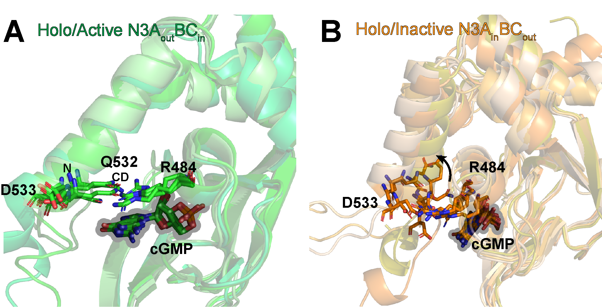

**图S5：PfPKG与人类PKG的αC螺旋相互作用对比**
- (A) Holo/Active的PfPKG CBD-D（N3Aout/BCin）与人类PKG Iβ CBD-B的叠合视图。**PfPKG用绿色丝带表示，人类PKG Iβ用青色丝带表示**，cGMP与关键残基以棒状显示。两者在β-core上对齐，便于比较lid区域与αC螺旋的接触
- (B) Holo/Inactive的PfPKG CBD-D（N3Ain/BCout）与人类PKG Iβ CBD-B的叠合视图。PfPKG以橙色系表示，人类PKG Iβ以浅色半透明丝带表示，cGMP与关键残基以棒状显示，用于对比非活化构象下的lid位置与cGMP周围相互作用
- **关键差异：PfPKG的R484可与C端αC螺旋Q532/D533形成capping triad**，而人类PKG Iβ对应的K308不形成类似稳定接触，为选择性变构抑制提供了结构依据
 - 两个面板均以β-core为对齐基准，强调lid与αC螺旋相互作用的物种差异

PfPKG的变构机制与哺乳动物PKG存在显著差异。人类PKG Iβ的CBD-B中，αB-螺旋在cGMP结合后动力学降低（保护作用），而PfPKG的CBD-B显示动力学增强（去保护作用）。这种差异使得**CBD-B成为PfPKG选择性抑制的潜在靶点**。

与HCN（超极化激活环核苷酸门控）通道相比，PfPKG的变构转变路径更为单一，所有激活路径都经过“紧凑”N3Ain/BCin中间态，而HCN遵循多分支的路径。这表明**不同环核苷酸结合结构域的变构调控机制存在显著多样性**。

#### 关键相互作用

通过比较holo/active和holo/inactive状态的N3Aout/BCin和N3Ain/BCout构象，可以识别激酶激活所需的关键相互作用。

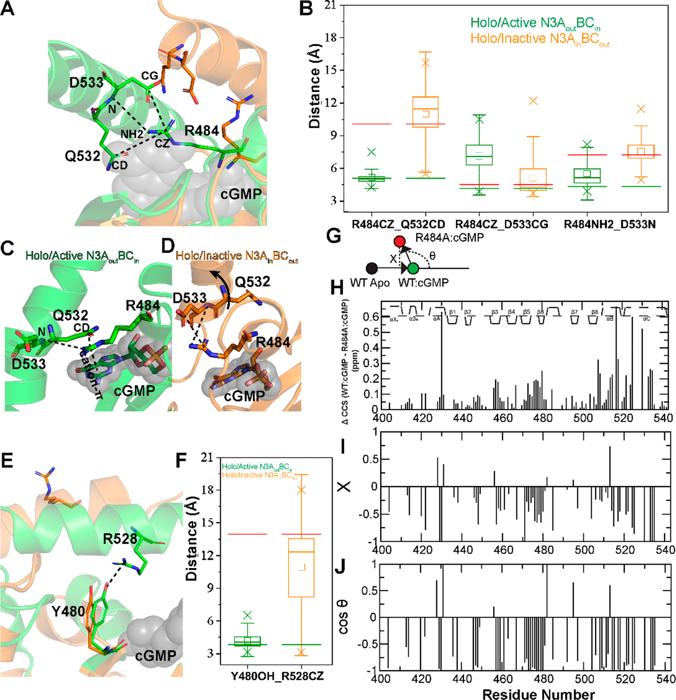

**图6：C端螺旋与PBC的相互作用分析**
- (A, E) PfPKG CBD-D C端αC螺旋与PBC、Y480的相互作用示意。绿色为holo/active晶体结构，橙色为holo/inactive初始模型。**A**展示“capping triad”内的盐桥网络，**E**展示Y480–R528氢键。
- (B, F) 对应A与E的距离分布箱线图，绿色为holo/active N3Aout/BCin集合，橙色为holo/inactive N3Ain/BCout集合，绿色/红色线标记晶体结构与初始模型的距离。**绿色箱体（左）表示接触更短更稳，橙色（右）表示接触被拉开**。
- (C, D) 来自MD轨迹的代表性结构，进一步对比“capping triad”的几何组合。**active集合保持三联体稳定相互作用，而inactive集合中Q532更倾向远离R484，仅保留D533与R484的单盐桥**。

| 相互作用类型      | Holo/Active状态              | Holo/Inactive状态                 | 结构后果                    |
| ----------------- | ---------------------------- | --------------------------------- | --------------------------- |
| **R484-Q532盐桥** | 稳定存在（绿色箱体分布靠左） | 被破坏/不稳定（橙色箱体分布右移） | Q532远离R484，triad结构解体 |
| **R484-D533盐桥** | 稳定存在                     | 相对保持（单盐桥）                | D533靠近R484，但Q532已远离  |
| **Y480-R528氢键** | 稳定存在                     | 显著减弱                          | αC螺旋与PBC的空间解耦       |

这些差异与文献中的突变结果一致，**支持用holo/active与holo/inactive两组MD集合来筛选激活所必需的PBC/αC螺旋接触**。因此在N3Ain/BCout集合中，这些接触应被明显削弱，而在N3Aout/BCin集合中保持稳定，这正是B–F所观测到的趋势。

- (G–J) R484A突变体的CHESPA分析：**G为矢量示意**，H为WT与R484A在cGMP结合状态下的化学位移差异，I为fractional shift（$X$），J为$\cos(\Theta)$。CHESPA用WT的apo→holo位移变化定义**激活向量**，用突变体相对WT的位移变化定义**突变向量**，比较方向与投影大小。
  - **激活向量由WT在apo与holo之间的化学位移差值组成**，代表配体结合引发的构象变化方向。
  - 这些化学位移来自**实验NMR 1H–15N HSQC谱图**，在WT与R484A的apo与cGMP结合条件下测量后进行CHESPA投影分析。
  - $\cos(\Theta)$计算式：

    $$
    \cos(\Theta)=\frac{\vec{\delta}_{\text{mut}}\cdot\vec{\delta}_{\text{act}}}{\left|\vec{\delta}_{\text{mut}}\right|\left|\vec{\delta}_{\text{act}}\right|}
    $$

  - $X$值计算式：

    $$
    X=\frac{\vec{\delta}_{\text{mut}}\cdot\vec{\delta}_{\text{act}}}{\left|\vec{\delta}_{\text{act}}\right|^{2}}
    $$

  - $X$表示**突变效应在激活方向上的投影强度**，$X=0$表示不沿激活方向变化，$X<0$说明突变把体系拉回非活化方向。
  - **Δδ表示综合化学位移差异强度**，用于衡量突变对局部结构的总体扰动幅度。
  - **多数残基$X$为负且$\cos(\Theta)$接近−1**，说明R484A显著把体系拉回非活化方向，**验证R484是维持active构象的关键锚点**。

Capping triad是PfPKG CBD-D激活的关键结构元件，由PBC的**R484**与C端αC螺旋的**Q532/D533**形成的盐桥网络组成。这一结构在PfPKG中是独特的，人类PKG Iβ对应位置是K308，不与αC螺旋形成类似的相互作用（Figure S5），这为设计物种选择性抑制剂提供了基础。

- **R484的位置优势**：R484位于PBC loop，其guanidinium基团可以同时与Q532和D533形成离子对
- **立体化学互补**：在active构象中（N3Aout/BCin），R484、Q532、D533三者空间排列形成稳定的三角网络
- **双重稳定作用**：Capping triad既稳定了αC螺旋的向内构象（BCin），又通过R484-cGMP cation-π相互作用稳定了配体结合

### 4. cGMP结合相互作用：激活与非活性态的差异

进一步分析cGMP与PBC和BBR区域的相互作用，可以识别区分holo/active和holo/inactive状态的关键结合特征。

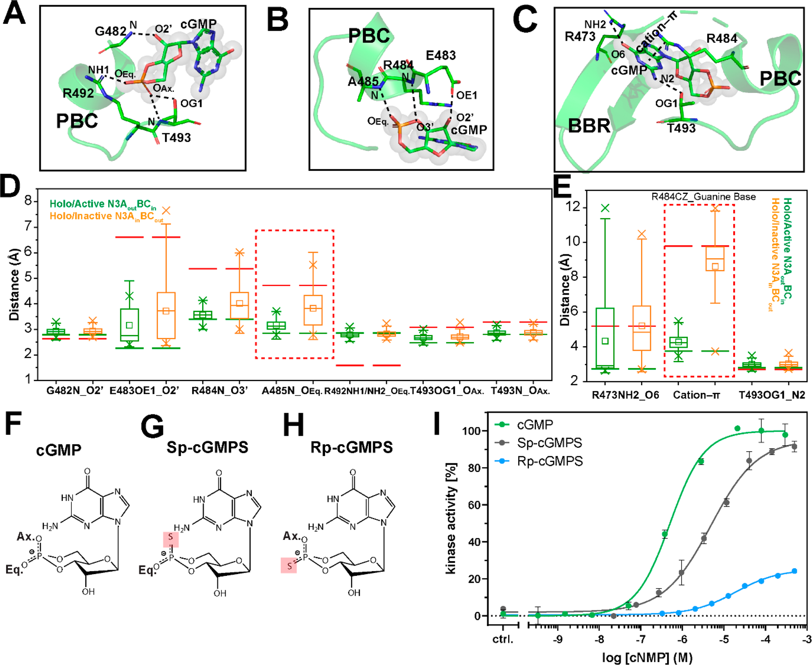

**图7：PBC与cGMP及类似物的关键相互作用**
- (A–C) cGMP与PfPKG CBD-D的相互作用示意（PDB: 4OFG），虚线标示监测的相互作用距离，标注参与相互作用的残基
- (D, E) 关键原子对距离分布的箱线图，绿色为holo/active N3Aout/BCin，橙色为holo/inactive N3Ain/BCout，红色虚线框标示两种集合间变化最显著的相互作用
- (F–H) 磷酸硫代cGMP类似物的结构示意：**Sp-cGMPS**和**Rp-cGMPS**
- (I) PfPKG 401-853的环核苷酸依赖性激活曲线，展示不同类似物的激活能力

Figure 7A-C详细展示了cGMP如何与PBC和BBR区域形成多重相互作用：

| 区域 | cGMP部分 | 关键残基 | 相互作用类型 | 功能 |
| --- | --- | --- | --- | --- |
| **PBC** | 磷酸基团 | 482-485, 492-493 | 氢键网络 | 锚定cGMP的磷酸基团 |
| **PBC** | 磷酸基团 | T493 | 桥接氢键 | 连接轴向氧和氨基 |
| **BBR** | 鸟嘌呤碱基 | R473 | 氢键 | 识别碱基特异性 |
| **PBC** | 鸟嘌呤碱基 | R484 | cation-π | 稳定碱基结合，形成capping triad的一部分 |

T493的羟基同时与cGMP的磷酸基团（轴向氧）和氨基形成氢键，在空间上起到桥梁作用，是PBC区域中唯一同时与cGMP两个部分相互作用的残基。Figure 7D, E的红色虚线框标出了两种holo状态间差异最大的相互作用：

- **A485-cGMP氢键**：Holo/active中稳定，holo/inactive中被破坏（Figure 7D）
- **R484-cGMP cation-π相互作用**：Holo/active中强，holo/inactive中显著减弱（Figure 7E）

这两个相互作用的变化与Figure 6中Capping triad的破坏相呼应，共同导致了holo/inactive状态的失活。

#### cGMP类似物的设计策略与实验验证

文献基于MD预测设计了Rp-cGMPS和Sp-cGMPS两种立体异构体，用于验证A485-cGMP氢键的重要性：

| 类似物 | 修饰位置 | 设计原理 | 预测效果 | 实验结果 |
| --- | --- | --- | --- | --- |
| **Rp-cGMPS** (Figure 7H) | 轴向氧→硫（Rp构型） | 破坏A485-cGMP关键氢键 | 激酶活性大幅降低 | 75%活性降低，验证预测 |
| **Sp-cGMPS** (Figure 7G) | 平分向氧→硫（Sp构型） | 修饰非关键相互作用 | 活性轻微降低 | 仅10%降低，作为对照 |

Figure 7I的激酶活性实验显示，**Rp-cGMPS的弱激动剂效应**（蓝色曲线）激活能力降至\~25%，证明A485-cGMP氢键对激酶激活至关重要；**Sp-cGMPS的部分激动剂效应**（黑色曲线）激活能力降至\~90%，验证了其他相互作用的保守性。这形成了从预测到验证的闭环：MD模拟（Figure 7D, E）→设计类似物→激酶活性实验（Figure 7I）。

#### 变构抑制剂的启示

Figure 7的结果揭示了靶向R484-A485-cGMP相互作用网络的潜力：

- **选择性破坏**：这两个相互作用在holo/active中强，在holo/inactive中弱，是理想的变构抑制剂靶点
- **保留结合亲和力**：其他cGMP-PBC/BBR相互作用在两种holo状态中保守，破坏R484-A485不会完全丧失cGMP结合
- **物种选择性基础**：PfPKG的R484可形成capping triad，而人类PKG Iβ的K308不与αC螺旋相互作用（Figure S5），为宿主-寄生虫选择性提供了结构基础

> 唉，其实这些都是如何解释机制能算的一些指标。虽然都能用，但是似乎还是没有那么直接，比如直接去算QM过程的free energy vs RC。

## 讨论

本研究通过MD模拟完整映射了PfPKG CBD-D的四态变构热力学循环，识别了区分激活与非活性状态的关键相互作用。这些发现为理解PfPKG的变构调控机制提供了原子级视角。

### 变构抑制剂设计的结构基础

holo/inactive中间态代表了**配体结合但不激活**的独特状态，是设计变构抑制剂的关键靶点。通过比较holo/active和holo/inactive状态，我们识别了几个关键的结构差异：

| 关键相互作用 | Holo/Active状态 | Holo/Inactive状态 | 抑制剂设计策略 |
| --- | --- | --- | --- |
| **R484-cGMP阳离子-π作用** | 强（稳定） | 弱或缺失 | 设计类似物削弱此作用 |
| **A485-cGMP氢键** | 完整（氧原子） | 破坏 | Rp-cGMPS中氧→硫替代显著降低活性 |
| **R484-Q532/D533-capping triad** | 存在 | 弱化或缺失 | 靶向破坏此三联体 |
| **C端螺旋-αC螺旋相互作用** | 稳定 | 松动 | 设计分子阻止螺旋靠近 |

#### Rp-cGMPS的实验验证

将A485酰胺与cGMP磷酸氧的氢键破坏后（氧→硫替代），激酶活性降低75%，证明了靶向R484-A485相互作用可以实现变构抑制，同时保持与cGMP其他接触的保守性。

#### 物种选择性机制

PfPKG的R484可形成capping triad与C端αC螺旋的Q532/D533相互作用，而人类PKG Iβ对应的K308不与αC螺旋相互作用（Figure S5）。靶向R484相互作用可能实现PfPKG vs人类宿主的选择性。

## Q&A

### Q1：为什么PBC区域的稳定化需要同时满足cGMP结合和变构构象变化？

**A1**：PBC区域的动力学响应显示出**独特的双重依赖机制**，这在物理化学上可以通过以下几个方面理解：

1. **构象选择的局限性**：如果纯粹是构象选择机制（蛋白预先存在multiple conformations，cGMP选择其中一种结合），那么apo/active状态（已经具有active构象）的PBC应该也相对稳定。但Figure 3B和4B显示，apo/active的PBC RMSF和RMSD都显著高于holo/active，说明仅有active构象是不够的。

2. **诱导契合的局限性**：如果纯粹是诱导契合机制（cGMP结合后诱导蛋白构象改变），那么holo/inactive状态（有cGMP结合）的PBC应该相对稳定。但数据显示holo/inactive的PBC RMSF和RMSD与apo/inactive相近，说明仅有cGMP结合也是不够的。

3. **协同作用的物理本质**：cGMP与PBC的相互作用形成一个**正反馈循环**：
   - cGMP优先结合到active构象的PBC（构象选择成分）：active构象的PBC具有更适合的几何形状和电荷分布，结合亲和力更高
   - cGMP结合进一步稳定和锁定active构象（诱导契合成分）：cGMP与PBC的氢键、cation-π等相互作用网络增强了active构象的稳定性
   - 这两个过程是同时发生、相互促进的，而非先后独立的步骤

4. **能量景观的视角**：在四态热力学循环中，holo/active状态位于能量最低点（Figure 5的右上象限聚集了大量数据点），而apo/active和holo/inactive都位于较高的能量状态。这表明cGMP结合和active构象的同时满足才能达到最稳定的能量状态，两者存在协同的能量贡献。

### Q2：为什么所有激活路径都必须经过“紧凑”N3Ain/BCin中间态？

**A2**：这一发现可以通过**能量景观理论**和**拓扑约束**来解释：

1. **拓扑约束的物理原因**：从N3Ain/BCout（inactive）到N3Aout/BCin（active）的转变涉及两个主要结构元件的重排。直接从N3Ain/BCout跳变到N3Aout/BCin需要同时改变N3A和αB-αC的位置，这在能量上是不利的。相反，通过紧凑的N3Ain/BCin中间态，可以逐步改变各个元件的位置，降低能垒。

2. **N3A的in/out采样动力学**：Figure 5显示N3A在所有四个状态下都能动态采样in和out取向，这意味着N3A的重排相对容易。而αB-αC螺旋的in/out转变则更受构象状态的约束（Figure 4C显示active状态αB-αC更稳定）。因此，N3Ain/BCin中间态代表了一个能量上的有利过渡态，其中N3A已经向内，αB-αC也准备向内移动。

3. **与HCN通道的比较**：HCN通道的变构转变遵循多分支路径，而PfPKG CBD-D显示出对紧凑中间态的强偏好，这反映了不同环核苷酸结合结构域的变构调控机制多样性，可能与功能需求（如激活速度、调控精度）相关。

### Q3：holo/inactive中间态如何指导变构抑制剂设计？

**A3**：holo/inactive中间态代表了**配体结合但不激活**的独特状态，其结构特征为设计变构抑制剂提供了三个关键策略：

1. **靶向R484-A485与cGMP相互作用**：Figure 7D, E显示从holo/active到holo/inactive转变时，R484-cGMP的cation-π相互作用和A485-cGMP氢键被显著破坏。Rp-cGMPS实验（Figure 7I）证明破坏A485-cGMP氢键可降低75%激酶活性，这验证了靶向这些相互作用可以实现变构抑制。

2. **破坏capping triad相互作用**：Figure 6显示R484与C端αC螺旋的Q532/D533形成的capping triad在holo/active状态稳定存在，而在holo/inactive状态被破坏。设计小分子或肽段干扰这个三联体，可以阻止C端螺旋与PBC的稳定相互作用，从而抑制激活。

3. **物种选择性的结构基础**：Figure S5显示PfPKG的R484可形成capping triad与C端αC螺旋相互作用，而人类PKG Iβ对应的K308不与αC螺旋形成类似相互作用。这种差异为设计PfPKG选择性抑制剂提供了明确靶点，可以实现对疟原虫的选择性毒性，避免对人类宿主的副作用。

## 关键结论与批判性总结

### 主要结论

本研究的结论与原文讨论部分一致，可归纳为以下几点：

- **完整描绘四态热力学循环的动力学变化**：通过MD与实验数据支持，系统刻画了apo/inactive、apo/active、holo/inactive、holo/active四态的动力学差异，**尤其涵盖实验难以直接表征的中间态**。
- **区分cGMP结合与变构构象变化的贡献**：动力学地图揭示apo/inactive→holo/active转变同时依赖cGMP结合与构象变换，两者贡献可被拆分比较。
- **中间态的结构特征具有设计价值**：相似性分析显示apo/active兼具apo/inactive与holo/active特征，holo/inactive更接近apo/inactive，这为**“结合但不激活”的变构抑制剂**提供了明确参照。
- **关键接触位点明确**：PBC与αC螺旋的接触（R484‑Q532/D533 capping triad、Y480‑R528氢键）对激活至关重要，且R484‑A485与cGMP的相互作用在holo/inactive与holo/active之间差异显著，提示**可优先靶向这些接触进行选择性干预**。
- **物种选择性线索**：PfPKG的R484对应人类PKG Iβ的K308，后者不与αC螺旋形成同类接触，**破坏R484相关相互作用可能带来Pf与宿主的选择性**。

### 已知限制与待验证点

- **中间态的实验表征仍具挑战**：原文指出apo/active与holo/inactive等中间态难以通过实验直接捕捉，因此目前主要依赖模拟与间接实验证据支撑。

### 研究意义与可预期方向

- **变构抑制剂设计的直接线索**：holo/inactive特征可用于设计“结合但不激活”的配体，**优先削弱R484‑A485与cGMP的作用**或破坏capping triad。
- **验证路径清晰**：文中通过突变与CHESPA证实R484A可逆转激活方向，支持以PBC/αC螺旋接触为核心的验证与优化策略。
