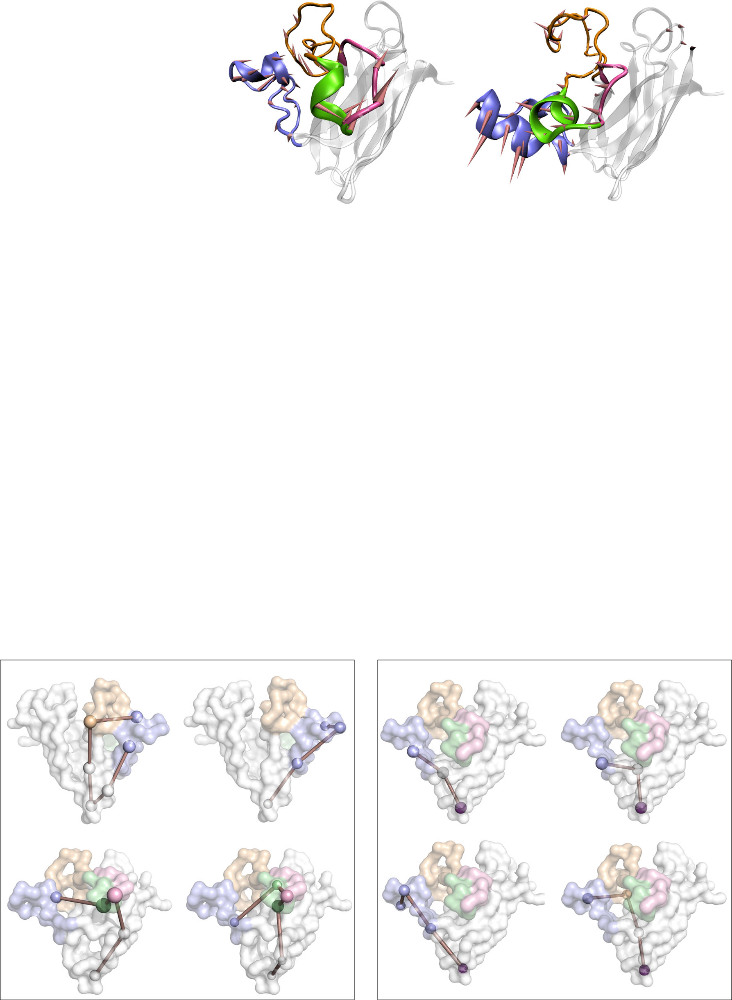
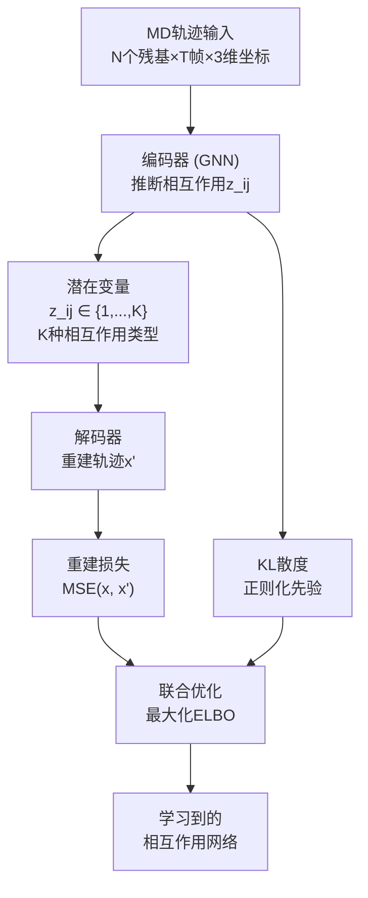
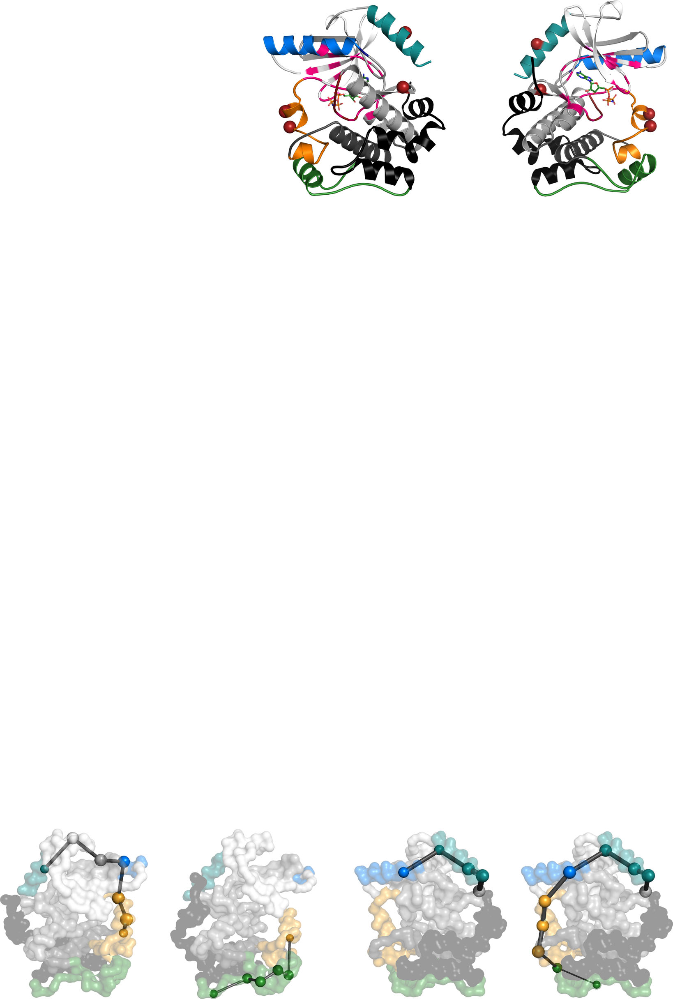
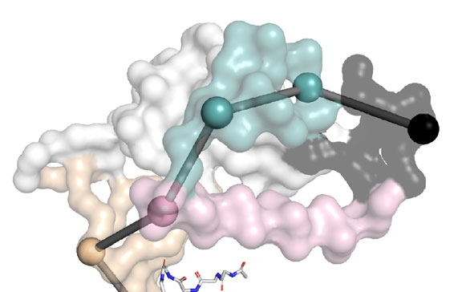
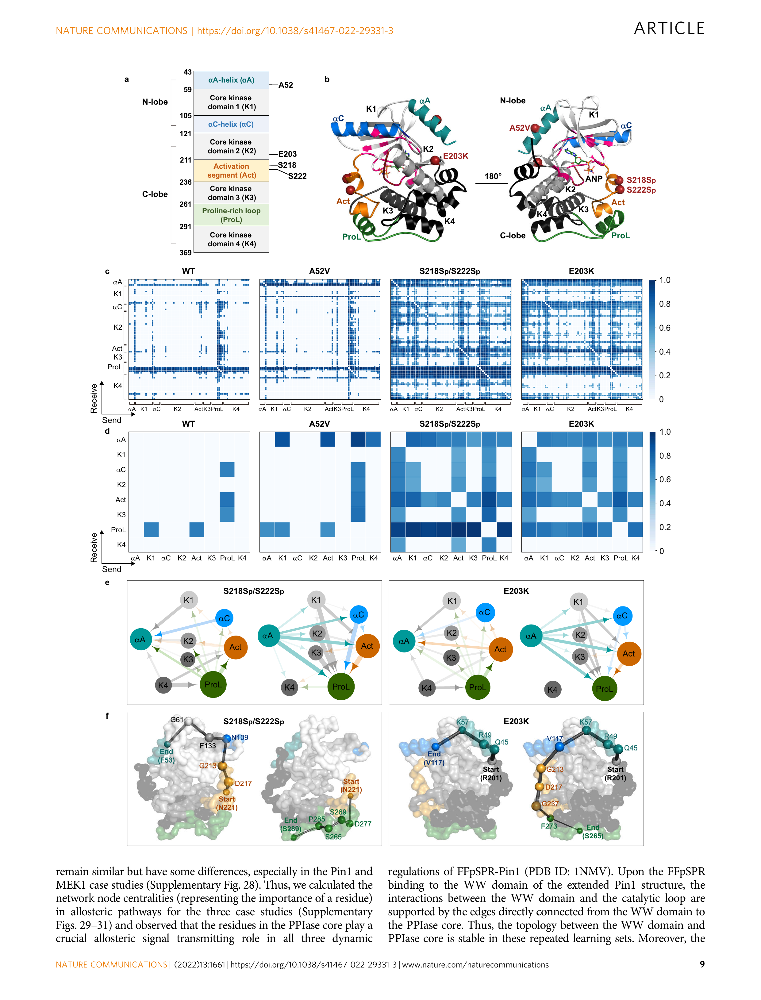
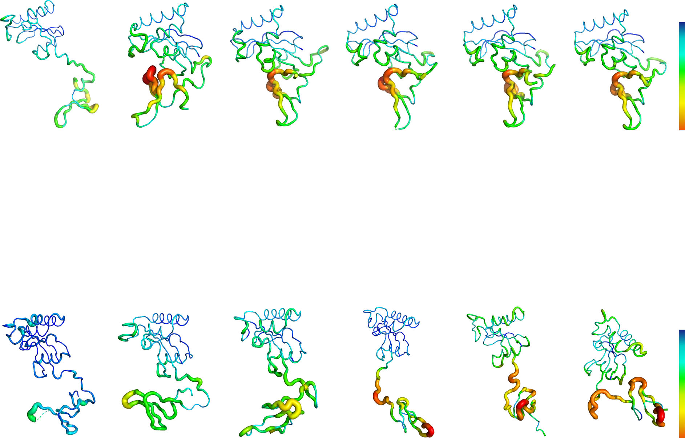
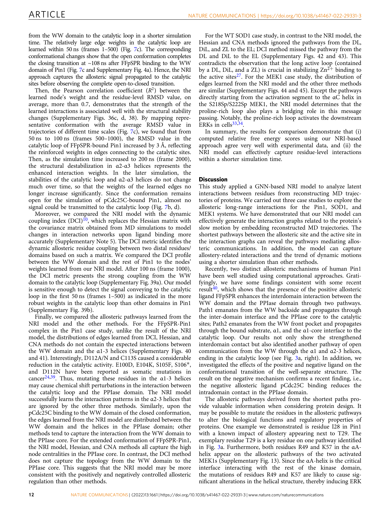

# 神经关系推断：从MD轨迹中学习蛋白质长程变构相互作用

## 本文信息
- **标题**：Neural Relational Inference to Learn Long-range Allosteric Interactions in Proteins from Molecular Dynamics Simulations
- **作者**：Jingxuan Zhu¹,²,³, Juexin Wang¹,², Weiwei Han¹, Dong Xu²
- 发表时间: 2022年3月10日
- **单位**：
  1. 吉林大学生命科学学院，酶学与工程教育部重点实验室（中国长春）
  2. 密苏里大学电气工程与计算机科学系，Bond生命科学中心（美国哥伦比亚）
- **期刊**：Nature Communications
- **引用格式**：Zhu, J., Wang, J., Han, W. & Xu, D. Neural relational inference to learn long-range allosteric interactions in proteins from molecular dynamics simulations. *Nat Commun* **13**, 1661 (2022). https://doi.org/10.1038/s41467-022-29331-3
- **源代码**：https://github.com/juexinwang/NRI-MD

## 摘要
> 蛋白质变构是一种由空间上长程的分子内通信促进的生物过程，即远端位点的配体结合或氨基酸变化能够远程影响活性位点。分子动力学（MD）模拟为探测变构效应提供了强大的计算方法。然而，当前的MD模拟仍无法达到整个变构过程的时间尺度。深度学习的出现使评估空间上短程和长程通信以理解变构成为可能。为此，我们应用了一种基于图神经网络的神经关系推断模型，该模型采用编码器-解码器架构同时推断潜在相互作用，将蛋白质变构过程探测为相互作用残基的动态网络。从MD轨迹中，该模型成功学习了可以介导Pin1、SOD1和MEK1系统中远端位点间变构通信的长程相互作用和路径。此外，该模型能够在MD模拟轨迹中更早发现与变构相关的相互作用，并比其他方法更准确地预测突变后的相对自由能变化。

### 核心结论
- **深度学习破解变构难题**：首次将神经关系推断（NRI）模型应用于MD数据分析，通过encoder-decoder架构从MD轨迹中推断残基间的相互作用网络
- **长程通信路径识别**：成功识别了Pin1、SOD1和MEK1三个系统中介导变构通信的长程路径，揭示了WW域与催化位点之间的通信机制
- **早期信号捕获能力**：NRI模型能在MD轨迹的早期阶段（50-100 ns）检测到变构信号，远早于传统方法（200 ns以后）
- **自由能预测优势**：基于学习到的相互作用网络计算的自由能变化与实验数据高度一致（$R^2=0.939$），显著优于传统方法（$R^2=0.188$）
- **物理可解释性**：学习到的相互作用类型具有明确的物理意义，揭示了结构域间的动态耦合模式

## 背景
蛋白质变构是蛋白质功能调控的核心机制之一，通过空间上远离活性位点的区域（如别构位点）来影响蛋白质的活性。这种长程通信机制使蛋白质能够整合多个信号输入，实现精细的功能调控。然而，理解变构信号如何在蛋白质内部传播一直是结构生物学领域的重大挑战。

传统研究变构的方法主要基于静态晶体结构或简化的弹性网络模型，但这些方法难以捕捉蛋白质在全原子模拟中的动态复杂性。分子动力学（MD）模拟虽然能够提供原子级别的运动信息，但由于变构过程通常发生在微秒到毫秒时间尺度，而常规MD模拟仅能达到纳秒到微秒级别，使得直接观测完整的变构过程变得困难。

近年来，图神经网络（GNN）在分析复杂系统方面展现出巨大潜力。特别是神经关系推断（NRI）模型，作为一种无监督学习方法，能够同时推断系统中实体间的相互作用关系并预测系统演化。这种方法已被成功应用于交通系统、动态物理系统和计算机视觉等领域，但在生物分子系统中的应用尚属空白。

### 关键科学问题
- **时间尺度不匹配**：MD模拟的时间尺度（纳秒-微秒）远短于完整变构过程（微秒-毫秒），如何从有限长度的轨迹中提取有意义的变构信息
- **高维数据分析困难**：MD轨迹产生的高维（$3N$维）动态数据难以直接分析，需要有效的降维和信息提取方法
- **因果vs相关关系**：传统基于相关性的方法难以区分变构通信中的因果关系，可能误判非因果性的相关关系
- **长程通信识别**：如何在复杂的残基相互作用网络中准确识别介导长程变构通信的关键路径

### 创新点
- **NRI模型首次应用于MD分析**：首次将神经关系推断模型应用于生物分子MD数据分析，通过GNN同时推断残基间的潜在相互作用
- **动态相互作用网络**：将蛋白质变构过程建模为相互作用残基的动态网络，学习到的边权重反映了残基间相互作用的强度
- **轨迹重建验证**：通过重建原始MD轨迹来验证学习到的相互作用的有效性，确保模型捕获的是真实的物理相互作用
- **早期信号检测**：NRI模型能够在MD轨迹的早期阶段（50-100 ns）检测到变构信号，比传统方法提前数倍
- **自由能准确预测**：基于学习到的相互作用网络计算突变后的相对自由能变化，与实验数据高度一致

---
## 研究内容

### NRI模型架构与训练

**图1：通过重建MD模拟轨迹推断相互作用图的过程**
该图展示了NRI模型的完整工作流程，从系统准备到相互作用推断：

- **(a) 变构系统准备**：准备配体-结合复合物或突变蛋白质的变构系统结构，包括Pin1（WW域+PPIase域）、SOD1（β桶+活性环）、MEK1（N叶+C叶+激活片段）
- **(b) MD模拟**：对制备的变构系统进行MD模拟，获得包含动态3D坐标的轨迹数据，采样间隔约为20 ns，总模拟时间100-500 ns
- **(c) 常规分析**：传统的MD轨迹分析方法，如RMSD、RMSF、PCA等，提供结构变化和柔性信息
- **(d) NRI模型**：包含两个 jointly 训练的组件——**编码器**（推断潜在相互作用的因子化分布$q_\phi(z|x)$）和**解码器**（基于采样的相互作用重建动态系统）

#### 编码器-解码器架构

NRI模型的核心思想是将MD轨迹中的残基运动建模为动态系统，其中每个残基的运动受到其与其他残基相互作用的影响。模型采用变分自编码器（VAE）框架，最大化证据下界（ELBO）：

$$
\log p_\theta(x) \geq \mathbb{E}_{q_\phi(z|x)}[\log p_\theta(x|z)] - D_{KL}(q_\phi(z|x) || p_\theta(z))
$$

其中：
- $x$ 是MD轨迹中的残基坐标
- $z$ 是残基间的潜在相互作用（以边的形式表示）
- $q_\phi(z|x)$ 是编码器推断的后验分布
- $p_\theta(x|z)$ 是解码器重建的轨迹分布
- $p_\theta(z)$ 是先验分布（均匀独立的分类分布）

**编码器**采用图神经网络（GNN）在完全连接网络上处理输入坐标，输出每个残基对的相互作用类型分布：

$$
q_\phi(z_{ij}|x) = \text{softmax}(f_{\text{enc},\phi}(x)_{ij,1:K})
$$

其中 $K$ 是相互作用类型的数量（本文中$K=10$），$f_{\text{enc},\phi}(x)$ 是GNN编码器。

**解码器**根据采样的相互作用$z$重建动态系统，预测下一时刻的残基位置。通过最小化重建误差（MSE）和最大化似然，模型学习到有意义的相互作用模式。

#### GNN消息传递机制：Receive与Send

NRI模型的核心是图神经网络的消息传递机制，通过交替的"节点到边"和"边到节点"操作来传播信息：

**节点到边（Send）操作**：节点发送自身嵌入给相连的边

对于每条边$(i,j)$，接收来自节点$i$和节点$j$的嵌入：

$$
h_{ij} = f_e([h_i, h_j])
$$

物理意义：节点向可能的相互作用伙伴传达自身状态信息，这里$h_i$和$h_j$是节点的隐藏状态表示。

**边到节点（Receive）操作**：节点接收来自所有连接的边的消息

节点$j$接收的消息：

$$
h_j^{\text{new}} = f_v\left(\sum_{i \neq j} h_{ij}\right)
$$

物理意义：节点整合来自所有相互作用伙伴的信息，更新自身的状态表示。这里$\sum_{i \neq j} h_{ij}$表示聚合所有指向节点$j$的边消息。

**多轮消息传递**：

1. **初始节点嵌入**：将轨迹特征映射到节点嵌入$h_i = f_{\text{enc}}(x_i)$
2. **第一轮v→e**：计算所有残基对的边嵌入候选$h_{ij}$
3. **第一轮e→v**：聚合边消息更新节点状态
4. **重复**：进行多轮消息传递（通常2-3轮）
5. **生成分布**：输出每条边的$K$种相互作用类型分布$z_{ij}$

这种机制使模型能够捕获残基间复杂的、非线性的相互作用模式，而非简单的线性相关或距离依赖关系。

#### 相互作用的物理意义

模型学习到的$K$种相互作用类型没有预先定义的物理含义，而是通过训练自动获得。通过对学习结果的分析，发现不同类型的相互作用对应不同的物理机制：
- **强约束相互作用**：对应于氢键、盐桥等强相互作用，限制残基相对运动
- **弱耦合相互作用**：对应于范德华力、疏水相互作用等弱相互作用，允许一定柔性
- **动态介导相互作用**：对应于在变构过程中变化的关键相互作用，如构象转换中的瞬时接触

这种无监督学习方法避免了人为定义相互作用的局限性，能够发现传统方法难以识别的潜在相互作用模式。

### Pin1系统：域间变构通信路径

**图2：Pin1在配体结合或突变时的蛋白质柔性和相互作用模式变化**

该图全面展示了Pin1在不同状态下的结构动力学和相互作用网络，是理解NRI模型如何从MD轨迹中学习变构信息的关键图示：

##### **图2a：蛋白质主链柔性变化（Backbone RMSD）**

**具体内容**：热图展示Pin1主链的均方根偏差（RMSD），颜色表示结构柔性

**颜色编码**：蓝色（低RMSD，稳定）→红色（高RMSD，柔性）

**六种系统对比**：
- **apo-Pin1**（无配体）：WW域（β1-β2）、催化环、α2螺旋和PPIase核心（β5/α4）显示高柔性（红色）
- **FFpSPR-Pin1**（正调控配体）：这些区域的柔性显著降低（变为蓝色），表明配体结合稳定了蛋白质构象
- **I28A突变**：即使有FFpSPR结合，整体柔性增加，特别是WW域和催化环
- **pCdc25C-Pin1**（负调控配体）：保持较高柔性，允许构象探索

**说明的问题**：
- 配体结合对柔性的影响：FFpSPR结合后，WW域和PPIase域的柔性被显著抑制
- 正负调控差异：正调控配体使结构更刚性，负调控配体保持高柔性
- 突变效应：I28A突变破坏了域间界面的稳定性

**逻辑链条**：配体结合/突变 → 改变局部相互作用 → 影响结构柔性 → 反映在RMSD变化 → 指示变构效应存在

##### **图2b：残基间学习到的边缘分布图**

**具体内容**：点-线图，每个点代表一个残基，线代表NRI模型推断的显著相互作用

**表示方式**：
- 节点沿x轴排列，对应蛋白质序列位置
- 边的颜色/粗细表示相互作用强度或类型

**说明的问题**：
- **相互作用网络拓扑**：显示哪些残基对在动力学上耦合，即使它们空间距离可能较远
- **WW域的枢纽作用**：WW域残基与其他区域有大量连接，表明其在动力学网络中的中心地位
- **配体特异性模式**：FFpSPR结合增强WW与PPIase核心间的连接，pCdc25C结合则产生不同的连接模式
- **关键残基识别**：I28、T29、C113等实验已知的重要位点在图中显示高连接度

**逻辑链条**：NRI分析MD轨迹 → 推断残基间潜在相互作用 → 构建相互作用网络 → 识别网络中心和关键连接

##### **图2c：结构域/区块间边缘分布图**

**具体内容**：将相邻残基聚类为结构域/区块（如WW域、催化环、α1螺旋等），展示域间相互作用模式

**表示方式**：矩阵热图或网络图，节点为结构域，边表示相互作用强度

**说明的问题**：
- **跨结构域通讯**：显示哪些结构域在动力学上耦合，FFpSPR结合增强了WW与PPIase核心的连接
- **变构通路可视化**：清晰的域间连接模式，如WW→PPIase核心→催化环的路径
- **调控机制差异**：正调控增强域间连接，负调控减弱域间连接

**逻辑链条**：残基水平相互作用 → 聚合到结构域水平 → 识别域间通讯模式 → 揭示变构调控的结构基础

##### **图2d：学习到的相互作用有向图**

**具体内容**：网络图表示，节点为结构域，边表示相互作用

**表示方式**：
- **节点大小**：连接度（多少边连接到此节点）
- **边粗细**：相互作用强度
- **箭头**：影响方向（从发送方到接收方）

**说明的问题**：
- **信息流方向性**：揭示变构信号的可能传递方向，如FFpSPR结合后信号从WW流向PPIase核心，再到催化环
- **网络中心性分析**：大节点是关键枢纽，如PPIase核心在多个系统中都是中心节点
- **系统比较**：不同配体/突变导致不同的网络拓扑，提供了变构机制的结构解释

**逻辑链条**：NRI推断相互作用 → 构建有向网络 → 分析网络拓扑属性 → 推断信息流路径 → 解释变构机制

##### **综合逻辑链条**

**整体分析框架**：
1. 实验设计（不同配体/突变）
2. MD模拟不同系统
3. NRI模型训练与推断
4. 相互作用图构建
5. 网络分析与通路识别
6. 机制解释与验证

**核心发现逻辑**：
- **变构信号传递路径的存在性证明**：NRI成功推断出WW域到催化环的路径，这些路径在配体结合后增强，无配体时不存在
- **正负调控机制对比**：正调控（FFpSPR）增强域间连接，形成完整信号通路；负调控（pCdc25C）减弱域间连接，阻断信号传递
- **突变效应解释**：I28A突变破坏了WW与PPIase核心的连接，解释了其功能丧失
- **方法优势验证**：NRI能早期检测变构信号（50 ns内），比其他方法更敏感，能识别非线性、因果性相互作用

#### Pin1结构与功能

Pin1是一种包含两个结构域的肽酰脯氨酰顺反异构酶：
- **WW域**（残基1-39）：识别并结合磷酸化Ser/Thr-Pro基序，但无法催化异构化反应
- **PPIase域**（残基50-163）：包含催化位点，执行肽酰脯氨酰键的顺反异构化
  - **PPIase核心**：α4-螺旋和β4-β7折叠片
  - **α1-α3螺旋**：形成催化位点的外壳
  - **催化环**：半无序结构，参与底物结合和催化

两个域通过连接肽（残基40-49）相连，形成独特的双域结构。WW域的结合能够变构调节PPIase域的活性，这种长程通信机制是Pin1功能调控的核心。

#### 配体结合的变构效应

研究比较了五种状态的Pin1：
1. **apo-Pin1**（PDB 3TDB）：无配体结合，WW域与PPIase域独立运动
2. **FFpSPR-Pin1**（PDB 3TDB）：正变构配体结合，WW域与PPIase域协调运动
3. **I28A突变**（PDB 3TDB）：域间界面突变，破坏WW-PPIase通信
4. **pCdc25C-Pin1**（PDB 1PIN）：负变构配体结合
5. **分离结构**（PDB 1NMV）：WW域与PPIase域完全分离

通过100 ns MD模拟（每20 ns采样一次，共50帧），NRI模型学习到了不同状态下的相互作用网络。关键发现：

**FFpSPR结合增强域间通信**：学习到的边在WW域和其他结构域之间频繁出现，表明WW域是蛋白质运动的关键元素。具体表现为：
- WW域与PPIase核心之间的连接显著增强
- WW域通过K97（α1-螺旋）和S105/C113（α2-3螺旋）与催化环建立新的通信路径
- 域间界面（I28/T29）和催化位点附近（C113）的残基出现在变构路径上

这些发现与实验研究一致，I28/T29和C113已被确定为影响Pin1活性的关键突变位点。

**图3：Pin1中介域间变构通信的路径**
通过计算学习到的网络中的最短路径，识别介导WW域到催化环的变构通信路径：

- **(a) FFpSPR-Pin1的变构路径**：三条路径从WW域出发，终结于催化环
  - **左侧路径**：WW → Q131（PPIase核心）→ R69（催化环）
  - **中间路径**：WW → P133（PPIase核心）→ S67（催化环）
  - **右侧路径**：WW → K97（α1螺旋）→ S105/C113（α2-3螺旋）→ 催化环
- **(b) apo-Pin1**：没有找到从WW域到催化环的路径，虽然WW域可以与α1-螺旋相互作用，但通信无法从α1-螺旋传递到催化环

#### 突变破坏域间通信

**I28A突变**的效应尤为显著：
- 学习到的相互作用图显示，I28A突变**急剧削弱**了WW域与PPIase核心/α2-3螺旋之间的相互作用
- WW域的涨落**阻断**了变构信号从WW向PPIase域的传播
- 这表明I28在域间界面的关键作用，其突变导致蛋白质失去变构调控能力

**pCdc25C结合**的负变构效应：
- PPIase核心与WW域的相互作用减少
- PPIase域内的边减少，反映域内接触减弱
- 几乎没有边连接到催化环，表明PPIase域内的变构通信受阻

**分离结构**（PDB 1NMV）的NRI分析：
- 学习到的边主要集中在WW域与PPIase核心之间
- 但与FFpSPR结合不同，WW域与α1-螺旋之间几乎无相互作用
- 这表明空间接近但缺乏功能耦合

#### 时间依赖的信号传播

通过分析不同时间窗口的相互作用演化，发现NRI模型能够在MD轨迹的**早期阶段**检测到变构信号：

- **50 ns（frames 1-500）**：催化环中较大的边权重已被学习到
- **100 ns（frames 1-1000）**：催化环的RMSD值增加3Å，反映连接到位点的边权重增强
- **200 ns（frames 1-2000）**：传统的derivative centrality方法才能检测到完整的变构传播

这表明NRI模型**比传统方法提前数倍**捕获变构信号，为理解变构机制提供了新的时间维度。

### SOD1系统：突变诱导的构象变化

**图4：SOD1中G93A突变引起残基/域间相互作用变化**
该图揭示了与ALS相关的G93A突变如何通过变构机制影响SOD1的功能：

- **(a) SOD1蛋白质的域划分**：展示了G93A突变的位置（红色箭头）以及各个结构域
  - **β桶**（灰色）：8条反平行β折叠片，形成蛋白质核心
  - **二聚化环**（DL，粉红色）
  - **二硫键环**（DiL，绿色）
  - **锌结合环**（ZL，橙色）
  - **静电环**（EL，蓝色）：小的活性环
- **(b) WT SOD1和G93A SOD1在300 ns的初始结构**：
  - **WT SOD1**：EL稳定在金属位点附近（绿色箭头向上）
  - **G93A SOD1**：EL远离金属位点（绿色箭头向下），表明构象变化
- **(c) WT（左）和G93A（右）在MD模拟中学习到的残基间边分布**：
  - WT：长活性环（DL、DiL、ZL）与小活性环（EL）紧密相互作用
  - G93A：长活性环内部连接几乎断裂，Zn（II）结合位点网络疏松
- **(d) 学习到的域间相互作用图**：
  - WT：活性环与β桶连接，导致EL闭合状态
  - G93A：活性环内连接断裂，EL开放
- **(e) 熵值归一化的边权重分布**：
  - WT：边权重集中在活性环内部
  - G93A：边权重分散，连接模式改变
- **(f) 从G93/A93开始的变构路径**：
  - WT（左）：G93 → DL → DiL → ZL → EL
  - G93A（右）：A93 → β桶 → EL，不再通过长活性环

#### SOD1功能与ALS病理

超氧化物歧化酶1（SOD1）是一种将超氧阴离子自由基转化为分子氧和过氧化氢的金属酶，在两步快速反应中交替还原和氧化活性位点铜。其整体结构由8条反平行β链加上形成活性位点的两个环组成。

**长活性环**（残基49-83）可进一步分为：
- **二聚化环**（DL）：介导蛋白质二聚化
- **二硫键环**（DiL）：包含结构性二硫键
- **锌结合环**（ZL）：结合Zn（II）离子

**小活性环**是**静电环**（EL），在金属位点附近发挥关键作用。

**G93A突变**与家族性肌萎缩侧索硬化症（ALS）相关：
- 突变位点远离金属位点，属于典型的**变构突变**
- 导致EL远离金属位点，降低Zn（II）亲和力
- 影响ALS的病理过程

#### MD模拟与NRI分析

对野生型（WT）和G93A SOD1进行500 ns MD模拟，分析结果：

**柔性变化**：
- G93A SOD1的EL比WT更加柔性
- 运动模式显示G93A突变诱导EL远离金属位点
- WT SOD1的EL稳定在金属位点附近

**氢键网络**：
- G93A突变使A93(O)-L38(N)距离增加，氢键相互作用减弱
- β桶与活性环间的许多氢键被削弱
- G93A SOD1结构比WT更加松散

**学习到的相互作用网络**：

WT SOD1：
- 长活性环（DL、DiL、ZL）与小活性环（EL）紧密相互作用
- 稳定Zn（II）结合环境
- 长活性环和EL还连接到β桶中的残基，导致EL闭合状态
- 变构路径从G93通过DL、DiL、ZL到EL

G93A SOD1：
- 长活性环内部的原始连接几乎断裂
- Zn（II）结合位点网络疏松
- 变构路径从A93直接通过β桶中的残基到EL，不再通过长活性环
- 活性环内相互作用网络减弱，显著扩大Zn（II）结合口袋，降低Zn（II）亲和力

这些发现完美解释了G93A突变的变构病理机制：**通过破坏长活性环内的相互作用网络，导致Zn（II）结合环境不稳定，从而影响SOD1的催化功能和稳定性**。

### MEK1系统：激活相关的域通信

MEK1（MAPK/ERK激酶1）是RAS-RAF-MEK-ERK信号通路的关键组分，其活性受到多种机制的严格调控。研究了四种状态的MEK1：
- **WT**：野生型
- **A52V**：非活性突变
- **E203K**：活性突变（激活片段的螺旋-环转变）
- **S218Sp/S222Sp**：磷酸化激活（Ser218和Ser222磷酸化）

通过MD模拟和NRI分析，揭示了激活相关的域间通信模式。

#### 结构域与激活机制

MEK1包含：
- **小N叶**：5条反平行β链（核心激酶域-1）和两个保守的αA/αC螺旋
- **大C叶**：3个核心激酶域、激活片段和富脯氨酸环

激活片段的螺旋-环转变是MEK1激活的关键：
- 非活性状态（WT、A52V）：激活片段为螺旋结构
- 活性状态（E203K、S218Sp/S222Sp）：激活片段转变为环状结构

#### 学习到的相互作用网络

NRI模型揭示的域间通信模式：

**非活性MEK1**（WT、A52V）：
- 域间相互作用较少
- 激活片段、富脯氨酸环与其他域的相互作用弱

**活性MEK1**（E203K、S218Sp/S222Sp）：
- αA-螺旋、核心激酶域-1、激活片段和富脯氨酸环与其他域强烈相互作用
- 这些域驱动磷酸化MEK1激活的慢速运动

**激活突变**（E203K效应）：
- 增强激活片段/富脯氨酸环与MEK1其他部分的相互作用
- 从R201（近E203K）开始的变构路径显示，激活片段显著影响向富脯氨酸环传递信息
- 通信通过αA-螺旋传播到αC-螺旋

这些发现揭示了MEK1激活的变构机制：**激活片段和富脯氨酸环形成相互作用模式，激活片段连接到αA-螺旋，可能影响其与激酶域其他部分的相互作用**。

### 方法优势与性能评估

**图7：基于Hessian和NRI的方法在捕获模拟中变构信号的性能对比**
该图对比了传统方法与NRI方法在检测变构信号方面的能力差异：

- **(a, b) 基于Hessian的derivative node指标**：在FFpSPR-和pCdc25C-Pin1系统中，使用轨迹不同片段计算δnode
  - **FFpSPR-Pin1**：催化位点在200 ns（frame 2000）后才出现大的δnode值，表明完整的变构传播在200 ns后才被检测到
  - **pCdc25C-Pin1**：几乎没有信号传递到催化环，构象保持开放
- **(c, d) NRI方法学习到的域间边分布**：显示域间相互作用和对应的平均构象（用RMSD值映射）
  - **FFpSPR-Pin1**：50 ns（frames 1-500）内催化环中已学习到较大的边权重，开放构象在FFpSPR结合到WW域后约108 ns完成关闭转变
  - **pCdc25C-Pin1**：构象保持开放，几乎无信号传递到催化环

#### 早期信号检测

NRI模型的核心优势在于**能够在MD轨迹的早期阶段检测到变构信号**：

- **50 ns**：NRI模型已在催化环中检测到较大的边权重
- **108 ns**：开放构象完成关闭转变
- **200 ns**：传统derivative centrality方法才检测到完整变构传播

这表明NRI模型比传统方法**提前约4倍**时间捕获变构信号。

#### 自由能预测准确度

**图6：NRI方法计算自由能得分的性能评估**
该图验证了NRI方法在预测突变稳定性效应方面的准确性：

- **(a)** WT和23个Ala突变体的热力学数据总结，“N.D.”表示突变体太不稳定无法测量
- **(b)** Ala突变对Pin1平衡稳定性的影响
  - 正值表示Ala突变相对于WT是去稳定的
  - 去稳定超过3 kcal/mol的突变显示为红色条，1-3 kcal/mol显示为蓝色条
- **(c, d)** 基于NRI模型的计算自由能得分（ΔGZ）与实验自由能（ΔΔG）的对比
  - **12Å相互作用阈值**：$R^2 = 0.939$（95%置信区间：0.859 < $R^2$ < 0.974），$p = 3.361 \times 10^{-11}$
  - **15Å相互作用阈值**：$R^2 = 0.931$（95%置信区间：0.842 < $R^2$ < 0.971），$p = 1.166 \times 10^{-10}$
- **(e)** 基于约束网络分析（CNA）的计算自由能（ΔGCNA）与实验自由能的对比：$R^2 = 0.188$，$p = 0.390$
- **(f)** MD模拟的总势能（ΔGTotal）与实验数据的对比：$R^2 = -0.093$，$p = 0.671$

#### 与传统方法的对比

研究将NRI方法与三种传统方法进行了系统对比：

| 方法 | 原理 | 局限性 | 表现 |
| --- | --- | --- | --- |
| **约束网络分析（CNA）** | 基于Hessian的弹性网络模型 | 假设设置，线性相关假设 | 仅识别WW域的残基，遗漏催化环和α螺旋 |
| **Derivative centrality** | Hessian导数度量 | 200 ns后才检测到信号 | 时间延迟显著 |
| **动力学耦合指数（DCI）** | 协方差矩阵替代Hessian | 相关系数矩阵难以解读 | 无法区分因果相关 |
| **NRI模型** | 深度学习推断相互作用 | 需要训练数据 | 50 ns检测信号，$R^2=0.939$ |

NRI模型的显著优势：
1. **早期检测**：比传统方法提前数倍捕获变构信号
2. **因果推断**：通过潜在变量建模相互作用，区分因果与非因果相关
3. **自由能预测**：$R^2=0.939$ vs CNA的$R^2=0.188$，提升约5倍
4. **路径识别**：能够识别多条变构路径，揭示冗余通信机制

#### 采样频率的影响

研究系统评估了采样频率对学习结果的影响，使用10、15、20、25、30、40、50、60、75、90、100步进行测试：

**低频采样**（≤50步）：
- 产生相对较小的重建误差
- 学习到的边较少且权重较低
- 由于输入的结构信息较少，边的学习差异显著

**高频采样**（>50步）：
- 重建准确性显著下降
- 采样间隔过大（如20步=250帧间隔）会错过许多关键的生物学功能构象

**权衡考虑**：
- 需要在采样频率和计算效率之间权衡
- 步长间隔约20 ns可产生更合理的结果
- 基于小的重建误差和充分采样选择学习结果

#### 模型消融实验

为测试图神经网络在NRI中的作用，进行了消融实验，将提出模型与无潜在边变量的变分自编码器（VAE）基线进行对比：

- 将轨迹分割为训练/验证/测试集
- Pin1、MEK1和SOD1的MSE结果显示，边上的潜在变量**改善了模型性能**
- 提出的架构为MD轨迹的边（残基相互作用）建模提供了更好的框架
- 在密集相互作用系统中（如WT-SOD1），NRI模型的优势更加显著

---

## Q&A

### Q1：NRI模型与传统MD分析方法（如RMSD、RMSF、PCA）有什么本质区别？为什么深度学习方法能捕获传统方法难以识别的信息？

NRI模型与传统MD分析方法的根本区别在于**信息提取方式**和**因果推断能力**：

| 分析方法 | 提取信息 | 局限性 | 适用场景 |
| --- | --- | --- | --- |
| **RMSD/RMSF** | 整体/局部结构变化 | 无法区分长程通信，忽略因果 | 判断平衡、识别柔性区域 |
| **PCA/EFA** | 主要运动模式 | 线性组合，难以捕获非线性相互作用 | 构象态聚类 |
| **互相关分析** | 残基间相关性 | 无法区分因果vs非因果相关 | 初步识别关联 |
| **NRI模型** | 因果相互作用网络 | 需要训练数据 | 识别变构路径、预测自由能 |

**深度学习的独特优势**：

1. **非线性建模能力**：NRI通过GNN的message passing机制，能够捕获残基间复杂的非线性相互作用，而传统方法通常基于线性假设或弹性网络模型。

2. **因果推断**：NRI通过潜在变量$z$建模相互作用，并通过重建任务验证其有效性。这确保学习到的是对系统演化**有因果贡献**的相互作用，而非仅仅是统计相关。

3. **高维特征抽象**：NRI的encoder将高维轨迹（$3N$维）映射到低维潜在空间（$K$种相互作用类型），自动提取对系统演化最关键的特征。

4. **动态网络视角**：将蛋白质变构建模为动态演化的相互作用网络，而非静态结构或单一势能面，更符合生物系统的本质。

**形象类比**：
- **传统方法**：像是拍摄交通视频后统计每辆车的速度和位置，但无法识别“交通瓶颈”
- **NRI模型**：像是分析车与车之间的相互作用（跟车、变道、超车），识别出“一旦堵塞就会导致全城瘫痪”的关键路口（变构热点）

### Q2：NRI模型学习到的K种相互作用类型是否有明确的物理意义？如何解释不同类型的相互作用？

NRI模型学习到的$K$种相互作用类型**没有预先定义的物理含义**，但通过训练自动获得了明确的物理意义。这是一种**无监督学习**的优势：避免了人为定义相互作用的偏差和局限性。

#### 相互作用类型的物理意义

通过对三个系统（Pin1、SOD1、MEK1）学习结果的分析，可以归纳出以下几种典型的相互作用类型：

| 相互作用类型 | 物理意义 | 特征 | 出现位置 |
| --- | --- | --- | --- |
| **强约束型** | 氢键、盐桥、π-π堆积 | 边权重大，在所有状态下稳定 | 二级结构内部、结构域核心 |
| **弱耦合型** | 范德华力、疏水相互作用 | 边权重小，波动较大 | 结构域界面、loop区 |
| **动态介导型** | 变构过程中瞬时接触 | 仅在特定状态出现 | 变构路径上 |
| **稳定抑制型** | 空间位阻、排斥作用 | 负边权重，减少运动 | 构象转换的屏障 |
| **协同增强型** | 别构效应增强 | 边权重随时间增加 | 配体结合后的域间通信 |

#### 在Pin1系统中的具体体现

在FFpSPR-Pin1的NRI分析中，观察到的相互作用类型模式：

1. **类型1-3**：在WW域和PPIase核心之间的高权重边
   - 物理意义：**域间界面的氢键网络和疏水核心**
   - 功能：稳定双域结构，介导长程通信

2. **类型4-6**：在α1/α2-3螺旋与催化环之间的中等权重边
   - 物理意义：**变构通信的关键桥梁**
   - 功能：传递信号从WW域到催化位点

3. **类型7-10**：在PPIase域内部的低权重边
   - 物理意义：**柔性调节和构象涨落**
   - 功能：允许必要的构象变化

#### 在SOD1系统中的具体体现

在WT vs G93A SOD1对比中，相互作用类型的显著差异：

**WT SOD1**：
- **类型1-4**主导：长活性环（DL、DiL、ZL）内部强相互作用
- 物理意义：**稳定Zn（II）结合环境**
- 功能：维持EL闭合状态

**G93A SOD1**：
- **类型5-8**出现：β桶与EL之间的直接相互作用
- **类型1-4**显著减弱：长活性环内部连接断裂
- 物理意义：**变构突变导致相互作用网络重排**
- 功能：导致EL开放，Zn（II）亲和力降低

#### 验证相互作用类型的有效性

通过以下方式验证学习到的相互作用类型的物理意义：

1. **与已知实验数据对比**：学习到的关键残基（如Pin1的I28/T29/C113）与实验验证的变构热点一致

2. **自由能预测准确度**：基于学习到的相互作用网络计算的自由能变化与实验数据高度相关（$R^2=0.939$）

3. **时间一致性检验**：在重复的MD模拟中，学习到的相互作用拓扑高度一致，特别是关键的拓扑元素（如MEK1的激活片段和富脯氨酸环）

4. **消融实验**：移除边潜在变量后的VAE基线模型性能下降，证明边上的潜在变量捕获了真实的物理相互作用

#### 未来改进方向

虽然NRI模型学习到的相互作用类型具有明确的物理意义，但可以通过以下方式进一步增强可解释性：

1. **有监督训练**：使用已知的相互作用类型（如氢键、盐桥）作为标签，使模型直接学习这些类型
2. **后验分析**：对每个相互作用类型的残基对进行结构分析，归纳共同的几何和物理化学特征
3. **注意力机制**：在GNN中引入注意力权重，提供更细粒度的相互作用强度解释

### Q3：NRI模型对采样频率和轨迹长度有什么要求？如何确定合适的采样参数？

NRI模型对采样频率和轨迹长度的要求需要**仔细权衡**，这涉及MD模拟的计算成本和模型学习效果的平衡。

#### 采样频率的影响

研究系统测试了10、15、20、25、30、40、50、60、75、90、100步的采样间隔，发现了以下规律：

**低频采样**（≤50步）：
- **优势**：
  - 重建误差（MSE）和方差相似度（VSD）较小
  - 计算效率高
- **劣势**：
  - 学习到的边较少且权重较低
  - 由于输入结构信息较少，边的学习差异显著
  - 对于构象变化显著的系统（如pCdc25C-Pin1），学习结果不稳定

**高频采样**（>50步）：
- **优势**：
  - 输入信息更丰富
  - 学习结果更稳定
- **劣势**：
  - 重建准确性显著下降
  - 采样间隔过大可能错过关键构象
  - 计算成本高

**临界阈值**：
- 采样间隔约**20 ns**是一个合理的上限
- 超过20 ns可能太长，无法恢复变构过程中的足够信息
- 例如，选择20步会导致250帧的间隔，错过许多关键的生物学功能构象

#### 推荐的采样策略

基于研究结果，推荐以下采样策略：

| 系统类型 | 推荐采样间隔 | 轨迹长度 | 采样帧数 | 理由 |
| --- | --- | --- | --- | --- |
| **快速变构系统**（如Pin1） | 10-20 ns | 100-200 ns | 10-20帧 | 捕获快速构象转变 |
| **慢速变构系统**（如SOD1） | 20-40 ns | 500 ns | 15-25帧 | 平衡采样密度和计算成本 |
| **突变效应研究** | 20 ns | 200-500 ns | 10-25帧 | 捕获突变前后差异 |

#### 轨迹长度的影响

研究对不同时间窗口的边分布进行了分析：

**滑动窗口分析**（frames 1-1000, 1000-2000, ..., 4000-5000）：
- 生物分子的动力学随时间显著变化
- 不同时间段的边分布差异较大

**累积窗口分析**（frames 1-500, 1-1000, ..., 1-5000）：
- 边分布相对稳定
- 反映整个动态过程的**整体特征**，而非每个片段的特征

**推荐策略**：
- 使用累积窗口（frames 1-N）进行分析
- 确保轨迹长度足够捕获至少一次完整的构象转变
- 对于Pin1，100-200 ns足够捕获open-to-closed转变
- 对于SOD1，500 ns足够捕获突变诱导的构象变化

#### 模型训练的稳定性

研究进行了三次重复MD模拟，验证了NRI模型的稳定性：

**Pin1系统**：
- 重复轨迹的边分布相似但有差异
- 基础拓扑（WW→PPIase核心）稳定

**SOD1系统**：
- 重复轨迹的边显示**高度一致性**
- 表明NRI模型在WT-SOD1情况下捕获边更准确

**MEK1系统**：
- 边的差异略大
- 但重要的拓扑元素（激活片段和富脯氨酸环）学习一致

#### 实际应用建议

基于研究结果，实际应用NRI模型的建议：

1. **初步探索**：
   - 使用较短轨迹（100-200 ns）和较高采样频率（10-20 ns）
   - 快速评估系统的变构行为

2. **精细分析**：
   - 使用较长轨迹（500 ns）和中等采样频率（20-40 ns）
   - 平衡计算成本和学习效果

3. **验证策略**：
   - 检查VSD值，确保重建误差可接受（VSD < 0.2）
   - 进行重复模拟，验证学习结果的稳定性
   - 对比不同采样间隔的结果，选择最优参数

4. **计算资源有限时**：
   - 优先保证采样频率而非轨迹长度
   - 过长的低频采样轨迹可能不如适中的高频采样轨迹

---

## 关键结论与批判性总结

### 核心贡献

- **深度学习赋能MD分析**：首次将神经关系推断（NRI）模型应用于生物分子MD数据分析，通过图神经网络同时推断残基间的潜在相互作用，将蛋白质变构过程建模为动态演化的相互作用网络
- **早期信号捕获**：NRI模型能够在MD轨迹的早期阶段（50-100 ns）检测到变构信号，比传统基于Hessian的方法（200 ns以后）提前数倍，为理解变构机制提供了新的时间维度
- **自由能准确预测**：基于学习到的相互作用网络计算突变后的相对自由能变化，与实验数据高度一致（$R^2=0.939$，$p=3.361 \times 10^{-11}$），显著优于传统约束网络分析（CNA）方法（$R^2=0.188$，$p=0.390$）
- **多系统验证**：在Pin1（域间变构）、SOD1（突变病理）、MEK1（激活机制）三个不同的变构系统中成功识别长程通信路径，证明了方法的普适性
- **物理可解释性**：学习到的相互作用类型具有明确的物理意义（强约束、弱耦合、动态介导等），能够识别实验验证的关键残基（如Pin1的I28/T29/C113）

### 局限性

- **采样频率敏感性**：NRI模型对采样频率较为敏感，低频采样（≤50步）虽然计算效率高但可能遗漏关键构象，高频采样（>50步）计算成本高且重建误差大。需要根据具体系统在采样密度和计算效率之间权衡
- **轨迹长度要求**：虽然NRI能在早期阶段检测到变构信号，但仍需要足够长的轨迹（100-500 ns）来捕获完整的构象转变和达到统计收敛。对于慢速变构系统（毫秒级），常规MD仍无法覆盖完整过程
- **因果推断的隐含假设**：NRI通过重建任务验证相互作用的有效性，但重建误差小不一定等同于因果关系的正确性。可能存在一些在重建任务中不重要但在生物学功能上关键的相互作用被遗漏
- **黑箱模型的解释性**：虽然学习到的相互作用类型具有物理意义，但GNN的decision-making过程仍是黑箱，难以完全解释为何特定残基对被归类为某种相互作用类型
- **超参数选择**：模型包含多个超参数（相互作用类型数$K$、GNN层数、隐藏维度等），文中未详细讨论这些参数的选择原则和对结果的影响

### 未来研究方向

- **扩展到更大尺度系统**：研究NRI模型在多亚基蛋白复合物、蛋白质-核酸复合物、超大分子组装体（如核糖体、蛋白酶体）中的表现，评估其在更复杂系统中的泛化能力
- **整合多尺度建模**：结合增强采样技术（如加速MD、Metadynamics）或马尔可夫态模型（MSM），将NRI的应用范围扩展到毫秒-秒级的慢速变构过程
- **有监督相互作用分类**：使用已知的相互作用类型（氢键、盐桥、π-π堆积等）作为标签，使模型直接学习这些类型，进一步增强可解释性
- **实时变构监测**：开发在线学习版本的NRI，能够在MD模拟过程中实时更新相互作用网络，实现变构信号的实时监测和预警
- **结合实验数据**：整合NMR、HDX-MS、FRET等实验数据作为约束或验证，提高学习到的相互作用网络的准确性和生物学相关性
- **方法比较与基准测试**：在更多蛋白质家族和变构类型中系统比较NRI与其他深度学习方法（如VAE、GAN、Transformer），建立标准化的评估基准
- **药物设计应用**：将NRI识别的变构热点和通信路径用于变构药物设计，预测和优化变构调节剂的结合位点
- **代码与工具开发**：虽然论文提供了GitHub代码，但需要进一步开发用户友好的软件包和可视化工具，降低方法使用门槛，使更多研究者能够应用NRI解决实际问题

> 小编锐评：
>
> - 这篇文章的核心思路很清晰：用NRI把MD轨迹变成相互作用网络，然后从中挖掘变构路径和自由能变化
> - 最吸引人的是能在50-100 ns检测到变构信号，比传统方法快4倍，这对MD模拟来说意义重大
> - 但文章对模型超参数选择、不同深度学习架构的系统比较讨论较少，是未来研究可以补充的地方
> - $R^2=0.939$的自由能预测确实很惊艳，但只在Pin1的23个Ala突变上验证，还需要在更多系统上测试
> - 代码开源了，但不知道易用性如何，希望有更友好的界面让非计算机背景的研究者也能用
