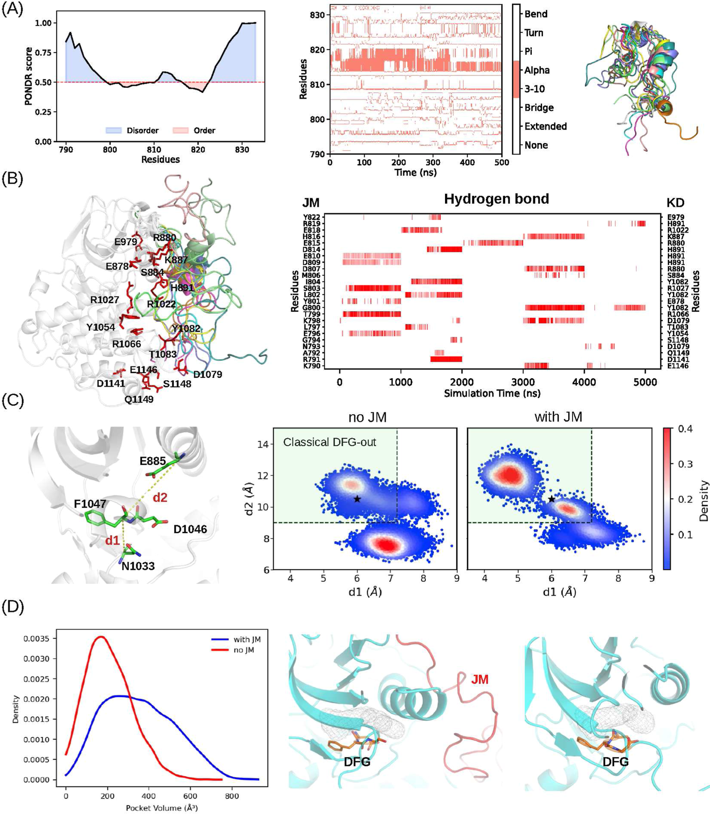
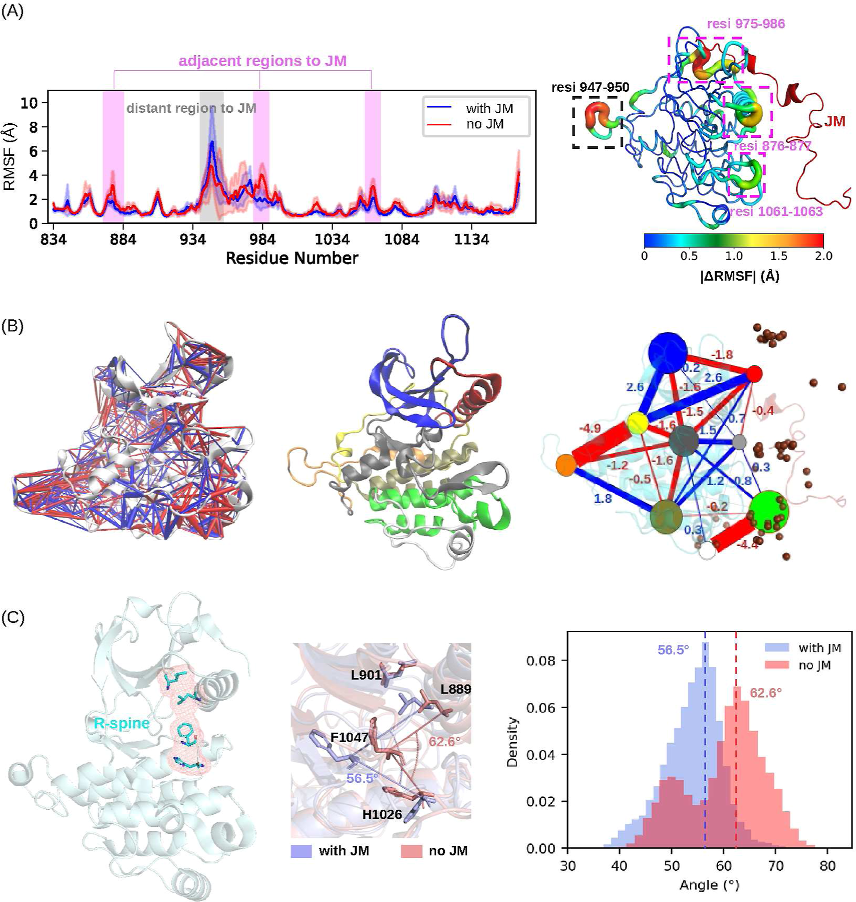
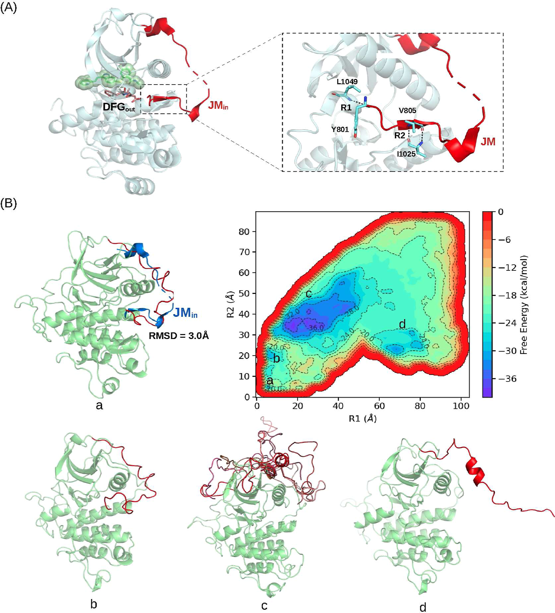
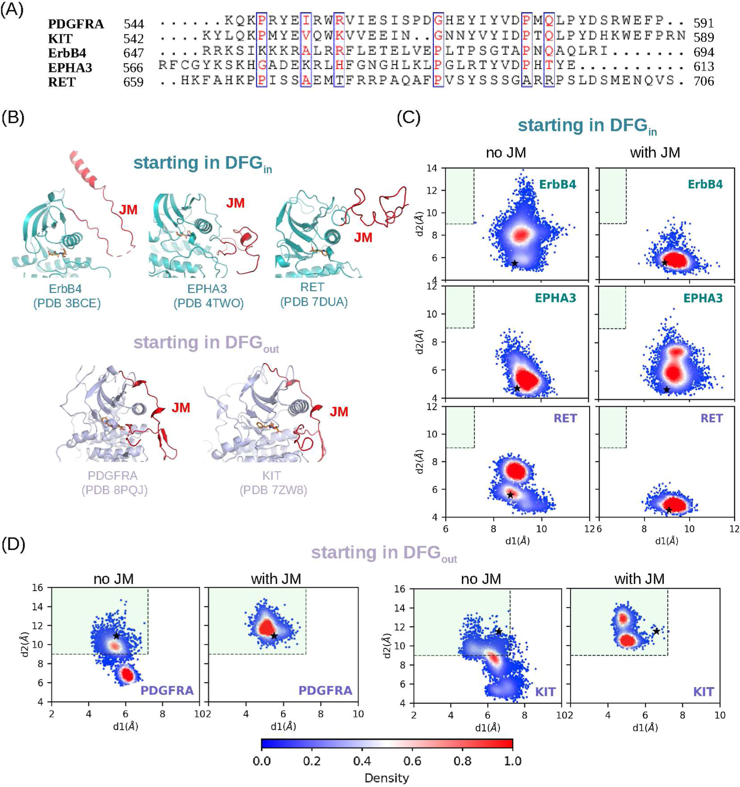

# 无序的JM基序通过动态效应促进RTKs中经典DFGout构象的形成

## 本文信息

- **标题**：受体酪氨酸激酶中的无序JM基序通过动态效应促进经典DFGout构象的形成
- **作者**：Xiaohui Chen, Hao Wang, Wenjian Li, Manjie Zhang, Bin Sun
- **发表期刊**：Journal of Chemical Information and Modeling
- **发表时间**：2026年（Received: November 4, 2025; Accepted: April 7, 2026）
- **DOI**：https://doi.org/10.1021/acs.jcim.5c02610
- **单位**：哈尔滨医科大学药学院医药信息研究中心
- **引用格式**：Chen, X.; Wang, H.; Li, W.; Zhang, M.; Sun, B. The Disordered JM Motif in RTKs Promotes Classical DFGout Conformation Formation via the Dynamic Effect. *J. Chem. Inf. Model.* 2026. https://doi.org/10.1021/acs.jcim.5c02610
- **代码与数据**：
  - MD轨迹：https://zenodo.org/records/19401175
  - 分析脚本：https://github.com/bsu233/bslab/tree/main/2025RTKs

---

## 摘要

> 受体酪氨酸激酶（RTKs）是经过验证的抗癌靶点，**靶向其DFGout构象是开发高选择性II型抑制剂的主流策略**。RTKs可以呈现多种DFGout构象，但只有形成完整后口袋（back pocket，也常称back cleft）的经典构象，才在结构上被验证能够稳定容纳II型抑制剂。然而，**实验解析的经典DFGout构象结构非常稀缺**，这给基于结构的选择性RTK抑制剂设计带来了重大障碍。最近有报道称，RTKs激酶结构域N端一个保守的无序基序——即近膜（juxtamembrane，JM）基序——能够调控抑制剂与VEGFR2（一种参与血管生成的RTK）的DFGout构象的结合。在本研究中，作者进行了广泛的MD模拟，以探索**无序JM基序对RTKs中DFG基序构象空间的影响**，并研究这种影响如何可能调控抑制剂与VEGFR2的结合。作者发现，在VEGFR2中，无序的JM具有高度动态性，与激酶结构域形成瞬态接触，精细调节DFGout亚构象空间，使群体从非经典DFGout构象向经典DFGout构象转移。**这一动态模型为已报道的JM基序对抑制剂与VEGFR2结合的调控效应提供了替代性的结构解释**。此外，作者还证明，在VEGFR2以外的其他RTKs中，无序的JM同样能够促进经典DFGout构象的形成。

### 核心结论

- **JM基序是内在无序的**：无论是分离状态还是与激酶结构域连接时，JM都高度动态，主要采取卷曲或弯曲构象，只与激酶结构域形成瞬态氢键接触
- **JM促进经典DFGout构象的形成**：在VEGFR2中，JM的存在使DFG采样从非经典DFGout区域向经典DFGout区域（后口袋完全形成）转移，并显著扩大了抑制剂结合口袋的体积
- **别构信号网络介导JM的调控作用**：JM通过分层网络传递动态变化——外围区域（如αC螺旋的N端）发生大幅动态改变，而核心区域则经历精细调整，最终实现对DFGout亚构象空间的微调
- **晶体结构中的JMin构象是热力学可及的亚稳态**：通过metadynamics模拟发现，JMin构象（与激酶结构域形成反平行β-折叠）是多个亚稳态之一，与全局最小自由能状态相差约8.0 kcal/mol
- **JM的作用在其他RTK中保守**：在PDGFRA、KIT、EPHA3、RET和ErbB4中，JM同样能够促进经典DFGout构象的形成，且这种效应依赖于初始DFG状态——当起始为DFGin时，JM不会诱导向DFGout的翻转

## 背景

### RTK抑制剂的选择性困境

受体酪氨酸激酶（RTKs）是跨膜信号转导的关键分子，其异常激活与多种癌症的发生发展密切相关。靶向RTK激酶结构域的小分子抑制剂是重要的抗癌药物。然而，**人类激酶组中有超过500种蛋白激酶，它们的ATP结合口袋高度保守**，导致ATP竞争性抑制剂（I型抑制剂）往往选择性差，容易产生脱靶副作用。因此，**提高抑制剂的选择性**是该领域的核心挑战之一。

**这一选择性问题的根源在于激酶的进化保守性**：ATP结合口袋在激酶家族中高度相似，因为它们都结合同一个底物——ATP。这意味着，**如果抑制剂只针对ATP口袋，就很难区分不同的激酶**。脱靶抑制不仅会降低疗效，还可能产生严重的副作用，因为抑制了非靶标激酶的正常功能。

### DFGout构象与II型抑制剂

激酶的活化环上有一个保守的DFG基序（Asp-Phe-Gly三联体）。根据天冬氨酸的侧链方向，激酶可以处于两种主要构象：
- **DFGin**：天冬氨酸指向ATP结合位点，通常对应活性状态
- **DFGout**：天冬氨酸翻出ATP结合位点，形成额外的后口袋（back pocket，也称back cleft），该区域在不同激酶之间具有较高结构多样性

**靶向DFGout构象的抑制剂被称为II型抑制剂**。由于后口袋的多样性，II型抑制剂通常比I型抑制剂具有更好的选择性。因此，**靶向DFGout构象已成为设计高选择性激酶抑制剂的主流策略**。

> II型抑制剂的选择性优势，本质上来自对后口袋（back pocket）差异的利用。

**图1：结构背景。** **A**：RTKs的结构域组成示意，强调JM位于跨膜段与激酶结构域之间，是潜在的远程调控节点。**B**：经典DFGout（如PDB 1IEP）与非经典DFGout（如PDB 1Y6A）对比。经典DFGout的后口袋完整，更利于II型抑制剂结合；非经典DFGout后口袋不完整，限制配体稳定占位。

#### 问题：经典DFGout构象的结构稀缺

然而，DFGout构象本身也具有高度的构象多样性。Vijayan等人（2015）将DFGout构象分为两类：
- **经典DFGout**：后口袋完全形成，能够稳定容纳II型抑制剂
- **非经典DFGout**：后口袋部分形成或缺失，无法有效结合II型抑制剂

根据激酶结构数据库KLIFS的统计，**在所有解析的激酶结构中，DFGin构象占83%以上，而DFGout构象不足10%**。其中，经典DFGout构象更是稀少。**这种结构信息的缺乏严重阻碍了基于结构的II型抑制剂设计**。

#### JM基序：一个被忽视的调控因子

近膜（juxtamembrane，JM）基序位于RTKs的跨膜螺旋与激酶结构域之间，由约40个或更多残基组成，**序列保守但结构上被认为是无序的**。McTigue等人（2012）的实验发现，**JM基序能够差异性地调控VEGFR2的DFGout构象与几种药物的结合亲和力**：阿西替尼（axitinib）、舒尼替尼（sunitinib）和帕唑帕尼（pazopanib）的亲和力受JM影响显著，而利尼法尼（linfanib）和索拉非尼（sorafenib）则几乎不受影响。**他们提出了一个”JMin/JMout”模型**，认为JM可以通过在两种构象之间切换来产生空间位阻，干扰药物结合。

但是，**这一静态模型存在明显的局限性**：无法解释为什么JM对某些药物有影响而对另一些没有；更重要的是，**它忽略了JM本身的无序本质**。**JM到底是如何调控DFGout构象的？其分子机制是什么？** 本文通过大规模分子动力学模拟回答了这些问题。

### 关键科学问题

- **JM基序在结构上到底是什么状态**？它是真的无序，还是能够形成稳定的折叠结构？它与激酶结构域之间的相互作用是持久的还是瞬时的？**如果JM确实是无序的，那么它是如何在没有稳定结构的情况下发挥调控作用的**？
- **JM如何影响DFG基序的构象空间**？它是否会诱导DFGin与DFGout之间的翻转？还是仅仅在DFGout亚构象空间内进行微调？**这种影响是通过直接的物理接触还是通过远程的别构效应实现的**？
- **JM对经典DFGout构象的促进是否具有普遍性**？这种效应是否只存在于VEGFR2，还是其他RTKs也有类似机制？**如果具有普遍性，那么这一机制是否可以推广到其他激酶家族**？
- **晶体结构中观察到的JMin构象是主要的结合模式，还是只是众多可能状态之一**（JM与激酶结构域形成反平行β-折叠）？其热力学稳定性如何？**为什么晶体结构能够捕获到JMin构象，但在溶液模拟中却很少观察到**？
- **JM的调控作用是如何从与激酶结构域的瞬态接触传递到遥远的DFG基序的**？是否存在一个别构信号网络？**这个网络的路径和机制是什么**？

### 创新点

- **改进静态模型，提出动态调控机制**：证明JM并非通过稳定的”JMin”构象产生空间位阻，而是通过瞬态接触和别构信号网络来精细调节DFGout亚构象空间
- **首次定量刻画JM对DFGout亚构象空间的“微调“效应**：JM不改变DFGin/DFGout的整体平衡（因为能垒高），而是将已处于DFGout状态的群体从非经典推向经典
- **结合常规MD与metadynamics，全面揭示JM的构象景观**：发现JMin只是多个亚稳态之一，并非全局最稳定状态，这解释了为什么晶体结构中能捕获到它但并非主要存在形式
- **跨RTK验证**：在五种不同RTK（PDGFRA、KIT、EPHA3、RET、ErbB4）中验证了JM对经典DFGout的促进作用，证明该机制具有保守性
- **提出JM包含型构建体对II型抑制剂筛选的重要性**：建议在计算模拟和实验筛选中使用包含JM的激酶构建体，以获得更真实的DFGout构象

---

## 研究内容

### 方法概览

#### 模拟系统设计

为了探究JM基序的作用，作者为每个RTK构建了两个系统：
- **含JM系统**：包含完整的JM基序和激酶结构域
- **不含JM系统**：仅包含激酶结构域（从JM与激酶结构域的连接点开始）

**起始结构来自PDB数据库中的晶体结构**（VEGFR2使用4AGC，其他RTK使用各自的PDB）。**对于缺失的残基，使用AlphaFold预测的结构进行修补**。

#### VEGFR2的模拟细节

- 力场：Amber ff99SB-ILDN，水模型TIP3P
- 离子浓度：150 mM NaCl
- 模拟时长：含JM和不含JM各5 × 1 μs（5条独立轨迹，每条1 μs）
- 温度：300 K
- 额外模拟：对分离的JM片段进行了500 ns MD；对JM与激酶结构域的相互作用进行了**1 μs well-tempered metadynamics**（使用PLUMED 2.8.2）

#### 其他五种RTK的模拟

- RTK列表：PDGFRA、KIT、EPHA3、RET、ErbB4
- 模拟时长：每个系统两个重复（1 μs + 0.5 μs），总计1.5 μs
- 起始构象：其中EPHA3、RET、ErbB4起始于DFGin构象；PDGFRA和KIT起始于DFGout构象

#### 关键分析方法

- **经典DFGout的定义**（Vijayan等）：两个距离度量判定

| 参数与阈值 | 定义 |
| --- | --- |
| $d_1$ < 7.2 Å | HRDxxxxN基序中Asn的Cα与DFG中Phe的Cα之间的距离 |
| $d_2$ > 9.0 Å | αC螺旋中保守Glu的Cα与DFG-Phe的Cα之间的距离 |

- **差异接触网络分析**（dCNA）：**计算有无JM时残基-残基接触概率的变化**，使用Girvan-Newman算法将蛋白划分为功能社区（community），量化社区间的信号传导变化
- **结合口袋体积**：使用MDpocket工具测量

### 结果一：JM是内在无序的，与激酶结构域形成瞬态接触

作者验证了JM基序的无序本质。**PONDR预测显示分离的JM几乎完全无序**。500 ns的MD模拟中，**JM的均方根偏差（RMSD）高达10.90 ± 1.67 Å**，只有少数残基形成瞬时α-螺旋，大部分时间处于卷曲或弯曲构象（图2A）。**当JM连接到激酶结构域后，其RMSD仍然很高（9.55 ± 2.75 Å）**，表明动态特性得以保持。

**关键的发现是：JM与激酶结构域之间的相互作用是瞬时的，而非稳定的**。图2B展示了5条独立1 μs轨迹中JM与激酶结构域之间氢键的时间演化——**红线表示氢键存在，可见氢键不断形成和断裂**，没有持续稳定的结合模式。聚类分析也显示**JM在激酶表面采样了多种不同的构象**。

> JM不是“固定卡位”的结构元件，而是通过**高频瞬态接触**持续影响构象分布。

**JM从未自发采样到晶体结构中报道的”JMin”构象**。在晶体结构4AGC中，JMin构象通过两对氢键稳定：Y801与L1049、V805与I1025。但在模拟中，**这两对残基的平均距离分别为22.84 ± 7.36 Å和13.70 ± 7.53 Å**，远大于氢键形成的阈值（3.5 Å，见图S4）。这说明**在常规动态条件下，JMin构象并不是JM的主要存在形式**。

**图2：JM促进VEGFR2中经典DFGout构象的形成。** **A**：PONDR无序预测和MD二级结构结果，显示JM整体以无序卷曲态为主，仅有短暂二级结构片段。**B**：5条1 μs轨迹中的JM-激酶氢键时间演化。红线为氢键存在，呈反复出现和消失，说明以瞬态接触为主。**C**：经典DFGout判据（$d_1$、$d_2$）与构象投影。黑色星号为起始结构；含JM体系的采样更集中在经典区域。**D**：有无JM时结合口袋体积对比。含JM体系整体右移，提示可成药后口袋更容易形成。

### 结果二：JM将DFGout亚构象空间从非经典推向经典

作者将VEGFR2的DFG构象采样投影到**$d_1-d_2$平面**（图2C）。结果显示：
- **无论有无JM，DFG都未发生向DFGin的翻转**（即没有进入$d_1 \lt 7.2$且$d_2 \lt 9.0$的区域）。这与文献中报道的**DFGin/DFGout转变能垒约10 kcal/mol**一致，在10 μs的总采样时间内无法跨越。
- **但是，在DFGout区域内，JM显著改变了子状态的分布**：不含JM时，采样点散布在经典区域（$d_1 \lt 7.2$且$d_2 \gt 9.0$，浅绿色背景）和非经典区域（其他区域）之间；而含JM时，采样点明显向经典区域集中。

这种**群体转移的后果直接体现在结合口袋的体积上**（图2D）：**含JM系统的口袋体积分布整体右移（更大）**，而不含JM系统的口袋体积偏小。**溶剂可及表面积（SASA）也得到类似结果**（图S6A）。这些数据证明，**JM通过瞬态接触促进了经典DFGout构象的形成，使后口袋更加开放，有利于II型抑制剂的结合**。

> 对II型抑制剂而言，关键不一定是触发DFG翻转，而是**提高完整后口袋对应亚构象的占比**。

### 结果三：分层别构网络介导JM的调控作用

JM是如何将它的动态信号传递到遥远的DFG基序的？作者计算了**有无JM时激酶结构域每个残基的均方根波动（RMSF）差异**（图3A）。他们识别出四个动态变化显著的区域，并根据空间位置分为两类：**邻近区域**（靠近JM锚点834位残基），包括**αC螺旋的N端片段**（残基876-877）、**两个C端环**（975-986和1061-1063），这些区域在JM存在下RMSF变化幅度大；以及**远端区域**（远离JM界面），如C端叶的一个片段（947-950），有趣的是，远端区域也表现出动态变化，提示存在别构效应。

有趣的是，**ATP结合位点周围的核心区域动态变化非常微小**。这种”**外围大幅变化、核心精细调整**”的模式可能是激酶结构域别构信号传导的一个普遍特征。

为了量化这种别构通信，作者使用了**差异接触网络分析（dCNA）**。该方法将**蛋白划分为9个功能社区**（图3B中间），然后计算有无JM时社区之间接触强度的变化。

> dCNA方法的核心思想是**将蛋白质残基网络划分为功能社区**，通过Girvan-Newman算法识别社区间的关键连接，从而量化信号传导路径。Girvan-Newman算法基于**边介数**（edge betweenness）——介数越高的边越可能是社区间的"桥梁"，删除这些边可以逐步分离社区结构。

结果显示（图3B右图）：

- **JM（棕色球体代表其质心分布）主要破坏了N端β-折叠（蓝色节点）、αC螺旋（红色节点）以及一个连接N叶和C叶的核心节点（深灰色）之间的接触**
- **核心节点与其他节点之间的连接数量多，但每个连接的强度变化较小；而外围节点之间的连接数量少，但强度变化大**。这种**分层网络结构**使得JM能够将外围的大幅动态变化”翻译”为对DFGout亚构象空间的精细调节。

作者还检查了**R-spine（一种由四个疏水残基组成的保守结构，包括DFG中的苯丙氨酸）的笔直程度**（图3C）。**JM的存在使R-spine的笔直程度降低**，这是DFGout构象的特征（而非DFGin）。**αC螺旋也表现出类似的“微调“效应**：在不含JM时，αC螺旋主要处于典型的”in”状态；而含JM时，其构象分布更宽，出现了一些中间状态（αC-dilated，见图S6B）。这些数据进一步支持**JM的作用是精细调节DFGout亚构象空间，而非诱导构象翻转**。

> 这里的别构传播更像“分层缓冲”：外围波动很大，但传到核心后变成**小幅、可定向的构象偏置**。

**图3：VEGFR2激酶结构域内的别构信号网络。** **A**：残基RMSF及差异映射。阴影为5条轨迹标准差，显示“邻近JM区域变化大、核心区变化小“。**B**：dCNA接触差异网络（含JM减不含JM）。蓝线表示接触增强、红线表示接触减弱，线宽代表变化幅度；中图是9个功能社区；右图量化社区间信号变化；棕色球体为JM质心分布。**C**：R-spine笔直程度比较。含JM时R-spine更“弯“，与DFGout相关的结构特征一致。

### 结果四：晶体结构中的JMin构象是热力学可及的亚稳态

既然常规MD显示JM与激酶结构域之间主要形成瞬态接触，而晶体结构4AGC中却捕捉到了一个稳定的JMin构象（**JM与激酶结构域形成反平行β-折叠**，通过Y801-L1049和V805-I1025氢键稳定）。如何调和这一矛盾？

作者进行了**1 μs的well-tempered metadynamics模拟**，以**R1（Y801-L1049距离）和R2（V805-I1025的平均距离）为集体变量**，全面采样JM的构象空间。图4B展示了自由能景观：
- **识别出至少四个亚稳态（a、b、c、d）**。其中状态a、b、c是与激酶结构域接触的构象，状态d是游离在溶剂中的构象。
- **晶体结构中的JMin构象对应于状态a**，其与状态a的RMSD约为3 Å。但是，**状态a并不是全局最小自由能状态——全局最小是状态c**，两者之间的自由能差约为8.0 kcal/mol。
- **状态a和状态b的主要差异集中在JM的N端区域**（残基801-815），该区域在两者之间经历了显著的构象重排（图S9）。

这表明：**JMin构象是JM在热力学上可及的一个亚稳态，但并非最稳定的状态**。在晶体生长条件下，分子堆积或配体结合可能将其稳定化并捕获；而在溶液动态环境中，JM更倾向于采样其他构象。这一发现也解释了**为什么基于静态JMin结构的空间位阻模型无法全面解释JM对药物结合的调控效应**——JM实际上处于动态平衡中，其对DFGout构象的微调作用可能比简单的空间位阻更为重要。

> 晶体里“看见”JMin，并不等于它在溶液中“长期主导”；它更像是**可捕获的低丰度亚稳态**。

**图4：JM的构象空间。** **A**：PDB 4AGC中的JMin构象，Y801-L1049和V805-I1025两对相互作用用于定义反应坐标R1、R2。**B**：metadynamics自由能景观，识别出a、b、c、d四个亚稳态。a与晶体JMin重叠，但全局最低自由能盆地为c，说明JMin可及但并非主导态。

### 结果五：JM在其他RTK中保守地促进经典DFGout构象

为了检验JM的调控作用是否具有普遍性，作者选择了五种RTK：**PDGFRA、KIT、EPHA3、RET和ErbB4**。**它们的JM序列高度保守**（图5A），晶体结构显示其中三个（EPHA3、RET、ErbB4）处于DFGin构象，两个（PDGFRA、KIT）处于DFGout构象（图5B）。

对于每个RTK，作者进行了**1.5 μs（1 μs + 0.5 μs两个重复）的MD模拟**，比较含JM和不含JM系统的DFG构象采样（图5C、5D）。结果清晰地显示：
- **当起始构象为DFGout时**（PDGFRA和KIT）：JM的存在使采样向经典DFGout区域（浅绿色背景）集中，与VEGFR2中的效应一致。
- **当起始构象为DFGin时**（EPHA3、RET、ErbB4）：**JM虽然影响了DFG的构象采样，但并未诱导DFGin向DFGout的翻转**——采样点仍然主要停留在DFGin区域。

这一结果进一步支持了作者的结论：**JM的效应是“微调“而非”开关”**。**它的能量影响（在几kcal/mol量级）足以在DFGout亚构象空间内重新分布群体**，但**不足以克服DFGin/DFGout之间约10 kcal/mol的能垒**。

这一”保守但有条件”的规律也给筛选策略一个直接启发：**对于初始更偏DFGin的RTK，仅加入JM并不足以保证快速出现经典DFGout**，可能还需要更长采样或增强采样；**而对本就能进入DFGout的体系，JM则能显著提高经典亚构象的占比**。

> JM更像“构象分配器”，不是“构象开关”。

**图5：JM对其他五种RTK中DFG构象空间的影响。** **A**：PDGFRA、KIT、ErbB4、EPHA3、RET的JM序列保守性。**B**：五种RTK的起始晶体构象，其中ErbB4、EPHA3、RET为DFGin，PDGFRA、KIT为DFGout。**C**：1 μs重复模拟在$d_1-d_2$平面的投影，浅绿色为经典DFGout区域。**D**：0.5 μs重复模拟的同类投影，与C呈一致趋势，说明结论具有重复性。

### 补充讲解（对应SI图）

这两份PDF合起来看，SI里真正”补逻辑漏洞”的主要是五组信息，且都与主文主线直接对应：
- **图S4**（关键距离时间序列）：**把”JMin在常规MD里并不稳定”从定性描述变成了可量化证据**，直接支撑结果一。图中显示Y801-L1049和V805-I1025两对关键残基的距离在整个模拟过程中都远大于氢键阈值，证明JMin构象在常规MD条件下确实无法稳定维持。
- **图S6A**（SASA）：与主文图2D口袋体积形成同向验证，说明“后口袋更开放”不是单一指标偶然波动。**溶剂可及表面积的增加与口袋体积的扩大是一致的**，这两个独立的度量指标共同指向同一个结论，增强了结果的可信度。
- **图S6B**（αC分布）：显示JM主要改变的是构象分布宽度而非构象类别切换，强化”微调而非翻转”。**αC螺旋的构象分布在含JM时更宽**，出现了αC-dilated等中间状态，这说明JM的作用确实是微调，而不是完全改变αC螺旋的构象类别。
- **图S9**（a/b态对比）：把metadynamics中”局部重排位于JM N端”的叙述具体化，支撑结果四的结构解释。图中清晰展示了状态a和状态b之间主要在JM的N端区域（残基801-815）存在显著构象差异，这一局部重排是两个亚稳态之间自由能差异的结构基础。
- **图S10/S11**（跨RTK重复）：验证图5的趋势在不同重复中可再现，降低”单次轨迹偶然性”风险。**重复模拟的结果与主模拟高度一致**，说明观察到的JM效应不是偶然的采样波动，而是可重复的真实现象。

基于重要性判断，当前不额外插入SI图片也能保持论证完整；如果后续你希望”图文更直观”，优先值得补的是S6（SASA与αC），因为它同时支撑主文两个关键推断。**这些SI数据的存在本身就是对主文结论的有力支撑**，它们从不同角度验证了JM的动态调控机制。

---

## 讨论

### 从静态空间位阻到动态构象微调

McTigue等人（2012）基于晶体结构提出了一个”JMin/JMout”模型：当JM处于JMin构象时，它会插入激酶结构域的裂隙中，与某些药物产生空间位阻，降低其结合亲和力。**这个模型虽然直观，但难以解释为什么JM对某些药物影响大而对另一些影响小**，也无法说明JM如何在不诱导DFGout→DFGin翻转的情况下改变药物结合。

**本研究的动态模型提供了一个更合理的解释**：**JM通过瞬态接触和别构网络，将DFGout亚构象空间的群体从非经典推向经典**。**经典DFGout构象具有更开放、体积更大的后口袋**，这可能会改变药物进入和结合的方式。**不同药物的化学结构不同，它们对后口袋形状和体积的敏感性也不同**——这恰好可以解释McTigue等人的实验结果：**某些药物（如阿西替尼）可能对后口袋的细微变化非常敏感**，因此JM的效应显著；**而另一些药物（如索拉非尼）可能对后口袋形状变化不敏感**，或者它们本来就偏好非经典DFGout构象。

### 能量景观的层次结构

本研究揭示了一个重要的能量景观特征：DFGin与DFGout之间的能垒**明显高于**DFGout亚构象空间内不同子状态之间的能垒（约10 kcal/mol vs 几kcal/mol）。JM的瞬态相互作用提供的自由能扰动（约几kcal/mol）**足以在DFGout亚空间内重新分布群体**，但**不足以驱动**DFGin/DFGout翻转。这解释了为什么在10 μs的模拟中从未观察到构象翻转，但却清晰看到了经典DFGout群体的增加。

**这一发现对II型抑制剂设计具有实用意义**：**在计算模拟中使用包含JM的构建体，可以更真实地再现经典DFGout构象的分布**，提高虚拟筛选的准确性。同样，**在实验筛选中，使用包含JM的激酶构建体可能会得到与全长蛋白更接近的抑制活性数据**。

### 力场选择的考虑

作者使用了Amber ff99SB-ILDN力场。该力场曾被报道对某些IDPs产生过度压缩的构象集合，但本研究的数据表明**它成功捕捉了JM的无序和动态特性**：**分离JM的RMSD高达10.9 Å**，与激酶结合后RMSD仍然很高；瞬态接触的形成与断裂；metadynamics显示的广阔低能采样区域。因此，当前结论受力场偏差影响较小。

### 本文主要贡献

- **提出了JM调控DFGout构象的动态机制**：取代了之前的静态空间位阻模型，强调瞬态接触和别构信号网络的核心作用
- **定量刻画了JM对DFGout亚构象空间的微调效应**：证明JM将群体从非经典推向经典DFGout，而不诱导DFGin/DFGout翻转
- **揭示了JMin构象的热力学本质**：它是多个亚稳态之一，而非全局最稳定状态，自由能差约8.0 kcal/mol
- **验证了JM效应的保守性**：在六种RTK（VEGFR2 + 五种其他）中均观察到相同趋势，且效应依赖于初始DFG状态
- **提出了实用的设计建议**：在II型抑制剂的虚拟筛选和实验筛选中应使用包含JM的激酶构建体

### 局限性

- **力场的IDP表现**：虽然ff99SB-ILDN在本系统中表现良好，但其对IDPs的描述并非完美。使用更现代的力场（如ff19SB或a99SB-disp）进行交叉验证会增强结论的可靠性
- **模拟时间尺度**：尽管累计10 μs的采样已经相当可观，但DFGin/DFGout翻转的能垒可能高于预期，更长时间的模拟或增强采样技术（如元动力学、自适应偏置力）可能有助于直接观察翻转事件
- **缺乏直接的抑制剂结合模拟**：本研究没有直接模拟抑制剂在有无JM时的结合过程，因此”JM通过改变DFGout亚构象空间来影响药物结合”这一推论仍有待直接验证。未来的对接或自由能计算可以填补这一空白
- **JM的长度和序列变异**：不同RTK的JM长度和序列存在差异，本研究选取的五种可能无法完全代表整个RTK家族。例如，EGFR家族的JM具有更复杂的调控机制（包括自身抑制性相互作用）

### 未来方向

- **直接模拟抑制剂结合**：使用自由能计算方法（如MM/GBSA、FEP）定量评估JM对阿西替尼、舒尼替尼等药物结合亲和力的影响
- **突变验证**：设计JM中关键残基（如Y801、V805）的突变体，通过实验验证其对DFGout构象和药物结合的影响
- **拓展到更多RTK**：特别是那些JM长度异常或具有已知致病突变的RTK，探究JM的调控作用是否在疾病状态下发生改变
- **整合实验结构生物学**：尝试在溶液中使用NMR或HDX-MS等方法捕捉JM与激酶结构域的瞬态接触，验证模拟预测的接触位点

---

## 文献精读：逻辑结构四段法与证据分层

### 1. 逻辑拆解

- **小背景**：经典DFGout构象是II型抑制剂的关键靶点，但实验解析的结构极度稀缺，阻碍了选择性抑制剂的设计。
- **真问题**：JM基序被报道能调控抑制剂与VEGFR2的结合，但**其分子机制不清晰**——JM是无序的，它如何产生有意义的结构效应？经典的"JMin空间位阻"模型无法解释药物选择性的差异。这个问题成立，不是伪命题。
- **课题设计**：作者设想JM通过**瞬态接触和别构信号网络**，在DFGout亚构象空间内精细调节经典/非经典DFGout的比例，而非通过稳定构象产生空间位阻。
- **验证方法**：构建含/不含JM的体系进行对比MD模拟，使用dCNA分析别构网络，结合metadynamics探索能量景观，并在五种其他RTK中验证普适性。

### 2. 实验证据的成分分析

| 证据类型 | 具体内容 | 作用 |
| --- | --- | --- |
| **核心实验（骨架）** | VEGFR2含/不含JM的5 × 1 μs MD轨迹，$d_1-d_2$平面投影与口袋体积对比 | 直接证明JM将DFGout亚构象从非经典推向经典，无此数据则结论不成立 |
| **核心实验（骨架）** | metadynamics自由能景观，识别a/b/c/d四个亚稳态，JMin（态a）与全局最低（态c）差约8 kcal/mol | 定量揭示JMin是亚稳态而非主态，解释晶体结构的捕获现象 |
| **交叉印证（肌肉）** | 五种RTK（PDGFRA、KIT、EPHA3、RET、ErbB4）的对比模拟，证明JM效应保守且依赖于初始DFG状态 | 交叉闭合，提高结论普适性，降低单系统偶然性风险 |
| **交叉印证（肌肉）** | 图S4关键距离时间序列、图S6 SASA与αC分布、图S9 a/b态结构对比 | 多角度支撑JM的无序本质和微调机制，证据链完整 |
| **求新炫技（首饰）** | Girvan-Newman算法划分的分层别构网络可视化（图3） | 增强机制解释的深度，非结论必需但显著提升论文层次感 |
| **展示工作量（体力活）** | 10条独立轨迹（5 + 5）、五种RTK各两条重复模拟、参数扫描（如口袋体积计算） | 证明采样充分性，防御审稿人"采样不足"质疑 |

### 3. 批判性思考

- **JMin构象的热力学解释是否有循环论证嫌疑？** 作者先说JMin在常规MD中未观察到（通过Y801-L1049等距离），再用metadynamics说它差8 kcal/mol——但metadynamics用的是**人为定义的反应坐标R1/R2**（来自晶体结构的氢键对），如果换成其他坐标，a/b/c/d的相对能会不会反转？这一点SI中没有系统测试。
- **力场的IDP描述是潜在隐患**：作者承认ff99SB-ILDN可能过度压缩IDPs。虽然数据"看起来合理"（高RMSD、瞬态接触），但如果没有实验数据（NMR/SAXS）交叉验证，这个"看起来合理"其实是循环的——因为我们本就不确定正确构象应该是什么样。
- **$d_1-d_2$判据本身是近似**：经典DFGout的定义依赖两个距离阈值（< 7.2 Å、> 9.0 Å），但这两个数来自Vijayan等人对已有结构的拟合。如果某个激酶的$dl$和$d2$恰好在边界附近，分类就会模糊。作者在图2C中用浅绿色"经典区域"标注的边界本身可能不够锐利。
- **JM效应"依赖于初始DFG状态"——这一点意义重大但文中讨论不足**：当起始为DFGin时，JM不诱导翻转；但当起始为DFGout时，JM促进经典亚构象。这实际上隐含了一个假设：JM的效应是**路径依赖的（path-dependent）**。这与激酶的"构象选择"vs"诱导契合"之争有关，但作者没有明确讨论这一层含义。
- **缺乏直接抑制剂结合数据**：讨论中用口袋体积变化"推断"药物结合差异，是间接的。如果能直接做含JM/不含JM的分子对接或FEP，结论会更有说服力。

### 4. 一句话定性核心创新

**本文揭示了JM基序作为"构象分配器"的角色：它不诱导DFGin/DFGout翻转，而是通过瞬态接触和分层别构网络，在DFGout亚构象空间内将群体从非经典推向经典，为II型抑制剂设计提供了"含JM构建体"这一实操建议。**

### 5. 还能补什么（提精度）

- **补充实验验证**：用NMR或SAXS实测JM与激酶结构域的瞬态接触模式和群体分布，与模拟对比
- **FEP直接验证药物效应**：选择阿西替尼和索拉非尼（有实验数据），在含/不含JM体系中计算相对结合自由能，直接验证"JM对不同药物影响不同"的假设
- **测试其他判据坐标**：在metadynamics中尝试其他反应坐标（如DFG二面角、αC位移的组合），检验a/b/c/d能谱的稳健性
- **EGFR家族验证**：EGFR的JM调控机制更为复杂，是检验JM"构象分配器"理论的更好对照，但文中未涉及
