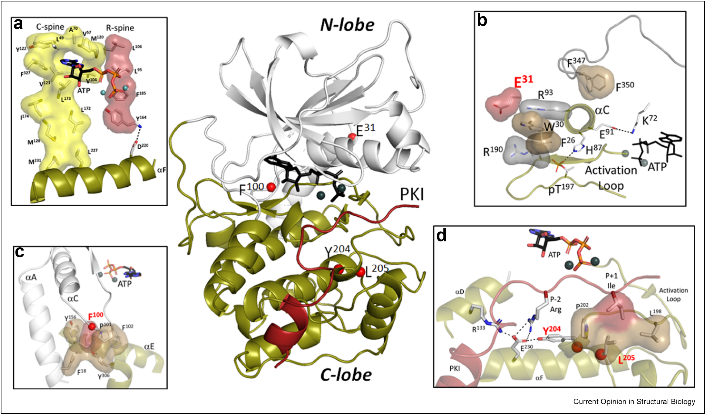
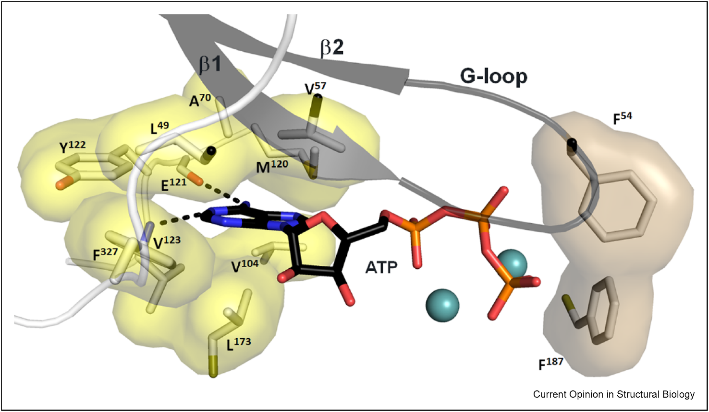
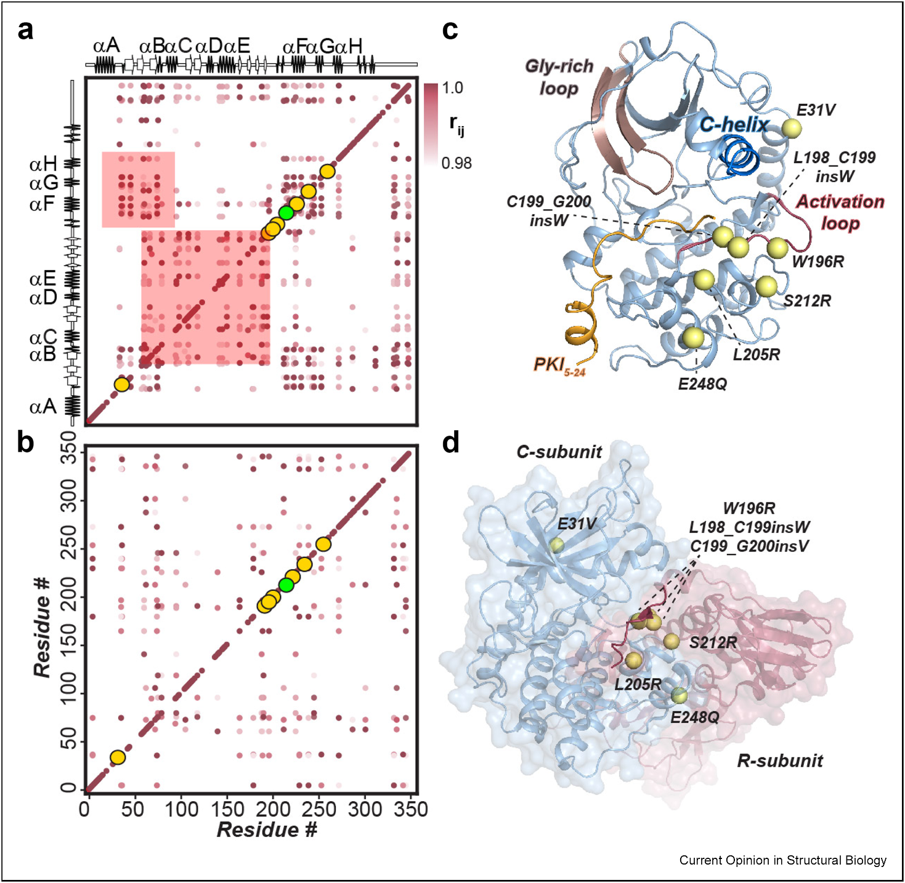
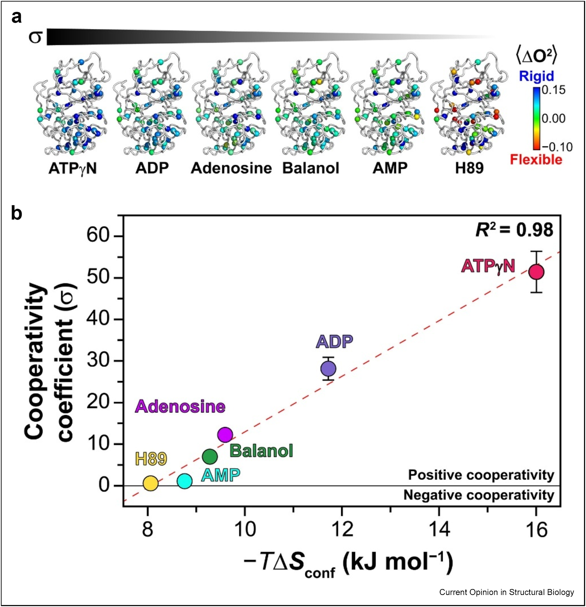

# 激酶为什么能分清底物和抑制剂？答案藏在协同性和变构网络里

## 本文信息

- **标题**：激酶信号转导中的变构结合协同性、信号病理与药物开发
- **作者**：Cristina Olivieri, Jian Wu, Susan S. Taylor, Gianluigi Veglia
- **发表期刊**：Current Opinion in Structural Biology
- **发表时间**：2025年10月16日在线发表
- **DOI**：https://doi.org/10.1016/j.sbi.2025.103169
- **单位**：明尼苏达大学，生物化学、分子生物学与生物物理学系；加州大学圣地亚哥分校，药理学与化学系
- **引用格式**：Olivieri, C., Wu, J., Taylor, S. S., & Veglia, G. (2025). Allosteric binding cooperativity in kinase signaling, signalopathies, and drug development. *Curr. Opin. Struct. Biol.* 95, 103169. https://doi.org/10.1016/j.sbi.2025.103169
- 我早年搬运过Susan S. Taylor的视频，欢迎去B站看看：https://www.bilibili.com/video/BV1AY411V74B

## 摘要

> 协同性是变构调节的核心机制，在细胞生理和病理反应中发挥关键作用。生物系统对刺激的反应通常表现为超敏感而非分级响应，这由协同性结合介导。本文以蛋白激酶A（PKA）为原型，系统阐述了核苷酸与底物之间的正负协同性如何调控激酶活性，以及**功能障碍的协同性如何导致信号病理**。作者进一步展示了一类药物如何利用协同性抑制激酶同源或异源二聚化，或选择性地稳定活性或非活性构象状态。**对变构结合协同性的分子理解有望推动激酶特异性抑制剂的开发，开辟新的治疗可能性**。

### 核心结论

- **协同性决定信号响应**：正负协同性通过增强或减弱信号响应，将分级输入转化为超敏感的S型曲线输出
- **PKA的协同性机制**：ATP与底物呈正协同，ADP与磷酸化底物呈负协同，这种切换驱动催化循环
- **功能障碍导致疾病**：Cushing综合征相关突变（L205R、E31V）通过破坏变构网络导致协同性丧失
- **药物设计新策略**：利用协同性设计能选择性抑制二聚化或区分活性/非活性的ATP竞争性抑制剂
- **构象熵是关键**：协同性系数与构象熵线性相关，ATP竞争性抑制剂可通过改变构象熵调节底物结合

## 背景

### 协同性的基本概念

协同性是变构调节的基本方面，在细胞生理和病理反应中扮演关键角色。它影响生物通路如何被启动、调节或中断。随着生物系统变得日益复杂，协同现象也变得越来越重要。

在酶的语境下，协同性决定配体或底物的结合强度（**K型协同性**），影响酶的动力学（**V型协同性**），并调控酶复合物的组装与解组装。

> **K型 vs V型协同性**：K型协同性影响配体结合强度（解离常数$K_d$），表现为一个配体对另一个配体亲和力的正或负影响；V型协同性影响酶的动力学参数（最大反应速率$V_{\max}$），表现为对催化速率的正或负调节。在PKA中，ATP与底物显示K型正协同，而磷酸化步骤的产物释放可能涉及V型协同。

### 激酶信号转导的复杂性

激酶是细胞信号转导的核心节点，其活性的精准调控对维持细胞稳态至关重要。人类基因组包含约500个激酶基因，它们调控着几乎所有的细胞过程，从细胞分裂、分化到代谢和凋亡。激酶信号转导的内在复杂性在于，配体结合的协同性发挥关键作用，它能够放大敏感性及细胞外信号，驱动高度响应的信号级联。一个典型例子是丝裂原活化蛋白激酶（MAPK）级联，其多层磷酸化事件产生超敏感响应。

这种超敏感性有重要生物学意义。在发育过程中，细胞需要根据形态素浓度做出全或无的决策，如分化或增殖；在应激反应中，细胞需要快速激活保护机制。**协同性使得细胞能够将微弱的外部信号转化为强烈的内部响应**，实现决策的锐化。然而，当这种调控失衡时，协同性也可能导致疾病——过度敏感的信号通路可能导致癌症，而协同性丧失可能导致信号转导失败。

然而，激酶抑制剂的设计面临巨大挑战：尽管已有数十种FDA批准的激酶药物，但实现高度选择性仍然困难。**人类激酶组的ATP结合位点高度保守**，这使得设计只结合单一激酶而不影响其他激酶的抑制剂极其困难。

不少激酶药物的副作用，都和脱靶有关。信号网络本身又很复杂，这个问题就更明显了。近年的蛋白激酶研究已经开始把正负变构协同性的分子基础拆开看，关注配体引起的构象变化和动力学变化。**沿着这条线索，研究者也开始尝试把“协同性”本身当成设计抑制剂的切入点**。

## 关键科学问题

1. **激酶如何通过变构协同性实现精准调控**？正负协同性的分子机制是什么？
2. **功能障碍的协同性如何导致疾病**？哪些突变通过破坏变构网络导致信号病理？
3. **如何利用协同性设计更好的药物**？能否通过调节协同性实现激酶选择性抑制？

这些问题之所以重要，是因为理解协同性不仅能揭示激酶调控的基本原理，还能为癌症等疾病的治疗提供新策略。

## 研究内容

这篇综述先从 PKA 讲起，再把视角放到 Src、BRAF、PDK1、CDK2 等激酶上，顺着不同案例看协同性是怎么起作用的。PKA 之所以合适，是因为它的结构、动力学和调控机制已经研究了很多年。**后面几个激酶案例的意义，在于说明协同性不是 PKA 的“特例”**。

### PKA的变构协同性机制

蛋白激酶A（PKA）是变构协同性研究的原型激酶。它由两个催化亚基（PKA-C）和两个调节亚基（PKA-R）组成全酶，cAMP结合导致PKA-C释放并激活。PKA的发现历史可以追溯到1968年，当时它被证明是cAMP的主要效应器，随后成为环核苷酸信号转导研究的中心模型。**PKA不仅调控糖代谢、脂代谢和心肌收缩等基础生理过程**，其功能异常还与多种疾病相关，包括Cushing综合征、癌症和心脏病。

#### PKA的结构与变构网络

**图1**：PKA催化亚基活性态的架构。PKA-C的球形结构由两个叶组成：N-lobe（灰色）包含ATP结合位点，而较大的C-lobe（绿橄榄色）是结合多个伙伴的中心枢纽，底物结合口袋位于两叶界面。

尽管不同激酶的外部残基变化很大，但**激酶的内部疏水核心高度保守**（图1），具有两个疏水脊柱——催化C spine和调节R spine。这两个脊柱连接N-lobe与C-lobe的F螺旋，是变构通信的关键通道。

- **图1A**：C spine（催化脊柱，黄色）和R spine（调节脊柱）的组装。C spine在ATP结合时组装，而R spine在活性态组装，包含两个来自N-lobe的残基（L106和L95）和两个来自C-lobe的残基（F185和Y164）
- **图1B**：C螺旋在活性态的组装，通过三个关键相互作用完成R spine、形成盐桥、与底物相互作用
- **图1C**：αC-β4 loop相对于PKA-C疏水核心的定位，突出F100位置。这个loop形成连接PKA-C结合位点的关键变构节点
- **图1D**：两叶界面处的静电节点，涉及Tyr204、Glu230、Arg133和P-2 Arg残基。注意L205位点（P+1 loop）在大多数Cushing综合征患者中突变

这两个疏水脊柱和静电节点构成了PKA-C内部变构网络的基础，它们将核苷酸结合位点与底物结合裂缝耦合，实现协同性调控。

#### 正负协同性的分子机制

**图2**：ATP在激酶结合口袋中的关键相互作用放大视图。ATP分子通过多个相互作用精确结合在激酶口袋中，这些相互作用不仅固定ATP本身，还通过变构网络影响底物结合。

- **腺嘌呤基团**：定位在N-lobe的Ala70和Val57之间，以及C-lobe的Leu173之间，通过氢键固定。这个位置是ATP识别的关键
- **核糖环**：连接腺嘌呤和三磷酸基团，作为结构桥梁
- **三磷酸基团**：向调节R spine延伸，γ磷酸到达磷酸化位点，直接参与磷酸转移反应
- **Mg²⁺离子**：协调ATP结合，稳定活性构象

Whitehouse和Walsh首次表明**ATP结合到PKA-C增强了对底物的亲和力**。后续工作显示ATP作为正效应子，不仅诱导活性位点组装，还稳定两叶之间的变构耦合，实现对ATP和底物结合的选择性PKA-C响应。

野生型酶（PKA-CWT）的特征是密集的变构网络，将核苷酸结合位点与底物结合裂缝耦合。**变构网络中存在对突变和抑制剂结合敏感的关键节点**。互补的动态相关分析揭示**ATP在结构和动力学上耦合PKA-C的两叶**。

- **正协同性**：核苷酸与底物之间的正结合协同性通过等温滴定量热法（ITC）定量，表现为CHESCA图中密集的成对相关。这意味着当ATP结合时，底物的亲和力会增强。
- **负协同性**：ADP和磷酸化底物显示负协同性，即ADP结合时降低磷酸化底物的亲和力（反之亦然），CHESCA图显示稀疏相关，表明内部变构网络重排。有趣的是，负协同性的特征是PKA-C构象熵和NMR甲基对称轴序参数变化方向的切换。

> **协同性驱动的催化循环**：ATP结合产生正协同，增强底物结合；磷酸转移后，ADP和磷酸化底物的释放具有负协同性，促进产物释放。这种正负协同性的切换驱动了整个催化循环。

#### 功能障碍的协同性：Cushing综合征案例

**图3**：使用化学位移协方差（CHESCA）绘制PKA-C内部变构网络。CHESCA通过测量蛋白质不同位点化学位移的变化相关性来识别变构网络——当两个位点显示强相关时，表明它们在变构上耦合。

- **图3A**：PKA-CWT的CHESCA图。**红色强度**表示成对相关程度（红色越深相关越强）。**阴影区域**表示两叶之间最高密度相关。**黄色圆圈**代表Cushing综合征中发现的自然突变。**绿色**是最广泛研究的L205R突变
- **图3B**：PKA-CL205R突变体的CHESCA图。内部相互作用网络显著改变，多个相关性完全丢失（对比图3A的密集网络）
- **图3C**：最突出的Cushing综合征突变映射到PKA-C的X射线结构（1ATP）
- **图3D**：正构和变构突变的位置映射到PKA-C与RIIβ亚基的复合物

在PKA中，野生型显示密集的相关网络（正协同），而突变体（如L205R）显示稀疏的相关网络（协同性丧失）。**这种方法不仅能识别变构通路，还能量化协同性程度**。

某些突变显著减少或消除PKA-C结合协同性和催化效率。我们观察到Y204A突变（PKA-CY204A）破坏两叶之间的关键静电相互作用。虽然PKA-C的结构完整性得以保持，但**该突变使活性裂缝的打开和关闭运动去同步化**，影响核苷酸与底物之间的结合协同性，降低催化效率。

Phe100Ala突变（PKA-CF100A）有类似效应。F100是αC-β4 loop的一部分，形成连接PKA-C结合位点关键变构节点。**去除苯环扰动激酶的疏水核心**，中断PKA-C两叶之间的耦合，破坏结合协同性。毫不奇怪地，这个高度保守基序中的体细胞突变扰乱PKA信号转导，导致癌症。

**Cushing综合征突变**：与Cushing综合征相关的体细胞突变，如L205R和E31V，以结合协同性丧失为特征。这些突变位于变构网络的关键节点，而非活性位点本身——L205R位于P+1 loop，直接干扰底物结合；而E31V位于A螺旋末端，破坏了一个关键的静电节点，中断了两叶之间的通信。

PKA-CDNAJB1嵌合体也观察到结合协同性的急剧降低，这是PRKACA和DNAJB1基因的融合产物，驱动纤维板层肝细胞癌。**融合在PKA-C的N-末端导致两叶之间结构和动力学耦合的远端变化**，显著降低结合协同性。

> **疾病机制的新视角**：突变通过破坏变构网络而非直接破坏活性位点导致功能障碍。**协同性丧失降低底物结合保真度**，导致激酶优先磷酸化脱靶底物，降低调节（R）亚基对PKA-C的控制，阻止全酶形成，最终导致信号转导功能障碍和癌症发生。

---

### 其他激酶的协同性与药物设计

除了PKA，**多种重要蛋白激酶显示核苷酸/底物结合协同性**，这在调控它们的活性中发挥关键作用。

#### 不同激酶的协同性模式

不同激酶的协同性模式并不一样，这也正好说明它们在信号转导里的角色不同。

- **eEF-2K**：钙调蛋白（CaM）激活的eEF-2激酶显示与ADP和CaM的正结合协同性，这是其作为蛋白质翻译期间能量传感器角色的关键
  - 原文在这里强调的是：**ADP与CaM的正协同性**和eEF-2K的能量传感角色相关
  - 更具体的分子机制需要回到其原始研究，本文综述本身没有继续展开
- **Src激酶**：与PKA-C不同，Src激酶在反应物（ATP和底物）之间显示负协同性，而其产物（ADP和磷酸化底物）显示正协同性
  - 原始Src研究给出的实验现象是：**ATP类似物AMP-PNP会削弱底物肽结合，而ADP会增强底物肽结合**；反过来，磷酸化底物也会增强AMP-PNP和ADP的结合
  - 这说明Src的反应物态和产物态对应着不同的变构网络。相关工作进一步指出，**磷酸化底物的释放会促进ADP释放，而ADP释放是Src催化循环中的限速步骤**
  - 但同一研究也明确指出，**简单的两态模型不足以解释磷酸化底物为何同时与AMP-PNP和ADP都呈正协同性**。更稳妥的表述是：这组结果揭示了Src产物态存在一套不同于PKA的耦合网络，而不是直接推出某一个单一步骤一定因此更有利
  - 这种现象在Abl和Hck等其他激酶中也观察到，表明这些激酶之间存在共享的调控机制

#### BRAF的二聚化与药物设计

变构结合协同性的概念为BRAF激酶级联的矛盾激活提供了新视角。一个令人困惑的现象是，**最初设计为BRAF抑制剂的小药物分子反而激活了BRAF激酶级联**。

二聚化在RAF信号转导中发挥关键作用。BRAF通常以无活性的单体形式存在，激活时形成同源二聚体或与CRAF形成异源二聚体。最近研究发现，**某些抑制剂（所谓的类型II抑制剂）通过正协同性稳定BRAF同源二聚体**，而类型I抑制剂缺乏这种能力。

这意味着，类型II抑制剂虽然靶向单个BRAF分子，但通过变构协同效应促进了二聚化，反而激活了下游信号通路。最近的实验和计算研究证实了这一发现，并为BRAF同源二聚体矛盾激活中正协同性的作用提供了额外的结构和动力学证据。

> **BRAF抑制剂的设计启示**：类型II抑制剂通过正协同性稳定BRAF同源二聚体，反而激活下游信号通路。**理想的BRAF抑制剂不应仅仅结合ATP位点，还应避免诱导正协同性导致二聚化**。

#### PDK1的远程控制

3-磷脂酰肌醇依赖性蛋白激酶1（PDK1）识别并磷酸化AGC激酶超家族的几个成员，包括Akt、S6K和SGK等，在细胞生长和代谢调控中发挥核心作用。**PDK1的特点在于，它通过一个远程的PIF口袋识别底物**。

在PDK1中，ATP结合位点与PDK相互作用片段（PIF）变构耦合。腺苷和含有识别序列的底物显示正协同性，这意味着**当ATP结合时，PIF口袋对底物的亲和力增强**，确保只有在ATP存在时才能有效磷酸化底物。然而，类型I抑制剂PS653显示负协同性——尽管它与腺苷的结合模式相似，却破坏了ATP与底物的正协同性。

腺苷和PS653与PDK1的结合模式相似，但腺苷显示正协同性（增强底物结合），而PS653显示负协同性（减弱底物结合）。这表明**尽管结合模式相似，但配体诱导的构象动力学差异导致了协同性的不同**——PS653结合后改变了PDK1的构象熵，破坏了ATP位点与PIF口袋之间的变构通信，从而降低了底物结合亲和力。这一假设通过分子动力学模拟和氘代交换质谱测量得到验证。

> **化学结构相似的抑制剂可以通过不同的构象动力学效应产生截然不同的协同性结果**。这意味着我们不能仅仅根据结构相似性推断抑制剂的功能，必须考虑其对蛋白质动力学的影响。

#### 利用协同性设计选择性抑制剂

理解并利用 ATP 位点和底物裂缝之间的协同性，确实给下一代激酶抑制剂开了另一条路。**老办法只盯着 ATP 亲和力，往往会把协同性这件事漏掉**。所以很多化合物虽然结合力不错，选择性还是上不去，根子就在这里：不同激酶的 ATP 位点太像了。

利用协同性设计选择性抑制剂，有三种策略：

- **区分活性/非活性的抑制剂**：利用不同构象态的协同性差异，设计能选择性结合活性态或非活性态的抑制剂
- **抑制二聚化的抑制剂**：利用二聚界面的变构耦合，设计能阻止激酶二聚化的抑制剂
- **调节底物结合协同性的ATP竞争性抑制剂**：通过改变构象熵选择性地调节下游底物

PDK1的PS653抑制剂和CDK2的选择性抑制剂就是成功案例。

- **CDK2的案例**：细胞周期蛋白依赖性激酶2（CDK2）是细胞周期调控的关键激酶，其激活需要与cyclin结合。传统的ATP竞争性CDK2抑制剂与cyclin结合显示正协同性，这意味着这些抑制剂在cyclin存在时反而更有效，可能促进CDK2-cyclin复合物的形成，从而产生脱靶效应。

- 相比之下，**新开发的选择性CDK2抑制剂与cyclin显示负协同性**，有效防止CDK2激活，同时保持较低毒性水平。这种负协同性抑制剂破坏了CDK2与cyclin之间的变构耦合，从而在源头阻止了不想要的激活。

**PKA的抑制剂差异**：常用的PKA-C的ATP竞争性抑制剂H89和balanol在生物测定中经常互换使用，但它们显示显著不同的抑制剂/底物协同性

- 虽然两种抑制剂都靶向ATP位点，但它们与底物的结合协同性不同
- balanol保留结合底物的能力（虽然不催化磷酸转移），可能影响底物竞争性实验的结果
- **H89显示负协同性**，不仅占据ATP位点，还通过变构效应降低底物结合亲和力
- 这表明化学上不同的ATP竞争性抑制剂可以不同方式调节下游底物的结合，在选择实验工具或药物候选时必须考虑协同性效应

---

### 协同性与构象熵的定量关系

**图4**：协同性与构象熵的相关性。

- **图4A**：在针对ATP结合口袋的不同配体存在下，甲基对称轴序参数（$O^2$）映射到PKA-C结构上。
  - 这里的$O^2$反映疏水侧链甲基在皮秒到纳秒时间尺度上的运动幅度：**$O^2$越大，局部越刚性；$O^2$越小，局部越灵活**。
  - 顶部**刻度盘**表示各种配体与PKI之间的协同性系数大小（顺时针旋转表示正协同增强）
- **图4B**：协同性系数（σ）与从甲基对称轴序参数导出的构象熵之间的定量关系。
  - 这里的“分子参考框架”指的是**先把整条蛋白的整体平移和转动去掉之后**，再在蛋白自身坐标系里观察某个甲基对称轴朝向如何随时间波动。也就是说，$\theta$描述的不是甲基在实验室坐标系里指向哪里，而是**这个甲基对称轴相对于自身平均取向偏转了多少**。
  - 对甲基来说，这个轴不是某一根 C–H 键，而是**穿过甲基三重对称轴、连接甲基碳与前一重原子的那条轴**。如果这个轴只在很小范围内摆动，说明局部更刚；如果它摆动幅度很大，说明局部更灵活。
  - 如果把甲基对称轴在这个蛋白参考框架中的瞬时取向偏转角记作$\theta$，那么它的广义序参数可写成
    $$
    O^2 = \left\langle P_2(\cos\theta) \right\rangle = \dfrac{1}{2}\left(3\left\langle \cos^2\theta \right\rangle - 1\right)
    $$
  - 这条公式给的是**方向涨落受限程度的定义**：$O^2$越接近1，说明这个甲基对称轴越像被“锁住”；$O^2$越小，说明它的取向涨落越大。它不是本文实际用来从单个残基直接计算构象熵的工作公式。
  - 文中的构象熵是把一组疏水侧链甲基的平均序参数变化压成一个动力学代理量，再用已有的 **entropy meter** 做经验标定。常见写法是用 $N_\chi\,\Delta\langle O^2_{\mathrm{axis}}\rangle$ 表示这种代理量，其中 $N_\chi$ 是相关侧链可旋转二面角总数；其对应的经验换算斜率约为 $s_d\approx-4.8\pm0.5\ \mathrm{J\,mol^{-1}\,K^{-1}}$。也就是说，**结合导致$O^2$升高得越多（侧链越有序），构象熵减少得越多**。
  - $\sigma = K_d^{\mathrm{apo}} / K_d^{\mathrm{ligand}}$，定义为底物（PKI5-24）在不存在和存在配体时的解离常数之比——σ越大，$K_d^{\mathrm{ligand}}$越小，底物亲和力越高。
  - 横坐标是**由甲基序参数换算得到的构象熵项（文中用$-T\Delta S$表示）**。结合后蛋白质越有序，$\Delta S$越负，对应的$-T\Delta S$越大；文中的结果是这个量与协同性系数σ呈线性相关

作者系统研究了几种靶向PKA-C ATP位点的核苷酸和抑制剂，包括ATP、ADP、AMP-PNP以及不同类型的ATP竞争性抑制剂。通过比较这些配体存在时PKA-C的NMR甲基对称轴序参数和量热法测得的协同性系数，发现两者之间存在线性关系：**由甲基序参数换算得到的构象熵项越大，协同性系数σ越高**。这说明不同ATP竞争性配体不仅改变结合位点本身，也会系统性重排PKA-C的侧链动力学网络。

> 构象熵与协同性的意义：这种线性相关为理性设计提供了量化标准。通过NMR甲基对称轴序参数估计构象熵，**可以预测不同ATP竞争性抑制剂对底物结合协同性的影响**。这意味着在设计激酶抑制剂时，可以预先筛选具有理想协同性特征的化合物，从而提高选择性和减少副作用。

NMR分析显示激酶的内部变构网络也与结合协同性程度相关：**化学位移相关（即内部通信）密度越高对应协同性系数值越高**。

最后，H89和balanol虽然都靶向ATP位点，但它们与底物的结合协同性不同——balanol保留结合底物的能力，而H89显示负协同性。这表明化学上不同的ATP竞争性抑制剂可以不同方式调节下游底物的结合。

---

## 关键结论与批判性总结

### 主要影响

- **学术影响**：系统阐述了激酶变构协同性的分子机制，建立了构象熵与协同性的定量关系，为理解激酶调控提供了新框架
  - 传统激酶研究主要关注**静态结构和单个配体结合**，而本文强调了**动力学和网络视角**的重要性
  - **CHESCA等方法为研究变构通信提供了强大工具**，可推广到其他酶和信号蛋白
- **医学影响**：Cushing 综合征等案例说明，问题常常不在活性位点本身，而在变构网络被拆掉了，这对理解疾病来源很有用
  - 这一发现改变了我们对疾病突变的理解——**不仅关注活性位点突变，还要考虑变构网络节点突变**
  - 对于癌症等激酶相关疾病，**协同性分析可能帮助识别新的致病突变并预测突变的功能后果**
- **药物设计**：提出利用协同性设计选择性抑制剂的新途径，**有望解决激酶抑制剂选择性的长期难题**
  - 目前激酶药物主要靶向ATP位点，但**ATP位点高度保守导致脱靶效应**
  - 通过考虑协同性，可以设计出**不仅能结合激酶，还能特异性调节其变构网络的抑制剂**，实现更高选择性

### 局限性

- **激酶特异性**：不同激酶家族的协同性机制差异很大，**PKA的发现可能不能直接推广到所有激酶**
- **体内复杂性**：大多数研究基于体外实验，**细胞内环境的复杂因素（如拥挤效应、scaffold蛋白）可能影响协同性**
- **动态数据有限**：尽管NMR提供了重要动态信息，**但对完整催化循环的实时动态观测仍然缺乏**

### 未来方向

理解激酶变构协同性仍处于早期阶段，许多方向值得探索：

- **全原子模拟**：结合增强采样分子动力学模拟（如Metadynamics、加速MD），揭示协同性在原子层面的动态机制
  - 虽然NMR实验提供了关键证据，但**实时观测完整催化循环的构象变化仍然困难**
  - **分子动力学模拟可以填补这一空白**，揭示变构信号传播的详细路径和关键中间态
- **高通量筛选**：开发基于构象熵的高通量筛选方法，快速识别具有理想协同性特征的抑制剂
  - 传统筛选主要关注结合亲和力，**而协同性筛选需要新的实验和计算方法**
  - 例如，可以开发**基于NMR构象熵预测的机器学习模型**，在虚拟筛选阶段就评估候选化合物的协同性潜力
- **个性化医疗**：将患者的体细胞突变图谱与协同性分析结合，预测疾病风险并指导精准治疗
  - Cushing综合征的案例表明，**位于变构网络节点的突变即使远离活性位点，也能通过破坏协同性导致疾病**
  - 系统性分析癌症基因组中的激酶突变，**识别哪些突变通过破坏协同性发挥作用**，可能为精准医疗提供新靶点
- **多靶点调控**：探索同时调节多个激酶协同性的策略，实现更精细的信号转导控制
  - 许多疾病涉及**多个激酶通路的异常激活**，而非单一激酶
  - 通过设计能**选择性调节特定激酶组合协同性的药物**，可能实现更精准的信号调控，避免传统激酶抑制剂的广泛副作用
