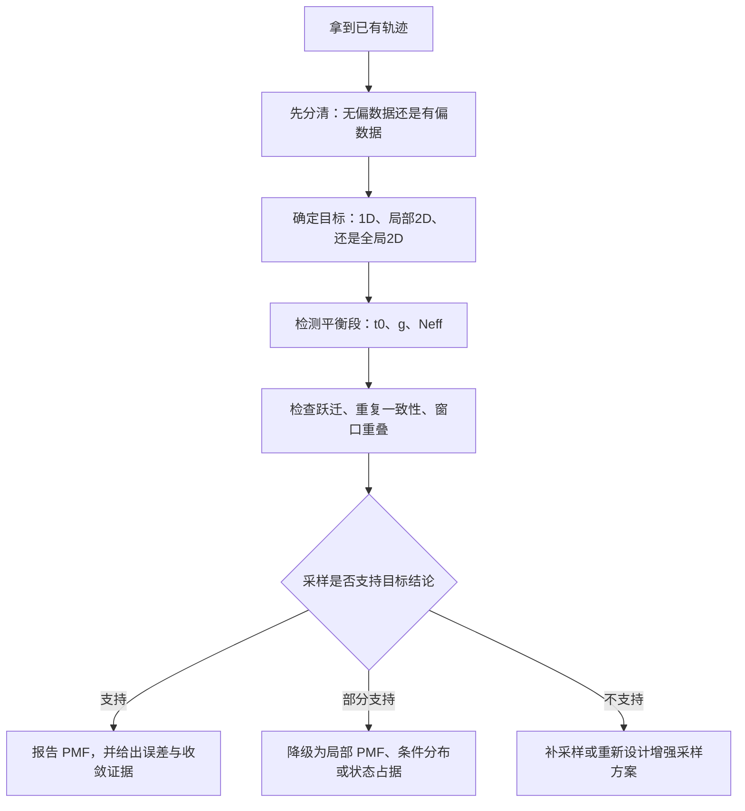

# PMF不是画出来就算数：从收敛、重加权到2D自由能面的物理判据

很多人第一次做 PMF 时，最容易掉进一个坑：**图是画出来了，但物理上并不一定成立**。问题在于，**能画出来**，和**能不能当成平衡自由能解释**，是两回事。这篇文章只回答几个更基础、也更容易出错的问题：已有数据什么时候**足够支持 PMF**，什么时候**只能报局部结果**，什么时候**必须重加权**，什么时候 2D 图虽然能画，但其实不该把它写成“**收敛的自由能面**”。

## 结论

- PMF 的定义本身并不难，真正困难的是**采样是否真的支持这个定义**。无偏 MD 确实可以直接给自由能，但前提是分析段已经**平稳**，而且目标坐标空间被**充分访问**；只要存在偏置、约束、umbrella 或多窗口合并，就**不能跳过重加权**。
- 2D PMF 不是“多画一个维度”那么简单，而是对**采样混合**提出了更高要求。如果某些区域从来没被访问过，任何后处理都**不能把真实自由能补出来**；因此，很多时候你真正能安全报告的，并不是全局 PMF，而是**局部 PMF、条件分布或状态占据**。

## PMF 到底是什么

对一个集合变量 $\xi$，平衡自由能剖面定义为：

$$
F(\xi) = -k_B T \ln P(\xi) + C
$$

如果有两个集合变量 $\xi,\eta$，对应的二维自由能面就是：

$$
F(\xi,\eta) = -k_B T \ln P(\xi,\eta) + C
$$

#### 公式的通俗解释

这两个式子真正表达的是一句很朴素的话：**某个状态如果在平衡系综里更常出现，它的自由能就更低**。所以，问题的核心从来不是“会不会取负对数”，而是你算出来的 $P(\xi)$ 或 $P(\xi,\eta)$ 到底是不是**平衡分布**，这个分布覆盖的是**全局空间**还是只覆盖了一个局部盆地，以及每个 bin 里到底有多少**有效独立样本**。这三件事，才真正决定了你的 PMF 能不能被当成物理结果来解释。

在后面的例子里，我会经常用 `P2` 和 `Z` 这两个符号。这里可以先把它们通俗地理解成两类常见坐标：`P2` 代表某种**取向序参量**，也就是“分子更偏向平躺、倾斜还是竖直”的量化描述；`Z` 代表某种**位置坐标**，例如分子相对于界面、膜中心或参考平面的距离。你完全可以把它们替换成自己体系里真正关心的两个集合变量。

## 什么叫“物理上正确”的 PMF

如果想让一条 PMF 在文章里站得住脚，至少要同时满足四件事：

1. 数据来自**同一个目标系综**
2. 用来分析的轨迹段已经进入**平稳区**
3. 你关心的坐标范围内发生了足够的**往返跃迁**
4. 误差估计使用的是**有效样本数**，不是总帧数

只要这四条里缺一条，图可能仍然能画出来，但解释时就必须**明显降级**。

## 第一关：是不是同一个统计系综

这一点最容易被忽视。如果所有数据都来自**同一统计系综**，也就是温度一致、压力设置一致、力场和拓扑一致、体系组成与边界条件一致，同时**没有额外偏置或约束**，那么这些轨迹才有资格被当作同一个平衡分布的样本来合并分析。

那么你可以直接从直方图或核密度估计（KDE）得到 $P(\xi)$，再转成自由能。但只要出现下面任一种情况，就**不能把所有帧直接混在一起做直方图**：

| 情况 | 为什么不能直接混合 |
| --- | --- |
| 对某个坐标加了 umbrella 势 | 采样分布已经被显式改权，不再对应原始无偏分布 |
| 加了位置约束或取向约束 | 体系访问相空间的方式被限制，直方图不再代表自然占据 |
| 做过 steered MD 或 pulling | 轨迹带有外场驱动，不能直接当成平衡样本 |
| 合并了不同温度的数据 | 不同温度对应不同平衡分布，不能简单拼接 |
| 合并了不同哈密顿量或不同参数的数据 | 势能面本身不同，统计权重自然也不同 |

这时你要处理的已经不是“无偏概率”，而是“**被改权重后的采样概率**”。**必须重加权**，常见工具就是 WHAM、MBAR，或者更一般的重加权流程。

## 第二关：轨迹是不是已经进入平稳区

很多 PMF 最大的问题，不是采样短，而是**前半段根本还没平衡**。比如系统一开始从某个强行构建的初始构型出发，前几十纳秒甚至更久都还在弛豫。如果把这一段直接并进统计，得到的就不是平衡分布，而是“**初始条件残留 + 平衡波动**”的混合物。

一个实用做法，是先做平衡段检测，再决定从哪里开始统计。常用工具是 `pymbar.timeseries`。这里输入的数据，不是什么特殊格式文件，而是**某个集合变量随时间变化的一列数据**，最常见的就是 `P2(t)` 或 `Z(t)` 这样的时间序列：

```bash
python - <<'PY'
from pymbar import timeseries
import numpy as np

P2_t = np.loadtxt('P2_t.dat')
t0, g, Neff = timeseries.detect_equilibration(P2_t, nskip=10)
print(t0, g, Neff)
PY
```

如果你手里保存的是多列文件，例如同一份文件里同时有时间、`P2` 和 `Z`，那就应该先把你想分析的那一列取出来，再送进 `detect_equilibration()`，而不是把整张表不加区分地直接读进去。

这里最值得报告的，不是“我跑了多少 ns”，而是**平衡起点** $t_0$、**统计低效因子** $g$ 和**有效样本数** $N_{\mathrm{eff}}$。

真正决定误差条大小的，是**独立样本有多少**，不是帧有多少。很多时候看起来“已经有几十万帧”，但如果**自相关很强**，真正能用于统计判断的独立样本可能并不多。

## 第三关：有没有真正发生“来回走动”

这是判断 PMF 是否可信的核心。真正有用的判断，不是“分布看起来挺宽”，而是体系有没有在你关心的几个主要状态之间**真正来回走动**，也就是是否发生了足够多的**往返跃迁**（round trips）。

### 对 1D 和 2D PMF，要求到底差在哪里

| 目标 | 至少要看到什么 | 不能轻易下的结论 |
| --- | --- | --- |
| 1D PMF | 主要盆地被多次访问，盆地之间有往返跃迁，不同重复给出相近边缘分布 | 只有单盆地波动时，不应宣称得到全局 PMF |
| 2D PMF | 两个坐标都被实质性访问，且在固定第一维时第二维也能混合，不同区域之间整体连通 | 如果第二维几乎没动，或固定某一维后另一维几乎不跨峰，就不应宣称得到全局 2D 自由能面 |

如果体系只在一个盆地附近晃动，那么你当然也能画出一条曲线，但那更接近“**局部热涨落的自由能近似**”，而不是**全局 PMF**。二维情况则更严格，因为它要求你不仅采到 $\xi$，还要在不同 $\eta$ 条件下把 $\xi$ 也采匀；一旦第二维只是窄范围波动，这张 2D 图通常就只能算**局部地形**。

## 一个最常见的误区：能画 2D，不等于应该发 2D

很多人会这样做：选两个坐标，做二维直方图，再对联合概率取负对数，最后得到一张彩色图。从程序角度看完全没问题，但从物理角度看，可能只说明一件事：**你的轨迹在一个局部区域里留下了很多点**。

这时真正应该问的，不是“图是不是好看”，而是三个更扎实的问题。第一，**第二维是不是只覆盖了一个很窄的范围**；如果是，那么 2D 图只是把**局部波动展开成二维**，并没有真正回答更大的自由能问题。第二，**高自由能区域是“真的高”，还是“根本没采到”**；没有访问到的格点，在视觉上很容易被误读成高能区，但统计学上它可能只是**空白区**。第三，**盆地之间的通道是物理能垒，还是统计断裂**；如果两个盆地中间几乎没有过渡点，你看到的未必是高能屏障，也可能只是**采样没有连通**，更专业地说，就是这些区域之间缺少足够的**统计连通性**。

如果这些问题答不上来，最稳妥的表述通常不是“得到了全局 2D PMF”，而是把口径主动降到“**局部 2D 自由能地形**”“**条件分布** $P(\xi\mid\eta)$”或者“**已结合区间内的取向自由能**”。

## 什么时候无偏 MD 足够

无偏 MD 适合回答的问题，其实比很多人想象得更有限，但也更扎实。与其笼统地说“能不能算 PMF”，不如先区分你到底想回答哪一类问题。

| 目标 | 无偏 MD 的适用性 | 更合适的表述 |
| --- | --- | --- |
| 单个坐标的 1D 边缘自由能 | 较好 | 1D PMF |
| 某个局部区域内的自由能起伏 | 较好 | 局部 PMF |
| 分箱后的状态占据比较 | 较好 | 条件分布或占据统计 |
| 跨多个盆地的全局自由能 | 谨慎 | 只有在多次跨盆地跃迁后才可报告 |
| 同时含位置与取向的 2D 自由能面 | 很谨慎 | 通常先降级为局部 2D 或条件分布 |
| 含解离、再结合、重排等慢过程 | 很谨慎 | 往往需要增强采样支撑 |

如果你的无偏轨迹从头到尾都没有离开某个状态盆地，那么最合理的结论不是“体系没有别的态”，而是：**当前采样没有能力回答这个问题**。

## 什么时候必须用 WHAM 或 MBAR

这个判断其实很干脆：**只要采样权重被改过，就要重加权**。与其把这一条说成一句口号，不如直接看常见场景：

| 场景 | 能不能直接做直方图 | 推荐处理 |
| --- | --- | --- |
| 同一无偏 MD | 可以 | 直方图或 KDE |
| umbrella 窗口 | 不可以 | WHAM 或 MBAR |
| 多温度数据合并 | 不可以 | MBAR |
| 有约束或 pulling | 不可以 | 显式重加权 |
| 多个偏置窗口做 2D 分布 | 不可以 | 先去偏，再做联合分布 |

如果你手上已有沿某个坐标布置好的 umbrella 窗口，那么它们通常足够支持**可靠的 1D PMF**。至于能不能进一步得到 2D PMF，要看另一个坐标在每个窗口里是不是也混合得足够好。**主坐标被偏置采到，并不自动意味着旁观变量也已经收敛**，这一点在实际分析里经常被误判。

## 一个非常实用的判断：你到底能安全声称什么

| 诊断结果 | 最稳妥的说法 |
| --- | --- |
| 只有一个局部盆地被采到 | 局部自由能或局部涨落 |
| 1D 有多次跨峰跃迁，重复一致 | 可以报告 1D PMF |
| 2D 中第二维很窄 | 只报告条件分布或局部 2D 地形 |
| umbrella 在主坐标重叠良好，但副坐标混合差 | 主坐标 PMF 可信，2D 结果仅作定性参考 |
| 每个窗口内副坐标多次跨峰，重复一致 | 可以认真讨论 2D PMF |

这张表背后的原则其实很简单：**结论的口径，必须和采样能力匹配**。很多结果并不是“完全不能发”，而是应该主动把口径降到“**局部 PMF**”“**条件分布**”或者“**占据统计**”这一层，这样反而更稳。

## 收敛不能只看“曲线变平”

很多人判断收敛时，只看 PMF 曲线后半段是不是“不怎么变了”。这**远远不够**，因为一条表面平滑的曲线，可能只是建立在**高度相关**、**重复不一致**、或者根本**没有跨盆地跃迁**的数据上。

### 更可靠的收敛证据链

更可靠的判断，通常要把下面几类证据合在一起看：先看结果会不会**随时间继续漂**，也就是是否仍在发生**系统性漂移**；再看不同重复是否支持同一组物理结论；接着看你到底有多少**真正独立的样本**；最后再确认主要状态之间有没有**真正发生来回切换**，也就是是否存在足够的**往返跃迁**。

- **时间分块分析**：把前 1/3、前 2/3 和全部数据分别算一次 PMF。这样做的目的，不是为了多画几条线，而是看结果会不会继续变。如果主要盆地位置、相对深度和势垒高度还在**系统性漂移**，那就说明体系还在持续演化、尚未真正稳定下来，此时“看起来平滑”并不等于已经收敛。
- **重复一致性**：不同重复轨迹给出的分布或 PMF 应该大体一致。这里最重要的不是三条线能不能完全重合，而是它们是否支持同一个物理结论。如果不同重复之间差异明显，最常见的解释不是“体系本来就这样”，而是**混合仍然不足**，也就是每条轨迹还在各自记着不同的初始路径。
- **自相关分析**：报告 $g$ 和 $N_{\mathrm{eff}}$，确认自己不是在用几十万帧去假装拥有几十万个独立样本。连续轨迹里的相邻帧往往很像，所以“帧数很多”不等于“信息很多”。这一步本质上是在修正**相关样本导致的误差低估**，也就是给**误差条去水分**，说明到底有多少真正能独立贡献统计信息的数据点。
- **跃迁计数**：主要盆地之间要有实质性的往返，而不是只在一个盆地里高频抖动。很多人看到时间序列很活跃，就以为体系采样得很好，但如果这些波动始终发生在同一个局部盆地里，那么关键状态之间的相对自由能差其实还没有被真正比较过。没有**跨盆地跃迁**时，很多相对自由能差并不稳。
- **窗口重叠**：对 umbrella 来说，相邻窗口必须足够连通。如果相邻窗口之间几乎没有共同覆盖的区域，WHAM 或 MBAR 就很难把整条 PMF **稳稳地拼起来**。这时数学上虽然还能算，物理上却可能只是把几段彼此脱节的局部结果硬接在一起；更规范地说，就是窗口之间缺少足够的**概率分布重叠**。

### umbrella 数据至少要看什么

对于 umbrella，`gmx wham` 的常规检查项很重要：

```bash
gmx wham -it tpr-files.dat -if pullf-files.dat -o pmf.xvg -hist hist.xvg -ac
```

这里至少要看三件事，而且最好把它们理解成“这条 PMF 能不能被顺畅接起来”的三个层次检查：

- **相邻窗口直方图有没有足够重叠**。这是最基础的一关。如果相邻窗口几乎不相交，那么后处理再漂亮，也只是把统计上**彼此脱节的区间强行缝在一起**，整条曲线会缺少真正的连接。
- **自相关时间是不是已经大到接近单窗口长度**。这一步是在问：单个窗口里到底有没有采到足够多的独立信息。如果一个窗口里有效独立样本本来就很少，那么它对整条 PMF 的贡献会**既不稳定又很难估误差**；此时窗口数量再多，也不等于每个窗口都真的达到**局部统计稳定**。
- **不同窗口拼起来后有没有明显断链**。所谓断链，不一定表现成肉眼可见的大跳跃，也可能表现为某些区间**误差异常**、**重复不一致**，或者对分析参数**极其敏感**。如果一条 PMF 只要稍微改一下 bin、平滑或截断方式就明显变样，那通常不是“图画风不同”，而是底层采样还不够扎实。

如果某些窗口几乎没有重叠，或者窗口内采样时间和自相关时间是一个量级，那这套 PMF 就**很难让人放心**。

## 2D PMF 什么时候才值得做

更关键的问题是：什么时候做 2D PMF 比做 1D 或条件分布**更有信息增益**。

通常至少要同时满足三点：两个坐标都对应你真正关心的慢过程，这两个坐标在数据里都被实质性采样到了，而且在固定第一维时第二维不是“卡死”的，也就是没有被困在某个狭窄取值范围里。少了其中任何一条，二维分析带来的往往不是新信息，而是新噪声。

如果不满足，2D 往往只会带来两个后果：**图更花哨，误差更大**。因为二维一上来就会遭遇“**维数灾难**”：格点数一多，平均到每个 bin 的有效样本数会迅速下降，空 bin 和噪声会明显增加。

所以，在下面这些情况下，**不做 2D 反而更专业**：如果第二维只是辅助解释变量，如果第二维的采样范围很窄，如果第二维的混合时间明显比单窗口长度更长，或者你的核心结论本质上靠 1D 就已经成立，那么继续硬做 2D 往往只会增加图的复杂度，而不会提高结论的可信度。

## 还有一个细节：有些序参量自带“几何熵”

如果你用的是角度、取向序参量，或者由角度变换得到的量，那么要小心一个问题：**原始分布里可能混进了变量测度本身带来的偏置**。

最直观的例子就是方向相关变量。即使体系完全各向同性，某些取向序参量的概率分布也未必是均匀的。这意味着直接计算

$$
F(\xi) = -k_B T \ln P(\xi) + C
$$

得到的可能既包含真实相互作用偏好，也包含“随机几何本来就更容易落在某些值附近”的贡献。这时最常见的处理方式有两种：

| 报告方式 | 含义 | 适合的讨论场景 |
| --- | --- | --- |
| 原始 PMF | 包含变量测度带来的几何熵 | 讨论状态占据、总体分布 |
| 相对参考分布的超额自由能 | 更突出相互作用导致的偏好 | 讨论取向偏好、界面诱导效应 |

这不是所有体系都必须做，但如果你的核心结论高度依赖“**取向偏好**”，那这个问题最好提前想清楚。否则读者看到的“最低谷”，有一部分可能只是**变量定义自带的几何效应**，而不全是体系相互作用本身。

## 一个面向实战的工作流



这个流程最重要的一步，不是“画图”，而是中间那个判断：**采样能力到底支不支持你想说的话**。真正成熟的分析，不是把所有图都画出来，而是知道**哪些图值得认真解释**，哪些图**只能当辅助材料**。

## 结果该怎么讲，才更站得住脚

一张自由能图要站得住脚，关键不在于修饰，而在于先把**哪里可信、哪里还不能多说**讲清楚：

- **先说明平衡段和有效样本是怎么处理的**。如果一开始就交代你已经剔除了前期非平衡部分，并且按相关性修正了有效样本数，读者会更容易接受后面的自由能结果，因为他知道这些曲线不是把所有帧不加区分地堆出来的。
- **再说明 1D 结果为什么可信**。如果主要状态之间已经出现多次往返跃迁，而且不同重复支持同一个结论，那么这时去讨论 1D PMF 的相对高低才更有底气，因为它背后有明确的动力学采样证据。
- **谈到 2D 结果时主动限定范围**。如果二维图只有一部分区域采样得比较扎实，那就只讨论那一部分，把它明确写成局部自由能地形或条件分布。这样做不会削弱文章，反而会让读者觉得你的判断更稳。
- **对空白区和混合不足区保持克制**。没有访问到的区域就不要硬解释，混合明显不足的方向也不要勉强下定量结论。这样做不是示弱，而是在**保护结论的可信度**。

这种写法的价值不在于“更谨慎”，而在于**把真正确定的部分讲扎实，把暂时不能确定的部分老老实实留白**。

## 最后总结

PMF 真正难的地方，从来不是软件命令，而是你是否对“这张图能回答什么问题”有**清醒判断**。

- 无偏 MD 确实可以直接给自由能，但前提是轨迹分析段已经**平稳、混合、可重复**。如果连主要状态之间的往返都没有发生，那么图上看到的更多只是局部波动，而不是可以放心解释的全局自由能。
- 只要数据里存在偏置、约束、umbrella 或多窗口拼接，就必须认真做**重加权**。这不是后处理里的可选美化步骤，而是把“被改过权重的采样”还原成目标分布所必需的物理操作。
- 2D PMF 的门槛**显著高于** 1D PMF，因为它要求两个坐标都被充分访问，而且在固定其中一维时另一维也要发生足够混合。很多 1D 看起来已经稳定的数据，一到二维分析就会暴露出空白区、断裂区和高噪声问题。
- **没采到就是没采到**，后处理不能替代真实采样。无论是更平滑的直方图、更复杂的重加权，还是更漂亮的二维彩图，都不能凭空恢复从未被访问过的状态或通道。
- 当采样只支持局部结论时，**老老实实报告局部结论**，反而更有说服力。把结果写成局部 PMF、条件分布或状态占据，通常比强行宣称“全局自由能面已经收敛”更专业，也更经得起追问。

如果把这套判断标准先建立起来，你之后无论做无偏 MD、umbrella、metadynamics，还是更复杂的多维自由能分析，很多技术决策都会清楚得多。
