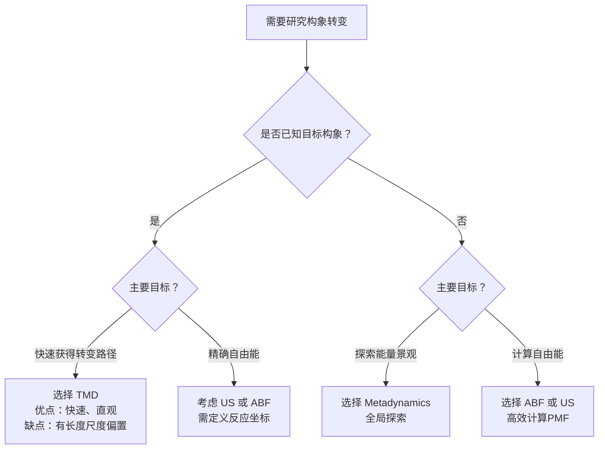

# 靶向分子动力学（TMD）：用RMSD约束引导蛋白质构象转变

## 一、TMD方法的基本思想

### 解决什么问题？

蛋白质的构象转变是许多生物学过程的核心，但常规分子动力学模拟面临两大困境：

1. **能垒过高**：构象转变通常需要跨越几十甚至上百 kcal/mol 的能垒
2. **时间尺度不匹配**：生物学相关的转变可能需要毫秒到秒级，远超常规MD的纳秒到微秒尺度

**靶向分子动力学**（Targeted Molecular Dynamics, TMD）的解决思路是：**如果我们已知蛋白质的初始构象和目标构象（如来自不同晶体结构），能否通过施加适当的约束力，引导系统沿着合理的路径从初始态平滑过渡到目标态？**

### 核心原理

TMD通过引入一个**基于RMSD的时间依赖性约束势**来实现构象引导，使系统独立于能垒高度完成转变：

$$
U_{TMD}(t) = \frac{1}{2} \frac{k}{N} \left[ RMSD(t) - RMSD^*(t) \right]^2
$$

其中：
- $RMSD(t)$ 是当前构象与目标构象之间的**实际RMSD**（通过最优叠合计算）
- $RMSD^*(t)$ 是**目标RMSD**，从初始值线性递减至零
- $k$ 是**力常数**（spring constant），单位为 kcal·mol⁻¹·Å⁻²
- $N$ 是**被约束的原子数量**（通常是Cα原子），力常数除以N是为了避免对大系统施加过大的总力

**物理意义**：这个势能函数就像一个"弹簧"，一端固定在当前构象，另一端固定在目标构象。弹簧的"平衡长度"（即 $RMSD^*(t)$）随时间线性减小，从而持续地拉动系统向目标构象靠近。

### 目标RMSD的时间演化

根据NAMD等软件的文档，目标RMSD **从初始RMSD值线性递减到最终RMSD值**。通用的线性插值公式为：

$$
RMSD^*(t) = RMSD_{initial} + \frac{t}{t_{total}} \cdot (RMSD_{final} - RMSD_{initial})
$$

其中：
- $RMSD_{initial}$ 是初始构象与目标构象之间的初始RMSD值
- $RMSD_{final}$ 是期望的最终RMSD值（通常设为0，表示完全到达目标构象）
- $t_{total}$ 是计划的转变总时间

**最常见的特例**：当 $RMSD_{final} = 0$ 时，公式简化为：

$$
RMSD^*(t) = RMSD_{initial} \cdot \left(1 - \frac{t}{t_{total}}\right)
$$

**示例**：假设 $RMSD_{initial} = 8.0$ Å，$RMSD_{final} = 0$ Å，$t_{total} = 100$ ns：
- $t = 0$ ns 时：$RMSD^* = 8.0$ Å（系统还在初始态附近）
- $t = 50$ ns 时：$RMSD^* = 4.0$ Å（应该完成一半的转变）
- $t = 100$ ns 时：$RMSD^* = 0$ Å（应该完全到达目标构象）

### 约束力的作用机制

约束势对每个被约束的原子 $i$ 产生的力为：

$$
\mathbf{F}_i^{TMD} = -\frac{\partial U_{TMD}}{\partial \mathbf{r}_i} = \frac{k}{N} \left[ RMSD(t) - RMSD^*(t) \right] \cdot \frac{\partial RMSD}{\partial \mathbf{r}_i}
$$

**关键技术点**：

1. **最优叠合**：在计算RMSD前，必须先通过**Kabsch算法**对当前构象和目标构象进行最优叠合，消除整体的平动和转动。这确保RMSD仅反映内部构象差异。

2. **RMSD梯度**：$\frac{\partial RMSD}{\partial \mathbf{r}_i}$ 的计算涉及RMSD对每个原子坐标的导数。数学上，这需要考虑叠合旋转矩阵的隐式依赖，实现较为复杂。

3. **力的分配**：约束力会**分布到所有被约束的原子**上。每个原子受到的力大小与其相对目标位置的偏离程度成正比，且指向能够减小整体RMSD的方向。

## 二、TMD的数学推导

### RMSD的定义

对于N个被约束的原子，RMSD定义为：

$$
RMSD = \sqrt{\frac{1}{N} \sum_{i=1}^{N} \left\| \mathbf{r}_i - \mathbf{R} \mathbf{r}_i^{ref} - \mathbf{t} \right\|^2}
$$

其中：
- $\mathbf{r}_i$ 是当前构象中原子 $i$ 的位置
- $\mathbf{r}_i^{ref}$ 是目标构象中原子 $i$ 的位置
- $\mathbf{R}$ 是**最优旋转矩阵**（通过Kabsch算法求得）
- $\mathbf{t}$ 是**平移向量**（通常通过质心对齐使其为零）

**注意**：RMSD的计算本身依赖于最优叠合，因此RMSD对坐标的导数需要考虑旋转矩阵 $\mathbf{R}$ 对坐标的隐式依赖。

### RMSD梯度的计算

定义叠合后的位置差：

$$
\Delta \mathbf{r}_i = \mathbf{r}_i - \mathbf{R} \mathbf{r}_i^{ref}
$$

则RMSD可以写成：

$$
RMSD = \sqrt{\frac{1}{N} \sum_{i=1}^{N} \|\Delta \mathbf{r}_i\|^2}
$$

对原子 $j$ 的坐标求导：

$$
\frac{\partial RMSD}{\partial \mathbf{r}_j} = \frac{1}{RMSD \cdot N} \sum_{i=1}^{N} \Delta \mathbf{r}_i \cdot \frac{\partial \Delta \mathbf{r}_i}{\partial \mathbf{r}_j}
$$

由于 $\Delta \mathbf{r}_i = \mathbf{r}_i - \mathbf{R} \mathbf{r}_i^{ref}$，且旋转矩阵 $\mathbf{R}$ 也依赖于所有原子的当前位置，因此：

$$
\frac{\partial \Delta \mathbf{r}_i}{\partial \mathbf{r}_j} = \delta_{ij} \mathbf{I} - \frac{\partial \mathbf{R}}{\partial \mathbf{r}_j} \mathbf{r}_i^{ref}
$$

其中 $\delta_{ij}$ 是Kronecker delta，$\mathbf{I}$ 是单位矩阵。

**简化近似**：在大多数MD软件的实现中（如NAMD的Colvars模块），为了提高计算效率，会使用**冻结旋转近似**：假设旋转矩阵 $\mathbf{R}$ 在短时间内变化不大，忽略 $\frac{\partial \mathbf{R}}{\partial \mathbf{r}_j}$ 项。这样，RMSD梯度简化为：

$$
\frac{\partial RMSD}{\partial \mathbf{r}_j} \approx \frac{\Delta \mathbf{r}_j}{RMSD \cdot N}
$$

即：**每个原子受到的力方向指向其在目标构象中的对应位置**（经过最优叠合后）。

### 约束力的最终形式

将RMSD梯度代入力的表达式：

$$
\mathbf{F}_j^{TMD} = \frac{k}{N} \left[ RMSD(t) - RMSD^*(t) \right] \cdot \frac{\Delta \mathbf{r}_j}{RMSD \cdot N}
$$

简化为：

$$
\mathbf{F}_j^{TMD} = \frac{k}{N^2 \cdot RMSD(t)} \left[ RMSD(t) - RMSD^*(t) \right] \cdot \Delta \mathbf{r}_j
$$

**通俗解释**：
- 当 $RMSD(t) > RMSD^*(t)$ 时（系统落后于目标进度），力为正，推动原子向目标位置移动
- 当 $RMSD(t) < RMSD^*(t)$ 时（系统超前于目标进度），力为负，稍微抑制原子的运动
- 力的大小正比于偏差 $[RMSD(t) - RMSD^*(t)]$ 和力常数 $k$

## 三、TMD的关键参数设置

### 被约束原子的选择

**常见选择策略**：

1. **Cα原子**（最常用）
   - **优点**：代表蛋白质骨架结构，计算快速
   - **适用**：大多数蛋白质构象转变

2. **骨架原子**（N, Cα, C）
   - **优点**：比仅用Cα更精确
   - **缺点**：计算量增加约3倍

3. **特定区域原子**（局部TMD）
   - **优点**：只约束发生构象变化的区域
   - **适用**：局部域运动、loop重排

**选择原则**：避免过度约束侧链和溶剂分子，以保持系统的物理合理性。

### 力常数的选择

**经验值范围**：
- **NAMD推荐值**：200 kcal·mol⁻¹·Å⁻² （总力常数，已除以N）
- **PLUMED典型值**：10-100 kcal·mol⁻¹·Å⁻²
- **GROMACS + PLUMED**：10-50 kJ·mol⁻¹·nm⁻²（约 24-120 kcal·mol⁻¹·Å⁻²）

**选择策略**：
- **过小**（k < 10）：系统响应太慢，可能无法按时完成转变
- **过大**（k > 1000）：转变过于"生硬"，可能导致结构扭曲
- **推荐**：从中等值（如100-200）开始，通过短时测试调整

### 转变时间的选择

**时间尺度选择**：
- **快速扫描**（1-10 ns）：快速获得粗略路径，但可能不够弛豫
- **中等速度**（10-100 ns）：平衡效率和准确性，推荐用于大多数情况
- **缓慢转变**（100 ns - 1 μs）：接近准平衡，路径更可靠但计算成本高

**转变速率**：定义 $v = RMSD_0 / t_{total}$（单位：Å/ns）
- **v > 1.0 Å/ns**：非常快，强制引导
- **v = 0.1-1.0 Å/ns**：适中，常用
- **v < 0.1 Å/ns**：接近准静态

## 四、TMD的长度尺度偏置问题

### 什么是长度尺度偏置？

这是TMD最严重的系统性问题：**在典型的TMD模拟中，大尺度运动倾向于先发生,小尺度运动倾向于后发生**。

**物理原因**：

由于RMSD计算前需要进行**全局最优叠合**（去除整体平动和转动），系统会被隐式地引导沿着**最低频简正模式**运动。这些模式对应于最大尺度的域运动（如整个结构域的开合）。只有当大尺度运动接近目标后，系统才会开始调整更高频的小尺度重排（如loop重构、侧链旋转）。

**数学解释**：

考虑蛋白质的简正模式展开。在全局叠合下，低频模式（对应大尺度协同运动）对RMSD的贡献更显著。TMD约束势会优先驱动这些低频模式向目标值移动，因为它们能最快地减小RMSD。

**后果**：

1. **事件顺序错误**：如果真实过程是"小配体结合 → 局部重排 → 大域运动"（如变构蛋白），TMD可能给出相反的顺序
2. **方向依赖**：从A到B和从B到A的TMD轨迹显示不同的事件顺序
3. **路径不真实**：可能与实际的最小自由能路径偏离

**实例**（Calmodulin研究）：
- **真实过程**：Ca²⁺结合 → 局部EF-hand结构变化 → 中央linker弯曲 → 两个lobe合拢
- **TMD可能显示**：两个lobe先合拢 → 然后才是局部细节调整

### 如何消除长度尺度偏置？

**1. 局部约束TMD（Locally Restrained TMD, LRTMD）**

将蛋白质分成多个小的连续片段，对每个片段分别施加RMSD约束：

$$
U_{LRTMD} = \sum_{m=1}^{M} \frac{1}{2} \frac{k_m}{N_m} \left[ RMSD_m(t) - RMSD_m^*(t) \right]^2
$$

其中 $m$ 标记不同的片段。每个片段独立进行最优叠合，避免全局叠合引入的偏置。

**优点**：完全消除长度尺度偏置
**缺点**：需要人工划分片段，计算复杂度增加

**2. 二面角空间TMD（Dihedral-Space TMD, DSMD）**

直接在二面角（φ, ψ, χ）空间定义约束，完全避免全局叠合：

$$
U_{DSMD} = \frac{1}{2} k \sum_{i} \left[ \phi_i(t) - \phi_i^*(t) \right]^2
$$

**优点**：更适合描述局部构象变化，无长度尺度偏置
**缺点**：需要处理角度周期性，实现较复杂

**3. 多次独立模拟验证**

从初始和目标双向运行TMD，比较路径的一致性。如果正向和反向路径显示相同的关键中间态和事件顺序，则路径更可靠。

## 五、TMD与其他方法的区别

### TMD vs 牵引分子动力学（SMD）

虽然名称相似，两者有本质区别：

| 特性 | **TMD** | **SMD** |
|------|---------|---------|
| **目标** | 引导到**已知目标构象** | 沿**指定方向**拉动（无目标构象） |
| **约束类型** | 基于**整体RMSD** | 基于**单个距离/坐标** |
| **典型应用** | 蛋白质构象转变、域运动 | 配体解离、膜通透、力学响应 |
| **是否需要目标结构** | **需要** | **不需要** |
| **实验对应** | 无 | AFM单分子力谱 |

### TMD vs 伞形采样（US）

| 特性 | **TMD** | **Umbrella Sampling** |
|------|---------|----------------------|
| **目标** | 生成转变路径 | 计算精确自由能曲面（PMF） |
| **是否需要目标结构** | 需要 | 不需要 |
| **采样方式** | **非平衡**，强制引导 | **平衡**，每个窗口充分采样 |
| **自由能计算** | 困难（需Jarzynski修正） | **准确**（WHAM后处理） |
| **适用场景** | 已知终点的大构象变化 | 不知终点但想探索能量景观 |

### TMD vs 自适应偏置力（ABF）

| 特性 | **TMD** | **ABF** |
|------|---------|---------|
| **偏置方式** | **固定的RMSD约束** | **自适应抵消平均力** |
| **是否需要目标** | 需要 | **不需要** |
| **自由能计算** | 困难 | **直接输出PMF** |
| **路径偏置** | 有（长度尺度偏置） | 无（沿CV自由扩散） |

### TMD vs 元动力学（MTD）

| 特性 | **TMD** | **Metadynamics** |
|------|---------|------------------|
| **增强采样机制** | 谐振子约束强制引导 | **历史依赖的高斯势填平能谷** |
| **是否需要目标** | 需要 | **不需要** |
| **探索性** | 低（沿预定路径） | **高**（自发探索所有亚稳态） |
| **多能谷系统** | 不适用 | **适用**（自动发现所有能谷） |

### 方法选择指南



## 六、TMD的软件实现

### 主流MD软件中的TMD支持

| 软件 | TMD支持方式 | 推荐程度 | 备注 |
|------|----------|---------|------|
| **NAMD** | 原生，Colvars模块 | ⭐⭐⭐⭐⭐ | 文档最完善，设置最简单 |
| **GROMACS** | PLUMED插件 | ⭐⭐⭐⭐ | 需额外编译，但性能好 |
| **CHARMM** | 原生，TRAVel命令 | ⭐⭐⭐ | 功能强大但语法复杂 |
| **Amber** | PLUMED插件 | ⭐⭐⭐ | 类似GROMACS |

### NAMD示例配置

**Colvars配置文件**（tmd.colvars）：

```tcl
colvar {
    name tmd_rmsd
    rmsd {
        atoms {
            atomNumbersRange 1-1000:4  # Cα原子
        }
        refPositionsFile target.pdb
    }
}

harmonic {
    colvars tmd_rmsd
    centers 8.0              # 初始RMSD
    targetCenters 0.0        # 最终RMSD
    targetNumSteps 50000000  # 100 ns
    forceConstant 200.0      # kcal/mol/Ų
}
```

### GROMACS + PLUMED示例

**PLUMED输入文件**（plumed.dat）：

```plumed
# 定义RMSD集合变量
rmsd: RMSD REFERENCE=target.pdb TYPE=OPTIMAL

# 施加移动约束
movingrestraint: MOVINGRESTRAINT ARG=rmsd AT0=0.8 STEP0=0 AT1=0.0 STEP1=50000000 KAPPA0=4184.0 KAPPA1=4184.0

PRINT ARG=rmsd,movingrestraint.bias FILE=colvar.dat STRIDE=1000
```

**运行命令**：

```bash
gmx mdrun -deffnm md_tmd -plumed plumed.dat -v
```

## 七、TMD的优势与局限

### 主要优势

1. **快速生成转变路径**：在ns-μs时间尺度内完成生物学上需要ms甚至更长的转变
2. **无需复杂反应坐标**：只需RMSD，不需要预先知道自由能曲面形状
3. **直观可视化**：轨迹可以直接展示转变过程和关键中间态
4. **适用于大系统**：只约束部分原子，额外计算开销小

### 主要局限

1. **长度尺度偏置**：大尺度运动先发生，事件顺序可能不真实
2. **非平衡性质**：无法直接计算自由能，不满足详细平衡
3. **路径依赖性**：不同参数可能产生不同路径
4. **依赖目标结构质量**：目标结构的缺陷会被"强制复制"

### 最佳实践建议

1. **参数敏感性测试**：系统地改变力常数和转变时间，检查路径稳定性
2. **双向验证**：从初始和目标双向运行TMD，比较一致性
3. **结合其他方法**：
   - TMD生成初始路径 → US/ABF计算精确自由能
   - TMD找到中间态 → 常规MD验证其稳定性
4. **考虑使用LRTMD**：对于复杂系统，使用局部约束避免长度尺度偏置

## 八、总结

TMD是一种**强大且直观**的方法，特别适合于已知初始和目标构象的蛋白质构象转变研究。它能够快速生成转变路径的第一近似，帮助我们理解复杂的生物学过程。

但使用时必须**清醒认识其局限性**：
- **长度尺度偏置**是系统性问题，需要通过LRTMD等方法改进
- **非平衡性质**使其不适合精确自由能计算
- 生成的路径应该作为**假设**而非**结论**，需要进一步验证

在实际研究中，TMD最好与其他方法结合使用，发挥各自优势，获得既快速又可靠的结果。

---

## 参考资料

### 关键文献

1. **Schlitter J., Engels M., Krüger P.** (1994). *Targeted molecular dynamics: a new approach for searching pathways of conformational transitions.* J. Mol. Graph. 12, 84-89.
   - TMD方法的原始提出论文

2. **Ovchinnikov V., Karplus M.** (2012). *Analysis and elimination of a bias in targeted molecular dynamics simulations of conformational transitions: application to calmodulin.* J. Phys. Chem. B 116, 8584-8603.
   - 系统分析长度尺度偏置问题并提出LRTMD解决方案

3. **Ma J., Sigler P.B., Xu Z., Karplus M.** (2000). *A dynamic model for the allosteric mechanism of GroEL.* J. Mol. Biol. 302, 303-313.
   - TMD在大型蛋白复合物研究中的经典应用

### 软件文档

- **NAMD Colvars手册**：https://colvars.github.io/colvars-refman-namd/
- **PLUMED文档**：https://www.plumed.org/doc
- **NAMD TMD教程**：https://www.ks.uiuc.edu/Training/Tutorials/

### 在线资源

- **TMD方法介绍**：https://kbbox.h-its.org/toolbox/methods/molecular-simulation/targeted-molecular-dynamics/
- **GROMACS + PLUMED TMD教程**：https://www.aishwaryshivgan.com/targeted-molecular-dynamics-tmd-using-gromacs-and-plumed
