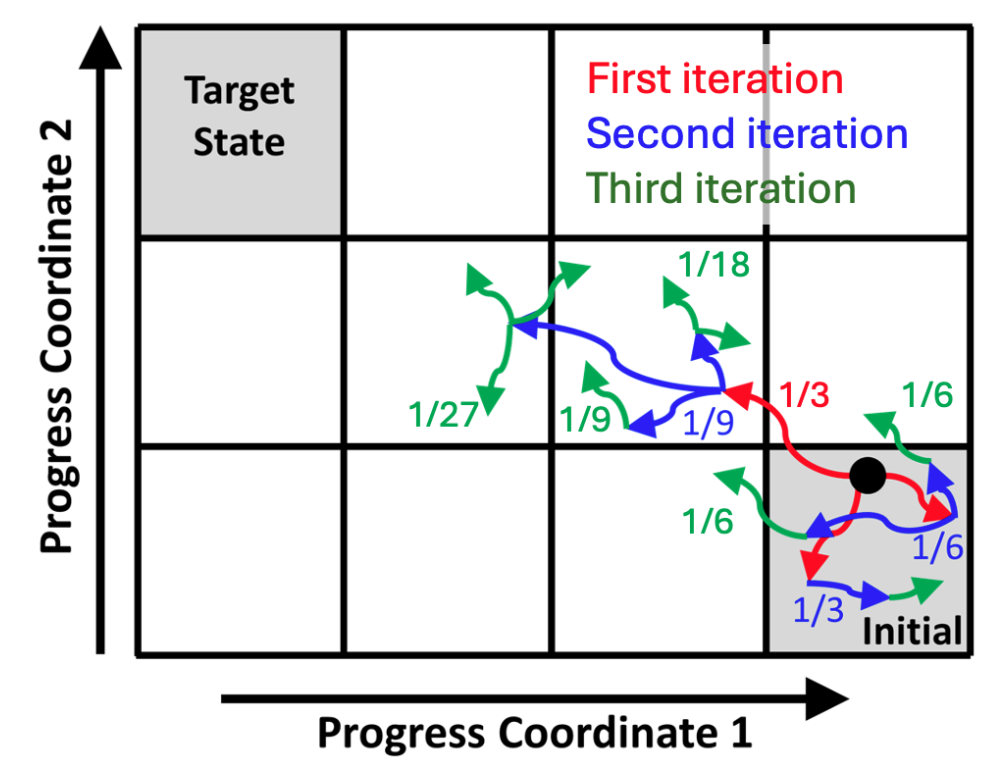

# 跨越毫秒到秒级鸿沟：加权系综模拟如何捕捉"看不见"的生物动力学

## 本文信息

- **标题**：加权系综模拟：方法、软件与应用的进展
- **作者**：Lillian T. Chong, Daniel M. Zuckerman
- **发表时间**：2025年5月6日（ChemRxiv预印本）
- **单位**：匹兹堡大学（美国），俄勒冈健康与科学大学（美国）
- **引用格式**：Chong, L. T., & Zuckerman, D. M. (2025). *WEIGHTED ENSEMBLE SIMULATION: ADVANCES IN METHODS, SOFTWARE, AND APPLICATIONS*. ChemRxiv. https://doi.org/10.26434/chemrxiv-2025-jtppp
- **相关软件**：本文主要讨论了基于 **WESTPA** 软件包的进展，并提及了其他实现如 **wepy**。

## 摘要

> 二十多年来，**加权系综（Weighted Ensemble, WE）** 路径采样策略以远低于传统模拟的计算成本，实现了对罕见事件（或称跨能垒过程）路径的模拟，同时保持了严谨的动力学信息。本综述重点介绍了WE在方法和软件方面的最新进展，包括用于路径系综机理分析和高效速率估算的工具。我们展示了加权系综在一系列广泛的凝聚相过程中的成功应用，例如，**微秒时间尺度的化学反应的混合量子力学/分子力学（QM/MM）模拟**，以及**毫秒到秒时间尺度的更慢过程的原子级模拟**。这些应用涵盖了**药物跨膜渗透、配体解离以及SARS-CoV-2刺突蛋白的大尺度开放**等前沿领域。我们还讨论了WE策略当前面临的局限性和关键挑战，该方法尚未完全发挥其潜力。

### 核心结论

- **WE是高效的罕见事件采样方法**：它通过复制（分裂）和删减（合并）轨迹，能够以更低的计算成本模拟药物解离、蛋白质构象变化等低概率事件，同时严格保留动力学信息。

- **方法学日趋成熟**：近年来，WE在**反应坐标优化（如机器学习辅助）、速率常数估算和不确定性量化**等方面取得了显著进展，使其更加强大和可靠。

- **软件生态系统完善**：以 **WESTPA** 为代表的开源软件包具有**高度可扩展性和互操作性**，无需修改动力学引擎即可与AMBER、GROMACS、OpenMM等主流软件无缝对接，极大地促进了其应用。

- **应用成果斐然**：WE已成功应用于多个前沿领域，包括模拟**秒级的SARS-CoV-2刺突蛋白开放**、**药物分子从深埋口袋中的解离**、以及**微秒级的QM/MM化学反应**，揭示了实验难以企及的机理细节。

## 背景

在分子模拟的世界里，许多最引人入胜的生物学过程——如**蛋白质折叠、药物分子与靶点的结合与解离、酶催化反应**——都属于"**罕见事件**"。这意味着这些过程虽然至关重要，但在整个模拟时间尺度中，系统大部分时间都处于稳定的能量"盆地"中，而**跨越能垒发生关键转变的瞬间则极为短暂和稀少**。使用传统的分子动力学（MD）模拟，想要捕捉到这些事件的完整路径和动力学信息，往往需要运行长达**毫秒、秒甚至更长时间**的模拟，这对于目前的计算资源来说是**极其昂贵甚至是不可能的**。

为了攻克这一难题，科学家们开发了多种增强采样和路径采样方法。其中，**加权系综（Weighted Ensemble, WE）** 是一种尤为强大且独特的路径采样策略。与那些通过修改能量势面来加速转变的方法不同，WE的核心思想是"**优胜劣汰，重点培养**"。它并行地运行大量短时间的、完全标准的MD轨迹，并为每条轨迹分配一个"权重"。在固定的时间间隔后，它会评估所有轨迹的位置，智能地"克隆"那些正在向我们感兴趣的罕见区域探索的轨迹（**分裂**），并"删减"那些在已充分采样的区域中冗余的轨迹（**合并**）。

通过这种方式，**WE将计算资源动态地重新分配到那些"有前途"的路径上**，极大地提高了采样到罕见事件的效率，同时由于每条轨迹本身是**无偏的**，整个过程保留了严谨的动力学信息，可以直接用来计算反应速率常数等关键物理量。经过二十多年的发展，WE方法本身、支持它的软件以及其应用范围都取得了长足的进步。

## 关键科学问题

作为一篇综述，本文旨在系统性地回答以下问题，为相关领域的研究者提供一份全面的指南和前沿展望：

1. **WE方法的核心原理是什么**？它与其他路径采样方法相比有何独特的优势和固有的局限性？
2. **近年来WE方法学本身有哪些关键突破**？研究者们是如何解决诸如如何定义"进展"、如何更准确地计算速率、以及如何评估结果不确定性等核心挑战的？
3. **支持WE模拟的软件生态系统发展如何**？以WESTPA为代表的软件包在可扩展性、易用性和与其他主流模拟软件的兼容性方面取得了哪些进展？
4. **WE在解决实际科学问题上取得了哪些里程碑式的应用成果**？它如何帮助我们理解从病毒入侵到药物设计等一系列复杂生物过程的动力学机理？
5. **WE方法的未来在哪里**？它仍然面临哪些挑战，以及未来的发展方向将如何进一步拓展其应用边界？

## 研究内容

### 核心理论：加权系综（WE）模拟的"道"与"术"

WE方法的核心思想在于通过操控一个带有权重的轨迹系综，在不偏离真实动力学的前提下，高效地对罕见事件进行采样。

#### 基本算法流程：分裂与合并的艺术

WE方法通过并行管理一组带有权重的轨迹来高效探索构象空间。整个过程可以被看作一个不断迭代的循环。

**图1：加权系综策略示意图**

该图展示了一个基础的WE实现，其中构象空间被划分为固定的"箱子（bins）"，每个箱子的目标轨迹数为3。子轨迹会均分其父轨迹的权重，确保每一轮迭代中总权重为1。

1. **初始化与空间划分**：首先，需要定义一个或多个"**反应坐标（Progress Coordinates）**"，它们是能够描述系统从初始态向目标态演化进程的变量。基于这些坐标，整个构象空间被划分成一系列离散的"**箱子（bins）**"。然后，从一个或多个初始构象开始，启动若干条轨迹，并为它们分配初始权重。所有轨迹的权重总和必须恒为1，即：

$$\sum_{i} w_i(t) = 1$$

2. **动力学演化（Evolve）**：在一个迭代步中，所有轨迹都独立、无偏地进行一小段固定时间（$\tau$）的MD模拟。这个步骤是完全并行的，因此WE具有极好的可扩展性。

3. **重采样（Resampling）**：这是WE的灵魂所在。在 $\tau$ 时间后，暂停所有轨迹，并根据它们所处的"箱子"进行**分裂（Splitting）** 和 **合并（Merging）** 操作：

   - **分裂（Splitting）**：当一条轨迹进入了一个很少被访问或完全空的箱子时，表明它正在探索新的、重要的区域。此时，系统会将其"克隆"成两条或多条（例如2条）子轨迹。这些子轨迹完全继承父轨迹的坐标和速度，并均分其权重（例如，权重为 $w_p$ 的父轨迹分裂成两条权重各为 $w_p/2$ 的子轨迹）。这相当于**将计算资源动态地聚焦到有前途的探索路径上**。

   - **合并（Merging）**：当一个箱子里的轨迹数量超过了预设的目标值时，说明该区域已被过度采样，存在冗余计算。此时，系统会从中选择轨迹进行合并。例如，从箱子中随机选取两条轨迹 $i$ 和 $j$，它们的权重分别为 $w_i$ 和 $w_j$。系统会根据权重以概率 $p_i = w_i / (w_i + w_j)$ 保留轨迹 $i$，或以概率 $p_j = w_j / (w_i + w_j)$ 保留轨迹 $j$。幸存的轨迹将获得两者合并后的总权重 $w_{\text{new}} = w_i + w_j$，而被淘汰的轨迹则终止。这相当于**剪除冗余的计算分支，节约资源**。

4. **迭代**：完成重采样后，所有"幸存"和"新生"的轨迹进入下一轮的"演化-重采样"循环，周而复始，直到达到预定的总模拟时间或目标事件被充分采样。

#### 动力学性质计算：速率常数

WE的一个核心优势是能够直接计算动力学速率常数。这通常通过设置"**源-汇（source-sink）**"边界条件来实现：当一条轨迹到达我们定义的目标态（汇），它不会终止，而是被"传送"回初始态（源）并继续模拟。经过一段时间的模拟，系统会达到一个**非平衡稳态（Non-Equilibrium Steady State, NESS）**，此时单位时间内从源到达汇的概率通量（Flux）将趋于一个稳定值，这个值就是我们要求的速率常数 $k_{AB}$。

$$
k_{AB} = \text{Flux}(A \rightarrow B | \text{NESS})
$$

#### 公式的通俗解释

这个公式是WE计算速率的核心。

- $k_{AB}$：是从状态A到状态B的速率常数，单位是时间的倒数（如 $\mathrm{s}^{-1}$）。
- $\text{Flux}(A \rightarrow B)$：指的是单位时间内，从初始态A区域"流向"目标态B区域的总概率。在WE中，这就是所有首次到达目标态B的轨迹的权重之和除以时间间隔 $\tau$。
- NESS：表示这个计算必须在系统达到**非平衡稳态**后进行。如图2所示，模拟刚开始时，通量会逐渐增加（瞬态），只有当进入和离开各个区域的概率流达到一种动态平衡时，测得的通量才是稳定且准确的。

**图2：从WE模拟流入目标态的通量估计速率常数**

模拟开始后，流入目标态的通量会经历一个瞬态增长期，最终达到一个平台期，即非平衡稳态，此时的通量值即为速率常数 $k$。

### WE方法的显著特点与固有局限

#### 优点

- **互操作性强**：WE算法**只要求能启停轨迹**，因此**无需修改任何MD引擎的底层代码**，可以与AMBER、GROMACS、OpenMM等任何模拟软件无缝协作。这种设计使得研究者可以继续使用最熟悉、最适合其体系的MD引擎，而不必为了使用WE而去学习一个全新的模拟软件。

- **算法灵活**：WE的分箱策略、资源分配等都可以在模拟过程中**动态调整**，甚至可以完全抛弃"箱子"概念，而是基于**轨迹间的相似度进行重采样**（如REVO方案）。这种**高度的灵活性**使得WE能够适应各种复杂的生物分子体系。

- **轨迹无偏且连续**：WE**不施加任何偏置力**，每条轨迹片段都是**真实的动力学路径**，最终可以拼接成完整的、可用于各种机理分析的连续轨迹。这种无偏性是WE与其他增强采样方法的根本区别。

- **统计上严格精确**：理论上，**WE的系综平均结果与大量传统MD模拟的结果是完全一致的**。这种统计上的严谨性使得WE计算得到的速率常数等动力学可观测量具有理论上的精确性。

- **高效并行性**：WE具有**极好的可扩展性**，能够在数千个CPU/GPU核心上高效并行，其优秀的任务管理器和通信层设计使其能够驾驭超算级别的计算资源。

- **计算成本显著降低**：相比传统MD模拟，WE能够以远低于传统模拟的计算成本实现对罕见事件（或称跨能垒过程）路径的模拟，同时保持严谨的动力学信息。

#### 局限性

**2.3 WE的内在局限性**

WE方法的主要局限性源于系统固有的物理时间尺度，因此这是任何模拟真实连续轨迹系综的方法都面临的挑战。具体而言，任何感兴趣的转变过程都可以用**平均过渡路径时间（average transition path time）** $\langle t_{\text{TP}} \rangle$ 来表征。因此，包含 $n \gg 1$ 条轨迹的系综所需的总时间为 $n \cdot \langle t_{\text{TP}} \rangle$，这代表了在能够完全独立生成正确分布的过渡轨迹（这实际上是不可能的）的理想情况下的**绝对最小计算成本**。

实际上，还存在一个额外的**低效因子** $m > 1$（很可能 $m \gg 1$），它代表了生成独立轨迹的开销成本。因此，系综的总成本为 $m \cdot n \cdot \langle t_{\text{TP}} \rangle$，这还没有考虑 $t_{\text{TP}}$ 值可能存在的非高斯大幅度涨落。即使对于 $\langle t_{\text{TP}} \rangle \sim 10 \mathrm{ns}$ 的转变过程，在WE或其他生成连续路径系综的方法中也可能需要数微秒的轨迹数据。对 $\langle t_{\text{TP}} \rangle$ 的估计各不相同：小蛋白折叠（微秒到毫秒时间尺度）约为1-100 ns，扩散控制的蛋白-蛋白结合（微秒时间尺度）约为5 ns，蛋白-配体解离（秒时间尺度）约为100 ns。

**为什么高度相关轨迹会导致WE估计的可观测量（如速率常数）在不同运行之间存在高方差？**

1. **统计独立性缺失**：
   - 在WE中，**分裂操作产生的子轨迹共享相同的历史**，导致它们**高度相关**。这些相关轨迹**不提供独立的统计信息**，相当于**减少了有效样本量**。
   - 当**多个相关轨迹贡献到同一统计量**时，它们**不能像独立轨迹那样有效降低方差**，导致**估计的不确定性增加**。

2. **路径空间采样不均衡**：
   - 相关轨迹倾向于**探索相似的路径空间区域**，使得**某些重要但罕见的路径可能被低估**，而**常见路径则被过度采样**。
   - 这种**采样不均衡性**会导致**不同WE运行之间对同一物理量的估计出现较大波动**。

3. **权重分布偏差**：
   - 由于**合并操作基于权重进行随机选择**，**高度相关的轨迹可能导致权重分布出现偏差**。
   - 这种**权重偏差**会进一步**放大估计量的方差**，尤其是在**长时间模拟中**。

4. **收敛速度降低**：
   - 相关轨迹**减慢统计收敛速度**，因为**系统需要更长时间探索不同的路径空间**。
   - 在**有限的计算资源下**，这可能导致**不同运行之间结果差异显著**。

低效因子 $m$ 正是反映了这种**基于相关性的低效率**。在WE中，这种相关性源自基本的**分裂操作**。同一父轨迹的子轨迹在分裂点之前共享相同的历史，使它们高度相关。**高度相关轨迹的实际后果是WE估计的可观测量（如速率常数）在不同运行之间可能存在高方差**（图2）。这种基于相关性的方差和低效率可以在一定程度上得到改善，下文将详细讨论。我们还注意到，相关性使得不确定性量化更具挑战性，这也将在下文讨论。

总体而言，虽然WE是一种强大而严格的方法，但**并不保证在每个系统上都能很好地工作**。例如，**高电荷配体从蛋白受体解离是一个特别具有挑战性的压力测试**；相比之下，更容易处理的应用涉及不带电配体的解离（见第5.2节）。基于系统物理性质的固有成本是显著的，这不仅对WE如此，对任何提供真实过渡路径系综的方法都是如此，即使是粗粒化模型也是如此。**基于相关性的低效率也是路径采样方法的固有特性**。

### WE方法学的最新进展

**图3：WE方法学中的挑战与解决方案**

（a）WE模拟面临着寻找好的反应坐标、速率估计方差大和不确定性量化等挑战。（b）针对这些挑战，研究者开发了机器学习、方差最小化分箱和贝叶斯分析等解决方案。（c）这些优化方法通常需要初步模拟数据，通过分析或机器学习来指导后续的优化模拟或直接计算可观测量。

近年来，研究者们从多个角度对WE方法进行了优化，主要分为两大类：

1. **优化模拟过程**：

   - **反应坐标与分箱策略**：这是WE实践中最关键的一环。除了依赖化学直觉，多种自动化策略被开发出来。例如，**最小自适应分箱（MAB）** 方案能自动识别路径上的瓶颈区域并增加采样；**REVO** 方案则完全抛弃箱子，基于轨迹相似度进行重采样。**机器学习**也被用于从业已产生的高维轨迹数据中自动学习出最优的低维反应坐标，例如使用卷积变分自编码器来压缩轨迹信息。更有甚者，可以直接以**最小化速率常数估计的方差**为目标来优化分箱策略。

2. **优化数据分析**：

   - **速率常数估算**：为了解决模拟时间不足以达到稳态的问题，研究者开发了**历史增强马尔可夫状态模型（haMSM）**，它可以从非稳态的瞬态数据中外推出稳态的速率常数。
   - **机理量化**：如何从大量的路径中提取并量化"反应机理"是一个开放性问题。目前已有如**LPATH**等工具被开发用于对路径进行聚类和分析，以识别不同的反应通道。
   - **不确定性量化（UQ）**：由于轨迹相关性，简单的统计方法不适用。目前的主流做法是进行多次独立的WE模拟，然后分析多次模拟结果之间的差异，有时还会借助**贝叶斯分析**来处理方差较大的情况。

### WE软件的进展：以WESTPA为例

**WESTPA（The Weighted Ensemble Simulation Toolkit with Parallelization and Analysis）** 是目前最活跃、功能最强大的开源WE软件包之一。

- **高度可扩展**：WESTPA能够在数千个CPU/GPU核心上高效并行，其优秀的任务管理器和通信层设计使其能够驾驭超算级别的计算资源。
- **强大的互操作性**：WESTPA设计上与动力学引擎解耦，可以像"指挥官"一样通过命令行调用任何模拟软件（如AMBER、GROMACS、OpenMM）或分析工具（如MDAnalysis、MDTraj），无需任何代码修改。
- **数据管理优化**：最新的WESTPA 2.0版本改进了数据存储框架，使用高效的HDF5格式来管理数千万个轨迹文件，极大地便利了模拟重启、数据共享和后分析。
- **未来发展**：未来的WESTPA将集成更先进的任务分发框架（如Dask），以减少延迟、增强容错能力，并更好地支持云计算平台。

### WE应用的亮点成果

**图4：近期WE在微秒至秒时间尺度上的应用**

（a）微秒级：化学反应的QM/MM模拟。（b）毫秒级：药物分子的跨膜渗透。（c）秒级：配体从深埋的受体口袋中解离。（d）秒级（百万原子体系）：SARS-CoV-2刺突蛋白的开放过程。

- **病毒学：SARS-CoV-2刺突蛋白开放**

  迄今为止最雄心勃勃的WE应用是对包含近百万个原子的**SARS-CoV-2刺突蛋白（S蛋白）开放过程**的模拟，这是一个秒级时间尺度的事件。这项工作荣获了**2020年戈登·贝尔COVID-19研究特别奖**。模拟不仅捕捉到了S蛋白从"关闭"到"开放"状态的完整路径，还揭示了一个前所未知的机理：位于N288位点的一个**聚糖扮演了"构象门"的角色**，控制着蛋白的开放。这一发现随后得到了实验的验证，包括生物层干涉测量实验和冷冻电镜（采用ManifoldEM方法生成S蛋白的大尺度运动，发现与模拟一致）。

- **药物发现：配体解离与"隐蔽口袋"探索**

  药物的疗效与其在靶点上的停留时间（与解离速率成反比）密切相关。WE已被成功用于模拟药物分子从靶点蛋白解离的秒级过程，迄今限于不带电配体。在一项针对癌症靶点**HIF-2α PAS-B结构域**的研究中，WE模拟在不知道任何先验信息的情况下，成功捕捉到了一个药物样不带电配体从其深埋的内部口袋中逃逸的**两条不同路径**。这些路径是以盲目方式生成的，无需任何关于解离过程的先验知识。模拟发现的构象门控残基也得到了NMR动力学实验的证实。此外，WE还能采样到在实验结构中不可见的"隐蔽口袋"，为"不可成药"靶点提供了潜在的可行药物设计路线。

- **药物跨膜渗透：虚拟生物利用度分析**

  WE被用于开发预测药物被动跨膜渗透性的"虚拟实验"，这是评估药物吸收、分布、代谢、排泄和毒性（ADME/Tox）的关键性质。作为概念验证，WE模拟评估了一系列不同大小、形状和柔性的药物样胺类化合物通过模型POPC脂双层的渗透性。结果产生的渗透系数与MDCK-LE细胞系和平行人工膜渗透实验（PAMPA）的实验值一致，同时提供了转运过程的机理洞察。值得注意的是，尽管使用了被其他方法认为次优的反应坐标（膜中的z位置），WE仍成功生成了路径和速率估计，计算成本比传统MD低几个数量级。因此，**WE策略对反应坐标选择的敏感性远低于基于自由能的方法**。

- **化学反应：QM/MM模拟揭示反应机理**

  通过与混合量子力学/分子力学（QM/MM）方法结合，WE首次被用于模拟溶液中的化学反应并计算速率。在一项对叠氮化物"click反应"的研究中（叠氮阴离子与三苯甲基阳离子在乙腈-水溶液中反应），WE-QM/MM模拟不仅重现了实验速率，还颠覆了之前的"扩散控制"假设，指出**反应的限速步骤是离子对中间体重排为产物的活化过程**。研究还揭示了叠氮离子在阳离子苯环间增加的"爬行"与更慢的反应速率相关，这项工作突显了WE在使用混合QM/MM模型进行路径采样和动力学分析以获得更深入机理洞察方面的威力。

- **蛋白质-蛋白质相互作用：结合动力学研究**

  WE已被用于研究蛋白质-蛋白质结合路径和速率常数计算，采用完全连续的显式溶剂模拟。通过模拟结合路径和解离过程，WE能够揭示相互作用界面的关键残基和构象变化。例如，WE已被用于计算基础 $k_{\text{on}}$（直接模拟柔性分子模型的蛋白-蛋白结合），以及比较无序肽及其精确预组织类似物的结合动力学。

- **蛋白质折叠：超快折叠蛋白研究**

  WE已被成功应用于研究蛋白质折叠动力学和机制。例如，在对超快折叠蛋白NTL9的研究中，WE模拟揭示了改变骨架组成对折叠动力学和机制的影响。这些应用展示了WE在解决从微秒到秒原子级折叠时间的计算估计方面的能力。

- **多尺度过程与未来展望**

  WE方法的应用范围正在不断扩展。除了上述应用，WE还被应用于肽跨膜渗透、脂质相分离热力学、以及大规模生物分子复合物的动力学研究。随着计算能力的提升和方法的持续改进，WE有望在更复杂的细胞环境（如呼吸道气溶胶、细菌或人类细胞质）中模拟生物分子的行为。

---

## Q&A

- **Q1**：加权系综（WE）和其他增强采样方法（如元动力学、伞形采样）的根本区别是什么？

- **A1**：根本区别在于是否改变系统的哈密顿量（即能量势面）。
  - **元动力学、伞形采样**等方法属于**偏置势（Biasing Potential）** 方法。它们通过在构象空间中添加一个外部的、人为的偏置势能来"填平"能量势垒，从而迫使系统更快地在不同状态间转换。这些方法能高效地计算自由能曲线，但其产生的轨迹**不是真实的动力学路径**，因此不能直接用来计算速率常数或分析动力学机理。
  - **加权系综（WE）** 则是一种**路径采样（Path Sampling）** 方法。它**不施加任何偏置力**，系统在每一步都遵循自然的动力学演化。它的加速效果来自于在路径空间中对轨迹进行智能的复制和删减，即把计算资源集中到更有可能发生转变的路径上。因此，WE产生的轨迹是**物理上真实的、无偏的连续路径**，既可以用来计算自由能，也可以直接用来分析动力学机理和计算速率常数。

- **Q2**：什么是好的"反应坐标（progress coordinate）"，为什么它对WE模拟如此重要？

- **A2**：一个好的"反应坐标"是一个或一组能够有效区分反应物、产物以及过渡态的低维变量。它应该能够捕捉到系统从初始态向目标态的"进展程度"。在WE模拟中，反应坐标直接决定了"箱子（bins）"的划分，从而控制着轨迹的分裂与合并策略。一个好的反应坐标能让WE算法准确地识别出哪些轨迹正在接近反应的"瓶颈"区域（即能垒顶部），并及时在这些关键区域增加采样（分裂轨迹），从而大大提高模拟效率。相反，如果选择了一个与反应真实路径无关的坐标，WE可能会在不相关的区域浪费大量计算资源，导致收敛缓慢甚至失败。

- **Q3**：WESTPA软件的一大亮点是"互操作性（interoperability）"，这具体指什么，为什么它很重要？

- **A3**：互操作性指的是WESTPA能够与几乎任何现有的动力学模拟软件（如AMBER、GROMACS、OpenMM）或分析工具无缝协作，而**无需对这些软件进行任何代码修改**。WESTPA就像一个"总指挥"，它通过标准的命令行接口来启动、监控和停止由其他软件执行的短时间模拟任务，然后在每个迭代周期结束后收集结果并执行重采样。这一点至关重要，因为它极大地降低了使用WE方法的门槛。研究者可以继续使用他们最熟悉、最适合其体系的MD引擎，而不必为了使用WE而去学习一个全新的、功能可能不全的模拟软件。这种模块化的设计也使得更换动力学引擎或升级版本变得非常简单。

## 关键结论与批判性总结

### 潜在影响

- **解锁长时程动力学**：WE及其相关软件的发展，使得在原子级别上直接模拟并分析毫秒至秒级甚至更长时间尺度的生物过程成为可能，为理解药物停留时间、病毒入侵机理等关键问题提供了前所未有的工具。
- **连接理论与实验**：WE能够直接计算速率常数等动力学可观测量，这为力场的动力学性质验证提供了黄金标准，有助于推动下一代更精确的分子力场的开发。
- **推动多尺度模拟**：WE的灵活性使其不仅限于分子模拟，还可以应用于系统生物学、天气预报等更宏观的尺度，展现了其作为一种通用罕见事件采样方法的巨大潜力。

### 研究局限性

- **方法仍在发展中**：尽管取得了巨大成功，但WE方法仍处于活跃的发展阶段。如何系统性地选择最优反应坐标、如何更精确地进行不确定性量化等问题仍是当前研究的热点和挑战。
- **对特定体系的挑战**：对于某些体系，如高电荷配体的解离，WE模拟仍然面临巨大挑战，结果的方差可能非常大，难以收敛。
- **资源需求依然可观**：虽然WE相比传统MD效率极高，但模拟秒级过程仍然需要巨大的计算资源（如SARS-CoV-2的研究），这限制了其在普通实验室的广泛应用。

### 未来方向

- **QM/MM与WE的深度融合**：进一步推动WE在QM/MM模拟中的应用，有望在更长的时间尺度（多微秒级）上研究酶催化和溶液中的化学反应。
- **超长时程模拟**：随着计算能力的提升和算法的持续优化，WE有望挑战秒级以上的生物过程，为研究治疗性相关的动力学事件提供更精确的速率估计。
- **与实验数据的整合**：将WE产生的路径系综与单分子实验（如FRET）或时间分辨结构生物学数据相结合，以更全面的视角揭示生物大分子的功能机理。
- **向更复杂环境迈进**：随着细胞环境的结构数据日益丰富，未来的WE模拟将不再局限于孤立的生物分子，而是能够模拟其在呼吸道气溶胶、细菌乃至人类细胞质等更真实、更拥挤环境中的行为。
