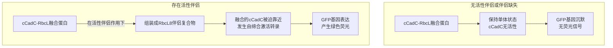
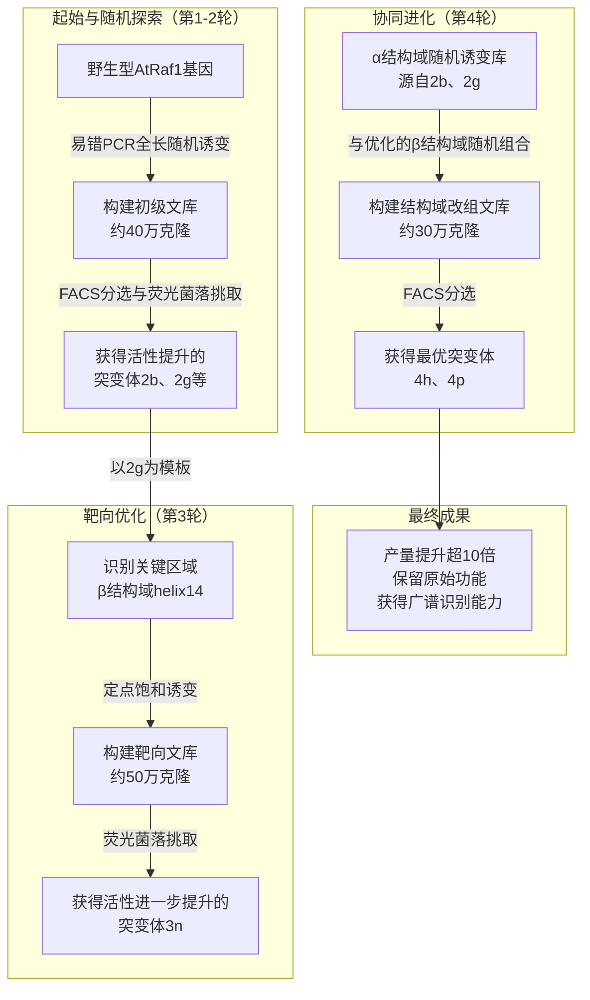

# "魔改"光合作用引擎的"扳手"：用定向进化打破Rubisco伴侣的物种壁垒

## 本文信息

  - **标题**: 定向进化一种具有改变底物识别能力的植物Rubisco分子伴侣
  - **作者**: Siyu Li, ByungUk Lee, Yichong Lao, Sirawit Lertwiriyapiti, Xuhui Huang, and Tina Wang
  - **发表时间**: 2025年9月11日
  - **单位**: 威斯康星大学麦迪逊分校生物化学系、化学系、生物物理学研究生项目、理论化学研究所 (美国)

-----

## 摘要

> 提高卡尔文循环关键酶——核酮糖-1,5-二磷酸羧化酶/加氧酶（Rubisco）的效率，有望显著提升作物产量。然而，在高等植物中，介导Rubisco组装的分子伴侣（chaperone）对其天然识别的Rubisco具有高度特异性，这为Rubisco的蛋白质工程改造和异源Rubisco的转基因表达设置了巨大障碍。本文旨在探索是否能通过**定向进化**技术，对植物Rubisco伴侣进行“重新编程”，使其能够识别并组装非天然的底物。研究人员为此开发了一种高通量的筛选策略，用于快速评估Rubisco组装因子的活性，并利用该方法筛选了来自**拟南芥的分子伴侣Raf1（AtRaf1）的突变体库，目标是使其能够组装烟草（*Nicotiana tabacum*）的Rubisco——野生型AtRaf1对此几乎没有活性。结果表明，定向进化成功获得了能够显著提升烟草Rubisco组装效率**的AtRaf1突变体。功能评估显示，这些进化后的AtRaf1不仅保留了组装其天然底物（拟南芥Rubisco）的能力，还能组装其他未经进化筛选的双子叶植物Rubisco，展现出**更广泛的底物识别能力**。这项工作为解决分子伴侣特异性对Rubisco改造带来的限制提供了一种有效策略，为未来改良植物光合作用开辟了新途径。

-----

## 背景

在自然界中，Rubisco是催化卡尔文循环第一步、将大气中CO₂固定为生物质的核心酶。然而，它存在两个致命弱点：催化速度缓慢，且容易与O₂反应产生有毒副产物，后者需要通过消耗能量的光呼吸途径进行补救。因此，**Rubisco被普遍认为是光合作用的瓶颈**，也是提升农业产量的关键改造靶点。科学家们一直试图通过两种途径改良Rubisco：一是直接对其进行蛋白质工程改造，创造出性能更优的突变体；二是在作物中表达来自其他物种（如蓝藻）的、催化效率更高的Rubisco同源物。然而，这些努力至今收效甚微。

造成这一困境的一个核心原因是**Rubisco的生物合成过程极其复杂**。植物中的Rubisco由8个大亚基（RbcL）和8个小亚基（RbcS）组成，其正确的折叠与组装需要多达七种不同的辅助蛋白（分子伴侣）协同作用。这个过程就像一条精密的“生产线”，每一步都需要特定的“工人”（分子伴侣）来完成。

这条“生产线”最大的问题在于其**高度的物种特异性**，即所谓的**“分子伴侣选择性”**。来自A植物的分子伴侣往往无法识别并组装来自B植物的Rubisco RbcL亚基，即便两者序列相似度高达94%。例如，将拟南芥的RbcL引入烟草中，最终组装成的Rubisco量会下降四倍，其原因之一就是烟草的Raf1伴侣无法有效识别拟南芥的RbcL。这种“不兼容”现象为所有旨在改变RbcL序列的工程（无论是突变还是替换）都设置了几乎无法逾越的障碍。因此，找到一种方法来“说服”或“改造”宿主的分子伴侣，使其能够接纳并组装外来的、性能更优的Rubisco，成为该领域亟待解决的瓶颈问题。

## 关键科学问题

本研究的核心科学问题是：**我们能否利用强大的蛋白质工程工具——定向进化，来打破植物Rubisco分子伴侣严格的物种特异性，使其“学会”识别并组装一种它原本不认识的、来自外源物种的Rubisco？**

为了回答这个问题，研究必须解决一个关键的技术挑战：定向进化需要对数以万计的蛋白质突变体进行快速筛选，而传统的Rubisco组装活性检测方法（如电泳、色谱）通量极低，无法满足需求。因此，本研究的首要任务是**开发一种能够将Rubisco伴侣活性与易于检测的信号（如荧光）相关联的高通量筛选方法**。

## 创新点

  - **方法学突破**：首创了一种**将Rubisco组装中间体的形成与荧光蛋白（GFP）表达相偶联的遗传学筛选系统**。该系统巧妙地利用一个依赖寡聚化激活的转录因子，首次实现了对植物Rubisco伴侣活性的高通量检测，为定向进化研究铺平了道路。
  - **成功重编程伴侣蛋白**：通过四轮定向进化，成功将拟南芥的分子伴侣AtRaf1改造为能够高效组装烟草Rubisco的突变体。与几乎无活性的野生型相比，**最优突变体（4p）使烟草Rubisco的组装产量提升了超过10倍**。
  - **功能拓展而非替换**：进化后的AtRaf1突变体不仅获得了组装新底物（烟草Rubisco）的能力，同时**基本保留了其组装天然底物（拟南芥Rubisco）的原始功能**，实现了“一专多能”。
  - **获得广谱识别能力**：进化筛选过程不仅达成了特定目标，还意外地使AtRaf1获得了**更广泛的底物识别能力（broadened promiscuity）**，对多种未经筛选的双子叶植物Rubisco表现出比野生型更强的组装活性。

-----

## 研究内容

### 核心方法：构建“伴侣活性”的荧光报告系统

为了实现对分子伴侣活性的高通量筛选，研究人员设计了一套精妙的遗传学报告系统。

**图1：(A) 植物Rubisco在分子伴侣介导下的生物合成通路。(B) 利用依赖寡聚化的转录因子cCadC检测Rubisco伴侣活性的策略示意图。**

该系统的核心思想是：植物Rubisco的组装会经过一个包含8个RbcL亚基的八聚体中间体（$RbcL_8$）。研究人员将RbcL与一个名为cCadC的转录因子进行融合。cCadC自身是无活性的单体，但当多个cCadC分子被拉近时，它们会发生自缔合，从而激活下游的报告基因（GFP）的转录。

**图2：cCadC-AtRbcL活性与未融合的拟南芥Rubisco组装情况的比较。(A) cCadC-RbcL植物Rubisco伴侣活性传感器的遗传元件图。(B) cCadC-AtRbcL融合蛋白与所有七种拟南芥Rubisco组装因子（“all”）或缺少其中一种伴侣共表达时，GFP的表达激活情况。“BSD2 mut”指W108A/L109E双突变体。左Y轴：三次重复的GFP荧光平均值及标准差；右Y轴：相同重复的细胞密度（OD₆₀₀）的散点图。(C) 在(B)中测试的相同组装因子组合下，通过天然PAGE凝胶电泳检测未融合的拟南芥Rubisco的组装情况。**

通过实验验证，该系统非常可靠。当所有关键的拟南芥组装伴侣都存在时，表达拟南芥cCadC-RbcL的细胞会发出强烈的绿色荧光。而一旦移除关键伴侣如Raf1、Raf2或BSD2，荧光信号便会急剧下降。这一结果与传统的天然PAGE电泳分析（图2C）完全吻合，证明了**荧光信号的强度可以准确反映Rubisco的组装效率**。更重要的是，该系统对伴侣的物种特异性也很敏感：拟南芥的伴侣系统无法点亮烟草的cCadC-RbcL。至此，一个强大的定向进化筛选工具诞生了。

### 结果与分析

#### 定向进化总体策略

研究人员通过一个多轮、递进的定向进化策略，逐步提升了AtRaf1对烟草Rubisco（NtRbcL）的组装能力。

#### 第一、二轮进化：随机诱变与初步筛选

**图3：筛选AtRaf1随机诱变文库以提高其组装NtRbcL的能力。(A) AtRaf1二聚体与S. elongatus PCC 6301 Rubisco结合的冷冻电镜结构。(B) 定向进化策略概览。(C) 经过两轮定向进化后，在AtRaf1突变体中观察到的突变。(D) AtRaf1突变体激活cCadC-NtRbcL的能力。(E) 筛选出的AtRaf1突变体促进未融合烟草Rubisco组装的能力。**

研究人员首先对AtRaf1全基因进行随机诱变，构建了一个包含约40万个突变体的随机文库。利用新建立的荧光筛选系统和流式细胞分选技术（FACS），他们从文库中筛选出了能够微弱“点亮”烟草cCadC-RbcL的细胞。经过两轮“诱变-筛选”循环后，获得了16个活性显著提升的突变株（2a-p）。

  * **突变分布**：测序显示，突变广泛分布于AtRaf1的α结构域、β结构域以及连接两者的柔性接头中。
  * **活性验证**：这些突变体不仅在荧光测试中表现优异（图3D），在传统的天然PAGE凝胶分析中也显示出比野生型AtRaf1更强的烟草Rubisco组装能力，最强者活性提升约4倍（图3E）。
  * **“假阳性”问题**：一个有趣的现象是，部分突变体（如2j, 2l, 2m）能产生极高的荧光信号，但实际组装完整Rubisco的效率提升有限。这可能是因为这些突变增强了AtRaf1与RbcL八聚体中间体的结合，但却不利于后续小亚基（RbcS）的结合与释放，从而卡在了中间步骤。

##### 分子动力学模拟揭示“假阳性”机制

**图S8：E314K/E336K突变的分子动力学模拟。(a) 野生型（wt）和2j突变型AtRaf1 β结构域中，E/K336-R343和E/K314-R343残基对之间距离随时间的变化。(b) 各结构中残基相互作用的细节视图。(c) 三种AtRaf1β构象的结构比对。(d) 各系统中残基对的平均距离。**

为了探究“假阳性”突变体（如含有E314K/E336K突变的2j）的机制，研究人员进行了分子动力学（MD）模拟。

  * **破坏关键相互作用**：模拟显示，在野生型AtRaf1β二聚体中，E314和E336分别与R343形成稳定的分子内和分子间盐桥，平均距离仅为 $5.5 \pm 0.4$ Å 和 $4.8 \pm 0.2$ Å。而在2j突变体中，E变为K后，这些盐桥被破坏，导致K314-R343和K336-R343的平均距离显著增加至 $15.2 \pm 1.3$ Å 和 $7.1 \pm 0.7$ Å，这使得AtRaf1β结构域变得更加灵活。
  * **模拟结合状态**：有趣的是，通过与已解析的AtRaf1结合RbcL的冷冻电镜（Cryo-EM）结构（PDB: 8IOJ）对比发现，野生型AtRaf1在结合RbcL后，其E336-R343的距离会从4.8 Å增加到8.9 Å。
  * **核心假说**：这表明，**E314K/E336K突变可能通过破坏内部盐桥，使AtRaf1预先采纳了一种类似于“已结合RbcL”的构象**。这种“预激活”状态有利于形成$RbcL_8$中间体（导致高荧光），但这种非自然的构象可能过度稳定，反而阻碍了后续小亚基（RbcS）的正确进入和伴侣的解离，最终导致了“假阳性”现象。

#### 第三轮进化：靶向关键区域的饱和诱变

**图4：Raf1 β结构域螺旋14的定点饱和诱变。(A) AtRbcL和NtRbcL上邻近Raf1β螺旋14区域的序列比较，差异以红色标出。AtRaf1β螺旋14中被选择进行定点饱和诱变的残基以紫色显示。(B) 筛选出的AtRaf1β螺旋14突变体中观察到的突变。(C) 筛选出的螺旋14突变体的序列标识图。(D) 螺旋14突变体促进未融合烟草Rubisco组装的能力。**

在第二轮的突变体中，2b的N351Y突变位于Raf1 β结构域的第14号螺旋（helix 14），该区域正好与RbcL上一个在拟南芥和烟草间存在序列差异的区域相互作用（图4A）。研究人员对该螺旋上的五个氨基酸进行了“饱和诱变”。通过筛选，他们再次获得了一批活性增强的突变体，其中**突变株3n**在促进烟草Rubisco组装方面比其亲本2g提升了约3倍。

#### 第四轮进化：结构域改组与功能优化

**图5：第四轮定向进化。(A) AtRaf1突变体文库的克隆策略。(B) 第四轮筛选后在AtRaf1突变体中观察到的突变。(C) AtRaf1突变体促进未融合烟草Rubisco组装的能力。(D, E) 在进化株4p中发现的突变（粉色棒状）在AtRaf1二聚体（蓝绿色）与S. elongatus Rubisco（灰色表面）结合的冷冻电镜结构上的位置。(F) AtRaf1突变体4p中单个突变逆转后对未融合烟草Rubisco组装的影响。**

为避免β结构域突变可能导致的“假阳性”问题，并整合前几轮的有效突变，研究人员采取了“结构域改组”策略。他们只对优良突变体的α结构域进行新一轮的随机诱变，然后将其与前几轮中最好的β结构域进行随机组合。经过最终筛选，获得了迄今为止性能最强的突变体，**包括4h和4p**。

  * **突变分析**：将4p中的突变位点标在三维结构上发现，大部分突变都位于Raf1与RbcL的结合界面上，直接参与了相互作用的调控（图5D, E）。
  * **协同效应**：将4p中的突变逐一恢复为野生型，发现没有任何一个单点回复会完全消除其活性（图5F）。这表明，**活性的巨大提升是多个突变协同作用、共同累积微小优势的结果**。

#### 最终成果：进化伴侣的功能表征

**图6：进化后的AtRaf1突变体对双子叶植物Rubisco同源物的活性。(A) 野生型和进化型AtRaf1/NtRaf1组装未融合烟草Rubisco的能力比较。(B) 本图中测试的双子叶植物的系统发育关系。(C) 组装未融合拟南芥Rubisco的能力比较。(D) 组装来自不同双子叶植物物种的未融合Rubisco的能力比较。**

最后，研究人员对几轮进化中得到的最佳突变体（2b, 2g, 3n, 4h, 4p）进行了全面功能表征。

  * **高效组装烟草Rubisco**：与几乎没有活性的野生型AtRaf1相比，所有进化突变体都能组装烟草Rubisco，其中3n, 4h和4p活性最强（图6A）。通过小规模亲和纯化定量（Table S1），**最优突变体产生的烟草Rubisco产量（例如4h为15 µg）比野生型（0.026 µg）提高了数十倍，至少是10倍以上的提升**。
  * **保留原始功能**：在测试组装其天然底物——拟南芥Rubisco时，除2g外，所有进化突变体的效率都与野生型AtRaf1相当（图6C）。这说明它们在获得新功能的同时，没有丢失原有功能。
  * **获得广谱识别能力**：研究人员进一步测试了这些进化伴侣组装其它双子叶植物（马铃薯、大豆、棉花等）Rubisco的能力（图6D）。结果显示，**相比于野生型AtRaf1，进化后的伴侣（特别是4p）对大豆和蒺藜苜蓿的Rubisco表现出更强的组装能力**。这意味着，针对烟草Rubisco的定向进化，意外地赋予了AtRaf1一种更广泛的、跨物种的底物识别能力。

-----

## Q&A

  - **Q1**: 既然目标是组装烟草的Rubisco，为什么不直接从烟草自己的分子伴侣（NtRaf1）出发进行改造，而是选择从一个几乎没活性的拟南芥伴侣（AtRaf1）开始？

  - **A1**: 这是一个非常好的策略性问题。研究的根本目的并不仅仅是为了获得一个能组装烟草Rubisco的伴侣，而是为了回答一个更基本、更重要的问题：**分子伴侣的底物特异性是否是“可塑的”？我们能否通过工程手段，教会一个伴侣去识别一个全新的底物？** 从一个几乎没有活性的“白板”（AtRaf1对NtRbcL）出发，更能证明定向进化这一方法的强大和原理的可行性。此外，从长远应用看，科学家们更希望获得一个具有广泛适用性的“万能”伴侣，能够在一个模式植物（如拟南芥）中组装来自各种不同物种的高效Rubisco。因此，将拟南芥自身的伴侣改造得更具“包容性”，比单纯优化一个已具备特异性的烟草伴侣更具普遍意义和挑战性。

  - **Q2**: 研究中提到的β结构域突变可能导致的“假阳性”问题，其背后的分子机制是什么？

  - **A2**: 这个问题的核心在于伴侣蛋白作用的动态平衡。MD模拟结果（图S8）为我们提供了很好的线索。在野生型AtRaf1中，β结构域通过内部的盐桥（如E314-R343, E336-R343）维持着一个相对稳定的构象。而“假阳性”突变（如E314K/E336K）破坏了这些盐桥，使β结构域变得异常灵活。研究者推测，这种高度灵活的构象可能**模仿了**伴侣蛋白结合底物RbcL后的“激活”状态。这种“预激活”构象能高效地捕捉RbcL并形成$RbcL_8$中间体，从而产生强烈的GFP荧光信号。然而，这个过度稳定或构象异常的中间复合物可能难以进行下一步——即被小亚基RbcS取代并顺利解离。这就好比一个工人能很快地抓住零件，但因为抓得太紧或姿势不对，导致零件无法安装到下一个工位，整个“生产线”因此中断。

  - **Q3**: 最优突变体4p的活性提升是多个突变协同作用的结果，这对于蛋白质工程有什么启示？

  - **A3**: 这一发现（图5F）体现了定向进化的强大之处。它告诉我们，蛋白质功能的巨大改变，未必依赖于某个单一的、颠覆性的“关键突变”。更多时候，它是由多个微小、分散的突变累积起来的协同效应。这些突变的单独作用可能微不足道，但组合在一起就能产生质变。这对于理性设计蛋白质是一个重要的启示：我们很难预测并同时设计多个协同作用的突变，而定向进化通过模拟自然选择，能够探索广阔的序列空间，自动找出这些复杂的、非线性的解决方案。

  - **Q4**: 进化后的伴侣获得了“广谱识别能力”，这对于作物工程总是好事吗？

  - **A4**: 在当前背景下，这通常被认为是一个非常理想的特性。野生型伴侣的高度特异性是当前Rubisco工程的巨大障碍。一个广谱的伴侣蛋白就像一把“万能扳手”，理论上可以用来组装来自多种不同物种的高效Rubisco，大大增加了我们在作物中进行异源表达的选择范围，而无需为每一种新的Rubisco都重新进化一套伴侣。然而，从长远生物学角度看，过度“滥情”的伴侣也可能存在潜在风险，比如在细胞内错误地与其他蛋白相互作用，产生非预期的副作用。因此，理想的工程伴侣应该是在保持高活性的同时，其“广谱性”仍被限定在一个安全和有效的功能范围内。

-----

## 关键结论与批判性总结

本研究成功地应用定向进化技术，“重编程”了植物Rubisco分子伴侣AtRaf1，使其能够识别并高效组装其原本不兼容的烟草Rubisco，且组装产量提升超过10倍。这项工作的核心突破在于开发了一种创新的、基于荧光报告基因的高通量筛选策略，首次将定向进化这一强大的蛋白质工程工具引入到复杂的植物Rubisco组装体系中。进化后的AtRaf1不仅获得了新功能，还保留了原有功能，并展现出更广泛的底物识别谱，为解决长期困扰Rubisco工程的“伴侣特异性”瓶颈问题提供了强有力的概念验证和实用工具。

  * **局限性1：体外模型系统**：所有实验均在**大肠杆菌模型系统**中进行。尽管该系统与植物体内的组装情况有较好的相关性，但最终仍需在真实的植物模型（如转基因烟草）中验证这些进化伴侣的功效。
  * **局限性2：活性未达顶峰**：尽管活性提升显著，但进化后AtRaf1组装烟草Rubisco的效率（最高约25%）仍未达到烟草自身伴侣NtRaf1的水平，表明其仍有进一步优化的空间。
  * **局限性3：筛选方法的改进**：研究中出现的“假阳性”问题提示，未来的筛选策略或许需要改进，例如增加一个直接与最终产物活性挂钩的次级筛选步骤，以确保筛选到的突变体能够高效完成整个组装流程。

> 小编锐评：
> 1. 定向进化的思路，靠多聚化来report，我不是做这个的，长见识了
> 2. 和MD模拟的关系不大，感觉就是提一个机制来回答审稿人疑问，需要进一步探究

