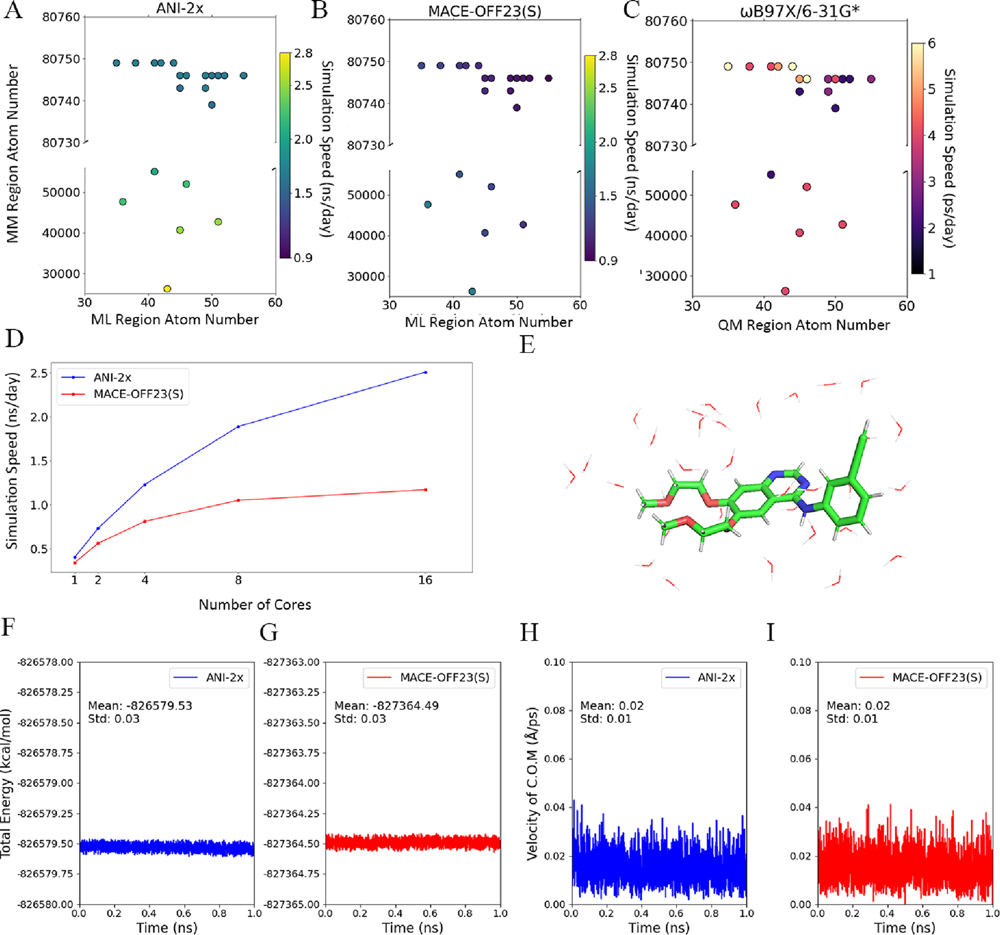
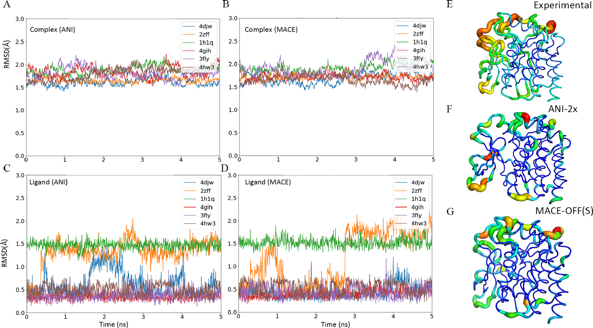
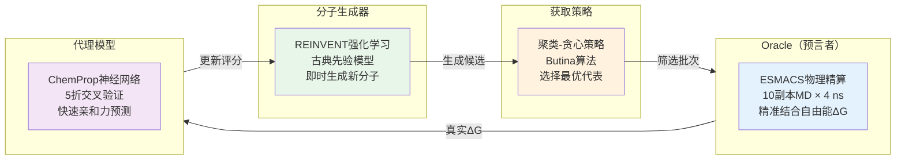
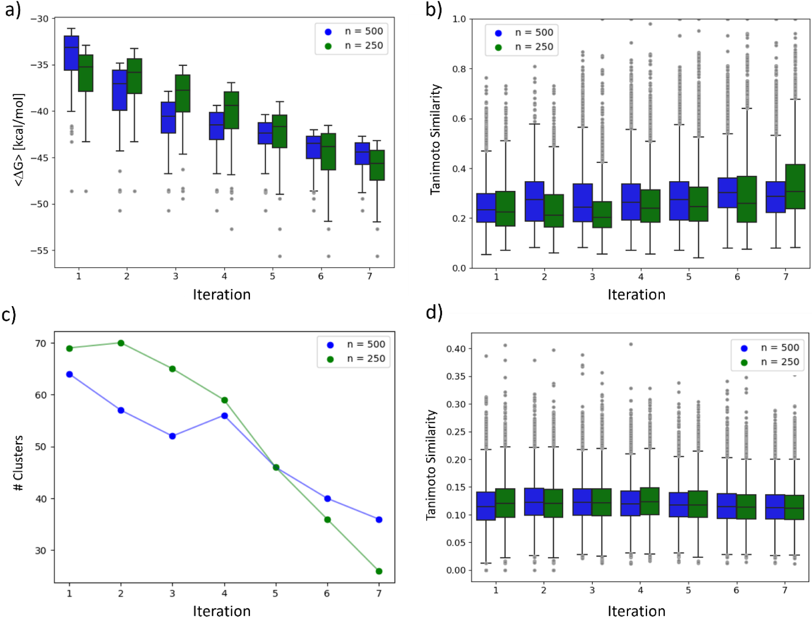
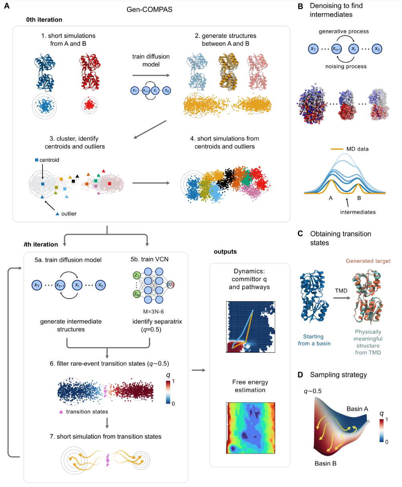
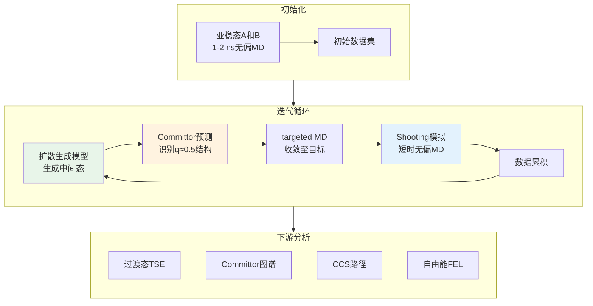
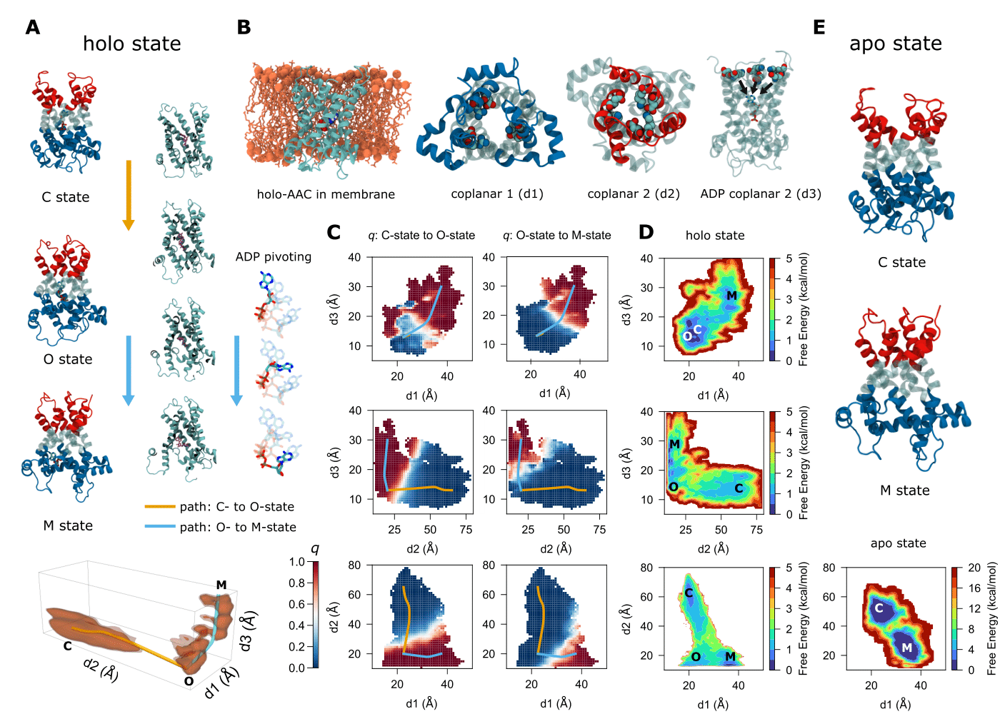

# 机器学习与物理模拟的协同：三项研究透视计算化学的方法学进展

## 引言

在计算化学和药物发现领域，机器学习与物理模拟的结合正在改变研究方式。本文综述三项近期发表的研究，它们从不同角度展示了这一融合策略：

1. **ML/MM混合势**：通过机器学习原子间势（MLIP）与分子力学（MM）结合，实现接近量子力学精度但快1000倍的自由能计算
2. **生成式主动学习（GAL）**：将强化学习驱动的分子生成器（REINVENT）与物理精算（ESMACS）整合，在超算上实现化学空间探索
3. **Gen-COMPAS框架**：融合扩散生成模型与committor理论，无需预定义集合变量即可将罕见事件采样效率提升350倍

这三项研究体现了一个共同特点：**机器学习提供计算加速，物理模拟保证结果可靠性，二者结合可显著提升研究效率**。

## 研究一：ML/MM混合势——量子精度遇见经典效率

### 文献信息
- 作者: Xujian Wang, Xiongwu Wu, Bernard R. Brooks, Junmei Wang
- 单位: 匹兹堡大学；美国国立卫生研究院
- Citation: *J. Chem. Theory Comput.* 2025, 21, 6979–6987
- 代码: https://github.com/ClickFF/MLMM4AMBER

### 方法学框架

#### ML/MM理论基础

ML/MM采用与QM/MM类似的力学嵌入方案，系统总能量划分为三个组成部分：

$$
E_{\text{total}} = E_{\text{ML}} + E_{\text{MM}} + E_{\text{ML-MM}}
$$

其中：
- $E_{\text{ML}}$：MLIP描述的配体或活性区域能量（包含成键和非键合相互作用）
- $E_{\text{MM}}$：MM力场描述的溶剂和蛋白其余部分能量
- $E_{\text{ML-MM}}$：两区域间的相互作用，通过库仑势和Lennard-Jones势描述：

$$
E_{\text{ML-MM}} = \sum_{i \in \text{MM}} \sum_{j \in \text{ML}} \left[\frac{q_i q_j}{r_{ij}} + \frac{A_{ij}}{r_{ij}^{12}} - \frac{B_{ij}}{r_{ij}^6}\right]
$$

#### 技术实现
- 使用LibTorch库实现高效的MLIP推理和力计算
- 采用**CPU-GPU异步工作流**：MD计算在CPU上执行，MLIP推理在GPU上并发运行
- 支持多种MLIP模型：ANI系列（ANI-1x、ANI-1ccx、ANI-2x）和MACE系列（MACE-OFF23 S/M/L）

**性能评估**：

| 方法 | 采样速度 | 加速倍数 |
|------|---------|---------|
| ANI-2x | 2+ ns/天 | 1000-2000× |
| MACE-OFF23(S) | 1.5 ns/天 | 约1000× |
| 传统QM/MM | <6 ps/天 | 基准 |

#### 重组能（Reorganization Energy）

传统热力学积分（TI）依赖对势能项的λ扰动，但MLIP的总能量不可分割——无法单独提取ML区域内的非键合项。

**解决方案**：引入**重组能**补偿ML区域内非键合相互作用扰动的缺失

$$
\Delta G_{\text{solvation}} = \sum_i w_i \left\langle \frac{\partial V_{\text{MM-ML,non-bonded}}}{\partial \lambda} \right\rangle_{\text{wat},i} + \Delta G_{\text{reorg}}
$$

其中重组能定义为：

$$
\Delta G_{\text{reorg}} = \langle E_{\text{ML}} \rangle_{\text{wat}} - \langle E_{\text{ML}} \rangle_{\text{gas}}
$$

**物理意义**：
1. 只对MM-ML之间的相互作用进行λ扰动（可明确计算）
2. ML区域内部不进行λ扰动（保持完整性）
3. 重组能补偿由于环境变化导致的构象重组能量差

### 关键结果

#### 性能验证

**图1：ML/MM工作流程与性能对比**
- （a）CPU-GPU异步架构，GPU并行处理MLIP推理
- （b）不同MLIP模型的采样速度，ANI-2x达到2.4 ns/天
- （c）QM/MM vs ML/MM采样效率对比

**稳定性验证**（NVE系综模拟水中erlotinib）：

| 守恒量 | ML/MM表现 | QM/MM参考 |
|--------|----------|----------|
| 总能量标准差 | 0.03 kcal/mol | 0.02 kcal/mol |
| 质心速度 | <0.02 | - |
| 平动/转动能量 | <0.15 kcal/mol | - |

#### 自由能计算精度

**水化自由能验证**（30个有机小分子）：

| 方法 | MAE (kcal/mol) |
|------|----------------|
| ANI-2x | **0.45** |
| MACE-OFF23(S) | **0.59** |
| CGenFF | 0.96 |
| GAFF | 0.80 |

**蛋白-配体模拟改进**（CDK2与19种配体的MM-PBSA，好了那么一点点吧）：

| 采样方法 | RMSE (kcal/mol) | R² |
|---------|----------------|-----|
| 传统MD | 0.68 | 0.54 |
| **MACE-OFF23(S)** | **0.65** | **0.59** |

**B因子验证**：
- 大多数蛋白-配体复合物的计算B因子与实验值Pearson相关系数**大于0.5**
- ML/MM在超过5纳秒的模拟中表现出色稳定性

**核心洞察**：ML/MM不仅提供更精确的能量，更重要的是**改善了构象采样质量**——这直接提升了依赖系综统计的终点法（如MM-PBSA）的预测能力。

**图3：CDK2-配体复合物的B因子验证**。ML/MM模拟计算的B因子（蓝色）与实验X-ray数据（橙色）高度一致，多数复合物Pearson相关系数>0.5，证明ML/MM能准确捕获蛋白-配体动力学特征。

### 局限性

- **力场一致性问题**：ML势函数与MM力场的训练目标不同，界面处可能存在系统偏差，需更精细的混合策略
- **拓扑变化限制**：当前框架难以处理相对结合自由能（RBFE）所需的配体拓扑变换，仅适用于绝对自由能计算
- **计算资源依赖**：仍需GPU加速，对硬件有一定要求

## 研究二：生成式主动学习——超算驱动的化学空间探索

### 文献信息
- 作者: Hannes H. Loeffler, Shunzhou Wan, Marco Klähn, Agastya P. Bhati, Peter V. Coveney
- 单位: AstraZeneca（瑞典）；伦敦大学学院（英国）
- Citation: *J. Chem. Theory Comput.* 2024, 20, 8308–8328

### 方法学框架

该研究建立的**GAL循环**由四个关键组件组成：

**工作逻辑**：每一轮GAL包括：
1. **ESMACS评估**：对当前批次化合物进行10副本MD模拟（4 ns/副本），每个化合物约5分钟墙钟时间，计算精准结合自由能
2. **代理模型更新**：用真实ΔG数据训练ChemProp神经网络（5折交叉验证，5个集成模型），建立SMILES到亲和力的映射
3. **强化学习生成**：REINVENT基于更新的评分函数生成新化合物（300-500次RL迭代），每轮产生100-1000个候选分子
4. **聚类与筛选**：使用Butina算法（Tanimoto相似度>0.5）聚类，避免化学冗余，每簇选评分最优分子
5. **循环迭代**：将筛选后的批次（n=100-1000个分子）提交给Oracle进行下一轮物理精算

**计算资源**：

| 项目 | 配置 |
|------|------|
| 平台 | 艾字节级超算Frontier |
| 单次迭代墙钟时间 | 50分钟（数百化合物） |
| 总计算量 | 约2毫秒 |

### 两个靶点的对比实验

| 特征 | 3CLpro（开放型口袋） | TNKS2（封闭型口袋） |
|------|---------------------|---------------------|
| 初始模型 | 10,000个Docking化合物 | 27个实验同系物 |
| 测试批大小 | 250和500 | 100-1000 |
| 迭代轮数 | 7轮 | 4-5轮（快速收敛） |
| ΔG提升 | -30 → **-56 kcal/mol** | -35 → **-47 kcal/mol** |
| 代理模型质量 | Spearman: 0.1→**0.62** | Spearman>0.7, R²>0.6 |
| 最优批大小 | **n=250** | n=100或n≥500 |

**深层洞察**：靶点结构特征（开放vs封闭口袋）**直接决定**代理模型学习难度和GAL效率。封闭口袋建立了SMILES与3D结合姿态的清晰对应，使得1D描述符能有效预测3D亲和力。

### 物理精算的关键价值

**Docking vs. ESMACS相关性对比**：

| 方法 | Spearman相关系数 | 可靠性 |
|------|-----------------|--------|
| Docking评分 | 0.08 | 几乎无相关性 |
| ESMACS评分 | 0.33 | 中等相关 |

虽然ESMACS绝对精度有限，但其**相对排序能力**足以为强化学习提供高质量训练信号，避免虚假优化陷阱。这证明了物理计算在驱动高质量分子生成中的核心价值。

**图3：GAL在3CLpro靶点的优化轨迹**
- （a）各轮迭代的ΔG分布演化，批大小n=250
- （b）代理模型预测准确度（Spearman相关系数）随迭代提升
- （c）生成分子与种子库的Tanimoto相似度分布，后期生成高度新颖的化学结构

### 局限性

- **合成性盲区**：REINVENT生成的分子未经逆合成分析，可能包含合成困难或不可行的结构，需整合合成性评分
- **超算资源依赖**：50分钟/轮的效率基于艾字节级超算Frontier，对普通计算资源的可及性有限
- **Oracle噪声敏感**：代理模型质量依赖ESMACS的排序准确性，如果物理精算存在系统偏差会影响收敛

## 研究三：Gen-COMPAS——罕见事件模拟的生成式方法

### 文献信息
- 作者: Chenyu Tang, Mayank Prakash Pandey, Cheng Giuseppe Chen, Alberto Megías, François Dehez, Christophe Chipot
- 单位: 法国洛林大学；西班牙马德里理工大学；美国芝加哥大学；美国伊利诺伊大学香槟分校
- Citation: *arXiv* 2025, 2510.24979v1（预印本）

### 方法学框架

**图1：Gen-COMPAS整体框架**
- （A）整体框架流程
- （B）去噪扩散模型训练与推理寻找中间态
- （C）使用Targeted MD获得对应过渡态的物理合理结构
- （D）Gen-COMPAS在示意自由能景观中由committor (q)引导的两个亚稳态间的整体采样策略

**核心工作流程**

#### 方法学细节

**扩散生成模型（DDPM）**：
- **前向过程**：通过逐步添加高斯噪声将数据分布 $p_{\text{data}}(\mathbf{x})$ 转化为标准高斯分布 $\mathcal{N}(0, I)$
- **逆过程**：训练神经网络学习去噪步骤，从噪声中生成新样本
- **应用**：在蛋白质构象空间（Cartesian坐标）中训练，生成物理上合理的中间态构象，避免高能区域

**Committor函数学习**：
- **定义**：Committor $q(\mathbf{x})$ 是从构象 $\mathbf{x}$ 出发、在到达A之前先到达B的概率
- **物理意义**：$q = 0$ 对应A态，$q = 1$ 对应B态，$q = 0.5$ 的超曲面（separatrix）精确定义过渡态集合（TSE）
- **技术优势**：直接在笛卡尔空间用神经网络表示，无需预定义集合变量（CVs），自动识别最优反应坐标

**Targeted MD（TMD）**：
- **原理**：在原子坐标上施加简谐约束势 $V_{\text{bias}} = k(\mathbf{r} - \mathbf{r}_{\text{target}})^2$
- **功能**：引导系统从起始态（A或B）沿低能路径收敛至DDPM生成的目标构象
- **优点**：避免直接模拟高能垒跨越，快速生成separatrix附近的构象

**Shooting模拟**：
- **起点**：从separatrix附近的构象（committor预测 $q \approx 0.5$）出发
- **执行**：进行短时（纳秒级）无偏MD模拟，随机初始化速度
- **验证**：统计最终落入A态或B态的概率，验证committor预测准确性
- **数据积累**：成功的shooting轨迹加入训练集，迭代改进DDPM和committor模型

### 三个标志性案例

**案例1：Trp-cage蛋白折叠（20残基微型蛋白）**

| 指标 | Gen-COMPAS | 传统MD（DESRES） |
|------|-----------|----------------|
| 采样时间 | 594 ns | 208 μs |
| 效率提升 | **约350倍** | 基准 |
| 折叠机制 | **双路径分叉** | - |
| 自由能验证 | 定量一致 | 参考值 |

**发现**：折叠机制呈**双路径分叉**
- 路径1：早期α-螺旋成核 → 核心固化
- 路径2：疏水塌缩（Trp残基周围）→ 螺旋形成滞后

**案例2：RBP的binding-upon-folding过程**

**发现**：两种协同机制
- 路径1：分步诱导契合（induced-fit，配体结合先于蛋白闭合）
- 路径2：同步结合与折叠（simultaneous binding and folding）

**意义**：展示了**耦合过程的原子水平解析能力**，对本征无序蛋白和周质结合蛋白（PBP）研究具有普适价值

**案例3：线粒体AAC转运蛋白**

**重大发现**：首次明确证实**闭合中间态**（O-state）的存在

转运路径：**C-state → O-state → M-state**
- C-state：$\ce{ADP^3-}$在胞质侧结合
- **O-state**：$\ce{ADP^3-}$被完全包裹，与膜两侧隔绝（**必经检查点**）
- M-state：$\ce{ADP^3-}$释放到基质

**能垒对比**：

| 系统 | C→O能垒 | O→M能垒 | C→M能垒 |
|------|---------|---------|---------|
| Holo-AAC | **2.5 kcal/mol** | **2 kcal/mol** | - |
| Apo-AAC | - | - | **~10 kcal/mol** |

**生理意义**：O-state充当**防泄漏保障机制**，确保严格的1:1核苷酸交换，为理解线粒体疾病突变提供结构基础。

**图4：AAC线粒体ADP/ATP载体的过渡路径**
- （A）Holo-AAC（ADP³⁻结合）的三个亚稳态、过渡态及从C-state到M-state通过O-state的转运路径
- （B-D）构象转运路径C→O→M及其自由能盆地
- （E）Apo-AAC的两个亚稳态及其沿d1和d2投影的FEL

### 局限性

- **两态假设限制**：当前框架主要针对A↔B双态转变，对复杂多态网络（如蛋白折叠多路径）的扩展需进一步验证
- **迭代收敛判据**：缺乏自动化的收敛诊断工具，需依赖人工判断何时停止迭代
- **计算成本分布不均**：虽然总采样时间大幅降低，但每轮迭代的DDPM训练和committor学习仍需可观的GPU时间

### 与现有方法的根本差异

| 特性 | 传统增强采样 | 纯生成模型 | **Gen-COMPAS** |
|------|------------|-----------|--------------|
| 需要预定义CVs | ✓ | ✗ | **✗** |
| 训练数据需求 | 中等 | 极大（ms级） | **极小（ns级）** |
| 物理严格性 | 高（可能有偏） | 低（潜空间） | **高（无偏MD）** |
| 采样效率 | 低-中 | 高（训练后） | **高** |
| 动力学信息 | 有限 | 近似 | **精确（committor）** |
| 异质体系 | ✓ | ✗（多数） | **✓** |

## 三项研究的协同洞察

### 共同主题：物理约束下的AI加速

三项研究虽然应用场景不同，但共享一个核心哲学：**AI的价值不在于替代物理计算，而在于智能引导物理计算的方向和范围**。

- **ML/MM**：MLIP加速QM/MM，但保留MM描述溶剂；TI框架保持热力学循环封闭性
- **GAL**：REINVENT生成候选，但ESMACS物理精算提供真实ΔG训练信号
- **Gen-COMPAS**：扩散模型生成中间态，但shooting模拟基于无偏MD验证动力学

### 效率提升的量化对比

| 方法 | 传统方法 | 新方法 | 加速 |
|------|---------|--------|------|
| ML/MM TI | QM/MM: 6 ps/天 | ML/MM: 2 ns/天 | 约1000倍 |
| GAL | 数月DMTA循环 | 3-7次迭代收敛 | 数十倍 |
| Gen-COMPAS | 暴力MD: 208 μs | 594 ns采样 | 约350倍 |

### 方法学互补性

这三项研究可以形成**完整的药物发现-分子设计工作流**：

1. **GAL阶段**：在化学空间中快速识别高亲和力先导化合物
2. **ML/MM阶段**：对GAL发现的候选分子进行精确结合自由能排序和构象采样
3. **Gen-COMPAS阶段**：解析关键配体-蛋白相互作用的动力学机制，指导结构优化

