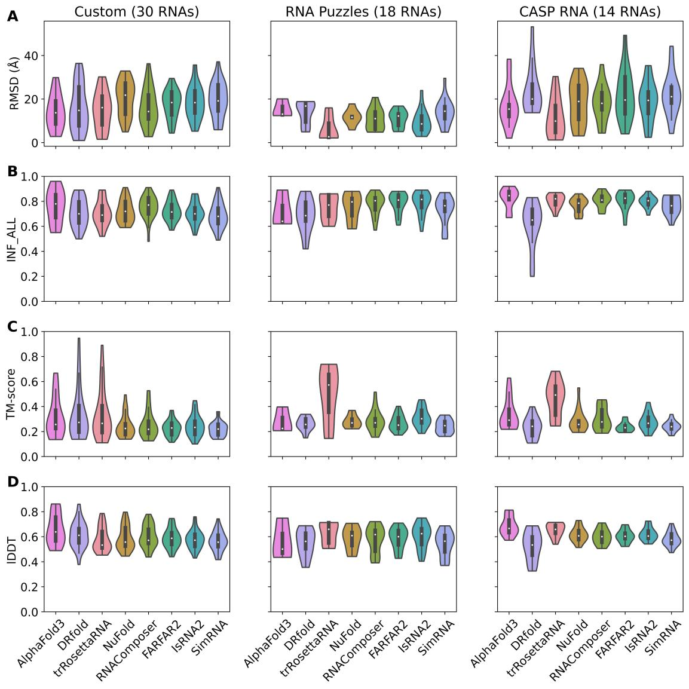
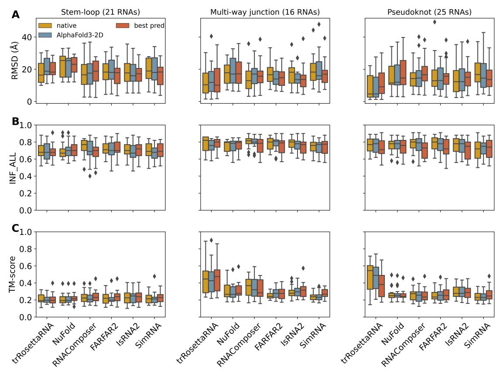
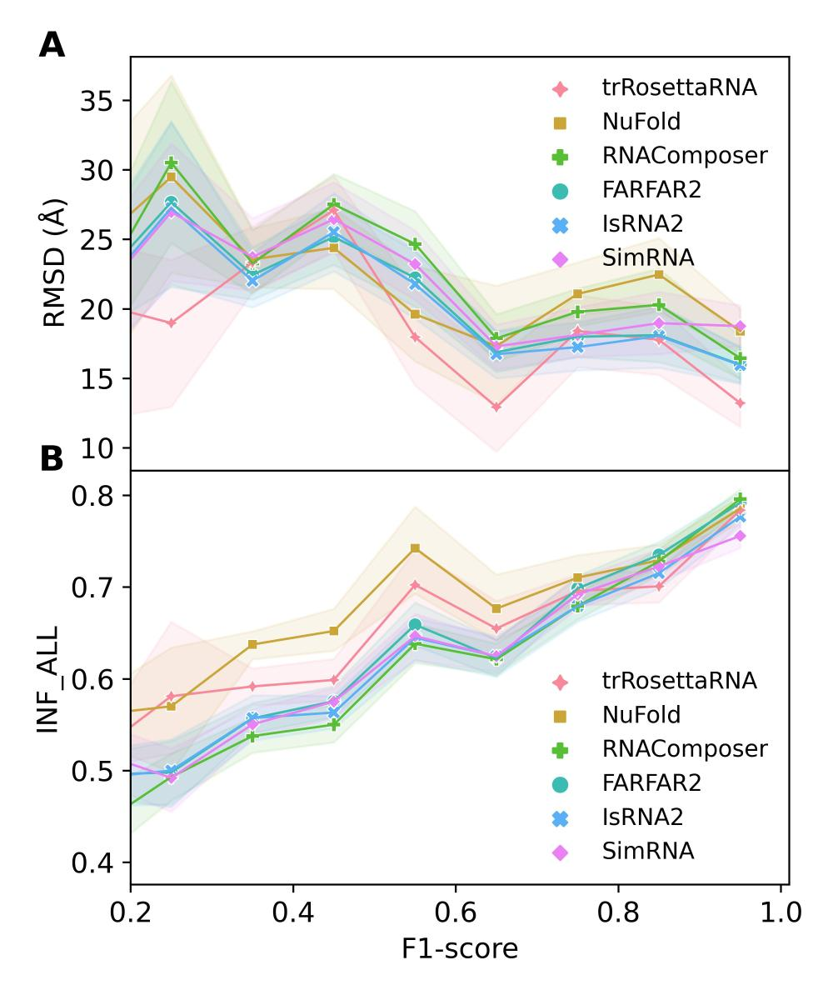
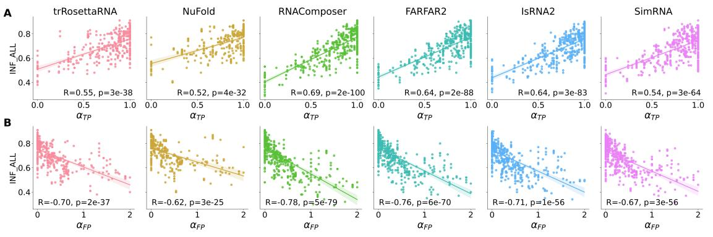
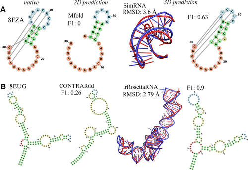
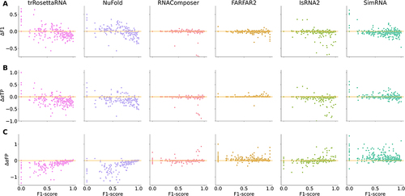
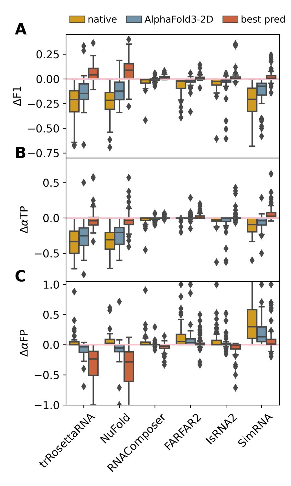

# 当三维预测违抗二级输入：RNA结构建模的意外发现

> 帮师兄们宣传一下~

## 本文信息

- **标题**：RNA二级结构与三维结构预测的相互作用：一项全面研究
- **作者**：Deyin Wang, Yangwei Jiang, Linli He, Linxi Zhang, Ruhong Zhou, Dong Zhang
- **在线发布时间**：2026年4月1日（accepted author version posted online）
- **单位**：浙江大学定量生物学研究所、物理学院、生命科学学院；温州大学物理系；国家生物药技术创新中心（苏州）
- **引用格式**：Wang, D., Jiang, Y., He, L., Zhang, L., Zhou, R., & Zhang, D. (2026). Crosstalk between RNA secondary and three-dimensional structure prediction: a comprehensive study. *RNA Biology*. https://doi.org/10.1080/15476286.2026.2655096
- **结果数据**：预测结果可在 https://github.com/DongZhangRNA/2D-and-3D-benchmark 获取

## 摘要

> 近年来，各种计算方法被开发用于预测RNA的三维（3D）结构。由于RNA具有**层级折叠**特性，RNA二级（2D）结构常被用作三维结构预测的输入以提高准确性和效率。然而，**输入二级结构的准确性在多大程度上影响三维结构预测的性能**仍有待进一步研究。此外，在三维结构建模过程中，**输入的碱基配对相互作用是否以及如何被修改**是另一个值得探索的问题。为解决这些问题，本研究在大量数据集上**全面基准测试了六个代表性的三维结构预测模型**，使用不同准确性的二级结构作为输入。结果表明，**RNA二级和三维结构预测之间存在普遍的相互作用**，其中三维结构预测性能对输入二级结构准确性的依赖性与三维模型在结构建模过程中修改输入碱基配对相互作用的能力密切相关。此外，我们还观察到，**RNA三维结构预测性能对输入二级结构中假阳性碱基对的出现比对真阳性碱基对更为敏感**，这为进一步提高模型性能指明了有价值的研究方向。

### 核心结论

- **trRosettaRNA在RNA-Puzzles和CASP RNA数据集上表现最佳**：在使用天然二级结构作为输入时，trRosettaRNA几乎在所有指标上都排名第一
- **三维模型普遍具有修改输入二级结构的能力**：即使在输入二级结构的真阳性碱基对为零时，大多数模型仍能产生非零的INF_ALL值
- **假阳性碱基对的危害更大**：三维结构预测性能对假阳性碱基对的敏感性高于真阳性碱基对
- **深度学习方法具有更强的二级结构修改能力**：trRosettaRNA和NuFold能够更显著地修改输入的碱基配对相互作用
- **模板方法高度依赖输入二级结构准确性**：RNAComposer修改输入碱基配对相互作用的能力很弱，因此其性能严重依赖于输入二级结构的准确性

## 背景

**RNA（核糖核酸）是生物体内重要的功能大分子**。大多数RNA分子采用的特定三维结构对其生物功能至关重要。然而，确定RNA的实际三维结构通常需要昂贵且耗时的实验技术（如X射线晶体学和核磁共振）。因此，在过去三十年中，**RNA三维结构预测的计算机程序应运而生**。

当前的RNA三维结构预测方法主要分为三类：

#### 表1：RNA三维结构预测方法分类

| 方法类型 | 原理 | 代表性方法 | 特点 |
| --- | --- | --- | --- |
| **模板方法** | 基于已知结构/片段作为模板 | 3dRNA, ModeRNA, RNAComposer, Vfold3D, FARFAR2 | 搜索具有相似序列或结构特征的模板来建模目标分子的三维结构 |
| **从头方法** | 基于物理化学原理从零开始预测 | HiRE-RNA, IsRNA, iFoldRNA, SimRNA | 利用物理和化学原理采样构象空间，预测目标分子的最稳定/可能构象 |
| **深度学习方法** | 基于深度学习 | DRfold, RhoFold+, RoseTTAFoldNA, trRosettaRNA, NuFold, GraphaRNA | 受蛋白质结构预测成功的启发，近年来快速发展 |

然而，**与蛋白质结构预测相比，这些基于深度学习的方法在RNA上的表现要差得多**，表明RNA三维结构预测仍然具有挑战性。

### RNA-Puzzles和CASP15的启示

**RNA-Puzzles**是一项集体性盲测实验，旨在评估RNA结构预测技术的前沿。其结果强调，计算方法已经能够为生物学问题提供有用的结构信息，但对**非Watson-Crick相互作用**的预测不佳表明算法需要进一步改进。

2022年，**12个实验RNA靶标首次被引入CASP15**。两项独立评估都将四种传统方法（基于模板或从头方法）排名为顶级预测器，而基于深度学习的方法表现明显低于这些顶级小组。特别是，对于**缺乏同源RNA序列和结构的合成RNA靶标**，其精确的三维结构建模需要人类专家的大量干预。

### 关键科学问题

本研究旨在解决以下核心科学问题：

1. **输入二级结构的准确性如何影响三维结构预测的性能**？当前二级结构预测工具的准确性通常有限（在包含不同RNA序列的数据集上，几乎所有测试模型的平均F1分数都小于0.8），这些不完美的二级结构输入如何影响三维结构预测方法？
2. **三维建模过程中是否以及如何修改输入的碱基配对相互作用**？三维结构预测模型能否纠正输入二级结构中的错误碱基配对？
3. **不同三维模型对输入二级结构准确性的依赖程度有何差异**？深度学习方法与传统方法在这一方面有何不同？
4. **假阳性碱基对和真阳性碱基对对三维结构预测的影响有何差异**？哪种类型的错误对预测性能的影响更大？

### 创新点

本研究的主要创新之处包括：

- **系统性的基准测试**：在包含62个RNA的三个数据集（Custom、RNA-Puzzles、CASP RNA）上系统评估了6个三维预测方法和6个二级结构预测工具的组合
- **系统研究2D-3D相互作用**：深入分析了三维结构预测过程中输入碱基配对相互作用的修改及其与预测性能的关系
- **揭示假阳性碱基对的特殊危害**：发现三维结构预测性能对假阳性碱基对的敏感性高于真阳性碱基对，为模型改进指明了方向
- **区分不同三维模型的二级结构修改能力**：揭示了深度学习方法（trRosettaRNA、NuFold）与传统方法（RNAComposer等）在修改输入二级结构能力上的显著差异

---

## 研究内容

### 方法学概述

研究在包含62个RNA的三个数据集上（Custom、RNA-Puzzles、CASP RNA）系统评估了六个RNA三维结构预测方法（trRosettaRNA、NuFold、RNAComposer、FARFAR2、IsRNA2、SimRNA）和六个二级结构预测工具的组合。详细的模型和数据集信息请参阅附录。

### 基于天然二级结构的基准测试结果

研究首先使用从实验结构使用**DSSR (v2.4)**提取的天然二级结构作为输入，探索了六个所选RNA三维模型的预测上限。

主要发现包括：
- 对于Custom数据集，**基于模板的模型RNAComposer**在RMSD指标上提供了最佳预测，而**FARFAR2**和**trRosettaRNA**分别在lDDT和TM-score指标上提供了最佳预测
- 对于RNA-Puzzles和CASP RNA数据集，**trRosettaRNA**在六个所选三维模型中几乎在所有指标上都提供了最佳预测
- **AlphaFold3**在Custom和CASP RNA数据集上的INF_ALL指标上表现领先，**DRfold**在Custom数据集的TM-score指标上表现领先
- **NuFold**在所有测试的数据集上都没有显示出相对于传统方法的优势

> 总体而言，尽管在使用天然二级结构作为输入时，不同RNA靶标的三维模型预测性能有所变化，但**传统方法（无人力参与）和最近的深度学习方法预测结果相当**，这与CASP15竞赛中的观察结果一致。

详细的性能数据请参阅附录C和附录D。

**图1：使用天然二级结构作为输入时，六个RNA三维结构预测方法在三个测试数据集上的性能表现**。图中展示了不同方法在RMSD、INF_ALL、TM-score和lDDT四个指标上的表现，每个指标的箱线图显示了中位数、四分位数和异常值。可以看出，trRosettaRNA在RNA-Puzzles和CASP RNA数据集上表现最佳。

### 基于不同模型预测二级结构的基准测试结果

现在考虑更一般的RNA三维结构预测方案：**使用预生成的二级结构作为输入来预测查询序列的可能三维构象**。研究测试了六个流行的二级结构预测工具来生成输入二级结构。

#### 二级结构预测工具的准确性

为便于后续分析，研究首先调查了不同二维模型的二级结构预测准确性。由于RNA结构预测准确性（包括二维和三维）通常取决于其结构拓扑，研究将上述三个测试数据集合并为Combined数据集，然后根据其天然结构信息重新分类为三类：茎环、多路连接和假结。

所有六个测试的二维工具都显示出**有限的预测准确性**，表明**准确的RNA二级结构预测仍然具有挑战性**。

**表3：不同二维模型预测的F1分数汇总**

| 模型 | 茎环（21个RNA） | 多路连接（16个RNA） | 假结（25个RNA） |
| --- | --- | --- | --- |
| **RNAfold** | 0.609 | 0.723 | 0.637 |
| **NUPACK** | 0.516 | 0.546 | 0.597 |
| **Mfold** | 0.640 | 0.749 | 0.641 |
| **RNAStructure** | 0.630 | 0.757 | 0.646 |
| **CONTRAfold** | 0.574 | 0.724 | 0.696 |
| **MXfold2** | 0.633 | 0.795 | 0.705 |
| **AlphaFold3** | 0.791 | 0.917 | 0.940 |

从表中可以看出，对于茎环、多路连接和假结，最佳的平均F1分数分别为0.640（Mfold）、0.795（MXfold2）和0.705（MXfold2）。

有趣的是，使用DSSR (v2.4)从**AlphaFold3**的RNA三维结构预测中提取的二级结构在所有三个结构类别中都显示出**显著更高的准确性**，特别是对于多路连接和假结（平均F1分数 > 0.9）。由于它们相对较高的准确性，AlphaFold3衍生的二级结构也被用作另一个基线输入（除了天然二级结构）。

#### 使用预测二级结构作为输入的三维预测性能

当使用预测的二级结构作为输入时，所选的三维模型在茎环上的表现相似，**除了NuFold表现明显较差**（详见附录中的性能表格）。

然而，对于多路连接和假结RNA，**trRosettaRNA明显优于其他模型**（详见附录中的性能表格）。

研究还注意到，**对茎环的三维结构预测略差于多路连接和假结**，即茎环的中位数RMSD值相对较大，尽管后两类通常在结构上更复杂。测试的茎环RNA中**未配对核苷酸的比例相对较高**可能解释了这一现象。

#### 预测二级结构vs天然二级结构

值得注意的是，对于几乎所有六个所选的三维模型，**使用预测的二级结构作为输入的RNA三维结构预测通常比基于天然二级结构的预测表现更差**，即前者通常具有较高的中位数RMSD、较低的中位数INF_ALL和TM-score值。

具体而言，对于**RNAComposer、IsRNA2和SimRNA**，在所有三个结构类别上，使用天然二级结构与预测二级结构作为输入之间的预测性能差异显著；而对于**FARFAR2和SimRNA**在茎环RNA上的差异不太明显。

然而，对于**trRosettaRNA、NuFold、FARFAR2、IsRNA2和SimRNA**在多路连接RNA上以及**SimRNA**在假结RNA上，以及**NuFold**在茎环RNA上，研究发现**使用预测二级结构作为输入的最佳三维预测优于基于天然二级结构的预测**。

对于从AlphaFold3预测衍生的二维输入（在图2中表示为AlphaFold3-2D），这种现象更为明显。

> 总体而言，这些结果**初步表明不同三维模型对输入二级结构准确性的依赖程度不同**。

**图2：使用预测的二级结构作为输入时，六个RNA三维结构预测方法在不同结构拓扑类别上的性能表现**。图中展示了茎环、多路连接和假结三类RNA结构在不同指标上的表现。trRosettaRNA在多路连接和假结RNA上明显优于其他模型，而所有模型在茎环RNA上的表现相对较差。

### 三维结构预测性能对二级结构准确性的依赖性

一般来说，当前可用的二维工具生成的二级结构准确性有限，并且对于不同RNA序列准确性可能有所不同。因此，这些不完美的二级结构（F1分数 < 1.0）作为输入如何影响RNA三维结构预测方法的预测性能是一个值得进一步探索的问题。

#### F1分数与三维预测准确性的关系

对于所有六个三维方法，当F1分数从0.2增加到1.0时，RNA三维结构预测准确性的总体趋势呈上升态势（RMSD下降，INF_ALL上升）。**重要发现**：

- **trRosettaRNA在特定F1分数区间内表现优于其他模型**
- **NuFold在F1分数 = 0.2-0.65区间内显著优于其他五个三维模型**
- 这表明**深度学习模型对输入二级结构准确性的独特依赖性**

按二级结构准确性分类的分析显示，对于具有中等准确性的输入二级结构，**trRosettaRNA预测的三维结构可能具有更高的准确性**。

**图3：F1分数与三维结构预测准确性的关系**。图中显示了当输入二级结构的F1分数从0.2增加到1.0时，六个三维模型的预测性能变化。随着F1分数增加，RMSD总体呈下降趋势，INF_ALL和TM-score总体呈上升趋势。trRosettaRNA在特定F1分数区间内表现优于其他模型，而NuFold在F1分数为0.2-0.65区间内显著优于其他模型。

#### 真阳性和假阳性碱基对的影响

研究分析了真阳性比例（$p_{\mathrm{TP}}$）和假阳性比例（$p_{\mathrm{FP}}$）与三维结构预测准确性之间的关系。

> **关键发现**：假阳性碱基对带来的负面影响通常大于真阳性碱基对带来的收益，而且这种敏感性在不同三维模型之间并不相同。

- 对于所有六个三维方法，**INF_ALL值与真阳性比例正相关，与假阳性比例负相关**
- **假阳性碱基对的危害大于真阳性碱基对的益处**：三维结构预测性能对假阳性碱基对的敏感性高于真阳性碱基对
- **RNAComposer、FARFAR2和IsRNA2**对假阳性碱基对的敏感性更高（Pearson相关系数 $|\rho| \ge 0.7$）

详细的危害机制分析请参阅附录F。

**图4：真阳性和假阳性碱基对比例与三维结构预测准确性的关系**。图中显示INF_ALL值与真阳性比例（$p_{\mathrm{TP}}$）呈正相关（A），与假阳性比例（$p_{\mathrm{FP}}$）呈负相关（B）。RNAComposer、FARFAR2和IsRNA2对输入二级结构的依赖性更强（Pearson相关系数 $|\rho| \ge 0.7$）。

### 三维结构建模过程中碱基配对相互作用的修改

在图4中，研究注意到即使输入二级结构中的真阳性碱基对为零（$p_{\mathrm{TP}} = 0$），所有六个所选三维模型的大多数预测的INF_ALL值都非零，一些预测甚至给出INF_ALL > 0.5。

> 这表明**所有这些三维模型都能够在三维结构建模过程中（部分地）修改输入的碱基配对相互作用**，例如识别和形成正确的碱基对。类似的现象也在其他研究中被报道。

#### 两个典型案例

图5中展示了两个说明性示例来进一步证明这一观察结果。这两个RNA作为输入的预测二级结构与其对应的天然二级结构显著偏差（F1分数分别为0和0.26）。

然而，**SimRNA**（见图5A）和**trRosettaRNA**（见图5B）仍然为这两个RNA生成了F1分数分别为0.63和0.9的三维结构预测。

这些特殊案例表明，**即使输入的二级结构远离天然二级结构，在RNA三维结构建模过程中仍可以恢复一些关键的三级相互作用**。

**图5：两个典型案例展示三维模型如何在三维结构建模过程中改善碱基配对相互作用**。图中显示了两个RNA的输入二级结构（左）和预测的三维结构（右）的对比。案例A中，SimRNA将F1分数从0提高到0.63；案例B中，trRosettaRNA将F1分数从0.26提高到0.90。

此外，研究还观察到在三维结构建模过程中碱基配对相互作用恶化的情况。

#### 不同三维模型的修改能力分析

图6显示了所有六个所选的三维模型在使用不同准确性的二级结构作为输入时，预测的三维结构的相互作用网络的变化。

**关键发现**：

- **trRosettaRNA和NuFold**：许多预测相对于输入二级结构改善了其碱基配对相互作用（$\Delta\text{F1} > 0$），特别是对于低准确性输入
- **IsRNA2和SimRNA**：在使用低准确性二级结构作为输入时也观察到类似的结果
- 当使用高准确性二级结构作为输入时，一些预测的碱基配对相互作用反而恶化

这表明，**在结构预测过程中修改输入碱基配对相互作用在测试的三维模型中很普遍，并且这种修改能力在不同三维模型之间有所不同**。

**图6：不同三维模型在三维结构建模过程中修改输入碱基配对相互作用的能力**。图中显示了六个三维模型在不同输入二级结构准确性水平下，F1分数变化（$\Delta\text{F1}$，A）、真阳性比例变化（$\Delta p_{\mathrm{TP}}$，B）和假阳性比例变化（$\Delta p_{\mathrm{FP}}$，C）的分布。trRosettaRNA和NuFold显示出更强的修改能力，特别是在低准确性输入时。

#### 二维与三维结构预测的相互作用

研究建立了三维结构预测性能与修改输入碱基配对相互作用能力之间的联系。

**核心发现**：
- **RNAComposer**：修改输入碱基配对相互作用的能力可以忽略不计，性能严重依赖于输入二级结构的准确性
- **trRosettaRNA和NuFold**：使用中等准确性输入时能显著改善碱基配对准确性，但使用高质量输入时反而可能恶化
- 这解释了**为什么trRosettaRNA和NuFold在特定F1分数区间内表现独特**

**图7：不同三维模型在使用不同质量二级结构作为输入时的碱基配对相互作用修改能力**。图中比较了使用最优预测二级结构、AlphaFold3衍生二级结构和天然二级结构作为输入时，F1分数变化（$\Delta\text{F1}$，A）、真阳性比例变化（$\Delta p_{\mathrm{TP}}$，B）和假阳性比例变化（$\Delta p_{\mathrm{FP}}$，C）的分布。RNAComposer几乎不修改输入，而trRosettaRNA和NuFold在使用中等准确性输入时显著改善碱基配对。

#### F1分数变化的普遍性

研究还比较了预测的三维结构及其对应的二维输入之间的F1分数，并观察到了一致的结果。

即，所有六个所选的三维模型都能呈现预测的三维结构的F1分数大于对应的二维输入的预测（比例范围为0.25-0.54）。

- **NuFold**的预测有最多的情况（比例 = 0.54），其中预测的三维结构的F1分数大于二维输入。
- **RNAComposer**的预测有最多的情况（比例 = 0.54），其中F1分数没有变化
- 而**trRosettaRNA和NuFold**的预测有最少的情况（比例 = 0.07和0.09）。

> 总体而言，这些结果声明**RNA二级和三维结构预测之间的相互作用是普遍的**，并且**三维结构预测性能对输入二级结构准确性的依赖性与模型修改输入碱基配对相互作用的能力密切相关**。

---

## 关键结论与批判性总结

### 主要发现

本研究通过对六个代表性RNA三维结构预测方法的全面基准测试，揭示了RNA二级和三维结构预测之间复杂的相互作用关系：

1. **三维结构预测性能普遍依赖于输入二级结构的准确性**：随着输入二级结构F1分数的增加，三维结构预测准确性总体呈上升趋势（RMSD下降，INF_ALL和TM-score上升）

2. **不同三维模型对输入二级结构准确性的依赖程度存在显著差异**：
   - 模板方法（如RNAComposer）修改输入碱基配对相互作用的能力很弱，因此其性能严重依赖于输入二级结构的准确性
   - 深度学习方法（如trRosettaRNA和NuFold）具有更显著的修改输入碱基配对相互作用的能力，特别是在中等准确性输入时

3. **假阳性碱基对的危害大于真阳性碱基对的益处**：三维结构预测性能对假阳性碱基对的敏感性高于真阳性碱基对，Pearson相关系数的绝对值更大

4. **三维模型普遍具有修改输入二级结构的能力**：即使在输入二级结构的真阳性碱基对为零时，大多数模型仍能产生非零的INF_ALL值，表明它们能够在三维结构建模过程中纠正输入二级结构的错误

### 研究意义

本研究的发现为RNA结构预测领域的未来发展提供了重要指导：

- **减少假阳性碱基对是改进方向**：未来的模型改进应重点关注减少错误预测的碱基配对相互作用，同时不牺牲正确相互作用的存在
- **迭代优化策略的前景**：类似于之前研究的想法，整合二级和三维结构预测的迭代程序可能是未来同时实现准确的RNA二级和三维结构预测的有前景的解决方案之一
- **模型选择指导**：用户可以根据二级结构预测的准确性和RNA的结构类型选择合适的三维预测方法

### 局限性

研究也指出了一些局限性：

1. **评估工具数量有限**：由于结合不同二维和三维结构预测工具产生的大量运行以及计算资源的限制，研究限制了评估的预测工具数量
2. **快速发展的领域**：鉴于RNA三维结构预测模型的快速发展，一些结论可能不适用于最新的方法
3. **因果关系难以确定**：由于修改输入碱基配对相互作用的能力是每个三维模型的固有特征，并且三维结构预测的准确性受各种因素（包括但不限于F1分数的变化）影响，未来研究需要采用一种巧妙的方法将F1分数变化的影响与其他因素的贡献区分开来

尽管如此，基于对各种二维和三维工具组合的广泛评估以及对数千个预测结果的评估，特别关注建模过程中碱基配对相互作用的变化，研究的发现可能仍为RNA结构预测工具的未来发展提供有用的参考点。

### 潜在影响

这项研究的发现可能会对RNA结构预测领域产生深远影响：

1. **指导工具开发**：为开发下一代RNA结构预测工具指明了方向，特别是在处理不完美二级结构输入方面
2. **优化预测流程**：为构建自动化的RNA三维结构建模流程提供了有用指导，通过系统分析不同二维和三维结构预测模型组合的结果
3. **提高预测可靠性**：通过揭示假阳性碱基对的特殊危害，有助于提高RNA结构预测的准确性和可靠性
4. **促进方法创新**：鼓励开发新的迭代优化策略，同时改进二级和三维结构预测

---

## 下期预告

更多详细内容（包括评估指标的详细定义、数据集的详细描述、各三维模型的详细性能分析、AlphaFold3和DRfold的参考性能、不同结构拓扑的预测难度分析、假阳性碱基对的特殊危害分析等）请参阅：

📄 **[RNA二级结构与三维结构预测的相互作用：附录](2026-04-09-rna-2d-3d-crosstalk-appendix.md)**

