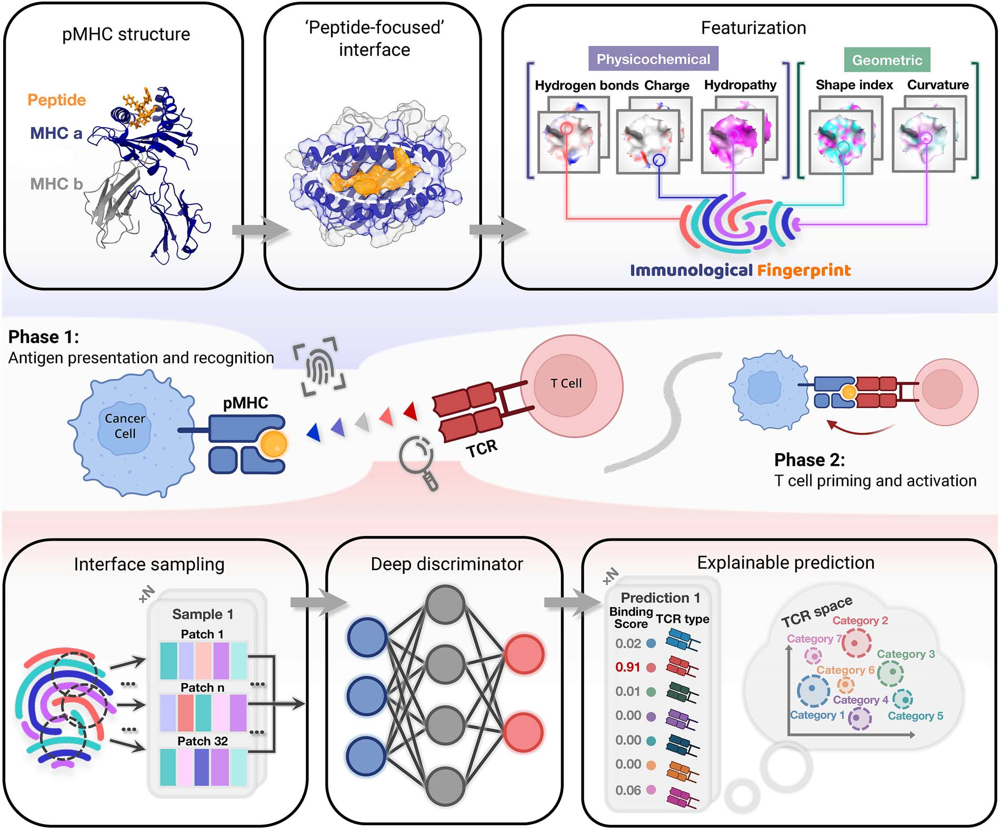
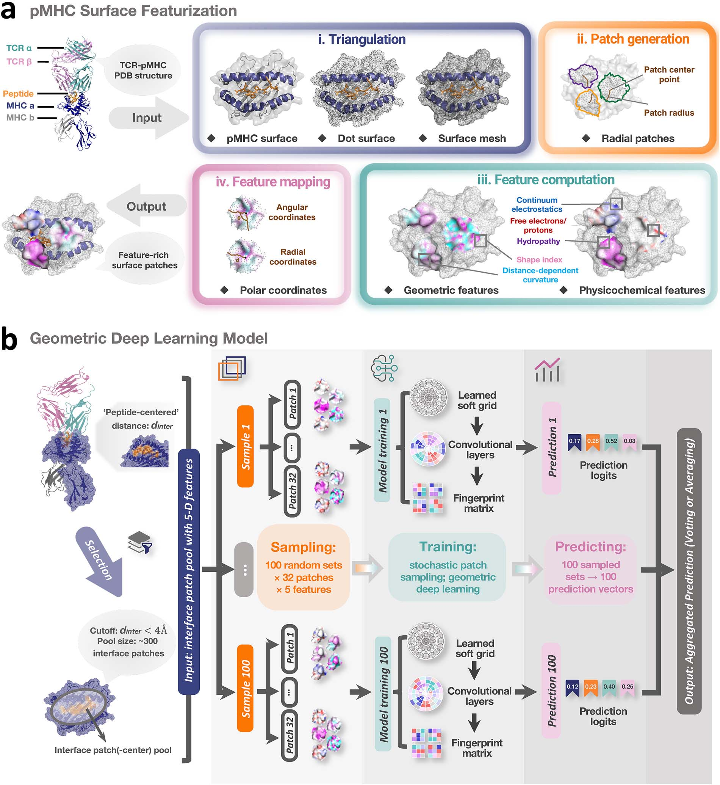
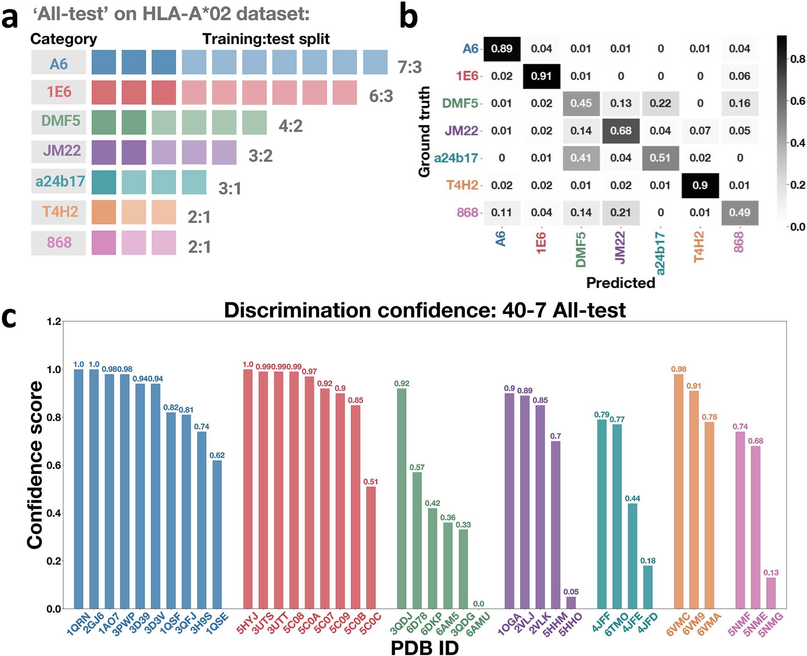
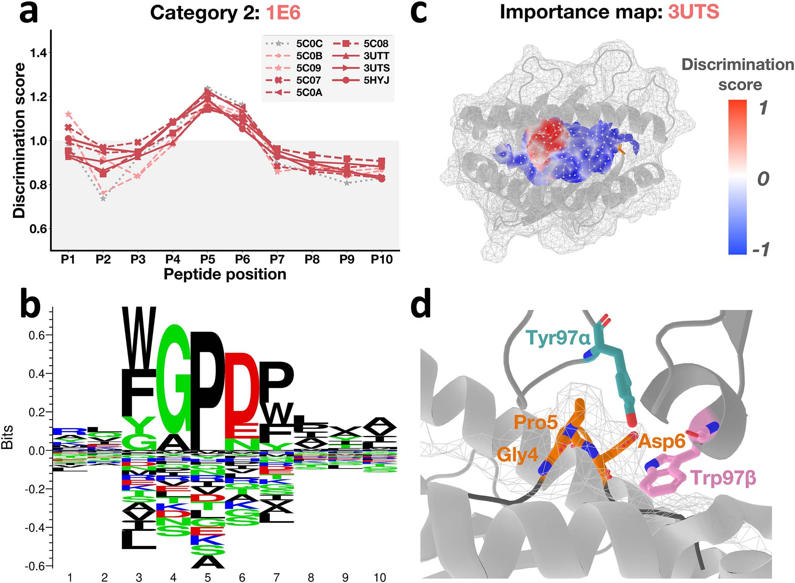
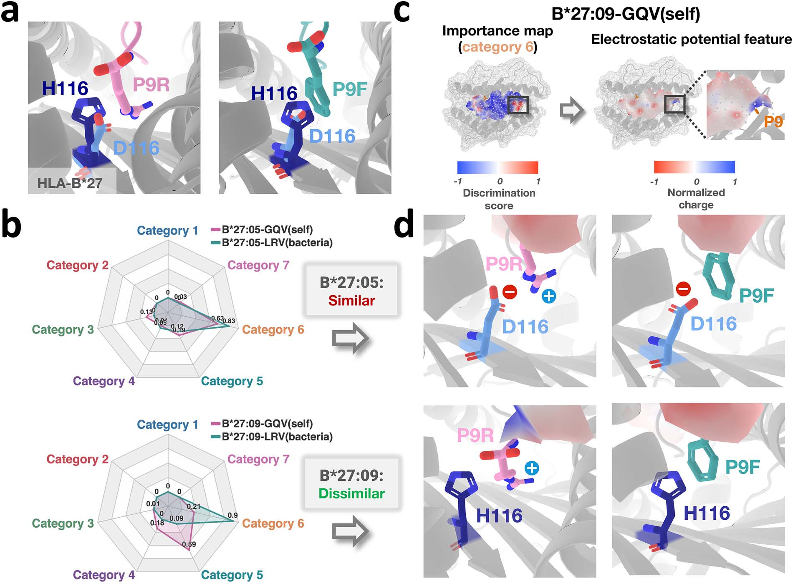

# IMPRINT解码TCR识别：几何深度学习捕捉pMHC界面免疫指纹

## 本文信息

- **标题**：通过免疫指纹的几何深度学习解码TCR识别
- **作者**：Chun Shang, Kevin C. Chan, Ruhong Zhou
- **发表时间**：2026年3月16日
- **单位**：浙江大学定量生物中心、浙江大学上海高等研究院（中国）；西交利物浦大学生物科学与生物信息学系（中国）等
- **引用格式**：Shang, C., Chan, K. C., & Zhou, R. (2026). Decoding TCR recognition via geometric deep learning of immunological fingerprints. *Briefings in Bioinformatics*, 27(2), bbag048. https://doi.org/10.1093/bib/bbag048

## 摘要

> T细胞受体（TCR）对肽段-主要组织相容性复合体（pMHC）分子的识别，是**适应性免疫激活的关键第一步**，决定了机体对病原体、肿瘤以及自身抗原的反应方式。尽管TCR–pMHC复合物已积累了相当数量的结构研究，这一识别过程的分子规律仍未被完全厘清，核心困难在于TCR同时表现出**高度特异性**与**广泛交叉反应性**。本文提出一个**多模态几何深度学习框架**，从pMHC界面系统提取并学习几何、理化与空间特征，以捕捉驱动TCR识别的关键免疫线索。应用于精心整理的**HLA-A\*02–肽段–TCR晶体结构数据集**后，模型能够稳健预测TCR结合偏好，并识别界面的**免疫指纹**特征。借助集成的可解释性分析，作者进一步定位了**关键接触残基和相互作用基序**，从而为TCR特异性的结构决定因素提供了可解释证据。最后，研究还在**HLA-B\*27–肽段复合物**上测试了模型的泛化能力，揭示了等位基因差异如何通过局部界面特征影响TCR识别。

### 核心结论

- **IMPRINT框架在HLA-A\*02数据集上实现0.80的平均判别准确率**，显著超过随机预期
- **发现了pMHC界面的“免疫指纹”模式**，被同一TCR识别的pMHC共享相似的界面特征
- **通过patch级可解释性分析识别关键接触残基**，如1E6 TCR识别中的“GPD”基序
- **零样本推理成功应用于HLA-B\*27**，揭示了单残基多态性（D116H）对TCR交叉反应性的影响

## 背景

**T细胞受体（TCR）识别pMHC分子**是适应性免疫系统最核心的分子事件之一。一个TCR是否能够识别某个肽段，不仅决定T细胞能否被激活，也直接关系到病原体清除、肿瘤免疫监视以及自身耐受能否维持。因此，TCR–pMHC识别规律既是基础免疫学问题，也是TCR工程、肿瘤免疫治疗和疫苗设计中的关键前提。

真正困难的地方在于，TCR识别天然具有“**既专一、又宽容**”的双重属性。一方面，TCR需要对少量关键界面差异保持敏感，才能区分不同抗原；另一方面，它又必须保留一定交叉反应性，才能在有限受体库条件下覆盖庞大的潜在病原体空间。原文在引言中强调，这种特异性与交叉反应性的并存，使得单靠序列模式或少数局部接触规则，很难完整解释TCR为何会识别某个pMHC而不识别另一个。

另一个现实瓶颈是**数据极度不对称**。人体内估计存在约$2.5 \times 10^7$个独特TCR克隆型，但目前可用于结构分析的TCR–pMHC复合物仍然只占极小一部分。与TCR repertoire（受体库）的巨大多样性相比，结构数据稀缺、类别分布不均、等位基因覆盖有限，都会限制模型训练与机制归纳。也正因此，作者并没有把问题简单设定为“序列配对预测”，而是转向更接近真实识别界面的**结构表面表示**。

### TCR–pMHC识别的挑战

当前TCR–pMHC识别研究面临以下挑战：

1. **结构数据稀缺**：尽管人体内存在约$2.5 \times 10^7$个独特TCR克隆型，但PDB数据库中可直接用于这类任务的TCR–pMHC复合物仍然很少，难以支撑大规模监督学习
2. **传统方法的局限**：很多结构分析依赖人工观察、接触统计或定性比较，能够提出解释，但不容易形成统一、可推广的判别模型
3. **界面信息高度多模态**：TCR同时感知表面形状、局部曲率、静电环境、疏水性与氢键供受体特征，而非只“看见”某几个残基
4. **可解释性要求高**：即使模型做出正确预测，研究者仍然希望知道到底是哪些界面局部patch、哪些肽段位置、哪些局部化学环境在驱动识别

### 分子表面表示的优势

分子表面提供了一种很适合处理这类问题的中观表示。与只看一级序列或残基接触表不同，表面表示会把蛋白质视为具有连续几何形貌和理化属性的三维对象，从而更直接地对应真实的分子识别界面。原文借鉴了**MaSIF**一类表面学习思路：先在分子表面定义局部patch，再把曲率、静电、疏水性以及氢键相关特征映射到这些局部patch上，最后交给几何深度网络学习。

从这个角度看，本文真正想回答的，不只是“某个TCR会不会结合”，而是：**pMHC表面是否存在可被学习、可被解释、并且能够跨体系迁移的免疫指纹**。如果这一点成立，那么结构生物学中的局部表面特征就能被组织成更系统的判别框架，而不再只是零散的结构观察。

### 关键科学问题

1. **pMHC界面是否包含可识别的免疫指纹**？被同一TCR识别的pMHC是否共享相似的界面特征模式？
2. **能否通过几何深度学习预测TCR结合偏好**？如何从pMHC界面提取和学习多模态特征？
3. **如何解释模型的预测结果**？哪些界面区域对TCR识别至关重要？
4. **模型能否泛化到不同HLA等位基因**？能否通过零样本推理揭示新的生物学机制？

### 创新点

- **提出IMPRINT框架**：基于分子表面的免疫指纹概念，系统提取pMHC界面的多模态几何和理化特征
- **几何深度学习管道**：结合表面三角剖分、径向patch采样和随机局部patch采样，实现端到端学习
- **可解释性分析**：通过patch级重要性评分识别关键接触残基和相互作用基序
- **跨等位基因泛化**：在HLA-B\*27上的零样本推理揭示单残基多态性的功能影响

---

## 研究内容

### 方法学概述

研究构建了**IMPRINT**（Immunological Fingerprinting）框架，通过表面判别建模分析TCR–pMHC识别。该框架包括四个主要步骤：

1. **数据集准备**：从PDB收集HLA-A\*02–肽段–TCR复合物结构，涵盖7个TCR类别共40个结构
2. **表面特征化**：计算pMHC界面的几何和理化特征，包括形状指数、静电势和疏水性
3. **深度学习建模**：训练几何深度网络预测TCR结合偏好
4. **可解释性分析**：通过patch级重要性评分解释模型预测

### IMPRINT框架的核心思想

> **核心假设**：pMHC界面——肽段周围的子表面——嵌入了指纹状的几何和理化特征模式，这些模式揭示了免疫学信息。被同一TCR识别的pMHC可能共享可以通过高维分析有效捕获的微妙界面特征模式。

**图1：基于表面的TCR–pMHC识别判别建模**
- **整体概念**：图中给出了IMPRINT的整体概念框架，TCR被概念化为**通过感知pMHC表面的免疫指纹来扫描潜在结合界面**
- **上部**：从pMHC界面提取免疫指纹的流程，包括**获取pMHC结构、计算分子表面、以肽段邻近区域定义界面**，并在界面上插值理化与几何特征
- **下部**：随机抽样得到的指纹片段局部patch被共同输入**深度网络**，用于**预测TCR结合偏好**，并通过输出与局部patch的相关性定位**高重要性区域**

### 数据集构建

#### HLA-A\*02数据集（训练集）

| 属性 | 详情 |
| --- | --- |
| **TCR类别** | 7种（A6：10个结构、1E6：9个、DMF5：6个、JM22：5个、a24b17：4个、868：3个、T4H2：3个） |
| **总结构数** | **40个复合物结构**（均为实验解析的晶体结构） |
| **肽段长度** | 9-10个氨基酸 |
| **选择标准** | 至少包含3个结构的TCR类别 |

#### HLA-B\*27数据集（测试集）

| 属性 | 详情 |
| --- | --- |
| **结构数** | **4个复合物结构** |
| **来源** | 2个B\*27:05复合物直接来自PDB；2个B\*27:09复合物通过**单点突变建模**并经**100 ns MD弛豫**后获得 |
| **生物学意义** | 与强直性脊柱炎（AS）等炎症性疾病相关 |
| **等位基因差异** | 包含疾病相关等位基因B\*27:05和非疾病相关等位基因B\*27:09 |

### 表面特征化流程

研究采用基于MaSIF框架的表面特征化管道，包含四个主要步骤：

1. **表面三角剖分**：将pMHC表面三角化为离散网格
2. **径向patch提取**：在每个网格顶点周围提取半径$r = 12$ Å的径向局部patch
3. **特征计算**：计算两个几何特征（形状指数、曲率）和三个理化特征（静电势、疏水性、氢键潜力）
4. **上下文映射**：将多模态特征映射到重叠表面局部patch的测地极坐标系中

对于每个天然pMHC结构，研究识别了距离任何肽段原子4 Å以内的表面点，并将以这些点为中心的局部patch定义为**界面patch**（通常有数百个）。

**图2：pMHC界面建模的几何深度学习流程**
- **图2a**：pMHC表面特征化管道的四个主要步骤，包括表面三角剖分、径向patch提取、特征计算和上下文映射
- **图2b**：模型架构通过**基于采样的随机建模方案**支持可解释性预测。对于每个pMHC，从数百个界面patch中**随机选择32个局部patch**输入几何深度网络。为提高鲁棒性，每个pMHC界面采样**100次**，最终通过**平均或多数投票**聚合预测

### 模型架构与训练策略

#### 集成学习框架

| 参数 | 设置 |
| --- | --- |
| **模型数量** | 训练**50个模型**的集成 |
| **采样策略** | 对于每个pMHC，随机采样**32个界面patch** |
| **重复采样** | 每个pMHC采样**100次**，产生100个预测向量 |
| **聚合方法** | 通过**向量平均**或**多数投票**得到最终预测 |

#### 交叉验证策略：All-test迭代验证

研究实施了名为“**All-test**”的迭代交叉验证策略，这一设计专门针对**小规模结构数据集**（仅40个晶体结构）的挑战。

**核心思想**：通过**多次迭代训练**，确保数据集中的**每一个结构最终都会被用作测试集**，从而充分利用有限的数据资源进行全面评估。

| 参数 | 设置 |
| --- | --- |
| **训练集** | 每次迭代**27个结构**（约70%） |
| **测试集** | 每次迭代**13个结构**（约30%） |
| **类别平衡** | 保持训练和测试集中TCR类别的结构分布一致 |
| **集成规模** | **50个模型**，每个在不同随机子集上训练 |
| **最终预测** | 通过**等权重集成**所有50个模型的预测结果 |

##### 关键设计考虑

- **随机迭代划分**：在50次迭代中，每次从40个结构中**随机采样**27个作为训练集，剩余13个作为测试集，每次迭代的划分都不同，确保每个结构最终都会在某些迭代中作为测试集
- **无独立验证集**：由于部分TCR类别样本极少（如MS1-A3只有2个结构），无法划出独立的验证集，而是通过交叉验证直接进行超参数调优
- **类别平衡约束**：每次划分训练/测试集时，确保7个TCR类别都能在两个子集中保持合理分布，避免某些类别在测试集中完全缺失
- **集成学习优势**：50个模型的预测结果通过等权重平均或多数投票聚合，显著降低了单一模型因数据划分偶然性而产生的方差。具体而言，对于每个测试结构，**收集所有将其作为测试实例的模型的预测向量**（每个向量是7个TCR类别的概率分布），然后对这些向量进行**算术平均**，每个模型的贡献完全平等

---

## 主要结果

### 模型在HLA-A\*02上的预测性能

研究在精心策划的HLA-A\*02数据集上评估了IMPRINT框架的预测性能。

#### 准确性评估

| 指标 | 结果 |
| --- | --- |
| **平均判别准确率** | **0.80**（显著超过随机预期的0.14） |
| **置信度分析** | 模型对正确预测的置信度显著高于错误预测 |
| **类别特异性** | 不同TCR类别的预测准确率存在差异，1E6 TCR达到最高准确率 |

**图3：HLA-A\*02结构的预测准确性与置信度交叉验证**
- **图3a**：各类别样本量分布，每轮约按7∶3划分为27个训练结构和13个测试结构
- **图3b**：判别准确率与混淆矩阵分析，给出不同类别之间的平均误判概率
- **图3c**：40个复合物各自的判别置信度，定义为对其**真实TCR类别**的**平均预测概率**。模型在全部40个复合物上达到**0.80的平均判别准确率**

#### 与现有方法对比

研究将IMPRINT与三种代表性方法进行了基准比较，包括结构方法**TCRen**以及两个序列预训练模型**TEINet**和**TEIM-Seq**。

| 方法 | 类别 | Top-1 准确率 | Top-3 准确率 | 说明 |
| --- | --- | --- | --- | --- |
| **TCRen** | 结构方法 | 未报告 | 未报告 | 具有竞争力的排序性能，与IMPRINT捕获的是**互补信息** |
| **TEINet** | 序列方法 | **0.35** | **0.78** | 序列预训练模型 |
| **TEIM-Seq** | 序列方法 | **0.48** | **0.75** | 序列预训练模型 |
| **IMPRINT** | 本研究 | **0.80** | - | 在相同评估设定下的 Top-1 判别准确率 |

因此，原文支持的更稳妥结论是：**IMPRINT在相同任务设定下优于两个序列预训练基线，并与TCRen形成互补的结构解释视角**。

### patch级可解释性分析

为揭示模型判别决策的免疫学机制，研究实现了**patch级可解释性分析框架**，核心思想是通过量化每个界面patch对TCR判别的贡献度，将抽象的预测转化为可解释的结构生物学洞察。

#### 分析方法：patch级归因分析

**具体步骤**：

| 步骤 | 操作 | 目的 |
| --- | --- | --- |
| **1. 收集预测向量** | 对于每个结构，收集所有将其作为测试实例的集成模型的预测向量。在HLA-A\*02交叉验证中，每个测试结构采样**100次**（每次随机选择32个patch），产生100个预测向量 | 获取该结构的完整预测分布 |
| **2. 筛选高置信度预测** | 选择**前**10**%的高置信度预测（即对真实类别预测概率最高的那些预测） | 聚焦于模型最有把握的预测 |
| **3. 统计patch频率** | 统计每个界面patch在这些高置信度预测中被采样的频率 | 识别哪些patch在正确预测中频繁出现 |
| **4. 归一化得分** | 将频率归一化，定义每个patch的**判别得分** | 消除不同patch采样次数的差异 |
| **5. 映射到表面** | 将判别得分映射到pMHC表面的对应patch位置 | 可视化关键区域 |

**得分解释**：判别得分高于平均值的patch表示对TCR判别有**更强贡献**，这些区域往往对应关键的接触残基或相互作用基序。

#### 1E6 TCR的识别模式

1E6 TCR在七个类别中实现了最高的判别准确率。研究对9个1E6类内结构的分析发现：

- **位置重要性谱**：肽段位置4-6的判别得分始终升高
- **保守基序**：这些位置与该类别肽段共享的保守“GPD”基序一致
- **结构特征**：这些高分区域对应肽段中央的局部凸起，尤其以Pro5为中心最为突出

**图4：1E6 TCR结合的 patch 级可解释性分析**
- **图4a**：9个HLA-A\*02–肽段–TCR结构的**判别得分谱**沿肽段位置分布。参考得分**1.0**表示所有界面patch的**平均贡献**
- **图4b**：1E6类别肽段序列的序列标识图，突出显示保守的“GPD”基序（肽段位置4-6）
- **图4c**：在3UTS结构上映射的归一化判别得分，红色区域表示高重要性局部patch
- **图4d**：结构图显示Tyr97α和Trp97β与以Pro5为中心的“GPD”基序形成互补作用

#### 关键接触残基识别

通过patch级归一化判别得分分析，研究识别了以下关键发现：

- **肽段中心区域**：位置4-6对TCR识别最关键
- **局部拓扑凸起**：该区域由“GPD”基序，尤其是Pro5，形成明显的表面凸起
- **相互作用模式**：TCR残基Tyr97α和Trp97β与这一中心区域形成互补相互作用

### 模型泛化能力：HLA-B\*27零样本推理

研究评估了模型跨HLA等位基因的泛化能力，使用HLA-B\*27–肽段–TCR复合物作为零样本推理案例。

#### 疾病相关背景

- **疾病关联**：HLA-B\*27与强直性脊柱炎（AS）等炎症性疾病相关
- **等位基因差异**：B\*27:05（疾病相关）与B\*27:09（非疾病相关）在位置116存在单残基多态性（D116H）
- **TCR交叉反应性**：AS衍生的**TCR AS4.3交叉识别**自身肽段 `self-GQV` 和细菌肽段 `bacterial-LRV`

#### 零样本推理方法

- **模型重训练**：使用**全部40个HLA-A\*02结构**重新训练单个判别模型（200个epoch），用于对4个HLA-B\*27–肽段结构进行推理。
- **大规模重复预测**：对每个HLA-B\*27–肽段结构，模型会通过反复随机采样**32个界面patch**来生成**10 000 次预测**。每次预测都输出一个**7维概率向量**，对应7个TCR类别。
- **相似度定义**：某个结构对特定TCR类别的相似度得分，定义为该类别在**全部10 000 次预测**中的**平均预测概率**。
- **归因分析**：针对目标类别（如类别6），选取**相似度最高的前10**%预测，再沿用HLA-A\*02数据集中的归因流程，计算并归一化patch级重要性得分，并将其映射回pMHC界面进行可视化。

#### 零样本推理结果

**图5：模型泛化实现HLA-B\*27交叉反应性的可解释性**
- **图5a**：自身来源GQV肽段（左）与细菌来源LRV肽段（右）分别结合**两种功能不同的HLA-B\*27等位基因**，图中标出了位于MHC结合槽底部、邻近肽段**P9**的**单残基替换D116H**
- **图5b**：基于用**全部40个HLA-A\*02复合物重新训练**的判别模型，对**四个HLA-B\*27–肽段界面**的**相似度推断结果**
- **图5c**：左侧为相对于类别6的**patch级判别得分映射**，右侧为对应区域的**表面电荷分布**，突出**P9附近**的局部差异
- **图5d**：四个HLA-B\*27–pMHC结构中残基116与肽段P9之间的残基接触网络，对比显示不同电荷匹配关系

#### 关键发现

| 等位基因 | 肽段 | 类别6相似度 | 类别5相似度 | 变化说明 |
| --- | --- | --- | --- | --- |
| **B\*27:05** | `self-GQV` | 0.63 | 0.19 | 基线水平 |
| **B\*27:05** | `bacterial-LRV` | 0.83 | - | 病原体肽段被明确识别为类别6 |
| **B\*27:09** | `self-GQV` | 0.21 | 0.59 | 类别6显著下降，类别5显著上升 |
| **B\*27:09** | `bacterial-LRV` | 0.84 | - | 保持一致，界面指纹得以保留 |

**机制解释**：

- **关键残基**：patch级归一化分析识别出MHC残基116是驱动类别6推断的最具影响力因素
- **物理属性**：特征分析揭示静电势是该区域最具判别性的属性
- **突变效应**：D116H取代显著改变了局部静电环境，从而影响了TCR识别模式

### 方法学的生物学意义

#### 表面指纹的有效性

研究结果支持pMHC界面包含可识别的免疫指纹模式：

- **模式共享**：被同一TCR识别的pMHC共享相似的界面特征
- **高维特征**：多模态几何和理化特征能够编码功能相关信息
- **可学习性**：几何深度网络能够有效学习这些模式

#### 可解释性的价值

IMPRINT框架的可解释性模块提供了：

- **关键区域识别**：精确定位对TCR识别至关重要的界面区域
- **相互作用基序**：揭示保守的序列和结构特征
- **机制洞察**：理解等位基因多态性如何影响TCR交叉反应性

---

## 关键结论与批判性总结

### 主要发现

本研究通过IMPRINT框架系统揭示了TCR–pMHC识别的分子基础：

1. **免疫指纹的普遍性**：pMHC界面确实包含可识别的几何和理化特征模式，被同一TCR识别的pMHC共享这些“免疫指纹”
2. **预测性能的优越性**：IMPRINT在HLA-A\*02数据集上实现0.80的平均准确率，显著优于现有方法
3. **可解释性进展**：patch级分析揭示了关键接触残基和相互作用基序，如1E6 TCR识别中的“GPD”基序
4. **跨等位基因泛化**：零样本推理在HLA-B\*27上成功揭示了单残基多态性对TCR交叉反应性的机制影响

### 研究意义

| 意义类型 | 详情 |
| --- | --- |
| **理论意义** | 为TCR特异性和交叉反应性的双重性提供了结构解释 |
| **方法学意义** | 展示了表面多模态特征在蛋白质-蛋白质相互作用预测中的强大潜力 |
| **临床应用前景** | 为理解HLA等位基因多态性与疾病关联的分子机制提供了新工具 |
| **药物开发启示** | 可指导TCR工程疗法的设计和优化 |

### 局限性

| 局限性 | 详情 |
| --- | --- |
| **数据规模限制** | 仅使用40个HLA-A\*02结构进行训练，数据集规模仍然较小 |
| **等位基因覆盖** | 主要关注HLA-A\*02，对其他HLA等位基因的验证有限 |
| **体内验证缺失** | 预测结果需要进一步的实验验证，特别是在体内环境中 |
| **结合亲和力数据** | 缺乏定量结合亲和力数据，限制了模型对结合强度的预测能力 |

### 潜在影响

1. **免疫学机制研究**：为理解TCR识别的分子基础提供了新视角和工具
2. **个性化医疗**：可帮助预测患者特定TCR对病原体或肿瘤抗原的反应性
3. **疫苗设计**：指导优化疫苗抗原以引发所需的T细胞反应
4. **自身免疫病**：深化对HLA等位基因多态性与疾病关联机制的理解
